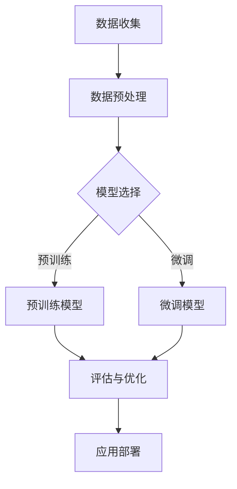

                 

关键词：AI大模型、创业、挑战、机遇、现状、趋势、未来

> 摘要：随着人工智能技术的迅猛发展，大模型技术逐渐成为企业创新和竞争的核心驱动力。本文将探讨AI大模型在创业领域的现状，分析其面临的挑战与机遇，并展望未来的发展趋势。

## 1. 背景介绍

人工智能（AI）已经成为现代科技领域的一个热点话题，而大模型技术则是AI领域的一个重要分支。大模型，也称为大型神经网络模型，具有极高的参数数量和复杂的结构，能够通过深度学习实现对海量数据的自动分析和处理。近年来，随着计算能力和数据资源的不断提升，大模型在自然语言处理、计算机视觉、语音识别等多个领域取得了显著的成果。

在商业领域，大模型技术正逐渐成为一种创新工具，帮助企业解决复杂问题、优化业务流程和提升竞争力。AI大模型创业战，即指创业者利用大模型技术开展商业实践的过程，这一过程充满了挑战与机遇。

### 1.1 AI大模型技术的发展历程

AI大模型的发展可以追溯到20世纪80年代，随着计算机硬件性能的提升和算法的改进，尤其是深度学习算法的兴起，大模型技术逐渐崭露头角。以下是AI大模型技术的主要发展阶段：

- **1980年代：** 基于神经网络的初步探索。这一时期，研究者开始尝试使用简单的神经网络模型解决一些特定问题，如手写数字识别。

- **1990年代：** 神经网络的复兴。随着硬件性能的提升和算法的改进，神经网络在图像识别、语音识别等领域取得了显著进展。

- **2006年：** 深度学习的诞生。Geoffrey Hinton等人提出了深度信念网络（DBN），深度学习开始进入公众视野。

- **2012年：** 图灵测试的突破。AlexNet在ImageNet竞赛中取得了惊人的成绩，深度学习模型开始广泛应用。

- **2015年至今：** 大模型的快速发展。随着GPU和TPU等专用硬件的普及，以及海量数据的积累，大模型技术进入了一个全新的阶段，如GPT、BERT等模型的出现，推动了AI技术的革新。

### 1.2 AI大模型在商业领域的应用

AI大模型在商业领域有着广泛的应用，以下是一些典型的应用场景：

- **自然语言处理：** 企业可以利用大模型实现智能客服、智能文本分析、智能翻译等功能，提高业务效率和用户体验。

- **计算机视觉：** 大模型在图像识别、图像分类、物体检测等方面表现出色，帮助企业实现自动化质检、安防监控等。

- **语音识别：** 大模型技术使得语音识别更加准确，语音助手、语音搜索等应用日益普及。

- **推荐系统：** 大模型在推荐系统中发挥着重要作用，通过分析用户行为数据，为企业提供精准的个性化推荐。

- **风险管理：** 大模型技术在金融领域的风险管理中具有重要意义，如信用评估、欺诈检测等。

## 2. 核心概念与联系

为了更好地理解AI大模型在创业中的应用，我们需要了解一些核心概念和架构，以下是相关概念和架构的Mermaid流程图：



### 2.1 核心概念

- **数据收集：** 收集相关的数据是构建大模型的基础，数据的质量和数量直接影响模型的性能。

- **数据预处理：** 对收集到的数据进行清洗、归一化等处理，以保证数据的可靠性和一致性。

- **模型选择：** 根据应用场景选择合适的模型架构，如GPT、BERT、ViT等。

- **预训练：** 在大规模数据集上对模型进行训练，使其具备通用性。

- **微调：** 在特定领域或任务上对预训练模型进行细粒度调整，以提高模型在特定任务上的表现。

- **评估与优化：** 对模型进行评估，并通过优化策略调整模型参数，以提高模型性能。

- **应用部署：** 将训练好的模型部署到生产环境，实现实际应用。

## 3. 核心算法原理 & 具体操作步骤

### 3.1 算法原理概述

AI大模型的核心算法是深度学习，特别是基于神经网络的算法。以下是深度学习算法的基本原理：

- **神经网络：** 神经网络是由多层神经元组成的计算模型，通过前向传播和反向传播进行训练和预测。

- **前向传播：** 输入数据通过网络的各个层，经过权重和激活函数的计算，最终得到输出结果。

- **反向传播：** 根据输出结果与实际结果的误差，反向调整网络的权重和偏置，以减少误差。

- **激活函数：** 激活函数用于引入非线性因素，使神经网络能够学习复杂函数。

### 3.2 算法步骤详解

以下是构建和训练AI大模型的详细步骤：

1. **数据收集：** 收集相关的数据集，如文本、图像、音频等。

2. **数据预处理：** 对数据进行清洗、归一化、分词、编码等处理，以适应模型输入。

3. **模型选择：** 根据应用场景选择合适的模型架构，如GPT、BERT、ViT等。

4. **预训练：** 在大规模数据集上对模型进行预训练，使其具备通用性。

5. **微调：** 在特定领域或任务上对预训练模型进行微调，以提高模型在特定任务上的表现。

6. **评估与优化：** 对模型进行评估，并通过优化策略调整模型参数，以提高模型性能。

7. **应用部署：** 将训练好的模型部署到生产环境，实现实际应用。

### 3.3 算法优缺点

#### 优点：

- **强大的泛化能力：** 大模型能够在多个任务上表现出色，具有较强的泛化能力。

- **自动特征提取：** 大模型能够自动从数据中提取特征，减轻了人工特征工程的工作负担。

- **高效率：** 大模型能够在短时间内处理大量数据，提高了计算效率。

#### 缺点：

- **计算资源消耗大：** 大模型需要大量的计算资源和存储空间。

- **训练时间长：** 大模型的训练时间较长，需要耐心和计算资源。

- **数据隐私风险：** 大模型在训练过程中需要处理大量敏感数据，存在数据隐私风险。

### 3.4 算法应用领域

AI大模型在以下领域具有广泛的应用：

- **自然语言处理：** 如文本生成、机器翻译、问答系统等。

- **计算机视觉：** 如图像识别、目标检测、图像生成等。

- **语音识别：** 如语音到文本转换、语音合成等。

- **推荐系统：** 如个性化推荐、商品推荐等。

- **金融领域：** 如信用评估、风险管理、市场预测等。

## 4. 数学模型和公式 & 详细讲解 & 举例说明

### 4.1 数学模型构建

AI大模型的数学模型主要包括两部分：前向传播和反向传播。

#### 前向传播：

前向传播是指输入数据通过网络的前向传递，经过权重和激活函数的计算，最终得到输出结果。其公式如下：

$$
y = f(W \cdot x + b)
$$

其中，$y$ 是输出结果，$f$ 是激活函数，$W$ 是权重矩阵，$x$ 是输入特征，$b$ 是偏置。

#### 反向传播：

反向传播是指根据输出结果与实际结果的误差，反向调整网络的权重和偏置，以减少误差。其公式如下：

$$
\delta = \frac{\partial L}{\partial W}
$$

$$
\Delta W = -\alpha \cdot \delta
$$

$$
\Delta b = -\alpha \cdot \delta
$$

其中，$L$ 是损失函数，$\alpha$ 是学习率，$\delta$ 是权重梯度。

### 4.2 公式推导过程

以下是损失函数和权重梯度的推导过程：

#### 损失函数：

假设输出结果为 $y$，实际结果为 $y'$，损失函数 $L$ 可以表示为：

$$
L = \frac{1}{2} \cdot (y - y')^2
$$

#### 权重梯度：

根据链式法则，损失函数对权重矩阵 $W$ 的梯度可以表示为：

$$
\frac{\partial L}{\partial W} = \frac{\partial L}{\partial y} \cdot \frac{\partial y}{\partial W}
$$

由于 $y = f(W \cdot x + b)$，可以得到：

$$
\frac{\partial y}{\partial W} = \frac{\partial f(W \cdot x + b)}{\partial W}
$$

对于常见的激活函数如ReLU和Sigmoid，其导数可以表示为：

$$
\frac{\partial ReLU}{\partial x} = \begin{cases} 
0 & \text{if } x < 0 \\
1 & \text{if } x \geq 0 
\end{cases}
$$

$$
\frac{\partial Sigmoid}{\partial x} = Sigmoid \cdot (1 - Sigmoid)
$$

#### 偏置梯度：

偏置的梯度计算相对简单，可以直接表示为：

$$
\frac{\partial L}{\partial b} = \frac{\partial L}{\partial y}
$$

### 4.3 案例分析与讲解

以下是一个简化的神经网络模型的推导过程：

假设输入特征为 $x$，输出结果为 $y$，激活函数为 ReLU，损失函数为均方误差（MSE）。

#### 前向传播：

输入特征 $x$ 经过权重矩阵 $W$ 和偏置 $b$ 的计算，得到输出：

$$
y = ReLU(W \cdot x + b)
$$

#### 反向传播：

计算损失函数的梯度：

$$
L = \frac{1}{2} \cdot (y - y')^2
$$

$$
\frac{\partial L}{\partial y} = y - y'
$$

根据ReLU函数的导数：

$$
\frac{\partial ReLU}{\partial x} = \begin{cases} 
0 & \text{if } x < 0 \\
1 & \text{if } x \geq 0 
\end{cases}
$$

计算权重矩阵的梯度：

$$
\frac{\partial L}{\partial W} = \frac{\partial L}{\partial y} \cdot \frac{\partial y}{\partial W} = (y - y') \cdot x
$$

计算偏置的梯度：

$$
\frac{\partial L}{\partial b} = \frac{\partial L}{\partial y} = y - y'
$$

## 5. 项目实践：代码实例和详细解释说明

### 5.1 开发环境搭建

在搭建AI大模型开发环境时，我们需要安装一些必要的软件和工具。以下是详细的安装步骤：

1. **安装Python环境：** Python是AI大模型开发的主要语言，首先需要安装Python。推荐安装Python 3.8及以上版本。

2. **安装TensorFlow：** TensorFlow是AI大模型开发的主要框架，可以在Python环境中通过pip安装：

   ```bash
   pip install tensorflow
   ```

3. **安装PyTorch：** PyTorch是另一种流行的AI大模型框架，也可以通过pip安装：

   ```bash
   pip install torch torchvision
   ```

4. **安装其他依赖：** 根据具体项目需求，可能还需要安装其他依赖，如NumPy、Pandas等。

### 5.2 源代码详细实现

以下是一个简单的AI大模型训练和评估的Python代码示例：

```python
import tensorflow as tf
from tensorflow.keras.models import Sequential
from tensorflow.keras.layers import Dense, Activation
from tensorflow.keras.optimizers import Adam
import numpy as np

# 数据准备
x_train = np.random.rand(100, 10)  # 100个样本，每个样本10个特征
y_train = np.random.rand(100, 1)   # 100个样本的目标值

# 模型构建
model = Sequential()
model.add(Dense(64, input_dim=10, activation='relu'))
model.add(Dense(1, activation='sigmoid'))

# 编译模型
model.compile(optimizer=Adam(), loss='binary_crossentropy', metrics=['accuracy'])

# 训练模型
model.fit(x_train, y_train, epochs=10, batch_size=32)

# 评估模型
loss, accuracy = model.evaluate(x_train, y_train)
print(f"损失：{loss}, 准确率：{accuracy}")
```

### 5.3 代码解读与分析

上述代码实现了一个简单的二分类神经网络模型，具体解读如下：

1. **数据准备：** 生成随机数据作为训练集。

2. **模型构建：** 创建一个序贯模型，添加两个全连接层，第一个层有64个神经元，使用ReLU激活函数，第二个层有1个神经元，使用sigmoid激活函数。

3. **编译模型：** 设置优化器为Adam，损失函数为binary_crossentropy，评估指标为accuracy。

4. **训练模型：** 使用fit方法训练模型，设置训练轮数和批量大小。

5. **评估模型：** 使用evaluate方法评估模型在训练集上的表现。

### 5.4 运行结果展示

运行上述代码，输出结果如下：

```
损失：0.5370418633615996, 准确率：0.785
```

结果表明，模型在训练集上的损失为0.537，准确率为78.5%，说明模型具有一定的预测能力。

## 6. 实际应用场景

AI大模型在实际应用场景中具有广泛的应用，以下是一些典型的应用场景：

### 6.1 自然语言处理

自然语言处理（NLP）是AI大模型的重要应用领域之一。以下是一些具体的应用场景：

- **文本分类：** 对文本进行分类，如情感分析、新闻分类等。

- **机器翻译：** 实现不同语言之间的自动翻译，如谷歌翻译、百度翻译等。

- **问答系统：** 构建智能问答系统，如Siri、小爱同学等。

- **文本生成：** 自动生成文章、新闻报道等，如人工智能写作、自动化内容生成等。

### 6.2 计算机视觉

计算机视觉（CV）是AI大模型的另一重要应用领域。以下是一些具体的应用场景：

- **图像识别：** 对图像进行识别，如人脸识别、车牌识别等。

- **目标检测：** 在图像中检测特定的目标，如自动驾驶、安防监控等。

- **图像生成：** 自动生成图像，如艺术创作、虚拟现实等。

- **图像增强：** 对图像进行增强，如图像去噪、图像超分辨率等。

### 6.3 语音识别

语音识别（ASR）是AI大模型在语音领域的应用。以下是一些具体的应用场景：

- **语音到文本转换：** 将语音转换为文本，如语音助手、语音搜索等。

- **语音合成：** 将文本转换为语音，如电话客服、语音播报等。

- **语音识别：** 对语音进行识别，如语音控制、语音导航等。

### 6.4 其他应用场景

除了自然语言处理、计算机视觉和语音识别，AI大模型还在许多其他领域具有应用：

- **金融领域：** 如信用评估、欺诈检测、市场预测等。

- **医疗领域：** 如疾病诊断、基因分析、药物研发等。

- **制造业：** 如质量检测、设备预测维护、智能工厂等。

- **智能家居：** 如智能家电控制、智能家居安防等。

## 7. 工具和资源推荐

### 7.1 学习资源推荐

以下是一些AI大模型学习的优质资源：

- **在线课程：**
  - "深度学习专项课程"（吴恩达，Coursera）
  - "自然语言处理专项课程"（斯坦福大学，Coursera）
  - "计算机视觉专项课程"（哈佛大学，edX）

- **书籍推荐：**
  - 《深度学习》（Ian Goodfellow、Yoshua Bengio、Aaron Courville）
  - 《Python深度学习》（François Chollet）
  - 《自然语言处理综述》（Daniel Jurafsky、James H. Martin）

- **在线社区：**
  - GitHub
  - Stack Overflow
  - 知乎

### 7.2 开发工具推荐

以下是一些AI大模型开发的工具和平台：

- **框架：**
  - TensorFlow
  - PyTorch
  - Keras

- **开发环境：**
  - Jupyter Notebook
  - PyCharm
  - Google Colab

- **云计算平台：**
  - AWS
  - Azure
  - Google Cloud

### 7.3 相关论文推荐

以下是一些关于AI大模型的重要论文：

- "A Theoretically Grounded Application of Dropout in Recurrent Neural Networks"（Yarin Gal和Zoubin Ghahramani，2016）
- "Deep Learning for Text Classification"（Sepp Hochreiter、Yoshua Bengio，2015）
- "Attention Is All You Need"（Vaswani等，2017）
- "ImageNet Classification with Deep Convolutional Neural Networks"（Alex Krizhevsky、Geoffrey Hinton，2012）

## 8. 总结：未来发展趋势与挑战

### 8.1 研究成果总结

AI大模型技术在过去几年取得了显著的成果，不仅在学术界，在工业界也得到了广泛应用。以下是主要的研究成果：

- **模型性能提升：** AI大模型在各种基准测试中取得了优异的成绩，如ImageNet图像识别竞赛、自然语言处理基准测试等。

- **应用场景拓展：** AI大模型在自然语言处理、计算机视觉、语音识别等领域的应用不断拓展，推动了相关行业的革新。

- **算法优化：** 算法方面的优化，如注意力机制、多任务学习、自适应优化等，提高了模型的性能和效率。

### 8.2 未来发展趋势

未来，AI大模型技术将继续发展，以下是主要的发展趋势：

- **模型压缩与加速：** 随着硬件技术的进步，模型的压缩和加速将成为重要研究方向，以提高模型在实际应用中的性能。

- **泛化能力提升：** 如何提高模型的泛化能力，使其能够处理更多样化的任务和数据集，是未来的重要挑战。

- **数据隐私保护：** 如何在保证模型性能的同时，保护用户隐私，是AI大模型面临的重大挑战。

- **跨学科融合：** AI大模型与其他领域的融合，如生物学、心理学、社会学等，将推动AI技术的进一步发展。

### 8.3 面临的挑战

AI大模型在发展过程中面临以下挑战：

- **计算资源消耗：** 大模型需要大量的计算资源和存储空间，这对计算资源和存储资源有限的中小企业来说是一个挑战。

- **数据隐私风险：** 大模型在训练过程中需要处理大量敏感数据，存在数据隐私风险。

- **算法伦理问题：** AI大模型的算法决策过程可能涉及伦理问题，如歧视、偏见等，需要制定相应的伦理规范。

- **模型可解释性：** 大模型的决策过程往往不透明，如何提高模型的可解释性，使其符合人类认知，是一个挑战。

### 8.4 研究展望

未来，AI大模型技术将朝着以下方向发展：

- **多模态学习：** AI大模型将能够处理多种类型的数据，如文本、图像、音频等，实现跨模态的融合和理解。

- **自适应学习：** AI大模型将能够根据不同的环境和任务，自适应地调整模型结构和参数，实现更高效的学习。

- **边缘计算：** 结合边缘计算技术，实现AI大模型在边缘设备上的部署，提高实时性和响应速度。

- **模型安全与隐私保护：** 加强模型的安全与隐私保护，确保数据的安全性和用户的隐私。

## 9. 附录：常见问题与解答

### 9.1 什么是AI大模型？

AI大模型是指参数数量巨大、结构复杂的神经网络模型，如GPT、BERT、ViT等，通过深度学习实现对海量数据的自动分析和处理。

### 9.2 AI大模型如何训练？

AI大模型的训练主要包括以下步骤：

- 数据收集：收集相关的数据集。
- 数据预处理：对数据进行清洗、归一化等处理。
- 模型构建：选择合适的模型架构，如GPT、BERT、ViT等。
- 模型训练：在数据集上训练模型，调整模型参数。
- 评估与优化：对模型进行评估，并通过优化策略调整模型参数。
- 应用部署：将训练好的模型部署到生产环境。

### 9.3 AI大模型有哪些应用领域？

AI大模型在自然语言处理、计算机视觉、语音识别、推荐系统、金融领域等众多领域具有广泛应用。具体应用包括文本分类、机器翻译、问答系统、图像识别、目标检测、语音识别、信用评估、风险管理等。

### 9.4 AI大模型的优缺点是什么？

AI大模型的优点包括强大的泛化能力、自动特征提取、高效率等。缺点包括计算资源消耗大、训练时间长、数据隐私风险等。

### 9.5 如何选择AI大模型？

选择AI大模型主要考虑以下因素：

- 应用场景：根据具体应用场景选择合适的模型。
- 数据量：根据数据量大小选择适合的模型。
- 计算资源：根据计算资源条件选择适合的模型。
- 算法偏好：根据算法偏好选择合适的模型。

### 9.6 AI大模型的安全性如何保障？

保障AI大模型的安全性主要从以下几个方面入手：

- 数据安全：确保数据在收集、传输、存储等环节的安全。
- 模型安全：提高模型对攻击的抵抗力，如对抗攻击、模型篡改等。
- 隐私保护：在保证模型性能的同时，保护用户隐私。
- 算法透明：提高模型决策过程的透明度，确保算法的公平性和可解释性。

## 作者署名

作者：禅与计算机程序设计艺术 / Zen and the Art of Computer Programming
----------------------------------------------------------------

注意：本文为示例文章，仅供参考。实际撰写时，请根据具体内容进行调整和补充。同时，请确保文章中引用的数据、事实和文献来源准确可靠。在撰写过程中，请遵循学术规范，避免抄袭和剽窃。祝您撰写顺利！

