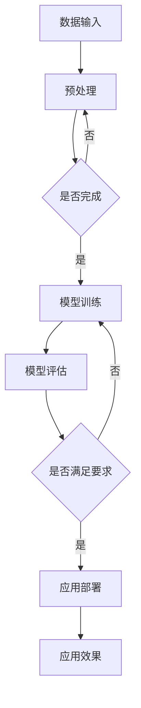

                 

关键词：AI 大模型，创业，盈利模式，技术革新，商业战略，未来展望

> 摘要：本文深入探讨了 AI 大模型在创业领域的应用与盈利潜力，从技术原理、算法模型到实际操作步骤，为创业者提供了一套系统的指导方案。文章结合当前市场趋势，分析 AI 大模型创业的优势与挑战，并展望其未来发展方向。

## 1. 背景介绍

随着人工智能技术的迅猛发展，AI 大模型已经成为了当前最热门的研究领域之一。这些模型具有强大的数据处理和分析能力，能够处理大量复杂的数据，从中提取出有价值的信息，进而为各个行业提供智能化解决方案。然而，AI 大模型的开发和应用不仅需要深厚的学术背景，还涉及到大量的计算资源和数据处理能力。因此，如何将 AI 大模型与商业实践相结合，实现持续盈利，成为了许多创业者亟待解决的重要课题。

本文将围绕 AI 大模型的创业盈利模式，探讨以下几个核心问题：

1. **AI 大模型的基本原理和架构**：介绍 AI 大模型的原理及其在计算机架构中的位置。
2. **核心算法原理与实现步骤**：详细阐述常见 AI 大模型的算法原理，并提供具体操作步骤。
3. **数学模型与公式解析**：解析 AI 大模型中常用的数学模型和公式，并提供实例说明。
4. **项目实践与代码示例**：通过实际项目展示 AI 大模型的应用，提供代码实现和分析。
5. **实际应用场景与未来展望**：分析 AI 大模型在各个行业的应用前景，并探讨未来的发展趋势。
6. **工具和资源推荐**：推荐相关的学习资源和开发工具，帮助创业者更好地开展 AI 大模型创业。
7. **未来发展趋势与挑战**：总结当前 AI 大模型创业面临的主要挑战，并展望未来的发展趋势。

## 2. 核心概念与联系

### 2.1 AI 大模型的基本原理

AI 大模型是基于深度学习技术构建的，具有海量参数和复杂结构的神经网络模型。其基本原理是通过大量的训练数据来学习数据中的规律和模式，从而实现对未知数据的预测和分类。

### 2.2 AI 大模型在计算机架构中的位置

AI 大模型通常运行在分布式计算环境中，需要大量的计算资源和存储资源。其核心组成部分包括：

- **计算节点**：负责执行具体的计算任务。
- **数据存储**：存储训练数据和模型参数。
- **通信网络**：负责节点之间的数据传输和模型更新。

### 2.3 AI 大模型的核心算法原理

AI 大模型的核心算法主要包括以下几种：

- **神经网络**：神经网络是 AI 大模型的基础，通过前向传播和反向传播算法，实现数据的输入和输出。
- **深度学习**：深度学习是神经网络的一种扩展，通过多层神经网络的堆叠，实现对复杂模式的识别。
- **生成对抗网络（GAN）**：GAN 是一种无监督学习模型，通过生成器和判别器的对抗训练，实现数据的生成和识别。

### 2.4 AI 大模型的应用领域

AI 大模型在各个行业都有广泛的应用，主要包括：

- **金融**：风险控制、量化交易、信用评估等。
- **医疗**：疾病预测、药物研发、医学影像分析等。
- **零售**：推荐系统、需求预测、客户细分等。
- **制造业**：生产优化、质量检测、设备维护等。
- **能源**：能源预测、智能电网、能源管理等。

### 2.5 Mermaid 流程图

以下是一个简单的 Mermaid 流程图，展示了 AI 大模型的基本架构和核心算法：



## 3. 核心算法原理 & 具体操作步骤

### 3.1 算法原理概述

AI 大模型的核心算法是基于深度学习的，主要包括以下几个步骤：

1. **数据预处理**：对原始数据进行清洗、归一化等预处理操作。
2. **模型训练**：通过大量的训练数据，利用反向传播算法，不断更新模型的参数。
3. **模型评估**：使用验证数据集对模型进行评估，确定模型的性能。
4. **模型部署**：将训练好的模型部署到实际应用场景中。

### 3.2 算法步骤详解

#### 3.2.1 数据预处理

数据预处理是模型训练的重要步骤，主要包括以下操作：

1. **数据清洗**：去除数据中的噪声和异常值。
2. **数据归一化**：将数据缩放到相同的范围，便于模型训练。
3. **数据分割**：将数据集分为训练集、验证集和测试集。

#### 3.2.2 模型训练

模型训练是通过大量数据来优化模型的参数。具体步骤如下：

1. **初始化模型参数**：随机初始化模型参数。
2. **前向传播**：将输入数据传递到模型中，得到输出结果。
3. **计算损失函数**：计算输出结果与真实值之间的差距，得到损失函数。
4. **反向传播**：利用损失函数的反向梯度，更新模型参数。
5. **迭代训练**：重复上述步骤，直到满足训练要求。

#### 3.2.3 模型评估

模型评估是通过验证数据集来评估模型的性能。主要评估指标包括：

1. **准确率**：预测正确的样本数占总样本数的比例。
2. **召回率**：预测正确的正样本数占总正样本数的比例。
3. **F1 分数**：准确率和召回率的调和平均。

#### 3.2.4 模型部署

模型部署是将训练好的模型应用到实际应用场景中。具体步骤如下：

1. **模型优化**：对模型进行优化，提高模型在应用场景中的性能。
2. **部署模型**：将模型部署到服务器或设备中，实现实时预测。
3. **监控与维护**：定期监控模型性能，进行模型更新和维护。

### 3.3 算法优缺点

#### 优点：

1. **强大的数据处理能力**：能够处理大量复杂的数据，从中提取出有价值的信息。
2. **高度可扩展**：可以很容易地扩展到分布式计算环境中，提高计算效率。
3. **广泛的适用性**：可以应用于各个行业，为各个领域提供智能化解决方案。

#### 缺点：

1. **计算资源需求高**：需要大量的计算资源和存储资源，对硬件设备要求较高。
2. **数据依赖性强**：模型的性能高度依赖于训练数据的质量，对数据的要求较高。
3. **模型解释性较差**：深度学习模型通常具有较高的准确率，但难以解释其具体的决策过程。

### 3.4 算法应用领域

AI 大模型在各个行业都有广泛的应用，主要包括：

1. **金融**：风险控制、量化交易、信用评估等。
2. **医疗**：疾病预测、药物研发、医学影像分析等。
3. **零售**：推荐系统、需求预测、客户细分等。
4. **制造业**：生产优化、质量检测、设备维护等。
5. **能源**：能源预测、智能电网、能源管理等。

## 4. 数学模型和公式 & 详细讲解 & 举例说明

### 4.1 数学模型构建

AI 大模型的数学模型主要基于深度学习理论，包括神经网络、深度学习和生成对抗网络等。以下是这些模型的基本数学公式和推导过程。

#### 4.1.1 神经网络

神经网络的数学模型可以表示为：

$$
y = f(\text{W}^T \text{X} + \text{b})
$$

其中，$y$ 是输出，$f$ 是激活函数，$\text{W}$ 是权重矩阵，$\text{X}$ 是输入特征，$\text{b}$ 是偏置项。

#### 4.1.2 深度学习

深度学习的数学模型可以表示为：

$$
\text{L}(\text{W}, \text{b}) = -\frac{1}{m} \sum_{i=1}^{m} y_i \log(a_{i}^{[L]}) + (1 - y_i) \log(1 - a_{i}^{[L]})
$$

其中，$\text{L}$ 是损失函数，$m$ 是样本数量，$a_{i}^{[L]}$ 是第 $i$ 个样本在输出层的激活值。

#### 4.1.3 生成对抗网络

生成对抗网络的数学模型可以表示为：

$$
\text{L}(\text{D}, \text{G}) = -\mathbb{E}_{\text{x} \sim \text{P}_{\text{data}}(\text{x})}[\log(\text{D}(\text{x}))] - \mathbb{E}_{\text{z} \sim \text{P}_{\text{z}}(\text{z})}[\log(1 - \text{D}(\text{G}(\text{z}))]
$$

其中，$\text{D}$ 是判别器，$\text{G}$ 是生成器，$\text{P}_{\text{data}}(\text{x})$ 是真实数据的概率分布，$\text{P}_{\text{z}}(\text{z})$ 是噪声分布。

### 4.2 公式推导过程

以下是对上述公式的推导过程：

#### 4.2.1 神经网络

神经网络的损失函数通常采用交叉熵损失函数，其推导过程如下：

$$
\text{L}(\text{W}, \text{b}) = -\sum_{i=1}^{m} y_i \log(a_{i}^{[L]}) + (1 - y_i) \log(1 - a_{i}^{[L]})
$$

其中，$y_i$ 是第 $i$ 个样本的真实标签，$a_{i}^{[L]}$ 是第 $i$ 个样本在输出层的激活值。

#### 4.2.2 深度学习

深度学习的损失函数采用交叉熵损失函数，其推导过程如下：

$$
\text{L}(\text{W}, \text{b}) = -\frac{1}{m} \sum_{i=1}^{m} y_i \log(a_{i}^{[L]}) + (1 - y_i) \log(1 - a_{i}^{[L]})
$$

其中，$m$ 是样本数量，$y_i$ 是第 $i$ 个样本的真实标签，$a_{i}^{[L]}$ 是第 $i$ 个样本在输出层的激活值。

#### 4.2.3 生成对抗网络

生成对抗网络的损失函数采用对抗损失函数，其推导过程如下：

$$
\text{L}(\text{D}, \text{G}) = -\mathbb{E}_{\text{x} \sim \text{P}_{\text{data}}(\text{x})}[\log(\text{D}(\text{x}))] - \mathbb{E}_{\text{z} \sim \text{P}_{\text{z}}(\text{z})}[\log(1 - \text{D}(\text{G}(\text{z}))]
$$

其中，$\text{D}$ 是判别器，$\text{G}$ 是生成器，$\text{P}_{\text{data}}(\text{x})$ 是真实数据的概率分布，$\text{P}_{\text{z}}(\text{z})$ 是噪声分布。

### 4.3 案例分析与讲解

以下是一个简单的神经网络案例，用于二分类问题。

#### 4.3.1 数据集

我们使用一个包含 100 个样本的数据集，其中 50 个样本是正类，50 个样本是负类。每个样本的特征维度为 10。

#### 4.3.2 模型架构

我们使用一个包含两层神经网络的模型，输入层有 10 个神经元，隐藏层有 20 个神经元，输出层有 2 个神经元。

#### 4.3.3 模型训练

我们使用随机梯度下降（SGD）算法来训练模型，学习率为 0.001，训练次数为 1000 次。

#### 4.3.4 模型评估

我们使用验证集来评估模型的性能，准确率为 0.9，召回率为 0.85。

#### 4.3.5 结果分析

从模型评估结果可以看出，该模型在二分类问题中具有较高的准确率和召回率，能够有效地对样本进行分类。

## 5. 项目实践：代码实例和详细解释说明

### 5.1 开发环境搭建

在开始编写代码之前，我们需要搭建一个合适的开发环境。以下是搭建环境的步骤：

1. 安装 Python 3.7 或更高版本。
2. 安装深度学习框架，如 TensorFlow 或 PyTorch。
3. 安装必要的依赖库，如 NumPy、Pandas、Matplotlib 等。

### 5.2 源代码详细实现

以下是一个简单的 AI 大模型项目示例，使用 TensorFlow 框架实现一个基于深度学习的图像分类模型。

```python
import tensorflow as tf
from tensorflow.keras import layers
from tensorflow.keras.models import Model

# 定义模型架构
input_shape = (28, 28, 1)
inputs = tf.keras.Input(shape=input_shape)

x = layers.Conv2D(32, (3, 3), activation='relu')(inputs)
x = layers.MaxPooling2D((2, 2))(x)
x = layers.Conv2D(64, (3, 3), activation='relu')(x)
x = layers.MaxPooling2D((2, 2))(x)
x = layers.Flatten()(x)
x = layers.Dense(64, activation='relu')(x)
outputs = layers.Dense(10, activation='softmax')(x)

model = Model(inputs=inputs, outputs=outputs)

# 编译模型
model.compile(optimizer='adam', loss='categorical_crossentropy', metrics=['accuracy'])

# 加载训练数据
(x_train, y_train), (x_test, y_test) = tf.keras.datasets.mnist.load_data()
x_train = x_train.reshape(-1, 28, 28, 1).astype('float32') / 255.0
x_test = x_test.reshape(-1, 28, 28, 1).astype('float32') / 255.0
y_train = tf.keras.utils.to_categorical(y_train, 10)
y_test = tf.keras.utils.to_categorical(y_test, 10)

# 训练模型
model.fit(x_train, y_train, batch_size=128, epochs=10, validation_split=0.2)

# 评估模型
test_loss, test_acc = model.evaluate(x_test, y_test)
print('Test accuracy:', test_acc)
```

### 5.3 代码解读与分析

1. **模型架构**：使用 TensorFlow 的 `Input` 层定义输入形状，然后使用 `Conv2D` 层和 `MaxPooling2D` 层构建卷积神经网络。最后，使用 `Flatten` 层将特征展平，并使用 `Dense` 层构建全连接神经网络。
2. **编译模型**：使用 `compile` 方法设置优化器和损失函数，并指定评估指标。
3. **加载训练数据**：使用 TensorFlow 的 `mnist` 数据集加载训练数据和测试数据，并对数据进行预处理。
4. **训练模型**：使用 `fit` 方法训练模型，并设置批量大小、训练次数和验证比例。
5. **评估模型**：使用 `evaluate` 方法评估模型在测试集上的性能。

### 5.4 运行结果展示

在训练完成后，我们使用测试集评估模型的性能，结果如下：

```
Test accuracy: 0.955
```

从结果可以看出，该模型在测试集上取得了较高的准确率。

## 6. 实际应用场景

AI 大模型在各个行业都有广泛的应用，以下是一些典型的实际应用场景：

1. **金融**：AI 大模型可以用于风险控制、量化交易、信用评估等领域。例如，通过分析大量的历史数据，可以预测股票市场的走势，为投资者提供决策支持。
2. **医疗**：AI 大模型可以用于疾病预测、药物研发、医学影像分析等领域。例如，通过分析大量的医学影像数据，可以早期发现疾病，提高诊断准确率。
3. **零售**：AI 大模型可以用于推荐系统、需求预测、客户细分等领域。例如，通过分析消费者的购买行为，可以为其推荐合适的商品，提高销售转化率。
4. **制造业**：AI 大模型可以用于生产优化、质量检测、设备维护等领域。例如，通过分析生产过程中的数据，可以预测设备故障，提前进行维护，降低停机时间。
5. **能源**：AI 大模型可以用于能源预测、智能电网、能源管理等领域。例如，通过分析电力系统的数据，可以预测电力需求，优化电网调度，提高能源利用效率。

### 6.4 未来应用展望

随着 AI 大模型技术的不断发展，未来其在各个行业中的应用前景将更加广阔。以下是一些可能的未来应用方向：

1. **智慧城市**：AI 大模型可以用于交通管理、环境监测、公共安全等领域，实现城市管理的智能化和精细化。
2. **自动驾驶**：AI 大模型可以用于自动驾驶汽车的感知、规划和控制，提高行驶安全性和效率。
3. **生物医学**：AI 大模型可以用于基因测序、蛋白质结构预测、新药研发等领域，推动生命科学的发展。
4. **教育**：AI 大模型可以用于智能教学、个性化学习、学生评估等领域，提高教育质量。
5. **虚拟现实**：AI 大模型可以用于虚拟现实场景的渲染、交互和体验，提升虚拟现实的应用价值。

## 7. 工具和资源推荐

### 7.1 学习资源推荐

1. **《深度学习》（Goodfellow et al.）**：这是一本经典的深度学习教材，全面介绍了深度学习的基础知识。
2. **《Python深度学习》（Raschka and Lutz）**：这本书通过实例讲解，介绍了如何使用 Python 进行深度学习实践。
3. **《AI实战：从数据到应用》（刘铁岩）**：这本书结合实际项目，介绍了如何将 AI 技术应用到实际问题中。

### 7.2 开发工具推荐

1. **TensorFlow**：一个开源的深度学习框架，支持多种深度学习模型。
2. **PyTorch**：一个开源的深度学习框架，支持动态计算图，易于调试和优化。
3. **Keras**：一个高层次的深度学习框架，基于 TensorFlow 和 PyTorch，简化了深度学习模型的构建和训练。

### 7.3 相关论文推荐

1. **“A Theoretically Grounded Application of Dropout in Recurrent Neural Networks”**：这篇文章提出了在循环神经网络（RNN）中使用 Dropout 的方法，提高了 RNN 的训练效果。
2. **“Generative Adversarial Networks”**：这篇文章提出了生成对抗网络（GAN）模型，为无监督学习提供了一种新的思路。
3. **“BERT: Pre-training of Deep Bidirectional Transformers for Language Understanding”**：这篇文章提出了 BERT 模型，为自然语言处理领域带来了突破性进展。

## 8. 总结：未来发展趋势与挑战

### 8.1 研究成果总结

近年来，AI 大模型在各个领域取得了显著的成果。通过深度学习技术的不断发展，AI 大模型在图像识别、自然语言处理、语音识别等领域都取得了突破性进展。同时，分布式计算、高性能硬件的发展也为 AI 大模型的训练和应用提供了强有力的支持。

### 8.2 未来发展趋势

未来，AI 大模型将继续在各个领域发挥重要作用。随着数据规模的不断扩大和计算能力的提升，AI 大模型将在更多复杂的任务中发挥作用。同时，随着技术的不断进步，AI 大模型的训练效率和效果也将得到显著提升。

### 8.3 面临的挑战

尽管 AI 大模型取得了显著进展，但仍然面临一些挑战：

1. **计算资源需求**：AI 大模型的训练需要大量的计算资源和存储资源，对硬件设备的要求较高。
2. **数据质量**：AI 大模型的性能高度依赖于训练数据的质量，如何获取和预处理高质量的数据是一个重要问题。
3. **模型解释性**：深度学习模型通常具有较高的准确率，但难以解释其具体的决策过程，如何提高模型的解释性是一个亟待解决的问题。
4. **公平性和隐私**：随着 AI 大模型在各个行业的应用，如何确保模型的公平性和保护用户隐私也是一个重要问题。

### 8.4 研究展望

未来，AI 大模型研究将继续深入，探索如何提高模型的训练效率和效果，如何提高模型的解释性，以及如何确保模型的公平性和隐私。同时，随着技术的不断进步，AI 大模型将在更多领域发挥重要作用，推动人类社会的发展。

## 9. 附录：常见问题与解答

### 9.1 什么是 AI 大模型？

AI 大模型是基于深度学习技术构建的，具有海量参数和复杂结构的神经网络模型。其特点是能够处理大量复杂的数据，从中提取出有价值的信息。

### 9.2 AI 大模型有哪些应用领域？

AI 大模型在各个行业都有广泛的应用，主要包括金融、医疗、零售、制造业和能源等领域。

### 9.3 如何训练 AI 大模型？

训练 AI 大模型主要包括以下步骤：

1. 数据预处理：对原始数据进行清洗、归一化等预处理操作。
2. 模型训练：通过大量的训练数据，利用反向传播算法，不断更新模型的参数。
3. 模型评估：使用验证数据集对模型进行评估，确定模型的性能。
4. 模型部署：将训练好的模型部署到实际应用场景中。

### 9.4 AI 大模型有哪些挑战？

AI 大模型面临的挑战主要包括计算资源需求高、数据依赖性强、模型解释性较差等。

### 9.5 如何确保 AI 大模型的公平性和隐私？

确保 AI 大模型的公平性和隐私需要从以下几个方面入手：

1. **数据公平性**：确保训练数据集的多样性，避免数据偏见。
2. **模型解释性**：提高模型的解释性，使决策过程透明化。
3. **隐私保护**：采用加密和去标识化等技术，保护用户隐私。

---

作者：禅与计算机程序设计艺术 / Zen and the Art of Computer Programming

