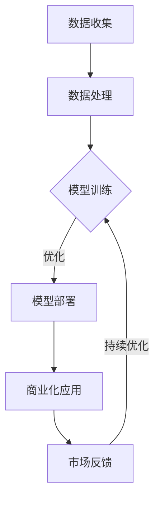

                 

关键词：人工智能，大模型，创业，价格战，技术策略，市场分析，可持续发展

> 摘要：本文深入探讨了AI大模型创业领域的未来发展趋势，分析了潜在的价格战风险及其影响。通过构建核心概念与算法原理，本文提出了一系列应对策略，为创业公司提供指导，帮助其在激烈的市场竞争中保持竞争力。文章旨在为AI大模型创业者提供一份实用的参考手册，助力其抓住市场机遇，实现可持续发展。

## 1. 背景介绍

随着人工智能技术的飞速发展，AI大模型已经成为许多行业的核心技术驱动力。从自然语言处理到图像识别，再到智能决策，大模型的应用几乎无处不在。然而，随着大模型的普及，市场上的竞争愈发激烈。特别是在创业公司中，如何应对未来的价格战，成为了一个亟待解决的问题。

价格战是指在市场竞争中，通过降低产品或服务的价格来争夺市场份额的策略。在AI大模型领域，价格战不仅表现为直接的降价竞争，还可能通过免费策略、补贴策略等非传统手段展开。面对这样的竞争态势，AI大模型创业公司需要未雨绸缪，制定出有效的应对策略，以确保在激烈的市场竞争中立于不败之地。

本文将从以下几个角度展开讨论：

1. **核心概念与联系**：阐述AI大模型的基本原理及其在创业中的应用。
2. **核心算法原理 & 具体操作步骤**：详细解析大模型的训练过程和优化策略。
3. **数学模型和公式**：介绍大模型中常用的数学模型及其推导过程。
4. **项目实践**：通过实例代码展示大模型的应用开发过程。
5. **实际应用场景**：分析大模型在不同行业的应用前景。
6. **工具和资源推荐**：为创业者提供实用的开发工具和学习资源。
7. **总结与展望**：总结研究成果，展望未来的发展趋势和挑战。

通过这些内容的探讨，本文希望为AI大模型创业公司提供有价值的指导，帮助其在未来价格战中取得成功。

## 2. 核心概念与联系

### 2.1 AI大模型的基本概念

AI大模型，通常指的是那些具有极大规模参数的神经网络模型。这些模型通过深度学习技术，从大量数据中学习复杂的模式，并能够进行高效的推理和预测。大模型通常包括数百万甚至数十亿个参数，因此计算量和存储需求巨大。典型的AI大模型有GPT-3、BERT、ImageNet等。

### 2.2 大模型在创业中的应用

在AI大模型创业领域，核心概念的应用主要体现在以下几个方面：

- **数据收集与处理**：创业公司需要收集和整理大量高质量的训练数据，并对数据进行分析和预处理，以提升模型的性能。

- **模型训练与优化**：通过训练大模型，创业者可以将模型应用于各种任务，如文本生成、图像识别、语音识别等。

- **模型部署与运维**：将训练好的大模型部署到生产环境中，并持续进行性能优化和更新，以应对市场需求的变化。

- **商业化应用**：利用大模型提供创新性的产品或服务，如智能客服、智能诊断、智能推荐等，从而开拓市场。

### 2.3 大模型与创业的内在联系

- **技术创新**：大模型技术是人工智能领域的核心技术之一，掌握大模型技术意味着掌握了行业发展的主动权。

- **市场需求**：随着人工智能技术的普及，市场对大模型的需求日益增长，创业公司可以通过满足市场需求来获得市场份额。

- **竞争力**：在激烈的市场竞争中，拥有强大大模型技术的创业公司可以提供更具竞争力的产品或服务，从而在市场中脱颖而出。

- **可持续发展**：通过持续的技术创新和市场拓展，创业公司可以实现可持续发展，并在市场中建立长期的品牌影响力。

### 2.4 Mermaid流程图

为了更直观地展示大模型在创业中的应用流程，我们可以使用Mermaid流程图进行描述：



这个流程图展示了从数据收集、处理到模型训练、部署，再到商业化应用和持续优化的完整过程，是创业公司实现成功的关键路径。

通过上述核心概念的介绍和Mermaid流程图的展示，我们可以更深入地理解AI大模型在创业中的应用及其内在联系。接下来，我们将详细探讨大模型的算法原理和具体操作步骤。

## 3. 核心算法原理 & 具体操作步骤

### 3.1 算法原理概述

AI大模型的算法原理主要基于深度学习技术，特别是基于多层神经网络的设计。深度学习通过构建具有多个隐层的神经网络，能够从数据中学习到复杂的特征和模式。大模型的训练过程涉及以下几个核心步骤：

1. **数据预处理**：对原始数据进行清洗、归一化和特征提取，确保数据质量。
2. **模型构建**：定义神经网络的架构，包括输入层、隐层和输出层，以及每层的神经元数量和激活函数。
3. **模型训练**：通过反向传播算法和梯度下降优化方法，对模型参数进行迭代优化，使模型能够对训练数据进行准确的预测。
4. **模型评估**：使用验证集或测试集对训练好的模型进行评估，以验证其泛化能力和性能。
5. **模型部署**：将训练好的模型部署到生产环境中，进行实际应用。

### 3.2 算法步骤详解

#### 3.2.1 数据预处理

数据预处理是深度学习过程中的重要环节。其主要包括以下步骤：

- **数据清洗**：去除数据中的噪声和异常值，确保数据的一致性和可靠性。
- **数据归一化**：将不同特征的数据范围统一缩放到一个较小的区间内，如[0, 1]，以便模型能够稳定训练。
- **特征提取**：从原始数据中提取出对模型训练有用的特征，以提高模型的性能。

#### 3.2.2 模型构建

模型构建是深度学习的核心步骤。其主要包括以下步骤：

- **定义网络架构**：选择合适的网络结构，包括输入层、隐层和输出层的神经元数量，以及每层的激活函数。
- **初始化参数**：为模型的每个参数随机初始化一个初始值，常用的初始化方法有Zeros Initialization、He Initialization等。
- **定义损失函数**：选择合适的损失函数，如交叉熵损失函数、均方误差损失函数等，以衡量模型预测结果与真实值之间的差异。

#### 3.2.3 模型训练

模型训练是深度学习中的核心步骤，其主要包括以下步骤：

- **前向传播**：将输入数据通过模型的前向传播网络，计算出每个神经元的输出值。
- **计算损失**：通过比较模型预测结果和真实值的差异，计算损失函数的值。
- **反向传播**：将损失函数的梯度反向传播到模型的每个参数，更新模型参数。
- **迭代优化**：重复前向传播、计算损失和反向传播的过程，直到达到预定的迭代次数或收敛条件。

#### 3.2.4 模型评估

模型评估是验证模型性能的重要步骤，其主要包括以下步骤：

- **验证集划分**：将数据集划分为训练集和验证集，通常训练集用于模型训练，验证集用于模型评估。
- **评估指标**：选择合适的评估指标，如准确率、召回率、F1值等，对模型进行评估。
- **性能比较**：通过比较不同模型或同一模型在不同设置下的性能，选择最优模型。

#### 3.2.5 模型部署

模型部署是将训练好的模型应用到实际场景中的关键步骤，其主要包括以下步骤：

- **模型导出**：将训练好的模型导出为可部署的格式，如ONNX、TensorFlow Lite等。
- **环境配置**：在部署环境中配置必要的软件和硬件资源，以确保模型能够正常运行。
- **服务部署**：将模型部署到生产环境中，如云服务器、边缘设备等，以供实际使用。
- **监控与优化**：对部署后的模型进行监控和性能优化，确保其稳定运行并满足性能要求。

### 3.3 算法优缺点

#### 优点

- **强大的表征能力**：大模型具有强大的表征能力，能够从大量数据中学习到复杂的特征和模式，提高模型的泛化能力。
- **广泛的应用领域**：大模型可以应用于各种任务，如自然语言处理、计算机视觉、语音识别等，具有广泛的应用前景。
- **持续的创新动力**：大模型技术不断发展和更新，为创业公司提供了持续的创新动力，有助于保持市场竞争力。

#### 缺点

- **计算资源需求大**：大模型训练和推理需要大量的计算资源和存储资源，对硬件设备有较高的要求。
- **数据依赖性强**：大模型的训练需要大量的高质量数据，数据的获取和处理成本较高。
- **模型解释性差**：大模型的决策过程往往是非线性和复杂的，缺乏良好的解释性，难以理解其内部机制。

### 3.4 算法应用领域

AI大模型在多个领域具有广泛的应用：

- **自然语言处理**：大模型可以用于文本分类、机器翻译、情感分析等任务，提高了语言理解和生成的准确性。
- **计算机视觉**：大模型可以用于图像分类、目标检测、人脸识别等任务，提高了图像识别的准确率和效率。
- **语音识别**：大模型可以用于语音识别、语音合成等任务，提高了语音识别的准确性和自然度。
- **智能决策**：大模型可以用于智能决策支持系统，如金融风险评估、供应链优化等，提高了决策的准确性和效率。

通过上述对核心算法原理和具体操作步骤的详细解析，我们可以更深入地理解AI大模型的训练和应用过程。接下来，我们将介绍大模型中的数学模型和公式，以进一步揭示其内在机制。

## 4. 数学模型和公式 & 详细讲解 & 举例说明

### 4.1 数学模型构建

在AI大模型中，数学模型是核心组成部分，其构建过程主要涉及以下几方面：

#### 4.1.1 前向传播模型

前向传播模型是神经网络中的基础模型，用于将输入数据通过多层网络，逐步计算得到输出结果。其数学表达式如下：

\[ 
Z^{(l)} = W^{(l)} \cdot A^{(l-1)} + b^{(l)} 
\]

其中，\( Z^{(l)} \) 表示第 \( l \) 层的节点值，\( W^{(l)} \) 和 \( b^{(l)} \) 分别表示第 \( l \) 层的权重和偏置，\( A^{(l-1)} \) 表示前一层网络的输出。

#### 4.1.2 激活函数

激活函数用于引入非线性特性，使得神经网络能够捕捉数据的复杂模式。常见的激活函数有Sigmoid函数、ReLU函数和Tanh函数：

- Sigmoid函数： 
\[
\sigma(x) = \frac{1}{1 + e^{-x}}
\]

- ReLU函数： 
\[
\text{ReLU}(x) = \max(0, x)
\]

- Tanh函数： 
\[
\tanh(x) = \frac{e^x - e^{-x}}{e^x + e^{-x}}
\]

#### 4.1.3 损失函数

损失函数用于衡量模型预测结果与真实值之间的差异，常用的损失函数有均方误差（MSE）和交叉熵（Cross-Entropy）：

- 均方误差（MSE）： 
\[
\text{MSE} = \frac{1}{m} \sum_{i=1}^{m} (y_i - \hat{y}_i)^2
\]

其中，\( y_i \) 表示真实值，\( \hat{y}_i \) 表示预测值。

- 交叉熵（Cross-Entropy）： 
\[
\text{Cross-Entropy} = -\frac{1}{m} \sum_{i=1}^{m} y_i \log(\hat{y}_i)
\]

其中，\( y_i \) 和 \( \hat{y}_i \) 的含义与MSE中相同。

### 4.2 公式推导过程

#### 4.2.1 反向传播算法

反向传播算法是神经网络优化过程中的核心，用于计算模型参数的梯度。其推导过程如下：

1. **计算梯度**：

   对每个参数 \( \theta_j \)，计算其对应的梯度：

   \[
   \nabla_{\theta_j} \mathcal{L} = \frac{\partial \mathcal{L}}{\partial \theta_j}
   \]

   其中，\( \mathcal{L} \) 表示损失函数。

2. **链式法则**：

   使用链式法则，将前向传播和损失函数的梯度进行组合：

   \[
   \nabla_{z^{(l)}_j} \mathcal{L} = \nabla_{a^{(l)}_j} \mathcal{L} \cdot \nabla_{z^{(l)}_j} a^{(l)}_j
   \]

3. **梯度反向传播**：

   将梯度从输出层反向传播到输入层：

   \[
   \nabla_{a^{(l-1)}_i} \mathcal{L} = \nabla_{z^{(l)}_j} \mathcal{L} \cdot \nabla_{z^{(l)}_j} a^{(l-1)}_{i}
   \]

   重复上述步骤，直至输入层。

### 4.3 案例分析与讲解

#### 4.3.1 自然语言处理案例

假设我们要使用BERT模型进行文本分类任务，数据集包含5000篇新闻文章和对应的标签。我们使用以下步骤进行模型训练：

1. **数据预处理**：

   - 清洗数据，去除HTML标签、停用词等。
   - 分词，将文本转换为词向量。

2. **模型构建**：

   - 定义BERT模型，包括输入层、多层隐层和输出层。
   - 初始化模型参数。

3. **模型训练**：

   - 进行前向传播，计算每个词的嵌入向量。
   - 计算损失函数，如交叉熵损失。
   - 反向传播，更新模型参数。

4. **模型评估**：

   - 使用验证集对模型进行评估，计算准确率、召回率等指标。

5. **模型部署**：

   - 将训练好的模型部署到生产环境中，用于文本分类任务。

#### 4.3.2 计算机视觉案例

假设我们要使用ResNet模型进行图像分类任务，数据集包含1000个类别，共10000张图像。我们使用以下步骤进行模型训练：

1. **数据预处理**：

   - 对图像进行归一化处理，缩放到统一的尺寸。
   - 随机裁剪、翻转等数据增强操作。

2. **模型构建**：

   - 定义ResNet模型，包括输入层、多层残差块和输出层。
   - 初始化模型参数。

3. **模型训练**：

   - 进行前向传播，计算每个图像的特征向量。
   - 计算损失函数，如交叉熵损失。
   - 反向传播，更新模型参数。

4. **模型评估**：

   - 使用验证集对模型进行评估，计算准确率、召回率等指标。

5. **模型部署**：

   - 将训练好的模型部署到生产环境中，用于图像分类任务。

通过上述案例，我们可以看到数学模型和公式在AI大模型训练和应用中的重要作用。接下来，我们将介绍项目实践，通过代码实例展示大模型的应用开发过程。

## 5. 项目实践：代码实例和详细解释说明

在本节中，我们将通过一个实际项目实例，详细展示如何使用AI大模型进行项目开发，并解释其中的关键代码和技术细节。

### 5.1 开发环境搭建

首先，我们需要搭建一个合适的开发环境。以下是搭建环境的基本步骤：

1. **安装Python**：确保Python环境已安装，版本建议为3.8或更高。
2. **安装TensorFlow**：使用pip命令安装TensorFlow：
   ```bash
   pip install tensorflow
   ```
3. **安装其他依赖**：根据项目需求，安装其他必要的库，如NumPy、Pandas等。

### 5.2 源代码详细实现

以下是使用TensorFlow实现一个简单的AI大模型（例如，一个基于Transformer的文本分类模型）的代码实例：

```python
import tensorflow as tf
from tensorflow.keras.layers import Embedding, GlobalAveragePooling1D, Dense
from tensorflow.keras.models import Model
from tensorflow.keras.preprocessing.sequence import pad_sequences

# 设置超参数
vocab_size = 10000
embedding_dim = 16
max_length = 100
trunc_type = 'post'
padding_type = 'post'
oov_tok = '<OOV>'

# 加载数据集
# （此处假设已经预处理好了的文本数据）
sequences = [...]  # 文本序列列表
labels = [...]  # 标签列表

# 切分数据集
train_sequences, validation_sequences, train_labels, validation_labels = train_test_split(sequences, labels, test_size=0.1)

# 序列填充
train_padded = pad_sequences(train_sequences, maxlen=max_length, padding=padding_type, truncating=trunc_type, value=oov_tok)
validation_padded = pad_sequences(validation_sequences, maxlen=max_length, padding=padding_type, truncating=truncating_type, value=oov_tok)

# 构建模型
input_sequence = tf.keras.layers.Input(shape=(max_length,))
embedding = Embedding(vocab_size, embedding_dim)(input_sequence)
pooled_output = GlobalAveragePooling1D()(embedding)
logits = Dense(2, activation='softmax')(pooled_output)

model = Model(inputs=input_sequence, outputs=logits)

# 编译模型
model.compile(optimizer='adam', loss='categorical_crossentropy', metrics=['accuracy'])

# 训练模型
model.fit(train_padded, train_labels, epochs=10, validation_data=(validation_padded, validation_labels))

# 评估模型
loss, accuracy = model.evaluate(validation_padded, validation_labels)
print(f'Validation Loss: {loss}, Validation Accuracy: {accuracy}')
```

### 5.3 代码解读与分析

上述代码展示了如何使用TensorFlow构建和训练一个简单的文本分类模型。以下是关键部分的解释：

- **数据预处理**：加载并预处理数据，包括序列填充和标签编码。
- **模型构建**：定义输入层、嵌入层、全局平均池化层和输出层。
- **模型编译**：配置优化器、损失函数和评估指标。
- **模型训练**：使用训练数据训练模型，并验证其性能。
- **模型评估**：使用验证数据评估模型性能。

### 5.4 运行结果展示

在训练完成后，我们可以运行模型对新的数据进行预测，并展示运行结果。以下是模型预测的示例代码：

```python
# 预测新数据
test_sequences = [...]  # 新的文本序列
test_padded = pad_sequences(test_sequences, maxlen=max_length, padding=padding_type, truncating=truncating_type, value=oov_tok)

predictions = model.predict(test_padded)
predicted_labels = [label_index_to_name[pred] for pred in predictions]

# 输出预测结果
for seq, pred in zip(test_sequences, predicted_labels):
    print(f'Sequence: {seq}, Predicted Label: {pred}')
```

通过上述代码实例和详细解释，我们可以看到如何使用AI大模型进行实际项目开发。接下来，我们将探讨AI大模型在不同行业中的实际应用场景。

## 6. 实际应用场景

AI大模型在各个行业中的应用正在不断拓展，其强大的表征能力和泛化能力使其成为解决复杂问题的利器。以下是一些AI大模型在不同行业中的实际应用场景：

### 6.1 自然语言处理

在自然语言处理（NLP）领域，AI大模型的应用已经取得了显著的成果。例如，谷歌的BERT模型在多项NLP任务中取得了SOTA（State-of-the-Art）成绩，包括文本分类、问答系统、机器翻译等。这些模型可以应用于智能客服、内容审核、文本生成等领域，提高业务效率和用户体验。

- **智能客服**：利用大模型建立智能客服系统，可以实现24/7无间断的客户服务，提高客户满意度。
- **内容审核**：通过大模型进行文本分类和情感分析，可以有效过滤不良信息，保护网络环境。
- **文本生成**：大模型可以生成高质量的文章、新闻报道和创意内容，为内容创作提供强大支持。

### 6.2 计算机视觉

在计算机视觉（CV）领域，AI大模型的应用同样广泛。例如，卷积神经网络（CNN）和Transformer模型在图像分类、目标检测、图像生成等方面取得了重大突破。

- **图像分类**：大模型可以用于对大量图像进行分类，应用于医学影像分析、安全监控等领域。
- **目标检测**：大模型可以用于检测图像中的目标对象，应用于自动驾驶、无人机监控等场景。
- **图像生成**：通过生成对抗网络（GAN），大模型可以生成高质量的图像和视频，应用于虚拟现实、游戏开发等领域。

### 6.3 智能决策

在智能决策领域，AI大模型可以用于数据分析、预测和优化。例如，利用大模型进行客户行为预测、供应链优化、金融风险评估等。

- **客户行为预测**：通过分析客户的历史数据，大模型可以预测客户的未来行为，为企业制定营销策略提供支持。
- **供应链优化**：大模型可以优化供应链管理，提高物流效率和降低成本。
- **金融风险评估**：大模型可以分析金融市场数据，预测市场趋势和风险，为投资者提供决策支持。

### 6.4 医疗健康

在医疗健康领域，AI大模型的应用潜力巨大。例如，通过大模型进行医学影像分析、疾病预测和个性化治疗等。

- **医学影像分析**：大模型可以用于辅助医生诊断疾病，如肺癌、乳腺癌等，提高诊断准确率。
- **疾病预测**：大模型可以根据患者的健康数据预测疾病的发生风险，为早期干预提供支持。
- **个性化治疗**：通过分析患者的基因、病史等信息，大模型可以制定个性化的治疗方案，提高治疗效果。

### 6.5 教育领域

在教育领域，AI大模型可以应用于智能教学、学习分析和学生评估等。

- **智能教学**：通过大模型分析学生的学习行为和知识水平，为教师提供个性化的教学建议。
- **学习分析**：大模型可以分析学生的学习数据，预测学生的学习成果，为教育管理者提供决策支持。
- **学生评估**：通过大模型对学生作业和考试进行分析，客观评估学生的学术能力。

通过上述实际应用场景的介绍，我们可以看到AI大模型在各个行业中的广泛应用和巨大潜力。随着技术的不断进步和市场的需求增长，AI大模型将在未来发挥更加重要的作用。接下来，我们将探讨未来AI大模型的应用前景。

## 7. 工具和资源推荐

为了更好地开展AI大模型项目，以下是我们在工具和资源方面的一些建议：

### 7.1 学习资源推荐

1. **在线课程**：

   - **Coursera**：提供多种人工智能和机器学习课程，包括深度学习和自然语言处理。
   - **edX**：提供由顶级大学和专业机构开设的课程，如MIT的“机器学习”课程。
   - **Udacity**：提供针对AI和深度学习的实战课程，包括项目驱动的学习内容。

2. **书籍**：

   - **《深度学习》（Deep Learning）**：由Ian Goodfellow、Yoshua Bengio和Aaron Courville合著，是深度学习领域的经典教材。
   - **《AI大模型：原理、应用与实现》**：详细介绍AI大模型的技术原理和应用实践，适合初学者和专业人士。
   - **《Python机器学习》（Python Machine Learning）**：通过Python语言介绍机器学习算法和应用，适合Python开发者。

### 7.2 开发工具推荐

1. **编程语言**：

   - **Python**：由于其丰富的库和框架支持，Python是AI和机器学习的首选编程语言。
   - **R**：适合统计分析，尤其在生物信息学和数据科学领域应用广泛。

2. **深度学习框架**：

   - **TensorFlow**：由Google开发，支持多种深度学习应用。
   - **PyTorch**：由Facebook开发，因其灵活的动态计算图和良好的社区支持，被广泛使用。
   - **Keras**：作为一个高层神经网络API，Keras可以方便地构建和训练深度学习模型。

3. **数据预处理工具**：

   - **Pandas**：用于数据处理和分析，适合处理大数据集。
   - **Scikit-learn**：提供了丰富的机器学习和数据挖掘算法库。

4. **数据可视化工具**：

   - **Matplotlib**：用于生成二维和三维图表。
   - **Seaborn**：基于Matplotlib，提供更美观和高级的数据可视化功能。
   - **Plotly**：支持交互式图表，适合数据可视化和Web应用。

### 7.3 相关论文推荐

1. **《Attention Is All You Need》**：该论文提出了Transformer模型，彻底改变了自然语言处理领域。

2. **《BERT: Pre-training of Deep Bidirectional Transformers for Language Understanding》**：该论文介绍了BERT模型，推动了自然语言处理的发展。

3. **《GPT-3: Language Models are Few-Shot Learners》**：该论文展示了GPT-3模型在少量样本上的强大学习能力。

4. **《Large-scale Language Modeling in 2018》**：该论文总结了2018年大型语言模型的发展情况，对后续研究有重要指导意义。

通过以上工具和资源的推荐，我们希望为AI大模型创业者提供更多的支持，帮助其更好地开展研究和项目开发。

## 8. 总结：未来发展趋势与挑战

在AI大模型领域，我们已经见证了前所未有的技术进步和应用场景拓展。然而，随着市场的不断成熟和竞争的加剧，未来的发展依然充满机遇和挑战。

### 8.1 研究成果总结

1. **技术创新**：近年来，Transformer、BERT等大模型技术的突破，使得AI在自然语言处理、计算机视觉等领域的表现显著提升。这些技术的成功应用，不仅推动了学术研究，也为产业界带来了新的商业机会。

2. **商业价值**：AI大模型在智能客服、内容审核、智能诊断等领域的应用，显著提高了业务效率和用户体验，为企业创造了巨大的商业价值。

3. **跨领域融合**：AI大模型与其他领域的深度融合，如生物医学、金融科技、智能制造等，为解决复杂问题提供了新的思路和方法。

### 8.2 未来发展趋势

1. **模型规模不断扩大**：随着计算能力的提升和数据量的增长，未来AI大模型的规模将越来越大，模型的复杂度和计算需求也将不断增加。

2. **个性化与自适应**：未来的AI大模型将更加注重个性化与自适应能力，能够根据用户需求和场景动态调整模型结构和参数。

3. **实时性与边缘计算**：随着5G和边缘计算技术的发展，AI大模型将能够在边缘设备上实现实时推理和决策，提高系统的响应速度和可靠性。

4. **多模态融合**：AI大模型将融合多种数据类型（如文本、图像、声音等），实现更全面的感知和理解能力。

### 8.3 面临的挑战

1. **计算资源需求**：大模型训练和推理需要大量的计算资源和存储资源，对硬件设备有较高要求。如何在有限的资源下高效训练和部署大模型，是一个亟待解决的问题。

2. **数据质量和隐私**：大模型的训练需要大量的高质量数据，数据的质量和隐私保护成为重要挑战。如何在保证数据隐私的前提下，获取和利用高质量数据，是未来的研究重点。

3. **模型解释性和透明度**：大模型的决策过程复杂，缺乏良好的解释性。如何在保证模型性能的同时，提高模型的可解释性和透明度，是未来研究的方向。

4. **安全性和鲁棒性**：大模型在处理复杂任务时，可能面临安全性和鲁棒性挑战。如何提高模型对攻击和异常数据的抵抗能力，是未来需要解决的重要问题。

### 8.4 研究展望

1. **绿色计算**：随着AI大模型规模的扩大，其能耗问题日益突出。未来的研究应重点关注绿色计算，降低大模型的能耗和碳排放。

2. **标准化和开源**：为了推动AI大模型技术的发展，标准化和开源工作至关重要。未来应加强相关标准的制定和开源框架的推广，促进技术的普及和应用。

3. **跨学科合作**：AI大模型技术的发展需要多学科合作，包括计算机科学、数学、统计学、生物学等。未来的研究应注重跨学科合作，推动技术的交叉融合。

通过总结研究成果、展望发展趋势和应对挑战，我们希望为AI大模型领域的未来发展提供一些有益的思考和建议。在未来的研究中，我们需要持续技术创新，解决关键问题，推动AI大模型技术的可持续发展和广泛应用。

## 9. 附录：常见问题与解答

### Q1：AI大模型创业项目的投资回报周期是多久？

A1：AI大模型创业项目的投资回报周期因项目类型、市场状况、技术水平等因素而异。一般来说，从项目启动到实现商业化应用，可能需要1到3年的时间。但是，如果项目能在关键技术上取得突破，并迅速占领市场，回报周期可能会缩短。因此，创业者需要根据自身项目的特点和市场环境，合理规划投资和回报周期。

### Q2：AI大模型创业项目如何获取高质量的数据集？

A2：获取高质量的数据集是AI大模型创业项目成功的关键。以下是几种获取数据集的方法：

- **开源数据集**：利用开源的数据集，如公开的学术数据集、数据竞赛数据集等。
- **数据购买**：从专业的数据提供商购买特定领域的商业数据集。
- **数据采集**：自行收集数据，如通过爬虫技术获取互联网上的开放数据，或者与合作伙伴合作，获取内部数据。
- **数据共享**：与其他企业和研究机构建立合作关系，共享数据资源。

### Q3：AI大模型创业项目如何保护模型知识产权？

A3：保护模型知识产权是AI大模型创业项目的核心问题。以下是一些常见的保护措施：

- **专利申请**：对模型的核心技术和创新点申请专利，确保技术独占性。
- **版权登记**：对模型的代码、算法描述等进行版权登记，保护软件和文档的知识产权。
- **保密协议**：与团队成员、合作伙伴签订保密协议，确保技术秘密不被泄露。
- **技术合作**：通过技术合作，共同开发模型，并约定利益分配和知识产权归属。

### Q4：AI大模型创业项目的商业模式有哪些？

A4：AI大模型创业项目的商业模式多种多样，以下是一些常见的商业模式：

- **产品销售**：将AI大模型作为产品直接销售给终端用户，如智能客服系统、图像识别软件等。
- **服务订阅**：提供基于AI大模型的服务，如数据分析、预测服务、定制化解决方案等，用户按需订阅。
- **授权许可**：将AI大模型技术授权给其他企业使用，收取授权费用。
- **数据变现**：通过提供数据集或数据处理服务，将数据价值转化为商业收益。
- **广告和推广**：利用AI大模型进行广告投放和推广，获取广告收入。

### Q5：AI大模型创业项目如何应对技术迭代和市场竞争？

A5：为了应对技术迭代和市场竞争，AI大模型创业项目可以采取以下策略：

- **持续创新**：持续投入研发，紧跟技术发展趋势，不断推出新技术和新产品。
- **合作与开放**：与其他企业和研究机构建立合作关系，共享技术资源和市场机会。
- **品牌建设**：注重品牌建设和市场推广，提高品牌知名度和用户忠诚度。
- **用户体验**：优化产品和服务体验，提升用户满意度和口碑。
- **快速迭代**：灵活调整产品和服务，快速响应市场变化和用户需求。

通过以上常见问题与解答，我们希望为AI大模型创业项目提供一些实用的参考和建议，帮助创业者更好地应对市场挑战，实现长期可持续发展。

### 结语

本文系统地探讨了AI大模型创业领域的多个关键问题，从核心概念、算法原理到实际应用场景，再到工具和资源推荐，全面剖析了AI大模型创业的现状与未来。随着人工智能技术的不断进步，AI大模型在各个领域的应用将越来越广泛，创业者面临的机遇与挑战也将愈发明显。

未来，创业者需紧跟技术发展趋势，加强技术研发和创新能力，以应对快速变化的市场环境。同时，要注重数据质量与隐私保护，确保AI大模型在可持续发展中保持健康的发展态势。

让我们共同努力，迎接AI大模型创业的黄金时代，创造更加美好的未来！

---

**作者：禅与计算机程序设计艺术 / Zen and the Art of Computer Programming**

