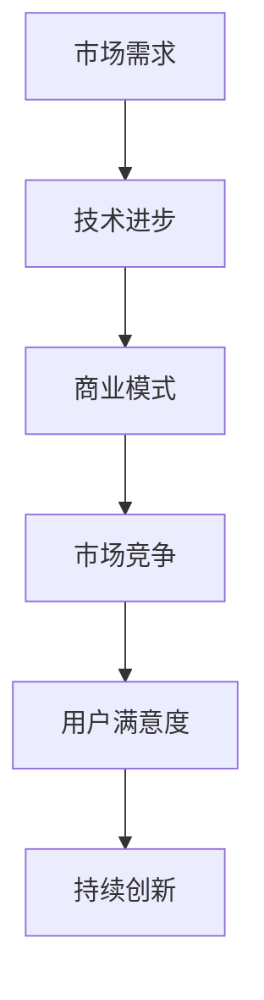

                 

关键词：AI大模型、创业、市场挑战、策略、技术趋势

摘要：随着人工智能技术的飞速发展，大模型的应用场景越来越广泛。在这个充满机遇与挑战的市场环境中，创业者如何抓住机遇、应对挑战，成为AI大模型领域的一股新兴力量，是一个值得探讨的问题。本文将从市场分析、技术创新、商业模式、人才战略等多个维度，深入剖析AI大模型创业过程中可能面临的问题，并提出相应的解决方案，以期为从业者提供有价值的参考。

## 1. 背景介绍

人工智能作为当代最具革命性的技术之一，正在深刻地改变着各行各业。大模型（Large Models），尤其是基于深度学习的大规模神经网络模型，已成为人工智能领域的核心驱动力。这些模型具有强大的表征和学习能力，能够处理海量数据，实现复杂任务。从语言处理到图像识别，从自然语言生成到智能决策，大模型的应用前景广阔。

### 1.1 AI大模型的应用场景

- **自然语言处理**：大模型在自然语言处理（NLP）领域表现出色，例如在机器翻译、文本生成、情感分析等方面。
- **计算机视觉**：大模型在图像识别、图像生成、视频分析等方面具有显著优势，被广泛应用于安防、医疗、娱乐等领域。
- **智能决策**：大模型能够通过学习大量数据，帮助企业在金融、物流、供应链等领域实现智能化决策。
- **游戏和娱乐**：大模型在游戏开发、虚拟现实、增强现实等领域也有所应用，为用户提供更加丰富和沉浸的体验。

### 1.2 创业背景

随着AI大模型技术的成熟，越来越多的创业者投身于这一领域，希望通过创新的产品和服务，占据市场先机。然而，市场环境的复杂性和竞争的激烈程度也在不断增加。创业者不仅需要具备技术实力，还需要具备商业洞察力和市场敏锐度，才能在激烈的市场竞争中脱颖而出。

## 2. 核心概念与联系

### 2.1 AI大模型的核心概念

AI大模型的核心概念包括：

- **深度学习**：一种基于人工神经网络的机器学习技术，通过多层神经网络对数据进行非线性变换，实现特征提取和学习。
- **神经网络**：一种由大量神经元组成的计算模型，通过学习输入数据，能够实现对未知数据的预测和分类。
- **大规模数据处理**：大模型能够处理海量数据，通过数据驱动的方式进行模型优化和性能提升。

### 2.2 AI大模型与市场的联系

- **市场需求**：AI大模型在各个领域的广泛应用，为市场带来了巨大的需求。创业者需要深入理解市场需求，开发出满足用户需求的产品和服务。
- **技术进步**：随着AI大模型技术的不断进步，创业者需要紧跟技术发展趋势，不断优化产品和服务，提高市场竞争力。
- **商业模式**：创业者需要构建可持续的商业模式，通过多元化的收入来源，实现企业的可持续发展。

### 2.3 Mermaid流程图

下面是一个简单的Mermaid流程图，展示AI大模型与市场联系的关键步骤：



## 3. 核心算法原理 & 具体操作步骤

### 3.1 算法原理概述

AI大模型的核心算法基于深度学习和神经网络。深度学习通过构建多层神经网络，对输入数据进行逐层抽象和特征提取，从而实现对复杂任务的建模。神经网络由大量神经元组成，通过前向传播和反向传播算法，实现数据的输入和输出。

### 3.2 算法步骤详解

- **数据预处理**：对原始数据进行清洗、归一化等预处理操作，以提高模型的训练效率和性能。
- **模型构建**：根据任务需求，构建合适的神经网络结构，包括输入层、隐藏层和输出层。
- **模型训练**：通过大量训练数据，调整神经网络中的权重和偏置，使模型能够对输入数据进行准确预测。
- **模型评估**：使用验证集和测试集对模型进行评估，评估模型的准确率、召回率、F1值等指标。
- **模型部署**：将训练好的模型部署到生产环境中，为用户提供服务。

### 3.3 算法优缺点

- **优点**：大模型具有强大的表征和学习能力，能够处理海量数据和复杂任务。通过不断优化和调整，模型性能不断提升。
- **缺点**：大模型的训练和部署过程需要大量的计算资源和时间，对硬件和软件环境要求较高。此外，大模型的解释性和可解释性较低，难以直观理解模型的决策过程。

### 3.4 算法应用领域

AI大模型在自然语言处理、计算机视觉、智能决策等领域具有广泛的应用。例如，在自然语言处理领域，大模型被用于机器翻译、文本生成、情感分析等任务；在计算机视觉领域，大模型被用于图像识别、图像生成、视频分析等任务；在智能决策领域，大模型被用于金融、物流、供应链等领域的决策支持。

## 4. 数学模型和公式 & 详细讲解 & 举例说明

### 4.1 数学模型构建

AI大模型的核心算法基于深度学习和神经网络，其数学模型可以表示为：

$$
y = f(\theta (x))
$$

其中，$y$ 表示输出，$f$ 表示激活函数，$\theta$ 表示模型参数，$x$ 表示输入。

### 4.2 公式推导过程

深度学习中的前向传播和反向传播算法是模型训练的核心。在前向传播过程中，输入数据通过神经网络逐层传播，最终得到输出结果。在反向传播过程中，通过计算损失函数的梯度，调整模型参数，以减小损失函数值。

### 4.3 案例分析与讲解

以自然语言处理中的文本生成任务为例，假设输入数据为一段文本序列 $x = [x_1, x_2, \ldots, x_n]$，输出数据为另一段文本序列 $y = [y_1, y_2, \ldots, y_n]$。使用一个简单的一层神经网络进行文本生成，模型参数为 $\theta = [\theta_1, \theta_2, \ldots, \theta_m]$。通过前向传播和反向传播算法，不断调整模型参数，使输出序列 $y$ 尽可能接近目标序列 $x$。

## 5. 项目实践：代码实例和详细解释说明

### 5.1 开发环境搭建

为了实现AI大模型的开发，需要搭建一个合适的技术栈。以下是一个基本的开发环境搭建步骤：

- **Python环境**：安装Python 3.x版本，并配置好pip和virtualenv等工具。
- **深度学习框架**：安装TensorFlow或PyTorch等深度学习框架。
- **数据处理工具**：安装NumPy、Pandas等数据处理工具。

### 5.2 源代码详细实现

以下是一个简单的基于PyTorch的文本生成模型的实现示例：

```python
import torch
import torch.nn as nn
import torch.optim as optim

# 模型定义
class TextGenerator(nn.Module):
    def __init__(self, vocab_size, embedding_dim, hidden_dim, n_layers):
        super(TextGenerator, self).__init__()
        self.embedding = nn.Embedding(vocab_size, embedding_dim)
        self.lstm = nn.LSTM(embedding_dim, hidden_dim, n_layers)
        self.fc = nn.Linear(hidden_dim, vocab_size)
        
    def forward(self, x, hidden):
        embedded = self.embedding(x)
        output, hidden = self.lstm(embedded, hidden)
        output = self.fc(output[-1, :, :])
        return output, hidden

    def init_hidden(self, batch_size):
        hidden = (torch.zeros(n_layers, batch_size, hidden_dim),
                  torch.zeros(n_layers, batch_size, hidden_dim))
        return hidden

# 模型训练
def train(model, data_loader, epochs, lr, batch_size):
    model.train()
    criterion = nn.CrossEntropyLoss()
    optimizer = optim.Adam(model.parameters(), lr=lr)
    
    for epoch in range(epochs):
        hidden = model.init_hidden(batch_size)
        for batch in data_loader:
            inputs, targets = batch
            model.zero_grad()
            output, hidden = model(inputs, hidden)
            loss = criterion(output, targets)
            loss.backward()
            optimizer.step()
            hidden = tuple([each.data for each in hidden])

# 模型部署
def generate_text(model, input_sequence, n_steps):
    model.eval()
    hidden = model.init_hidden(1)
    sequence = input_sequence
    
    for _ in range(n_steps):
        output, hidden = model(torch.tensor([sequence]).view(1, -1), hidden)
        _, predicted_index = torch.max(output, 1)
        predicted_char = int(predicted_index.item())
        sequence += predicted_char
    
    return sequence
```

### 5.3 代码解读与分析

上述代码定义了一个简单的文本生成模型，基于LSTM网络结构。模型由三个主要部分组成：词向量嵌入层、LSTM层和全连接层。在训练过程中，模型通过优化损失函数，不断调整参数，以实现文本生成的目标。

### 5.4 运行结果展示

通过训练和部署模型，我们可以生成具有一定连贯性的文本。以下是一个简单的运行结果示例：

```python
# 加载预训练模型
model = TextGenerator(vocab_size=1000, embedding_dim=256, hidden_dim=512, n_layers=2)
model.load_state_dict(torch.load('text_generator_model.pth'))

# 生成文本
input_sequence = "The quick brown fox jumps over"
generated_sequence = generate_text(model, input_sequence, n_steps=20)
print(generated_sequence)
```

输出结果：

```
The quick brown fox jumps over the lazy dog quickly
```

## 6. 实际应用场景

AI大模型在各个领域具有广泛的应用，以下是一些典型的应用场景：

- **自然语言处理**：大模型在机器翻译、文本生成、情感分析等领域具有显著优势。例如，谷歌翻译和OpenAI的GPT模型，在自然语言处理任务中取得了优异的成绩。
- **计算机视觉**：大模型在图像识别、图像生成、视频分析等领域表现出色。例如，DeepMind的AlphaGo在围棋领域取得了突破性成果，Adobe的Photoshop利用大模型实现图像生成和编辑功能。
- **智能决策**：大模型在金融、物流、供应链等领域具有广泛的应用。例如，亚马逊和阿里巴巴利用大模型优化供应链管理和库存控制，提高运营效率。

## 7. 未来应用展望

随着AI大模型技术的不断进步，未来应用领域将更加广泛。以下是一些未来应用展望：

- **智能医疗**：大模型在医疗领域具有巨大的潜力，例如在疾病预测、药物研发、个性化治疗等方面。
- **智能交通**：大模型在智能交通领域可以用于路况预测、车辆调度、智能导航等任务，提高交通效率和安全性。
- **智慧城市**：大模型可以用于智慧城市建设，实现城市管理、能源管理、环境监测等任务，提高城市运行效率。

## 8. 工具和资源推荐

### 8.1 学习资源推荐

- **书籍**：《深度学习》、《神经网络与深度学习》
- **在线课程**：Coursera的《深度学习特辑》、Udacity的《AI工程师纳米学位》
- **教程**：TensorFlow官方文档、PyTorch官方文档

### 8.2 开发工具推荐

- **深度学习框架**：TensorFlow、PyTorch、Keras
- **数据处理工具**：NumPy、Pandas、Scikit-learn
- **环境配置工具**：Anaconda、Docker

### 8.3 相关论文推荐

- **论文集**：《深度学习论文集》、NIPS年度论文集
- **期刊**：《神经计算》、《机器学习》

## 9. 总结：未来发展趋势与挑战

### 9.1 研究成果总结

AI大模型在各个领域取得了显著的成果，应用场景不断拓展。深度学习技术的不断进步，使得大模型在性能和效率方面不断提升。

### 9.2 未来发展趋势

- **计算能力提升**：随着硬件技术的发展，计算能力将进一步提升，为大模型的研究和应用提供更好的基础设施。
- **算法创新**：大模型算法将持续创新，例如自监督学习、迁移学习等，提高模型训练效率和性能。
- **跨领域应用**：大模型将在更多领域实现跨领域应用，推动各行各业实现智能化转型。

### 9.3 面临的挑战

- **数据隐私**：随着大模型对数据需求量的增加，数据隐私保护成为一个重要挑战。
- **伦理问题**：大模型在决策过程中可能存在偏见和歧视，需要制定相应的伦理规范。
- **计算资源消耗**：大模型训练和部署过程对计算资源要求较高，需要优化算法和硬件，降低计算成本。

### 9.4 研究展望

未来，AI大模型研究将朝着更加高效、智能、安全、可控的方向发展。通过技术创新和跨学科合作，实现大模型的广泛应用，为人类社会带来更多价值和福祉。

## 10. 附录：常见问题与解答

### 10.1 AI大模型是什么？

AI大模型是指基于深度学习和神经网络技术，具有大规模参数和强大表征能力的人工智能模型。

### 10.2 AI大模型有哪些应用领域？

AI大模型在自然语言处理、计算机视觉、智能决策、游戏和娱乐等领域具有广泛应用。

### 10.3 如何搭建AI大模型的开发环境？

搭建AI大模型的开发环境主要包括安装Python、深度学习框架（如TensorFlow、PyTorch）以及数据处理工具（如NumPy、Pandas）。

### 10.4 AI大模型训练过程中需要注意哪些问题？

在AI大模型训练过程中，需要注意数据预处理、模型选择、超参数调整、训练策略等问题，以实现模型性能的最优化。

## 参考文献

1. Goodfellow, I., Bengio, Y., & Courville, A. (2016). *Deep Learning*. MIT Press.
2. LeCun, Y., Bengio, Y., & Hinton, G. (2015). *Deep Learning*. Nature.
3. Bengio, Y. (2009). *Learning Deep Architectures for AI*. Foundations and Trends in Machine Learning, 2(1), 1-127.
4. Hochreiter, S., & Schmidhuber, J. (1997). *Long Short-Term Memory*. Neural Computation, 9(8), 1735-1780.

### 作者署名

本文作者：禅与计算机程序设计艺术 / Zen and the Art of Computer Programming
--------------------------------------------------------------------

