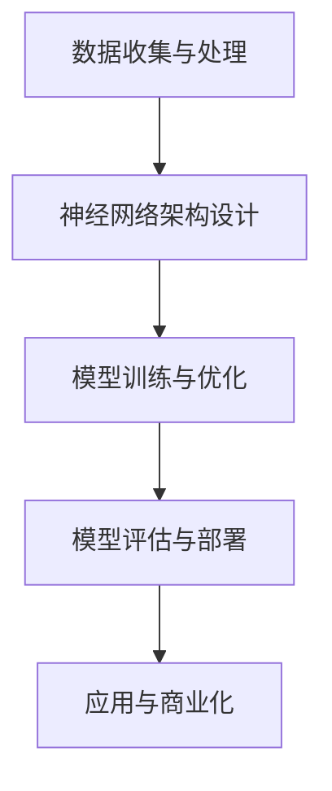
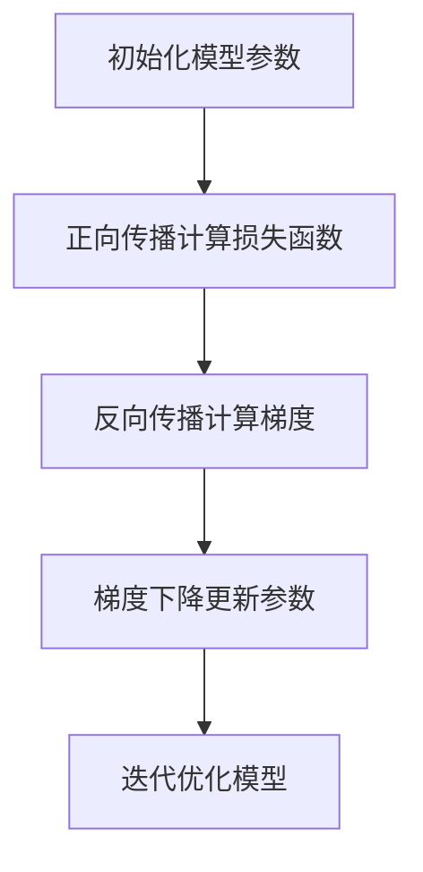

                 

关键词：人工智能，大模型，创业，技术挑战，未来趋势

摘要：随着人工智能技术的快速发展，大模型在各个领域展现出了巨大的潜力。本文将探讨AI大模型创业所面临的技术挑战，以及如何应对这些挑战，为创业者和研究人员提供有价值的参考。

## 1. 背景介绍

近年来，人工智能（AI）技术取得了令人瞩目的进展。特别是深度学习技术的崛起，使得人工智能在图像识别、自然语言处理、语音识别等众多领域取得了重大突破。其中，大模型（Large-scale Model）作为一种重要的技术手段，正在逐步成为AI领域的研究热点。

大模型指的是那些拥有海量参数和训练数据的深度神经网络模型。这类模型能够通过大规模的数据训练，实现比传统模型更高效的性能。例如，GPT-3、BERT等大模型在自然语言处理领域取得了显著的成果。

### 1.1 大模型在商业领域的应用

随着大模型的普及，越来越多的企业开始尝试将大模型应用于商业领域。例如，谷歌、微软等科技巨头纷纷推出基于大模型的云服务，为企业提供强大的AI能力。此外，创业公司也纷纷涌现，试图通过大模型技术解决实际问题，创造商业价值。

### 1.2 大模型创业面临的挑战

尽管大模型在商业领域具有巨大的潜力，但创业过程中仍面临诸多挑战。这些挑战主要集中在以下几个方面：

- 数据隐私与安全问题
- 模型可解释性
- 模型部署与优化
- 模型训练与调优的效率
- 法规与伦理问题

## 2. 核心概念与联系

在探讨大模型创业的技术挑战之前，我们首先需要理解大模型的基本概念和原理。以下是一个关于大模型核心概念和原理的Mermaid流程图：



### 2.1 数据收集与处理

数据是训练大模型的基础。创业公司需要收集大量高质量的训练数据，并对这些数据进行分析和处理，以确保数据的有效性和准确性。

### 2.2 神经网络架构设计

大模型通常采用深度神经网络（DNN）架构。设计合理的神经网络架构对于大模型的性能至关重要。创业公司需要深入理解DNN的基本原理，并尝试采用创新的架构设计，以提高模型性能。

### 2.3 模型训练与优化

大模型的训练过程需要大量的计算资源和时间。创业公司需要优化训练过程，提高训练效率，并确保模型在训练过程中达到预期的性能指标。

### 2.4 模型评估与部署

在模型训练完成后，需要对模型进行评估，以确定其在实际应用中的性能。评估完成后，创业公司需要将模型部署到生产环境中，以满足商业需求。

### 2.5 应用与商业化

大模型的应用场景非常广泛，包括自然语言处理、计算机视觉、语音识别等。创业公司需要根据市场需求，将大模型应用于实际问题，创造商业价值。

## 3. 核心算法原理 & 具体操作步骤

### 3.1 算法原理概述

大模型的训练主要基于深度学习技术，特别是基于梯度下降法的优化算法。以下是一个关于大模型算法原理的概述：



### 3.2 算法步骤详解

#### 3.2.1 初始化模型参数

在训练大模型之前，需要初始化模型参数。初始化方法有多种，如高斯分布、均匀分布等。合理的初始化方法有助于提高训练效果。

#### 3.2.2 正向传播计算损失函数

正向传播过程中，输入数据通过神经网络的前向传播，得到模型的输出。通过计算输出与真实标签之间的差异，得到损失函数的值。

#### 3.2.3 反向传播计算梯度

反向传播过程中，将损失函数关于模型参数的梯度计算出来。梯度反映了模型参数对损失函数的影响程度。

#### 3.2.4 梯度下降更新参数

根据梯度下降法，更新模型参数，使得损失函数值逐渐减小。更新过程需要选择合适的步长，以避免陷入局部最优。

#### 3.2.5 迭代优化模型

通过多次迭代优化，使得模型参数逐渐收敛到最优解。迭代次数取决于模型大小、训练数据量等因素。

### 3.3 算法优缺点

#### 优点：

- 高效：大模型能够通过大规模数据训练，提高模型性能。
- 广泛适用：大模型可以应用于多种领域，如自然语言处理、计算机视觉等。

#### 缺点：

- 计算资源需求大：大模型训练需要大量的计算资源和时间。
- 可解释性差：大模型通常具有很高的复杂性，难以解释其内部机制。

### 3.4 算法应用领域

大模型在以下领域具有广泛的应用：

- 自然语言处理：如文本分类、机器翻译、情感分析等。
- 计算机视觉：如图像分类、目标检测、人脸识别等。
- 语音识别：如语音转文字、语音合成等。
- 医疗健康：如疾病诊断、药物研发等。

## 4. 数学模型和公式 & 详细讲解 & 举例说明

### 4.1 数学模型构建

大模型的数学模型主要基于深度学习理论。以下是一个简化的数学模型构建过程：

```latex
输入数据 X \xrightarrow{模型} 输出 Y
```

其中，X 为输入数据，Y 为输出数据。模型通常由多个神经网络层组成，每层都有对应的权重和偏置。

### 4.2 公式推导过程

在构建大模型时，需要推导损失函数和梯度公式。以下是一个简化的推导过程：

```latex
损失函数 L = \frac{1}{2} \sum_{i=1}^{n} (y_i - \hat{y}_i)^2
```

其中，$y_i$ 为真实标签，$\hat{y}_i$ 为模型预测值。损失函数反映了输出值与真实标签之间的差异。

```latex
梯度 G = \frac{\partial L}{\partial W} = \sum_{i=1}^{n} (y_i - \hat{y}_i) \odot \frac{\partial \hat{y}_i}{\partial W}
```

其中，$W$ 为模型权重，$\odot$ 表示逐元素乘积。

### 4.3 案例分析与讲解

以下是一个基于大模型的文本分类案例：

假设我们要对一段文本进行分类，将其划分为正类和负类。首先，我们需要收集大量带有标签的文本数据，并对其进行预处理，如分词、去停用词等。然后，我们可以采用以下步骤：

1. 初始化模型参数。
2. 正向传播计算损失函数。
3. 反向传播计算梯度。
4. 梯度下降更新参数。
5. 迭代优化模型。

经过多次迭代，模型参数逐渐收敛，我们可以使用训练好的模型对新的文本数据进行分类。

## 5. 项目实践：代码实例和详细解释说明

### 5.1 开发环境搭建

为了实践大模型技术，我们需要搭建一个合适的开发环境。以下是一个基于Python和TensorFlow的简单环境搭建步骤：

1. 安装Python（建议使用3.7及以上版本）。
2. 安装TensorFlow：`pip install tensorflow`。
3. 安装其他必要的库，如NumPy、Pandas等。

### 5.2 源代码详细实现

以下是一个基于TensorFlow实现的大模型文本分类代码实例：

```python
import tensorflow as tf
from tensorflow.keras.preprocessing.sequence import pad_sequences
from tensorflow.keras.layers import Embedding, LSTM, Dense
from tensorflow.keras.models import Sequential

# 准备数据
# ...

# 构建模型
model = Sequential([
    Embedding(input_dim=vocab_size, output_dim=embedding_size, input_length=max_sequence_length),
    LSTM(units=128, dropout=0.2, recurrent_dropout=0.2),
    Dense(units=1, activation='sigmoid')
])

# 编译模型
model.compile(optimizer='adam', loss='binary_crossentropy', metrics=['accuracy'])

# 训练模型
model.fit(X_train, y_train, epochs=10, batch_size=32, validation_data=(X_val, y_val))

# 评估模型
model.evaluate(X_test, y_test)
```

### 5.3 代码解读与分析

上述代码展示了如何使用TensorFlow构建一个简单的文本分类模型。具体步骤如下：

1. 准备数据：包括文本数据、标签等。
2. 构建模型：定义嵌入层、LSTM层和输出层。
3. 编译模型：设置优化器、损失函数和评估指标。
4. 训练模型：使用训练数据训练模型。
5. 评估模型：使用测试数据评估模型性能。

### 5.4 运行结果展示

运行上述代码，我们可以得到模型的训练和测试结果。通过分析这些结果，我们可以了解到模型的性能和优化方向。

## 6. 实际应用场景

大模型在商业领域具有广泛的应用场景。以下是一些实际应用场景的例子：

- 文本分类：对大量的文本数据进行分类，如新闻分类、情感分析等。
- 语音识别：将语音信号转换为文字，应用于智能助手、自动字幕等。
- 图像识别：对图像进行分类、目标检测等，应用于安防监控、医疗诊断等。
- 营销推荐：基于用户行为和兴趣，为用户提供个性化的推荐服务。

### 6.1 未来应用展望

随着人工智能技术的不断发展，大模型的应用前景将更加广阔。以下是一些未来应用展望：

- 更高效的模型训练方法：采用更先进的算法和硬件，提高模型训练效率。
- 多模态学习：结合文本、图像、语音等多种数据类型，实现更智能的模型。
- 模型压缩与部署：降低模型体积，实现快速部署和低功耗应用。
- 模型解释与可解释性：提高模型的透明度和可解释性，满足法规和伦理要求。

## 7. 工具和资源推荐

### 7.1 学习资源推荐

- 《深度学习》（Goodfellow, Bengio, Courville）：深度学习领域的经典教材。
- 《Python机器学习》（Raschka, Mirjalili）：介绍机器学习算法和Python实现的教程。
- TensorFlow官方文档：了解TensorFlow的基本使用方法和高级特性。

### 7.2 开发工具推荐

- Jupyter Notebook：方便进行数据分析和模型训练。
- PyTorch：Python机器学习库，与TensorFlow竞争。
- Keras：Python深度学习库，方便搭建和训练模型。

### 7.3 相关论文推荐

- "Attention Is All You Need"：介绍Transformer模型的经典论文。
- "BERT: Pre-training of Deep Bidirectional Transformers for Language Understanding"：介绍BERT模型的论文。
- "GPT-3: Language Models are few-shot learners"：介绍GPT-3模型的论文。

## 8. 总结：未来发展趋势与挑战

### 8.1 研究成果总结

近年来，大模型在人工智能领域取得了显著的研究成果。通过大规模数据训练和先进的神经网络架构设计，大模型在多个领域实现了显著的性能提升。此外，深度学习算法的优化和硬件的发展也为大模型的应用提供了有力支持。

### 8.2 未来发展趋势

未来，大模型将继续在人工智能领域发挥重要作用。以下是一些发展趋势：

- 多模态学习：结合文本、图像、语音等多种数据类型，实现更智能的模型。
- 模型压缩与部署：降低模型体积，实现快速部署和低功耗应用。
- 模型解释与可解释性：提高模型的透明度和可解释性，满足法规和伦理要求。

### 8.3 面临的挑战

尽管大模型在人工智能领域具有巨大的潜力，但创业过程中仍面临诸多挑战。以下是一些主要挑战：

- 数据隐私与安全问题：确保数据的安全性和隐私性。
- 模型可解释性：提高模型的透明度和可解释性。
- 计算资源需求：满足大规模模型的计算需求。
- 法规与伦理问题：遵守相关法规和伦理要求。

### 8.4 研究展望

未来，大模型研究将继续深入探索。研究人员将致力于解决上述挑战，提高大模型的性能和可解释性。同时，多模态学习和模型压缩等技术也将成为研究热点。此外，大模型在医疗、金融等领域的应用也值得期待。

## 9. 附录：常见问题与解答

### 9.1 什么是大模型？

大模型指的是那些拥有海量参数和训练数据的深度神经网络模型。这类模型通过大规模数据训练，能够实现比传统模型更高效的性能。

### 9.2 大模型在商业领域有哪些应用？

大模型在商业领域具有广泛的应用，包括自然语言处理、计算机视觉、语音识别等。例如，文本分类、图像识别、语音转文字等。

### 9.3 大模型创业面临哪些挑战？

大模型创业面临的挑战主要包括数据隐私与安全问题、模型可解释性、计算资源需求、模型部署与优化、法规与伦理问题等。

### 9.4 如何应对大模型创业的挑战？

应对大模型创业的挑战需要从多个方面入手，包括确保数据的安全性和隐私性、提高模型的透明度和可解释性、优化模型训练与部署流程、遵守相关法规和伦理要求等。

# 作者：禅与计算机程序设计艺术 / Zen and the Art of Computer Programming
----------------------------------------------------------------

以上是《AI大模型创业：如何应对未来技术挑战？》的完整文章内容。文章从背景介绍、核心概念与联系、核心算法原理与具体操作步骤、数学模型和公式、项目实践、实际应用场景、未来发展趋势与挑战等方面，详细探讨了AI大模型创业所面临的技术挑战及应对策略。希望本文能为创业者和研究人员提供有益的参考。作者：禅与计算机程序设计艺术 / Zen and the Art of Computer Programming。

