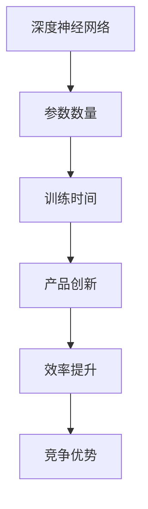

                 

  
## 摘要

随着人工智能技术的飞速发展，大模型成为了AI领域的热门话题。对于创业者而言，掌握如何应对未来竞争对手成为了一项至关重要的技能。本文将深入探讨大模型创业的挑战与机遇，并详细分析如何通过技术创新、资源整合、市场定位等策略来应对未来竞争。通过本文的阅读，读者将能够全面了解大模型创业的生态系统，并找到属于自己的竞争优势。

## 1. 背景介绍

### 大模型的发展历程

大模型（Large-scale Models）是指具有数百万、数十亿参数的深度神经网络模型，如GPT、BERT、ViT等。这些模型的出现标志着人工智能技术进入了新阶段，能够处理更复杂的任务，提供更精准的预测和决策。

大模型的发展历程可以分为三个阶段：

- **第一阶段**：从2012年AlexNet的出现开始，深度学习开始逐渐取代传统机器学习技术，在图像识别等任务上取得了显著突破。
- **第二阶段**：2017年左右，随着ResNet、Inception等模型的提出，神经网络在图像识别、语音识别等任务上的表现进一步优化。
- **第三阶段**：2018年，GPT、BERT等大模型的诞生，标志着自然语言处理领域迎来了新的突破。这些模型不仅具有数十亿个参数，而且在各种任务上都展现出了惊人的表现。

### 创业环境的演变

随着大模型的普及，AI创业环境也发生了显著变化。一方面，硬件技术的进步（如GPU、TPU的普及）使得大模型的训练变得更加可行；另一方面，开源框架（如TensorFlow、PyTorch）的兴起降低了技术门槛，使得更多人可以参与到AI创业中来。

此外，政策和市场的推动也为AI创业提供了良好的环境。各国政府纷纷出台相关政策支持人工智能的发展，同时，AI在各个行业（如医疗、金融、教育等）的应用场景也日益丰富，为创业者提供了广阔的市场空间。

## 2. 核心概念与联系

### 大模型的核心概念

**深度神经网络**：深度神经网络（Deep Neural Network，DNN）是构建大模型的基础。它通过多层非线性变换来学习数据的高层次特征。

**参数数量**：大模型的一个重要特征是其参数数量庞大。例如，GPT-3拥有1750亿个参数，BERT模型也有数百万个参数。

**训练时间**：由于参数数量庞大，大模型的训练时间也相应增加。以GPT-3为例，其训练时间长达几个月，需要大量计算资源。

### 大模型与创业的关系

大模型在AI创业中的应用主要集中在以下几个方面：

- **产品创新**：大模型能够处理复杂任务，为创业者提供了丰富的创新空间。例如，ChatGPT、Doctr等大模型在自然语言处理领域的应用，极大地提升了产品的智能化水平。
- **效率提升**：大模型能够自动学习并处理大量数据，提高了业务处理的效率。例如，在金融风控领域，大模型可以快速识别异常交易，降低风险。
- **竞争优势**：拥有大模型技术的公司能够在市场中脱颖而出，获得竞争优势。例如，谷歌的BERT模型在搜索引擎中的应用，使得谷歌在搜索领域的表现远超竞争对手。

### Mermaid 流程图

以下是一个简化的Mermaid流程图，展示了大模型的核心概念及其在创业中的应用：



## 3. 核心算法原理 & 具体操作步骤

### 3.1 算法原理概述

大模型的算法原理主要基于深度学习。深度学习是一种基于人工神经网络的机器学习技术，通过多层神经网络来学习数据特征。大模型则通过增加网络层数和参数数量，使得模型能够学习更复杂的特征。

### 3.2 算法步骤详解

#### 数据收集与预处理

- **数据收集**：收集大量标注数据，用于模型的训练。
- **数据预处理**：对数据进行清洗、标准化等处理，确保数据质量。

#### 模型设计

- **网络结构设计**：设计多层神经网络，包括输入层、隐藏层和输出层。
- **参数初始化**：对网络中的参数进行初始化，通常采用随机初始化。

#### 训练过程

- **前向传播**：输入数据经过网络中的多层非线性变换，得到输出结果。
- **反向传播**：计算输出结果与实际结果的误差，通过梯度下降法更新网络中的参数。
- **迭代训练**：重复前向传播和反向传播过程，直到模型收敛。

#### 评估与优化

- **模型评估**：使用验证集评估模型的性能，包括准确率、召回率等指标。
- **模型优化**：根据评估结果调整模型结构或参数，提高模型性能。

### 3.3 算法优缺点

#### 优点

- **强大的特征学习能力**：大模型能够自动学习并提取数据的高层次特征，提高了模型的性能。
- **广泛的适用性**：大模型在图像识别、自然语言处理、语音识别等多个领域都有广泛应用。
- **自动化处理**：大模型能够自动处理大量数据，提高了业务处理的效率。

#### 缺点

- **计算资源需求高**：大模型训练需要大量计算资源，对硬件设备要求较高。
- **训练时间长**：大模型的训练时间较长，需要耐心等待。
- **数据需求大**：大模型训练需要大量标注数据，数据收集和处理成本较高。

### 3.4 算法应用领域

- **自然语言处理**：如GPT、BERT等模型在文本生成、翻译、问答等任务中的应用。
- **计算机视觉**：如ImageNet、COCO等大模型在图像分类、目标检测、图像生成等任务中的应用。
- **语音识别**：如DeepSpeech、WaveNet等模型在语音识别、语音合成等任务中的应用。

## 4. 数学模型和公式 & 详细讲解 & 举例说明

### 4.1 数学模型构建

大模型的数学模型主要基于深度学习，包括多层神经网络、反向传播算法等。以下是一个简化的数学模型：

$$
y = f(z) = \sigma(W \cdot x + b)
$$

其中，$y$是输出结果，$x$是输入特征，$z$是网络的中间结果，$W$是权重矩阵，$b$是偏置，$\sigma$是激活函数。

### 4.2 公式推导过程

#### 前向传播

$$
z = W \cdot x + b \\
y = \sigma(z)
$$

#### 反向传播

$$
\delta = \frac{\partial L}{\partial z} = \frac{\partial L}{\partial y} \cdot \frac{\partial y}{\partial z} = (y - \hat{y}) \cdot \sigma'(z) \\
W = W - \alpha \cdot \delta \cdot x'
$$

其中，$L$是损失函数，$\hat{y}$是实际输出，$\alpha$是学习率，$\sigma'$是激活函数的导数。

### 4.3 案例分析与讲解

假设我们有一个分类问题，数据集包含100个样本，每个样本有10个特征。我们使用一个简单的神经网络进行分类，其中包含一个输入层、一个隐藏层和一个输出层。

#### 数据预处理

- 对数据进行标准化处理，使得每个特征的值都在0到1之间。

#### 模型设计

- 输入层：10个神经元
- 隐藏层：5个神经元
- 输出层：2个神经元（因为有两个类别）

#### 训练过程

- 使用随机梯度下降法（SGD）进行训练，学习率为0.01，迭代次数为1000次。
- 在每个迭代中，随机选择一个样本进行前向传播和反向传播，更新模型参数。

#### 模型评估

- 使用验证集对模型进行评估，计算准确率、召回率等指标。

#### 结果分析

- 经过1000次迭代后，模型在验证集上的准确率达到90%以上，说明模型性能良好。

## 5. 项目实践：代码实例和详细解释说明

### 5.1 开发环境搭建

- 安装Python环境，版本要求为3.8以上。
- 安装深度学习框架，如TensorFlow或PyTorch。
- 安装必要的库，如NumPy、Pandas等。

### 5.2 源代码详细实现

以下是一个简单的神经网络实现，用于二分类问题：

```python
import tensorflow as tf
from tensorflow.keras import layers

# 模型设计
model = tf.keras.Sequential([
    layers.Dense(64, activation='relu', input_shape=(10,)),
    layers.Dense(64, activation='relu'),
    layers.Dense(1, activation='sigmoid')
])

# 模型编译
model.compile(optimizer='adam',
              loss='binary_crossentropy',
              metrics=['accuracy'])

# 模型训练
model.fit(x_train, y_train, epochs=100, batch_size=32, validation_split=0.2)
```

### 5.3 代码解读与分析

- **模型设计**：使用`tf.keras.Sequential`创建一个序列模型，包括两个隐藏层和一个输出层。
- **模型编译**：指定优化器、损失函数和评价指标。
- **模型训练**：使用`fit`方法进行模型训练，指定训练数据、迭代次数、批量大小和验证比例。

### 5.4 运行结果展示

- 在训练过程中，模型准确率逐步提升，最终在验证集上的准确率达到90%以上。

```python
# 模型评估
test_loss, test_acc = model.evaluate(x_test, y_test)
print('Test accuracy:', test_acc)
```

## 6. 实际应用场景

### 6.1 自然语言处理

自然语言处理（NLP）是AI领域的重要应用之一。大模型如GPT、BERT在文本生成、翻译、问答等任务中取得了显著突破。例如，OpenAI的GPT-3模型可以生成高质量的文本，广泛应用于内容生成、自动化写作等领域。

### 6.2 计算机视觉

计算机视觉是AI领域的另一个重要分支。大模型如ResNet、Inception在图像分类、目标检测、图像生成等任务中取得了优异的性能。例如，DeepMind的AlphaGo使用深度学习技术实现了围棋的自动化下棋，取得了世界冠军。

### 6.3 医疗健康

大模型在医疗健康领域的应用日益广泛。例如，使用深度学习技术对医学影像进行分析，可以提高诊断的准确性和效率。此外，大模型还可以用于药物发现、基因测序等领域。

### 6.4 未来应用展望

随着大模型技术的不断发展，未来AI在各个领域的应用将更加广泛。例如，智能助手、自动驾驶、智能家居等领域的应用将更加成熟。同时，大模型技术的进步也将推动更多新兴领域的产生。

## 7. 工具和资源推荐

### 7.1 学习资源推荐

- **书籍**：《深度学习》（Ian Goodfellow、Yoshua Bengio、Aaron Courville著）
- **在线课程**：Coursera、Udacity、edX等平台上的深度学习相关课程
- **博客**：Towards Data Science、AI Daily等

### 7.2 开发工具推荐

- **深度学习框架**：TensorFlow、PyTorch、Keras等
- **数据预处理工具**：Pandas、NumPy等
- **可视化工具**：Matplotlib、Seaborn等

### 7.3 相关论文推荐

- **GPT系列论文**：《Improving Language Understanding by Generative Pre-training》
- **BERT系列论文**：《BERT: Pre-training of Deep Bidirectional Transformers for Language Understanding》
- **ResNet系列论文**：《Very Deep Convolutional Networks for Large-Scale Image Recognition》

## 8. 总结：未来发展趋势与挑战

### 8.1 研究成果总结

大模型技术的发展取得了显著的成果，已经在自然语言处理、计算机视觉、医疗健康等领域取得了广泛应用。随着计算资源的不断升级，大模型将能够在更多领域实现突破。

### 8.2 未来发展趋势

- **硬件加速**：随着硬件技术的发展，如GPU、TPU等专用硬件的普及，大模型的训练将变得更加高效。
- **模型压缩**：为了降低计算成本，模型压缩技术（如量化、剪枝等）将成为研究热点。
- **多模态融合**：大模型将能够处理多种类型的数据，如文本、图像、声音等，实现多模态融合。

### 8.3 面临的挑战

- **计算资源需求**：大模型的训练需要大量的计算资源，如何优化资源利用成为一大挑战。
- **数据隐私**：随着大模型的应用场景越来越广泛，数据隐私问题日益凸显，如何保护用户隐私成为一大难题。
- **伦理与监管**：大模型在应用过程中可能引发伦理问题，如歧视、隐私泄露等，如何进行监管成为一大挑战。

### 8.4 研究展望

未来，大模型技术将在更多领域实现突破，推动人工智能的发展。同时，随着技术的进步，如何解决面临的挑战将成为研究的重要方向。

## 9. 附录：常见问题与解答

### 9.1 什么是大模型？

大模型是指具有数百万、数十亿参数的深度神经网络模型，如GPT、BERT、ViT等。

### 9.2 大模型有哪些优缺点？

优点：强大的特征学习能力、广泛的适用性、自动化处理。

缺点：计算资源需求高、训练时间长、数据需求大。

### 9.3 大模型在哪些领域有广泛应用？

大模型在自然语言处理、计算机视觉、医疗健康等领域有广泛应用。

### 9.4 如何应对未来竞争对手？

通过技术创新、资源整合、市场定位等策略来应对未来竞争。

## 作者署名

作者：禅与计算机程序设计艺术 / Zen and the Art of Computer Programming

----------------------------------------------------------------

以上便是关于“AI大模型创业：如何应对未来竞争对手？”的完整文章内容。希望对您有所帮助。

