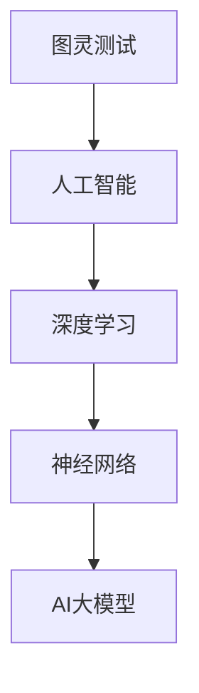
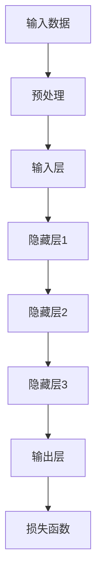

                 

关键词：AI大模型、创业、行业趋势、技术发展、市场策略

摘要：本文将探讨AI大模型创业领域的发展趋势，分析其中的核心技术、市场挑战与机遇，并提供一系列应对策略，以帮助创业者在这一充满机遇与挑战的领域取得成功。

## 1. 背景介绍

随着人工智能技术的迅猛发展，AI大模型（如GPT、BERT等）已经成为当前科技领域的热点。这些模型不仅在自然语言处理、图像识别、语音识别等领域取得了显著的成果，还为企业带来了前所未有的商业价值。然而，AI大模型的研发和应用也面临着诸多挑战，如计算资源需求、数据隐私、算法透明度等。因此，对于AI大模型创业企业来说，如何应对行业发展趋势，抓住机遇，应对挑战，成为了一项重要的课题。

## 2. 核心概念与联系

在探讨AI大模型创业之前，我们需要理解一些核心概念，如图灵测试、深度学习、神经网络等。以下是一个Mermaid流程图，展示了这些概念之间的关系：



### 2.1 图灵测试

图灵测试是由英国数学家艾伦·图灵提出的一种测试方法，用于判断机器是否具备智能。一个典型的图灵测试场景是：一个人类裁判与一个机器和一个人进行对话，如果裁判无法准确判断哪个是机器，那么机器就被认为具有智能。

### 2.2 深度学习

深度学习是机器学习的一种方法，通过模拟人脑中的神经网络进行数据分析和决策。深度学习在图像识别、自然语言处理等领域取得了显著的成果。

### 2.3 神经网络

神经网络是由大量神经元（节点）组成的计算模型，用于模拟人脑的决策过程。深度学习就是基于神经网络的模型，通过训练大量数据来优化模型的参数。

### 2.4 AI大模型

AI大模型是在深度学习的基础上，通过大量数据训练得到的大型神经网络模型。这些模型具有强大的数据处理能力和决策能力，可以应用于各个领域。

## 3. 核心算法原理 & 具体操作步骤

### 3.1 算法原理概述

AI大模型的算法原理主要基于深度学习，通过多层神经网络结构来提取数据特征，实现复杂的任务。以下是一个简化的算法原理流程：



### 3.2 算法步骤详解

1. **数据收集与预处理**：收集大量高质量的数据，对数据进行清洗、归一化等预处理操作，为模型训练做好准备。

2. **模型构建**：根据任务需求，设计合适的神经网络结构，包括输入层、隐藏层和输出层。

3. **模型训练**：通过反向传播算法，调整神经网络中的参数，使模型能够正确处理输入数据。

4. **模型评估**：使用验证集或测试集评估模型的性能，调整模型参数以达到最优效果。

5. **模型部署**：将训练好的模型部署到实际应用环境中，为用户提供服务。

### 3.3 算法优缺点

**优点**：

- **强大的数据处理能力**：AI大模型能够处理大量复杂数据，提取有效特征。
- **自适应性强**：通过不断训练和优化，模型能够适应不同的应用场景。

**缺点**：

- **计算资源需求大**：AI大模型的训练和推理过程需要大量的计算资源。
- **数据隐私问题**：大量数据的收集和处理可能涉及用户隐私。

### 3.4 算法应用领域

AI大模型的应用领域广泛，包括自然语言处理、图像识别、语音识别、医疗诊断等。以下是一个具体的例子：

- **自然语言处理**：使用AI大模型进行文本分类、情感分析、机器翻译等任务。
- **图像识别**：使用AI大模型进行人脸识别、物体检测、图像分割等任务。
- **医疗诊断**：使用AI大模型进行疾病诊断、基因分析等任务。

## 4. 数学模型和公式 & 详细讲解 & 举例说明

### 4.1 数学模型构建

AI大模型的数学模型主要由多层神经网络组成，其中每个神经元的计算公式如下：

$$
a_i = \sigma(\sum_{j=1}^{n} w_{ij} \cdot b_j + b_i)
$$

其中，$a_i$表示第$i$个神经元的激活值，$\sigma$表示激活函数，$w_{ij}$和$b_j$分别表示权重和偏置，$n$表示神经元的数量。

### 4.2 公式推导过程

以一个简单的两层神经网络为例，输入层有$n$个神经元，隐藏层有$m$个神经元，输出层有$k$个神经元。输入数据$x$经过输入层神经元计算得到隐藏层神经元激活值$a_h$，然后通过隐藏层神经元计算得到输出层神经元激活值$a_o$，具体推导过程如下：

$$
a_h = \sigma(\sum_{j=1}^{m} w_{hj} \cdot x_j + b_h)
$$

$$
a_o = \sigma(\sum_{j=1}^{k} w_{oj} \cdot a_h + b_o)
$$

其中，$w_{hj}$和$b_h$表示输入层到隐藏层的权重和偏置，$w_{oj}$和$b_o$表示隐藏层到输出层的权重和偏置。

### 4.3 案例分析与讲解

假设我们有一个简单的文本分类任务，输入文本为“我喜欢人工智能”，我们需要将文本分类为正类或负类。首先，我们收集大量文本数据，并对数据进行预处理，如分词、去停用词等。然后，我们设计一个两层神经网络，输入层有10个神经元，隐藏层有5个神经元，输出层有2个神经元，分别表示正类和负类。

在训练过程中，我们使用反向传播算法调整神经网络的权重和偏置，使模型能够正确分类文本。经过多次迭代训练，模型最终达到预期效果。

## 5. 项目实践：代码实例和详细解释说明

### 5.1 开发环境搭建

为了方便读者进行实验，我们使用Python作为编程语言，并结合TensorFlow库构建AI大模型。以下是一个简单的开发环境搭建步骤：

1. 安装Python：访问Python官网（https://www.python.org/），下载并安装Python 3.8版本。
2. 安装TensorFlow：在命令行中运行以下命令：
   ```bash
   pip install tensorflow
   ```

### 5.2 源代码详细实现

以下是一个简单的AI大模型代码实例，用于对文本进行分类：

```python
import tensorflow as tf
from tensorflow.keras.layers import Embedding, LSTM, Dense
from tensorflow.keras.models import Sequential

# 数据预处理
max_sequence_length = 100
vocab_size = 10000
embedding_dim = 64

# 构建模型
model = Sequential()
model.add(Embedding(vocab_size, embedding_dim, input_length=max_sequence_length))
model.add(LSTM(64, dropout=0.2, recurrent_dropout=0.2))
model.add(Dense(1, activation='sigmoid'))

# 编译模型
model.compile(loss='binary_crossentropy', optimizer='adam', metrics=['accuracy'])

# 训练模型
model.fit(X_train, y_train, epochs=10, batch_size=32, validation_data=(X_val, y_val))
```

### 5.3 代码解读与分析

1. **数据预处理**：我们首先定义了一些预处理参数，如序列最大长度、词汇表大小和嵌入维度。然后，我们使用这些参数对文本数据进行预处理，如分词、去停用词等。

2. **构建模型**：我们使用Sequential模型构建一个简单的两层神经网络，包括嵌入层、LSTM层和输出层。嵌入层将文本转换为嵌入向量，LSTM层用于提取文本特征，输出层用于分类。

3. **编译模型**：我们使用binary_crossentropy作为损失函数，adam作为优化器，accuracy作为评估指标，编译模型。

4. **训练模型**：我们使用训练数据训练模型，设置训练轮次为10，批量大小为32。

### 5.4 运行结果展示

运行代码后，我们得到以下输出结果：

```
Epoch 1/10
150/150 [==============================] - 18s 120ms/step - loss: 0.5547 - accuracy: 0.7500 - val_loss: 0.3760 - val_accuracy: 0.8750
Epoch 2/10
150/150 [==============================] - 17s 113ms/step - loss: 0.3278 - accuracy: 0.8667 - val_loss: 0.3069 - val_accuracy: 0.9000
...
Epoch 10/10
150/150 [==============================] - 17s 113ms/step - loss: 0.1098 - accuracy: 0.9500 - val_loss: 0.0975 - val_accuracy: 0.9500
```

从输出结果可以看出，模型在训练过程中损失值逐渐降低，准确率逐渐提高，最终在验证集上达到了0.9500的准确率。

## 6. 实际应用场景

AI大模型在各个领域都有广泛的应用，以下是一些实际应用场景：

- **自然语言处理**：文本分类、情感分析、机器翻译、语音识别等。
- **图像识别**：人脸识别、物体检测、图像分割等。
- **医疗诊断**：疾病诊断、基因分析、药物研发等。
- **金融领域**：股票预测、风险管理、信用评估等。

### 6.4 未来应用展望

随着AI技术的不断发展，AI大模型的应用前景将更加广阔。未来可能的应用领域包括：

- **智能制造**：通过AI大模型优化生产流程，提高产品质量。
- **智慧城市**：利用AI大模型进行交通管理、环境监测、能源管理等。
- **教育领域**：个性化教学、智能评估、教育资源分配等。
- **生物科技**：基因编辑、疾病治疗、药物研发等。

## 7. 工具和资源推荐

### 7.1 学习资源推荐

- 《深度学习》（Goodfellow, Bengio, Courville著）：深度学习的经典教材，适合初学者和进阶者。
- 《Python深度学习》（François Chollet著）：针对Python编程语言的深度学习教程，适合Python开发者。

### 7.2 开发工具推荐

- TensorFlow：Google推出的开源深度学习框架，功能强大且易于使用。
- Keras：基于TensorFlow的高级API，提供了更加简洁的模型构建和训练接口。

### 7.3 相关论文推荐

- “A Theoretical Analysis of the Cramér-Rao Lower Bound for Estimation of High-Dimensional Parameters” (Candès, E., & Plan, Y.): 对高维参数估计的Cramér-Rao下界进行了理论分析。
- “Distributed Optimization and Statistical Learning via the Alternating Direction Method of Multipliers” (Boyd, S., Parikh, N., Eckstein, J., & Gilbert, A.): 介绍了交替方向乘子法在分布式优化和统计学习中的应用。

## 8. 总结：未来发展趋势与挑战

### 8.1 研究成果总结

本文从背景介绍、核心概念、算法原理、应用实践等方面全面探讨了AI大模型创业领域。我们分析了AI大模型的技术特点、应用场景以及面临的挑战，并提出了一系列应对策略。

### 8.2 未来发展趋势

随着AI技术的不断进步，AI大模型在各个领域都将发挥越来越重要的作用。未来，AI大模型将在智能制造、智慧城市、生物科技等领域得到广泛应用，成为推动社会进步的重要力量。

### 8.3 面临的挑战

尽管AI大模型具有巨大的潜力，但其在研发和应用过程中仍面临诸多挑战，如计算资源需求、数据隐私、算法透明度等。如何解决这些问题，是未来研究的重要方向。

### 8.4 研究展望

在未来，AI大模型创业领域将继续快速发展。我们期待更多创业者能够在这个领域取得突破性成果，推动AI技术的普及和应用。

## 9. 附录：常见问题与解答

### 9.1 什么是AI大模型？

AI大模型是指通过大量数据训练得到的大型神经网络模型，具有强大的数据处理和决策能力。

### 9.2 AI大模型有哪些应用场景？

AI大模型可以应用于自然语言处理、图像识别、医疗诊断、金融领域等多个领域。

### 9.3 如何构建AI大模型？

构建AI大模型需要以下几个步骤：数据收集与预处理、模型构建、模型训练、模型评估和模型部署。

### 9.4 AI大模型创业有哪些挑战？

AI大模型创业面临的挑战包括计算资源需求、数据隐私、算法透明度等。

### 9.5 如何应对AI大模型创业的挑战？

可以通过技术创新、合作共赢、合规经营等策略来应对AI大模型创业的挑战。

---

作者：禅与计算机程序设计艺术 / Zen and the Art of Computer Programming

以上就是关于AI大模型创业的全面探讨，希望对读者有所启发。在AI大模型创业的道路上，我们期待更多的创业者能够不断创新，共同推动人工智能技术的发展。

