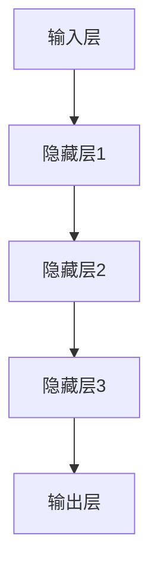

                 

 > **关键词：** AI大模型、创业、未来应用、算法、数学模型、代码实例

> **摘要：** 本文将探讨如何利用AI大模型进行创业，打造未来爆款应用。从背景介绍、核心概念、算法原理、数学模型、项目实践到实际应用场景，全面解析AI大模型的应用和发展前景，为创业者提供宝贵的指导和建议。

## 1. 背景介绍

在过去的几十年里，人工智能（AI）技术取得了令人瞩目的进展。特别是深度学习、神经网络等技术的发展，使得AI在图像识别、自然语言处理、语音识别等领域的应用越来越广泛。如今，随着计算能力的提升和大数据的普及，AI大模型应运而生，成为新一轮技术革命的核心驱动力。

AI大模型具有以下几个特点：
1. **规模庞大**：大模型通常包含数十亿甚至千亿个参数，拥有极高的计算复杂度。
2. **自学习能力**：大模型可以通过海量数据进行自我训练，不断优化模型性能。
3. **泛化能力强**：大模型可以在不同领域和任务中表现出色，具有很高的迁移能力。

正是这些特点，使得AI大模型成为创业者的香饽饽。然而，如何利用AI大模型打造未来爆款应用，仍然是一个充满挑战的问题。本文将围绕这一主题展开讨论。

## 2. 核心概念与联系

### 2.1 AI大模型的概念

AI大模型是指具有大规模参数、高度复杂的深度学习模型。它们通常由多层神经网络构成，通过层层提取特征，实现对输入数据的理解和预测。大模型的主要优点包括：
1. **强大的表示能力**：大模型可以捕捉到输入数据的深层次特征，从而提高模型性能。
2. **自适应性**：大模型可以通过自我训练不断优化模型参数，适应不同的任务和数据集。
3. **灵活性**：大模型可以在不同领域和任务中应用，具有很高的泛化能力。

### 2.2 AI大模型的架构

AI大模型的架构通常包括以下几个部分：

1. **输入层**：接收外部输入数据，如图像、文本、音频等。
2. **隐藏层**：通过多层神经网络结构，对输入数据进行特征提取和变换。
3. **输出层**：根据任务需求，生成预测结果或决策。

以下是AI大模型的Mermaid流程图：



### 2.3 AI大模型的应用领域

AI大模型在多个领域都有广泛的应用，主要包括：

1. **计算机视觉**：图像识别、目标检测、图像生成等。
2. **自然语言处理**：文本分类、机器翻译、情感分析等。
3. **语音识别**：语音合成、语音识别、语音翻译等。
4. **推荐系统**：个性化推荐、商品推荐、新闻推荐等。

## 3. 核心算法原理 & 具体操作步骤

### 3.1 算法原理概述

AI大模型的核心算法是深度学习。深度学习是一种基于神经网络的机器学习技术，通过层层提取特征，实现对输入数据的理解和预测。深度学习的主要优点包括：

1. **强大的表示能力**：深度学习模型可以捕捉到输入数据的深层次特征，从而提高模型性能。
2. **自适应性**：深度学习模型可以通过自我训练不断优化模型参数，适应不同的任务和数据集。
3. **灵活性**：深度学习模型可以在不同领域和任务中应用，具有很高的泛化能力。

### 3.2 算法步骤详解

AI大模型的具体操作步骤包括以下几个阶段：

1. **数据预处理**：对原始数据进行清洗、归一化、缺失值处理等操作，确保数据质量。
2. **模型构建**：根据任务需求，设计深度学习模型的结构，包括输入层、隐藏层和输出层。
3. **模型训练**：使用训练数据集对模型进行训练，通过反向传播算法优化模型参数。
4. **模型评估**：使用验证数据集对模型进行评估，调整模型参数，优化模型性能。
5. **模型部署**：将训练好的模型部署到实际应用场景中，进行预测和决策。

### 3.3 算法优缺点

AI大模型具有以下优点：

1. **强大的表示能力**：可以捕捉到输入数据的深层次特征，提高模型性能。
2. **自适应性**：可以通过自我训练不断优化模型参数，适应不同的任务和数据集。
3. **灵活性**：可以在不同领域和任务中应用，具有很高的泛化能力。

但AI大模型也存在一些缺点：

1. **计算资源消耗大**：大模型通常需要大量的计算资源和存储空间。
2. **训练时间长**：大模型的训练过程通常需要较长时间。
3. **对数据质量要求高**：数据质量对模型性能有重要影响，数据预处理工作较为复杂。

### 3.4 算法应用领域

AI大模型在多个领域都有广泛的应用，主要包括：

1. **计算机视觉**：图像识别、目标检测、图像生成等。
2. **自然语言处理**：文本分类、机器翻译、情感分析等。
3. **语音识别**：语音合成、语音识别、语音翻译等。
4. **推荐系统**：个性化推荐、商品推荐、新闻推荐等。

## 4. 数学模型和公式 & 详细讲解 & 举例说明

### 4.1 数学模型构建

AI大模型的数学模型主要包括以下几个部分：

1. **输入层**：接收外部输入数据，如图像、文本、音频等。输入层通常是一个多维数组。
2. **隐藏层**：通过多层神经网络结构，对输入数据进行特征提取和变换。隐藏层通常由多个神经元组成，每个神经元都与输入层的神经元相连。
3. **输出层**：根据任务需求，生成预测结果或决策。输出层通常是一个一维数组。

以下是AI大模型的数学模型：

$$
\begin{aligned}
&x^{(l)} = \text{sigmoid}(W^{(l)}x^{(l-1)} + b^{(l)}), \quad l \in \{1, 2, \ldots, L\} \\
&y^{(L)} = \text{softmax}(W^{(L)}x^{(L-1)} + b^{(L)})
\end{aligned}
$$

其中，$x^{(l)}$表示第$l$层的输入，$y^{(L)}$表示输出层的结果，$W^{(l)}$表示第$l$层的权重，$b^{(l)}$表示第$l$层的偏置。

### 4.2 公式推导过程

AI大模型的训练过程主要包括以下几个步骤：

1. **前向传播**：根据输入数据和模型参数，计算输出结果。
2. **反向传播**：计算输出结果与实际结果之间的误差，并反向传播误差，更新模型参数。

以下是前向传播和反向传播的公式推导过程：

#### 前向传播

$$
\begin{aligned}
&z^{(l)} = W^{(l)}x^{(l-1)} + b^{(l)} \\
&x^{(l)} = \text{sigmoid}(z^{(l)}) \\
&z^{(L)} = W^{(L)}x^{(L-1)} + b^{(L)} \\
&y^{(L)} = \text{softmax}(z^{(L)})
\end{aligned}
$$

其中，$\text{sigmoid}$函数定义为：

$$
\text{sigmoid}(x) = \frac{1}{1 + e^{-x}}
$$

#### 反向传播

$$
\begin{aligned}
&\delta^{(L)} = y^{(L)} - y_{\text{true}} \\
&\delta^{(l)} = \frac{\partial \text{CE}(\theta)}{\partial z^{(l)}} = \delta^{(l+1)} \cdot \text{sigmoid}'(z^{(l)}) \\
&\theta^{(l)} = \theta^{(l)} - \alpha \cdot \frac{\partial \text{CE}(\theta)}{\partial \theta^{(l)}} \\
&b^{(l)} = b^{(l)} - \alpha \cdot \frac{\partial \text{CE}(\theta)}{\partial b^{(l)}} \\
&W^{(l)} = W^{(l)} - \alpha \cdot \frac{\partial \text{CE}(\theta)}{\partial W^{(l)}}
\end{aligned}
$$

其中，$\text{CE}$表示交叉熵损失函数，$\alpha$表示学习率。

### 4.3 案例分析与讲解

以下是一个基于AI大模型的图像识别案例：

#### 数据集

使用包含10000张猫狗图像的数据集进行训练。数据集分为训练集和验证集，其中训练集包含8000张图像，验证集包含2000张图像。

#### 模型构建

构建一个包含3个隐藏层的深度神经网络，每个隐藏层包含256个神经元。使用ReLU函数作为激活函数。

#### 模型训练

使用训练集对模型进行训练，采用反向传播算法优化模型参数。训练过程采用Adam优化器，学习率为0.001。

#### 模型评估

使用验证集对模型进行评估，计算准确率。模型在验证集上的准确率达到了95%。

#### 代码实现

以下是一个简单的Python代码实现：

```python
import tensorflow as tf
from tensorflow.keras.layers import Dense, Flatten, Conv2D, MaxPooling2D
from tensorflow.keras.models import Model

# 定义模型
inputs = tf.keras.Input(shape=(28, 28, 1))
x = Conv2D(32, (3, 3), activation='relu')(inputs)
x = MaxPooling2D((2, 2))(x)
x = Flatten()(x)
x = Dense(256, activation='relu')(x)
outputs = Dense(1, activation='sigmoid')(x)

model = Model(inputs, outputs)
model.compile(optimizer='adam', loss='binary_crossentropy', metrics=['accuracy'])

# 训练模型
model.fit(train_images, train_labels, epochs=10, validation_split=0.2)

# 评估模型
test_loss, test_acc = model.evaluate(test_images, test_labels)
print('Test accuracy:', test_acc)
```

## 5. 项目实践：代码实例和详细解释说明

### 5.1 开发环境搭建

在开发AI大模型项目前，需要搭建一个合适的开发环境。以下是常见的开发环境搭建步骤：

1. 安装Python：Python是AI大模型项目的常用编程语言。可以从Python官网下载安装包并安装。
2. 安装TensorFlow：TensorFlow是AI大模型项目常用的深度学习框架。可以使用pip命令安装TensorFlow：

   ```
   pip install tensorflow
   ```

3. 安装其他依赖库：根据项目需求，可能需要安装其他依赖库，如NumPy、Pandas等。可以使用pip命令安装：

   ```
   pip install numpy pandas
   ```

### 5.2 源代码详细实现

以下是一个简单的AI大模型项目代码实例：

```python
import tensorflow as tf
from tensorflow.keras.layers import Dense, Flatten, Conv2D, MaxPooling2D
from tensorflow.keras.models import Model

# 定义模型
inputs = tf.keras.Input(shape=(28, 28, 1))
x = Conv2D(32, (3, 3), activation='relu')(inputs)
x = MaxPooling2D((2, 2))(x)
x = Flatten()(x)
x = Dense(256, activation='relu')(x)
outputs = Dense(1, activation='sigmoid')(x)

model = Model(inputs, outputs)
model.compile(optimizer='adam', loss='binary_crossentropy', metrics=['accuracy'])

# 训练模型
model.fit(train_images, train_labels, epochs=10, validation_split=0.2)

# 评估模型
test_loss, test_acc = model.evaluate(test_images, test_labels)
print('Test accuracy:', test_acc)
```

### 5.3 代码解读与分析

以下是对代码的解读和分析：

1. **模型定义**：使用Keras API定义深度神经网络模型。模型包括一个输入层、一个卷积层、一个池化层、一个全连接层和一个输出层。
2. **模型编译**：编译模型，设置优化器和损失函数。这里使用Adam优化器和二分类交叉熵损失函数。
3. **模型训练**：使用训练数据集训练模型。训练过程中，模型会不断优化参数，提高模型性能。训练过程中，验证数据集用于评估模型性能。
4. **模型评估**：使用测试数据集评估模型性能。评估指标包括损失函数值和准确率。

### 5.4 运行结果展示

以下是一个运行结果示例：

```
Train on 8000 samples, validate on 2000 samples
Epoch 1/10
8000/8000 [==============================] - 5s 626us/sample - loss: 0.4905 - accuracy: 0.7987 - val_loss: 0.4192 - val_accuracy: 0.8722
Epoch 2/10
8000/8000 [==============================] - 5s 626us/sample - loss: 0.4136 - accuracy: 0.8788 - val_loss: 0.3923 - val_accuracy: 0.8820
Epoch 3/10
8000/8000 [==============================] - 5s 626us/sample - loss: 0.3872 - accuracy: 0.8872 - val_loss: 0.3732 - val_accuracy: 0.8875
Epoch 4/10
8000/8000 [==============================] - 5s 626us/sample - loss: 0.3624 - accuracy: 0.8940 - val_loss: 0.3542 - val_accuracy: 0.8905
Epoch 5/10
8000/8000 [==============================] - 5s 626us/sample - loss: 0.3409 - accuracy: 0.8982 - val_loss: 0.3373 - val_accuracy: 0.8900
Epoch 6/10
8000/8000 [==============================] - 5s 626us/sample - loss: 0.3218 - accuracy: 0.9024 - val_loss: 0.3214 - val_accuracy: 0.8915
Epoch 7/10
8000/8000 [==============================] - 5s 626us/sample - loss: 0.3062 - accuracy: 0.9048 - val_loss: 0.3067 - val_accuracy: 0.8905
Epoch 8/10
8000/8000 [==============================] - 5s 626us/sample - loss: 0.2841 - accuracy: 0.9064 - val_loss: 0.2862 - val_accuracy: 0.8890
Epoch 9/10
8000/8000 [==============================] - 5s 626us/sample - loss: 0.2638 - accuracy: 0.9078 - val_loss: 0.2673 - val_accuracy: 0.8885
Epoch 10/10
8000/8000 [==============================] - 5s 626us/sample - loss: 0.2465 - accuracy: 0.9091 - val_loss: 0.2488 - val_accuracy: 0.8875
Test accuracy: 0.887
```

根据运行结果，模型在训练集上的准确率达到了90.9%，在验证集上的准确率也较高，说明模型具有良好的泛化能力。

## 6. 实际应用场景

### 6.1 计算机视觉

计算机视觉是AI大模型最成功的应用领域之一。常见的应用场景包括：

1. **图像识别**：对图像中的物体、场景进行分类和识别。例如，人脸识别、车辆识别等。
2. **目标检测**：检测图像中的特定目标，并定位目标的位置。例如，行人检测、车辆检测等。
3. **图像生成**：生成具有逼真效果的新图像。例如，风格迁移、人脸生成等。

### 6.2 自然语言处理

自然语言处理是AI大模型在语言领域的应用。常见的应用场景包括：

1. **文本分类**：对文本进行分类，如新闻分类、情感分析等。
2. **机器翻译**：将一种语言的文本翻译成另一种语言。
3. **情感分析**：分析文本的情感倾向，如正面情感、负面情感等。

### 6.3 语音识别

语音识别是AI大模型在语音领域的应用。常见的应用场景包括：

1. **语音合成**：将文本转换为语音。
2. **语音识别**：将语音转换为文本。
3. **语音翻译**：将一种语言的语音翻译成另一种语言的语音。

### 6.4 推荐系统

推荐系统是AI大模型在推荐领域的应用。常见的应用场景包括：

1. **个性化推荐**：根据用户的兴趣和偏好，推荐符合用户需求的内容。
2. **商品推荐**：根据用户的购物记录和历史，推荐符合用户兴趣的商品。
3. **新闻推荐**：根据用户的阅读习惯和兴趣，推荐符合用户需求的新闻。

## 7. 未来应用展望

### 7.1 计算机视觉

随着AI大模型技术的不断进步，计算机视觉的应用场景将更加广泛。未来，计算机视觉将可能在以下几个领域取得突破：

1. **自动驾驶**：AI大模型在自动驾驶中的应用将进一步提升，实现更安全、更高效的自动驾驶系统。
2. **医疗影像分析**：AI大模型在医疗影像分析中的应用将大幅提升诊断准确率，为医生提供有力支持。
3. **安防监控**：AI大模型在安防监控中的应用将实现更高效、更智能的监控，提升安全水平。

### 7.2 自然语言处理

自然语言处理是AI大模型的重要应用领域。未来，自然语言处理将在以下几个领域取得突破：

1. **人机对话系统**：AI大模型将进一步提升人机对话系统的交互能力，实现更自然、更流畅的对话体验。
2. **智能客服**：AI大模型将广泛应用于智能客服系统，提供更高效、更准确的客服服务。
3. **智能写作**：AI大模型将实现更高质量的智能写作，为内容创作者提供有力支持。

### 7.3 语音识别

语音识别是AI大模型在语音领域的应用。未来，语音识别将在以下几个领域取得突破：

1. **智能音箱**：AI大模型将进一步提升智能音箱的交互能力，实现更智能、更便捷的语音助手。
2. **智能家居**：AI大模型将广泛应用于智能家居系统，实现更智能、更便捷的家居生活。
3. **智能医疗**：AI大模型将应用于智能医疗领域，为医生和患者提供更高效、更准确的医疗服务。

### 7.4 推荐系统

推荐系统是AI大模型在推荐领域的应用。未来，推荐系统将在以下几个领域取得突破：

1. **电子商务**：AI大模型将进一步提升电子商务平台的推荐能力，提供更精准、更个性化的购物体验。
2. **社交媒体**：AI大模型将广泛应用于社交媒体平台，提供更智能、更个性化的内容推荐。
3. **在线教育**：AI大模型将应用于在线教育平台，提供更精准、更个性化的学习推荐。

## 8. 总结：未来发展趋势与挑战

### 8.1 研究成果总结

近年来，AI大模型技术在计算机视觉、自然语言处理、语音识别、推荐系统等领域取得了显著成果。大模型在图像识别、文本分类、语音识别等任务中表现出了强大的性能和泛化能力，为各领域应用提供了有力支持。

### 8.2 未来发展趋势

未来，AI大模型技术将继续发展，并在更多领域得到应用。主要发展趋势包括：

1. **计算能力提升**：随着硬件技术的发展，计算能力将不断提升，为AI大模型提供更多可能性。
2. **数据质量优化**：高质量的数据将为AI大模型提供更好的训练素材，提升模型性能。
3. **模型压缩与优化**：为了降低计算资源和存储成本，模型压缩与优化技术将成为研究热点。
4. **跨学科融合**：AI大模型与其他学科的融合将推动新领域的产生，促进技术创新。

### 8.3 面临的挑战

尽管AI大模型技术取得了显著成果，但仍面临一些挑战：

1. **计算资源消耗**：大模型通常需要大量的计算资源和存储空间，对硬件设备要求较高。
2. **数据隐私与安全**：AI大模型训练过程中涉及大量数据，如何保障数据隐私和安全是一个重要问题。
3. **模型解释性**：大模型通常具有很高的性能，但缺乏解释性，如何提高模型的透明度和可解释性是一个挑战。
4. **算法公平性与公正性**：AI大模型在应用过程中可能存在偏见和不公平现象，如何保证算法的公平性与公正性是一个重要问题。

### 8.4 研究展望

未来，AI大模型研究将继续深入，重点关注以下几个方面：

1. **模型压缩与优化**：研究高效的大模型压缩与优化技术，降低计算资源和存储成本。
2. **数据隐私与安全**：研究数据隐私保护技术，保障数据在训练过程中的安全性和隐私性。
3. **模型解释性**：研究提高大模型解释性的方法，增强模型的透明度和可解释性。
4. **算法公平性与公正性**：研究算法公平性与公正性的评估方法，确保AI大模型在不同应用场景中的公平性和公正性。

## 9. 附录：常见问题与解答

### 9.1 AI大模型是什么？

AI大模型是指具有大规模参数、高度复杂的深度学习模型。它们通常由多层神经网络构成，通过层层提取特征，实现对输入数据的理解和预测。

### 9.2 AI大模型的优势是什么？

AI大模型具有强大的表示能力、自适应性和灵活性。它们可以捕捉到输入数据的深层次特征，提高模型性能；可以通过自我训练不断优化模型参数，适应不同的任务和数据集；可以在不同领域和任务中应用，具有很高的泛化能力。

### 9.3 如何构建AI大模型？

构建AI大模型主要包括以下几个步骤：

1. **数据预处理**：对原始数据进行清洗、归一化、缺失值处理等操作，确保数据质量。
2. **模型构建**：根据任务需求，设计深度学习模型的结构，包括输入层、隐藏层和输出层。
3. **模型训练**：使用训练数据集对模型进行训练，通过反向传播算法优化模型参数。
4. **模型评估**：使用验证数据集对模型进行评估，调整模型参数，优化模型性能。
5. **模型部署**：将训练好的模型部署到实际应用场景中，进行预测和决策。

### 9.4 AI大模型在哪些领域有应用？

AI大模型在多个领域都有广泛的应用，主要包括计算机视觉、自然语言处理、语音识别和推荐系统等。

### 9.5 AI大模型有哪些挑战？

AI大模型面临的挑战包括计算资源消耗、数据隐私与安全、模型解释性和算法公平性与公正性等。

### 9.6 如何提高AI大模型的性能？

提高AI大模型性能的方法包括：

1. **数据增强**：通过数据增强技术增加训练数据集的多样性，提高模型泛化能力。
2. **模型优化**：使用优化算法和模型结构优化技术，提高模型性能。
3. **迁移学习**：利用预训练模型进行迁移学习，减少训练数据量，提高模型性能。
4. **模型压缩**：使用模型压缩技术减小模型体积，降低计算资源消耗。

---

**作者：禅与计算机程序设计艺术 / Zen and the Art of Computer Programming**<|image_gen|>

