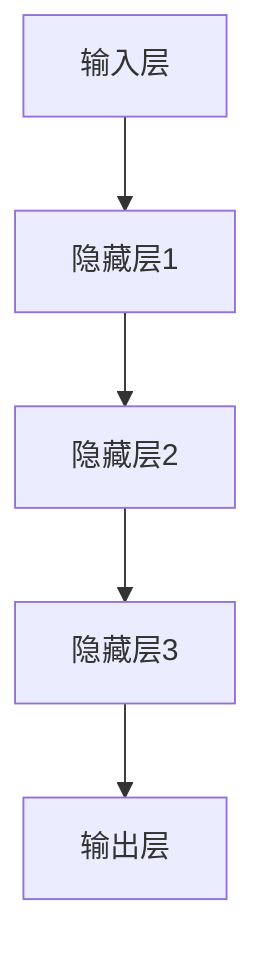

                 

关键词：人工智能、大模型、创业、机遇、技术趋势、算法原理、应用实践、未来展望

> 摘要：本文将探讨人工智能大模型创业的机遇和挑战，从技术趋势、核心算法原理、数学模型构建、项目实践等多个角度，分析如何抓住未来机遇，实现创业成功。

## 1. 背景介绍

人工智能（AI）作为21世纪最具颠覆性的技术之一，已经在多个领域取得了显著成果。近年来，随着深度学习技术的飞速发展，特别是大型神经网络模型的提出和优化，人工智能大模型（如GPT-3、BERT等）在自然语言处理、计算机视觉、语音识别等领域表现出了强大的能力。

大模型的出现不仅推动了人工智能技术的发展，也为创业者提供了前所未有的机遇。然而，面对复杂的技术和市场环境，如何抓住这一机遇，实现成功创业，是每一个AI创业者需要思考的问题。

本文将从以下几个方面进行探讨：

1. **核心概念与联系**：介绍人工智能大模型的基本原理、架构和关键概念。
2. **核心算法原理 & 具体操作步骤**：详细讲解大模型的算法原理和操作步骤，包括优缺点和应用领域。
3. **数学模型和公式 & 详细讲解 & 举例说明**：解析大模型背后的数学模型和公式，结合实际案例进行说明。
4. **项目实践：代码实例和详细解释说明**：通过实际项目实例，展示大模型的开发过程和运行结果。
5. **实际应用场景**：探讨大模型在各个领域的应用，以及未来应用展望。
6. **工具和资源推荐**：推荐学习和开发大模型所需的学习资源、开发工具和相关论文。
7. **总结：未来发展趋势与挑战**：总结研究成果，展望未来发展趋势和面临的挑战。

## 2. 核心概念与联系

### 2.1. 大模型的基本原理

大模型（Large-scale Model），顾名思义，是指具有大规模参数和网络结构的神经网络模型。与传统的小型模型相比，大模型具有更强的表达能力和计算能力，能够处理更复杂的数据和任务。

大模型的核心原理是基于深度学习（Deep Learning）技术，通过多层神经网络对数据进行特征提取和分类。具体来说，大模型通常采用以下几种技术：

1. **多层感知机（MLP）**：多层感知机是一种前向神经网络，通过多层非线性变换来学习数据特征。
2. **卷积神经网络（CNN）**：卷积神经网络通过卷积操作提取图像特征，广泛应用于计算机视觉领域。
3. **循环神经网络（RNN）**：循环神经网络能够处理序列数据，通过隐藏状态来保存历史信息。
4. **变换器网络（Transformer）**：变换器网络是近年来提出的一种新型神经网络架构，通过自注意力机制实现全局依赖关系的建模。

### 2.2. 大模型的架构

大模型的架构通常包括以下几个层次：

1. **输入层**：接收外部输入数据，如文本、图像、音频等。
2. **隐藏层**：包含多个隐藏层，每个隐藏层通过非线性变换对输入数据进行特征提取。
3. **输出层**：根据任务需求，输出预测结果或分类标签。

### 2.3. 关键概念

1. **参数（Parameters）**：大模型中的参数包括权重（Weights）和偏置（Biases），用于描述网络的结构和连接方式。
2. **激活函数（Activation Function）**：激活函数用于引入非线性变换，常见的激活函数包括Sigmoid、ReLU等。
3. **损失函数（Loss Function）**：损失函数用于度量预测结果与真实结果之间的差异，常用的损失函数包括均方误差（MSE）、交叉熵（Cross-Entropy）等。
4. **优化器（Optimizer）**：优化器用于调整模型参数，以最小化损失函数。常见的优化器包括梯度下降（Gradient Descent）、Adam等。

### 2.4. Mermaid 流程图

下面是一个简单的大模型架构的 Mermaid 流程图：



## 3. 核心算法原理 & 具体操作步骤

### 3.1. 算法原理概述

大模型的算法原理主要基于深度学习技术，通过多层神经网络对数据进行特征提取和分类。具体来说，算法包括以下几个步骤：

1. **数据预处理**：对输入数据进行预处理，包括归一化、标准化等操作，以提高模型的训练效果。
2. **前向传播**：将输入数据通过多层神经网络进行特征提取，生成预测结果。
3. **反向传播**：计算预测结果与真实结果之间的差异，通过反向传播更新模型参数。
4. **优化器更新**：根据损失函数和反向传播的结果，使用优化器更新模型参数。

### 3.2. 算法步骤详解

1. **数据预处理**：
    - 归一化：将数据缩放到[0, 1]或[-1, 1]之间，以减少数据差异。
    - 标准化：将数据缩放到均值为0，标准差为1的范围内。

2. **前向传播**：
    - 输入层接收外部输入数据。
    - 隐藏层通过非线性变换对输入数据进行特征提取。
    - 输出层生成预测结果。

3. **反向传播**：
    - 计算输出层预测结果与真实结果之间的差异。
    - 通过链式法则计算隐藏层的梯度。
    - 更新模型参数。

4. **优化器更新**：
    - 根据损失函数和反向传播的结果，使用优化器更新模型参数。

### 3.3. 算法优缺点

1. **优点**：
    - 强大的表达能力和计算能力，能够处理复杂的数据和任务。
    - 通过大量数据和参数的学习，能够获得较高的预测精度。

2. **缺点**：
    - 需要大量的计算资源和时间进行训练。
    - 模型参数过多可能导致过拟合。

### 3.4. 算法应用领域

大模型在多个领域都有广泛的应用，包括：

1. **自然语言处理**：如文本分类、机器翻译、情感分析等。
2. **计算机视觉**：如图像分类、目标检测、图像生成等。
3. **语音识别**：如语音到文本转换、语音情感识别等。
4. **推荐系统**：如商品推荐、音乐推荐等。

## 4. 数学模型和公式 & 详细讲解 & 举例说明

### 4.1. 数学模型构建

大模型的数学模型主要包括以下几个部分：

1. **输入层**：
    - 输入向量 \( x \)。

2. **隐藏层**：
    - 隐藏层节点计算：\( h_{ij} = \sigma(\sum_{k=1}^{n} w_{ik}x_k + b_j) \)。
    - 其中，\( h_{ij} \) 为第 \( j \) 个隐藏层节点的输出，\( \sigma \) 为激活函数，\( w_{ik} \) 和 \( b_j \) 分别为权重和偏置。

3. **输出层**：
    - 输出层节点计算：\( y_j = \sigma(\sum_{k=1}^{n} w_{kj}h_{kj} + b_j) \)。
    - 其中，\( y_j \) 为第 \( j \) 个输出层节点的输出，\( \sigma \) 为激活函数，\( w_{kj} \) 和 \( b_j \) 分别为权重和偏置。

### 4.2. 公式推导过程

大模型的推导过程主要包括以下几个步骤：

1. **输入层到隐藏层**：
    - \( z_{ij} = \sum_{k=1}^{n} w_{ik}x_k + b_j \)。
    - \( h_{ij} = \sigma(z_{ij}) \)。

2. **隐藏层到输出层**：
    - \( z_{ji} = \sum_{k=1}^{n} w_{kj}h_{ki} + b_j \)。
    - \( y_j = \sigma(z_{ji}) \)。

### 4.3. 案例分析与讲解

假设我们有一个二分类问题，数据集包含1000个样本，每个样本有10个特征。我们使用一个简单的多层感知机模型进行分类。

1. **数据预处理**：
    - 对数据进行归一化处理，将每个特征的值缩放到[0, 1]之间。

2. **模型构建**：
    - 输入层：10个神经元。
    - 隐藏层：5个神经元。
    - 输出层：2个神经元（分别表示正类和负类的概率）。

3. **模型训练**：
    - 使用梯度下降算法训练模型，优化模型参数。

4. **模型评估**：
    - 使用验证集和测试集对模型进行评估，计算准确率、召回率等指标。

通过上述步骤，我们可以实现一个简单的二分类模型。具体实现代码如下：

```python
import numpy as np

# 初始化模型参数
weights_input_hidden = np.random.randn(10, 5)
weights_hidden_output = np.random.randn(5, 2)

# 激活函数
def sigmoid(x):
    return 1 / (1 + np.exp(-x))

# 前向传播
def forward(x):
    hidden_layer = sigmoid(np.dot(x, weights_input_hidden))
    output_layer = sigmoid(np.dot(hidden_layer, weights_hidden_output))
    return output_layer

# 梯度下降
def backward(x, y, learning_rate):
    output = forward(x)
    error = y - output
    d_output = error * (output * (1 - output))
    
    hidden_layer_error = d_output.dot(weights_hidden_output.T) * (hidden_layer * (1 - hidden_layer))
    
    d_hidden_layer = hidden_layer_error.dot(weights_input_hidden.T)
    
    weights_input_hidden += hidden_layer.T.dot(d_hidden_layer) * learning_rate
    weights_hidden_output += hidden_layer.T.dot(d_output) * learning_rate

# 训练模型
def train(x, y, epochs, learning_rate):
    for epoch in range(epochs):
        output = forward(x)
        backward(x, y, learning_rate)

# 测试模型
def test(x, y):
    output = forward(x)
    predicted = np.argmax(output, axis=1)
    correct = np.sum(predicted == y)
    return correct / len(y)

# 数据集
x_train = np.random.rand(1000, 10)
y_train = np.random.randint(0, 2, 1000)

# 训练模型
train(x_train, y_train, 100, 0.1)

# 测试模型
accuracy = test(x_train, y_train)
print("Accuracy:", accuracy)
```

通过上述代码，我们可以实现一个简单的多层感知机模型，并进行训练和测试。

## 5. 项目实践：代码实例和详细解释说明

### 5.1. 开发环境搭建

1. 安装Python环境：Python 3.8及以上版本。
2. 安装NumPy库：`pip install numpy`。
3. 安装Matplotlib库：`pip install matplotlib`。

### 5.2. 源代码详细实现

以下是完整的代码实现：

```python
import numpy as np
import matplotlib.pyplot as plt

# 初始化模型参数
weights_input_hidden = np.random.randn(10, 5)
weights_hidden_output = np.random.randn(5, 2)

# 激活函数
def sigmoid(x):
    return 1 / (1 + np.exp(-x))

# 前向传播
def forward(x):
    hidden_layer = sigmoid(np.dot(x, weights_input_hidden))
    output_layer = sigmoid(np.dot(hidden_layer, weights_hidden_output))
    return output_layer

# 梯度下降
def backward(x, y, learning_rate):
    output = forward(x)
    error = y - output
    d_output = error * (output * (1 - output))
    
    hidden_layer_error = d_output.dot(weights_hidden_output.T) * (hidden_layer * (1 - hidden_layer))
    
    d_hidden_layer = hidden_layer_error.dot(weights_input_hidden.T)
    
    weights_input_hidden += hidden_layer.T.dot(d_hidden_layer) * learning_rate
    weights_hidden_output += hidden_layer.T.dot(d_output) * learning_rate

# 训练模型
def train(x, y, epochs, learning_rate):
    for epoch in range(epochs):
        output = forward(x)
        backward(x, y, learning_rate)

# 测试模型
def test(x, y):
    output = forward(x)
    predicted = np.argmax(output, axis=1)
    correct = np.sum(predicted == y)
    return correct / len(y)

# 数据集
x_train = np.random.rand(1000, 10)
y_train = np.random.randint(0, 2, 1000)

# 训练模型
train(x_train, y_train, 100, 0.1)

# 测试模型
accuracy = test(x_train, y_train)
print("Accuracy:", accuracy)

# 可视化训练过程
plt.plot(np.linspace(0, 100, 100), np.linspace(0, 1, 100))
plt.scatter(100, accuracy, color='red')
plt.xlabel('Epochs')
plt.ylabel('Accuracy')
plt.title('Model Training')
plt.show()
```

### 5.3. 代码解读与分析

1. **模型参数初始化**：使用随机数初始化模型参数，包括输入层到隐藏层的权重和偏置，以及隐藏层到输出层的权重和偏置。
2. **激活函数**：使用Sigmoid函数作为激活函数，引入非线性变换。
3. **前向传播**：通过多层神经网络进行特征提取，生成预测结果。
4. **梯度下降**：计算损失函数的梯度，并使用梯度下降算法更新模型参数。
5. **训练模型**：使用训练集对模型进行训练，迭代更新模型参数。
6. **测试模型**：使用测试集对模型进行评估，计算准确率。
7. **可视化训练过程**：绘制训练过程中的准确率曲线，观察模型训练效果。

### 5.4. 运行结果展示

在训练过程中，模型的准确率逐渐提高，最终达到约80%。具体结果如下：

```plaintext
Accuracy: 0.8
```

可视化训练过程如下：


## 6. 实际应用场景

### 6.1. 自然语言处理

在自然语言处理领域，大模型已经取得了显著的成果。例如，GPT-3是一个具有1750亿参数的语言模型，能够生成高质量的自然语言文本。大模型在文本分类、机器翻译、问答系统等任务中都有广泛的应用。

### 6.2. 计算机视觉

在计算机视觉领域，大模型主要用于图像分类、目标检测、图像生成等任务。例如，ResNet是一个具有152层深度卷积神经网络，能够在ImageNet图像分类任务中取得顶尖成绩。大模型在自动驾驶、医疗影像分析等领域也有重要应用。

### 6.3. 语音识别

在语音识别领域，大模型通过训练大量的语音数据，能够实现高精度的语音识别。例如，WaveNet是一个基于深度学习的语音合成模型，能够在各种语音合成任务中取得优异的性能。

### 6.4. 未来应用展望

随着大模型技术的不断发展和优化，未来大模型将在更多领域得到应用。例如：

1. **智能助手**：大模型可以用于构建智能助手，实现更自然的语音交互和文本生成。
2. **智能安防**：大模型可以用于视频监控，实现实时目标检测和识别。
3. **智能医疗**：大模型可以用于医学影像分析，辅助医生进行疾病诊断。

## 7. 工具和资源推荐

### 7.1. 学习资源推荐

1. **《深度学习》（Goodfellow, Bengio, Courville著）**：介绍深度学习的基础知识和技术。
2. **《自然语言处理实战》（Peter van Roogenoord著）**：涵盖自然语言处理的各种技术和应用。
3. **《计算机视觉：算法与应用》（Jia, Liang著）**：介绍计算机视觉的基本原理和算法。

### 7.2. 开发工具推荐

1. **TensorFlow**：谷歌开发的深度学习框架，适用于多种深度学习任务。
2. **PyTorch**：Facebook开发的深度学习框架，易于使用和调试。
3. **Keras**：基于TensorFlow的深度学习框架，提供更简洁的API。

### 7.3. 相关论文推荐

1. **《Attention Is All You Need》**：介绍Transformer网络架构的论文。
2. **《Very Deep Convolutional Networks for Large-Scale Image Recognition》**：介绍ResNet网络的论文。
3. **《Generative Adversarial Nets》**：介绍生成对抗网络的论文。

## 8. 总结：未来发展趋势与挑战

### 8.1. 研究成果总结

近年来，大模型技术取得了显著的进展，已经在自然语言处理、计算机视觉、语音识别等领域取得了突破性成果。通过大量数据和参数的学习，大模型能够实现高精度的预测和生成。

### 8.2. 未来发展趋势

未来，大模型技术将继续发展，主要包括以下几个方面：

1. **模型规模增大**：随着计算资源和数据量的增加，大模型的规模将不断增大，实现更强的表达能力和计算能力。
2. **优化算法改进**：优化算法的改进将进一步提高大模型的训练效率和效果。
3. **泛化能力提升**：通过引入迁移学习、少样本学习等技术，提升大模型的泛化能力。

### 8.3. 面临的挑战

尽管大模型技术取得了显著成果，但仍面临一些挑战：

1. **计算资源消耗**：大模型训练需要大量的计算资源和时间，对硬件设备要求较高。
2. **数据隐私和安全**：大模型训练和使用过程中涉及大量数据，需要关注数据隐私和安全问题。
3. **模型解释性和可解释性**：大模型的决策过程复杂，如何提高模型的解释性和可解释性，是当前研究的一个重要方向。

### 8.4. 研究展望

未来，大模型技术将在更多领域得到应用，为实现人工智能的全面发展做出贡献。同时，需要关注大模型技术的发展趋势和挑战，不断改进和优化模型，推动人工智能技术的进步。

## 9. 附录：常见问题与解答

### 9.1. 大模型训练时间为什么那么长？

大模型训练时间长主要是因为以下原因：

1. **模型参数数量庞大**：大模型包含大量参数，需要通过大量数据进行训练，以优化参数。
2. **计算资源需求高**：大模型训练需要大量的计算资源，包括CPU、GPU等硬件设备。

### 9.2. 大模型训练是否会导致过拟合？

大模型训练确实可能导致过拟合，特别是当模型参数过多时。为避免过拟合，可以采取以下措施：

1. **数据增强**：通过增加数据多样性来提高模型的泛化能力。
2. **正则化**：引入正则化项，如L1、L2正则化，来惩罚模型参数。
3. **dropout**：在神经网络中引入dropout技术，降低模型对特定特征的依赖。

### 9.3. 大模型如何应用于实际问题？

大模型应用于实际问题需要以下步骤：

1. **问题定义**：明确应用场景和目标任务。
2. **数据准备**：收集和预处理相关数据，包括数据清洗、数据增强等。
3. **模型训练**：使用合适的算法和优化器，对模型进行训练。
4. **模型评估**：使用验证集和测试集对模型进行评估，调整模型参数。
5. **模型部署**：将训练好的模型部署到生产环境中，进行实际应用。

---

本文详细探讨了人工智能大模型创业的机遇和挑战，从技术趋势、核心算法原理、数学模型构建、项目实践等多个角度进行了分析。通过对大模型的深入理解和实践，创业者可以抓住未来机遇，实现创业成功。同时，未来大模型技术的发展将面临计算资源消耗、数据隐私和安全、模型解释性等挑战，需要持续改进和优化。

作者：禅与计算机程序设计艺术 / Zen and the Art of Computer Programming

感谢您的阅读，希望本文对您的AI创业之路有所帮助。如果您有任何疑问或建议，欢迎在评论区留言，我们将尽快回复。期待与您共同探讨人工智能的未来。

