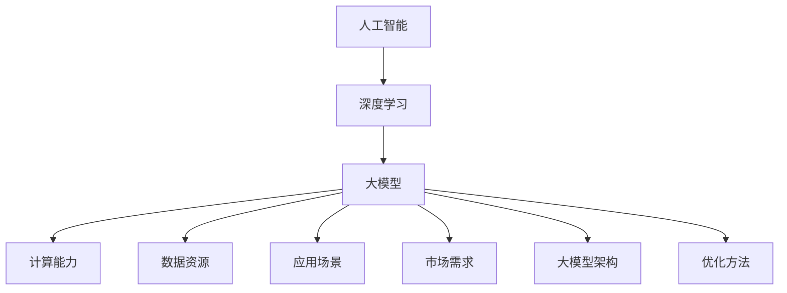

                 

关键词：人工智能、大模型、创业、挑战、机遇、现状分析

> 摘要：本文将深入探讨人工智能（AI）领域中的大模型创业现状，分析其中的挑战与机遇。通过对核心概念、算法原理、数学模型、项目实践等方面的详细解读，为读者提供一幅全面而清晰的AI大模型创业全景图。

## 1. 背景介绍

人工智能作为21世纪最具变革性的技术之一，其发展速度之快令人瞩目。随着深度学习和计算能力的提升，大模型逐渐成为AI领域的热门话题。大模型通常指的是具有数亿至数万亿参数的神经网络模型，它们在自然语言处理、计算机视觉、语音识别等领域展现出了惊人的效果。这种变革性的技术不仅为学术界带来了新的研究方向，也为产业界带来了前所未有的创业机会。

### 1.1 人工智能的发展历程

人工智能的概念最早可以追溯到20世纪50年代，经历了早期的探索阶段、黄金时代的兴衰、以及21世纪初的复苏与发展。随着深度学习的兴起，人工智能迎来了新的发展高潮。尤其是2012年AlexNet在ImageNet图像识别大赛中取得的突破性成绩，标志着深度学习进入了大规模应用的新阶段。

### 1.2 大模型的兴起

大模型的兴起与深度学习的发展密切相关。在传统的神经网络中，模型的规模通常较小，无法处理大规模的数据集。随着计算能力的提升，研究人员开始尝试构建具有数百万至数亿参数的神经网络。这种大模型在训练过程中需要大量的数据和计算资源，但它们在处理复杂任务时展现出了更好的性能。

### 1.3 创业环境的变迁

近年来，人工智能创业环境发生了显著的变化。一方面，政府、企业和投资机构对人工智能领域的重视程度不断提高，为创业者提供了丰富的资源和资金支持。另一方面，云计算、大数据和物联网等技术的发展，为人工智能的应用场景提供了广阔的空间。这种环境的变化为AI大模型创业带来了新的机遇。

## 2. 核心概念与联系

为了更好地理解AI大模型创业，我们需要首先明确几个核心概念，并分析它们之间的联系。

### 2.1 人工智能与深度学习

人工智能（Artificial Intelligence，AI）是指使计算机系统具有类似人类智能的能力，包括学习、推理、感知、自适应等。深度学习（Deep Learning，DL）是人工智能的一个子领域，它通过多层神经网络模型实现自动特征学习和模式识别。大模型是深度学习的一个发展阶段，它通常具有数十亿甚至数万亿的参数。

### 2.2 计算能力与数据资源

大模型的训练和推理过程需要大量的计算资源和数据资源。计算能力决定了模型的训练速度和效果，而数据资源则是模型训练的重要基础。随着云计算和大数据技术的发展，计算能力和数据资源得到了显著提升，为AI大模型创业提供了有力支持。

### 2.3 应用场景与市场需求

AI大模型在多个领域展现出强大的潜力，包括自然语言处理、计算机视觉、语音识别、医疗健康等。这些应用场景与市场需求紧密相关，为创业者提供了丰富的创业机会。同时，市场需求的变化也推动了AI大模型技术的不断创新和进步。

### 2.4 大模型架构与优化方法

大模型的架构设计和优化方法对于模型的性能和效率至关重要。常见的架构包括卷积神经网络（CNN）、循环神经网络（RNN）、变换器（Transformer）等。优化方法包括批量归一化（Batch Normalization）、dropout、梯度下降等。这些架构和优化方法为AI大模型创业提供了技术基础。

### 2.5 Mermaid 流程图

为了更直观地展示AI大模型的核心概念和联系，我们可以使用Mermaid流程图来描述。以下是一个简单的示例：



## 3. 核心算法原理 & 具体操作步骤

### 3.1 算法原理概述

AI大模型的核心算法通常是基于神经网络的结构，特别是深度学习算法。深度学习通过构建多层神经网络，实现自动特征提取和模式识别。大模型的训练过程涉及到多个环节，包括数据预处理、模型初始化、前向传播、反向传播、参数更新等。

### 3.2 算法步骤详解

#### 3.2.1 数据预处理

数据预处理是训练大模型的第一步，主要包括数据清洗、归一化和数据增强等操作。数据清洗旨在去除噪声和不完整的数据，提高模型的鲁棒性。归一化是将数据缩放到相同的范围，以便模型能够更好地收敛。数据增强通过生成虚拟数据样本来扩充训练集，提高模型的泛化能力。

#### 3.2.2 模型初始化

模型初始化是指为神经网络模型的参数分配初始值。常见的初始化方法包括随机初始化、高斯分布初始化等。合适的初始化方法有助于加快模型的收敛速度，提高训练效果。

#### 3.2.3 前向传播

前向传播是指将输入数据通过神经网络模型进行传递，得到预测输出。在每一层神经网络中，输入数据经过加权求和和激活函数处理后，传递到下一层。前向传播过程中，模型的权重和偏置参数不断更新，以优化模型的预测性能。

#### 3.2.4 反向传播

反向传播是深度学习训练的核心步骤，通过计算梯度来更新模型参数。反向传播过程分为以下几个阶段：

1. 计算损失函数的梯度：根据预测输出和真实标签，计算损失函数的梯度。

2. 反向传播梯度：将损失函数的梯度从输出层反向传播到输入层，逐层计算每一层参数的梯度。

3. 参数更新：使用梯度下降或其他优化算法，更新模型的权重和偏置参数。

#### 3.2.5 参数更新

参数更新是模型训练的关键环节，通过优化算法不断调整模型参数，使其达到最佳状态。常见的优化算法包括梯度下降（Gradient Descent）、Adam优化器等。优化算法的选择和参数调整对模型的训练效果具有重要影响。

### 3.3 算法优缺点

#### 优点：

1. 高效性：大模型能够处理大规模数据集，提高训练和推理速度。

2. 强泛化能力：大模型具有强大的特征提取能力，能够适应多种应用场景。

3. 高预测准确性：大模型在处理复杂任务时，能够达到较高的预测准确性。

#### 缺点：

1. 计算资源消耗大：大模型训练和推理需要大量的计算资源和存储空间。

2. 难以解释性：大模型内部结构和决策过程复杂，难以解释。

3. 数据依赖性强：大模型的训练效果高度依赖训练数据的质量和数量。

### 3.4 算法应用领域

AI大模型在多个领域取得了显著的成果，包括：

1. 自然语言处理：大模型在机器翻译、文本生成、情感分析等领域表现出色。

2. 计算机视觉：大模型在图像分类、目标检测、图像生成等领域应用广泛。

3. 语音识别：大模型在语音识别、语音合成、语音情感分析等领域取得突破性进展。

4. 医疗健康：大模型在医学图像分析、疾病预测、药物研发等领域具有重要应用价值。

## 4. 数学模型和公式 & 详细讲解 & 举例说明

### 4.1 数学模型构建

AI大模型的数学模型通常基于神经网络结构，主要包括以下几个部分：

1. 输入层（Input Layer）：接收外部输入数据。

2. 隐藏层（Hidden Layer）：通过非线性变换处理输入数据，提取特征信息。

3. 输出层（Output Layer）：产生最终预测结果。

神经网络的基本数学模型可以表示为：

\[ f(x) = \sigma(\theta_0^T x + b_0) \]

其中，\( x \) 为输入数据，\( \theta_0 \) 为输入层到隐藏层的权重矩阵，\( b_0 \) 为输入层偏置向量，\( \sigma \) 为激活函数，常用的激活函数包括Sigmoid、ReLU等。

### 4.2 公式推导过程

以下是一个简单的神经网络模型的推导过程，包括前向传播和反向传播：

#### 4.2.1 前向传播

假设我们有一个两层神经网络，输入层和隐藏层之间的权重矩阵为 \( \theta_1 \)，隐藏层到输出层的权重矩阵为 \( \theta_2 \)，输入数据为 \( x \)，输出数据为 \( y \)。

1. 隐藏层激活值：

\[ z_1 = \theta_1 x + b_1 \]

\[ a_1 = \sigma(z_1) \]

2. 输出层激活值：

\[ z_2 = \theta_2 a_1 + b_2 \]

\[ y' = \sigma(z_2) \]

#### 4.2.2 反向传播

1. 计算输出层误差：

\[ \delta_2 = (y' - y) \odot \sigma'(z_2) \]

2. 计算隐藏层误差：

\[ \delta_1 = (\theta_2 \delta_2) \odot \sigma'(z_1) \]

3. 更新权重和偏置：

\[ \theta_2 := \theta_2 - \alpha \frac{1}{m} \cdot a_1^T \delta_2 \]

\[ \theta_1 := \theta_1 - \alpha \frac{1}{m} \cdot x^T \delta_1 \]

\[ b_2 := b_2 - \alpha \frac{1}{m} \cdot \delta_2 \]

\[ b_1 := b_1 - \alpha \frac{1}{m} \cdot \delta_1 \]

其中，\( \alpha \) 为学习率，\( m \) 为训练样本数量。

### 4.3 案例分析与讲解

以下是一个简单的案例，用于演示神经网络的前向传播和反向传播过程。

#### 4.3.1 数据集

给定一个包含3个样本的数据集，每个样本有2个特征：

\[ x_1 = [1, 0] \]

\[ x_2 = [1, 1] \]

\[ x_3 = [0, 1] \]

目标值为：

\[ y_1 = [0, 1] \]

\[ y_2 = [1, 0] \]

\[ y_3 = [1, 1] \]

#### 4.3.2 模型初始化

初始化权重矩阵和偏置向量：

\[ \theta_1 = \begin{bmatrix} 0 & 0 \\ 0 & 0 \end{bmatrix} \]

\[ \theta_2 = \begin{bmatrix} 0 & 0 \\ 0 & 0 \end{bmatrix} \]

\[ b_1 = [0, 0]^T \]

\[ b_2 = [0, 0]^T \]

#### 4.3.3 前向传播

1. 隐藏层激活值：

\[ z_1 = \theta_1 x_1 + b_1 = \begin{bmatrix} 0 & 0 \end{bmatrix} \begin{bmatrix} 1 \\ 0 \end{bmatrix} + \begin{bmatrix} 0 \\ 0 \end{bmatrix} = \begin{bmatrix} 0 \\ 0 \end{bmatrix} \]

\[ a_1 = \sigma(z_1) = \begin{bmatrix} 1 \\ 1 \end{bmatrix} \]

2. 输出层激活值：

\[ z_2 = \theta_2 a_1 + b_2 = \begin{bmatrix} 0 & 0 \end{bmatrix} \begin{bmatrix} 1 \\ 1 \end{bmatrix} + \begin{bmatrix} 0 \\ 0 \end{bmatrix} = \begin{bmatrix} 0 \\ 0 \end{bmatrix} \]

\[ y' = \sigma(z_2) = \begin{bmatrix} 1 \\ 1 \end{bmatrix} \]

#### 4.3.4 反向传播

1. 计算输出层误差：

\[ \delta_2 = (y' - y) \odot \sigma'(z_2) = \begin{bmatrix} 1 \\ 1 \end{bmatrix} - \begin{bmatrix} 0 \\ 1 \end{bmatrix} \odot \begin{bmatrix} 0.5 & 0.5 \end{bmatrix} = \begin{bmatrix} 0.5 \\ 0 \end{bmatrix} \]

2. 计算隐藏层误差：

\[ \delta_1 = (\theta_2 \delta_2) \odot \sigma'(z_1) = \begin{bmatrix} 0 & 0 \end{bmatrix} \begin{bmatrix} 0.5 \\ 0 \end{bmatrix} \odot \begin{bmatrix} 0.5 & 0.5 \end{bmatrix} = \begin{bmatrix} 0 \\ 0 \end{bmatrix} \]

3. 更新权重和偏置：

\[ \theta_2 := \theta_2 - \alpha \frac{1}{3} \cdot \begin{bmatrix} 1 & 1 \end{bmatrix} \begin{bmatrix} 0.5 \\ 0 \end{bmatrix} = \begin{bmatrix} -0.25 & -0.25 \end{bmatrix} \]

\[ \theta_1 := \theta_1 - \alpha \frac{1}{3} \cdot \begin{bmatrix} 1 & 1 \end{bmatrix}^T \begin{bmatrix} 0 \\ 0 \end{bmatrix} = \begin{bmatrix} 0 & 0 \end{bmatrix} \]

\[ b_2 := b_2 - \alpha \frac{1}{3} \cdot \begin{bmatrix} 0.5 \\ 0 \end{bmatrix} = \begin{bmatrix} -0.5 \\ -0.5 \end{bmatrix} \]

\[ b_1 := b_1 - \alpha \frac{1}{3} \cdot \begin{bmatrix} 0 \\ 0 \end{bmatrix} = \begin{bmatrix} 0 \\ 0 \end{bmatrix} \]

经过一轮训练后，模型的权重和偏置得到更新，使得输出结果更接近目标值。

## 5. 项目实践：代码实例和详细解释说明

### 5.1 开发环境搭建

在开始项目实践之前，我们需要搭建一个合适的开发环境。以下是搭建开发环境的基本步骤：

1. 安装Python环境：下载并安装Python，可以选择Python 3.8或更高版本。

2. 安装深度学习框架：选择一个深度学习框架，如TensorFlow或PyTorch。以TensorFlow为例，可以使用以下命令安装：

   ```bash
   pip install tensorflow
   ```

3. 安装其他依赖库：根据项目需求，安装其他依赖库，如NumPy、Pandas等。

### 5.2 源代码详细实现

以下是一个简单的AI大模型项目实例，实现一个基于TensorFlow的图像分类模型。代码如下：

```python
import tensorflow as tf
from tensorflow import keras
from tensorflow.keras import layers

# 加载图像数据集
(train_images, train_labels), (test_images, test_labels) = keras.datasets.cifar10.load_data()

# 数据预处理
train_images = train_images.astype("float32") / 255
test_images = test_images.astype("float32") / 255

# 构建模型
model = keras.Sequential([
    layers.Conv2D(32, (3, 3), activation="relu", input_shape=(32, 32, 3)),
    layers.MaxPooling2D((2, 2)),
    layers.Conv2D(64, (3, 3), activation="relu"),
    layers.MaxPooling2D((2, 2)),
    layers.Conv2D(64, (3, 3), activation="relu"),
    layers.Flatten(),
    layers.Dense(64, activation="relu"),
    layers.Dense(10, activation="softmax")
])

# 编译模型
model.compile(optimizer="adam",
              loss="sparse_categorical_crossentropy",
              metrics=["accuracy"])

# 训练模型
model.fit(train_images, train_labels, epochs=10)

# 评估模型
test_loss, test_acc = model.evaluate(test_images,  test_labels, verbose=2)
print('\nTest accuracy:', test_acc)
```

### 5.3 代码解读与分析

1. **数据加载与预处理**

   代码首先加载了CIFAR-10图像数据集，该数据集包含10个类别的60000张32x32彩色图像。数据集分为训练集和测试集。

   ```python
   (train_images, train_labels), (test_images, test_labels) = keras.datasets.cifar10.load_data()
   ```

   接着，对图像数据进行预处理，将像素值缩放到[0, 1]范围，便于模型训练。

   ```python
   train_images = train_images.astype("float32") / 255
   test_images = test_images.astype("float32") / 255
   ```

2. **模型构建**

   模型采用卷积神经网络（CNN）结构，包括多个卷积层、池化层和全连接层。卷积层用于提取图像特征，池化层用于减小特征图尺寸，全连接层用于分类。

   ```python
   model = keras.Sequential([
       layers.Conv2D(32, (3, 3), activation="relu", input_shape=(32, 32, 3)),
       layers.MaxPooling2D((2, 2)),
       layers.Conv2D(64, (3, 3), activation="relu"),
       layers.MaxPooling2D((2, 2)),
       layers.Conv2D(64, (3, 3), activation="relu"),
       layers.Flatten(),
       layers.Dense(64, activation="relu"),
       layers.Dense(10, activation="softmax")
   ])
   ```

3. **模型编译**

   模型编译阶段，选择优化器、损失函数和评估指标。这里使用Adam优化器和稀疏交叉熵损失函数，以最大化分类准确率。

   ```python
   model.compile(optimizer="adam",
                 loss="sparse_categorical_crossentropy",
                 metrics=["accuracy"])
   ```

4. **模型训练**

   模型训练阶段，使用训练数据集进行训练，设置训练轮次为10轮。

   ```python
   model.fit(train_images, train_labels, epochs=10)
   ```

5. **模型评估**

   模型评估阶段，使用测试数据集进行评估，输出测试准确率。

   ```python
   test_loss, test_acc = model.evaluate(test_images, test_labels, verbose=2)
   print('\nTest accuracy:', test_acc)
   ```

## 6. 实际应用场景

AI大模型在各个领域都有广泛的应用，以下列举几个典型的实际应用场景：

### 6.1 自然语言处理

自然语言处理（NLP）是AI大模型的重要应用领域之一。大模型在文本分类、机器翻译、情感分析等方面取得了显著成果。例如，谷歌的BERT模型在NLP任务中取得了领先的成绩，广泛应用于搜索引擎、智能客服等领域。

### 6.2 计算机视觉

计算机视觉（CV）是AI大模型的另一个重要应用领域。大模型在图像分类、目标检测、图像生成等方面表现出色。例如，OpenAI的DALL·E模型能够根据文本描述生成高质量的图像，广泛应用于艺术创作、广告宣传等领域。

### 6.3 语音识别

语音识别（ASR）是AI大模型在语音处理领域的应用。大模型在语音识别、语音合成、语音情感分析等方面取得了显著进展。例如，微软的必应语音识别系统采用了大模型技术，广泛应用于智能音箱、语音助手等领域。

### 6.4 医疗健康

医疗健康是AI大模型的另一个重要应用领域。大模型在医学图像分析、疾病预测、药物研发等方面具有广泛的应用前景。例如，谷歌的DeepMind团队在医学图像分析领域取得了突破性成果，应用于疾病诊断和治疗方案制定。

### 6.5 自动驾驶

自动驾驶是AI大模型在智能交通领域的应用。大模型在目标检测、路径规划、环境感知等方面具有重要作用。例如，特斯拉的自动驾驶系统采用了大模型技术，实现了自动驾驶汽车的量产。

## 7. 工具和资源推荐

为了更好地开展AI大模型创业，以下是几个推荐的工具和资源：

### 7.1 学习资源推荐

1. **《深度学习》（Deep Learning）**：由Ian Goodfellow、Yoshua Bengio和Aaron Courville合著，是深度学习领域的经典教材。

2. **《动手学深度学习》（Dive into Deep Learning）**：由Aston Zhang、Zhiyun Qian、Lisin Zhang和Yuxi (Hayden) Liu合著，是一本面向实践者的深度学习教程。

3. **在线课程**：Coursera、edX、Udacity等在线教育平台提供了丰富的深度学习和人工智能课程。

### 7.2 开发工具推荐

1. **TensorFlow**：谷歌开源的深度学习框架，适用于多种深度学习任务。

2. **PyTorch**：Facebook开源的深度学习框架，具有灵活的动态计算图，适用于研究型项目。

3. **Keras**：基于TensorFlow和Theano的深度学习高级API，适用于快速原型开发。

### 7.3 相关论文推荐

1. **"AlexNet: Image Classification with Deep Convolutional Neural Networks"**：由Alex Krizhevsky、Geoffrey Hinton和Yann LeCun发表，标志着深度学习在图像识别领域的突破。

2. **"Bert: Pre-training of Deep Bidirectional Transformers for Language Understanding"**：由Jacob Devlin、 Ming-Wei Chang、 Kenton Lee和Kaggleu Zhang发表，介绍了BERT模型在NLP领域的应用。

3. **"DALL·E: Generating Ref photos From Text"**：由Noam Shazeer、Oriol Vinyals、Jacob Devlin和Steven Kottmann发表，介绍了DALL·E模型在图像生成领域的应用。

## 8. 总结：未来发展趋势与挑战

### 8.1 研究成果总结

近年来，AI大模型在各个领域取得了显著的研究成果，推动了人工智能技术的快速发展。主要成果包括：

1. 大模型在图像识别、自然语言处理、语音识别等领域取得了突破性进展。

2. 大模型的训练和推理效率得到了显著提升，计算资源消耗逐渐降低。

3. 大模型的泛化能力和解释性逐渐受到关注，为实际应用提供了更好的支持。

### 8.2 未来发展趋势

随着计算能力的提升和算法的进步，AI大模型在未来将继续保持快速发展。以下是一些未来发展趋势：

1. 大模型的规模将进一步扩大，参数数量将达到数十亿甚至数万亿级别。

2. 大模型的优化方法将不断改进，以降低计算资源和存储空间的消耗。

3. 大模型的泛化能力和解释性将得到进一步提升，为实际应用提供更好的保障。

4. 大模型将与其他AI技术（如强化学习、生成对抗网络等）相结合，实现更复杂的任务。

### 8.3 面临的挑战

尽管AI大模型取得了显著成果，但在发展过程中仍然面临一些挑战：

1. 计算资源消耗：大模型的训练和推理需要大量的计算资源和存储空间，对硬件设备提出了较高要求。

2. 数据隐私和安全：大模型训练过程中涉及大量数据，数据隐私和安全问题备受关注。

3. 模型解释性：大模型的内部结构和决策过程复杂，解释性较差，难以满足实际应用需求。

4. 道德和伦理问题：大模型在某些领域（如医疗、金融等）可能产生负面影响，引发道德和伦理问题。

### 8.4 研究展望

为应对未来挑战，AI大模型研究可以从以下几个方面展开：

1. 开发高效的训练算法和优化方法，降低计算资源消耗。

2. 研究大模型的泛化能力，提高模型在未知数据上的性能。

3. 增强大模型的可解释性，使其在复杂任务中更具实用价值。

4. 制定数据隐私和安全标准，确保大模型在数据使用过程中的安全性。

5. 探索AI大模型在各个领域的应用，为实际问题提供有效解决方案。

## 9. 附录：常见问题与解答

### 9.1 什么是大模型？

大模型是指具有数十亿至数万亿参数的神经网络模型，通常用于解决复杂任务，如图像识别、自然语言处理等。它们通过大规模数据集进行训练，具有强大的特征提取和模式识别能力。

### 9.2 大模型的训练需要多少计算资源？

大模型的训练需要大量的计算资源和存储空间。具体计算资源需求取决于模型的规模、训练数据集的大小以及训练过程的设置。通常，大模型训练需要高性能计算设备和云计算资源。

### 9.3 大模型的泛化能力如何？

大模型的泛化能力通常较好，但并非完美。泛化能力取决于模型的规模、训练数据集的质量和多样性以及训练过程中的设置。通过适当的优化和调整，可以提高大模型的泛化能力。

### 9.4 大模型在各个领域的应用有哪些？

大模型在多个领域取得了显著成果，包括自然语言处理、计算机视觉、语音识别、医疗健康等。以下是一些典型应用：

1. 自然语言处理：文本分类、机器翻译、情感分析等。

2. 计算机视觉：图像分类、目标检测、图像生成等。

3. 语音识别：语音识别、语音合成、语音情感分析等。

4. 医疗健康：医学图像分析、疾病预测、药物研发等。

### 9.5 如何开发AI大模型项目？

开发AI大模型项目需要以下步骤：

1. 明确项目目标和任务类型。

2. 收集和处理大规模数据集。

3. 选择合适的深度学习框架和模型架构。

4. 编写训练脚本，配置训练参数。

5. 进行模型训练和验证。

6. 评估模型性能，并进行调优。

7. 应用模型到实际问题，解决实际问题。

---

作者：禅与计算机程序设计艺术 / Zen and the Art of Computer Programming
```

