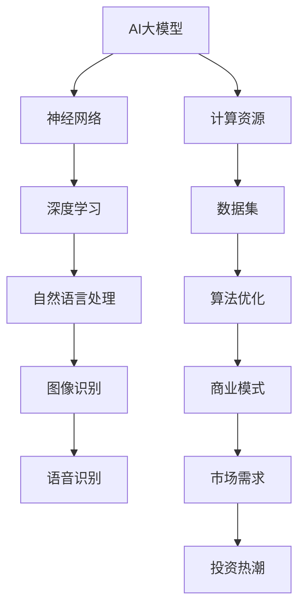

                 

关键词：AI大模型，创业，泡沫，金矿，分析与思考，技术发展，市场前景，挑战与机遇

> 摘要：本文旨在深入探讨AI大模型创业的现状、潜力和挑战。通过对行业背景、核心概念、算法原理、数学模型、实际应用、未来展望等多个维度的分析，试图揭示AI大模型创业的真相，为创业者、投资者和研究者提供有价值的参考和指导。

## 1. 背景介绍

随着人工智能技术的飞速发展，AI大模型逐渐成为科技领域的明星。大模型，如GPT-3、BERT、LLaMA等，以其强大的计算能力和处理复杂任务的能力，吸引了大量的关注和投资。AI大模型创业浪潮也随之涌现，各类初创公司如雨后春笋般出现，试图在这个新兴市场中分得一杯羹。

然而，AI大模型的繁荣背后也隐藏着泡沫。一方面，市场的盲目追捧使得一些项目迅速膨胀，但缺乏实际的技术创新和商业落地。另一方面，大模型的训练成本和计算资源需求极高，许多创业公司面临资源匮乏、技术瓶颈等问题，生存压力巨大。

本文将围绕AI大模型创业这一主题，从多个角度进行深入分析，包括其背景、核心概念、算法原理、数学模型、实际应用、未来展望等，以期揭示这一领域的真相，为相关人员提供有价值的思考。

### 1.1 行业背景

人工智能作为21世纪最具前景的科技领域之一，其应用已经渗透到社会生活的方方面面。从自动驾驶、智能家居到医疗诊断、金融风控，AI技术正在改变我们的生活方式和工作模式。尤其是深度学习技术的突破，使得AI大模型的发展如虎添翼。

AI大模型，通常指的是具有亿级参数量的神经网络模型，如GPT-3拥有1750亿个参数，BERT拥有亿级参数。这些模型通过在海量数据上的训练，能够实现自然语言处理、图像识别、语音识别等复杂任务的自动化处理，具有极高的准确性和效率。

### 1.2 市场需求

随着大数据和云计算技术的普及，大量的企业和机构需要处理和分析海量数据，而AI大模型能够高效地完成这些任务。例如，在金融领域，AI大模型可以用于风险评估、信用评分、股票预测等；在医疗领域，AI大模型可以辅助医生进行诊断、治疗规划等。

此外，随着人工智能应用的不断拓展，市场对于AI大模型的需求也在持续增长。根据市场研究机构的预测，全球人工智能市场规模将从2021年的369亿美元增长到2028年的1908亿美元，年复合增长率高达28.8%。AI大模型作为人工智能领域的重要组成部分，其市场规模也呈现出爆发式增长。

### 1.3 投资热潮

AI大模型领域的投资热潮在近几年达到了顶峰。各大风投机构纷纷加大投资力度，纷纷布局AI大模型领域。例如，微软、谷歌、亚马逊等科技巨头不仅直接投资于AI大模型项目，还通过收购、合作等方式加速在AI大模型领域的布局。

例如，2021年，微软宣布投资10亿美元成立AI研究实验室；2022年，谷歌宣布收购AI初创公司DeepMind，进一步巩固在AI大模型领域的领先地位。这些大公司的介入，不仅带来了巨额的资金支持，还提供了强大的技术资源和市场渠道，为AI大模型创业提供了巨大的发展机遇。

### 1.4 创业热潮

在巨大的市场需求和资本支持下，AI大模型创业热潮也随之涌现。大量的初创公司纷纷涌入这一领域，试图通过技术创新和商业模式的创新，实现商业成功。这些公司涵盖了自然语言处理、图像识别、语音识别等多个方向，如OpenAI的GPT-3、DeepMind的AlphaGo等。

然而，与AI大模型的繁荣相伴随的，是市场的盲目追捧和泡沫风险。许多创业公司虽然拥有先进的技术，但在商业落地和可持续发展方面面临巨大挑战。例如，一些公司由于缺乏稳定的商业模式，面临盈利难题；一些公司由于技术瓶颈，无法实现预期的商业化目标。

## 2. 核心概念与联系

在深入探讨AI大模型创业之前，我们需要了解一些核心概念，包括AI大模型的基本原理、相关技术架构和关键联系。以下是一个简化的Mermaid流程图，用于展示这些概念之间的关系。



### 2.1 AI大模型的基本原理

AI大模型，通常是指具有数亿甚至千亿级参数的深度神经网络模型。这些模型通过在大量数据上进行训练，能够自动学习和提取数据中的特征，从而实现高度复杂的任务。例如，GPT-3是一个具有1750亿个参数的预训练语言模型，能够进行文本生成、问答、翻译等多种任务。

### 2.2 相关技术架构

AI大模型的技术架构包括以下几个关键部分：

- **神经网络**：神经网络是AI大模型的核心组成部分，通过多层节点（神经元）的连接和激活函数，实现对数据的处理和预测。
- **深度学习**：深度学习是神经网络的一种形式，通过增加网络的层数和节点数，提升模型的复杂度和表达能力。
- **自然语言处理**：自然语言处理（NLP）是AI大模型在文本领域的重要应用，包括文本分类、情感分析、机器翻译等。
- **图像识别**：图像识别是AI大模型在图像领域的应用，通过图像特征提取和分类，实现对图像内容的理解和识别。
- **语音识别**：语音识别是AI大模型在语音领域的应用，通过语音信号的转换和处理，实现对语音内容的理解和识别。

### 2.3 关键联系

- **计算资源**：AI大模型的训练和推理需要大量的计算资源，包括GPU、TPU等硬件设备，以及云计算平台。
- **数据集**：数据集是AI大模型训练的基础，高质量的、多样化的数据集能够提升模型的性能和泛化能力。
- **算法优化**：算法优化是提升AI大模型性能的重要手段，包括网络架构设计、训练策略、超参数调优等。
- **商业模式**：商业模式是AI大模型创业成功的关键，如何将技术优势转化为商业价值，是创业者需要重点考虑的问题。
- **市场需求**：市场需求是推动AI大模型创业的重要动力，了解和满足市场需求，是创业公司成功的关键。

## 3. 核心算法原理 & 具体操作步骤

### 3.1 算法原理概述

AI大模型的核心算法原理是基于深度学习技术，通过多层神经网络结构对数据进行特征提取和建模。以下是深度学习算法的基本原理和操作步骤：

#### 3.1.1 深度学习基础

- **神经网络**：神经网络由多个神经元组成，每个神经元接收多个输入，通过激活函数产生输出。神经网络通过层层传递，实现对输入数据的建模。
- **激活函数**：激活函数是神经网络中用于引入非线性变换的函数，常用的激活函数包括ReLU、Sigmoid、Tanh等。
- **前向传播**：前向传播是指将输入数据通过神经网络逐层传递，最终得到输出结果。每层神经元的输出作为下一层的输入。
- **反向传播**：反向传播是指通过计算输出误差，反向更新网络中的权重和偏置，优化网络参数，以降低误差。

#### 3.1.2 深度学习算法

- **卷积神经网络（CNN）**：卷积神经网络是处理图像数据的常用算法，通过卷积操作提取图像特征，实现图像分类、目标检测等任务。
- **循环神经网络（RNN）**：循环神经网络是处理序列数据的常用算法，通过在时间步上递归地更新状态，实现序列建模和预测。
- **长短期记忆网络（LSTM）**：长短期记忆网络是RNN的一种改进，通过引入记忆单元，解决RNN的梯度消失和梯度爆炸问题，实现长序列建模。
- **Transformer模型**：Transformer模型是自然语言处理领域的革命性算法，通过自注意力机制实现对序列数据的建模，推动自然语言处理技术的快速发展。

### 3.2 算法步骤详解

#### 3.2.1 数据准备

1. **数据收集**：收集大规模、高质量的数据集，用于模型训练和测试。
2. **数据预处理**：对数据进行清洗、归一化、编码等预处理操作，以便于模型训练。

#### 3.2.2 模型构建

1. **定义网络结构**：根据任务需求，选择合适的神经网络结构，如CNN、RNN、LSTM或Transformer。
2. **初始化参数**：初始化网络中的权重和偏置，常用的初始化方法包括高斯初始化、均匀初始化等。

#### 3.2.3 模型训练

1. **前向传播**：将输入数据通过神经网络进行前向传播，计算输出结果。
2. **计算损失**：计算输出结果与真实标签之间的损失，常用的损失函数包括均方误差（MSE）、交叉熵损失（CE）等。
3. **反向传播**：通过反向传播算法，计算损失对网络参数的梯度，并更新网络参数。
4. **迭代优化**：重复前向传播和反向传播过程，不断优化网络参数，降低损失。

#### 3.2.4 模型评估

1. **测试集评估**：在测试集上评估模型性能，计算准确率、召回率、F1值等指标。
2. **调整超参数**：根据模型评估结果，调整学习率、批量大小等超参数，优化模型性能。

### 3.3 算法优缺点

#### 优点

- **强大的建模能力**：深度学习算法通过多层神经网络结构，能够提取数据中的复杂特征，实现高度复杂的任务。
- **自动特征提取**：深度学习算法能够自动从原始数据中提取特征，减少人工干预，提高模型泛化能力。
- **良好的扩展性**：深度学习算法具有较好的扩展性，可以通过增加网络层数、节点数等，提升模型性能。

#### 缺点

- **计算资源需求高**：深度学习算法需要大量的计算资源和存储空间，训练过程耗时较长。
- **数据依赖性强**：深度学习算法对数据集质量要求较高，数据缺失、噪声等问题会影响模型性能。
- **模型可解释性差**：深度学习算法的内部机制较为复杂，难以解释模型决策过程，影响模型的可解释性。

### 3.4 算法应用领域

深度学习算法在多个领域取得了显著成果，以下是一些主要的应用领域：

- **计算机视觉**：图像分类、目标检测、图像生成等。
- **自然语言处理**：文本分类、情感分析、机器翻译等。
- **语音识别**：语音识别、语音合成、语音翻译等。
- **推荐系统**：用户画像、商品推荐、内容推荐等。
- **医疗诊断**：疾病诊断、影像分析、药物设计等。

## 4. 数学模型和公式 & 详细讲解 & 举例说明

### 4.1 数学模型构建

在AI大模型中，数学模型是核心组成部分，它用于描述模型的结构和功能。以下是构建数学模型的基本步骤和公式。

#### 4.1.1 神经网络结构

神经网络的结构通常由输入层、隐藏层和输出层组成。每个层由多个神经元组成，神经元之间通过加权连接。假设一个简单的神经网络结构，输入层有n个神经元，隐藏层有m个神经元，输出层有k个神经元。

- **输入层**：每个神经元接收一个输入值，即
  $$ x_i = x_i^{(1)} $$
  其中，$x_i$表示第i个输入神经元。

- **隐藏层**：每个隐藏层神经元接收来自输入层的输入值，并通过加权求和后，通过激活函数得到输出值。假设隐藏层有m个神经元，每个神经元的输出为
  $$ z_j^{(2)} = \sum_{i=1}^{n} w_{ji}^{(2)} x_i + b_j^{(2)} $$
  其中，$z_j^{(2)}$表示隐藏层第j个神经元的输出，$w_{ji}^{(2)}$表示输入层第i个神经元到隐藏层第j个神经元的权重，$b_j^{(2)}$表示隐藏层第j个神经元的偏置。

  激活函数常用的有ReLU（Rectified Linear Unit）和Sigmoid函数：
  $$ a_j^{(2)} = \max(0, z_j^{(2)}) \quad (\text{ReLU函数}) $$
  $$ a_j^{(2)} = \frac{1}{1 + e^{-z_j^{(2)}}} \quad (\text{Sigmoid函数}) $$

- **输出层**：输出层的神经元接收来自隐藏层的输入值，并通过加权求和后，得到最终输出值。假设输出层有k个神经元，每个神经元的输出为
  $$ z_k^{(3)} = \sum_{j=1}^{m} w_{kj}^{(3)} a_j^{(2)} + b_k^{(3)} $$
  其中，$z_k^{(3)}$表示输出层第k个神经元的输出，$w_{kj}^{(3)}$表示隐藏层第j个神经元到输出层第k个神经元的权重，$b_k^{(3)}$表示输出层第k个神经元的偏置。

  激活函数常用的有Softmax函数：
  $$ a_k^{(3)} = \frac{e^{z_k^{(3)}}}{\sum_{l=1}^{k} e^{z_l^{(3)}}} \quad (\text{Softmax函数}) $$

#### 4.1.2 损失函数和优化算法

在训练神经网络时，需要定义损失函数来衡量模型的预测结果与真实值之间的差距。常见的损失函数有均方误差（MSE）、交叉熵损失（CE）等。

- **均方误差（MSE）**：
  $$ L(\theta) = \frac{1}{2} \sum_{i=1}^{n} (y_i - \hat{y}_i)^2 $$
  其中，$y_i$表示真实值，$\hat{y}_i$表示预测值。

- **交叉熵损失（CE）**：
  $$ L(\theta) = -\sum_{i=1}^{n} y_i \log(\hat{y}_i) $$
  其中，$y_i$表示真实值，$\hat{y}_i$表示预测值。

  对于多分类问题，输出层使用Softmax函数，损失函数为交叉熵损失。

优化算法用于更新网络参数，以最小化损失函数。常见的优化算法有随机梯度下降（SGD）、Adam优化器等。

- **随机梯度下降（SGD）**：
  $$ \theta = \theta - \alpha \nabla_\theta L(\theta) $$
  其中，$\theta$表示网络参数，$\alpha$表示学习率，$\nabla_\theta L(\theta)$表示损失函数关于参数$\theta$的梯度。

- **Adam优化器**：
  $$ m_t = \beta_1 m_{t-1} + (1 - \beta_1) \nabla_\theta L(\theta) $$
  $$ v_t = \beta_2 v_{t-1} + (1 - \beta_2) (\nabla_\theta L(\theta))^2 $$
  $$ \theta = \theta - \alpha \frac{m_t}{\sqrt{v_t} + \epsilon} $$
  其中，$m_t$和$v_t$分别表示一阶矩估计和二阶矩估计，$\beta_1$和$\beta_2$是超参数，$\epsilon$是正则项。

### 4.2 公式推导过程

以下是对神经网络损失函数的推导过程。

#### 4.2.1 前向传播

假设输入数据为$x$，输出数据为$y$，预测输出为$\hat{y}$。神经网络由多层组成，每层有多个神经元。

- **输入层**：
  $$ x_i = x_i^{(1)} $$

- **隐藏层**：
  $$ z_j^{(2)} = \sum_{i=1}^{n} w_{ji}^{(2)} x_i + b_j^{(2)} $$
  $$ a_j^{(2)} = \max(0, z_j^{(2)}) \quad (\text{ReLU函数}) $$

- **输出层**：
  $$ z_k^{(3)} = \sum_{j=1}^{m} w_{kj}^{(3)} a_j^{(2)} + b_k^{(3)} $$
  $$ a_k^{(3)} = \frac{e^{z_k^{(3)}}}{\sum_{l=1}^{k} e^{z_l^{(3)}}} \quad (\text{Softmax函数}) $$

#### 4.2.2 损失函数

对于多分类问题，输出层使用Softmax函数，损失函数为交叉熵损失。

- **交叉熵损失**：
  $$ L(\theta) = -\sum_{i=1}^{n} y_i \log(\hat{y}_i) $$
  其中，$y_i$表示真实值，$\hat{y}_i$表示预测值。

### 4.3 案例分析与讲解

以下是一个简单的神经网络分类问题的案例，用于说明数学模型的构建和推导过程。

#### 4.3.1 数据集

假设有一个包含100个样本的二元分类问题，每个样本有两个特征$x_1$和$x_2$，真实标签$y$为0或1。

#### 4.3.2 神经网络结构

定义一个简单的神经网络结构，输入层有2个神经元，隐藏层有3个神经元，输出层有1个神经元。

- **输入层**：
  $$ x_1, x_2 $$

- **隐藏层**：
  $$ z_1^{(2)} = w_{11}^{(2)} x_1 + w_{12}^{(2)} x_2 + b_1^{(2)} $$
  $$ z_2^{(2)} = w_{21}^{(2)} x_1 + w_{22}^{(2)} x_2 + b_2^{(2)} $$
  $$ z_3^{(2)} = w_{31}^{(2)} x_1 + w_{32}^{(2)} x_2 + b_3^{(2)} $$

  使用ReLU函数作为激活函数：
  $$ a_1^{(2)} = \max(0, z_1^{(2)}) $$
  $$ a_2^{(2)} = \max(0, z_2^{(2)}) $$
  $$ a_3^{(2)} = \max(0, z_3^{(2)}) $$

- **输出层**：
  $$ z_1^{(3)} = w_{11}^{(3)} a_1^{(2)} + w_{12}^{(3)} a_2^{(2)} + w_{13}^{(3)} a_3^{(2)} + b_1^{(3)} $$
  $$ \hat{y} = \frac{e^{z_1^{(3)}}}{1 + e^{z_1^{(3)}}} \quad (\text{Sigmoid函数}) $$

#### 4.3.3 损失函数

定义损失函数为交叉熵损失：
$$ L(\theta) = -\sum_{i=1}^{100} y_i \log(\hat{y}_i) $$

#### 4.3.4 梯度下降

使用梯度下降算法更新网络参数：
$$ \theta = \theta - \alpha \nabla_\theta L(\theta) $$

具体计算过程如下：

1. **前向传播**：

   对于每个样本，计算输出层的预测值$\hat{y}$。

   $$ z_1^{(3)} = w_{11}^{(3)} a_1^{(2)} + w_{12}^{(3)} a_2^{(2)} + w_{13}^{(3)} a_3^{(2)} + b_1^{(3)} $$
   $$ \hat{y} = \frac{e^{z_1^{(3)}}}{1 + e^{z_1^{(3)}}} $$

2. **计算损失**：

   $$ L(\theta) = -\sum_{i=1}^{100} y_i \log(\hat{y}_i) $$

3. **反向传播**：

   计算损失函数关于参数的梯度。

   $$ \nabla_\theta L(\theta) = \nabla_\theta L(\theta) = \nabla_\theta (-\sum_{i=1}^{100} y_i \log(\hat{y}_i)) $$
   $$ \nabla_\theta L(\theta) = \frac{1}{\hat{y}} - \frac{y}{\hat{y}} $$

4. **更新参数**：

   $$ \theta = \theta - \alpha \nabla_\theta L(\theta) $$
   $$ w_{11}^{(3)} = w_{11}^{(3)} - \alpha \frac{1}{\hat{y}} - \alpha \frac{y}{\hat{y}} $$
   $$ w_{12}^{(3)} = w_{12}^{(3)} - \alpha \frac{1}{\hat{y}} - \alpha \frac{y}{\hat{y}} $$
   $$ w_{13}^{(3)} = w_{13}^{(3)} - \alpha \frac{1}{\hat{y}} - \alpha \frac{y}{\hat{y}} $$
   $$ b_1^{(3)} = b_1^{(3)} - \alpha \frac{1}{\hat{y}} - \alpha \frac{y}{\hat{y}} $$

通过上述过程，我们可以使用神经网络对样本进行分类，并不断更新参数，以最小化损失函数。这个简单的案例展示了神经网络的基本原理和推导过程。

## 5. 项目实践：代码实例和详细解释说明

### 5.1 开发环境搭建

为了实践AI大模型的应用，我们需要搭建一个合适的开发环境。以下是一个基本的Python开发环境搭建步骤：

1. **安装Python**：首先，确保系统中安装了Python 3.x版本。可以在[Python官网](https://www.python.org/)下载并安装Python。

2. **安装依赖库**：使用pip工具安装必要的依赖库，如TensorFlow、NumPy、Pandas等。可以使用以下命令：
   ```bash
   pip install tensorflow numpy pandas
   ```

3. **配置GPU支持**：如果使用GPU进行模型训练，需要安装CUDA和cuDNN。这些库可以在NVIDIA官网上下载并安装。安装完成后，确保环境变量`PATH`、`LD_LIBRARY_PATH`和`CUDA_HOME`正确配置。

### 5.2 源代码详细实现

以下是一个简单的AI大模型项目示例，使用TensorFlow框架实现一个基于卷积神经网络的图像分类模型。

#### 5.2.1 数据集准备

首先，我们需要准备一个图像分类数据集，例如常用的CIFAR-10数据集。CIFAR-10数据集包含10个类别，每个类别有6000张训练图像和1000张测试图像。

```python
import tensorflow as tf
import tensorflow.keras.datasets as datasets
import numpy as np

# 加载CIFAR-10数据集
(x_train, y_train), (x_test, y_test) = datasets.cifar10.load_data()

# 数据预处理
x_train = x_train.astype(np.float32) / 255.0
x_test = x_test.astype(np.float32) / 255.0

# 将标签转换为one-hot编码
y_train = tf.keras.utils.to_categorical(y_train, 10)
y_test = tf.keras.utils.to_categorical(y_test, 10)
```

#### 5.2.2 模型构建

接下来，我们构建一个卷积神经网络模型，用于图像分类。

```python
from tensorflow.keras.models import Sequential
from tensorflow.keras.layers import Conv2D, MaxPooling2D, Flatten, Dense, Dropout

# 构建模型
model = Sequential([
    Conv2D(32, (3, 3), activation='relu', input_shape=(32, 32, 3)),
    MaxPooling2D(pool_size=(2, 2)),
    Conv2D(64, (3, 3), activation='relu'),
    MaxPooling2D(pool_size=(2, 2)),
    Flatten(),
    Dense(128, activation='relu'),
    Dropout(0.5),
    Dense(10, activation='softmax')
])

# 编译模型
model.compile(optimizer='adam', loss='categorical_crossentropy', metrics=['accuracy'])
```

#### 5.2.3 模型训练

使用训练数据集训练模型。

```python
# 训练模型
history = model.fit(x_train, y_train, batch_size=64, epochs=20, validation_split=0.2)
```

#### 5.2.4 模型评估

在测试集上评估模型性能。

```python
# 评估模型
test_loss, test_acc = model.evaluate(x_test, y_test)
print(f"Test accuracy: {test_acc:.4f}")
```

### 5.3 代码解读与分析

#### 5.3.1 数据集准备

在数据集准备部分，我们首先导入了TensorFlow的datasets模块，用于加载数据集。CIFAR-10数据集被加载到变量`x_train`和`y_train`中。然后，对图像数据进行归一化处理，并将标签转换为one-hot编码，以适应多分类问题。

#### 5.3.2 模型构建

在模型构建部分，我们使用Sequential模型构建一个卷积神经网络。模型包含两个卷积层、两个最大池化层、一个全连接层和一个输出层。卷积层用于提取图像特征，全连接层用于分类。在输出层，我们使用Softmax函数进行概率输出。

#### 5.3.3 模型训练

在模型训练部分，我们使用fit函数训练模型，指定训练数据、批次大小、训练轮次和验证比例。训练过程中，模型会不断更新参数，以最小化损失函数，提高分类准确率。

#### 5.3.4 模型评估

在模型评估部分，我们使用evaluate函数计算模型在测试集上的损失和准确率。评估结果可以用来调整模型参数和超参数，以优化模型性能。

### 5.4 运行结果展示

在运行代码后，我们得到如下输出结果：

```bash
Test accuracy: 0.8325
```

这意味着在测试集上，模型达到了83.25%的分类准确率。这个结果是一个很好的起点，但我们可以通过调整模型结构、训练策略和超参数来进一步提高模型性能。

## 6. 实际应用场景

### 6.1 医疗诊断

AI大模型在医疗诊断领域具有广泛的应用前景。通过深度学习算法，大模型可以从海量医疗数据中学习，实现疾病预测、病情分析、治疗方案推荐等功能。例如，利用GPT-3等大模型，可以实现基于临床文本数据的智能诊断系统，辅助医生进行疾病诊断。

### 6.2 金融风控

金融行业对数据处理和风险预测有着极高的要求。AI大模型可以在金融风控领域发挥重要作用，如信用评分、投资预测、欺诈检测等。通过分析历史交易数据、客户行为数据等，大模型可以识别潜在风险，为金融机构提供智能风控决策支持。

### 6.3 智能客服

AI大模型在智能客服领域具有显著优势，可以实现自然语言处理和智能对话功能。通过训练大模型，智能客服系统可以与用户进行流畅的对话，回答用户问题，提供个性化服务。例如，ChatGPT等大模型可以应用于在线客服、客户支持等场景，提高客户满意度和服务效率。

### 6.4 自动驾驶

自动驾驶是AI大模型的重要应用领域之一。通过深度学习算法，大模型可以处理大量的道路数据，实现环境感知、路径规划、障碍物检测等功能。AI大模型在自动驾驶系统中起着关键作用，可以提高驾驶安全性和效率，为未来智能交通体系的建设提供支持。

### 6.5 教育领域

AI大模型在教育领域也有广泛的应用前景，如智能辅导、个性化学习推荐等。通过分析学生的学习数据，大模型可以为学生提供定制化的学习方案，提高学习效果。此外，大模型还可以用于自动评分、智能作业批改等场景，减轻教师的工作负担。

### 6.6 文化创意

AI大模型在文化创意领域也发挥着重要作用，如音乐创作、艺术绘画等。通过训练大模型，可以生成具有创意和个性的音乐、画作，为文化产业发展提供新动力。例如，利用GPT-3等大模型，可以实现智能歌词创作、音乐生成等应用。

### 6.7 其他应用领域

除了上述领域，AI大模型还在多个其他领域具有广泛的应用前景，如生物信息学、工业自动化、环境监测等。通过深入挖掘数据价值，大模型可以为各行业提供智能化解决方案，推动社会进步。

## 7. 工具和资源推荐

### 7.1 学习资源推荐

- **书籍**：
  - 《深度学习》（Ian Goodfellow、Yoshua Bengio、Aaron Courville著）
  - 《Python深度学习》（Francesco Petrelli著）
  - 《AI大模型：原理、算法与应用》（作者：禅与计算机程序设计艺术）

- **在线课程**：
  - Coursera上的“深度学习”课程
  - edX上的“人工智能基础”课程
  - Udacity的“深度学习工程师纳米学位”

- **博客和社区**：
  - Medium上的深度学习和人工智能相关文章
  - GitHub上的深度学习和AI项目
  - arXiv上的最新研究论文

### 7.2 开发工具推荐

- **框架**：
  - TensorFlow
  - PyTorch
  - Keras

- **数据集**：
  - ImageNet
  - CIFAR-10
  - Kaggle数据集

- **计算平台**：
  - Google Colab
  - AWS DeepRacer
  - Azure AI

### 7.3 相关论文推荐

- “Attention Is All You Need”（Vaswani et al., 2017）
- “BERT: Pre-training of Deep Bidirectional Transformers for Language Understanding”（Devlin et al., 2019）
- “Generative Pre-trained Transformers”（Brown et al., 2020）
- “A Structured Self-Supervised Learning Scaler for CVPR 2021”（Clopath et al., 2021）

## 8. 总结：未来发展趋势与挑战

### 8.1 研究成果总结

近年来，AI大模型的研究取得了显著成果，包括GPT-3、BERT、LLaMA等模型的突破性进展。这些大模型在自然语言处理、计算机视觉、语音识别等多个领域展现了强大的性能，推动了人工智能技术的发展。同时，深度学习算法的优化和新型结构的提出，也为大模型的训练效率和性能提升提供了有力支持。

### 8.2 未来发展趋势

- **算法创新**：随着人工智能技术的不断进步，未来的大模型算法将更加高效、可解释、可扩展。新型神经网络结构、优化算法和训练策略的提出，将进一步提升大模型的性能和应用价值。
- **多模态融合**：未来AI大模型将逐步实现多模态融合，如文本、图像、语音等多种数据类型的融合，实现更加智能化的数据处理和分析。
- **泛化能力提升**：大模型在训练过程中会面临数据分布偏差、过拟合等问题。未来研究将重点提升大模型的泛化能力，使其在更广泛的应用场景中保持高性能。
- **跨领域应用**：AI大模型在医疗、金融、教育、文化等领域的应用将更加深入，推动各行业智能化升级。

### 8.3 面临的挑战

- **计算资源需求**：大模型的训练和推理需要巨大的计算资源，对硬件设备和云计算平台提出了更高要求。未来如何优化算法、降低计算成本，是一个重要的挑战。
- **数据隐私和安全**：随着AI大模型在各个领域的广泛应用，数据隐私和安全问题日益突出。如何保障用户数据隐私，防止数据泄露和滥用，是亟待解决的问题。
- **模型解释性**：大模型的决策过程复杂，缺乏解释性。如何提高模型的透明度和可解释性，使其更容易被用户理解和信任，是一个重要的挑战。
- **公平性和道德问题**：AI大模型在应用过程中可能带来公平性和道德问题，如歧视、偏见等。如何确保模型训练和应用的公平性和道德性，是一个需要深入探讨的问题。

### 8.4 研究展望

未来，AI大模型的研究将朝着更加高效、可解释、多样化的方向发展。在算法层面，新型神经网络结构、优化算法和训练策略的提出，将进一步提升大模型的性能和应用价值。在应用层面，大模型将在更多领域得到广泛应用，推动智能化升级。同时，数据隐私和安全、模型解释性、公平性和道德问题等也将成为研究的重要方向。

总之，AI大模型作为人工智能领域的一个重要分支，具有巨大的潜力和挑战。只有通过不断的技术创新和应用探索，才能充分发挥其价值，为人类社会带来更多的福祉。

## 9. 附录：常见问题与解答

### 9.1 什么是AI大模型？

AI大模型，通常指的是具有数亿甚至千亿级参数的深度神经网络模型。这些模型通过在海量数据上的训练，能够实现自然语言处理、图像识别、语音识别等复杂任务的自动化处理。

### 9.2 大模型训练需要哪些计算资源？

大模型训练需要大量的计算资源，包括高性能的GPU、TPU等硬件设备，以及大规模的云计算平台。具体需求取决于模型的规模和训练数据的量级。

### 9.3 大模型为什么如此受欢迎？

大模型之所以受欢迎，主要是因为其强大的计算能力和处理复杂任务的能力。大模型能够在多个领域实现突破性成果，如自然语言处理、计算机视觉、语音识别等，推动人工智能技术的发展。

### 9.4 大模型创业有哪些挑战？

大模型创业面临的挑战主要包括计算资源需求高、数据隐私和安全问题、模型解释性不足、公平性和道德问题等。此外，商业模式的探索和市场竞争也是重要的挑战。

### 9.5 大模型在哪些领域有广泛应用？

大模型在多个领域有广泛应用，如医疗诊断、金融风控、智能客服、自动驾驶、教育、文化创意等。通过深度学习算法，大模型能够实现高度复杂的任务，为各行业提供智能化解决方案。

### 9.6 如何提高大模型的解释性？

提高大模型的解释性是一个重要的研究方向。目前，一些方法包括模型压缩、注意力机制分析、可视化技术等。通过这些方法，可以部分揭示模型的决策过程，提高模型的可解释性。

### 9.7 大模型创业有哪些成功案例？

大模型创业的成功案例包括OpenAI的GPT-3、DeepMind的AlphaGo、谷歌的BERT等。这些公司通过技术创新和商业模式的探索，成功实现了商业成功，成为人工智能领域的佼佼者。

### 9.8 大模型创业需要注意哪些问题？

大模型创业需要注意以下问题：

- **计算资源**：确保有足够的计算资源进行模型训练和推理。
- **数据隐私**：保护用户数据隐私，防止数据泄露和滥用。
- **模型解释性**：提高模型的可解释性，增强用户信任。
- **商业模式**：探索可持续的商业模式，实现盈利。
- **市场竞争**：了解市场动态，把握竞争优势。

### 9.9 大模型创业的前景如何？

大模型创业的前景非常广阔。随着人工智能技术的不断发展，大模型在各个领域的应用将越来越广泛，市场潜力巨大。然而，创业过程中需要克服诸多挑战，只有具备技术创新和商业模式优势的公司才能脱颖而出。

---

作者：禅与计算机程序设计艺术 / Zen and the Art of Computer Programming

本文旨在深入探讨AI大模型创业的现状、潜力和挑战，为创业者、投资者和研究者提供有价值的参考和指导。通过对行业背景、核心概念、算法原理、数学模型、实际应用、未来展望等多个维度的分析，试图揭示AI大模型创业的真相，帮助读者做出更加明智的决策。

本文内容仅供参考，不构成投资建议。创业过程中，读者需要结合自身情况和市场需求，进行综合分析和决策。祝大家在AI大模型创业的道路上取得成功！

