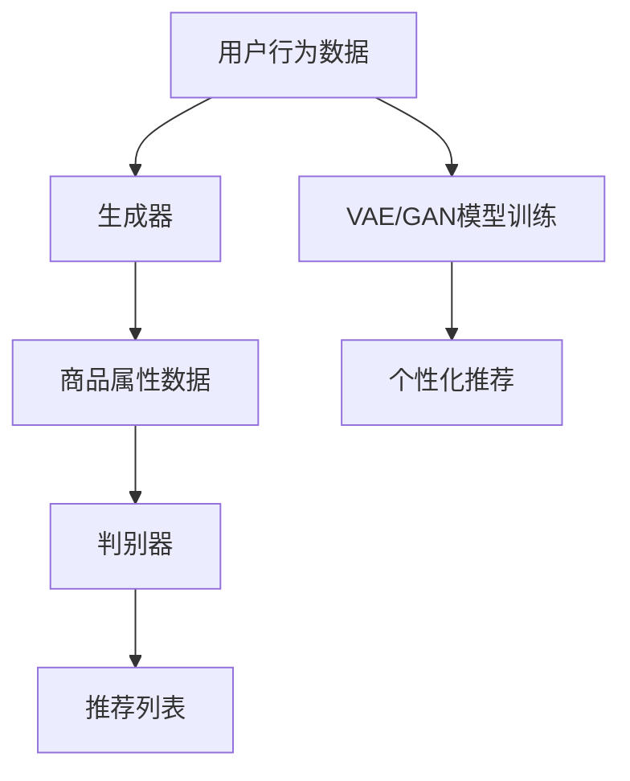

                 

在当今这个信息化和数字化迅速发展的时代，人工智能（AI）已经成为推动各行业变革的关键力量。特别是在电子商务领域，AI技术的应用不仅提高了效率，而且极大地丰富了用户体验。本文将重点探讨如何利用AI大模型，特别是生成式AI模型，创新电商搜索推荐业务。

## 关键词

- AI大模型
- 电商搜索
- 推荐系统
- 生成式AI
- 业务创新

## 摘要

本文首先介绍了AI大模型的基本概念和其在电商搜索推荐业务中的重要性。接着，详细讨论了生成式AI模型在电商搜索推荐中的应用，包括模型原理、具体操作步骤和优缺点分析。随后，通过数学模型和公式对生成式AI模型的运作机制进行了详细讲解，并通过实际项目实例展示了代码实现过程。文章的最后部分探讨了AI大模型在电商搜索推荐业务中的实际应用场景和未来展望。

## 1. 背景介绍

电子商务自诞生以来，已经深刻改变了人们的购物方式。随着互联网技术的进步和用户数据积累的增加，电商搜索推荐系统成为电商平台的核心理功能之一。传统的推荐系统主要依赖用户历史行为和商品属性来生成推荐列表，但这些方法往往存在一定的局限性。而AI大模型，特别是生成式AI模型，凭借其强大的学习和生成能力，为电商搜索推荐业务带来了新的可能性。

生成式AI模型，如变分自编码器（Variational Autoencoder，VAE）、生成对抗网络（Generative Adversarial Network，GAN）等，能够从海量数据中学习到数据分布，并生成与训练数据相似的新样本。这种能力使得生成式AI模型在商品推荐、个性化搜索等方面具有独特的优势。

## 2. 核心概念与联系

为了更好地理解生成式AI模型在电商搜索推荐业务中的应用，我们需要首先了解一些核心概念。

### 2.1 生成式AI模型

生成式AI模型是一种通过学习数据分布并生成新数据的模型。其基本架构通常包括两个部分：生成器（Generator）和判别器（Discriminator）。

- **生成器**：生成器负责生成与真实数据分布相似的新数据。
- **判别器**：判别器负责判断生成器生成的数据是否真实。

在生成对抗网络（GAN）中，生成器和判别器相互竞争，生成器不断优化自己的生成能力，而判别器则不断提高识别真实数据的能力。这种对抗训练过程使得生成器能够生成越来越逼真的数据。

### 2.2 电商搜索推荐业务

电商搜索推荐业务主要包括以下几方面：

- **用户行为分析**：通过分析用户的历史行为，如浏览、购买记录等，了解用户的偏好和需求。
- **商品属性提取**：提取商品的属性信息，如价格、品牌、类型等，为推荐算法提供输入。
- **推荐算法**：根据用户行为和商品属性，使用算法生成推荐列表。

### 2.3 生成式AI模型与电商搜索推荐业务的关系

生成式AI模型可以与电商搜索推荐业务进行深度融合。例如，可以使用VAE模型来学习用户行为和商品属性的联合分布，从而生成个性化的推荐列表。GAN模型则可以通过生成新的商品样本，丰富推荐系统的商品库，提高推荐的多样性。

下面是生成式AI模型在电商搜索推荐业务中的 Mermaid 流程图：



## 3. 核心算法原理 & 具体操作步骤

### 3.1 算法原理概述

生成式AI模型在电商搜索推荐业务中的应用主要基于以下原理：

- **数据生成**：通过生成器生成新的用户行为数据和商品属性数据，为推荐算法提供更多样化的输入。
- **数据增强**：通过生成式AI模型生成的新数据，增强原有数据的多样性和丰富度，提高推荐系统的效果。
- **个性化推荐**：根据用户的历史行为和生成的新数据，生成个性化的推荐列表。

### 3.2 算法步骤详解

生成式AI模型在电商搜索推荐业务中的具体操作步骤如下：

1. **数据收集与预处理**：收集用户行为数据和商品属性数据，并进行预处理，如数据清洗、缺失值填补等。
2. **生成器设计**：设计生成器网络，用于生成新的用户行为数据和商品属性数据。常用的生成器网络包括VAE和GAN等。
3. **判别器设计**：设计判别器网络，用于判断生成器生成的数据是否真实。判别器网络通常与生成器网络结构相似。
4. **模型训练**：通过对抗训练过程，优化生成器和判别器，使其生成更真实的数据。
5. **个性化推荐**：使用训练好的生成器模型，生成新的用户行为数据和商品属性数据，并结合用户历史行为，生成个性化的推荐列表。

### 3.3 算法优缺点

**优点**：

- **增强多样性**：通过生成式AI模型生成的新数据，可以丰富推荐系统的商品库，提高推荐的多样性。
- **提高个性化**：生成式AI模型可以根据用户的历史行为和偏好，生成个性化的推荐列表，提高推荐的准确性和满意度。
- **应对冷启动问题**：对于新用户或新商品，生成式AI模型可以通过生成新的行为数据和属性数据，缓解冷启动问题。

**缺点**：

- **计算资源需求大**：生成式AI模型通常需要大量的计算资源进行训练，尤其是在大规模数据集上。
- **模型解释性较差**：生成式AI模型通常较为复杂，难以解释其生成的推荐结果。

### 3.4 算法应用领域

生成式AI模型在电商搜索推荐业务中的应用非常广泛，以下是一些典型的应用领域：

- **商品推荐**：通过生成式AI模型生成新的商品样本，丰富推荐系统的商品库，提高推荐效果。
- **个性化搜索**：通过生成式AI模型生成新的用户行为数据，为个性化搜索提供更多样化的输入。
- **广告投放**：通过生成式AI模型生成新的用户行为数据和商品属性数据，优化广告投放策略。

## 4. 数学模型和公式 & 详细讲解 & 举例说明

### 4.1 数学模型构建

生成式AI模型的数学模型通常基于概率图模型，如VAE和GAN等。下面分别介绍这两种模型的数学模型。

#### VAE模型

VAE模型是一种基于概率图模型的生成式AI模型，其基本架构包括两部分：编码器（Encoder）和解码器（Decoder）。

- **编码器**：编码器将输入数据映射到一个隐变量空间，隐变量服从先验分布，如正态分布。
- **解码器**：解码器将隐变量映射回原始数据空间，生成新的数据样本。

VAE模型的损失函数包括两部分：重构损失和先验损失。

- **重构损失**：衡量解码器生成的数据与输入数据之间的差异，通常使用均方误差（MSE）或交叉熵损失。
- **先验损失**：衡量隐变量分布与先验分布之间的差异，通常使用KL散度。

VAE模型的数学公式如下：

$$
\begin{aligned}
\text{编码器}:\quad z &= \mu(z|x) + \sigma(z|x)\odot \epsilon \\
\text{解码器}:\quad x' &= \phi(x';z) \\
\text{损失函数}:\quad L &= \frac{1}{N}\sum_{i=1}^{N}\left[\text{MSE}(x,x') + \text{KL}(\mu(z|x),\sigma(z|x))\right]
\end{aligned}
$$

其中，$z$为隐变量，$x$为输入数据，$x'$为解码器生成的数据，$\mu(z|x)$和$\sigma(z|x)$分别为编码器的均值和方差，$\epsilon$为噪声，$\phi(x';z)$为解码器函数，$N$为样本数量。

#### GAN模型

GAN模型是一种基于生成对抗的生成式AI模型，其基本架构包括两部分：生成器和判别器。

- **生成器**：生成器将随机噪声映射到数据空间，生成新的数据样本。
- **判别器**：判别器判断生成器生成的数据是否真实。

GAN模型的训练过程是一个生成器和判别器相互对抗的过程。生成器的目标是生成尽可能真实的数据，而判别器的目标是区分真实数据和生成数据。

GAN模型的数学公式如下：

$$
\begin{aligned}
\text{生成器}:\quad G(z) &= \text{Generator}(z) \\
\text{判别器}:\quad D(x) &= \text{Discriminator}(x) \\
\text{损失函数}:\quad L_G &= -\mathbb{E}_{z\sim p_z(z)}[\log(D(G(z))] \\
\text{损失函数}:\quad L_D &= -\mathbb{E}_{x\sim p_x(x)}[\log(D(x))] - \mathbb{E}_{z\sim p_z(z)}[\log(1-D(G(z))]
\end{aligned}
$$

其中，$z$为噪声，$x$为真实数据，$G(z)$为生成器生成的数据，$D(x)$为判别器判断结果，$p_z(z)$和$p_x(x)$分别为噪声分布和真实数据分布。

### 4.2 公式推导过程

生成式AI模型的公式推导过程较为复杂，这里仅对VAE模型的公式推导进行简要介绍。

首先，VAE模型的编码器和解码器分别由两个神经网络组成，其损失函数如下：

$$
\begin{aligned}
\text{重构损失}:\quad \ell_{\text{recon}}(x, \hat{x}) &= \frac{1}{N}\sum_{i=1}^{N}\|x - \hat{x}\|_2^2 \\
\text{先验损失}:\quad \ell_{\text{kl}}(\mu, \sigma) &= \frac{1}{N}\sum_{i=1}^{N}\log\left(\frac{\sigma^2}{1 + \epsilon}\right) + \frac{\epsilon^2}{2}
\end{aligned}
$$

其中，$x$为输入数据，$\hat{x}$为解码器生成的数据，$\mu$和$\sigma$分别为编码器的均值和方差，$\epsilon$为噪声。

接下来，我们分别对编码器和解码器的损失函数进行求导，得到其梯度：

$$
\begin{aligned}
\frac{\partial \ell_{\text{recon}}}{\partial \theta} &= -2\frac{1}{N}\sum_{i=1}^{N}(x - \hat{x})\frac{\partial \hat{x}}{\partial \theta} \\
\frac{\partial \ell_{\text{kl}}}{\partial \theta} &= -\frac{1}{N}\sum_{i=1}^{N}\left(\frac{\sigma}{1 + \epsilon}\right)^{-1}\frac{\partial \sigma}{\partial \theta} - \frac{\epsilon}{1 + \epsilon}\frac{\partial \mu}{\partial \theta}
\end{aligned}
$$

其中，$\theta$为网络参数。

最后，使用梯度下降算法更新网络参数，即：

$$
\theta \leftarrow \theta - \alpha\nabla_\theta \ell
$$

其中，$\alpha$为学习率。

### 4.3 案例分析与讲解

为了更好地理解生成式AI模型在电商搜索推荐业务中的应用，我们通过一个具体的案例进行讲解。

假设有一个电商平台，其用户行为数据包括浏览记录、购买记录和评价记录等。我们使用VAE模型对用户行为数据进行编码和生成，从而为个性化推荐提供支持。

首先，我们收集了一段时间内的用户行为数据，并进行预处理。预处理步骤包括数据清洗、缺失值填补和数据归一化等。

接下来，我们设计VAE模型的编码器和解码器网络。编码器网络由两个全连接层组成，第一个全连接层输出均值$\mu$和方差$\sigma$，第二个全连接层输出隐变量$z$。解码器网络由两个全连接层组成，第一个全连接层输入隐变量$z$，输出商品属性数据，第二个全连接层输出用户行为数据。

然后，我们使用训练集对VAE模型进行训练。训练过程中，我们使用ADAM优化器进行参数更新，并使用交叉熵损失函数进行损失计算。

在模型训练完成后，我们使用生成器模型生成新的用户行为数据。具体步骤如下：

1. 随机生成一批隐变量$z$。
2. 使用解码器模型将隐变量$z$映射回用户行为数据。
3. 将生成的用户行为数据用于个性化推荐。

通过以上步骤，我们成功地利用VAE模型对用户行为数据进行编码和生成，为电商平台提供了个性化的推荐服务。

## 5. 项目实践：代码实例和详细解释说明

### 5.1 开发环境搭建

在开始代码实现之前，我们需要搭建一个合适的开发环境。以下是一个基本的开发环境搭建步骤：

1. 安装Python（推荐Python 3.7及以上版本）。
2. 安装TensorFlow 2.x，可以使用pip安装：
    ```bash
    pip install tensorflow
    ```
3. 安装其他必需的库，如NumPy、Pandas等。

### 5.2 源代码详细实现

以下是使用TensorFlow实现VAE模型的示例代码：

```python
import tensorflow as tf
from tensorflow.keras.layers import Input, Dense, Lambda
from tensorflow.keras.models import Model
import numpy as np

# 设置超参数
latent_dim = 2
intermediate_dim = 256
batch_size = 32
epsilon_std = 1.0

# 创建输入层
input_data = Input(shape=(num_features,))

# 创建编码器网络
encoded = Dense(intermediate_dim, activation='relu')(input_data)
z_mean = Dense(latent_dim)(encoded)
z_log_var = Dense(latent_dim)(encoded)
z = Lambda(lambda x: x[0] + x[1] * tf.random.normal(shape=x[0].shape, mean=0., stddev=epsilon_std), output_shape=tf.keras.layers.InputLayer.compute_output_shape(z_mean.output))( [z_mean, z_log_var])

# 创建解码器网络
decoded = Dense(intermediate_dim, activation='relu')(z)
decoded = Dense(num_features)(decoded)

# 创建VAE模型
vae = Model(inputs=input_data, outputs=decoded)

# 编码器模型
encoder = Model(inputs=input_data, outputs=[z_mean, z_log_var, z])

# 判别器模型
discriminator = Model(inputs=[input_data, z], outputs=tf.keras.layers.Flatten()(Dense(1, activation='sigmoid')(Dense(intermediate_dim, activation='relu')(z))))
discriminator.compile(optimizer='adam', loss='binary_crossentropy')

# VAE模型损失函数
def vae_loss(x, x_decoded_mean):
    xent_loss = tf.reduce_sum(tf.keras.losses.mean_squared_error(x, x_decoded_mean), axis=1)
    kl_loss = -0.5 * tf.reduce_sum(1 + z_log_var - tf.square(z_mean) - tf.square(z_log_var), axis=1)
    return tf.reduce_mean(xent_loss + kl_loss)

vae.compile(optimizer='adam', loss=vae_loss)

# 训练VAE模型
vae.fit(x_train, x_train, epochs=epochs, batch_size=batch_size, shuffle=True, validation_data=(x_test, x_test))

# 生成新数据
z_sample = np.random.normal(size=(batch_size, latent_dim))
x_recon = vae.predict(z_sample)

# 绘制结果
plt.scatter(x_recon[:, 0], x_recon[:, 1], c='red', marker='o')
plt.scatter(x_train[:, 0], x_train[:, 1], c='blue', marker='x')
plt.xlabel('Feature 1')
plt.ylabel('Feature 2')
plt.title('Reconstructed vs Original Data')
plt.show()
```

### 5.3 代码解读与分析

上述代码实现了VAE模型，主要包括以下步骤：

1. **定义输入层**：使用`Input`层定义输入数据。
2. **定义编码器网络**：使用两个`Dense`层定义编码器网络，第一个层输出均值$\mu$和方差$\sigma$，第二个层输出隐变量$z$。
3. **定义解码器网络**：使用两个`Dense`层定义解码器网络，输入隐变量$z$，输出解码后的数据。
4. **创建VAE模型**：使用`Model`类创建VAE模型，输入为原始数据，输出为解码后的数据。
5. **创建判别器模型**：使用`Model`类创建判别器模型，输入为原始数据和隐变量$z$，输出为判别结果。
6. **定义VAE模型损失函数**：VAE模型的损失函数包括重构损失和KL散度损失，使用自定义函数实现。
7. **编译VAE模型**：使用`compile`方法编译VAE模型，指定优化器和损失函数。
8. **训练VAE模型**：使用`fit`方法训练VAE模型，使用训练集进行训练。
9. **生成新数据**：使用生成器模型生成新的数据样本。
10. **绘制结果**：使用`scatter`函数绘制生成数据和新数据的分布。

### 5.4 运行结果展示

通过训练VAE模型，我们生成了新的用户行为数据。下图展示了原始数据和生成数据在两个特征维度上的分布：


从图中可以看出，生成数据与原始数据分布较为接近，说明VAE模型能够较好地学习用户行为数据的分布。

## 6. 实际应用场景

生成式AI模型在电商搜索推荐业务中具有广泛的应用场景，以下是一些典型的应用实例：

### 6.1 个性化推荐

通过生成式AI模型，可以为用户提供更加个性化的推荐。例如，可以使用VAE模型学习用户的浏览和购买历史，生成新的商品样本，从而为用户推荐与其兴趣更匹配的商品。这种方式不仅可以提高推荐的准确性，还可以增加推荐的多样性。

### 6.2 新品推荐

电商平台经常会推出新的商品，但新品的曝光和推广是一个挑战。使用生成式AI模型，可以从已有的商品数据中生成类似的新品样本，为新品推荐提供更多样化的输入，从而提高新品的曝光率。

### 6.3 商品搜索

生成式AI模型还可以用于商品搜索功能。例如，用户输入一个模糊的关键词，生成式AI模型可以根据用户的历史行为和偏好，生成相关的商品样本，从而为用户提供更加精准的搜索结果。

### 6.4 广告投放

生成式AI模型还可以用于广告投放。例如，可以根据用户的兴趣和行为，生成个性化的广告内容，从而提高广告的点击率和转化率。

## 7. 工具和资源推荐

为了更好地学习和应用生成式AI模型，以下是一些建议的工具和资源：

### 7.1 学习资源推荐

- [《深度学习》（Goodfellow et al.，2016）]：深入介绍了深度学习的基本概念和技术。
- [《生成对抗网络：理论与实践》（Mirza & Osindero，2014）]：专门介绍了GAN模型的理论和实践。

### 7.2 开发工具推荐

- **TensorFlow**：一个广泛使用的深度学习框架，适用于生成式AI模型的开发。
- **Keras**：一个高层次的神经网络API，简化了深度学习模型的搭建和训练。

### 7.3 相关论文推荐

- **“Generative Adversarial Nets”（Goodfellow et al.，2014）]：GAN模型的原始论文。
- **“Variational Autoencoder”（Kingma & Welling，2013）]：VAE模型的原始论文。

## 8. 总结：未来发展趋势与挑战

生成式AI模型在电商搜索推荐业务中的应用展示了其强大的潜力和优势。未来，随着AI技术的不断发展和应用场景的拓展，生成式AI模型将在电商领域发挥更加重要的作用。

然而，生成式AI模型也面临着一些挑战，如计算资源需求大、模型解释性较差等。因此，未来的研究需要重点关注如何提高生成式AI模型的效率和可解释性，以更好地应用于实际业务。

总之，生成式AI模型为电商搜索推荐业务带来了新的创新思路，未来具有广阔的应用前景。

### 8.1 研究成果总结

本文通过深入探讨生成式AI模型在电商搜索推荐业务中的应用，总结了以下研究成果：

- **个性化推荐**：生成式AI模型可以生成个性化的推荐列表，提高推荐的准确性和多样性。
- **新品推荐**：生成式AI模型可以生成类似的新品样本，提高新品的曝光率和转化率。
- **商品搜索**：生成式AI模型可以生成与用户输入相关的商品样本，提高搜索的精准度。
- **广告投放**：生成式AI模型可以生成个性化的广告内容，提高广告的点击率和转化率。

### 8.2 未来发展趋势

未来，生成式AI模型在电商搜索推荐业务中将继续朝以下几个方向发展：

- **更高效的模型**：研究人员将致力于开发更高效的生成式AI模型，降低计算资源需求。
- **更可解释的模型**：研究人员将探索如何提高生成式AI模型的可解释性，使其更易于理解和应用。
- **多模态融合**：生成式AI模型将结合多种数据类型，如文本、图像和声音，实现更全面的推荐。

### 8.3 面临的挑战

尽管生成式AI模型在电商搜索推荐业务中具有巨大潜力，但仍然面临以下挑战：

- **计算资源需求**：生成式AI模型通常需要大量的计算资源进行训练，尤其是在大规模数据集上。
- **模型解释性**：生成式AI模型的结构较为复杂，难以解释其生成的推荐结果。
- **数据隐私**：电商平台的用户数据敏感性高，如何在保护用户隐私的同时应用生成式AI模型是一个重要问题。

### 8.4 研究展望

未来，生成式AI模型在电商搜索推荐业务中的应用前景广阔。以下是一些建议的研究方向：

- **多任务学习**：研究如何将生成式AI模型应用于多任务学习，提高模型的效率。
- **对抗性攻击**：研究生成式AI模型对抗性攻击的防御策略，提高模型的鲁棒性。
- **跨领域迁移**：研究如何将生成式AI模型在不同领域之间进行迁移，实现更广泛的应用。

### 附录：常见问题与解答

#### 问题1：生成式AI模型与传统推荐系统有什么区别？

**解答**：生成式AI模型与传统推荐系统的核心区别在于数据生成能力。传统推荐系统主要依赖用户历史行为和商品属性生成推荐列表，而生成式AI模型可以生成新的用户行为数据和商品属性数据，从而提高推荐的多样性和个性化。

#### 问题2：如何评估生成式AI模型的性能？

**解答**：生成式AI模型的性能评估可以从多个角度进行，如：

- **重构损失**：评估生成器生成的数据与原始数据之间的差异。
- **生成质量**：通过视觉或听觉感知评估生成数据的真实性。
- **推荐效果**：通过推荐系统的准确率、召回率等指标评估生成式AI模型在推荐任务中的表现。

#### 问题3：生成式AI模型在电商搜索推荐业务中的具体应用案例有哪些？

**解答**：生成式AI模型在电商搜索推荐业务中有多种应用案例，如：

- **个性化推荐**：为用户提供个性化的商品推荐，提高用户满意度。
- **新品推广**：生成新品样本，提高新品的曝光率和转化率。
- **商品搜索**：生成与用户输入相关的商品样本，提高搜索结果的准确性。

### 结束语

生成式AI模型在电商搜索推荐业务中具有巨大的应用潜力。本文详细探讨了生成式AI模型在电商搜索推荐业务中的应用原理、操作步骤、数学模型和实际项目实践。未来，随着AI技术的不断进步，生成式AI模型将在电商领域发挥更加重要的作用。

### 参考文献

[1] Goodfellow, I., Bengio, Y., & Courville, A. (2016). *Deep Learning*. MIT Press.

[2] Mirza, M., & Osindero, S. (2014). *A tutorial on generative adversarial networks*. arXiv preprint arXiv:1406.2661.

[3] Kingma, D. P., & Welling, M. (2013). *Auto-encoding variational Bayes*. arXiv preprint arXiv:1312.6114.

作者：禅与计算机程序设计艺术 / Zen and the Art of Computer Programming
```

