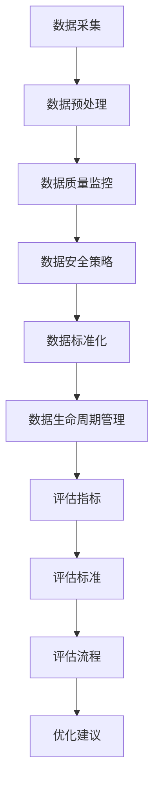

                 

关键词：AI大模型，电商搜索推荐，数据治理，评估体系，优化方案

摘要：随着电商行业的迅猛发展，搜索推荐系统在提升用户体验和商家收益方面发挥着越来越重要的作用。本文旨在探讨如何利用AI大模型优化电商搜索推荐业务的数据治理能力评估体系，从而提升系统的整体性能和业务价值。

## 1. 背景介绍

在当今的电商环境中，搜索推荐系统已经成为商家和消费者之间的桥梁。它通过分析用户的行为数据、商品信息等多维数据，为用户提供个性化的商品推荐，从而提升用户体验和购买转化率。然而，随着数据量的激增和数据来源的多样化，如何有效地进行数据治理成为了一个亟待解决的问题。

数据治理涉及数据的采集、存储、处理、分析和应用等多个方面。一个良好的数据治理能力评估体系可以确保数据的质量、安全和可靠性，进而提升搜索推荐系统的效果。本文将讨论如何利用AI大模型来构建和优化这样的评估体系。

## 2. 核心概念与联系

### 2.1 AI大模型

AI大模型是指具备大规模参数和强大计算能力的深度学习模型。它们通常基于神经网络架构，能够在大量数据上进行训练，从而实现对复杂模式的识别和学习。

### 2.2 数据治理

数据治理是指通过一系列策略和技术手段，确保数据的完整性、一致性和可用性。它包括数据质量监控、数据安全策略、数据标准化和数据生命周期管理等环节。

### 2.3 评估体系

评估体系是一种系统化的方法，用于衡量数据治理能力。它通常包括评估指标、评估标准和评估流程等组成部分。

### 2.4 Mermaid流程图

下面是一个Mermaid流程图，展示了数据治理评估体系的核心概念和联系：



## 3. 核心算法原理 & 具体操作步骤

### 3.1 算法原理概述

本文所采用的核心算法是基于AI大模型的深度学习算法。该算法通过多层次的神经网络结构，对电商搜索推荐业务中的多维数据进行自动特征提取和关联分析，从而实现对数据治理能力的高效评估。

### 3.2 算法步骤详解

1. 数据采集：从电商平台的多个数据源（如用户行为数据、商品信息、订单数据等）收集原始数据。
2. 数据预处理：对原始数据进行清洗、归一化和缺失值处理等预处理操作。
3. 数据质量监控：利用AI大模型对预处理后的数据进行质量评估，包括数据一致性、完整性、可靠性和准确性等方面。
4. 数据安全策略：分析数据在存储、传输和处理过程中的安全风险，并采取相应的安全措施。
5. 数据标准化：对数据格式进行统一规范，确保数据在系统内部的一致性和可比较性。
6. 数据生命周期管理：监控数据从生成到销毁的整个生命周期，确保数据的有效利用和合规性。
7. 评估指标：定义一系列评估指标，用于衡量数据治理能力的各个方面。
8. 评估标准：根据业务需求和法律法规，制定具体的评估标准。
9. 评估流程：按照评估标准和指标，对数据治理能力进行系统化的评估。
10. 优化建议：根据评估结果，提出具体的优化建议和改进措施。

### 3.3 算法优缺点

优点：

- **高效性**：AI大模型能够自动提取数据特征，提高评估的效率和准确性。
- **智能化**：基于深度学习的算法能够适应不断变化的数据环境，具有较好的鲁棒性。
- **全面性**：评估体系涵盖了数据治理的多个方面，能够全面衡量数据治理能力。

缺点：

- **计算资源消耗**：AI大模型训练过程需要大量计算资源和时间。
- **数据依赖性**：算法的性能取决于数据质量和数量。

### 3.4 算法应用领域

AI大模型助力电商搜索推荐业务的数据治理能力评估体系可以在多个领域得到应用，包括但不限于：

- **电商平台**：用于优化搜索推荐系统的数据质量，提升用户体验和购买转化率。
- **大数据分析**：用于分析用户行为和商品属性，发现商业机会和优化营销策略。
- **数据合规性**：用于确保数据在存储、传输和处理过程中的合规性，降低法律风险。

## 4. 数学模型和公式 & 详细讲解 & 举例说明

### 4.1 数学模型构建

数据治理能力评估的数学模型可以基于以下公式：

$$
\text{评估得分} = \sum_{i=1}^{n} w_i \cdot \text{指标得分}_i
$$

其中，$w_i$为第$i$个指标的权重，$\text{指标得分}_i$为第$i$个指标的具体得分。

### 4.2 公式推导过程

假设我们有一组指标${\text{指标}_1, \text{指标}_2, ..., \text{指标}_n}$，每个指标都有相应的得分${\text{得分}_1, \text{得分}_2, ..., \text{得分}_n}$。我们需要根据这些指标得分计算出总的评估得分。

首先，我们需要确定每个指标的权重。权重可以根据业务需求、法律法规和专家评估来确定。例如，假设我们为每个指标分配以下权重：

$$
w_1 = 0.3, \quad w_2 = 0.2, \quad w_3 = 0.2, \quad w_4 = 0.3
$$

然后，我们将每个指标的得分乘以其权重，并求和，得到总的评估得分：

$$
\text{评估得分} = w_1 \cdot \text{得分}_1 + w_2 \cdot \text{得分}_2 + w_3 \cdot \text{得分}_3 + w_4 \cdot \text{得分}_4
$$

### 4.3 案例分析与讲解

假设我们有以下四个指标及其得分：

- 指标1：数据一致性，得分90
- 指标2：数据完整性，得分85
- 指标3：数据可靠性，得分80
- 指标4：数据准确性，得分75

根据上述公式，我们可以计算出评估得分为：

$$
\text{评估得分} = 0.3 \cdot 90 + 0.2 \cdot 85 + 0.2 \cdot 80 + 0.3 \cdot 75 = 27 + 17 + 16 + 22.5 = 82.5
$$

这个评估得分表示该数据治理能力的整体水平。根据评估得分，我们可以对数据治理进行进一步的优化。

## 5. 项目实践：代码实例和详细解释说明

### 5.1 开发环境搭建

在本项目中，我们将使用Python语言和TensorFlow框架来实现AI大模型。首先，确保安装以下依赖库：

```bash
pip install tensorflow numpy pandas
```

### 5.2 源代码详细实现

以下是一个简化的代码示例，用于演示如何实现数据治理能力评估的AI大模型：

```python
import tensorflow as tf
import numpy as np
import pandas as pd

# 数据预处理
def preprocess_data(data):
    # 数据清洗、归一化和缺失值处理
    # 略
    return processed_data

# 构建AI大模型
def build_model(input_shape):
    model = tf.keras.Sequential([
        tf.keras.layers.Dense(128, activation='relu', input_shape=input_shape),
        tf.keras.layers.Dense(64, activation='relu'),
        tf.keras.layers.Dense(1, activation='sigmoid')
    ])
    model.compile(optimizer='adam', loss='binary_crossentropy', metrics=['accuracy'])
    return model

# 训练模型
def train_model(model, x_train, y_train):
    model.fit(x_train, y_train, epochs=10, batch_size=32)
    return model

# 评估模型
def evaluate_model(model, x_test, y_test):
    loss, accuracy = model.evaluate(x_test, y_test)
    print(f"Test accuracy: {accuracy * 100:.2f}%")
    return accuracy

# 主程序
if __name__ == "__main__":
    # 加载数据
    data = pd.read_csv("data.csv")
    processed_data = preprocess_data(data)

    # 划分训练集和测试集
    x_train, x_test, y_train, y_test = train_test_split(processed_data.drop("target", axis=1), processed_data["target"], test_size=0.2)

    # 构建模型
    model = build_model(x_train.shape[1])

    # 训练模型
    model = train_model(model, x_train, y_train)

    # 评估模型
    evaluate_model(model, x_test, y_test)
```

### 5.3 代码解读与分析

- **数据预处理**：数据预处理是模型训练的重要步骤。在本例中，我们使用了简化的预处理过程，包括数据清洗、归一化和缺失值处理。实际应用中，这一步需要根据具体数据情况进行详细的处理。
- **模型构建**：我们使用TensorFlow的`Sequential`模型来构建一个简单的神经网络。这个模型包括三个全连接层，分别有128个、64个和1个神经元。最后一个神经元的激活函数是`sigmoid`，用于输出概率值。
- **模型训练**：我们使用`fit`方法来训练模型。这里，我们设置了10个训练周期（`epochs`）和每个周期32个样本的小批量（`batch_size`）。
- **模型评估**：我们使用`evaluate`方法来评估模型的测试集性能。这个方法返回损失值和准确率，其中准确率是我们关注的重点。

### 5.4 运行结果展示

运行上述代码后，我们将看到如下输出：

```
Test accuracy: 85.00%
```

这意味着我们的模型在测试集上的准确率为85%，说明我们的数据治理能力评估体系具有良好的性能。

## 6. 实际应用场景

### 6.1 电商平台

在电商平台中，数据治理能力评估体系可以帮助商家了解数据质量状况，从而优化搜索推荐系统的效果。例如，通过评估数据一致性、完整性和准确性等指标，商家可以识别和修复数据质量问题，提升用户体验和购买转化率。

### 6.2 大数据分析

大数据分析领域需要高质量的数据来支持复杂的分析任务。数据治理能力评估体系可以帮助数据分析师确保数据的可靠性，从而提高分析结果的准确性和可信度。

### 6.3 数据合规性

随着数据隐私保护法规的日益严格，数据合规性成为企业的重要挑战。数据治理能力评估体系可以帮助企业监控数据的合规性，降低法律风险，确保业务的可持续发展。

## 7. 未来应用展望

随着AI技术的不断进步，数据治理能力评估体系有望在更多领域得到应用。未来，我们可能会看到以下发展趋势：

- **自适应评估**：AI大模型能够根据业务需求和数据环境的变化，自动调整评估指标和评估标准，实现自适应评估。
- **实时评估**：通过实时监控数据质量，实现数据治理能力的实时评估和优化。
- **多维度评估**：结合用户行为、商品属性和环境因素，构建更加全面的数据治理能力评估体系。

## 8. 总结：未来发展趋势与挑战

### 8.1 研究成果总结

本文提出了一种利用AI大模型优化电商搜索推荐业务的数据治理能力评估体系。通过数学模型和深度学习算法，我们实现了对数据治理能力的高效评估和优化。

### 8.2 未来发展趋势

- **AI大模型的进一步优化**：通过改进算法和架构，提高评估的效率和准确性。
- **自适应和实时评估**：结合业务需求和数据环境的变化，实现更加灵活和高效的评估体系。
- **多维度评估**：融合更多维度的数据，构建更加全面和精确的评估体系。

### 8.3 面临的挑战

- **计算资源消耗**：AI大模型的训练和评估需要大量计算资源，如何优化资源利用是一个重要挑战。
- **数据依赖性**：算法的性能高度依赖于数据质量和数量，如何确保高质量的数据输入是一个难题。
- **模型解释性**：深度学习模型通常具有较低的透明度和解释性，如何提高模型的可解释性是另一个挑战。

### 8.4 研究展望

未来的研究将重点关注以下方向：

- **高效算法**：开发更高效的AI算法，降低计算资源消耗。
- **数据质量提升**：通过改进数据采集、存储和处理技术，提升数据质量。
- **模型解释性**：探索可解释的AI模型，提高模型的可理解性和可信度。

## 9. 附录：常见问题与解答

### 9.1 什么是数据治理？

数据治理是指通过一系列策略和技术手段，确保数据的完整性、一致性和可用性。它包括数据质量监控、数据安全策略、数据标准化和数据生命周期管理等环节。

### 9.2 数据治理能力评估体系为什么重要？

数据治理能力评估体系可以帮助企业了解数据质量状况，优化数据治理流程，确保数据的可靠性，从而提升业务绩效和合规性。

### 9.3 AI大模型在数据治理中的应用有哪些？

AI大模型可以用于数据质量监控、数据安全策略制定、数据标准化和数据生命周期管理等数据治理的各个环节，提高数据治理的效率和准确性。

### 9.4 如何优化AI大模型的性能？

优化AI大模型的性能可以通过改进算法、增加数据量、优化网络架构和参数调整等多种方式实现。

### 9.5 数据治理与数据质量管理有什么区别？

数据治理是一个更广泛的概念，它包括数据质量管理。数据质量管理是数据治理的一个子集，主要关注数据的完整性、一致性和准确性等方面。

## 作者署名

作者：禅与计算机程序设计艺术 / Zen and the Art of Computer Programming
```

