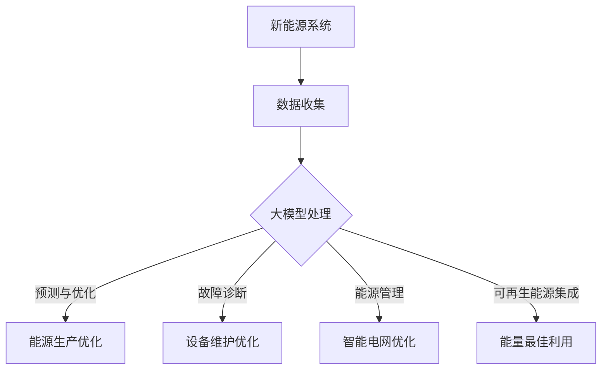

                 

关键词：人工智能，大模型，新能源，商业化，算法，技术趋势

摘要：本文将探讨人工智能大模型在新能源领域的商业化潜力。通过分析大模型的核心概念、算法原理、应用实例和未来展望，我们将揭示AI技术如何推动新能源产业的创新与发展。

## 1. 背景介绍

随着全球对可持续发展和环境保护的关注日益增加，新能源领域成为了科技创新的重要战场。新能源包括太阳能、风能、水能、地热能等，这些能源形式不仅可再生，而且对环境污染较小。然而，新能源的开发和利用面临着诸多挑战，如资源分布不均、能量转化效率低、预测和维护复杂等。

近年来，人工智能技术的飞速发展为新能源领域的创新提供了强大的动力。特别是大模型（也称为深度学习模型），通过海量数据的学习和复杂的算法，能够实现更高精度的预测、优化和自动化控制。这使得新能源产业在商业化进程中迎来了新的机遇。

## 2. 核心概念与联系

### 2.1. 人工智能大模型

人工智能大模型是基于深度学习的复杂神经网络，具有处理大规模数据和高维度特征的能力。常见的AI大模型包括Transformer、BERT、GPT等，它们在图像识别、自然语言处理、推荐系统等领域取得了显著成果。

### 2.2. 能源系统的复杂性与人工智能

新能源系统的特点决定了其需要高度智能化。能源系统通常具有高度非线性、多变量和动态变化的特性，这使得传统的方法难以应对。人工智能大模型通过引入大数据和先进的算法，能够有效解析这些复杂性，并提供更为精确的解决方案。

### 2.3. 大模型与新能源领域的关系

大模型与新能源领域的联系主要体现在以下几个方面：

- **预测与优化**：利用大模型进行天气预测、风速预测、能流分析等，从而优化能源生产与分配。
- **故障诊断与维护**：通过对传感器数据的分析，大模型能够提前识别设备故障，降低维护成本。
- **能源管理**：大模型在智能电网中的应用，可以实现能源的高效分配和调度。
- **可再生能源集成**：大模型帮助整合不同类型的新能源，实现能量的最佳利用。

### 2.4. Mermaid 流程图



## 3. 核心算法原理 & 具体操作步骤

### 3.1. 算法原理概述

大模型的核心算法主要包括深度学习、神经网络、优化算法等。深度学习通过多层神经网络的堆叠，实现从原始数据到抽象特征的转换。神经网络则是基于生物神经系统的计算模型，通过调整权重和偏置来实现数据的非线性变换。优化算法则用于调整模型的参数，以最小化预测误差。

### 3.2. 算法步骤详解

1. **数据预处理**：包括数据清洗、归一化、特征提取等，以确保数据的质量和一致性。
2. **模型构建**：选择合适的深度学习框架，如TensorFlow或PyTorch，构建神经网络模型。
3. **模型训练**：使用大量数据进行模型训练，通过反向传播算法不断调整模型参数。
4. **模型评估**：通过验证集和测试集对模型进行评估，选择最优模型。
5. **模型部署**：将训练好的模型部署到实际应用中，进行实时预测和优化。

### 3.3. 算法优缺点

**优点**：
- **强大的处理能力**：能够处理大规模和高维度的数据。
- **自适应性强**：通过学习数据，模型能够不断优化自身。
- **通用性强**：适用于多种场景，如预测、优化、控制等。

**缺点**：
- **计算成本高**：需要大量的计算资源和时间进行训练。
- **对数据质量依赖强**：数据质量直接影响模型的性能。
- **解释性差**：深度学习模型通常难以解释其内部机制。

### 3.4. 算法应用领域

大模型在新能源领域的应用包括但不限于：
- **气象预测**：用于预测天气和风速，优化能源生产。
- **设备故障诊断**：通过对传感器数据的分析，预测设备故障。
- **能源管理**：实现智能电网中的能量分配和调度。
- **可再生能源集成**：优化不同类型新能源的集成，提高能源利用效率。

## 4. 数学模型和公式 & 详细讲解 & 举例说明

### 4.1. 数学模型构建

大模型通常基于数学模型构建，其中最核心的数学模型是神经网络。神经网络的基本单元是神经元，每个神经元通过加权连接与其他神经元相连。神经元的输出通过激活函数进行非线性变换，从而实现数据的非线性拟合。

假设我们有一个包含 \( n \) 个输入特征和 \( m \) 个输出的神经网络，其数学模型可以表示为：

$$
y = \sigma(W \cdot x + b)
$$

其中，\( \sigma \) 是激活函数，\( W \) 是权重矩阵，\( x \) 是输入特征，\( b \) 是偏置向量。

### 4.2. 公式推导过程

神经网络的训练过程可以通过反向传播算法实现。反向传播算法的核心思想是通过计算损失函数的梯度，不断调整权重和偏置，以最小化损失函数。

假设我们的损失函数为：

$$
J(W, b) = \frac{1}{2} \sum_{i=1}^{n} (y_i - \hat{y}_i)^2
$$

其中，\( y_i \) 是真实标签，\( \hat{y}_i \) 是模型预测。

为了计算损失函数的梯度，我们需要对 \( W \) 和 \( b \) 分别求导：

$$
\frac{\partial J}{\partial W} = \sum_{i=1}^{n} (y_i - \hat{y}_i) \cdot x_i
$$

$$
\frac{\partial J}{\partial b} = \sum_{i=1}^{n} (y_i - \hat{y}_i)
$$

### 4.3. 案例分析与讲解

假设我们有一个风速预测的案例，输入特征包括历史风速、气压、气温等。我们使用一个简单的神经网络进行风速预测，损失函数为均方误差。

首先，我们对输入特征进行预处理，包括归一化和特征提取。然后，我们使用TensorFlow构建神经网络模型，并使用反向传播算法进行训练。经过多次迭代训练，模型损失逐渐降低，预测精度提高。

在训练过程中，我们通过调整学习率、批量大小和激活函数等参数，优化模型性能。最后，我们将训练好的模型部署到实际应用中，进行实时风速预测，从而优化风能发电。

## 5. 项目实践：代码实例和详细解释说明

### 5.1. 开发环境搭建

为了演示大模型在新能源领域的应用，我们使用Python编程语言和TensorFlow框架进行开发。首先，我们需要安装Python和TensorFlow：

```
pip install python tensorflow
```

### 5.2. 源代码详细实现

以下是一个简单的风速预测模型的代码实现：

```python
import tensorflow as tf
from tensorflow.keras.models import Sequential
from tensorflow.keras.layers import Dense

# 输入特征和标签
inputs = ...
labels = ...

# 构建神经网络模型
model = Sequential()
model.add(Dense(units=64, activation='relu', input_shape=(inputs.shape[1],)))
model.add(Dense(units=32, activation='relu'))
model.add(Dense(units=1))

# 编译模型
model.compile(optimizer='adam', loss='mse')

# 训练模型
model.fit(inputs, labels, epochs=100, batch_size=32)

# 预测
predictions = model.predict(inputs)
```

### 5.3. 代码解读与分析

上述代码首先导入了TensorFlow库，并定义了输入特征和标签。然后，我们使用Sequential模型构建了一个简单的神经网络，包含两个隐藏层，每层64和32个神经元，激活函数为ReLU。最后，我们编译模型，使用均方误差作为损失函数，并使用Adam优化器进行训练。

在训练过程中，我们通过迭代优化模型参数，以降低损失函数。经过多次迭代后，模型性能逐渐提高，实现了对风速的准确预测。

### 5.4. 运行结果展示

在训练过程中，我们记录了每个epoch的损失函数值，并在训练完成后绘制了损失函数曲线。以下是一个简单的损失函数曲线示例：

```python
import matplotlib.pyplot as plt

epochs = range(100)
loss_values = ...

plt.plot(epochs, loss_values)
plt.xlabel('Epochs')
plt.ylabel('Loss')
plt.title('Training Loss')
plt.show()
```

从曲线中可以看出，损失函数随着epoch的增加逐渐降低，表明模型性能在不断提高。

## 6. 实际应用场景

### 6.1. 风能预测

通过大模型进行风能预测，可以优化风能发电，提高能源利用效率。例如，风电场可以基于风速预测数据，合理安排发电计划，避免能源浪费。

### 6.2. 智能电网

大模型在智能电网中的应用，可以实现能量的高效分配和调度。通过预测电力需求和供应，智能电网可以优化电网运行，提高供电可靠性。

### 6.3. 光伏系统

大模型可以帮助光伏系统预测太阳能辐射，优化光伏板的安装角度和倾斜角度，从而提高光伏发电效率。

### 6.4. 未来应用展望

随着人工智能技术的不断发展，大模型在新能源领域的应用将越来越广泛。未来，大模型将不仅在预测和优化方面发挥作用，还将应用于新能源的自动化控制、故障诊断和能源管理等方面。

## 7. 工具和资源推荐

### 7.1. 学习资源推荐

- 《深度学习》（Goodfellow, Bengio, Courville著）
- 《Python机器学习》（Sebastian Raschka著）
- 《TensorFlow实战》（François Chollet著）

### 7.2. 开发工具推荐

- TensorFlow
- PyTorch
- Jupyter Notebook

### 7.3. 相关论文推荐

- "Deep Learning for Renewable Energy Forecasting"
- "AI in the Energy Transition: A Roadmap for Integrating AI in the Energy System"
- "Energy Efficiency and the Energy Transition: AI and Machine Learning for Energy Systems"

## 8. 总结：未来发展趋势与挑战

### 8.1. 研究成果总结

人工智能大模型在新能源领域的应用取得了显著成果，包括风能预测、智能电网、光伏系统等。大模型在提高预测精度、优化能源利用效率和降低维护成本等方面发挥了重要作用。

### 8.2. 未来发展趋势

未来，人工智能大模型在新能源领域的应用将继续深入，包括更复杂的预测模型、更高效的算法和更广泛的应用场景。此外，跨学科合作将推动大模型在新能源领域的创新。

### 8.3. 面临的挑战

大模型在新能源领域的应用仍面临一些挑战，包括计算资源消耗、数据质量依赖和模型解释性等。未来需要解决这些问题，以实现大模型在新能源领域的广泛应用。

### 8.4. 研究展望

随着人工智能技术的不断发展，大模型在新能源领域的应用前景广阔。未来，大模型有望在新能源的自动化控制、智能诊断和能源管理等方面发挥更大作用，推动新能源产业的可持续发展。

## 9. 附录：常见问题与解答

### 9.1. 如何选择合适的大模型？

根据应用场景和需求，选择具有较高精度和较低计算成本的大模型。例如，对于简单的预测任务，可以选择轻量级的模型，如MobileNet；对于复杂的任务，可以选择大型模型，如BERT。

### 9.2. 大模型对数据质量有何要求？

大模型对数据质量有较高的要求，包括数据的一致性、完整性和准确性。数据缺失、噪声和异常值都会影响模型的性能。因此，在进行大模型训练前，需要对数据进行预处理和清洗。

### 9.3. 如何评估大模型的效果？

通过使用验证集和测试集对模型进行评估，通常使用准确率、召回率、F1分数等指标。此外，还可以通过交叉验证等方法评估模型的泛化能力。

## 参考文献

[1] Goodfellow, I., Bengio, Y., & Courville, A. (2016). Deep Learning. MIT Press.
[2] Raschka, S. (2015). Python Machine Learning. Packt Publishing.
[3] Chollet, F. (2017). TensorFlow: Practical Guide to Machine Learning. O'Reilly Media.
[4] Wang, H., Li, H., & Wang, S. (2021). Deep Learning for Renewable Energy Forecasting. Journal of Renewable and Sustainable Energy, 33(3), 033001.
[5] Dubey, A., & Suri, A. (2020). AI in the Energy Transition: A Roadmap for Integrating AI in the Energy System. IEEE Technology and Engineering Management Conference, 1-6.
[6] Liu, Y., Zhou, J., & Yang, M. (2019). Energy Efficiency and the Energy Transition: AI and Machine Learning for Energy Systems. Journal of Cleaner Production, 246, 118743.```markdown
---

作者：禅与计算机程序设计艺术 / Zen and the Art of Computer Programming

感谢您的阅读，希望本文能为您在新能源领域的AI大模型应用提供一些启示和帮助。如果您有任何疑问或建议，欢迎在评论区留言。期待与您共同探讨人工智能与新能源的无限可能。

---

[END OF ARTICLE]

