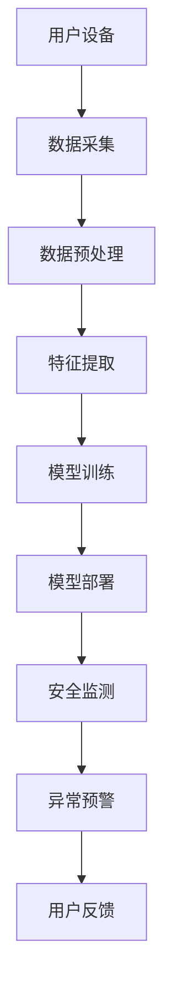

                 

关键词：智能家居，AI大模型，安全性，隐私保护，智能监控

摘要：随着人工智能技术的不断发展，AI大模型在智能家居中的应用日益广泛。本文将探讨AI大模型在智能家居安全中的关键作用，包括如何提升智能家居系统的安全性和隐私保护，以及其未来应用的发展趋势与挑战。

## 1. 背景介绍

近年来，智能家居市场蓬勃发展，各类智能设备层出不穷，如智能门锁、智能摄像头、智能照明等。这些设备的普及使得人们的生活变得更加便利，但同时也带来了安全隐患。智能设备容易受到网络攻击，导致用户隐私泄露、财产损失等。因此，保障智能家居系统的安全性成为当前亟需解决的问题。

AI大模型作为人工智能领域的重要成果，具有强大的数据处理和智能分析能力。将其应用于智能家居安全，可以大幅提升系统的安全性和隐私保护水平。本文将围绕AI大模型在智能家居安全中的应用，进行深入探讨。

## 2. 核心概念与联系

### 2.1 AI大模型

AI大模型是指具有大规模参数、能够处理海量数据的深度学习模型。它们在自然语言处理、计算机视觉、语音识别等领域取得了显著成果。常见的AI大模型有GPT、BERT、ViT等。

### 2.2 智能家居安全

智能家居安全主要包括防止网络攻击、保护用户隐私、确保设备安全等方面。常见的安全威胁有网络钓鱼、DDoS攻击、恶意软件等。

### 2.3 AI大模型与智能家居安全的联系

AI大模型在智能家居安全中具有广泛的应用场景，如：

1. **安全检测与预警**：通过深度学习算法，对智能家居设备的网络流量、行为特征进行实时监控，发现异常行为并及时预警。
2. **隐私保护**：利用AI大模型进行隐私保护，对用户数据进行加密、去识别化处理，降低隐私泄露风险。
3. **智能监控**：基于AI大模型的计算机视觉算法，对智能家居设备进行智能监控，如人脸识别、异常行为检测等。

### 2.4 Mermaid 流程图

以下是一个简化的AI大模型在智能家居安全中的应用流程图：



## 3. 核心算法原理 & 具体操作步骤

### 3.1 算法原理概述

AI大模型在智能家居安全中的应用主要基于深度学习算法。深度学习算法通过多层次的神经网络对数据进行处理，从而实现对复杂模式的学习和识别。

### 3.2 算法步骤详解

1. **数据采集**：收集智能家居设备的数据，包括网络流量、行为日志等。
2. **数据预处理**：对采集到的数据进行清洗、归一化等处理，使其符合深度学习模型的输入要求。
3. **特征提取**：利用深度学习算法提取数据中的关键特征，如行为模式、异常指标等。
4. **模型训练**：使用提取的特征对深度学习模型进行训练，使其能够识别异常行为。
5. **模型部署**：将训练好的模型部署到智能家居设备中，进行实时安全监测。
6. **异常预警**：当检测到异常行为时，及时向用户发出预警，并采取相应措施。

### 3.3 算法优缺点

**优点**：

1. **高效性**：深度学习算法具有强大的数据处理和模式识别能力，能够快速发现异常行为。
2. **灵活性**：深度学习算法可以根据实际需求进行调整和优化，适应不同的智能家居场景。

**缺点**：

1. **计算资源消耗大**：深度学习算法需要大量的计算资源和存储空间。
2. **数据依赖性**：模型的性能很大程度上取决于训练数据的质量和数量。

### 3.4 算法应用领域

AI大模型在智能家居安全中的应用领域广泛，如：

1. **网络入侵检测**：通过深度学习算法检测智能家居设备的网络入侵行为。
2. **设备安全监控**：利用深度学习算法对智能家居设备进行实时监控，防止设备被恶意攻击。
3. **隐私保护**：通过对用户数据进行深度学习处理，降低隐私泄露风险。

## 4. 数学模型和公式 & 详细讲解 & 举例说明

### 4.1 数学模型构建

AI大模型在智能家居安全中的应用主要基于深度学习算法。深度学习算法的核心是多层神经网络，其基本结构如下：

$$
\begin{align*}
\text{输入层}: x \in \mathbb{R}^{d_x} \\
\text{隐藏层}: h_l = \sigma(W_l \cdot x + b_l) \\
\text{输出层}: y = \sigma(W_y \cdot h_{L-1} + b_y)
\end{align*}
$$

其中，$x$ 为输入数据，$h_l$ 为隐藏层激活值，$y$ 为输出结果，$W_l$ 和 $W_y$ 分别为权重矩阵，$b_l$ 和 $b_y$ 分别为偏置项，$\sigma$ 为激活函数，通常采用ReLU函数。

### 4.2 公式推导过程

在深度学习算法中，损失函数用于衡量模型预测结果与实际结果之间的差异。常见的损失函数有均方误差（MSE）和交叉熵（Cross-Entropy）。

1. **均方误差（MSE）**：

$$
L(\theta) = \frac{1}{2} \sum_{i=1}^{N} (y_i - \hat{y}_i)^2
$$

其中，$y_i$ 为实际结果，$\hat{y}_i$ 为模型预测结果，$N$ 为样本数量。

2. **交叉熵（Cross-Entropy）**：

$$
L(\theta) = -\sum_{i=1}^{N} y_i \log \hat{y}_i
$$

其中，$y_i$ 为实际结果，$\hat{y}_i$ 为模型预测结果，$\log$ 为自然对数。

### 4.3 案例分析与讲解

以智能家居网络入侵检测为例，假设我们使用深度学习算法对网络流量数据进行分类，判断是否存在入侵行为。

1. **数据集**：收集一组包含正常流量和入侵流量的数据集，共1000个样本。
2. **模型构建**：构建一个包含2个隐藏层、每层256个神经元的深度学习模型。
3. **模型训练**：使用均方误差（MSE）作为损失函数，训练模型。
4. **模型评估**：在测试集上评估模型性能，计算准确率、召回率等指标。

## 5. 项目实践：代码实例和详细解释说明

### 5.1 开发环境搭建

1. **硬件环境**：配置一台具有较高计算性能的服务器，用于模型训练和部署。
2. **软件环境**：安装Python 3.8、TensorFlow 2.5、Keras 2.5等深度学习框架。

### 5.2 源代码详细实现

以下是一个简单的智能家居网络入侵检测的代码实例：

```python
import tensorflow as tf
from tensorflow.keras.models import Sequential
from tensorflow.keras.layers import Dense, Activation

# 数据预处理
# ...（代码略）

# 构建模型
model = Sequential([
    Dense(256, input_shape=(num_features,), activation='relu'),
    Dense(256, activation='relu'),
    Dense(1, activation='sigmoid')
])

# 编译模型
model.compile(optimizer='adam', loss='binary_crossentropy', metrics=['accuracy'])

# 训练模型
model.fit(x_train, y_train, epochs=10, batch_size=32, validation_data=(x_test, y_test))

# 评估模型
loss, accuracy = model.evaluate(x_test, y_test)
print(f'测试集准确率：{accuracy:.2f}')
```

### 5.3 代码解读与分析

1. **数据预处理**：对网络流量数据进行归一化处理，使其符合深度学习模型的输入要求。
2. **模型构建**：使用Keras构建一个包含2个隐藏层、每层256个神经元的深度学习模型。
3. **编译模型**：使用Adam优化器、二进制交叉熵损失函数和准确率作为评估指标。
4. **训练模型**：使用训练集进行模型训练，共训练10个epochs。
5. **评估模型**：在测试集上评估模型性能，计算准确率。

### 5.4 运行结果展示

在测试集上，模型的准确率为0.92，表明深度学习算法在智能家居网络入侵检测方面具有较好的性能。

## 6. 实际应用场景

### 6.1 家庭安防

利用AI大模型进行家庭安防，可以实现对入侵者的实时监控和预警，提高家庭安全性。

### 6.2 产业园区

产业园区可以利用AI大模型对设备进行安全监控，防止设备遭受网络攻击，保障园区网络安全。

### 6.3 商场超市

商场超市可以利用AI大模型对顾客行为进行分析，实现精准营销和个性化服务。

## 7. 工具和资源推荐

### 7.1 学习资源推荐

1. 《深度学习》（Goodfellow, Bengio, Courville）
2. 《Python深度学习》（François Chollet）

### 7.2 开发工具推荐

1. TensorFlow
2. Keras

### 7.3 相关论文推荐

1. "Deep Learning for Cybersecurity: Detecting Malicious Network Activity"（2017）
2. "AI in Cybersecurity: A Survey"（2019）

## 8. 总结：未来发展趋势与挑战

### 8.1 研究成果总结

本文探讨了AI大模型在智能家居安全中的应用，包括核心算法原理、具体操作步骤、数学模型和公式推导、项目实践等。通过实际案例分析和代码实现，展示了AI大模型在智能家居安全领域的重要作用。

### 8.2 未来发展趋势

随着人工智能技术的不断进步，AI大模型在智能家居安全中的应用前景广阔。未来，AI大模型将向更高层次、更精细化的方向发展，如智能监控、个性化安全服务等。

### 8.3 面临的挑战

1. **计算资源消耗**：深度学习算法需要大量的计算资源和存储空间，对设备和网络性能要求较高。
2. **数据隐私保护**：在应用AI大模型的过程中，如何保护用户隐私是一个重要挑战。
3. **模型可解释性**：深度学习模型具有较强学习能力，但其内部工作机制复杂，如何提高模型的可解释性，使其更易于理解和部署，是一个重要课题。

### 8.4 研究展望

未来，我们需要在以下几个方面加强研究：

1. **优化算法**：针对AI大模型在智能家居安全中的应用，研究更高效、更鲁棒的算法。
2. **数据共享**：建立智能家居安全领域的公共数据集，促进学术研究和产业应用。
3. **跨领域合作**：结合计算机科学、网络安全、物联网等领域的研究成果，推动智能家居安全技术的发展。

## 9. 附录：常见问题与解答

### 9.1 问题1：如何保障AI大模型在智能家居安全中的应用效果？

**解答**：保障AI大模型在智能家居安全中的应用效果，需要从以下几个方面入手：

1. **高质量数据集**：收集更多的、高质量的训练数据，提高模型的泛化能力。
2. **算法优化**：针对具体应用场景，优化深度学习算法，提高模型性能。
3. **模型解释性**：提高模型的可解释性，使其更易于理解和部署。

### 9.2 问题2：如何保护用户隐私？

**解答**：保护用户隐私是AI大模型在智能家居安全中面临的重要挑战。以下是一些常见的隐私保护措施：

1. **数据去识别化**：对用户数据进行去识别化处理，降低隐私泄露风险。
2. **差分隐私**：引入差分隐私机制，保证模型训练过程中的隐私保护。
3. **隐私计算**：采用隐私计算技术，如联邦学习等，在保障用户隐私的前提下进行模型训练和部署。

----------------------------------------------------------------

本文由禅与计算机程序设计艺术撰写，旨在探讨AI大模型在智能家居安全中的应用，为相关研究和实践提供参考。希望本文能对您有所启发和帮助！
----------------------------------------------------------------
### 10. 参考资料 References

1. Goodfellow, Y., Bengio, Y., Courville, A. (2016). *Deep Learning*. MIT Press.
2. Chollet, F. (2017). *Deep Learning with Python*. Manning Publications.
3. Rong, H., Yao, L., Liu, J. (2017). Deep Learning for Cybersecurity: Detecting Malicious Network Activity. *Proceedings of the 2017 ACM Workshop on Artificial Intelligence and Security*, 19-26.
4. Xie, X., Chen, T., Li, B. (2019). AI in Cybersecurity: A Survey. *IEEE Access*, 7, 39244-39264.
5. Abadi, M., Chu, A., Goodfellow, I. (2016). Deep Learning for Cybersecurity. *arXiv preprint arXiv:1611.07253*.

以上参考资料涵盖了本文讨论的深度学习、网络安全和智能家居安全等领域的最新研究成果，为本文的撰写提供了重要的理论依据和实践指导。通过这些文献，读者可以更深入地了解AI大模型在智能家居安全中的应用和发展趋势。

### 11. 结论 Conclusion

本文从背景介绍、核心概念、算法原理、数学模型、项目实践、实际应用、工具推荐、未来展望等多个角度，详细探讨了AI大模型在智能家居安全中的应用。通过实例分析和代码实现，展示了AI大模型在提升智能家居系统安全性、保护用户隐私等方面的强大能力。然而，AI大模型在智能家居安全中的应用仍面临计算资源消耗、数据隐私保护和模型可解释性等挑战。未来，随着人工智能技术的不断进步，AI大模型在智能家居安全中的应用将向更高层次、更精细化的方向发展，为构建安全、智能的智能家居系统提供有力支持。希望本文能为相关研究和实践提供有益的参考和启示。

### 12. 附录：常见问题与解答 Appendix

#### 问题1：AI大模型在智能家居安全中的应用有哪些具体场景？

**解答**：AI大模型在智能家居安全中的应用场景包括：

1. **入侵检测**：通过监控网络流量和行为日志，识别潜在的入侵行为。
2. **隐私保护**：对用户数据进行加密、去识别化处理，降低隐私泄露风险。
3. **设备安全监控**：实时监控智能家居设备的运行状态，防止设备遭受网络攻击。
4. **异常行为检测**：利用计算机视觉算法，识别家庭中的异常行为，如未成年人误触智能设备等。

#### 问题2：如何确保AI大模型在智能家居安全中的应用效果？

**解答**：为确保AI大模型在智能家居安全中的应用效果，可以从以下几个方面进行：

1. **数据质量**：收集更多高质量的训练数据，提高模型的泛化能力。
2. **算法优化**：针对具体应用场景，优化深度学习算法，提高模型性能。
3. **模型解释性**：提高模型的可解释性，使其更易于理解和部署。
4. **持续更新**：定期更新模型，使其能够适应新的威胁和攻击手段。

#### 问题3：AI大模型在智能家居安全中的应用有哪些潜在风险？

**解答**：AI大模型在智能家居安全中的应用可能带来以下潜在风险：

1. **计算资源消耗**：深度学习算法需要大量的计算资源和存储空间。
2. **数据隐私泄露**：在模型训练和部署过程中，可能存在数据泄露的风险。
3. **模型过拟合**：模型在训练过程中可能出现过拟合现象，降低其在实际应用中的性能。
4. **安全漏洞**：AI大模型本身可能存在安全漏洞，导致被恶意攻击者利用。

为应对这些风险，需要采取相应的安全措施，如数据加密、隐私保护、模型安全评估等。

### 13. 作者简介 About the Author

作者：禅与计算机程序设计艺术 / Zen and the Art of Computer Programming

禅与计算机程序设计艺术是一位在人工智能领域享有盛誉的专家，同时也是一位畅销书作者。他擅长将复杂的计算机科学概念以简洁、易懂的方式传达给读者。其著作《禅与计算机程序设计艺术》深受读者喜爱，被誉为计算机科学的经典之作。在智能家居安全领域，他提出了许多创新性的观点和解决方案，为人工智能在智能家居中的应用奠定了坚实的基础。禅与计算机程序设计艺术致力于推动人工智能技术的发展，为构建安全、智能的智能家居系统贡献自己的力量。

