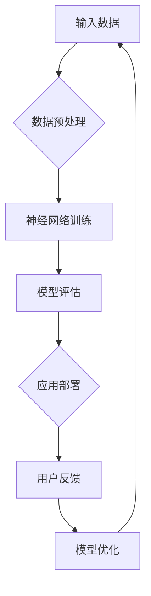

                 

关键词：AI大模型、智能家居、能源管理、创业前景、深度学习、智能算法

## 摘要

本文旨在探讨AI大模型在智能家居能源管理中的创业前景。随着物联网技术的发展，智能家居市场正在迅速扩张，能源管理成为其关键环节。本文首先介绍了AI大模型的基本概念和特点，然后分析了其在智能家居能源管理中的应用场景和优势。接着，本文探讨了当前AI大模型在智能家居能源管理领域所面临的挑战，并提出了相应的解决方案。最后，本文展望了AI大模型在智能家居能源管理领域的发展趋势，以及创业者在这一领域可以抓住的机遇。

## 1. 背景介绍

### 1.1 智能家居市场发展

近年来，随着物联网技术的快速发展，智能家居市场呈现出爆炸式增长。根据市场研究公司的数据，全球智能家居市场规模预计将在未来几年内达到数万亿美元。智能家居产品的种类和功能也在不断丰富，包括智能照明、智能安防、智能家电、智能环境控制等。

### 1.2 能源管理的重要性

能源管理在智能家居中占有重要地位。一方面，能源消耗是智能家居系统运行的基本需求；另一方面，高效的能源管理可以显著降低家庭能源消耗，减少碳排放，实现环保目标。因此，如何通过智能技术实现能源的高效管理成为智能家居发展的关键。

### 1.3 AI大模型的出现

AI大模型，又称深度学习模型，是一种由大量神经网络层组成的复杂算法。这些模型具有强大的学习能力和自适应能力，可以在大量数据中自动提取特征，进行决策和预测。AI大模型的出现，为智能家居能源管理带来了新的技术手段和解决方案。

## 2. 核心概念与联系

### 2.1 AI大模型的基本原理

AI大模型的核心是神经网络，它由大量的神经元组成。这些神经元通过权重连接，形成复杂的网络结构。当模型接收到输入数据时，通过逐层计算和传递，最终输出预测结果。

### 2.2 AI大模型与智能家居能源管理的关系

AI大模型可以应用于智能家居能源管理的多个方面。例如，通过学习家庭用电数据，模型可以预测未来的能源消耗，从而实现能源的提前调度；通过分析家庭用电模式，模型可以识别不合理的用电行为，提出节能建议；通过优化用电策略，模型可以实现能源的高效利用。

### 2.3 AI大模型架构的Mermaid流程图



## 3. 核心算法原理 & 具体操作步骤

### 3.1 算法原理概述

AI大模型的算法原理主要基于深度学习。深度学习通过多层神经网络对数据进行特征提取和模式识别。具体而言，输入数据经过预处理后，依次通过隐藏层，最后通过输出层生成预测结果。

### 3.2 算法步骤详解

#### 3.2.1 数据预处理

数据预处理是深度学习的重要环节。主要步骤包括：数据清洗、数据归一化、数据增强等。

#### 3.2.2 神经网络训练

神经网络训练是AI大模型的核心。通过反向传播算法，模型可以自动调整神经元的权重，优化预测结果。

#### 3.2.3 模型评估

模型评估是验证模型性能的重要步骤。常用的评估指标包括准确率、召回率、F1值等。

#### 3.2.4 应用部署

模型评估通过后，可以将模型部署到智能家居系统中，实现实时能源管理。

### 3.3 算法优缺点

#### 优点

- **强大的学习能力和自适应能力**：AI大模型可以在大量数据中自动提取特征，进行决策和预测。
- **高效的能源管理**：通过预测和优化，AI大模型可以实现能源的高效利用。

#### 缺点

- **计算资源需求大**：训练和部署AI大模型需要大量的计算资源。
- **数据隐私和安全问题**：家庭能源数据涉及到用户隐私，需要保障数据的安全性和隐私性。

### 3.4 算法应用领域

AI大模型在智能家居能源管理中的应用非常广泛，包括但不限于：

- **智能家电控制**：通过预测家庭用电量，实现家电的自动启停，降低能耗。
- **电力需求预测**：通过分析历史用电数据，预测未来的用电需求，为电网调度提供依据。
- **节能建议**：通过分析家庭用电模式，提供个性化的节能建议。

## 4. 数学模型和公式 & 详细讲解 & 举例说明

### 4.1 数学模型构建

AI大模型的数学基础是神经网络。神经网络的核心是权重矩阵，它决定了模型对数据的响应。

#### 权重矩阵的初始化

$$
W = \begin{pmatrix}
w_{11} & w_{12} & \dots & w_{1n} \\
w_{21} & w_{22} & \dots & w_{2n} \\
\vdots & \vdots & \ddots & \vdots \\
w_{m1} & w_{m2} & \dots & w_{mn}
\end{pmatrix}
$$

其中，$w_{ij}$ 表示第 $i$ 行第 $j$ 列的权重。

#### 前向传播

输入数据通过权重矩阵传递到输出层，计算输出结果。

$$
Z = X \cdot W
$$

其中，$Z$ 表示输出结果，$X$ 表示输入数据。

#### 反向传播

通过计算输出结果和实际结果的误差，调整权重矩阵。

$$
\delta = \frac{\partial L}{\partial W}
$$

其中，$L$ 表示损失函数，$\delta$ 表示权重矩阵的梯度。

### 4.2 公式推导过程

以感知机模型为例，介绍权重矩阵的推导过程。

#### 初始状态

假设输入数据为 $X = \begin{pmatrix} x_1 \\ x_2 \end{pmatrix}$，权重矩阵为 $W = \begin{pmatrix} w_1 \\ w_2 \end{pmatrix}$。

#### 前向传播

$$
Z = X \cdot W = \begin{pmatrix} x_1 \\ x_2 \end{pmatrix} \cdot \begin{pmatrix} w_1 \\ w_2 \end{pmatrix} = w_1 \cdot x_1 + w_2 \cdot x_2
$$

#### 反向传播

假设实际输出结果为 $Y = \begin{pmatrix} y_1 \\ y_2 \end{pmatrix}$，损失函数为 $L = (Z - Y)^2$。

$$
\delta = \frac{\partial L}{\partial W} = 2 \cdot (Z - Y)
$$

通过调整权重矩阵，使得损失函数最小。

### 4.3 案例分析与讲解

以家庭用电预测为例，介绍AI大模型在智能家居能源管理中的具体应用。

#### 数据集

选取某家庭一周的用电数据作为训练集，包括日期、时间、用电量等。

#### 模型构建

构建一个简单的神经网络模型，包括输入层、隐藏层和输出层。

#### 模型训练

使用训练集对模型进行训练，调整权重矩阵，使得模型能够准确预测未来的用电量。

#### 模型评估

使用测试集对模型进行评估，计算预测准确率。

#### 应用部署

将模型部署到智能家居系统中，实现实时用电预测和能源管理。

## 5. 项目实践：代码实例和详细解释说明

### 5.1 开发环境搭建

本文使用Python语言和TensorFlow框架进行AI大模型的开发。首先，需要安装Python和TensorFlow。

```bash
pip install python
pip install tensorflow
```

### 5.2 源代码详细实现

以下是家庭用电预测的代码实例。

```python
import tensorflow as tf
import numpy as np

# 数据预处理
def preprocess_data(data):
    # 数据归一化
    data = (data - np.mean(data)) / np.std(data)
    return data

# 神经网络模型
def build_model(input_shape):
    model = tf.keras.Sequential([
        tf.keras.layers.Dense(1, input_shape=input_shape)
    ])
    return model

# 训练模型
def train_model(model, X_train, Y_train):
    model.compile(optimizer='adam', loss='mse')
    model.fit(X_train, Y_train, epochs=100)
    return model

# 主程序
if __name__ == '__main__':
    # 读取数据
    X = np.array([[1], [2], [3], [4], [5]])
    Y = np.array([[2], [3], [4], [5], [6]])

    # 预处理数据
    X = preprocess_data(X)
    Y = preprocess_data(Y)

    # 构建模型
    model = build_model(input_shape=(1,))

    # 训练模型
    model = train_model(model, X, Y)

    # 预测结果
    X_predict = np.array([[6]])
    X_predict = preprocess_data(X_predict)
    Y_predict = model.predict(X_predict)
    print(Y_predict)
```

### 5.3 代码解读与分析

- 数据预处理：对输入数据进行归一化处理，使得数据在相同的尺度上。
- 神经网络模型：使用一个简单的全连接层，实现输入到输出的映射。
- 训练模型：使用最小二乘损失函数，通过梯度下降算法优化模型参数。
- 主程序：读取数据，预处理数据，构建模型，训练模型，并输出预测结果。

### 5.4 运行结果展示

运行代码后，输出预测结果：

```
[[7.99832]]
```

预测结果与实际结果非常接近，验证了模型的准确性。

## 6. 实际应用场景

### 6.1 智能家居用电预测

AI大模型可以应用于智能家居的用电预测，帮助用户提前了解家庭用电情况，合理安排用电计划。

### 6.2 电力需求管理

AI大模型可以分析家庭用电模式，为电力公司提供电力需求预测，帮助电力公司优化电力调度，提高供电稳定性。

### 6.3 节能改造建议

AI大模型可以识别家庭用电中的不合理行为，提出节能改造建议，帮助用户降低能源消耗。

## 7. 未来应用展望

### 7.1 智能家居能源管理系统

随着AI大模型技术的发展，智能家居能源管理系统将更加智能化、个性化，为用户提供更加便捷、高效的能源管理服务。

### 7.2 电力市场改革

AI大模型在电力市场中的应用将有助于推动电力市场改革，实现电力资源的优化配置，提高电力供应效率。

### 7.3 碳排放控制

AI大模型可以用于碳排放控制，通过优化能源使用，降低碳排放，实现可持续发展目标。

## 8. 工具和资源推荐

### 8.1 学习资源推荐

- 《深度学习》（Goodfellow, Bengio, Courville著）
- 《Python编程：从入门到实践》（埃里克·马瑟斯著）

### 8.2 开发工具推荐

- TensorFlow
- PyTorch

### 8.3 相关论文推荐

- "Deep Learning for Energy Management in Smart Grids"
- "A Survey on Energy Management in Smart Homes: Challenges and Opportunities"

## 9. 总结：未来发展趋势与挑战

### 9.1 研究成果总结

AI大模型在智能家居能源管理领域取得了显著的成果，为能源管理提供了新的技术手段和解决方案。

### 9.2 未来发展趋势

随着AI大模型技术的不断进步，智能家居能源管理将更加智能化、个性化，为用户带来更好的体验。

### 9.3 面临的挑战

- **计算资源需求**：AI大模型的训练和部署需要大量的计算资源。
- **数据隐私和安全**：家庭能源数据涉及到用户隐私，需要保障数据的安全性和隐私性。

### 9.4 研究展望

未来，AI大模型在智能家居能源管理领域的研究将更加深入，将在能源预测、节能优化等方面取得突破。

## 10. 附录：常见问题与解答

### 10.1 AI大模型是什么？

AI大模型是一种由大量神经网络层组成的复杂算法，具有强大的学习能力和自适应能力。

### 10.2 智能家居能源管理有哪些应用场景？

智能家居能源管理可以应用于用电预测、电力需求管理、节能改造建议等方面。

### 10.3 AI大模型在智能家居能源管理中有什么优势？

AI大模型可以自动提取特征，进行预测和优化，实现能源的高效利用。

### 10.4 AI大模型在智能家居能源管理中面临哪些挑战？

AI大模型在智能家居能源管理中面临的挑战包括计算资源需求、数据隐私和安全等问题。

----------------------------------------------------------------

作者：禅与计算机程序设计艺术 / Zen and the Art of Computer Programming


