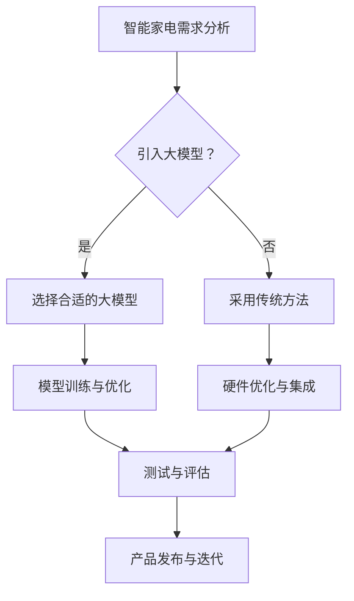

                 

关键词：人工智能，大模型，智能家电，产品创新，用户体验，智能家居，技术架构，硬件集成，软件优化，性能评估，案例研究。

> 摘要：本文深入探讨了人工智能大模型在智能家电产品创新中的应用，分析了其在提高用户体验、降低开发成本、优化硬件性能等方面的关键作用。通过案例分析，探讨了现有技术挑战和未来的发展方向。

## 1. 背景介绍

随着人工智能技术的迅速发展，智能家电已经成为智能家居领域的一个重要组成部分。智能家电通过互联网连接，可以实现远程控制、自动调节等功能，极大地提升了用户的生活质量和便利性。然而，目前智能家电产品的开发面临着诸多挑战，如用户体验不一致、开发成本高、硬件性能不稳定等问题。

人工智能大模型作为一种先进的算法，具有处理复杂数据、自动学习调整的特点。其被广泛应用于自然语言处理、图像识别、语音识别等领域，显著提升了相关领域的效率和准确性。将人工智能大模型应用于智能家电产品创新，有望解决上述问题，推动智能家电产业的进一步发展。

## 2. 核心概念与联系

### 2.1 人工智能大模型

人工智能大模型是指具有亿级参数规模、能在多种任务上取得优异性能的深度学习模型。如BERT、GPT、ViT等模型，在各自的领域内展示了强大的能力。

### 2.2 智能家电产品创新

智能家电产品创新涉及硬件设计、软件开发、用户体验设计等多个方面。通过引入人工智能大模型，可以实现智能决策、个性化推荐、自适应调节等功能。

### 2.3 Mermaid 流程图



## 3. 核心算法原理 & 具体操作步骤

### 3.1 算法原理概述

人工智能大模型的核心原理是基于深度学习的多层神经网络结构。通过大量数据的学习，模型能够自动提取特征，进行分类、预测等任务。具体到智能家电产品创新中，大模型可以用于用户行为预测、环境参数监测、设备故障诊断等。

### 3.2 算法步骤详解

1. **需求分析**：明确智能家电产品的功能和性能要求。
2. **数据收集**：收集与智能家电相关的数据，包括用户行为数据、环境参数数据、设备状态数据等。
3. **模型选择**：根据任务需求选择合适的大模型，如BERT、GPT等。
4. **模型训练**：使用收集到的数据进行模型训练，调整模型参数，提高性能。
5. **模型优化**：通过模型调优，进一步提升模型在智能家电任务上的表现。
6. **测试与评估**：对模型进行测试，评估其在实际应用中的性能。
7. **产品发布**：将训练好的模型应用于智能家电产品，进行发布和迭代。

### 3.3 算法优缺点

**优点**：
- 高效处理大量数据，提高决策准确性。
- 自动提取特征，降低人工干预。
- 可以应用于多种任务，具有灵活性。

**缺点**：
- 需要大量数据和计算资源，成本较高。
- 模型训练时间较长，实时性较低。
- 模型对数据质量和数量有较高要求，可能引入偏差。

### 3.4 算法应用领域

人工智能大模型在智能家电中的应用领域广泛，包括但不限于：
- 用户行为预测：如智能空调根据用户行为调节温度。
- 环境监测：如智能空气净化器根据空气质量自动调节风速。
- 故障诊断：如智能洗衣机根据设备状态自动检测故障。

## 4. 数学模型和公式 & 详细讲解 & 举例说明

### 4.1 数学模型构建

在智能家电产品创新中，常用的数学模型包括回归模型、分类模型、聚类模型等。以下以回归模型为例进行讲解。

$$
y = \theta_0 + \theta_1 x_1 + \theta_2 x_2 + ... + \theta_n x_n
$$

其中，$y$ 是目标变量，$x_1, x_2, ..., x_n$ 是输入特征，$\theta_0, \theta_1, ..., \theta_n$ 是模型参数。

### 4.2 公式推导过程

回归模型的推导过程基于最小二乘法。假设有 $n$ 个训练样本，目标是最小化损失函数：

$$
J(\theta) = \frac{1}{2n} \sum_{i=1}^{n} (y_i - \theta_0 - \theta_1 x_{i1} - ... - \theta_n x_{in})^2
$$

对 $J(\theta)$ 关于 $\theta_0, \theta_1, ..., \theta_n$ 分别求偏导数，并令其等于0，得到：

$$
\frac{\partial J(\theta)}{\partial \theta_j} = 0
$$

通过解上述方程组，可以求得模型参数 $\theta_0, \theta_1, ..., \theta_n$。

### 4.3 案例分析与讲解

以智能空调为例，假设用户在一天内的温度设置（输入特征）为 $x_1, x_2, ..., x_n$，空调实际温度（目标变量）为 $y$。通过回归模型预测用户舒适温度，并优化空调设置。

1. **数据收集**：收集用户一天内的温度设置和历史温度数据。
2. **模型训练**：使用收集到的数据进行回归模型训练。
3. **模型优化**：通过交叉验证和超参数调整，优化模型性能。
4. **预测与优化**：使用训练好的模型预测用户舒适温度，并调节空调设置。

## 5. 项目实践：代码实例和详细解释说明

### 5.1 开发环境搭建

开发环境选择Python，使用TensorFlow作为深度学习框架。

```bash
pip install tensorflow numpy pandas matplotlib
```

### 5.2 源代码详细实现

以下是一个简单的回归模型实现：

```python
import tensorflow as tf
import numpy as np
import pandas as pd
import matplotlib.pyplot as plt

# 加载数据
data = pd.read_csv('data.csv')
x = data.iloc[:, 0].values
y = data.iloc[:, 1].values

# 模型构建
model = tf.keras.Sequential([
    tf.keras.layers.Dense(units=1, input_shape=[1])
])

# 模型编译
model.compile(optimizer='sgd', loss='mean_squared_error')

# 模型训练
model.fit(x, y, epochs=100)

# 模型预测
predictions = model.predict(x)

# 绘制结果
plt.scatter(x, y)
plt.plot(x, predictions, color='red')
plt.show()
```

### 5.3 代码解读与分析

1. **数据加载**：使用pandas读取数据，分离输入特征和目标变量。
2. **模型构建**：使用TensorFlow构建一个简单的线性回归模型。
3. **模型编译**：选择优化器和损失函数，准备模型训练。
4. **模型训练**：使用fit方法训练模型。
5. **模型预测**：使用predict方法进行预测。
6. **结果可视化**：使用matplotlib绘制预测结果。

## 6. 实际应用场景

### 6.1 用户行为预测

通过人工智能大模型，可以预测用户的行为模式，如用电量、用水量等。这些预测结果可以用于优化能源管理、提高资源利用效率。

### 6.2 设备故障诊断

人工智能大模型可以用于智能家电的故障诊断，如智能冰箱的制冷系统故障检测。通过实时监测设备状态数据，模型可以预测可能的故障，提前进行维护，减少停机时间。

### 6.3 个性化推荐

在智能家居场景中，人工智能大模型可以用于个性化推荐，如推荐用户喜欢的音乐、电影等。通过分析用户的历史行为数据，模型可以提供更加个性化的服务。

## 7. 未来应用展望

随着人工智能技术的不断进步，人工智能大模型在智能家电中的应用将会更加广泛。未来，人工智能大模型有望在以下领域取得突破：

### 7.1 能源管理

通过人工智能大模型，可以实现更加智能的能源管理，如自动调节电力负荷，降低能源消耗。

### 7.2 环境保护

人工智能大模型可以用于环境监测和预测，如空气质量预测、气候变化预测等，为环境保护提供科学依据。

### 7.3 健康管理

在智能家居领域，人工智能大模型可以用于健康管理，如监测用户的健康状况，提供健康建议。

## 8. 总结：未来发展趋势与挑战

### 8.1 研究成果总结

人工智能大模型在智能家电中的应用已经取得了显著成果，如提高用户体验、降低开发成本、优化硬件性能等。

### 8.2 未来发展趋势

未来，人工智能大模型在智能家电中的应用将会更加深入和广泛，有望在能源管理、环境保护、健康管理等领域取得突破。

### 8.3 面临的挑战

人工智能大模型在智能家电中的应用还面临一些挑战，如数据隐私保护、计算资源消耗、模型解释性等。

### 8.4 研究展望

未来，需要进一步研究人工智能大模型在智能家电中的应用，解决现有问题，推动智能家居产业的可持续发展。

## 9. 附录：常见问题与解答

### 9.1 人工智能大模型是什么？

人工智能大模型是指具有亿级参数规模、能在多种任务上取得优异性能的深度学习模型。

### 9.2 人工智能大模型在智能家电中的应用有哪些？

人工智能大模型可以应用于用户行为预测、设备故障诊断、个性化推荐等领域。

### 9.3 如何选择合适的人工智能大模型？

选择合适的人工智能大模型需要根据任务需求和数据特点进行综合考虑。

### 9.4 人工智能大模型的计算资源需求如何？

人工智能大模型需要大量的计算资源，包括CPU、GPU等。

### 9.5 人工智能大模型的隐私保护如何实现？

可以通过数据加密、匿名化等技术手段实现人工智能大模型的隐私保护。

## 作者署名

作者：禅与计算机程序设计艺术 / Zen and the Art of Computer Programming
----------------------------------------------------------------

