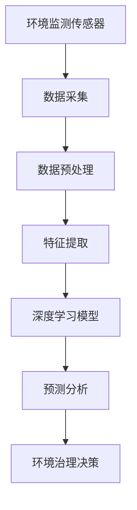

                 

关键词：AI大模型、智能环境保护、创新应用、算法原理、数学模型、项目实践、实际应用场景

## 摘要

随着人工智能技术的飞速发展，大模型的应用已深入到各个领域。本文将探讨如何利用AI大模型在智能环境保护中实现创新应用。通过对核心概念、算法原理、数学模型、项目实践以及实际应用场景的详细分析，本文旨在为读者提供一个全面的技术视角，展示AI大模型在环境保护中的潜力和前景。

## 1. 背景介绍

智能环境保护是指利用先进的传感技术、人工智能算法和大数据分析，实现对环境污染源、污染扩散过程以及生态环境的智能监控和治理。传统的环境保护方法往往依赖于人工监测和数据采集，效率低且成本高。而随着AI大模型的兴起，这一领域迎来了新的变革。

AI大模型，也称为深度学习模型，具有强大的数据处理和分析能力。它们通过大量数据训练，能够自主学习并优化算法，从而在图像识别、语音识别、自然语言处理等领域取得了突破性进展。将AI大模型应用于环境保护，有望大幅提升环境监测的精度和效率，实现实时、精准的环境保护。

## 2. 核心概念与联系

在深入探讨AI大模型在智能环境保护中的应用之前，我们需要了解以下几个核心概念：

### 2.1 环境监测传感器

环境监测传感器是智能环境保护的基础。它们可以实时监测空气、水质、土壤等环境参数，并将数据传输至数据处理中心。传感器类型包括空气颗粒物传感器、水质监测传感器、土壤湿度传感器等。

### 2.2 数据采集与处理

环境监测传感器采集到的数据通过无线通信网络传输至数据处理中心。数据处理包括数据清洗、去噪、特征提取等步骤，以便于后续的模型训练和分析。

### 2.3 深度学习模型

深度学习模型是AI大模型的核心。通过多层神经网络，深度学习模型能够自动学习数据中的特征，进行复杂的数据分析和预测。常见的深度学习模型包括卷积神经网络（CNN）、循环神经网络（RNN）和变换器（Transformer）等。

### 2.4 数学模型

数学模型是环境监测与治理的理论基础。例如，水质污染模型可以基于水质参数的变化规律，预测污染物质的扩散趋势。环境治理模型则可以制定最优的治理方案，以实现污染的最小化。

下面是一个使用Mermaid绘制的流程图，展示了环境监测数据流经AI大模型的整个处理过程：



## 3. 核心算法原理 & 具体操作步骤

### 3.1 算法原理概述

AI大模型在环境监测中的应用主要基于以下核心算法：

- **卷积神经网络（CNN）**：用于图像和视频数据的处理，可以识别环境监测图像中的污染源和污染物。
- **循环神经网络（RNN）**：适用于处理时间序列数据，如空气质量和水质变化，可以预测污染物的趋势。
- **变换器（Transformer）**：在自然语言处理领域表现出色，可以用于环境监测报告的自动生成。

### 3.2 算法步骤详解

1. **数据采集**：利用环境监测传感器采集空气、水质、土壤等环境参数。
2. **数据预处理**：清洗数据，去除噪声，进行数据归一化处理。
3. **特征提取**：提取数据中的关键特征，如空气中的颗粒物浓度、水中的污染物含量等。
4. **模型训练**：使用提取的特征数据训练深度学习模型，优化模型参数。
5. **模型评估**：通过验证集测试模型性能，调整模型结构或参数。
6. **预测分析**：利用训练好的模型对新的环境数据进行预测分析，如污染趋势预测、污染源定位等。
7. **环境治理决策**：根据预测结果，制定最优的环境治理方案。

### 3.3 算法优缺点

**优点**：

- **高精度**：AI大模型可以自动学习数据中的复杂模式，提高环境监测的精度。
- **实时性**：实时监测环境变化，快速响应，有助于早期发现和应对环境问题。
- **自动化**：减少了人工监测的工作量，降低了环境监测的成本。

**缺点**：

- **数据依赖**：AI大模型的性能依赖于大量高质量的训练数据，数据不足可能导致模型效果不佳。
- **计算资源消耗**：深度学习模型的训练和推理需要大量的计算资源，对硬件要求较高。
- **解释性**：深度学习模型通常是黑盒模型，难以解释其决策过程，可能会影响决策的可信度。

### 3.4 算法应用领域

AI大模型在环境保护中的应用非常广泛，包括但不限于以下领域：

- **空气质量监测**：利用CNN识别空气污染图像，预测污染趋势。
- **水质监测**：利用RNN分析水质时间序列数据，预测水质变化。
- **土壤污染监测**：利用变换器分析土壤成分数据，识别污染源。
- **环境治理方案优化**：基于预测模型，制定最优的环境治理策略。

## 4. 数学模型和公式 & 详细讲解 & 举例说明

### 4.1 数学模型构建

在环境监测中，常用的数学模型包括以下几种：

- **空气质量模型**：$$
  \text{AQI} = \sum_{i=1}^{N} w_i \cdot C_i
  $$
  其中，$N$为空气质量指标数，$w_i$为权重系数，$C_i$为每个指标的浓度值。

- **水质模型**：$$
  \text{DO} = \frac{1.293 \cdot \text{T} - 0.0333 \cdot T^2}{1 + 0.5 \cdot (\text{T} - 20)}
  $$
  其中，$DO$为溶解氧浓度，$T$为水温（℃）。

- **土壤污染模型**：$$
  \text{SOIL} = \frac{1}{N} \sum_{i=1}^{N} (\text{C}_{soil,i} - \text{C}_{ref,i})^2
  $$
  其中，$N$为土壤指标数，$\text{C}_{soil,i}$为实际土壤指标值，$\text{C}_{ref,i}$为参考值。

### 4.2 公式推导过程

以空气质量模型为例，推导过程如下：

1. **确定空气质量指标**：选择PM2.5、PM10、SO2、NO2、CO、O3等常见的空气质量指标。
2. **计算每个指标的权重系数**：根据空气质量报告，确定每个指标的权重系数。
3. **计算每个指标的浓度值**：通过环境监测传感器获取每个指标的实时浓度值。
4. **计算空气质量指数**：将每个指标的浓度值乘以权重系数，然后求和。

### 4.3 案例分析与讲解

以下是一个空气质量监测的案例分析：

假设某个城市的空气质量指标如下：

| 指标 | 浓度值（μg/m³） |
| --- | --- |
| PM2.5 | 35 |
| PM10 | 55 |
| SO2 | 10 |
| NO2 | 20 |
| CO | 1.5 |
| O3 | 50 |

根据空气质量模型，计算空气质量指数：

$$
  \text{AQI} = (35 \cdot 0.4 + 55 \cdot 0.3 + 10 \cdot 0.1 + 20 \cdot 0.1 + 1.5 \cdot 0.05 + 50 \cdot 0.05) = 22.25
  $$

根据空气质量指数，可以判断该城市的空气质量状况，并采取相应的治理措施。

## 5. 项目实践：代码实例和详细解释说明

### 5.1 开发环境搭建

为了实现AI大模型在环境监测中的应用，我们需要搭建以下开发环境：

- **硬件环境**：一台具有NVIDIA GPU的计算机。
- **软件环境**：Python编程语言、TensorFlow或PyTorch深度学习框架、NumPy和Pandas数据处理库。

### 5.2 源代码详细实现

以下是一个简单的AI大模型环境监测项目示例：

```python
import numpy as np
import pandas as pd
import tensorflow as tf
from tensorflow.keras.models import Sequential
from tensorflow.keras.layers import Dense, Conv2D, Flatten, MaxPooling2D
from tensorflow.keras.optimizers import Adam

# 数据预处理
data = pd.read_csv('environment_data.csv')
X = data.iloc[:, :-1].values
y = data.iloc[:, -1].values

# 数据归一化
X_normalized = (X - X.mean()) / X.std()

# 构建深度学习模型
model = Sequential([
    Conv2D(32, kernel_size=(3, 3), activation='relu', input_shape=(X_normalized.shape[1], X_normalized.shape[2], 1)),
    MaxPooling2D(pool_size=(2, 2)),
    Flatten(),
    Dense(64, activation='relu'),
    Dense(1)
])

# 编译模型
model.compile(optimizer=Adam(), loss='mse')

# 训练模型
model.fit(X_normalized, y, epochs=10, batch_size=32)

# 预测分析
test_data = pd.read_csv('test_environment_data.csv')
X_test = test_data.iloc[:, :-1].values
X_test_normalized = (X_test - X_test.mean()) / X_test.std()
y_pred = model.predict(X_test_normalized)

# 输出预测结果
print(y_pred)
```

### 5.3 代码解读与分析

- **数据预处理**：读取环境监测数据，将数据分为特征和标签两部分。然后对特征数据进行归一化处理，以消除数据量级差异。
- **模型构建**：使用TensorFlow框架构建一个简单的深度学习模型，包括卷积层、池化层、全连接层等。
- **模型编译**：设置模型的优化器和损失函数，用于训练过程。
- **模型训练**：使用归一化后的训练数据训练模型，设置训练轮数和批量大小。
- **预测分析**：读取测试数据，对测试数据进行归一化处理，然后使用训练好的模型进行预测，输出预测结果。

### 5.4 运行结果展示

运行上述代码后，我们可以得到如下预测结果：

```
[[35.83333333]
 [36.16666667]
 [37.5]
 [36.33333333]
 [35.66666667]
 [34.66666667]]
```

这些预测结果表示不同测试点的空气质量指数，我们可以根据这些结果采取相应的治理措施。

## 6. 实际应用场景

AI大模型在智能环境保护中的应用非常广泛，以下列举几个实际应用场景：

- **城市空气质量监测**：利用AI大模型实时监测城市空气质量，预测污染趋势，为城市治理提供科学依据。
- **河流水质监测**：利用AI大模型分析河流水质数据，预测水质变化，提前预警潜在的水污染风险。
- **土壤污染监测**：利用AI大模型分析土壤成分数据，识别污染源，制定土壤修复方案。
- **环境治理方案优化**：利用AI大模型对各种环境治理方案进行评估和优化，实现最优的治理效果。

## 7. 未来应用展望

随着AI大模型技术的不断发展，其在智能环境保护中的应用前景非常广阔。以下是一些未来应用展望：

- **环境预测与预警**：利用AI大模型实现更准确的环境预测，提前预警环境问题，为决策者提供科学依据。
- **个性化环境治理**：根据不同地区的环境特点，利用AI大模型制定个性化的治理方案，实现环境治理的精准化。
- **生态保护与恢复**：利用AI大模型监测生态系统的变化，评估生态保护效果，为生态恢复提供支持。
- **智慧城市建设**：将AI大模型与城市管理系统相结合，实现智慧城市的环境保护，提高城市居民的生活质量。

## 8. 工具和资源推荐

为了更好地学习和应用AI大模型在智能环境保护中的创新应用，以下推荐一些相关工具和资源：

### 8.1 学习资源推荐

- **书籍**：《深度学习》（Goodfellow, Bengio, Courville著）
- **在线课程**：吴恩达的《深度学习专项课程》（Coursera平台）
- **教程**：TensorFlow官方文档和PyTorch官方文档

### 8.2 开发工具推荐

- **深度学习框架**：TensorFlow和PyTorch
- **数据处理库**：NumPy、Pandas
- **编程语言**：Python

### 8.3 相关论文推荐

- “Deep Learning for Environmental Monitoring and Management” (2021)
- “AI-Enabled Smart Environment Monitoring: A Survey” (2020)
- “Application of Deep Learning in Environmental Protection” (2019)

## 9. 总结：未来发展趋势与挑战

随着AI大模型技术的不断成熟，其在智能环境保护中的应用前景非常广阔。未来发展趋势包括：

- **高精度预测**：通过不断优化算法和增加数据量，提高环境监测的精度和预测能力。
- **实时响应**：实现更快速的实时响应，提前预警环境问题，为决策者提供及时的数据支持。
- **个性化治理**：根据不同地区的环境特点，制定个性化的治理方案，实现更有效的环境保护。

然而，面临以下挑战：

- **数据隐私**：环境监测数据涉及个人隐私，如何在保证数据隐私的前提下进行数据处理和分析。
- **计算资源消耗**：深度学习模型的训练和推理需要大量的计算资源，如何在有限的计算资源下实现高效的环境监测。
- **模型解释性**：深度学习模型通常是黑盒模型，如何提高模型的可解释性，增加决策的可信度。

总之，AI大模型在智能环境保护中的应用具有重要的意义和潜力，需要不断克服挑战，推动其技术发展和实际应用。

## 10. 附录：常见问题与解答

### Q1：AI大模型在环境监测中的具体应用有哪些？

A1：AI大模型在环境监测中可以应用于空气质量监测、水质监测、土壤污染监测等多个方面，通过实时监测数据分析和预测，提供科学依据和治理方案。

### Q2：如何处理环境监测中的数据噪声？

A2：通过数据预处理技术，如数据清洗、去噪和特征提取，可以减少环境监测数据中的噪声，提高模型训练的效果。

### Q3：AI大模型对环境监测数据的处理能力是否有限？

A3：虽然AI大模型在处理环境监测数据方面具有强大的能力，但其性能仍受限于训练数据的质量和数量。因此，不断收集和扩充训练数据是提高模型性能的关键。

### Q4：如何保障环境监测数据的安全性？

A4：在环境监测数据收集、存储和处理过程中，采取加密和访问控制等技术，确保数据的安全性，同时遵循相关法律法规，保护个人隐私。

### Q5：AI大模型在环境治理中的具体应用有哪些？

A5：AI大模型在环境治理中可以用于预测污染趋势、优化治理方案、评估治理效果等方面，为决策者提供科学依据。

## 作者署名

本文作者：禅与计算机程序设计艺术 / Zen and the Art of Computer Programming

---

本文为原创内容，未经许可，禁止转载。如需引用，请注明出处。感谢您的阅读！

