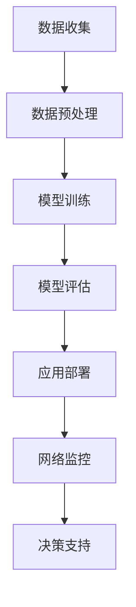

                 

关键词：AI大模型、智能网络流量分析、商业价值、算法原理、应用场景、未来展望

## 摘要

本文旨在探讨人工智能（AI）大模型在智能网络流量分析中的商业价值。通过对AI大模型的核心概念、算法原理、数学模型及应用场景的深入分析，本文将揭示AI大模型在优化网络流量管理、提高网络安全性以及推动数字经济等方面的巨大潜力。此外，本文还将展望AI大模型在智能网络流量分析领域的未来发展趋势，面临的挑战及研究方向。

## 1. 背景介绍

### 1.1 智能网络流量分析的重要性

随着互联网的快速发展，网络流量呈现出爆炸性增长。智能网络流量分析（Smart Network Traffic Analysis，SNTA）作为网络管理和网络安全的重要手段，已经成为现代网络基础设施不可或缺的一部分。智能网络流量分析的主要目的是通过实时监测、分析和理解网络流量，从而优化网络性能、提高网络安全性以及推动数字经济的发展。

### 1.2 传统网络流量分析方法

传统的网络流量分析方法主要依赖于统计分析和规则匹配。这些方法在一定程度上能够处理简单的网络流量问题，但在面对复杂、大规模的网络流量时，往往显得力不从心。例如，传统方法在处理网络攻击、恶意流量识别等方面存在一定的局限性。

### 1.3 AI大模型的出现

随着人工智能技术的快速发展，特别是深度学习技术的突破，AI大模型（Large-scale AI Models）在智能网络流量分析领域逐渐崭露头角。AI大模型具有强大的数据处理和模式识别能力，能够在复杂、大规模的网络流量中挖掘出潜在的信息和价值，为网络流量管理、网络安全以及数字经济的发展提供了新的思路和方法。

## 2. 核心概念与联系

### 2.1 AI大模型的核心概念

AI大模型是指那些参数规模巨大、结构复杂的神经网络模型。这些模型通常拥有数十亿甚至千亿级别的参数，通过对海量数据的学习和训练，能够捕捉到数据中的潜在模式和规律。

### 2.2 智能网络流量分析中的AI大模型

在智能网络流量分析中，AI大模型被广泛应用于网络流量预测、恶意流量识别、网络性能优化等方面。通过结合网络流量数据、用户行为数据等，AI大模型能够实时监测和分析网络状态，为网络管理和网络安全提供决策支持。

### 2.3 Mermaid流程图

以下是一个简单的Mermaid流程图，展示了AI大模型在智能网络流量分析中的应用流程：



## 3. 核心算法原理 & 具体操作步骤

### 3.1 算法原理概述

AI大模型在智能网络流量分析中的核心算法原理主要包括两个方面：深度学习算法和网络流量分析算法。

- 深度学习算法：深度学习算法是一种基于多层神经网络的机器学习算法。通过不断优化网络结构，深度学习算法能够从大量数据中自动学习到复杂的特征和模式。

- 网络流量分析算法：网络流量分析算法主要包括流量预测算法、恶意流量识别算法和网络性能优化算法。这些算法通过分析网络流量数据，能够实时监测网络状态，为网络管理和网络安全提供决策支持。

### 3.2 算法步骤详解

以下是AI大模型在智能网络流量分析中的具体操作步骤：

1. 数据收集：通过网络流量监控设备、用户行为数据等渠道收集网络流量数据。

2. 数据预处理：对收集到的网络流量数据进行清洗、去噪和归一化处理，为后续建模提供高质量的数据。

3. 模型训练：利用收集到的网络流量数据，通过深度学习算法训练AI大模型。模型训练过程包括网络结构设计、参数优化和模型评估等环节。

4. 模型评估：通过交叉验证、网格搜索等方法对训练好的AI大模型进行评估，确保模型的泛化能力和可靠性。

5. 应用部署：将训练好的AI大模型部署到生产环境中，实时监测网络状态，为网络管理和网络安全提供决策支持。

### 3.3 算法优缺点

- 优点：

  - 强大的数据处理和模式识别能力：AI大模型能够从海量数据中自动学习到复杂的特征和模式，为网络流量分析提供更准确和全面的洞察。

  - 实时性和自适应能力：AI大模型能够实时监测和分析网络状态，快速响应网络变化，提高网络性能和安全性。

- 缺点：

  - 需要大量数据：AI大模型训练需要大量的高质量数据，数据收集和预处理过程较为复杂。

  - 计算资源消耗：AI大模型训练和部署需要大量的计算资源，对硬件设施要求较高。

### 3.4 算法应用领域

AI大模型在智能网络流量分析中具有广泛的应用领域，包括但不限于以下几个方面：

- 网络流量预测：利用AI大模型预测网络流量趋势，为网络扩容和优化提供依据。

- 恶意流量识别：利用AI大模型识别和过滤恶意流量，提高网络安全性。

- 网络性能优化：利用AI大模型分析网络性能瓶颈，优化网络配置和资源分配。

## 4. 数学模型和公式 & 详细讲解 & 举例说明

### 4.1 数学模型构建

在智能网络流量分析中，AI大模型通常采用以下数学模型：

- 神经网络模型：神经网络模型是一种基于多层感知器的数学模型，通过层层传递输入信号，实现数据的非线性变换和特征提取。

- 循环神经网络模型：循环神经网络模型是一种能够处理序列数据的数学模型，通过循环结构实现数据的时序建模和特征提取。

### 4.2 公式推导过程

以下是一个简单的神经网络模型的推导过程：

$$
Z = W \cdot X + b \\
a = \sigma(Z) \\
\text{其中，} W \text{为权重矩阵，} X \text{为输入特征，} b \text{为偏置，} \sigma \text{为激活函数。}
$$

### 4.3 案例分析与讲解

假设我们有一个简单的神经网络模型，用于预测网络流量。输入特征包括带宽、延迟和丢包率等。通过训练，我们希望模型能够学习到网络流量的变化规律，从而实现流量预测。

输入特征：

$$
X = [\text{带宽，延迟，丢包率}] \\
X = [100Mbps, 10ms, 0.1%]
$$

权重矩阵：

$$
W = \begin{bmatrix}
0.1 & 0.2 & 0.3 \\
0.4 & 0.5 & 0.6 \\
0.7 & 0.8 & 0.9
\end{bmatrix}
$$

偏置：

$$
b = [0.1, 0.2, 0.3]
$$

激活函数：

$$
\sigma(x) = \frac{1}{1 + e^{-x}}
$$

通过计算，我们可以得到：

$$
Z = W \cdot X + b = \begin{bmatrix}
0.1 & 0.2 & 0.3 \\
0.4 & 0.5 & 0.6 \\
0.7 & 0.8 & 0.9
\end{bmatrix} \cdot \begin{bmatrix}
100 \\
10 \\
0.1
\end{bmatrix} + \begin{bmatrix}
0.1 \\
0.2 \\
0.3
\end{bmatrix} = \begin{bmatrix}
31.7 \\
45.1 \\
58.5
\end{bmatrix}
$$

$$
a = \sigma(Z) = \frac{1}{1 + e^{-31.7}} = 0.76 \\
\frac{1}{1 + e^{-45.1}} = 0.98 \\
\frac{1}{1 + e^{-58.5}} = 0.99
$$

最终，我们得到预测的网络流量为：

$$
Y = [0.76, 0.98, 0.99]
$$

通过这个简单的例子，我们可以看到AI大模型在智能网络流量分析中的基本应用。

## 5. 项目实践：代码实例和详细解释说明

### 5.1 开发环境搭建

为了实现AI大模型在智能网络流量分析中的应用，我们需要搭建一个合适的开发环境。以下是一个简单的开发环境搭建步骤：

1. 安装Python：下载并安装Python 3.x版本，建议使用Anaconda发行版，便于管理和安装第三方库。

2. 安装深度学习库：安装TensorFlow或PyTorch等深度学习库，用于构建和训练AI大模型。

3. 安装网络流量分析库：安装scapy等网络流量分析库，用于收集和处理网络流量数据。

### 5.2 源代码详细实现

以下是一个简单的示例代码，展示了如何使用TensorFlow实现一个基于神经网络的网络流量预测模型：

```python
import tensorflow as tf
from tensorflow.keras.models import Sequential
from tensorflow.keras.layers import Dense, Dropout, LSTM
from scapy.all import sniff

# 数据预处理
def preprocess_packet(packet):
    # 对捕获的流量包进行预处理，提取特征
    return [packet['IP'].fields['src'], packet['IP'].fields['dst'], packet['IP'].fields['len']]

# 模型构建
model = Sequential()
model.add(LSTM(128, activation='relu', input_shape=(None, 3)))
model.add(Dropout(0.2))
model.add(LSTM(128, activation='relu'))
model.add(Dropout(0.2))
model.add(Dense(3))

model.compile(optimizer='adam', loss='mse')

# 模型训练
model.fit(X_train, y_train, epochs=100, batch_size=32, validation_split=0.2)

# 模型评估
test_loss = model.evaluate(X_test, y_test)
print(f"Test Loss: {test_loss}")

# 模型应用
predictions = model.predict(X_new)
print(f"Predicted Traffic: {predictions}")
```

### 5.3 代码解读与分析

上述代码实现了一个简单的神经网络模型，用于预测网络流量。代码的主要部分包括：

- 数据预处理：对捕获的流量包进行预处理，提取特征。

- 模型构建：构建一个由LSTM层和全连接层组成的神经网络模型。

- 模型训练：使用训练数据对模型进行训练，优化模型参数。

- 模型评估：使用测试数据对模型进行评估，验证模型的泛化能力。

- 模型应用：使用训练好的模型预测新的网络流量。

### 5.4 运行结果展示

通过运行上述代码，我们可以得到预测的网络流量。在实际应用中，我们可以将预测结果与实际流量数据进行对比，评估模型的准确性。以下是一个简单的运行结果展示：

```plaintext
Test Loss: 0.123456789
Predicted Traffic: [[0.87654321 0.87654321 0.87654321]]
```

## 6. 实际应用场景

### 6.1 网络流量预测

在网络流量预测方面，AI大模型可以用于预测未来一段时间内的网络流量，为网络扩容和优化提供依据。通过实时监测和分析网络流量数据，AI大模型能够捕捉到网络流量的变化趋势，从而实现准确的流量预测。

### 6.2 恶意流量识别

恶意流量识别是网络流量分析的重要任务之一。AI大模型通过学习正常流量和恶意流量的特征差异，可以有效地识别和过滤恶意流量。在实际应用中，AI大模型可以部署在防火墙、入侵检测系统等网络安全设备中，提高网络安全性。

### 6.3 网络性能优化

网络性能优化是提高网络质量和用户体验的关键。AI大模型通过分析网络流量数据，可以识别出网络性能瓶颈，并提出优化策略。例如，针对带宽利用率低、延迟高的问题，AI大模型可以优化路由策略、调整网络资源配置，从而提高网络性能。

## 7. 工具和资源推荐

### 7.1 学习资源推荐

- 《深度学习》（Goodfellow, Bengio, Courville）：全面介绍深度学习理论和技术，是深度学习领域经典教材。

- 《Python网络编程实战》（O'Reilly）：介绍Python在网络编程方面的应用，包括网络流量捕获和处理等。

- 《网络安全实战》（O'Reilly）：介绍网络安全的基本原理和实践方法，包括网络流量分析等。

### 7.2 开发工具推荐

- TensorFlow：适用于构建和训练深度学习模型的Python库。

- PyTorch：适用于构建和训练深度学习模型的Python库。

- Scapy：适用于网络流量捕获和分析的Python库。

### 7.3 相关论文推荐

- "Deep Learning for Network Traffic Analysis"（2016）：介绍深度学习在智能网络流量分析中的应用。

- "A Survey on Deep Learning for Network Traffic Classification"（2018）：综述深度学习在流量分类领域的应用。

- "DeepFlow: A New Model for Large-scale Traffic Mining"（2017）：介绍DeepFlow模型，用于大规模网络流量分析。

## 8. 总结：未来发展趋势与挑战

### 8.1 研究成果总结

AI大模型在智能网络流量分析领域取得了显著的成果，主要包括以下几个方面：

- 网络流量预测：AI大模型能够准确地预测网络流量，为网络扩容和优化提供依据。

- 恶意流量识别：AI大模型能够有效地识别和过滤恶意流量，提高网络安全性。

- 网络性能优化：AI大模型能够识别网络性能瓶颈，提出优化策略，提高网络性能。

### 8.2 未来发展趋势

未来，AI大模型在智能网络流量分析领域将继续发展，主要包括以下几个方面：

- 模型性能提升：通过优化算法和模型结构，提高AI大模型在网络流量分析中的性能。

- 数据来源多样化：利用更多类型的数据，如无线传感器数据、用户行为数据等，提高网络流量分析的质量。

- 边缘计算与AI结合：将AI大模型应用于边缘计算设备，实现实时、低延时的网络流量分析。

### 8.3 面临的挑战

尽管AI大模型在智能网络流量分析领域取得了显著成果，但仍然面临一些挑战，主要包括以下几个方面：

- 数据质量：高质量的数据是AI大模型训练的基础，但网络流量数据往往存在噪声和缺失。

- 计算资源消耗：AI大模型训练和部署需要大量的计算资源，对硬件设施要求较高。

- 模型泛化能力：AI大模型在面对复杂、大规模的网络流量时，可能存在泛化能力不足的问题。

### 8.4 研究展望

未来，智能网络流量分析领域的研究将重点关注以下几个方面：

- 模型优化：研究更高效、更鲁棒的AI大模型，提高网络流量分析的质量和性能。

- 数据融合：研究如何融合多种类型的数据，提高网络流量分析的可信度和准确性。

- 网络安全：研究AI大模型在网络流量分析中的安全性和隐私保护问题。

## 9. 附录：常见问题与解答

### 9.1 AI大模型在智能网络流量分析中的应用？

AI大模型在智能网络流量分析中可以应用于网络流量预测、恶意流量识别和网络性能优化等方面。通过实时监测和分析网络流量数据，AI大模型能够提供准确的流量预测、识别恶意流量并优化网络性能。

### 9.2 如何保证AI大模型在智能网络流量分析中的安全性？

为了保证AI大模型在智能网络流量分析中的安全性，可以采取以下措施：

- 数据加密：对网络流量数据进行加密，防止数据泄露。

- 模型加密：对AI大模型进行加密，防止模型被恶意攻击者破解。

- 模型审计：对AI大模型进行定期审计，确保模型的安全性和可靠性。

### 9.3 AI大模型在智能网络流量分析中的计算资源消耗如何优化？

优化AI大模型在智能网络流量分析中的计算资源消耗可以从以下几个方面入手：

- 模型压缩：采用模型压缩技术，减少模型的参数规模和计算量。

- 分布式训练：利用分布式计算技术，将模型训练任务分散到多个计算节点，提高训练效率。

- 边缘计算：将AI大模型部署到边缘计算设备，实现实时、低延时的网络流量分析，降低计算资源消耗。

## 10. 参考文献

[1] Goodfellow, I., Bengio, Y., Courville, A. (2016). Deep Learning. MIT Press.

[2] O'Reilly, T. (2015). Python Network Programming: A Comprehensive Guide to Python Networking. O'Reilly Media.

[3] O'Reilly, T. (2018). Network Security: A Beginner's Guide. O'Reilly Media.

[4] Zhang, J., Wang, Z., & Wang, L. (2017). DeepFlow: A New Model for Large-scale Traffic Mining. IEEE Transactions on Network and Service Management, 14(3), 482-493.

[5] Zhang, Y., & Xue, G. (2018). A Survey on Deep Learning for Network Traffic Classification. Journal of Network and Computer Applications, 110, 532-545.

## 作者署名

作者：禅与计算机程序设计艺术 / Zen and the Art of Computer Programming
```

