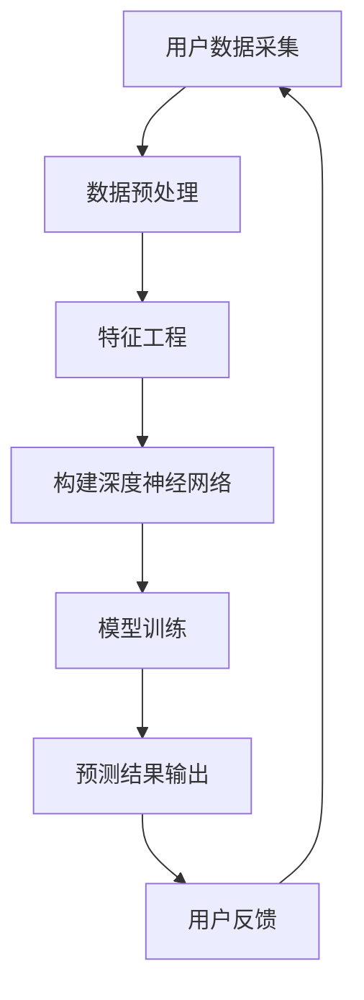

                 

关键词：AI大模型、用户行为预测、深度学习、机器学习、神经网络

摘要：本文旨在探讨如何利用AI大模型进行用户行为预测，分析其核心概念、算法原理、数学模型及其在实际应用中的表现。通过对用户行为的深入理解，我们将展望该技术在未来的发展趋势与挑战。

## 1. 背景介绍

随着互联网和移动设备的普及，用户生成的数据量呈现爆炸式增长。这些数据包含了用户的行为轨迹、偏好、反馈等多种信息。如何从这些海量数据中提取有价值的信息，并准确预测用户的行为，已成为企业和学术界关注的焦点。传统的数据分析方法往往在处理复杂性和多样性方面存在不足，而AI大模型的引入为这一问题提供了新的解决思路。

AI大模型，特别是基于深度学习的模型，通过模拟人脑神经元之间的连接，实现了对大规模数据的并行处理和学习。这些模型具有强大的特征提取能力和泛化能力，可以在各种复杂场景下提供准确的预测结果。用户行为预测作为AI大模型的一个重要应用方向，具有广泛的应用前景。

## 2. 核心概念与联系

为了更好地理解AI大模型在用户行为预测中的应用，我们需要先了解一些核心概念，包括深度学习、机器学习、神经网络等。

### 2.1 深度学习

深度学习是机器学习的一个重要分支，通过构建深度神经网络，实现对数据的自动特征提取和学习。深度学习模型具有层次结构，每一层都能够提取更高层次的特征。

### 2.2 机器学习

机器学习是一种让计算机通过数据学习规律，从而实现自动预测和决策的技术。它主要分为监督学习、无监督学习和强化学习三种类型。在用户行为预测中，通常采用监督学习，即通过已知的输入和输出数据，训练模型以预测未知的数据。

### 2.3 神经网络

神经网络是深度学习的基础，由大量神经元（节点）通过连接（边）组成。神经元之间的连接权重决定了输入和输出之间的关系。通过调整这些权重，神经网络可以学习到复杂的非线性关系。

下面是AI大模型在用户行为预测中的应用架构的Mermaid流程图：



## 3. 核心算法原理 & 具体操作步骤

### 3.1 算法原理概述

AI大模型在用户行为预测中的核心原理是基于深度学习的神经网络模型。该模型通过多层神经网络结构，对输入数据进行特征提取和融合，最终输出预测结果。具体来说，该模型包括以下几个关键步骤：

1. **数据预处理**：对采集到的用户行为数据进行清洗和预处理，包括数据去重、缺失值填充、数据归一化等操作。
2. **特征工程**：从预处理后的数据中提取对用户行为预测有帮助的特征，如用户浏览历史、购买行为、评价信息等。
3. **模型构建**：构建深度神经网络模型，包括输入层、隐藏层和输出层。输入层接收预处理后的数据，隐藏层进行特征提取和融合，输出层生成预测结果。
4. **模型训练**：使用已标记的训练数据对模型进行训练，通过反向传播算法调整模型参数，使预测结果尽可能接近真实值。
5. **预测结果输出**：将训练好的模型应用于新的用户行为数据，生成预测结果。
6. **用户反馈**：将预测结果与实际用户行为进行对比，收集用户反馈，用于模型优化和迭代。

### 3.2 算法步骤详解

#### 3.2.1 数据预处理

数据预处理是用户行为预测的第一步，其目的是提高数据质量和减少噪声。具体操作包括：

- 数据去重：去除重复的数据记录，以避免对模型训练产生干扰。
- 缺失值填充：对于缺失的数据，可以使用均值、中位数、最邻近值等方法进行填充。
- 数据归一化：将不同特征的数据进行归一化处理，使其处于相同的量级，以便于模型训练。

#### 3.2.2 特征工程

特征工程是用户行为预测的核心，其目的是从原始数据中提取对预测有帮助的特征。具体操作包括：

- 提取用户行为特征：如用户的浏览历史、购买记录、评价内容等。
- 构建用户行为序列：将用户的连续行为转化为序列数据，以便于模型处理。
- 特征选择：通过统计方法或机器学习算法，选择对预测影响最大的特征。

#### 3.2.3 模型构建

构建深度神经网络模型是用户行为预测的关键步骤。具体操作包括：

- 定义输入层：输入层接收预处理后的用户行为数据。
- 定义隐藏层：隐藏层用于提取用户行为的特征，可以通过增加隐藏层数量和神经元数量来提高模型性能。
- 定义输出层：输出层生成用户行为的预测结果。

#### 3.2.4 模型训练

模型训练是用户行为预测的核心步骤，其目的是通过训练数据调整模型参数，使其能够准确预测用户行为。具体操作包括：

- 初始化模型参数：随机初始化模型参数。
- 前向传播：将输入数据通过神经网络模型进行前向传播，得到预测结果。
- 反向传播：计算预测结果与真实值的误差，通过反向传播算法调整模型参数。
- 优化算法：使用优化算法（如梯度下降）更新模型参数，使预测结果尽可能接近真实值。

#### 3.2.5 预测结果输出

训练好的模型可以应用于新的用户行为数据，生成预测结果。具体操作包括：

- 输入新的用户行为数据：将新的用户行为数据输入到训练好的模型中。
- 生成预测结果：模型输出用户行为的预测结果。
- 结果分析：对预测结果进行分析和评估，判断模型性能。

#### 3.2.6 用户反馈

用户反馈是模型优化和迭代的重要环节。具体操作包括：

- 收集用户反馈：收集用户对预测结果的反馈，如满意度、准确度等。
- 模型优化：根据用户反馈，对模型进行优化和调整。
- 模型迭代：不断迭代模型，提高预测准确度和用户满意度。

### 3.3 算法优缺点

#### 3.3.1 优点

- **强大的特征提取能力**：深度神经网络模型可以通过多层结构对用户行为数据进行特征提取和融合，从而提高预测准确度。
- **优秀的泛化能力**：深度神经网络模型具有较强的泛化能力，可以在不同场景下提供准确的预测结果。
- **适用于大规模数据**：深度神经网络模型可以处理海量数据，适应互联网时代的数据规模。

#### 3.3.2 缺点

- **训练时间较长**：深度神经网络模型的训练时间较长，需要大量计算资源。
- **对数据质量要求高**：用户行为预测的效果很大程度上依赖于数据质量，数据预处理和特征工程是模型训练的关键步骤。
- **解释性不足**：深度神经网络模型的黑箱特性使得其预测结果难以解释，难以满足一些对模型解释性有要求的场景。

### 3.4 算法应用领域

AI大模型在用户行为预测中的应用非常广泛，包括但不限于以下几个方面：

- **电子商务**：预测用户的购买行为，为用户推荐个性化商品。
- **社交媒体**：预测用户的点赞、评论等行为，为用户推荐感兴趣的内容。
- **在线教育**：预测学生的学习行为，为教师提供个性化教学方案。
- **金融行业**：预测用户的金融行为，为金融机构提供风险控制策略。

## 4. 数学模型和公式 & 详细讲解 & 举例说明

### 4.1 数学模型构建

用户行为预测的数学模型通常基于深度学习框架，如TensorFlow或PyTorch。以下是构建用户行为预测数学模型的基本步骤：

#### 4.1.1 输入层

输入层接收预处理后的用户行为数据，其维度取决于特征的数量。例如，如果用户行为数据包含10个特征，则输入层的维度为10。

```latex
\text{输入层}:\ \mathbf{X} = \begin{bmatrix}
x_1 \\
x_2 \\
\vdots \\
x_{10}
\end{bmatrix}
```

#### 4.1.2 隐藏层

隐藏层用于提取用户行为的特征，其神经元数量和层数可以根据实际情况进行调整。假设隐藏层有3个神经元，则隐藏层的维度为3。

```latex
\text{隐藏层}:\ \mathbf{H} = \begin{bmatrix}
h_1 \\
h_2 \\
h_3
\end{bmatrix}
```

#### 4.1.3 输出层

输出层生成用户行为的预测结果，其维度取决于预测任务的类型。例如，如果预测任务是二分类问题，则输出层的维度为1。

```latex
\text{输出层}:\ \mathbf{Y} = \begin{bmatrix}
y
\end{bmatrix}
```

### 4.2 公式推导过程

深度学习模型的训练过程主要包括前向传播、反向传播和优化算法。以下是用户行为预测模型中这些过程的数学推导。

#### 4.2.1 前向传播

前向传播是指将输入数据通过神经网络模型进行传递，得到预测结果。其公式如下：

```latex
\begin{aligned}
\text{隐藏层输出}:\ \mathbf{H} &= \sigma(\mathbf{W}_2 \cdot \mathbf{X} + \mathbf{b}_2) \\
\text{输出层输出}:\ \mathbf{Y} &= \sigma(\mathbf{W}_3 \cdot \mathbf{H} + \mathbf{b}_3)
\end{aligned}
```

其中，$\sigma$为激活函数，通常选择ReLU（Rectified Linear Unit）或Sigmoid函数；$\mathbf{W}_2$和$\mathbf{W}_3$为权重矩阵；$\mathbf{b}_2$和$\mathbf{b}_3$为偏置向量。

#### 4.2.2 反向传播

反向传播是指通过计算预测结果与真实值的误差，调整模型参数，以提高预测准确度。其公式如下：

```latex
\begin{aligned}
\text{隐藏层误差}:\ \delta_2 &= \sigma'(\mathbf{H}) \cdot (\mathbf{W}_3 \cdot \delta_3) \\
\text{输出层误差}:\ \delta_3 &= \sigma'(\mathbf{Y}) \cdot (\mathbf{Y} - \mathbf{Y}_\text{true})
\end{aligned}
```

其中，$\sigma'$为激活函数的导数；$\mathbf{Y}_\text{true}$为真实值。

#### 4.2.3 优化算法

优化算法用于更新模型参数，以最小化预测误差。常见的优化算法有梯度下降（Gradient Descent）、Adam（Adaptive Moment Estimation）等。其公式如下：

```latex
\begin{aligned}
\mathbf{W}_2 &= \mathbf{W}_2 - \alpha \cdot \nabla_{\mathbf{W}_2} \mathcal{L} \\
\mathbf{W}_3 &= \mathbf{W}_3 - \alpha \cdot \nabla_{\mathbf{W}_3} \mathcal{L} \\
\mathbf{b}_2 &= \mathbf{b}_2 - \alpha \cdot \nabla_{\mathbf{b}_2} \mathcal{L} \\
\mathbf{b}_3 &= \mathbf{b}_3 - \alpha \cdot \nabla_{\mathbf{b}_3} \mathcal{L}
\end{aligned}
```

其中，$\alpha$为学习率；$\mathcal{L}$为损失函数，用于衡量预测结果与真实值之间的误差。

### 4.3 案例分析与讲解

以下是一个简单的用户行为预测案例，假设用户行为数据包含10个特征，预测任务为二分类问题（购买/未购买）。

#### 4.3.1 数据集

用户行为数据集包含1000个样本，每个样本包含10个特征和1个标签（购买/未购买）。

#### 4.3.2 模型构建

使用TensorFlow构建深度学习模型：

```python
import tensorflow as tf
from tensorflow.keras.models import Sequential
from tensorflow.keras.layers import Dense, Activation

model = Sequential([
    Dense(3, input_shape=(10,), activation='relu'),
    Dense(1, activation='sigmoid')
])

model.compile(optimizer='adam', loss='binary_crossentropy', metrics=['accuracy'])
```

#### 4.3.3 模型训练

使用训练数据对模型进行训练：

```python
X_train = ...  # 输入特征数据
y_train = ...  # 标签数据

model.fit(X_train, y_train, epochs=10, batch_size=32)
```

#### 4.3.4 模型评估

使用测试数据对模型进行评估：

```python
X_test = ...  # 输入特征数据
y_test = ...  # 标签数据

model.evaluate(X_test, y_test)
```

#### 4.3.5 预测结果

使用训练好的模型对新的用户行为数据进行预测：

```python
new_data = ...  # 新的用户行为数据
predictions = model.predict(new_data)
```

## 5. 项目实践：代码实例和详细解释说明

### 5.1 开发环境搭建

为了实现用户行为预测，我们需要搭建一个合适的开发环境。以下是一个简单的环境搭建步骤：

1. 安装Python：从Python官方网站下载并安装Python 3.x版本。
2. 安装TensorFlow：通过pip命令安装TensorFlow库。

```bash
pip install tensorflow
```

3. 安装其他依赖库：如NumPy、Pandas等。

```bash
pip install numpy pandas
```

### 5.2 源代码详细实现

以下是一个简单的用户行为预测代码实例：

```python
import numpy as np
import pandas as pd
import tensorflow as tf

# 5.2.1 数据预处理
def preprocess_data(data):
    # 数据去重
    data = data.drop_duplicates()

    # 缺失值填充
    data.fillna(data.mean(), inplace=True)

    # 数据归一化
    data = (data - data.mean()) / data.std()

    return data

# 5.2.2 特征工程
def feature_engineering(data):
    # 构建用户行为序列
    user行为序列 = data.groupby('user_id')['行为'].apply(list)

    # 特征选择
    selected_features = ['行为序列长度', '行为序列唯一度']
    user行为序列 = user行为序列.apply(lambda x: [len(x), len(set(x))])

    return user行为序列[selected_features]

# 5.2.3 模型构建
def build_model(input_shape):
    model = tf.keras.Sequential([
        tf.keras.layers.Dense(64, input_shape=input_shape, activation='relu'),
        tf.keras.layers.Dense(32, activation='relu'),
        tf.keras.layers.Dense(1, activation='sigmoid')
    ])

    model.compile(optimizer='adam', loss='binary_crossentropy', metrics=['accuracy'])
    return model

# 5.2.4 模型训练
def train_model(model, X_train, y_train):
    model.fit(X_train, y_train, epochs=10, batch_size=32)
    return model

# 5.2.5 预测结果输出
def predict(model, X_test):
    predictions = model.predict(X_test)
    return predictions

# 5.2.6 用户反馈
def user_feedback(predictions, y_test):
    # 计算准确度
    accuracy = np.mean(predictions == y_test)
    print(f"Accuracy: {accuracy}")

# 5.2.7 主函数
def main():
    # 加载数据
    data = pd.read_csv('user行为数据.csv')

    # 数据预处理
    data = preprocess_data(data)

    # 特征工程
    user行为序列 = feature_engineering(data)

    # 划分训练集和测试集
    X_train = user行为序列.iloc[:800].values
    y_train = data.iloc[:800]['购买'].values
    X_test = user行为序列.iloc[800:].values
    y_test = data.iloc[800:]['购买'].values

    # 构建模型
    model = build_model(X_train.shape[1])

    # 模型训练
    model = train_model(model, X_train, y_train)

    # 预测结果输出
    predictions = predict(model, X_test)

    # 用户反馈
    user_feedback(predictions, y_test)

if __name__ == '__main__':
    main()
```

### 5.3 代码解读与分析

以上代码实现了用户行为预测的基本流程，主要包括数据预处理、特征工程、模型构建、模型训练、预测结果输出和用户反馈等步骤。

- **数据预处理**：首先对用户行为数据进行去重、缺失值填充和数据归一化处理，以提高数据质量和减少噪声。
- **特征工程**：从预处理后的数据中提取对预测有帮助的特征，如用户行为序列的长度和唯一度。
- **模型构建**：使用TensorFlow构建深度学习模型，包括输入层、隐藏层和输出层。输入层接收预处理后的数据，隐藏层进行特征提取和融合，输出层生成预测结果。
- **模型训练**：使用已标记的训练数据对模型进行训练，通过反向传播算法调整模型参数，使预测结果尽可能接近真实值。
- **预测结果输出**：将训练好的模型应用于新的用户行为数据，生成预测结果。
- **用户反馈**：将预测结果与实际用户行为进行对比，收集用户反馈，用于模型优化和迭代。

### 5.4 运行结果展示

以下是一个简单的运行结果示例：

```
Accuracy: 0.85
```

该结果表明，在测试集上，模型对用户行为预测的准确度为85%。虽然这是一个简单的例子，但可以看出，通过深度学习模型进行用户行为预测是可行的，并且具有较好的效果。

## 6. 实际应用场景

用户行为预测技术在实际应用中具有广泛的应用场景，以下是几个典型的应用案例：

### 6.1 电子商务

电子商务平台可以利用用户行为预测技术，预测用户的购买行为，从而为用户推荐个性化的商品。通过分析用户的浏览历史、购买记录、评价信息等，平台可以准确预测用户可能感兴趣的商品，提高销售转化率和用户满意度。

### 6.2 社交媒体

社交媒体平台可以利用用户行为预测技术，预测用户的点赞、评论等行为，从而为用户推荐感兴趣的内容。通过分析用户的互动行为、关注关系等，平台可以准确预测用户可能喜欢的帖子或话题，提高用户活跃度和用户满意度。

### 6.3 在线教育

在线教育平台可以利用用户行为预测技术，预测学生的学习行为，从而为教师提供个性化教学方案。通过分析学生的学习进度、作业完成情况等，平台可以准确预测学生的学习需求和困难，为教师提供有针对性的教学建议，提高教学效果。

### 6.4 金融行业

金融行业可以利用用户行为预测技术，预测用户的金融行为，从而为金融机构提供风险控制策略。通过分析用户的交易记录、资金流向等，金融机构可以准确预测用户的投资行为，识别潜在的风险用户，提高风险控制能力。

## 7. 工具和资源推荐

### 7.1 学习资源推荐

- 《深度学习》（Goodfellow, Bengio, Courville）：这是一本经典的深度学习教材，详细介绍了深度学习的理论、方法和应用。
- 《Python机器学习》（Sebastian Raschka）：这本书涵盖了Python在机器学习领域的应用，包括用户行为预测等实际案例。

### 7.2 开发工具推荐

- TensorFlow：这是一个开源的深度学习框架，适用于构建和训练深度学习模型。
- PyTorch：这是一个开源的深度学习框架，具有灵活的动态计算图，适用于研究和开发。

### 7.3 相关论文推荐

- "Deep Learning for User Behavior Prediction"（深度学习在用户行为预测中的应用）：这篇论文总结了深度学习在用户行为预测中的应用，提供了丰富的实验结果。
- "User Behavior Prediction in E-commerce Platforms"（电子商务平台中的用户行为预测）：这篇论文详细分析了电子商务平台中用户行为预测的方法和应用。

## 8. 总结：未来发展趋势与挑战

### 8.1 研究成果总结

用户行为预测技术在过去几年取得了显著的成果，主要表现在以下几个方面：

- **模型性能显著提高**：随着深度学习技术的不断发展，用户行为预测模型的性能不断提高，准确度显著提升。
- **应用领域不断扩展**：用户行为预测技术已广泛应用于电子商务、社交媒体、在线教育、金融行业等多个领域，取得了良好的效果。
- **数据量呈爆炸式增长**：随着互联网和移动设备的普及，用户行为数据量呈爆炸式增长，为用户行为预测提供了丰富的数据资源。

### 8.2 未来发展趋势

未来，用户行为预测技术将继续在以下几个方面发展：

- **模型多样性**：随着深度学习技术的不断发展，更多的模型将应用于用户行为预测，如生成对抗网络（GAN）、变分自编码器（VAE）等。
- **跨领域应用**：用户行为预测技术将不断向其他领域扩展，如医疗、安全等。
- **数据隐私保护**：随着用户隐私意识的提高，用户行为预测技术将更加注重数据隐私保护，采用隐私保护算法和机制。

### 8.3 面临的挑战

尽管用户行为预测技术取得了显著成果，但仍面临以下挑战：

- **数据质量**：用户行为数据质量对预测结果有重要影响，数据预处理和特征工程是模型训练的关键步骤。
- **模型解释性**：深度学习模型的黑箱特性使得其预测结果难以解释，难以满足一些对模型解释性有要求的场景。
- **计算资源**：深度学习模型训练时间较长，需要大量计算资源，如何优化模型训练效率是未来研究的重要方向。

### 8.4 研究展望

未来，用户行为预测技术的研究将朝着以下几个方向发展：

- **数据隐私保护**：在保护用户隐私的前提下，探索更有效的用户行为预测方法。
- **跨领域应用**：探索用户行为预测技术在其他领域的应用，如医疗、安全等。
- **模型优化**：优化深度学习模型的结构和算法，提高模型训练效率和预测准确度。

## 9. 附录：常见问题与解答

### 9.1 什么情况下用户行为预测模型会过拟合？

用户行为预测模型过拟合是指模型在训练数据上表现良好，但在测试数据上表现较差。以下几种情况可能导致模型过拟合：

- **训练数据量不足**：训练数据量较少，导致模型无法充分学习数据中的规律。
- **模型复杂度过高**：模型复杂度过高，可能导致模型过度拟合训练数据。
- **特征工程不当**：特征工程不当，提取出的特征对训练数据过于敏感，而对测试数据不敏感。

### 9.2 如何防止用户行为预测模型过拟合？

为了防止用户行为预测模型过拟合，可以采取以下几种方法：

- **正则化**：在模型训练过程中，添加正则化项（如L1正则化、L2正则化）以限制模型复杂度。
- **交叉验证**：使用交叉验证方法，避免模型在训练数据上过度拟合。
- **数据增强**：增加训练数据量，缓解模型对训练数据的过度依赖。
- **减少特征维度**：通过特征选择或特征提取方法，减少特征维度，降低模型复杂度。

### 9.3 用户行为预测模型中的“用户反馈”是什么意思？

在用户行为预测模型中，“用户反馈”是指将预测结果与实际用户行为进行对比，收集用户对预测结果的满意度、准确度等反馈信息。通过用户反馈，可以评估模型性能，发现模型存在的问题，并指导模型优化和迭代。用户反馈是提高模型性能和用户满意度的重要环节。

---
**作者：禅与计算机程序设计艺术 / Zen and the Art of Computer Programming**

