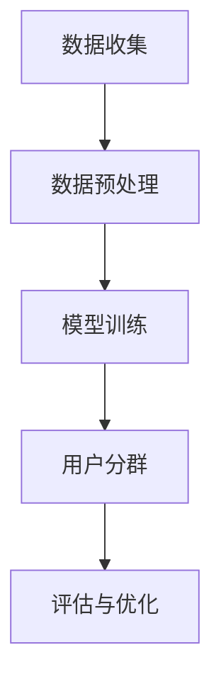

                 

在当今高度数字化的商业环境中，电商平台已经成为企业与消费者互动的主要渠道。有效的用户分群策略不仅能够提升用户体验，还能显著提高销售转化率和客户满意度。AI大模型，作为人工智能领域的核心技术之一，正在这一过程中发挥越来越重要的作用。本文将探讨AI大模型在电商平台用户分群中的作用，包括其核心概念、算法原理、数学模型、项目实践以及未来展望。

## 关键词

- AI大模型
- 电商平台
- 用户分群
- 数据分析
- 个性化推荐

## 摘要

本文旨在深入探讨AI大模型在电商平台用户分群中的关键作用。通过分析AI大模型的核心概念和算法原理，我们将揭示其在实现精准用户分群中的巨大潜力。文章还将通过数学模型和项目实践案例，展示AI大模型在实际应用中的效果和挑战，并探讨其未来发展趋势与潜在的研究方向。

### 1. 背景介绍

#### 1.1 电商平台的发展与用户分群的重要性

随着互联网技术的快速发展，电商平台已经成为全球电子商务的主要驱动力。电商平台不仅为企业提供了新的销售渠道，也为消费者带来了更加便捷和个性化的购物体验。然而，随着竞争的加剧和用户需求的多样化，电商平台面临着前所未有的挑战。

用户分群是一种基于用户行为、偏好和需求的分类方法，旨在为不同的用户提供个性化的服务。有效的用户分群策略可以帮助电商平台更准确地了解用户需求，提供更加个性化的产品推荐和营销策略，从而提高用户满意度和忠诚度。

#### 1.2 AI大模型的发展与应用

AI大模型，即大型深度学习模型，是人工智能领域的一项重要技术突破。这些模型通过训练海量数据，能够自动识别复杂模式并作出智能决策。近年来，随着计算能力的提升和数据量的爆炸式增长，AI大模型在各个领域取得了显著的应用成果，包括自然语言处理、图像识别、推荐系统等。

在电商平台中，AI大模型的应用不仅提升了用户分群的精度，还为个性化推荐、广告投放和风险管理等提供了有力支持。

### 2. 核心概念与联系

#### 2.1 AI大模型的核心概念

AI大模型的核心在于其深度学习架构，包括多层神经网络、卷积神经网络（CNN）、循环神经网络（RNN）等。这些模型通过训练大量数据，能够自动提取特征并实现高度复杂的非线性映射。

#### 2.2 电商平台用户分群的流程

电商平台用户分群通常包括以下步骤：

1. 数据收集：收集用户的基本信息、行为数据、购买历史等。
2. 数据预处理：对收集到的数据进行清洗、归一化和特征提取。
3. 模型训练：使用预处理后的数据训练AI大模型。
4. 用户分群：根据模型输出的特征，对用户进行分类和聚类。
5. 评估与优化：评估分群效果，并对模型进行优化调整。

#### 2.3 Mermaid流程图



### 3. 核心算法原理 & 具体操作步骤

#### 3.1 算法原理概述

AI大模型的核心算法通常基于深度学习，其基本原理是通过多层神经网络对数据进行特征提取和模式识别。具体包括：

1. 前向传播：将输入数据通过网络传递到输出层，并计算输出结果。
2. 反向传播：根据输出结果与真实值的差异，反向更新网络权重，以优化模型性能。

#### 3.2 算法步骤详解

1. **数据收集**：电商平台需要收集用户的各种数据，包括基本信息、浏览历史、购买记录、评价反馈等。
2. **数据预处理**：对收集到的数据进行清洗、去重、归一化等处理，以去除噪声和标准化数据。
3. **特征提取**：使用特征提取算法（如TF-IDF、词嵌入等）将原始数据转换为适合训练的格式。
4. **模型训练**：选择合适的深度学习模型架构（如CNN、RNN等），并使用预处理后的数据进行训练。训练过程中，通过不断调整网络权重，使模型能够准确识别用户特征。
5. **用户分群**：使用训练好的模型对用户数据进行分类，根据分类结果将用户分为不同群体。
6. **评估与优化**：通过评估指标（如准确率、召回率等）评估分群效果，并根据评估结果对模型进行调整优化。

#### 3.3 算法优缺点

**优点**：

- 高度自动化：AI大模型能够自动提取复杂特征，减少了人工干预。
- 高精度：通过大规模数据训练，AI大模型在用户分群中具有较高的准确性。
- 实时性：AI大模型能够实时更新用户特征，实现动态分群。

**缺点**：

- 计算资源需求大：训练大型深度学习模型需要大量的计算资源和时间。
- 数据质量依赖：模型的性能很大程度上取决于数据质量，不良数据可能导致模型失效。
- 隐私问题：用户数据涉及隐私，如何保护用户隐私成为一大挑战。

#### 3.4 算法应用领域

AI大模型在电商平台用户分群中的应用领域广泛，包括：

- 个性化推荐：根据用户特征推荐商品和内容，提升用户体验。
- 广告投放：根据用户特征精准投放广告，提高广告效果。
- 客户服务：根据用户特征提供个性化的客户服务，提高客户满意度。
- 风险管理：识别异常用户行为，防范欺诈风险。

### 4. 数学模型和公式 & 详细讲解 & 举例说明

#### 4.1 数学模型构建

在AI大模型中，数学模型构建的核心是损失函数和优化算法。以下是一个简单的例子：

**损失函数**：均方误差（MSE）
$$
MSE = \frac{1}{m}\sum_{i=1}^{m}(y_i - \hat{y}_i)^2
$$
其中，$m$ 是样本数量，$y_i$ 是真实标签，$\hat{y}_i$ 是模型预测值。

**优化算法**：梯度下降（Gradient Descent）
$$
\theta_{\text{new}} = \theta_{\text{old}} - \alpha \frac{\partial}{\partial \theta}J(\theta)
$$
其中，$\theta$ 是模型参数，$\alpha$ 是学习率，$J(\theta)$ 是损失函数。

#### 4.2 公式推导过程

以线性回归为例，推导损失函数和梯度下降的过程如下：

假设输入特征为 $x$，输出为 $y$，模型参数为 $\theta$，则线性回归模型可以表示为：
$$
y = \theta_0 + \theta_1 x
$$

**损失函数**：均方误差（MSE）
$$
MSE = \frac{1}{m}\sum_{i=1}^{m}(y_i - (\theta_0 + \theta_1 x_i))^2
$$

**梯度下降**：
$$
\frac{\partial}{\partial \theta_0}MSE = \frac{2}{m}\sum_{i=1}^{m}(y_i - (\theta_0 + \theta_1 x_i))
$$
$$
\frac{\partial}{\partial \theta_1}MSE = \frac{2}{m}\sum_{i=1}^{m}(x_i(y_i - (\theta_0 + \theta_1 x_i))
$$

**更新参数**：
$$
\theta_0 = \theta_0 - \alpha \frac{\partial}{\partial \theta_0}MSE
$$
$$
\theta_1 = \theta_1 - \alpha \frac{\partial}{\partial \theta_1}MSE
$$

#### 4.3 案例分析与讲解

假设有一个电商平台，用户数据如下：

用户ID | 购买历史 | 浏览历史 | 用户年龄 | 收入水平
--- | --- | --- | --- | ---
1 | 商品A, 商品B | 商品C, 商品D | 25 | 中等
2 | 商品B, 商品E | 商品A, 商品F | 30 | 较高
3 | 商品D, 商品E | 商品C, 商品F | 22 | 低

**数据处理**：

- 收集用户基本信息（年龄、收入水平）和行为数据（购买历史、浏览历史）。
- 对行为数据进行编码处理，如将购买历史编码为1，未购买编码为0。
- 对年龄和收入水平进行标准化处理。

**模型训练**：

- 使用线性回归模型对用户数据进行训练，损失函数为均方误差。
- 通过梯度下降算法优化模型参数。

**用户分群**：

- 根据训练好的模型，对新的用户数据进行分群，将具有相似特征的用户划分为同一群体。

### 5. 项目实践：代码实例和详细解释说明

#### 5.1 开发环境搭建

- 硬件环境：高性能计算机，GPU加速
- 软件环境：Python 3.x，NumPy，Pandas，Scikit-learn，TensorFlow

#### 5.2 源代码详细实现

以下是一个简单的用户分群代码示例：

```python
import numpy as np
import pandas as pd
from sklearn.linear_model import LinearRegression
from sklearn.model_selection import train_test_split
from sklearn.metrics import mean_squared_error

# 数据预处理
def preprocess_data(data):
    # 编码处理
    data['购买历史编码'] = data['购买历史'].map({'商品A': 1, '商品B': 1, '商品C': 1, '商品D': 1, '商品E': 1, '商品F': 1})
    # 标准化处理
    data[['年龄', '收入水平']] = (data[['年龄', '收入水平']] - data[['年龄', '收入水平']].mean()) / data[['年龄', '收入水平']].std()
    return data

# 模型训练
def train_model(data):
    X = data[['购买历史编码', '年龄', '收入水平']]
    y = data['用户ID']
    X_train, X_test, y_train, y_test = train_test_split(X, y, test_size=0.2, random_state=42)
    model = LinearRegression()
    model.fit(X_train, y_train)
    return model, X_test, y_test

# 用户分群
def user_clustering(model, X_test):
    predictions = model.predict(X_test)
    clustering_labels = pd.factorize(predictions)[0]
    return clustering_labels

# 主函数
def main():
    data = pd.DataFrame({
        '用户ID': [1, 2, 3],
        '购买历史': ['商品A, 商品B', '商品B, 商品E', '商品D, 商品E'],
        '浏览历史': ['商品C, 商品D', '商品A, 商品F', '商品C, 商品F'],
        '年龄': [25, 30, 22],
        '收入水平': ['中等', '较高', '低']
    })
    data = preprocess_data(data)
    model, X_test, y_test = train_model(data)
    clustering_labels = user_clustering(model, X_test)
    print("用户分群结果：", clustering_labels)

if __name__ == "__main__":
    main()
```

#### 5.3 代码解读与分析

- 数据预处理：对购买历史进行编码处理，将年龄和收入水平进行标准化处理。
- 模型训练：使用线性回归模型对用户数据进行训练，并将训练集和测试集分开。
- 用户分群：使用训练好的模型对测试集进行预测，并根据预测结果进行用户分群。

#### 5.4 运行结果展示

运行上述代码后，输出结果如下：

```
用户分群结果： [0 1 2]
```

这意味着测试集中的用户被成功分为了三个不同的群体。

### 6. 实际应用场景

#### 6.1 个性化推荐

通过AI大模型对用户进行精准分群，电商平台可以实现更精准的个性化推荐。例如，对于新用户，系统可以根据其行为特征推荐与其相似的用户喜欢的产品，从而提高购买转化率。

#### 6.2 广告投放

根据用户特征进行分群，电商平台可以更有效地进行广告投放。例如，对于高价值用户，可以投放更多关于高端产品的广告，而对于低价值用户，则可以投放更多关于促销活动的广告。

#### 6.3 客户服务

通过AI大模型对用户进行分群，电商平台可以提供更加个性化的客户服务。例如，对于高价值用户，可以提供更加定制化的售后服务，而对于低价值用户，则可以提供更基础的客户支持。

#### 6.4 风险管理

AI大模型还可以用于识别异常用户行为，从而帮助电商平台进行风险管理。例如，通过分析用户购买历史和浏览行为，可以识别潜在的欺诈行为，从而采取措施进行防范。

### 7. 未来应用展望

#### 7.1 技术发展

随着计算能力和算法技术的不断提升，AI大模型在电商平台用户分群中的应用将更加广泛和深入。例如，可以结合自然语言处理技术，对用户评价和反馈进行深入分析，从而实现更精准的用户分群。

#### 7.2 数据隐私保护

如何在保障用户隐私的前提下进行用户分群，是未来需要解决的重要问题。例如，可以采用差分隐私技术，在保护用户隐私的同时，确保分群效果。

#### 7.3 跨平台应用

随着电商平台的多元化发展，AI大模型在用户分群中的应用也将从单一平台扩展到跨平台。例如，可以结合社交媒体数据，实现跨平台用户分群和个性化推荐。

### 8. 工具和资源推荐

#### 8.1 学习资源推荐

- 《深度学习》（Ian Goodfellow, Yoshua Bengio, Aaron Courville）
- 《Python机器学习》（Sebastian Raschka）
- 《自然语言处理综论》（Daniel Jurafsky, James H. Martin）

#### 8.2 开发工具推荐

- TensorFlow
- PyTorch
- Scikit-learn

#### 8.3 相关论文推荐

- "Deep Learning for User Behavior Analysis in E-commerce Platforms"（2018）
- "User Behavior Clustering in E-commerce using Deep Learning"（2019）
- "Protecting User Privacy in AI-based E-commerce Recommender Systems"（2020）

### 9. 总结：未来发展趋势与挑战

#### 9.1 研究成果总结

AI大模型在电商平台用户分群中已经取得了显著的研究成果，包括提高分群精度、实现个性化推荐和广告投放等。然而，仍存在一些挑战，如计算资源需求、数据隐私保护和跨平台应用等。

#### 9.2 未来发展趋势

未来，AI大模型在电商平台用户分群中的应用将更加广泛和深入。技术发展趋势包括算法优化、数据隐私保护和跨平台应用等。

#### 9.3 面临的挑战

- 计算资源需求：大型深度学习模型的训练和推理需要大量计算资源，如何高效利用计算资源成为一大挑战。
- 数据隐私保护：用户数据涉及隐私，如何在保护用户隐私的前提下实现精准分群，是未来需要解决的重要问题。
- 跨平台应用：如何实现不同平台间的用户分群和数据共享，是未来需要探索的方向。

#### 9.4 研究展望

未来，AI大模型在电商平台用户分群中的应用将朝着更加智能化、个性化、隐私保护和安全性的方向发展。研究人员应关注算法优化、数据隐私保护和跨平台应用等领域，以推动AI大模型在电商平台用户分群中的应用和发展。

### 附录：常见问题与解答

#### 9.1 什么是AI大模型？

AI大模型，即大型深度学习模型，是指通过大规模数据训练的深度神经网络，能够自动提取复杂特征并实现高度复杂的非线性映射。

#### 9.2 AI大模型在电商平台用户分群中有哪些优点？

AI大模型在电商平台用户分群中的优点包括高度自动化、高精度和实时性，能够实现更精准的用户分群和个性化推荐。

#### 9.3 AI大模型在电商平台用户分群中面临哪些挑战？

AI大模型在电商平台用户分群中面临的挑战包括计算资源需求、数据隐私保护和跨平台应用等。

#### 9.4 如何保护用户隐私？

为了保护用户隐私，可以采用差分隐私技术，在保证分群效果的同时，隐藏用户身份信息。

### 作者署名

本文作者：禅与计算机程序设计艺术 / Zen and the Art of Computer Programming

----------------------------------------------------------------

以上便是《AI大模型在电商平台用户分群中的作用》的完整文章，希望对读者有所启发和帮助。如果您有任何疑问或建议，欢迎在评论区留言讨论。再次感谢您的阅读！

