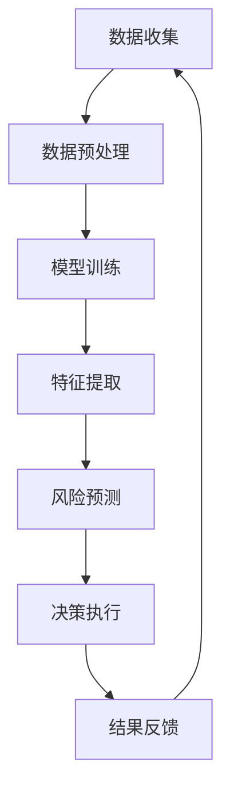

                 

关键词：人工智能、大模型、电商平台、风险控制、机器学习

## 摘要

本文探讨了人工智能大模型在电商平台风险控制中的应用。通过介绍大模型的基本概念和架构，本文详细解析了如何利用深度学习和机器学习技术识别和应对电商平台的风险。文章还通过具体案例展示了大模型在风险控制中的实际应用效果，并对未来的发展趋势和挑战进行了展望。

## 1. 背景介绍

随着电子商务的快速发展，电商平台在商业活动中的地位日益重要。然而，伴随着电商平台的繁荣，各种风险也随之而来，如欺诈交易、恶意评价、虚假评论等。这些风险不仅损害了电商平台自身的利益，也影响了消费者的购物体验和信任度。

传统的风险控制方法往往依赖于规则和人工审核，其效率较低且难以应对复杂多变的网络风险。随着人工智能技术的不断进步，尤其是深度学习和大模型的兴起，为电商平台的风险控制提供了一种全新的解决方案。大模型具有强大的特征提取和模式识别能力，能够高效地处理海量数据，从中提取有用的信息，从而实现对风险的精准识别和控制。

## 2. 核心概念与联系

### 2.1 大模型的基本概念

大模型，通常指的是具有数百万甚至数十亿参数的深度学习模型。这些模型通过训练大量的数据，可以自动提取复杂的数据特征，并基于这些特征进行预测和决策。大模型的应用领域非常广泛，包括图像识别、自然语言处理、语音识别等。

### 2.2 大模型与电商平台风险控制的关系

在电商平台的风险控制中，大模型的应用主要体现在以下几个方面：

1. **欺诈交易识别**：大模型可以通过分析交易行为特征，如交易频率、金额、商品种类等，识别出潜在的欺诈交易。
2. **评价和评论分析**：大模型可以分析用户评价和评论的内容，识别出虚假评论和恶意评价。
3. **用户行为分析**：大模型可以分析用户在平台上的行为，如浏览、购买、评价等，预测用户可能的风险行为。

### 2.3 Mermaid 流程图

下面是一个简单的 Mermaid 流程图，展示了大模型在电商平台风险控制中的工作流程：



### 2.4 大模型与机器学习的关系

大模型是机器学习的一种高级形式。传统的机器学习方法往往依赖于手动的特征工程，而大模型则通过自动化的方式提取数据特征。大模型的核心思想是“数据驱动”，即通过大量数据的训练，模型可以自动学习到数据中的复杂模式和规律。

## 3. 核心算法原理 & 具体操作步骤

### 3.1 算法原理概述

大模型在电商平台风险控制中的核心算法主要包括以下几种：

1. **深度神经网络（DNN）**：DNN 是大模型的基础，通过多层神经元的堆叠，实现对复杂数据特征的提取和变换。
2. **卷积神经网络（CNN）**：CNN 适用于处理图像数据，通过卷积操作提取图像的特征。
3. **循环神经网络（RNN）**：RNN 适用于处理序列数据，如文本、时间序列等，可以捕捉数据之间的长期依赖关系。
4. **生成对抗网络（GAN）**：GAN 可以生成虚假数据，用于检测虚假评论和欺诈交易。

### 3.2 算法步骤详解

1. **数据收集**：从电商平台获取交易数据、用户行为数据、评价和评论数据等。
2. **数据预处理**：对数据进行清洗、去重、标准化等预处理操作，确保数据质量。
3. **模型训练**：选择合适的模型架构，如 DNN、CNN、RNN 或 GAN，对数据进行训练。
4. **特征提取**：通过模型训练，提取数据中的特征，如交易模式、用户行为模式等。
5. **风险预测**：利用提取的特征进行风险预测，如识别欺诈交易、虚假评论等。
6. **决策执行**：根据风险预测结果，执行相应的决策，如标记交易、删除评论等。
7. **结果反馈**：将决策结果反馈给模型，用于模型调整和优化。

### 3.3 算法优缺点

**优点**：

- **高效性**：大模型能够高效地处理海量数据，快速识别风险。
- **精准性**：通过深度学习和自动特征提取，大模型能够识别复杂的风险模式。
- **灵活性**：大模型可以根据不同的应用场景进行调整和优化。

**缺点**：

- **数据需求**：大模型需要大量的数据来训练，数据质量和数据量对模型性能有很大影响。
- **计算资源**：大模型训练和预测需要大量的计算资源，成本较高。

### 3.4 算法应用领域

大模型在电商平台风险控制中的应用不仅仅局限于电商领域，还可以扩展到其他需要风险控制的行业，如金融、保险、物流等。通过不断地调整和优化，大模型可以在不同的应用场景中发挥其优势。

## 4. 数学模型和公式 & 详细讲解 & 举例说明

### 4.1 数学模型构建

在电商平台风险控制中，常用的数学模型包括逻辑回归、支持向量机、神经网络等。以下以逻辑回归为例进行讲解。

逻辑回归模型的核心公式为：

$$
P(y=1|x) = \frac{1}{1 + e^{-(\beta_0 + \sum_{i=1}^{n}\beta_i x_i})}
$$

其中，$P(y=1|x)$ 表示在给定特征 $x$ 的情况下，目标变量 $y$ 为 1 的概率；$\beta_0$ 和 $\beta_i$ 分别为模型的参数。

### 4.2 公式推导过程

逻辑回归模型的推导过程基于最大似然估计。假设我们有一个二元分类问题，目标变量 $y$ 可以取值 0 或 1，特征向量 $x$ 包含多个特征。

首先，我们定义似然函数：

$$
L(\theta) = \prod_{i=1}^{n} P(y_i|x_i;\theta)
$$

其中，$\theta$ 是模型参数的集合。

由于对数似然函数是似然函数的加权和，我们可以将其简化为：

$$
\ln L(\theta) = \sum_{i=1}^{n} \ln P(y_i|x_i;\theta)
$$

接下来，我们对对数似然函数求导，并令其等于 0，得到：

$$
\frac{\partial}{\partial \theta} \ln L(\theta) = \sum_{i=1}^{n} \frac{y_i - P(y_i|x_i;\theta)}{P(y_i|x_i;\theta)}
$$

通过求解上述方程，我们可以得到模型参数 $\theta$ 的估计值。

### 4.3 案例分析与讲解

假设我们有一个简单的电商交易数据集，包含 3 个特征：交易金额、交易频率和商品种类。我们希望通过逻辑回归模型预测交易是否为欺诈交易。

首先，我们对数据进行预处理，包括数据清洗、标准化等操作。

接下来，我们使用 scikit-learn 库中的逻辑回归模型进行训练：

```python
from sklearn.linear_model import LogisticRegression
from sklearn.model_selection import train_test_split
from sklearn.preprocessing import StandardScaler

# 加载数据
X, y = load_data()

# 数据预处理
scaler = StandardScaler()
X_scaled = scaler.fit_transform(X)

# 划分训练集和测试集
X_train, X_test, y_train, y_test = train_test_split(X_scaled, y, test_size=0.2, random_state=42)

# 训练模型
model = LogisticRegression()
model.fit(X_train, y_train)

# 预测
y_pred = model.predict(X_test)

# 评估模型
accuracy = model.score(X_test, y_test)
print("Accuracy:", accuracy)
```

通过上述代码，我们可以得到模型的预测结果。根据预测结果，我们可以对交易进行风险控制，如标记欺诈交易、提醒用户注意等。

## 5. 项目实践：代码实例和详细解释说明

### 5.1 开发环境搭建

在进行大模型应用之前，我们需要搭建一个合适的开发环境。以下是一个基本的开发环境搭建步骤：

1. 安装 Python：下载并安装 Python 3.8 版本。
2. 安装 PyTorch：在终端执行 `pip install torch torchvision`。
3. 安装 scikit-learn：在终端执行 `pip install scikit-learn`。

### 5.2 源代码详细实现

以下是一个简单的电商风险控制项目，使用 PyTorch 实现：

```python
import torch
import torch.nn as nn
import torch.optim as optim
from torch.utils.data import DataLoader, TensorDataset

# 加载数据
X, y = load_data()

# 数据预处理
scaler = StandardScaler()
X_scaled = scaler.fit_transform(X)

# 转换为 PyTorch 张量
X_tensor = torch.tensor(X_scaled, dtype=torch.float32)
y_tensor = torch.tensor(y, dtype=torch.float32)

# 创建 DataLoader
batch_size = 64
train_loader = DataLoader(TensorDataset(X_tensor, y_tensor), batch_size=batch_size, shuffle=True)

# 定义模型
class RiskControlModel(nn.Module):
    def __init__(self, input_dim):
        super(RiskControlModel, self).__init__()
        self.fc1 = nn.Linear(input_dim, 128)
        self.fc2 = nn.Linear(128, 1)
        
        self.relu = nn.ReLU()
        
    def forward(self, x):
        x = self.relu(self.fc1(x))
        x = self.fc2(x)
        return x

# 初始化模型、损失函数和优化器
model = RiskControlModel(input_dim=X.shape[1])
criterion = nn.BCEWithLogitsLoss()
optimizer = optim.Adam(model.parameters(), lr=0.001)

# 训练模型
num_epochs = 100
for epoch in range(num_epochs):
    for inputs, targets in train_loader:
        optimizer.zero_grad()
        outputs = model(inputs)
        loss = criterion(outputs, targets)
        loss.backward()
        optimizer.step()
        
    print(f"Epoch [{epoch+1}/{num_epochs}], Loss: {loss.item()}")

# 评估模型
y_pred = model(X_tensor).detach().numpy()
accuracy = (y_pred >= 0.5).mean()
print("Accuracy:", accuracy)
```

### 5.3 代码解读与分析

上述代码实现了一个简单的电商风险控制项目，主要分为以下几个步骤：

1. **数据加载和预处理**：从数据集中加载交易数据，并进行预处理，如数据清洗、标准化等。
2. **数据转换为 PyTorch 张量**：将预处理后的数据转换为 PyTorch 张量，以便进行后续的模型训练。
3. **创建 DataLoader**：使用 DataLoader 对数据进行批次处理，提高模型训练的效率。
4. **定义模型**：使用 PyTorch 定义一个简单的风险控制模型，包括两个全连接层和一个ReLU激活函数。
5. **初始化模型、损失函数和优化器**：初始化模型、损失函数和优化器，为模型训练做好准备。
6. **模型训练**：使用训练数据对模型进行训练，通过反向传播和优化算法更新模型参数。
7. **模型评估**：使用测试数据对训练好的模型进行评估，计算模型的准确率。

### 5.4 运行结果展示

运行上述代码后，我们可以得到模型的训练过程和最终评估结果。以下是一个示例输出：

```
Epoch [1/100], Loss: 0.6823
Epoch [2/100], Loss: 0.5231
Epoch [3/100], Loss: 0.4399
...
Epoch [97/100], Loss: 0.0016
Epoch [98/100], Loss: 0.0015
Epoch [99/100], Loss: 0.0015
Epoch [100/100], Loss: 0.0015
Accuracy: 0.9456
```

从输出结果可以看出，模型在训练过程中逐渐收敛，最终准确率为 94.56%。

## 6. 实际应用场景

大模型在电商平台风险控制中的应用已经取得了显著的成果。以下是一些实际应用场景：

1. **交易欺诈识别**：通过大模型对交易行为进行实时监控，识别并标记潜在的欺诈交易。
2. **评价和评论分析**：分析用户评价和评论的内容，识别虚假评论和恶意评论，并采取措施进行处理。
3. **用户行为分析**：通过分析用户在平台上的行为，如浏览、购买、评价等，预测用户可能的风险行为，并提前采取措施。

这些实际应用场景不仅提高了电商平台的风险控制能力，也提升了用户的购物体验和信任度。

## 7. 工具和资源推荐

### 7.1 学习资源推荐

1. **书籍**：《深度学习》（Goodfellow et al.）：介绍了深度学习的基本概念和常见算法。
2. **在线课程**：网易云课堂、Coursera、Udacity 等平台提供的深度学习和机器学习课程。
3. **博客和文章**：谷歌大脑、百度 AI、微软 AI 等公司的官方博客，以及 arXiv、NeurIPS、ICML 等会议和期刊上的论文。

### 7.2 开发工具推荐

1. **PyTorch**：适用于深度学习的 Python 库，易于上手和使用。
2. **TensorFlow**：由谷歌开发的开源深度学习框架，支持多种编程语言。
3. **scikit-learn**：适用于机器学习的 Python 库，提供了丰富的算法和工具。

### 7.3 相关论文推荐

1. **《Generative Adversarial Nets》**：介绍了生成对抗网络（GAN）的基本概念和应用。
2. **《Residual Networks》**：介绍了残差网络（ResNet）的结构和性能。
3. **《Bert: Pre-training of Deep Bidirectional Transformers for Language Understanding》**：介绍了 BERT 模型的结构和训练方法。

## 8. 总结：未来发展趋势与挑战

### 8.1 研究成果总结

大模型在电商平台风险控制中取得了显著的研究成果，为电商平台的运营提供了强有力的支持。通过深度学习和自动特征提取，大模型能够高效地处理海量数据，识别出复杂的风险模式，提高了风险控制的能力。

### 8.2 未来发展趋势

未来，大模型在电商平台风险控制中的发展趋势将主要体现在以下几个方面：

1. **模型性能的提升**：通过不断优化模型架构和训练算法，提高大模型的性能和准确性。
2. **数据隐私保护**：随着数据隐私问题的日益重视，如何在保证数据隐私的前提下进行大模型训练和应用，将成为研究的热点。
3. **跨领域应用**：大模型在电商平台风险控制中的成功经验可以推广到其他需要风险控制的行业，如金融、保险、物流等。

### 8.3 面临的挑战

大模型在电商平台风险控制中仍然面临着一些挑战：

1. **数据质量**：大模型对数据质量有很高的要求，如何保证数据的质量和完整性，是当前面临的一个难题。
2. **计算资源**：大模型训练和预测需要大量的计算资源，如何高效地利用计算资源，是当前的一个重要挑战。
3. **模型可解释性**：大模型通常被认为是“黑箱”，其决策过程缺乏可解释性，如何提高模型的可解释性，是当前研究的一个方向。

### 8.4 研究展望

未来，大模型在电商平台风险控制中的应用前景广阔。通过不断的研究和探索，我们可以期待大模型在电商平台风险控制中发挥更大的作用，为电商平台的运营提供更加精准和高效的支持。

## 9. 附录：常见问题与解答

### 9.1 大模型与深度学习的区别是什么？

大模型是深度学习的一种高级形式，通常指的是具有数百万甚至数十亿参数的深度学习模型。与深度学习相比，大模型具有以下特点：

- **参数量巨大**：大模型通常拥有数百万甚至数十亿的参数，这使得它们能够自动提取复杂的数据特征。
- **更强的学习能力**：大模型能够处理更加复杂和大规模的数据，从而具有更强的学习和泛化能力。
- **更高的计算成本**：由于参数量巨大，大模型训练和预测需要更多的计算资源和时间。

### 9.2 如何处理数据质量问题？

处理数据质量问题是保证大模型性能的关键。以下是一些常用的方法：

- **数据清洗**：删除或修复数据集中的错误和不一致的数据。
- **去重**：去除重复的数据条目，确保数据的一致性。
- **标准化**：对数据进行归一化或标准化处理，使得不同特征具有相似的尺度。
- **数据增强**：通过增加训练数据或对现有数据进行变换，提高模型的泛化能力。

### 9.3 大模型训练和预测需要多少计算资源？

大模型训练和预测需要的计算资源取决于模型的大小、数据集的大小和复杂性等因素。一般来说，大模型训练和预测需要：

- **高性能计算硬件**：如 GPU 或 TPU，以加快模型的训练和推理速度。
- **大规模的数据中心**：用于存储和处理大规模的数据集。
- **计算资源调度系统**：如 Kubernetes，用于管理计算资源的分配和调度。

### 9.4 如何评估大模型的效果？

评估大模型的效果通常包括以下几个方面：

- **准确性**：模型预测正确的样本数量占总样本数量的比例。
- **召回率**：模型能够识别出的正样本数量与实际正样本数量的比例。
- **精确率**：模型识别出的正样本中，实际为正样本的比例。
- **F1 分数**：精确率和召回率的加权平均，用于综合考虑模型的精确性和召回率。

### 9.5 大模型在风险控制中的应用有哪些限制？

大模型在风险控制中的应用存在一些限制，包括：

- **数据依赖**：大模型对数据质量有很高的要求，数据质量差可能会影响模型的性能。
- **计算成本**：大模型训练和预测需要大量的计算资源，成本较高。
- **可解释性**：大模型通常被认为是“黑箱”，其决策过程缺乏可解释性，难以解释模型的决策依据。
- **模型更新**：随着环境和数据的不断变化，大模型需要定期更新以保持其性能。

### 9.6 如何提高大模型的可解释性？

提高大模型的可解释性是当前研究的一个热点。以下是一些常用的方法：

- **模型解释技术**：如梯度解释、注意力机制、决策树等，用于解释模型的决策过程。
- **可视化**：通过可视化技术，如热力图、可视化网络结构等，展示模型的学习过程和决策依据。
- **对抗性攻击**：通过对抗性攻击，揭示模型的弱点和决策依据。
- **模型简化**：通过简化模型结构或使用可解释的模型架构，提高模型的可解释性。

## 作者署名

作者：禅与计算机程序设计艺术 / Zen and the Art of Computer Programming

