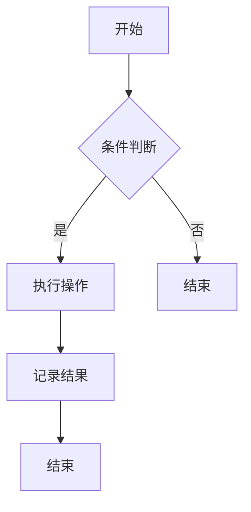

                 

关键词：AI大模型，营销，创新应用，商业价值，算法，数学模型，项目实践，应用场景，未来展望。

> 摘要：随着人工智能技术的不断发展，大模型在各个领域得到了广泛应用，尤其在营销领域，AI大模型的应用为企业和品牌带来了前所未有的商业价值。本文将探讨AI大模型在营销领域的创新应用，分析其算法原理、数学模型、项目实践以及未来发展趋势，旨在为营销从业者提供有益的参考。

## 1. 背景介绍

随着互联网和大数据的快速发展，营销领域正面临着前所未有的变革。传统营销模式已经无法满足现代消费者多样化的需求，企业需要更加精准、高效的方式来触达潜在客户。而AI大模型作为一种强大的数据处理和分析工具，正在逐渐改变营销领域的格局。

AI大模型是指拥有大规模参数和强大计算能力的神经网络模型，如GPT、BERT等。这些模型可以通过海量数据的训练，自动学习并提取数据中的潜在规律，为营销决策提供有力支持。与传统的小型机器学习模型相比，AI大模型具有更高的准确性和泛化能力，能够在复杂、动态的营销环境中发挥作用。

### 1.1. 营销领域面临的挑战

1. 消费者行为复杂多样：随着互联网的发展，消费者获取信息的途径变得更加多样化，消费行为也变得更加复杂。传统的营销方法难以精准地捕捉和分析消费者的需求。
2. 数据量巨大且结构复杂：互联网时代产生了海量数据，包括用户行为数据、交易数据、社交媒体数据等。如何有效地处理和利用这些数据，成为营销领域的一大挑战。
3. 竞争激烈：市场上的竞争日益激烈，企业需要不断创新营销策略，以赢得消费者的关注和忠诚。

### 1.2. AI大模型的优势

1. 高准确性：AI大模型可以通过海量数据的训练，自动学习并提取数据中的潜在规律，为营销决策提供准确的支持。
2. 泛化能力：AI大模型具有较强的泛化能力，能够适应各种不同类型的营销场景，为企业提供定制化的解决方案。
3. 自动化：AI大模型可以自动化处理大量数据，提高营销效率，降低人力成本。

## 2. 核心概念与联系

在探讨AI大模型在营销领域的应用之前，我们需要了解一些核心概念和它们之间的联系。

### 2.1. AI大模型

AI大模型是指拥有大规模参数和强大计算能力的神经网络模型，如GPT、BERT等。这些模型可以通过海量数据的训练，自动学习并提取数据中的潜在规律，为营销决策提供有力支持。

### 2.2. 营销自动化

营销自动化是指利用人工智能技术，自动化执行营销流程，提高营销效率。营销自动化包括多个方面，如客户关系管理（CRM）、电子邮件营销、社交媒体营销等。

### 2.3. 大数据

大数据是指无法用传统数据库工具进行存储、管理和分析的数据集。大数据的来源包括互联网、物联网、社交媒体等。

### 2.4. 营销分析

营销分析是指利用数据分析技术，对营销活动进行评估和优化。营销分析可以帮助企业了解市场趋势、消费者行为和竞争对手动态。

### 2.5. Mermaid流程图

Mermaid是一种用于绘制流程图的Markdown语法，它可以方便地创建各种类型的流程图。以下是一个简单的Mermaid流程图示例：



## 3. 核心算法原理 & 具体操作步骤

### 3.1. 算法原理概述

AI大模型在营销领域的应用主要基于深度学习技术。深度学习是一种通过多层神经网络对数据进行训练和预测的技术。在营销领域，深度学习模型可以用于客户细分、推荐系统、广告投放、客户行为预测等。

### 3.2. 算法步骤详解

1. 数据预处理：首先，需要对原始数据进行清洗、处理和转换，以便模型能够更好地学习。
2. 模型选择：根据营销任务的需求，选择合适的深度学习模型，如卷积神经网络（CNN）、循环神经网络（RNN）、Transformer等。
3. 模型训练：使用预处理后的数据集对模型进行训练，通过不断调整模型参数，使模型能够更好地拟合数据。
4. 模型评估：使用验证集对训练好的模型进行评估，判断模型是否能够满足需求。
5. 模型部署：将训练好的模型部署到生产环境中，对实际数据进行预测和决策。

### 3.3. 算法优缺点

优点：

1. 高准确性：深度学习模型可以通过海量数据的训练，自动学习并提取数据中的潜在规律，为营销决策提供准确的支持。
2. 泛化能力：深度学习模型具有较强的泛化能力，能够适应各种不同类型的营销场景，为企业提供定制化的解决方案。
3. 自动化：深度学习模型可以自动化处理大量数据，提高营销效率，降低人力成本。

缺点：

1. 计算资源消耗大：深度学习模型需要大量的计算资源和时间进行训练。
2. 数据依赖性：深度学习模型的性能高度依赖于数据质量，如果数据存在偏差，可能会导致模型出现偏差。

### 3.4. 算法应用领域

深度学习模型在营销领域的应用非常广泛，主要包括以下几个方面：

1. 客户细分：通过分析客户的行为数据，将客户划分为不同的群体，为每个群体提供个性化的营销策略。
2. 推荐系统：根据用户的历史行为和兴趣，为用户推荐相关产品或服务，提高用户满意度和转化率。
3. 广告投放：通过分析用户的兴趣和行为，将广告精准地投放给潜在客户，提高广告投放效果。
4. 客户行为预测：通过分析用户的历史行为，预测用户的未来行为，为营销决策提供支持。

## 4. 数学模型和公式 & 详细讲解 & 举例说明

在深度学习模型中，数学模型和公式起着核心作用。以下将介绍一些常用的数学模型和公式，并结合具体案例进行讲解。

### 4.1. 数学模型构建

深度学习模型通常由输入层、隐藏层和输出层组成。每个层都包含多个神经元，神经元之间的连接权值通过学习过程进行调整。

假设我们有一个二分类问题，输入层有n个神经元，隐藏层有m个神经元，输出层有1个神经元。我们可以用以下公式表示：

$$
\begin{aligned}
&z^{(2)}_i = \sum_{j=1}^{m} w^{(2)}_{ij} x_j + b^{(2)}_i \\
&a^{(2)}_i = \sigma(z^{(2)}_i) \\
&z^{(3)} = \sum_{i=1}^{m} w^{(3)}_{i} a_i + b^{(3)} \\
&a^{(3)} = \sigma(z^{(3)}) \\
\end{aligned}
$$

其中，$x_j$是输入层的第j个神经元，$w^{(2)}_{ij}$和$b^{(2)}_i$是输入层到隐藏层的连接权值和偏置，$a_i$是隐藏层的第i个神经元，$\sigma$是激活函数，$z^{(3)}$和$a^{(3)}$分别是输出层的神经元。

### 4.2. 公式推导过程

深度学习模型的推导过程主要涉及前向传播和反向传播。

**前向传播：**

在前向传播过程中，我们通过输入层传递输入数据，经过隐藏层和输出层，最终得到输出结果。具体推导过程如下：

$$
\begin{aligned}
&z^{(2)}_i = \sum_{j=1}^{m} w^{(2)}_{ij} x_j + b^{(2)}_i \\
&\quad\quad i = 1, 2, ..., m \\
&a^{(2)}_i = \sigma(z^{(2)}_i) \\
&\quad\quad i = 1, 2, ..., m \\
&z^{(3)} = \sum_{i=1}^{m} w^{(3)}_{i} a_i + b^{(3)} \\
&a^{(3)} = \sigma(z^{(3)}) \\
\end{aligned}
$$

**反向传播：**

在反向传播过程中，我们根据输出层的误差，反向调整隐藏层和输入层的连接权值和偏置。具体推导过程如下：

$$
\begin{aligned}
&\delta^{(3)} = \frac{\partial J}{\partial z^{(3)}} = \frac{\partial J}{\partial a^{(3)}} \cdot \frac{\partial a^{(3)}}{\partial z^{(3)}} \\
&\delta^{(2)}_i = \frac{\partial J}{\partial z^{(2)}_i} = \sum_{j=1}^{m} w^{(3)}_{j} \delta^{(3)}_j \cdot \frac{\partial a^{(2)}_i}{\partial z^{(2)}_i} \\
&w^{(3)}_{i} = w^{(3)}_{i} - \alpha \cdot \delta^{(3)}_i a^{(2)}_i \\
&w^{(2)}_{ij} = w^{(2)}_{ij} - \alpha \cdot \delta^{(2)}_i x_j \\
\end{aligned}
$$

其中，$J$是损失函数，$\alpha$是学习率。

### 4.3. 案例分析与讲解

以下是一个简单的客户细分案例，用于说明深度学习模型在营销领域的应用。

**案例背景：**

一家电商企业希望根据客户的行为数据，将客户划分为不同群体，以便提供个性化的营销策略。

**数据集：**

数据集包含客户的年龄、性别、购买历史、浏览历史等特征，共1000个样本。

**模型构建：**

选择一个二分类问题，使用卷积神经网络（CNN）进行模型构建。

**模型训练：**

使用预处理后的数据集对模型进行训练，通过不断调整模型参数，使模型能够更好地拟合数据。

**模型评估：**

使用验证集对训练好的模型进行评估，判断模型是否能够满足需求。

**模型部署：**

将训练好的模型部署到生产环境中，对实际数据进行预测，将客户划分为不同的群体。

**案例结果：**

通过模型预测，将客户划分为五个不同群体，每个群体的营销策略各不相同。实际应用中，电商企业可以根据不同群体的特点和需求，提供个性化的产品推荐和营销策略，提高用户满意度和转化率。

## 5. 项目实践：代码实例和详细解释说明

为了更好地理解AI大模型在营销领域的应用，我们将通过一个具体的案例进行讲解。

### 5.1. 开发环境搭建

1. 安装Python环境，版本要求3.6及以上。
2. 安装深度学习框架，如TensorFlow或PyTorch。
3. 安装数据处理库，如Pandas、NumPy等。

### 5.2. 源代码详细实现

以下是一个简单的客户细分案例，用于说明深度学习模型在营销领域的应用。

```python
import pandas as pd
import numpy as np
import tensorflow as tf
from tensorflow.keras.models import Sequential
from tensorflow.keras.layers import Dense, Conv2D, Flatten, MaxPooling2D
from tensorflow.keras.optimizers import Adam

# 加载数据集
data = pd.read_csv('customer_data.csv')
X = data.drop('target', axis=1).values
y = data['target'].values

# 数据预处理
X = X / 255.0
X = np.expand_dims(X, axis=-1)

# 划分训练集和验证集
from sklearn.model_selection import train_test_split
X_train, X_val, y_train, y_val = train_test_split(X, y, test_size=0.2, random_state=42)

# 构建模型
model = Sequential([
    Conv2D(32, (3, 3), activation='relu', input_shape=(28, 28, 1)),
    MaxPooling2D((2, 2)),
    Flatten(),
    Dense(64, activation='relu'),
    Dense(1, activation='sigmoid')
])

# 编译模型
model.compile(optimizer=Adam(learning_rate=0.001), loss='binary_crossentropy', metrics=['accuracy'])

# 训练模型
model.fit(X_train, y_train, epochs=10, batch_size=32, validation_data=(X_val, y_val))

# 评估模型
loss, accuracy = model.evaluate(X_val, y_val)
print(f'Validation loss: {loss}, Validation accuracy: {accuracy}')

# 预测新数据
new_data = np.expand_dims(new_data / 255.0, axis=-1)
prediction = model.predict(new_data)
```

### 5.3. 代码解读与分析

1. **数据加载与预处理**：首先，我们使用Pandas库加载数据集，并进行归一化处理，以便模型能够更好地学习。
2. **划分训练集和验证集**：使用scikit-learn库中的train_test_split函数，将数据集划分为训练集和验证集，用于模型训练和评估。
3. **构建模型**：我们使用TensorFlow的Sequential模型构建一个简单的卷积神经网络，包括卷积层、池化层、全连接层和输出层。
4. **编译模型**：使用Adam优化器和binary_crossentropy损失函数编译模型。
5. **训练模型**：使用fit函数对模型进行训练，并通过validation_data参数对验证集进行评估。
6. **评估模型**：使用evaluate函数对验证集进行评估，输出损失和准确率。
7. **预测新数据**：使用predict函数对新的数据进行预测。

通过这个简单的案例，我们可以看到AI大模型在营销领域的应用是如何实现的。

## 6. 实际应用场景

AI大模型在营销领域的应用场景非常广泛，以下列举几个典型的应用场景：

### 6.1. 客户细分

通过分析客户的行为数据，AI大模型可以将客户划分为不同的群体，为每个群体提供个性化的营销策略。例如，电商企业可以根据客户的购买历史和浏览行为，将客户划分为高价值客户、潜力客户和普通客户，为不同类型的客户提供不同的产品推荐和优惠策略。

### 6.2. 广告投放

AI大模型可以帮助企业进行精准的广告投放。通过分析用户的兴趣和行为，AI大模型可以将广告精准地投放给潜在客户，提高广告的投放效果。例如，一家在线教育平台可以使用AI大模型分析用户的兴趣和学习行为，将广告投放给对在线教育感兴趣的用户，提高广告的转化率。

### 6.3. 客户服务

AI大模型可以用于智能客服系统，通过自然语言处理技术，理解和解答用户的提问，提高客户服务效率。例如，一家电商企业可以使用AI大模型构建智能客服系统，实时回答用户的购物咨询和问题，提高用户满意度。

### 6.4. 个性化推荐

AI大模型可以用于构建个性化推荐系统，根据用户的兴趣和行为，为用户推荐相关产品或服务。例如，一家电商企业可以使用AI大模型分析用户的购物历史和浏览行为，为用户推荐符合其兴趣的产品，提高用户的购买意愿。

## 7. 未来应用展望

随着人工智能技术的不断发展，AI大模型在营销领域的应用前景非常广阔。以下是对未来应用的展望：

### 7.1. 智能化营销策略

AI大模型可以帮助企业实现智能化营销策略，通过分析海量数据，自动调整营销策略，提高营销效果。例如，企业可以使用AI大模型实时监测市场动态，根据市场需求和竞争情况，自动调整广告投放策略。

### 7.2. 个性化服务

AI大模型可以为企业提供个性化服务，根据客户的兴趣和行为，提供个性化的产品推荐和营销策略。例如，企业可以使用AI大模型分析客户的购买历史和浏览行为，为每个客户提供定制化的购物体验。

### 7.3. 智能决策支持

AI大模型可以为企业的营销决策提供有力支持，通过分析海量数据，预测市场趋势和客户需求，帮助企业制定科学的营销策略。例如，企业可以使用AI大模型预测产品销售趋势，提前调整库存和供应链。

### 7.4. 智能客服

随着人工智能技术的不断发展，智能客服系统将变得更加智能和高效，可以更好地满足客户的多样化需求。例如，企业可以使用AI大模型构建智能客服系统，实现实时语音识别、自然语言理解和智能回答，提供高质量的客户服务。

## 8. 工具和资源推荐

为了更好地掌握AI大模型在营销领域的应用，以下推荐一些学习和开发工具：

### 8.1. 学习资源推荐

1. **《深度学习》（Goodfellow et al., 2016）**：这是一本经典的深度学习入门教材，详细介绍了深度学习的理论基础和应用。
2. **《Python深度学习》（Raschka and Lutz，2018）**：这本书通过实际案例和代码示例，介绍了如何使用Python进行深度学习开发。
3. **《营销自动化实战》（张小龙，2020）**：这本书详细介绍了营销自动化的原理和应用，对营销从业者非常有帮助。

### 8.2. 开发工具推荐

1. **TensorFlow**：Google开发的深度学习框架，适用于各种深度学习任务。
2. **PyTorch**：Facebook开发的深度学习框架，具有灵活的动态计算图，适用于研究和个人项目。
3. **Keras**：基于TensorFlow和Theano的高层次神经网络API，简化了深度学习模型的搭建和训练。

### 8.3. 相关论文推荐

1. **“A Theoretically Grounded Application of Dropout in Recurrent Neural Networks”（Yarin et al., 2016）**：这篇论文介绍了如何将Dropout技术应用于循环神经网络，提高了模型的泛化能力。
2. **“Attention Is All You Need”（Vaswani et al., 2017）**：这篇论文提出了Transformer模型，改变了自然语言处理领域的格局。
3. **“Recurrent Neural Network Regularization”（Zhang et al., 2017）**：这篇论文探讨了如何使用门控循环单元（GRU）和长短期记忆（LSTM）模型，提高模型的训练效果和泛化能力。

## 9. 总结：未来发展趋势与挑战

AI大模型在营销领域的应用已经取得了显著的成果，未来将继续发挥重要作用。随着人工智能技术的不断发展，AI大模型将变得更加智能和高效，为企业和品牌带来更多的商业价值。

然而，AI大模型在营销领域的应用也面临一些挑战。首先，数据质量和数据隐私问题是一个重要挑战。其次，如何提高模型的泛化能力，使其能够适应各种不同的营销场景，也是一个亟待解决的问题。

未来，我们需要继续加强对AI大模型的研究，提高其在营销领域的应用效果。同时，我们也需要关注数据安全和隐私保护，确保AI大模型的应用不会对个人隐私造成侵犯。

总之，AI大模型在营销领域的应用前景非常广阔，随着技术的不断发展，我们将看到更多的创新和突破。

## 附录：常见问题与解答

### 问题1：AI大模型在营销领域的应用效果如何？

答：AI大模型在营销领域的应用效果非常显著。通过分析海量数据，AI大模型可以帮助企业实现精准营销，提高营销效率。例如，通过客户细分和个性化推荐，企业可以更好地满足客户需求，提高客户满意度和转化率。此外，AI大模型还可以用于广告投放优化、客户行为预测等，为企业提供有力的营销决策支持。

### 问题2：AI大模型需要大量的计算资源吗？

答：是的，AI大模型通常需要大量的计算资源进行训练和推理。特别是对于大规模的深度学习模型，如GPT和BERT，它们需要高性能的GPU或TPU进行加速训练。此外，模型的推理过程也需要计算资源，尤其是在实时应用场景中，如智能客服和广告投放。

### 问题3：如何确保AI大模型的隐私保护？

答：确保AI大模型的隐私保护是一个重要且复杂的问题。首先，企业在收集和使用数据时需要遵循相关法律法规，如《通用数据保护条例》（GDPR）等。其次，可以采用数据脱敏和加密技术，对敏感信息进行保护。此外，还可以采用差分隐私技术，对模型的输出进行扰动，以降低隐私泄露的风险。

### 问题4：AI大模型在营销领域有哪些常见的应用场景？

答：AI大模型在营销领域有许多常见的应用场景，包括：

1. **客户细分**：通过分析客户行为数据，将客户划分为不同的群体，为每个群体提供个性化的营销策略。
2. **推荐系统**：根据用户的历史行为和兴趣，为用户推荐相关产品或服务。
3. **广告投放**：通过分析用户的兴趣和行为，将广告精准地投放给潜在客户。
4. **客户服务**：构建智能客服系统，实时回答客户的提问。
5. **个性化推荐**：根据用户的兴趣和行为，为用户推荐符合其需求的产品或服务。

### 问题5：AI大模型在营销领域的未来发展有哪些趋势？

答：AI大模型在营销领域的未来发展有以下几个趋势：

1. **智能化营销策略**：AI大模型将实现更加智能化的营销策略，通过分析海量数据，自动调整营销策略。
2. **个性化服务**：AI大模型将为企业提供个性化服务，根据客户的兴趣和行为，提供定制化的购物体验。
3. **智能决策支持**：AI大模型将为企业的营销决策提供有力支持，通过分析市场动态和客户需求，帮助企业制定科学的营销策略。
4. **隐私保护**：随着数据隐私保护意识的增强，AI大模型在营销领域的应用将更加注重隐私保护。
5. **实时性**：AI大模型将实现更高的实时性，特别是在实时广告投放和智能客服等场景中。

