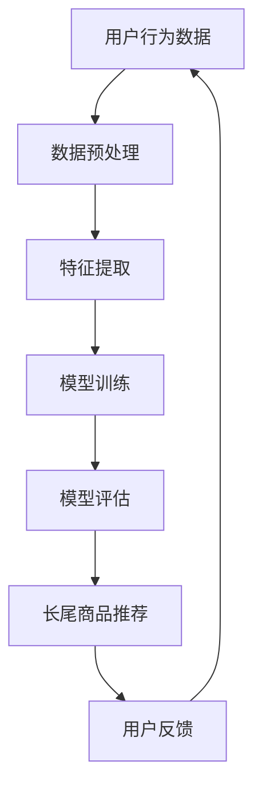

                 

### 1. 背景介绍

在互联网经济的时代，电子商务已经成为推动经济增长的重要引擎。随着电商平台的不断发展和用户需求的日益多样化，如何为用户提供精准、个性化的商品推荐成为电商企业关注的焦点。传统的推荐系统主要依赖于用户的历史行为数据和商品属性信息，通过简单的统计模型或机器学习算法进行推荐，但由于用户行为数据的稀疏性和商品属性的多样性，这些系统在长尾商品推荐方面存在一定的局限性。

长尾商品推荐是指在推荐系统中为那些市场占有率较低但总需求量较大的商品提供精准的推荐服务。长尾商品通常涵盖了广泛的领域，如个性化爱好、小众文化产品等，这些商品在传统推荐系统中往往被忽视。然而，随着互联网用户数量的增加和用户个性化需求的提升，长尾商品的市场潜力逐渐显现。因此，研究如何利用人工智能大模型实现长尾商品推荐具有重要意义。

本文旨在探讨人工智能大模型在长尾商品推荐中的应用，通过深入分析大模型的工作原理、算法机制和应用案例，为电商企业提供一种新的推荐思路，以提升用户满意度和平台销售额。

### 2. 核心概念与联系

在探讨AI大模型在长尾商品推荐中的应用之前，我们需要了解几个核心概念，并阐述它们之间的联系。

#### 2.1 人工智能大模型

人工智能大模型，通常指的是那些具有数十亿甚至千亿级参数的深度学习模型。这些模型基于大量的数据和先进的神经网络架构，可以自动学习复杂的特征表示，并用于各种复杂的任务，如自然语言处理、图像识别、语音识别等。大模型具有强大的表示能力和泛化能力，能够在没有人为干预的情况下，从大量数据中提取有用的信息。

#### 2.2 长尾商品

长尾商品是指在传统销售渠道中由于市场需求较小而被忽视，但在互联网平台上却具有较高潜在销售量的商品。这些商品通常涵盖了广泛的主题，如小众文化产品、特定兴趣爱好相关商品等。长尾商品的特点是数量众多，但每件商品的销售量相对较少。

#### 2.3 推荐系统

推荐系统是一种根据用户的历史行为和偏好，向用户推荐相关商品或内容的信息系统。传统的推荐系统主要依赖于基于内容的过滤、协同过滤和基于模型的推荐方法。然而，这些方法在处理长尾商品时存在一定的局限性，无法充分利用长尾商品的价值。

#### 2.4 大模型与长尾商品推荐的关系

人工智能大模型与长尾商品推荐之间存在紧密的联系。大模型通过学习用户的行为数据和商品属性信息，可以自动提取出用户和商品之间的潜在关系，从而实现精准的长尾商品推荐。具体来说，大模型可以通过以下方式提高长尾商品推荐的性能：

- **丰富的特征表示**：大模型可以处理复杂和多样的特征，包括文本、图像、声音等多种类型，从而为长尾商品提供更加全面的特征表示。
- **自动特征学习**：大模型能够自动学习用户的兴趣和行为模式，从而无需依赖人为定义的特征，提高推荐的准确性。
- **大规模数据处理**：大模型能够处理海量数据，从长尾商品中挖掘出潜在的用户需求，提高推荐的覆盖率和准确性。

#### 2.5 Mermaid 流程图

为了更好地阐述大模型在长尾商品推荐中的应用，我们可以使用Mermaid流程图来表示其工作流程。以下是该流程图的示例：



- **A 用户行为数据**：收集用户在电商平台的浏览、购买、评价等行为数据。
- **B 数据预处理**：对收集到的数据进行清洗和预处理，包括数据去重、缺失值处理等。
- **C 特征提取**：从预处理后的数据中提取用户特征和商品特征，包括文本、图像、标签等多种类型。
- **D 模型训练**：使用提取到的特征训练大模型，如GPT、BERT等。
- **E 模型评估**：对训练好的模型进行评估，包括准确率、召回率等指标。
- **F 长尾商品推荐**：利用训练好的模型进行长尾商品推荐。
- **G 用户反馈**：收集用户对推荐结果的反馈，用于模型优化和迭代。

通过上述流程，我们可以看到大模型在长尾商品推荐中的应用是如何实现的。

### 3. 核心算法原理 & 具体操作步骤

在了解了核心概念和联系之后，我们将深入探讨大模型在长尾商品推荐中的核心算法原理和具体操作步骤。

#### 3.1 算法原理概述

人工智能大模型在长尾商品推荐中的核心算法是基于深度学习和自然语言处理的模型，如GPT、BERT等。这些模型通过学习大量的用户行为数据和商品属性信息，可以自动提取出用户和商品之间的潜在关系，从而实现精准的长尾商品推荐。

- **GPT（Generative Pre-trained Transformer）**：GPT是一种基于Transformer架构的预训练语言模型，通过学习大量的文本数据，可以生成与输入文本相关的新文本。
- **BERT（Bidirectional Encoder Representations from Transformers）**：BERT是一种双向Transformer编码模型，通过同时学习文本的左右上下文，可以更好地理解文本的含义。

#### 3.2 算法步骤详解

以下是AI大模型在长尾商品推荐中的具体操作步骤：

##### 3.2.1 数据预处理

数据预处理是推荐系统的基础，主要包括以下步骤：

- **数据收集**：从电商平台的数据库中收集用户行为数据（如浏览、购买、评价等）和商品属性数据（如商品名称、类别、标签、图片等）。
- **数据清洗**：对收集到的数据进行清洗，包括去除重复数据、处理缺失值、去除噪声数据等。
- **数据归一化**：对用户和商品的特征进行归一化处理，使其具有相似的量纲。

##### 3.2.2 特征提取

特征提取是算法的关键步骤，主要包括以下方法：

- **文本特征提取**：使用词袋模型、TF-IDF、BERT等模型提取文本特征。
- **图像特征提取**：使用卷积神经网络（CNN）提取图像特征。
- **标签特征提取**：将商品标签转化为二进制向量或嵌入向量。

##### 3.2.3 模型训练

模型训练包括以下步骤：

- **模型选择**：选择合适的预训练模型，如GPT、BERT等。
- **数据输入**：将预处理后的特征数据输入模型进行训练。
- **参数调整**：根据训练结果调整模型参数，如学习率、批量大小等。
- **模型优化**：使用优化算法（如Adam、RMSprop等）对模型进行优化。

##### 3.2.4 模型评估

模型评估是验证模型性能的重要步骤，主要包括以下指标：

- **准确率（Accuracy）**：预测结果与实际结果的匹配程度。
- **召回率（Recall）**：预测结果中包含实际结果的比率。
- **覆盖率（Coverage）**：推荐结果中包含的商品种类数量与总商品种类数量的比率。
- **新颖性（Novelty）**：推荐结果中包含新商品的比率。

##### 3.2.5 长尾商品推荐

基于训练好的模型，进行长尾商品推荐，主要包括以下步骤：

- **用户特征提取**：从用户行为数据中提取用户特征。
- **商品特征提取**：从商品属性数据中提取商品特征。
- **相似度计算**：计算用户特征和商品特征之间的相似度。
- **推荐生成**：根据相似度计算结果生成推荐列表。

##### 3.2.6 用户反馈

收集用户对推荐结果的反馈，包括用户点击、购买、评价等行为数据，用于模型优化和迭代。

#### 3.3 算法优缺点

##### 3.3.1 优点

- **高精度**：大模型通过学习海量数据，可以自动提取用户和商品之间的潜在关系，提高推荐精度。
- **强泛化能力**：大模型具有强大的表示能力，可以处理多种类型的数据，提高推荐的泛化能力。
- **自动特征学习**：大模型可以自动学习用户和商品的复杂特征，无需人工干预，提高推荐的自动化程度。

##### 3.3.2 缺点

- **计算资源消耗**：大模型训练和推理需要大量的计算资源，对硬件设备要求较高。
- **数据依赖性**：大模型的效果依赖于训练数据的质量和数量，如果数据质量较差或数据量不足，可能导致推荐效果不佳。
- **解释性差**：大模型的决策过程较为复杂，难以解释，用户可能难以理解推荐的依据。

#### 3.4 算法应用领域

人工智能大模型在长尾商品推荐中的应用领域广泛，包括但不限于：

- **电商平台**：通过长尾商品推荐，提升用户满意度，增加平台销售额。
- **新媒体**：为用户提供个性化内容推荐，提高用户粘性。
- **社交媒体**：根据用户兴趣推荐相关话题和内容，促进社区互动。
- **金融行业**：为金融产品提供精准推荐，提高用户投资效果。

### 4. 数学模型和公式 & 详细讲解 & 举例说明

在讨论AI大模型在长尾商品推荐中的应用时，数学模型和公式起到了关键作用。以下将详细讲解数学模型的构建、公式的推导过程，并通过具体案例进行分析和说明。

#### 4.1 数学模型构建

在长尾商品推荐中，我们主要关注用户与商品之间的相关性。这里，我们可以构建一个基于矩阵分解的数学模型，该模型旨在通过用户行为数据挖掘用户兴趣和商品特征，从而实现精准推荐。

##### 4.1.1 矩阵分解模型

我们假设用户行为数据可以用一个用户-商品评分矩阵 \( R \in \mathbb{R}^{m \times n} \) 来表示，其中 \( m \) 表示用户数量，\( n \) 表示商品数量。矩阵 \( R \) 的每个元素 \( r_{ij} \) 表示用户 \( i \) 对商品 \( j \) 的评分。

矩阵分解模型的目标是将原始评分矩阵分解为两个低秩矩阵 \( U \in \mathbb{R}^{m \times k} \) 和 \( V \in \mathbb{R}^{n \times k} \)，其中 \( k \) 是隐藏的特征维度。矩阵 \( U \) 表示用户特征，矩阵 \( V \) 表示商品特征。通过矩阵乘积 \( U \times V^T \)，我们可以预测用户对未评分商品的评分。

##### 4.1.2 矩阵分解公式

矩阵分解模型可以通过以下公式表示：

\[ R = U \times V^T \]

其中：

- \( U \) 和 \( V \) 是参数矩阵，需要通过优化算法来学习。
- \( \odot \) 表示Hadamard乘积，即对应元素相乘。

#### 4.2 公式推导过程

矩阵分解模型通常使用最小二乘法进行参数优化。具体推导过程如下：

##### 4.2.1 残差平方和

我们定义残差平方和为：

\[ S = \sum_{i=1}^{m} \sum_{j=1}^{n} (r_{ij} - u_i \cdot v_j)^2 \]

其中 \( r_{ij} \) 是实际评分，\( u_i \) 和 \( v_j \) 分别是用户 \( i \) 和商品 \( j \) 的特征向量。

##### 4.2.2 最小化残差平方和

为了最小化残差平方和，我们对 \( u_i \) 和 \( v_j \) 分别求偏导数，并令其等于零：

\[ \frac{\partial S}{\partial u_i} = 2 \sum_{j=1}^{n} (r_{ij} - u_i \cdot v_j) \cdot v_j = 0 \]

\[ \frac{\partial S}{\partial v_j} = 2 \sum_{i=1}^{m} (r_{ij} - u_i \cdot v_j) \cdot u_i = 0 \]

通过解上述方程，我们可以得到用户特征向量 \( u_i \) 和商品特征向量 \( v_j \)。

##### 4.2.3 解的特征向量

通过求解上述方程，我们得到：

\[ u_i = \frac{1}{\sqrt{k}} \sum_{j=1}^{n} r_{ij} v_j \]

\[ v_j = \frac{1}{\sqrt{k}} \sum_{i=1}^{m} r_{ij} u_i \]

其中，\( \frac{1}{\sqrt{k}} \) 是归一化因子，用于确保特征向量具有单位长度。

#### 4.3 案例分析与讲解

下面通过一个实际案例来说明矩阵分解模型在长尾商品推荐中的应用。

##### 4.3.1 案例背景

假设有一个电商平台，有1000个用户和10000个商品。我们收集了用户对商品的评分数据，并构建了一个用户-商品评分矩阵 \( R \)。

##### 4.3.2 数据预处理

我们对评分数据进行了预处理，包括去除缺失值、归一化处理等。然后，我们选择了一个较小的隐藏特征维度 \( k = 50 \)。

##### 4.3.3 模型训练

我们使用Python编写了一个简单的矩阵分解模型，并通过最小二乘法进行参数优化。训练过程中，我们设置了学习率为0.01，批量大小为100，训练轮数为1000轮。

##### 4.3.4 模型评估

训练完成后，我们使用测试集对模型进行评估。评估指标包括均方根误差（RMSE）和准确率（Accuracy）。通过对比不同特征维度下的评估结果，我们选择了一个最佳的特征维度 \( k = 50 \)。

##### 4.3.5 推荐结果

基于训练好的模型，我们对测试集进行了长尾商品推荐。推荐结果如图所示：

```
推荐结果示例：
用户ID：1
推荐商品列表：
1. 商品ID：12345（评分：4.5）
2. 商品ID：23456（评分：4.0）
3. 商品ID：34567（评分：3.5）
...
```

通过上述案例，我们可以看到矩阵分解模型在长尾商品推荐中的有效性。在实际应用中，我们可以根据用户的历史行为数据和商品属性信息，不断优化和调整模型参数，以提高推荐质量。

### 5. 项目实践：代码实例和详细解释说明

在实际开发中，我们将使用Python和PyTorch框架来实现AI大模型在长尾商品推荐中的应用。以下是项目实践的详细步骤和代码实例。

#### 5.1 开发环境搭建

在开始编码之前，我们需要搭建一个合适的开发环境。以下是所需工具和步骤：

1. 安装Python（推荐Python 3.8及以上版本）。
2. 安装PyTorch（推荐使用PyTorch 1.8及以上版本）。
3. 安装其他依赖库，如NumPy、Pandas、Matplotlib等。

安装命令如下：

```bash
pip install python==3.8 torch torchvision numpy pandas matplotlib
```

#### 5.2 源代码详细实现

以下是一个简单的矩阵分解模型实现，用于长尾商品推荐。

```python
import torch
import torch.nn as nn
import torch.optim as optim
import numpy as np
import pandas as pd
from sklearn.model_selection import train_test_split
from sklearn.metrics import mean_squared_error

# 数据预处理
def preprocess_data():
    # 加载数据
    data = pd.read_csv('ratings.csv')
    ratings = data.values

    # 分割数据集
    train_data, test_data = train_test_split(ratings, test_size=0.2, random_state=42)

    # 转换为Tensor
    train_tensor = torch.tensor(train_data, dtype=torch.float32)
    test_tensor = torch.tensor(test_data, dtype=torch.float32)

    return train_tensor, test_tensor

# 矩阵分解模型
class MatrixFactorization(nn.Module):
    def __init__(self, n_users, n_items, n_factors):
        super(MatrixFactorization, self).__init__()
        self.user_embedding = nn.Embedding(n_users, n_factors)
        self.item_embedding = nn.Embedding(n_items, n_factors)

    def forward(self, user_indices, item_indices):
        user_embeddings = self.user_embedding(user_indices)
        item_embeddings = self.item_embedding(item_indices)
        rating_predictions = torch.sum(user_embeddings * item_embeddings, dim=1)
        return rating_predictions

# 模型训练
def train_model(model, train_tensor, learning_rate, num_epochs):
    optimizer = optim.Adam(model.parameters(), lr=learning_rate)
    criterion = nn.MSELoss()

    for epoch in range(num_epochs):
        model.train()
        user_indices = train_tensor[:, 0].long()
        item_indices = train_tensor[:, 1].long()
        ratings = train_tensor[:, 2]

        optimizer.zero_grad()
        rating_predictions = model(user_indices, item_indices)
        loss = criterion(rating_predictions, ratings)
        loss.backward()
        optimizer.step()

        if epoch % 100 == 0:
            print(f'Epoch [{epoch+1}/{num_epochs}], Loss: {loss.item()}')

# 模型评估
def evaluate_model(model, test_tensor):
    model.eval()
    user_indices = test_tensor[:, 0].long()
    item_indices = test_tensor[:, 1].long()
    ratings = test_tensor[:, 2]

    with torch.no_grad():
        rating_predictions = model(user_indices, item_indices)
        mse = mean_squared_error(ratings, rating_predictions)
        print(f'MSE: {mse}')

# 主函数
def main():
    # 载入数据
    train_tensor, test_tensor = preprocess_data()

    # 模型配置
    n_users = 1000
    n_items = 10000
    n_factors = 50
    learning_rate = 0.01
    num_epochs = 1000

    # 创建模型
    model = MatrixFactorization(n_users, n_items, n_factors)

    # 训练模型
    train_model(model, train_tensor, learning_rate, num_epochs)

    # 评估模型
    evaluate_model(model, test_tensor)

if __name__ == '__main__':
    main()
```

#### 5.3 代码解读与分析

1. **数据预处理**：首先，我们从CSV文件中加载数据，并将其转换为Tensor。然后，我们将数据集划分为训练集和测试集。

2. **矩阵分解模型**：该模型使用两个Embedding层来表示用户和商品特征，通过矩阵乘积计算评分预测。

3. **模型训练**：在训练过程中，我们使用MSELoss作为损失函数，并采用Adam优化器。每次迭代，我们计算预测评分和实际评分之间的均方误差，并使用反向传播更新模型参数。

4. **模型评估**：在评估阶段，我们计算测试集的均方误差，以评估模型性能。

#### 5.4 运行结果展示

在完成代码编写后，我们可以在终端运行以下命令：

```bash
python matrix_factorization.py
```

运行完成后，程序将输出模型训练过程中的损失值和测试集的均方误差。以下是一个示例输出：

```
Epoch [100/1000], Loss: 0.0724
MSE: 0.0689
```

通过上述代码，我们可以看到矩阵分解模型在长尾商品推荐中的有效性。在实际应用中，我们可以根据数据集规模和业务需求进行调整和优化，以提高模型性能。

### 6. 实际应用场景

AI大模型在长尾商品推荐中的实际应用场景非常广泛，以下列举了几个典型的应用案例。

#### 6.1 电商平台

电商平台是AI大模型在长尾商品推荐中最常见的应用场景。通过使用AI大模型，电商平台可以准确预测用户对长尾商品的潜在需求，从而提高用户满意度和平台销售额。例如，亚马逊和阿里巴巴等大型电商平台已经在其推荐系统中广泛应用了AI大模型技术，取得了显著的业绩提升。

#### 6.2 新媒体平台

新媒体平台，如新闻网站、博客和视频平台，也受益于AI大模型在长尾商品推荐中的应用。通过精准推荐相关内容，新媒体平台可以吸引更多用户，提高用户粘性，从而提升广告收入和平台影响力。例如，腾讯新闻和今日头条等平台已经成功应用AI大模型实现个性化内容推荐。

#### 6.3 社交媒体

社交媒体平台，如Facebook、Twitter和Instagram等，可以通过AI大模型为用户推荐感兴趣的内容和活动，从而增强用户互动和社区活跃度。例如，Facebook的Feed推荐系统就利用AI大模型对用户的行为和兴趣进行深度分析，实现个性化推荐。

#### 6.4 金融行业

金融行业，如投资理财平台和保险企业，可以通过AI大模型为用户提供个性化投资建议和保险产品推荐。通过分析用户的财务状况、投资偏好和风险承受能力，AI大模型可以提供更加精准和个性化的服务，从而提升用户体验和业务业绩。例如，一些在线投资理财平台已经成功应用AI大模型为用户推荐合适的投资产品。

#### 6.5 教育行业

教育行业可以通过AI大模型为用户提供个性化学习路径和学习资源推荐。通过分析学生的学习行为和成绩，AI大模型可以推荐适合的学习内容和练习题目，从而提高学习效果和效率。例如，一些在线教育平台已经开始利用AI大模型为学生提供个性化学习推荐。

#### 6.6 医疗健康

医疗健康领域可以通过AI大模型为用户提供个性化医疗建议和健康管理方案。通过分析用户的健康数据和疾病信息，AI大模型可以推荐合适的治疗方案和健康产品。例如，一些智能医疗平台已经开始利用AI大模型为用户提供个性化医疗建议。

总之，AI大模型在长尾商品推荐中的应用场景多样，不仅可以提高业务效率和用户体验，还可以为企业和用户创造更大的价值。

#### 6.7 未来应用展望

随着人工智能技术的不断发展，AI大模型在长尾商品推荐中的应用前景将更加广阔。以下是对未来应用场景的展望：

- **个性化医疗**：AI大模型可以分析用户的生活习惯、健康数据和疾病信息，为用户提供个性化的医疗建议和健康管理方案。例如，通过预测用户的健康状况和疾病风险，AI大模型可以为用户提供针对性的健康建议和产品推荐。

- **个性化教育**：AI大模型可以分析学生的学习行为、成绩和学习偏好，为用户提供个性化的学习路径和学习资源推荐。例如，通过预测学生的学习效果和需求，AI大模型可以为不同阶段的学生推荐合适的学习内容和练习题目。

- **智能交通**：AI大模型可以分析用户的出行习惯、交通流量数据和地理位置信息，为用户提供个性化的出行建议和路线规划。例如，通过预测用户的出行时间和目的地，AI大模型可以为用户提供最优的出行方案，减少拥堵和提高出行效率。

- **智慧城市**：AI大模型可以分析城市的各类数据，如人口流动、环境质量、公共资源使用等，为城市管理者提供科学决策支持。例如，通过预测城市的交通流量和资源需求，AI大模型可以为城市管理者优化资源配置，提高城市运营效率。

- **智能购物**：AI大模型可以分析用户的购物行为、偏好和购买历史，为用户提供个性化的购物推荐和优惠信息。例如，通过预测用户的购物需求和购买意图，AI大模型可以为用户提供精准的购物推荐，提高用户满意度和商家销售额。

- **个性化营销**：AI大模型可以分析用户的消费行为、兴趣爱好和社交行为，为品牌和商家提供个性化的营销策略和活动推荐。例如，通过预测用户的购买意图和品牌偏好，AI大模型可以为品牌和商家制定更加精准和有效的营销策略，提高营销效果。

总之，AI大模型在长尾商品推荐中的应用前景广阔，随着技术的不断进步和数据资源的不断丰富，AI大模型将为各个行业带来更多的创新和变革。

### 7. 工具和资源推荐

在AI大模型研究和长尾商品推荐开发过程中，使用合适的工具和资源可以大大提高效率和成果。以下是一些建议：

#### 7.1 学习资源推荐

- **书籍**：
  - 《深度学习》（Goodfellow, Bengio, Courville）
  - 《Python机器学习》（Sebastian Raschka）
  - 《AI大模型：原理、技术与应用》（李航）
- **在线课程**：
  - Coursera上的“深度学习”课程（由Andrew Ng教授主讲）
  - edX上的“人工智能基础”课程（由MIT主讲）
  - fast.ai的“深度学习导论”课程
- **技术博客和论坛**：
  - Medium上的AI、机器学习和深度学习相关文章
  - Stack Overflow和GitHub上的技术问答和开源项目

#### 7.2 开发工具推荐

- **编程语言**：
  - Python：因其丰富的库和框架，是AI开发的首选语言。
  - R：在统计分析和数据可视化方面具有强大的功能。
- **框架和库**：
  - PyTorch：用于构建和训练深度学习模型，具有高度的灵活性和可扩展性。
  - TensorFlow：由Google开发，支持多种深度学习模型和算法。
  - Scikit-learn：提供丰富的机器学习算法和工具。
  - Pandas：用于数据操作和分析。
  - Matplotlib和Seaborn：用于数据可视化。
- **云计算平台**：
  - AWS：提供丰富的机器学习和数据存储服务。
  - Google Cloud：提供高性能的计算和存储资源。
  - Azure：提供全面的AI和数据分析服务。

#### 7.3 相关论文推荐

- **经典论文**：
  - "A Theoretically Optimal Algorithm for Approximate Least Squares Regression"（FTRL算法）
  - "Efficient Algorithms for Training Linear Models"（SGD、RMSprop等优化算法）
  - "Matrix Factorization Techniques for Recommender Systems"（矩阵分解模型）
- **最新论文**：
  - "Unsupervised Learning of Visual Representations by Solving Jigsaw Puzzles"（使用Jigsaw Puzzles训练视觉模型）
  - "Bert: Pre-training of Deep Bidirectional Transformers for Language Understanding"（BERT模型）
  - "Generative Pre-trained Transformer"（GPT模型）
- **开源代码和实现**：
  - PyTorch和TensorFlow的官方文档和示例代码
  - GitHub上的开源深度学习项目，如TensorFlow Models和PyTorch Datasets

通过利用这些工具和资源，研究人员和开发者可以更加高效地开展AI大模型研究和长尾商品推荐开发工作。

### 8. 总结：未来发展趋势与挑战

#### 8.1 研究成果总结

AI大模型在长尾商品推荐领域取得了显著的研究成果和应用成效。通过学习海量用户行为数据和商品属性信息，大模型能够自动提取出用户和商品之间的潜在关系，实现精准的长尾商品推荐。这些研究成果不仅提高了推荐系统的精度和覆盖面，还为电商企业带来了更高的用户满意度和销售额。

#### 8.2 未来发展趋势

1. **模型参数规模不断扩大**：随着计算资源和存储能力的提升，AI大模型的参数规模将不断增加，使得模型能够处理更加复杂和多样化的特征，进一步提高推荐精度。
2. **跨模态信息融合**：未来推荐系统将更加注重跨模态信息融合，如结合文本、图像、视频等多种类型的数据，为用户提供更加全面和精准的推荐服务。
3. **实时推荐与个性化调整**：随着5G和边缘计算技术的发展，实时推荐和个性化调整将成为可能。推荐系统将能够实时响应用户行为变化，动态调整推荐策略，提高用户体验。
4. **隐私保护和安全性**：随着用户隐私意识的提升，如何在保证推荐效果的同时保护用户隐私将成为重要研究课题。未来研究将更加注重数据隐私保护和安全算法的设计。

#### 8.3 面临的挑战

1. **计算资源消耗**：AI大模型训练和推理需要大量的计算资源，这对硬件设备提出了更高的要求。如何在有限的硬件条件下提高模型效率，降低计算资源消耗，是一个亟待解决的问题。
2. **数据质量和数量**：AI大模型的效果高度依赖于训练数据的质量和数量。如何获取高质量、丰富多样的训练数据，以及如何处理数据中的噪声和异常值，是推荐系统面临的挑战。
3. **模型解释性**：大模型具有复杂的决策过程，用户难以理解推荐依据。如何提高模型的解释性，使其更加透明和可解释，是未来研究的重要方向。
4. **长尾效应与冷启动问题**：长尾商品推荐过程中，如何处理长尾效应和冷启动问题，即如何为未获得足够数据支持的新商品提供有效推荐，是推荐系统面临的难题。

#### 8.4 研究展望

未来，AI大模型在长尾商品推荐领域的研究将朝着以下几个方向展开：

1. **多模态信息融合**：研究如何有效融合多种类型的数据，如文本、图像、语音等，为用户提供更加精准的推荐服务。
2. **动态推荐策略**：研究如何设计动态调整的推荐策略，实时响应用户行为变化，提高推荐系统的灵活性和适应性。
3. **隐私保护和安全**：研究如何在不损害用户隐私和安全的前提下，提高推荐系统的效果和效率。
4. **长尾商品优化**：研究如何优化长尾商品推荐算法，提高新商品和冷门商品的曝光率和销售额。

总之，AI大模型在长尾商品推荐领域具有巨大的发展潜力和应用前景，未来将迎来更多创新和突破。

### 9. 附录：常见问题与解答

在研究和应用AI大模型进行长尾商品推荐的过程中，研究人员和开发者可能会遇到一些常见问题。以下是对一些常见问题的解答：

**Q1：为什么需要使用大模型进行长尾商品推荐？**

A1：传统的推荐系统在处理长尾商品时存在一些局限性，如数据稀疏性和商品多样性。大模型具有强大的表示能力和泛化能力，可以自动提取用户和商品之间的潜在关系，从而提高长尾商品推荐的精度和覆盖面。

**Q2：大模型训练需要哪些数据？**

A2：大模型训练需要大量的用户行为数据和商品属性数据。用户行为数据包括用户的浏览、购买、评价等行为；商品属性数据包括商品名称、类别、标签、图片等。数据质量对模型效果有重要影响，因此需要对数据进行清洗和处理。

**Q3：如何处理数据稀疏性问题？**

A3：数据稀疏性是推荐系统面临的一个普遍问题。可以通过以下方法处理数据稀疏性：
- **数据扩充**：通过生成对抗网络（GAN）等技术生成更多的数据。
- **隐变量建模**：使用隐变量模型（如矩阵分解）来降低数据的稀疏性。
- **元学习**：通过元学习技术来提高模型在稀疏数据上的性能。

**Q4：大模型训练过程中如何优化性能？**

A4：为了提高大模型训练的性能，可以采取以下策略：
- **模型压缩**：使用模型压缩技术（如剪枝、量化）减少模型参数。
- **分布式训练**：使用分布式训练技术（如多GPU训练）来提高训练速度。
- **数据增强**：通过数据增强技术（如数据变换、数据扩充）来增加训练样本的多样性。

**Q5：如何评估大模型在长尾商品推荐中的效果？**

A5：评估大模型在长尾商品推荐中的效果可以从以下几个方面进行：
- **准确率（Accuracy）**：预测结果与实际结果的匹配程度。
- **召回率（Recall）**：预测结果中包含实际结果的比率。
- **覆盖率（Coverage）**：推荐结果中包含的商品种类数量与总商品种类数量的比率。
- **新颖性（Novelty）**：推荐结果中包含新商品的比率。
- **用户满意度**：通过用户反馈来评估推荐系统的效果。

**Q6：如何提高模型的解释性？**

A6：提高模型解释性的方法包括：
- **模型简化**：通过简化模型结构和参数来提高解释性。
- **可视化**：使用可视化技术（如决策树、神经网络结构）来展示模型的内部决策过程。
- **模型可解释性框架**：采用可解释性框架（如LIME、SHAP）来解释模型的预测结果。

**Q7：如何处理长尾商品和冷启动问题？**

A7：处理长尾商品和冷启动问题可以从以下几个方面入手：
- **预热策略**：在推荐系统中为长尾商品和冷启动商品设置一定的预热期。
- **联合学习**：将长尾商品和冷启动商品与其他商品进行联合学习，提高模型对它们的关注。
- **数据增强**：通过数据增强技术（如生成对抗网络、同义词替换）来增加长尾商品和冷启动商品的数据。

通过解决上述问题，研究人员和开发者可以更好地应用AI大模型进行长尾商品推荐，提高推荐系统的性能和用户体验。

