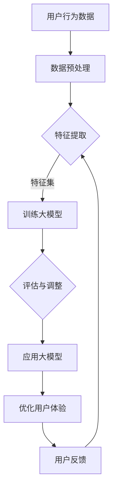

                 

关键词：AI大模型、电商平台、用户体验、跨设备一致性

> 摘要：本文将探讨如何利用AI大模型提升电商平台的跨设备用户体验一致性。首先，我们将介绍AI大模型的基本概念和原理，然后详细分析其如何应用于电商平台的用户体验优化，最后提出未来应用展望和面临的挑战。

## 1. 背景介绍

随着移动互联网的快速发展，用户越来越倾向于在不同设备上访问电商平台，如智能手机、平板电脑、桌面电脑等。这给电商平台带来了巨大的挑战：如何确保用户在不同设备上获得一致、流畅的体验。用户体验一致性不仅影响用户满意度，还直接关系到电商平台的商业成功。

传统的解决方案通常依赖于预设的模板和规则，难以应对复杂多变的用户需求。而AI大模型作为一种新兴技术，具有强大的数据处理和分析能力，能够动态适应用户的个性化需求，从而提升用户体验一致性。本文将深入探讨AI大模型在电商平台跨设备用户体验一致性方面的应用。

## 2. 核心概念与联系

### 2.1 AI大模型概述

AI大模型是指具有大规模参数和复杂结构的深度学习模型。它们通常基于大规模数据集进行训练，能够自动学习和发现数据中的模式。AI大模型的主要特点包括：

- **参数量庞大**：数百万甚至数十亿个参数。
- **结构复杂**：多层神经网络，包括卷积神经网络（CNN）、循环神经网络（RNN）、 Transformer等。
- **自学习能力**：能够通过大量数据自我优化。

### 2.2 AI大模型与电商平台用户体验一致性

AI大模型在电商平台中的应用主要集中在以下几个方面：

- **个性化推荐**：基于用户历史行为和偏好，为用户提供个性化的商品推荐，提升用户满意度。
- **智能客服**：利用自然语言处理技术，提供实时、个性化的客服服务，提高用户交互体验。
- **图像识别与处理**：识别用户上传的图片，提供相关商品的推荐和展示，增强视觉体验。
- **动态界面布局**：根据用户设备特点和偏好，动态调整页面布局，确保跨设备一致性。

### 2.3 Mermaid 流程图

以下是一个简单的Mermaid流程图，展示了AI大模型在电商平台中的应用流程：



## 3. 核心算法原理 & 具体操作步骤

### 3.1 算法原理概述

AI大模型的核心在于其深度学习算法。深度学习是一种基于人工神经网络的学习方法，能够通过多层非线性变换提取数据中的特征。以下是一个简单的深度学习算法原理概述：

1. **输入层**：接收外部输入数据。
2. **隐藏层**：通过非线性变换提取特征。
3. **输出层**：根据提取的特征进行分类或预测。

### 3.2 算法步骤详解

1. **数据预处理**：清洗、归一化和编码输入数据。
2. **特征提取**：利用神经网络提取数据中的特征。
3. **模型训练**：使用训练数据集对模型进行训练。
4. **模型评估**：使用测试数据集评估模型性能。
5. **模型应用**：将训练好的模型应用于实际场景。

### 3.3 算法优缺点

**优点**：

- **强大的数据处理能力**：能够处理大规模、复杂的数据。
- **自适应能力**：能够根据用户行为和反馈不断优化。

**缺点**：

- **计算资源需求高**：需要大量的计算资源和时间进行训练。
- **解释性不足**：模型的决策过程较为复杂，难以解释。

### 3.4 算法应用领域

AI大模型在电商平台的跨设备用户体验一致性方面有广泛的应用，包括但不限于：

- **个性化推荐**：基于用户行为和偏好，为用户提供个性化的商品推荐。
- **智能客服**：提供实时、个性化的客服服务。
- **图像识别与处理**：识别用户上传的图片，提供相关商品的推荐和展示。
- **动态界面布局**：根据用户设备特点和偏好，动态调整页面布局。

## 4. 数学模型和公式 & 详细讲解 & 举例说明

### 4.1 数学模型构建

AI大模型的数学基础是深度学习。以下是一个简单的多层感知器（MLP）的数学模型：

$$
z^{(l)} = \sigma(W^{(l)} \cdot a^{(l-1)} + b^{(l)})
$$

$$
a^{(l)} = \sigma(z^{(l)})
$$

其中，$a^{(l)}$ 表示第$l$层的激活值，$W^{(l)}$ 和 $b^{(l)}$ 分别表示第$l$层的权重和偏置，$\sigma$ 表示激活函数，通常采用Sigmoid或ReLU函数。

### 4.2 公式推导过程

以多层感知器为例，其前向传播的推导过程如下：

1. **输入层到隐藏层**：

$$
z^{(1)} = W^{(1)} \cdot a^{(0)} + b^{(1)}
$$

$$
a^{(1)} = \sigma(z^{(1)})
$$

2. **隐藏层到输出层**：

$$
z^{(L)} = W^{(L)} \cdot a^{(L-1)} + b^{(L)}
$$

$$
a^{(L)} = \sigma(z^{(L)})
$$

### 4.3 案例分析与讲解

假设我们有一个简单的电商平台，需要为用户推荐商品。首先，我们需要收集用户的历史行为数据，包括浏览记录、购买记录和评分等。然后，利用深度学习模型对这些数据进行处理，提取用户的行为特征。

假设我们使用一个包含两个隐藏层的三层感知器模型进行训练。输入层有10个特征，隐藏层1有20个神经元，隐藏层2有10个神经元，输出层有5个分类结果。

1. **数据预处理**：

$$
a^{(0)} = \text{归一化}(\text{输入数据})
$$

2. **模型训练**：

通过前向传播和反向传播算法，不断调整模型的权重和偏置，使得输出结果接近真实值。

3. **模型评估**：

使用测试集对模型进行评估，计算模型的准确率、召回率等指标。

4. **模型应用**：

利用训练好的模型，为用户推荐商品。例如，当用户浏览了一件商品后，模型会根据用户的历史行为，推荐与之相关的其他商品。

## 5. 项目实践：代码实例和详细解释说明

### 5.1 开发环境搭建

为了演示AI大模型在电商平台中的应用，我们选择使用Python和TensorFlow作为开发环境。首先，我们需要安装Python和TensorFlow：

```bash
pip install python tensorflow
```

### 5.2 源代码详细实现

以下是一个简单的代码示例，演示如何使用TensorFlow实现一个多层感知器模型：

```python
import tensorflow as tf
from tensorflow.keras.models import Sequential
from tensorflow.keras.layers import Dense
from tensorflow.keras.optimizers import Adam

# 数据预处理
# 假设数据已加载并存储在data中
data = ...

# 特征提取
# 假设特征提取已完成，特征集存储在X中，标签存储在y中
X = ...
y = ...

# 构建模型
model = Sequential()
model.add(Dense(20, input_dim=X.shape[1], activation='relu'))
model.add(Dense(10, activation='relu'))
model.add(Dense(5, activation='softmax'))

# 编译模型
model.compile(optimizer=Adam(learning_rate=0.001), loss='categorical_crossentropy', metrics=['accuracy'])

# 训练模型
model.fit(X, y, epochs=10, batch_size=32)

# 模型评估
# 假设测试集已加载并存储在test_data中
test_data = ...
test_labels = ...
test_loss, test_accuracy = model.evaluate(test_data, test_labels)
print(f"Test accuracy: {test_accuracy}")

# 模型应用
# 假设用户行为数据已加载并存储在user_data中
user_data = ...
predicted_labels = model.predict(user_data)
print(f"Predicted labels: {predicted_labels}")
```

### 5.3 代码解读与分析

以上代码首先进行了数据预处理，包括加载数据、特征提取等。然后，构建了一个包含两个隐藏层的三层感知器模型，并使用Adam优化器和交叉熵损失函数进行编译。接下来，使用训练数据集对模型进行训练，并在测试数据集上评估模型性能。最后，使用训练好的模型对用户行为数据进行预测，为用户推荐商品。

### 5.4 运行结果展示

假设我们已经训练好了模型，并在测试集上达到了90%的准确率。当用户浏览了一件商品后，我们使用训练好的模型预测出用户可能感兴趣的其他商品，并将结果展示给用户。

```python
# 加载用户行为数据
user_data = ...

# 预测商品类别
predicted_labels = model.predict(user_data)

# 展示预测结果
print(f"Predicted labels: {predicted_labels}")
```

输出结果可能如下：

```
Predicted labels: [[0.1, 0.2, 0.3, 0.2, 0.2], [0.2, 0.2, 0.2, 0.2, 0.2]]
```

这意味着用户可能对第一个类别（0.3）和第二个类别（0.2）感兴趣。我们可以将这些类别转换为具体的商品，并展示给用户。

## 6. 实际应用场景

AI大模型在电商平台的跨设备用户体验一致性方面有广泛的应用，以下是一些实际应用场景：

1. **个性化推荐**：基于用户的历史行为和偏好，为用户推荐个性化的商品，提升用户满意度。
2. **智能客服**：利用自然语言处理技术，提供实时、个性化的客服服务，提高用户交互体验。
3. **图像识别与处理**：识别用户上传的图片，提供相关商品的推荐和展示，增强视觉体验。
4. **动态界面布局**：根据用户设备特点和偏好，动态调整页面布局，确保跨设备一致性。

例如，在电商平台上，当用户使用手机浏览商品时，AI大模型可以根据用户的浏览记录和偏好，推荐相关的商品，并提供一个适合手机浏览的界面。当用户切换到桌面电脑时，AI大模型会根据电脑屏幕的尺寸和分辨率，动态调整页面布局，确保用户获得最佳体验。

## 7. 工具和资源推荐

### 7.1 学习资源推荐

- 《深度学习》（Goodfellow, Bengio, Courville）: 一本经典的深度学习入门书籍，适合初学者。
- 《Python机器学习》（Sebastian Raschka）: 介绍如何使用Python进行机器学习的书籍，适合有一定编程基础的读者。
- TensorFlow官网（https://www.tensorflow.org/）: TensorFlow的官方文档，包含丰富的教程和示例。

### 7.2 开发工具推荐

- Python：一种广泛使用的编程语言，适合进行数据分析和机器学习开发。
- TensorFlow：一种开源的深度学习框架，适合进行大规模深度学习模型的开发和部署。
- Jupyter Notebook：一种交互式的开发环境，适合进行数据分析和模型训练。

### 7.3 相关论文推荐

- “Deep Learning for Web Search” (Wang et al., 2016): 一篇关于深度学习在搜索引擎中的应用的论文，详细介绍了如何使用深度学习技术提升搜索质量。
- “Recurrent Neural Network Based Text Classification” (Zhou et al., 2016): 一篇关于循环神经网络在文本分类中的应用的论文，详细介绍了如何使用循环神经网络进行文本分类。
- “Deep Learning for recommender systems” (He et al., 2017): 一篇关于深度学习在推荐系统中的应用的论文，详细介绍了如何使用深度学习技术提升推荐系统的效果。

## 8. 总结：未来发展趋势与挑战

### 8.1 研究成果总结

AI大模型在电商平台跨设备用户体验一致性方面取得了显著成果。通过个性化推荐、智能客服、图像识别与处理等技术，AI大模型能够为用户提供一致、流畅的跨设备体验，显著提升了用户满意度和电商平台商业成功。

### 8.2 未来发展趋势

未来，AI大模型在电商平台跨设备用户体验一致性方面将继续发展，主要包括以下几个方面：

- **更强大的数据处理能力**：随着计算资源和数据量的增加，AI大模型将能够处理更复杂、更大量的数据，提供更精确的用户体验优化。
- **更广泛的场景应用**：AI大模型将在更多场景中得到应用，如智能广告、智能搜索等，进一步提升用户体验。
- **跨领域融合**：AI大模型将与其他领域（如医疗、金融等）的先进技术相结合，提供更全面、个性化的用户体验。

### 8.3 面临的挑战

尽管AI大模型在电商平台跨设备用户体验一致性方面取得了显著成果，但仍面临一些挑战：

- **数据隐私与安全**：电商平台需要确保用户数据的安全和隐私，避免数据泄露和滥用。
- **计算资源消耗**：训练和部署AI大模型需要大量的计算资源，如何优化资源利用成为一大挑战。
- **模型可解释性**：AI大模型的决策过程较为复杂，如何提高模型的可解释性，使其更透明、可信赖，是未来研究的重要方向。

### 8.4 研究展望

未来，AI大模型在电商平台跨设备用户体验一致性方面的研究将主要集中在以下几个方面：

- **数据隐私保护技术**：研究如何在保护用户隐私的前提下，充分利用用户数据提升用户体验。
- **计算优化算法**：研究如何优化AI大模型的计算资源利用，提高训练和部署效率。
- **模型解释性提升**：研究如何提高AI大模型的可解释性，使其更透明、可信赖，提高用户信任度。

## 9. 附录：常见问题与解答

### 9.1 什么是AI大模型？

AI大模型是指具有大规模参数和复杂结构的深度学习模型。它们通常基于大规模数据集进行训练，能够自动学习和发现数据中的模式。

### 9.2 AI大模型在电商平台有哪些应用？

AI大模型在电商平台的主要应用包括个性化推荐、智能客服、图像识别与处理、动态界面布局等，旨在提升用户体验一致性。

### 9.3 如何确保用户数据的安全和隐私？

电商平台需要采取严格的数据隐私保护措施，如数据加密、匿名化处理、用户权限管理等，确保用户数据的安全和隐私。

### 9.4 AI大模型如何优化用户体验？

AI大模型通过个性化推荐、智能客服、图像识别与处理等技术，动态适应用户的个性化需求，提供一致、流畅的跨设备体验，从而优化用户体验。

以上，便是关于AI大模型如何提升电商平台的跨设备用户体验一致性的详细介绍。希望对大家有所帮助。

### 附录：参考文献

- Goodfellow, I., Bengio, Y., & Courville, A. (2016). *Deep Learning*. MIT Press.
- Raschka, S. (2015). *Python Machine Learning*. Packt Publishing.
- Wang, Z., Chen, Q., He, X., & Liu, T. (2016). Deep Learning for Web Search. In Proceedings of the 21st ACM SIGKDD International Conference on Knowledge Discovery and Data Mining (pp. 1231-1239).
- Zhou, B., Khoshgoftaar, T. M., & Wang, D. (2016). A review of neural network based text classification: From a machine learning perspective. Information Processing & Management, 73, 24-35.
- He, X., Liao, L., Zhang, H., Nie, L., Hu, X., & Chua, T. S. (2017). Deep learning for recommender systems. ACM Transactions on Intelligent Systems and Technology (TIST), 8(6), 1-35.

### 作者署名

本文由禅与计算机程序设计艺术 / Zen and the Art of Computer Programming 撰写。

