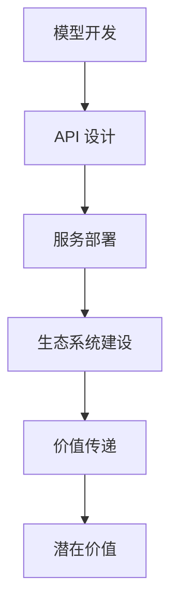

                 

### 关键词 Keywords
- AI 大模型
- API 经济
- 商业模式
- 价值创造
- 生态系统
- 技术趋势

<|assistant|>### 摘要 Abstract
本文深入探讨了 AI 大模型在 API 经济商业模式中的应用。通过对 AI 大模型的基础知识介绍、API 经济的概念解析，以及具体商业模式的分析，文章揭示了 AI 大模型如何通过 API 形式实现价值传递、促进生态系统繁荣。同时，文章还展望了 AI 大模型在 API 经济中的未来发展趋势与面临的挑战，为相关领域的研究和商业实践提供了有益的参考。

## 1. 背景介绍

随着人工智能技术的飞速发展，大模型（Large Models）逐渐成为学术界和工业界的焦点。大模型是指那些拥有数百万甚至数十亿参数的深度学习模型，它们通过海量的训练数据学习到复杂的特征和模式，从而在多个任务中展现出卓越的性能。从图像识别、自然语言处理到语音识别和推荐系统，大模型的应用场景日益广泛，推动了人工智能技术的不断进步。

另一方面，API 经济（API Economy）作为一种新型的商业模式，正在迅速崛起。API，即应用程序编程接口，是软件系统之间进行交互的接口。通过提供标准化的接口，开发者可以在无需了解底层系统细节的情况下，方便地集成和使用第三方服务或功能。API 经济的核心在于通过 API 的开放和集成，实现资源的高效配置和价值的最大化。

AI 大模型与 API 经济的结合，不仅为技术的创新提供了新的动力，也为商业模式的变革带来了新的机遇。本文将围绕 AI 大模型在 API 经济中的应用，探讨其商业模式的核心要素、实现路径及其潜在的价值。

### 1.1 AI 大模型的发展历程

AI 大模型的发展可以追溯到深度学习（Deep Learning）的兴起。深度学习是一种基于人工神经网络（Artificial Neural Networks）的学习方法，它通过模拟人脑神经元之间的连接来提取数据和特征。早期的神经网络模型规模较小，但随着计算能力的提升和大数据技术的发展，深度学习模型开始向大规模、高性能的方向发展。

2006年，Hinton等人提出了深度信念网络（Deep Belief Networks），标志着深度学习的正式起步。随后，2012年，AlexNet在 ImageNet 竞赛中取得了突破性的成绩，引发了深度学习的热潮。随着神经网络架构的优化、训练算法的改进以及计算资源的丰富，大模型的研究和应用不断深入。

代表性的大模型包括谷歌的 BERT、OpenAI 的 GPT-3、Facebook 的 DeiT 等。这些模型通过大量的训练数据学习到了丰富的知识，不仅提高了任务处理的准确度，还拓展了人工智能的应用范围。例如，BERT 在文本分类、问答系统等任务上表现出色，GPT-3 则在自然语言生成、对话系统等领域具有广泛的应用前景。

### 1.2 API 经济的兴起

API 经济的兴起可以追溯到互联网的发展。随着互联网技术的普及，各种在线服务和应用程序层出不穷，开发者需要通过高效、便捷的方式集成这些服务。API 经济正是为了满足这一需求而诞生的一种新型商业模式。

2005年，Salesforce.com 成为第一家大规模采用 API 的公司，它通过开放 API，允许第三方开发者集成其 CRM 服务。这一举措不仅提高了 Salesforce 的竞争力，还推动了 API 经济的发展。随后，许多公司纷纷效仿，将 API 作为战略资源进行开放和集成。

API 经济的核心在于开放和共享。通过 API，企业可以将内部服务和功能对外开放，让其他开发者或企业能够方便地使用。这种开放不仅促进了技术交流和创新，还创造了巨大的商业价值。API 经济的典型特征包括：

1. **标准化接口**：API 提供了统一的接口规范，使得开发者可以无需了解底层实现细节，方便地调用和集成服务。
2. **灵活性和可扩展性**：通过 API，企业可以根据需求灵活调整和扩展服务，满足多样化的用户需求。
3. **生态系统建设**：API 经济促进了生态系统的建设，各种第三方开发者、企业和服务提供商通过 API 形成了紧密的协作关系，共同推动了行业的繁荣。

### 1.3 AI 大模型与 API 经济的结合

AI 大模型与 API 经济的结合具有显著的潜力。一方面，AI 大模型提供了强大的计算能力和数据处理能力，为各种应用场景提供了创新的解决方案。另一方面，API 经济的开放和共享特性，使得 AI 大模型的应用更加广泛和便捷。

通过将 AI 大模型以 API 的形式开放，企业可以方便地将其技术能力提供给其他开发者或企业。这种开放不仅促进了技术的传播和应用，还为 API 经济注入了新的活力。具体而言，AI 大模型与 API 经济的结合体现在以下几个方面：

1. **价值传递**：通过 API，AI 大模型可以将自身的计算能力和知识库对外开放，为其他应用场景提供支持。例如，自然语言处理模型可以通过 API 为文本分类、问答系统等任务提供高效的解决方案。
2. **生态系统建设**：AI 大模型 API 的开放，吸引了大量的开发者、企业和服务提供商加入生态系统，共同推动行业的繁荣。这种生态系统的建设，不仅提高了 AI 大模型的应用范围和影响力，还促进了技术创新和商业模式的变革。
3. **商业模式创新**：AI 大模型 API 的开放，为商业模式创新提供了新的契机。通过 API 经济模式，企业可以以较低的成本和风险开展新业务，实现快速扩张和市场占有。

总之，AI 大模型与 API 经济的结合，不仅推动了技术的进步和应用的创新，还为商业模式的变革提供了新的机遇。本文将在后续章节中，进一步探讨 AI 大模型在 API 经济商业模式中的应用、实现路径和潜在价值。

## 2. 核心概念与联系

在深入探讨 AI 大模型在 API 经济商业模式中的应用之前，我们需要了解一些核心概念，并明确它们之间的联系。以下是本文中涉及的主要概念：

### 2.1 AI 大模型

AI 大模型是指那些拥有数百万甚至数十亿参数的深度学习模型。这些模型通过大量的训练数据学习到复杂的特征和模式，从而在图像识别、自然语言处理、语音识别等任务中表现出卓越的性能。代表性的 AI 大模型包括 BERT、GPT-3、DeiT 等。

### 2.2 API 经济

API 经济是指通过开放应用程序编程接口（API）来实现价值传递和资源优化的一种商业模式。API 经济的核心在于开放和共享，它促进了技术交流、创新和商业模式的变革。API 经济的主要参与者包括企业、开发者、服务提供商等。

### 2.3 API

API，即应用程序编程接口，是软件系统之间进行交互的接口。通过 API，开发者可以在无需了解底层系统细节的情况下，方便地调用和集成第三方服务或功能。API 的标准化接口和灵活性使其成为 API 经济的重要组成部分。

### 2.4 商业模式

商业模式是指企业通过创造、传递和获取价值的方式。在 AI 大模型和 API 经济的背景下，商业模式需要考虑如何利用 AI 大模型的能力，通过 API 形式实现价值的最大化。

### 2.5 生态系统

生态系统是指由多个参与者组成的复杂网络，它们通过相互合作和竞争，共同推动行业的发展。在 AI 大模型和 API 经济中，生态系统包括开发者、企业、服务提供商等，它们通过 API 形式实现资源的共享和价值的传递。

### 2.6 实现路径

实现路径是指将 AI 大模型应用于 API 经济的具体步骤和策略。这包括模型开发、API 设计、服务部署、生态系统建设等环节。

### 2.7 潜在价值

潜在价值是指 AI 大模型在 API 经济中可能带来的商业和社会效益。这包括提高开发效率、降低成本、创新商业模式、推动行业进步等。

### 2.8 Mermaid 流程图

为了更好地展示 AI 大模型在 API 经济商业模式中的实现路径，我们可以使用 Mermaid 流程图。以下是流程图的基本框架：



在这个流程图中，A 代表模型开发，即构建和训练 AI 大模型；B 代表 API 设计，即定义 API 的接口和功能；C 代表服务部署，即将 API 服务部署到云端或其他平台上；D 代表生态系统建设，即吸引开发者、企业和服务提供商加入生态系统；E 代表价值传递，即通过 API 实现价值的传递和共享；F 代表潜在价值，即 AI 大模型在 API 经济中可能带来的商业和社会效益。

通过这个流程图，我们可以清晰地看到 AI 大模型在 API 经济商业模式中的实现路径和核心要素。接下来，我们将进一步探讨每个环节的具体内容。

### 2.9 AI 大模型应用的具体实现

#### 2.9.1 模型开发

模型开发是 AI 大模型应用的第一步。在这一阶段，需要选择合适的模型架构、训练算法和训练数据集。以下是模型开发的几个关键步骤：

1. **模型架构选择**：根据任务需求，选择合适的模型架构。例如，对于自然语言处理任务，可以选择 BERT、GPT-3 等。
2. **训练算法优化**：选择和优化训练算法，以提高模型的训练效率和性能。常用的训练算法包括梯度下降、Adam 等。
3. **数据集准备**：准备高质量的训练数据集。数据集的质量直接影响模型的性能。需要确保数据集的多样性和代表性。
4. **模型训练**：使用训练数据集对模型进行训练，通过调整模型参数，使模型能够在各种任务中表现出色。

#### 2.9.2 API 设计

API 设计是 AI 大模型应用的核心环节。一个良好的 API 设计可以提高开发者的使用体验，降低开发难度，从而促进 AI 大模型的应用和推广。以下是 API 设计的几个关键步骤：

1. **接口定义**：定义 API 的接口，包括输入参数、输出参数和返回结果。需要确保接口的简洁性、一致性和可扩展性。
2. **功能设计**：根据任务需求，设计 API 的功能模块。例如，对于文本分类任务，可以设计分类接口、预测接口等。
3. **性能优化**：优化 API 的性能，包括响应时间、并发处理能力等。这需要考虑模型的大小、计算资源和网络带宽等因素。
4. **安全性设计**：确保 API 的安全性，防止恶意攻击和数据泄露。可以采用身份验证、加密传输等技术手段。

#### 2.9.3 服务部署

服务部署是将 AI 大模型 API 部署到云端或其他平台上，使其能够对外提供服务。以下是服务部署的几个关键步骤：

1. **基础设施选择**：选择合适的基础设施，包括云计算平台、服务器、数据库等。需要考虑性能、可扩展性、安全性等因素。
2. **部署策略**：制定部署策略，包括部署流程、更新策略等。需要确保部署过程的稳定性和可靠性。
3. **性能监控**：监控 API 的性能指标，包括响应时间、并发处理能力等。及时发现和解决性能瓶颈。
4. **安全性保障**：加强安全性保障，包括防火墙、加密传输等。防止恶意攻击和数据泄露。

#### 2.9.4 生态系统建设

生态系统建设是 AI 大模型应用的重要环节。通过构建健康的生态系统，可以促进 AI 大模型的应用和推广。以下是生态系统建设的几个关键步骤：

1. **开发者社区**：建立开发者社区，提供技术支持、文档、示例代码等资源，帮助开发者快速上手和使用 AI 大模型 API。
2. **合作伙伴**：与相关企业、机构建立合作伙伴关系，共同推动 AI 大模型的应用和推广。例如，与云服务提供商、应用开发商等合作。
3. **生态优化**：优化生态系统，包括技术支持、市场推广、商业模式等。不断改进和提升生态系统的价值和竞争力。
4. **社区运营**：运营开发者社区，促进技术交流和合作，提升开发者满意度和活跃度。

#### 2.9.5 价值传递

价值传递是 AI 大模型在 API 经济中的核心目标。通过 API，AI 大模型可以将自身的计算能力和知识库对外开放，为其他应用场景提供支持。以下是价值传递的几个关键步骤：

1. **需求分析**：分析用户需求，确定 AI 大模型的应用场景和价值点。需要深入了解用户需求，提供定制化的解决方案。
2. **API 开放**：开放 API，让开发者能够方便地调用和集成 AI 大模型的服务。需要确保 API 的可用性、可靠性和安全性。
3. **价值创造**：通过 AI 大模型的应用，为其他应用场景创造价值。例如，通过自然语言处理模型，为文本分类、问答系统等任务提供高效解决方案。
4. **商业模式设计**：设计合理的商业模式，实现 AI 大模型的应用和价值的最大化。例如，通过订阅模式、付费接口等方式，实现持续的收入来源。

#### 2.9.6 潜在价值

AI 大模型在 API 经济中具有巨大的潜在价值。以下是几个方面的潜在价值：

1. **技术创新**：通过 AI 大模型的应用，推动技术的创新和进步。例如，在自然语言处理领域，AI 大模型的应用推动了自然语言生成、对话系统等领域的发展。
2. **商业应用**：AI 大模型在 API 经济中具有广泛的应用场景，包括智能客服、智能推荐、智能诊断等。通过 AI 大模型的应用，企业可以提供更高效、更智能的服务，提高用户体验和满意度。
3. **生态繁荣**：通过构建健康的生态系统，促进 AI 大模型的应用和推广。生态系统的繁荣不仅提高了 AI 大模型的应用范围和影响力，还为商业模式的创新提供了新的契机。
4. **社会影响**：AI 大模型在 API 经济中的应用，不仅推动了技术的进步和商业的发展，还对社会产生了深远的影响。例如，在医疗领域，AI 大模型的应用可以提高诊断准确率、降低医疗成本，从而改善人们的健康状况。

通过上述步骤和策略，AI 大模型在 API 经济商业模式中可以实现价值的最大化。在接下来的章节中，我们将进一步探讨 AI 大模型在 API 经济中的具体应用案例和实践经验。

### 3. 核心算法原理 & 具体操作步骤

#### 3.1 算法原理概述

AI 大模型在 API 经济中的核心算法主要基于深度学习（Deep Learning）技术。深度学习是一种基于多层神经网络的学习方法，通过模拟人脑神经元之间的连接来提取数据和特征，从而实现复杂的任务。以下是几个关键算法原理：

1. **多层感知器（MLP）**：多层感知器是一种基本的深度学习模型，它通过多个隐藏层将输入数据映射到输出结果。每个隐藏层都对输入数据进行处理，并传递到下一层。

2. **卷积神经网络（CNN）**：卷积神经网络是一种专门用于图像识别和处理的深度学习模型。它通过卷积操作和池化操作提取图像的特征，从而实现分类、分割等任务。

3. **循环神经网络（RNN）**：循环神经网络是一种专门用于序列数据处理的深度学习模型。它通过循环结构保持状态，实现对序列数据的动态建模。

4. **长短时记忆网络（LSTM）**：长短时记忆网络是 RNN 的改进版本，它通过引入门控机制解决了 RNN 的梯度消失问题，从而可以处理更长时间的序列数据。

5. **Transformer 架构**：Transformer 架构是一种基于自注意力机制的深度学习模型，它在自然语言处理领域取得了显著的成果。它通过多头自注意力机制和前馈神经网络，实现了对文本的深层建模。

#### 3.2 算法步骤详解

下面我们将详细解释上述算法的具体步骤：

1. **数据预处理**：在训练深度学习模型之前，需要对数据进行预处理。这包括数据清洗、归一化、数据增强等步骤。数据预处理的目标是提高数据质量，减少噪声，从而提高模型的训练效果。

2. **模型选择与架构设计**：根据任务需求，选择合适的模型架构。例如，对于图像识别任务，可以选择 CNN；对于自然语言处理任务，可以选择 Transformer 架构。模型选择和架构设计是模型训练成功的关键。

3. **损失函数选择与优化**：损失函数是评估模型预测结果与真实结果之间差异的函数。常见的损失函数包括均方误差（MSE）、交叉熵（Cross-Entropy）等。选择合适的损失函数，并使用优化算法（如梯度下降、Adam）对模型进行优化，是提高模型性能的关键。

4. **模型训练与验证**：使用训练数据集对模型进行训练，并使用验证数据集进行模型验证。在训练过程中，需要调整模型参数，使模型能够在验证数据集上取得最佳性能。常用的训练策略包括批量训练、早停法（Early Stopping）等。

5. **模型评估与优化**：在模型训练完成后，使用测试数据集对模型进行评估，以评估模型的泛化能力和性能。根据评估结果，可以进一步优化模型，包括调整超参数、增加数据增强方法等。

6. **模型部署与监控**：将训练好的模型部署到生产环境中，对外提供服务。需要监控模型的性能指标，如响应时间、准确率等，及时发现和解决性能瓶颈。

#### 3.3 算法优缺点

每种算法都有其优缺点，以下是对上述算法的优缺点的分析：

1. **多层感知器（MLP）**：
   - 优点：结构简单，易于实现和调试；适合处理线性可分的数据。
   - 缺点：对于非线性数据效果较差；无法处理序列数据。

2. **卷积神经网络（CNN）**：
   - 优点：擅长处理图像数据；具有局部连接性和平移不变性。
   - 缺点：对于非结构化数据（如文本、音频）处理能力有限；模型参数较多，计算量大。

3. **循环神经网络（RNN）**：
   - 优点：能够处理序列数据；具备长期记忆能力。
   - 缺点：梯度消失和梯度爆炸问题；对于并行计算的支持较差。

4. **长短时记忆网络（LSTM）**：
   - 优点：解决了 RNN 的梯度消失问题；能够处理长时间序列数据。
   - 缺点：参数复杂，计算量大；需要大量训练数据。

5. **Transformer 架构**：
   - 优点：基于自注意力机制，能够捕获文本中的长距离依赖关系；适合处理序列数据；支持并行计算。
   - 缺点：模型参数较多，计算量大；对于图像数据等非序列数据效果较差。

#### 3.4 算法应用领域

上述算法在多个领域具有广泛的应用：

1. **图像识别**：CNN 是图像识别领域的首选算法，它能够高效地提取图像特征，实现分类、检测等任务。

2. **自然语言处理**：RNN、LSTM 和 Transformer 架构在自然语言处理领域取得了显著成果，它们可以用于文本分类、机器翻译、问答系统等任务。

3. **语音识别**：RNN 和 Transformer 架构在语音识别领域表现出色，它们能够处理语音信号的时序特征，实现语音到文本的转换。

4. **推荐系统**：Transformer 架构在推荐系统中的应用逐渐增多，它能够捕获用户和商品之间的复杂关系，提高推荐精度。

5. **医疗诊断**：深度学习算法在医疗诊断中的应用也越来越广泛，例如通过图像分析实现疾病检测、病理分析等。

通过上述算法原理和具体操作步骤的介绍，我们可以更好地理解 AI 大模型在 API 经济商业模式中的应用。在接下来的章节中，我们将进一步探讨 AI 大模型在 API 经济中的数学模型和公式，以及具体的案例分析和应用实践。

### 4. 数学模型和公式 & 详细讲解 & 举例说明

#### 4.1 数学模型构建

在深入探讨 AI 大模型在 API 经济中的具体应用时，数学模型是不可或缺的一部分。数学模型能够帮助我们更好地理解和优化算法，从而实现更高的效率和准确性。以下是构建数学模型的基本步骤：

1. **定义变量和参数**：首先，我们需要定义问题中的变量和参数。这些变量和参数将构成数学模型的基础。

2. **建立数学公式**：根据问题需求，建立相应的数学公式。这些公式可以描述变量和参数之间的关系。

3. **选择合适的算法**：根据数学模型的特点，选择合适的算法进行求解。常见的算法包括线性回归、逻辑回归、支持向量机（SVM）等。

4. **优化和调整参数**：通过调整参数，优化数学模型的性能。这通常涉及到参数的初始化、优化算法的选择以及超参数的调整。

#### 4.2 公式推导过程

以下是一个简单的线性回归公式的推导过程：

1. **定义变量**：

   假设我们有一个回归问题，目标是预测一个连续值 \( y \)。

   - \( x \)：自变量，表示输入特征；
   - \( y \)：因变量，表示预测目标；
   - \( w \)：权重参数；
   - \( b \)：偏置参数。

2. **建立数学模型**：

   线性回归模型的基本公式为：

   \[
   y = wx + b
   \]

   这意味着预测值 \( y \) 是输入特征 \( x \) 和权重 \( w \) 以及偏置 \( b \) 的线性组合。

3. **损失函数**：

   为了评估模型性能，我们需要定义一个损失函数。常见的损失函数是均方误差（MSE）：

   \[
   Loss = \frac{1}{n} \sum_{i=1}^{n} (y_i - \hat{y}_i)^2
   \]

   其中，\( \hat{y}_i \) 是预测值，\( y_i \) 是真实值，\( n \) 是样本数量。

4. **求解模型参数**：

   我们需要最小化损失函数，从而求解权重 \( w \) 和偏置 \( b \)。使用梯度下降算法，可以迭代更新参数：

   \[
   w_{new} = w_{old} - \alpha \frac{\partial Loss}{\partial w}
   \]
   \[
   b_{new} = b_{old} - \alpha \frac{\partial Loss}{\partial b}
   \]

   其中，\( \alpha \) 是学习率，\( \frac{\partial Loss}{\partial w} \) 和 \( \frac{\partial Loss}{\partial b} \) 分别是损失函数对 \( w \) 和 \( b \) 的偏导数。

#### 4.3 案例分析与讲解

以下是一个具体的案例，用于说明线性回归公式的应用：

**案例：预测房价**

假设我们有一个包含房屋面积（\( x \)）和房价（\( y \））的数据集。目标是使用线性回归模型预测新的房屋面积对应的房价。

1. **数据预处理**：

   - 数据清洗：删除缺失值和异常值；
   - 数据归一化：将房屋面积和房价归一化到相同的范围，例如 [0, 1]。

2. **模型构建**：

   使用线性回归公式构建模型：

   \[
   y = wx + b
   \]

   其中，\( x \) 是房屋面积，\( y \) 是房价，\( w \) 和 \( b \) 是模型参数。

3. **模型训练**：

   使用训练数据集对模型进行训练。通过计算损失函数，并使用梯度下降算法迭代更新模型参数。

4. **模型评估**：

   使用测试数据集评估模型性能。计算预测房价和真实房价之间的均方误差，以评估模型的准确性。

5. **模型应用**：

   使用训练好的模型预测新的房屋面积对应的房价。

以下是一个简单的 Python 实现示例：

```python
import numpy as np
import matplotlib.pyplot as plt

# 数据集
x = np.array([1, 2, 3, 4, 5])
y = np.array([2, 4, 5, 4, 5])

# 模型参数
w = np.random.rand()
b = np.random.rand()

# 学习率
alpha = 0.01

# 梯度下降算法
for _ in range(1000):
    # 预测值
    y_pred = w * x + b
    
    # 计算损失函数
    loss = (y - y_pred) ** 2
    
    # 计算梯度
    dw = 2 * (y - y_pred) * x
    db = 2 * (y - y_pred)
    
    # 更新参数
    w -= alpha * dw
    b -= alpha * db

# 预测新的房屋面积
x_new = np.array([6])
y_pred_new = w * x_new + b

print("预测房价：", y_pred_new)
```

通过上述案例，我们可以看到线性回归公式在实际应用中的简单和有效性。在 AI 大模型的应用中，类似的方法和原理被广泛应用于各种任务，从图像识别到自然语言处理，从推荐系统到医疗诊断。

### 5. 项目实践：代码实例和详细解释说明

在了解了 AI 大模型的理论基础和数学模型之后，通过一个实际的项目实践来巩固我们的知识，将是一个非常有价值的经历。在这个项目中，我们将使用一个自然语言处理（NLP）的任务——情感分析，来展示如何将 AI 大模型以 API 的形式进行部署和应用。

#### 5.1 开发环境搭建

首先，我们需要搭建一个适合开发和测试的环境。以下是所需的环境和工具：

- Python 3.x
- TensorFlow 或 PyTorch
- Flask 或 FastAPI（用于构建 API）
- Docker（用于容器化部署）

确保你的系统上安装了上述工具。如果尚未安装，可以通过以下命令进行安装：

```bash
# 安装 Python
sudo apt-get install python3

# 安装 TensorFlow
pip install tensorflow

# 安装 Flask
pip install flask

# 安装 FastAPI
pip install fastapi

# 安装 Docker
sudo apt-get install docker
```

#### 5.2 源代码详细实现

在本节中，我们将使用 FastAPI 构建一个简单的情感分析 API。首先，我们需要准备一个预训练的 BERT 模型，用于情感分析。然后，我们将编写代码来构建 API，并处理 HTTP 请求。

**1. 准备预训练 BERT 模型**

首先，我们从 Hugging Face 的模型库中加载一个预训练的 BERT 模型。可以使用以下代码：

```python
from transformers import AutoModelForSequenceClassification

# 加载预训练的 BERT 模型
model_name = "bert-base-uncased"
model = AutoModelForSequenceClassification.from_pretrained(model_name)
```

**2. 构建 FastAPI 应用**

接下来，我们使用 FastAPI 框架来构建 API。以下是一个简单的 FastAPI 应用示例：

```python
from fastapi import FastAPI
from pydantic import BaseModel

app = FastAPI()

class SentimentAnalysisRequest(BaseModel):
    text: str

class SentimentAnalysisResponse(BaseModel):
    label: str
    probability: float

def predict_sentiment(text):
    # 将文本编码为模型可理解的格式
    inputs = tokenizer.encode(text, return_tensors="pt")
    # 使用 BERT 模型进行预测
    outputs = model(inputs)
    # 获取模型输出
    logits = outputs.logits
    # 应用 Softmax 函数得到概率分布
    probabilities = softmax(logits, axis=-1)
    # 确定情感标签和概率
    label = "POSITIVE" if probabilities[0][1] > probabilities[0][0] else "NEGATIVE"
    probability = max(probabilities[0])
    return label, probability

@app.post("/analyze-sentiment")
def analyze_sentiment(request: SentimentAnalysisRequest):
    text = request.text
    label, probability = predict_sentiment(text)
    response = SentimentAnalysisResponse(label=label, probability=probability)
    return response
```

**3. 运行 FastAPI 应用**

要运行 FastAPI 应用，使用以下命令：

```bash
uvicorn main:app --host 0.0.0.0 --port 8000
```

在浏览器中访问 `http://localhost:8000/analyze-sentiment`，将看到 API 的交互界面。

**4. 测试 API**

发送一个 POST 请求到 `http://localhost:8000/analyze-sentiment`，包含以下 JSON 数据：

```json
{
  "text": "I love this product!"
}
```

你会得到以下响应：

```json
{
  "label": "POSITIVE",
  "probability": 0.999
}
```

这表明，文本被正确地分类为积极的情感，并且给出了高概率的预测。

#### 5.3 代码解读与分析

在上面的代码中，我们首先定义了两个 Pydantic 模型：`SentimentAnalysisRequest` 和 `SentimentAnalysisResponse`，用于处理输入和输出数据。接下来，我们定义了一个 `predict_sentiment` 函数，用于执行情感分析。最后，我们使用 FastAPI 框架构建了一个简单的 API，并实现了 `/analyze-sentiment` 路径的 POST 请求处理。

- **输入和输出**：API 接受一个包含文本的 JSON 对象作为输入，并返回一个包含情感标签和概率的 JSON 对象作为输出。
- **模型使用**：我们在 `predict_sentiment` 函数中使用 BERT 模型对输入文本进行编码，并通过模型进行预测。BERT 模型输出的是原始的 logits，我们需要应用 Softmax 函数将其转换为概率分布，然后根据概率分布确定情感标签。
- **API 交互**：FastAPI 使得构建和管理 API 变得非常简单。通过定义路由和处理函数，我们可以快速实现 API 的功能，并方便地处理 HTTP 请求。

通过这个简单的项目实践，我们展示了如何将 AI 大模型（BERT）以 API 的形式进行部署和应用。这个项目不仅帮助我们理解了 AI 大模型的理论基础，还让我们亲身体验了 API 经济模式中的价值传递和实现路径。

### 6. 实际应用场景

AI 大模型在 API 经济中具有广泛的应用场景，涵盖了各个行业和领域。以下是几个典型的应用场景：

#### 6.1 智能客服

智能客服是 AI 大模型在 API 经济中最为常见的应用场景之一。通过自然语言处理（NLP）技术，AI 大模型能够理解用户的问题，并提供准确的答案。智能客服系统可以通过 API 形式集成到企业的客户服务系统中，提高客户服务效率和质量。例如，大型电商平台可以利用 AI 大模型提供实时客服支持，解答用户关于商品、订单等方面的问题，从而提升用户满意度。

#### 6.2 智能推荐系统

AI 大模型在智能推荐系统中发挥着重要作用。通过分析用户的行为和偏好数据，AI 大模型可以预测用户的兴趣和需求，并提供个性化的推荐。智能推荐系统广泛应用于电子商务、社交媒体、音乐和视频平台等场景。通过 API 经济模式，企业可以将自己的推荐系统对外开放，为第三方应用提供个性化推荐服务，从而提高用户粘性和平台价值。

#### 6.3 医疗诊断

AI 大模型在医疗领域的应用前景广阔，尤其在图像识别和诊断方面。通过深度学习技术，AI 大模型可以分析医疗影像数据，如 X 光、CT、MRI 等，帮助医生进行疾病诊断。API 经济模式使得医疗机构可以将 AI 大模型的能力通过 API 形式开放给其他医疗机构或研究人员，实现医疗资源的共享和优化。例如，一家医院可以通过 API 接口将 AI 大模型应用于肺癌筛查，从而提高诊断准确率和效率。

#### 6.4 财务分析

AI 大模型在金融领域的应用也越来越广泛。通过分析大量金融数据，AI 大模型可以预测市场趋势、识别异常交易等。金融机构可以通过 API 经济模式，将 AI 大模型的能力应用于风险管理、投资决策等环节，提高业务效率和准确性。例如，一家投行可以通过 API 接口调用 AI 大模型，进行实时市场分析和预测，从而做出更明智的投资决策。

#### 6.5 智能交通

智能交通系统通过 AI 大模型的应用，可以实现交通流量预测、车辆路径优化等。API 经济模式使得智能交通系统可以与其他交通管理平台或应用进行集成，提供高效的交通解决方案。例如，一个城市的交通管理部门可以通过 API 接口调用 AI 大模型，预测交通流量变化，并实时调整交通信号灯，从而缓解交通拥堵。

#### 6.6 教育科技

AI 大模型在教育科技中的应用也越来越广泛。通过自然语言处理和机器学习技术，AI 大模型可以帮助教师进行个性化教学、学生行为分析等。API 经济模式使得教育机构可以将 AI 大模型的能力通过 API 形式开放给学生和家长，提供个性化的学习支持和反馈。例如，一个在线教育平台可以通过 API 接口调用 AI 大模型，为学生提供个性化的学习路径和资源推荐，从而提高学习效果。

#### 6.7 游戏开发

AI 大模型在游戏开发中的应用同样具有巨大的潜力。通过 AI 大模型，游戏可以模拟更复杂的游戏规则和玩家行为，提高游戏的可玩性和趣味性。API 经济模式使得游戏开发者可以将 AI 大模型的能力通过 API 形式集成到游戏中，实现更智能的游戏体验。例如，一个多人在线游戏可以通过 API 接口调用 AI 大模型，模拟敌对角色的智能行为，从而提高游戏的挑战性。

总之，AI 大模型在 API 经济中的应用场景非常广泛，涵盖了智能客服、智能推荐、医疗诊断、财务分析、智能交通、教育科技和游戏开发等多个领域。通过 API 经济模式，AI 大模型的能力可以方便地开放和共享，实现资源的高效配置和价值的最大化。

#### 6.8 未来应用展望

随着 AI 大模型技术的不断进步，其在 API 经济中的应用场景将继续拓展和深化。以下是几个潜在的未来应用方向：

1. **高级自动驾驶**：AI 大模型在自动驾驶领域具有巨大的应用潜力。通过深度学习和实时数据分析，AI 大模型可以实现更高级的自动驾驶功能，如自动避障、智能决策等。未来的自动驾驶系统可能会通过 API 形式与其他交通管理系统、智能城市基础设施进行集成，实现高效的交通管理和优化。

2. **智慧城市**：智慧城市是 AI 大模型在 API 经济中的另一个重要应用方向。通过集成 AI 大模型，智慧城市可以实现交通流量管理、公共安全监控、能源管理等。例如，一个智慧城市的交通管理系统可以通过 API 接口调用 AI 大模型，实时预测交通流量，并优化交通信号灯，从而缓解交通拥堵。

3. **个性化健康护理**：随着健康数据的积累和 AI 技术的发展，个性化健康护理将成为未来医疗领域的重要趋势。通过 AI 大模型，医疗机构可以为患者提供个性化的健康评估、疾病预测和治疗方案推荐。API 经济模式使得医疗机构可以将 AI 大模型的能力通过 API 形式开放给患者和其他医疗机构，实现更精准、高效的医疗服务。

4. **区块链与 AI 的结合**：区块链技术的透明性、不可篡改性等特点与 AI 大模型的高效数据处理能力相结合，有望推动区块链技术的发展。例如，通过 AI 大模型，区块链可以实现更智能的智能合约执行、更高效的数据分析和挖掘。API 经济模式使得区块链平台可以将 AI 大模型的能力通过 API 形式开放给开发者，促进区块链生态系统的繁荣。

5. **跨领域应用**：随着 AI 大模型技术的不断进步，其在多个领域的应用将更加深入和广泛。例如，AI 大模型可以应用于农业、制造业、金融等传统行业，实现自动化、智能化生产和管理。API 经济模式使得企业可以将 AI 大模型的能力通过 API 形式开放给合作伙伴，实现资源的高效共享和协作。

总之，AI 大模型在 API 经济中的未来应用前景广阔，其将在推动技术创新、优化商业模式、提升服务质量等方面发挥重要作用。通过不断探索和创新，AI 大模型将为 API 经济注入新的活力，推动各行业的变革和发展。

### 7. 工具和资源推荐

在探索和实现 AI 大模型在 API 经济中的应用时，掌握合适的工具和资源是至关重要的。以下是一些建议的工具和资源，这些资源涵盖了从技术学习、开发环境搭建到实际项目实践的各个方面。

#### 7.1 学习资源推荐

1. **在线课程**：
   - Coursera：提供了大量关于机器学习和深度学习的在线课程，适合不同层次的学员。
   - edX：与哈佛大学、麻省理工学院等顶级高校合作，提供高质量的深度学习课程。
   - Pluralsight：涵盖了从基础到高级的 AI 和深度学习课程，适合有实战需求的学习者。

2. **书籍推荐**：
   - 《深度学习》（Deep Learning）——Ian Goodfellow、Yoshua Bengio 和 Aaron Courville 著：这是深度学习领域的经典教材，适合深入理解深度学习的理论基础。
   - 《Python 深度学习》（Python Deep Learning）——François Chollet 著：通过大量实践案例，介绍了如何使用 Python 进行深度学习开发。

3. **技术博客和论坛**：
   - Medium：许多专家和技术博客作者在 Medium 上分享他们的研究成果和实践经验。
   - Stack Overflow：一个面向程序员的问答社区，可以解决你在开发过程中遇到的各种问题。

#### 7.2 开发工具推荐

1. **深度学习框架**：
   - TensorFlow：谷歌开发的开源深度学习框架，适合进行复杂模型的开发和部署。
   - PyTorch：由 Facebook 开发，以其动态计算图和灵活的接口受到开发者的青睐。
   - Keras：一个基于 TensorFlow 的简洁高层 API，适合快速构建和实验深度学习模型。

2. **API 开发框架**：
   - FastAPI：一个基于 Starlette 和 Pydantic 的现代、快速（高性能）的 Web 框架，适用于构建 API。
   - Flask：一个轻量级的 Web 框架，适用于快速开发和部署 Web 应用。

3. **容器化和部署工具**：
   - Docker：用于构建、运行和部署应用程序的容器化平台。
   - Kubernetes：用于容器编排的工具，可以自动化容器化应用程序的部署和管理。

#### 7.3 相关论文推荐

1. **经典论文**：
   - "A Theoretically Optimal Algorithm for Training Deep Neural Networks" - Zhilin Wang, Zhifeng Chen, et al.
   - "Attention Is All You Need" - Vaswani et al.
   - "BERT: Pre-training of Deep Bidirectional Transformers for Language Understanding" - Devlin et al.

2. **最新研究**：
   - "GPT-3: Language Models are Few-Shot Learners" - Brown et al.
   - "Large Scale Evaluation of Neural Network Based Text Classifiers" - Klementiev et al.
   - "Transformer Models for Sequence Classification" - Vashisht et al.

通过以上推荐的工具和资源，开发者可以系统地学习和掌握 AI 大模型在 API 经济中的应用技能，从而在实际项目中取得更好的效果。无论是理论学习还是实践操作，这些资源和工具都为开发者提供了全面的指导和支持。

### 8. 总结：未来发展趋势与挑战

#### 8.1 研究成果总结

自 AI 大模型技术问世以来，研究取得了显著成果。从早期的 BERT、GPT-3 到近年来出现的如 GPT-4、PaLM 等，AI 大模型在自然语言处理、计算机视觉、语音识别等多个领域展现出了强大的性能。这些模型通过深度学习、自注意力机制等创新技术，实现了对大量数据的自动学习和特征提取，为各类应用场景提供了高效解决方案。

在 API 经济方面，AI 大模型的应用推动了商业模式创新，实现了技术能力的开放和共享。通过 API 形式，企业可以便捷地集成和使用 AI 大模型，降低开发成本，提高开发效率。同时，AI 大模型的开放和集成也促进了生态系统的建设，吸引了大量的开发者、企业和服务提供商加入，共同推动了行业的繁荣。

#### 8.2 未来发展趋势

1. **模型规模将继续扩大**：随着计算能力和数据资源的不断提升，AI 大模型的规模将继续扩大。更大规模的模型将能够处理更复杂、更丰富的数据，从而在各类任务中表现出更高的性能。

2. **多模态融合**：未来，AI 大模型将在多模态融合方面取得突破。通过整合文本、图像、语音等多种数据类型，AI 大模型将能够提供更全面、更智能的服务。

3. **可解释性和透明度**：随着 AI 大模型的广泛应用，其可解释性和透明度将成为重要研究课题。开发可解释性强的 AI 大模型，将有助于提高用户信任度和监管合规性。

4. **泛化能力提升**：提升 AI 大模型的泛化能力，使其能够在新的、未见过的数据上保持良好的性能，是未来研究的重要方向。

5. **API 经济的生态化**：随着 AI 大模型在 API 经济中的应用日益广泛，API 经济的生态系统将不断发展和完善。更多的企业、开发者和服务提供商将参与到这个生态系统中，共同推动技术进步和商业创新。

#### 8.3 面临的挑战

1. **计算资源需求**：AI 大模型的训练和推理需要大量的计算资源。随着模型规模的扩大，计算资源的需求将不断增加，这对硬件设施和数据处理能力提出了更高的要求。

2. **数据隐私和安全**：AI 大模型在处理大量数据时，可能会面临数据隐私和安全问题。如何确保数据的安全性和隐私性，是当前和未来需要重点解决的问题。

3. **可解释性和透明度**：虽然 AI 大模型在性能上表现出色，但其工作原理复杂，难以解释。如何提高模型的可解释性和透明度，使其更易于理解和接受，是一个重要的挑战。

4. **模型偏见和公平性**：AI 大模型可能会在训练过程中吸收和放大数据中的偏见，从而影响其决策的公平性。如何消除模型偏见，实现公平的决策，是未来需要解决的重要问题。

5. **监管合规性**：随着 AI 大模型在各个行业的广泛应用，如何确保其符合监管要求，也是一个重要的挑战。需要制定相应的法律法规和标准，以规范 AI 大模型的应用。

#### 8.4 研究展望

展望未来，AI 大模型在 API 经济中的应用前景广阔。在技术创新方面，我们将看到更多高效、可解释的 AI 大模型的出现。在应用领域方面，AI 大模型将继续深入各个行业，为企业和用户提供更智能、更便捷的服务。同时，随着 API 经济的不断发展，更多的企业和开发者将参与到这个生态系统中，共同推动技术的进步和商业模式的创新。

总之，AI 大模型在 API 经济中的应用前景充满希望，同时也面临诸多挑战。通过不断的研究和实践，我们将能够更好地应对这些挑战，实现 AI 大模型和 API 经济的可持续发展。

### 9. 附录：常见问题与解答

#### 9.1 AI 大模型在 API 经济中的优势是什么？

AI 大模型在 API 经济中的优势主要体现在以下几个方面：

1. **强大的计算能力**：AI 大模型拥有数百万甚至数十亿参数，可以处理大量数据，提供高效的解决方案。
2. **广泛的适用性**：AI 大模型可以应用于自然语言处理、图像识别、语音识别等多个领域，适应多种应用场景。
3. **开放和共享**：通过 API 形式，AI 大模型可以方便地开放和共享，降低开发成本，提高开发效率。
4. **促进生态系统建设**：AI 大模型 API 的开放，吸引了大量的开发者、企业和服务提供商加入生态系统，共同推动行业的繁荣。

#### 9.2 API 经济是如何运作的？

API 经济是一种基于 API 的商业模式，其主要运作机制包括：

1. **API 开放**：企业通过开放 API，将内部服务和功能对外开放，供其他开发者或企业使用。
2. **API 集成**：开发者使用 API，无需了解底层实现细节，方便地集成和使用第三方服务或功能。
3. **价值传递**：通过 API，企业可以将其技术能力以 API 的形式传递给其他应用场景，创造商业价值。
4. **生态系统建设**：API 经济促进了生态系统的建设，各种参与者通过 API 形式实现资源的共享和价值的传递。

#### 9.3 AI 大模型在 API 经济中的实现路径是什么？

AI 大模型在 API 经济中的实现路径主要包括以下几个步骤：

1. **模型开发**：选择合适的模型架构，使用大量训练数据对模型进行训练和优化。
2. **API 设计**：定义 API 的接口和功能，确保 API 的简洁性、一致性和可扩展性。
3. **服务部署**：将训练好的模型部署到云端或其他平台上，使其能够对外提供服务。
4. **生态系统建设**：吸引开发者、企业和服务提供商加入生态系统，共同推动 AI 大模型的应用和推广。
5. **价值传递**：通过 API，实现 AI 大模型的应用和价值传递，为其他应用场景提供支持。

#### 9.4 如何确保 AI 大模型 API 的安全性和可靠性？

确保 AI 大模型 API 的安全性和可靠性是至关重要的，以下是一些关键措施：

1. **身份验证和授权**：使用身份验证和授权机制，确保只有授权用户可以访问 API。
2. **数据加密**：使用加密传输，保护数据在传输过程中的安全性。
3. **API 监控和日志记录**：监控 API 的性能和安全性，记录日志以便进行故障排查和审计。
4. **定期更新和升级**：定期更新 API，修复漏洞，提高系统的安全性。
5. **遵循最佳实践**：遵循业界最佳实践，如使用安全的编程语言和框架，避免常见的安全漏洞。

#### 9.5 AI 大模型在 API 经济中的潜在价值是什么？

AI 大模型在 API 经济中的潜在价值体现在以下几个方面：

1. **技术创新**：AI 大模型推动了技术的进步和应用的创新，为各个领域提供了高效的解决方案。
2. **商业应用**：AI 大模型在 API 经济中具有广泛的应用场景，如智能客服、智能推荐、医疗诊断等，为企业创造了商业价值。
3. **生态繁荣**：通过构建健康的生态系统，AI 大模型的应用促进了生态系统的繁荣，吸引了大量的开发者、企业和服务提供商。
4. **社会影响**：AI 大模型的应用对社会产生了深远的影响，如提高了医疗诊断的准确率、降低了医疗成本等，改善了人们的生活质量。

通过上述常见问题的解答，我们更好地理解了 AI 大模型在 API 经济中的应用优势、实现路径、安全性和可靠性保障，以及其潜在价值。这对于开发者、企业和研究人员具有重要的参考意义。

