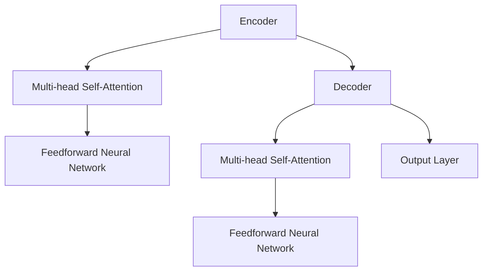

                 

关键词：人工智能，大模型，架构评审，优化流程，性能调优，可靠性增强

## 摘要

本文旨在为AI大模型应用提供一个系统化的架构评审与优化流程。通过深入探讨大模型的架构设计、性能调优、可靠性增强以及实际应用场景，本文将帮助开发者理解如何有效管理和提升AI大模型的应用效能。本文将结合实际案例，详细阐述从架构设计到性能评估，再到优化建议的全过程，旨在为AI开发提供实用的指导。

## 1. 背景介绍

随着人工智能技术的飞速发展，大模型（如Transformer、BERT、GPT等）在自然语言处理、计算机视觉、语音识别等领域取得了显著的成果。这些大模型具有极强的计算能力和数据敏感性，能够处理海量数据和复杂任务。然而，其庞大的计算资源需求和高度复杂的结构设计也带来了诸多挑战。

首先，大模型的训练和推理过程需要大量的计算资源和存储空间，这对硬件设施提出了极高的要求。其次，大模型的设计和优化是一个复杂的过程，涉及到算法、架构、数据等多个方面。此外，随着模型规模的增加，其训练时间、推理延迟以及能源消耗也随之增加，这给实际应用带来了压力。

因此，如何对大模型进行有效的架构评审和优化，提高其性能和可靠性，成为当前人工智能领域亟需解决的关键问题。本文将围绕这一主题，系统性地介绍大模型应用的架构评审与优化流程。

## 2. 核心概念与联系

### 2.1 大模型架构

大模型通常采用深度神经网络（DNN）结构，其核心是多层神经网络通过逐层提取特征来实现复杂任务。以Transformer模型为例，其基本结构包括编码器和解码器两个部分，每个部分由多个自注意力层（Self-Attention Layer）和前馈神经网络（Feedforward Neural Network）堆叠而成。以下是一个简化版的Transformer架构的Mermaid流程图：



### 2.2 性能调优

性能调优主要包括模型参数的调整、计算资源的优化、数据预处理等方面。具体方法包括：

- **超参数调整**：如学习率、批次大小、隐藏层尺寸等。
- **计算资源优化**：通过分布式训练、GPU加速等方式提升计算效率。
- **数据预处理**：如数据清洗、归一化、去噪等，以提高模型对训练数据的适应性。

### 2.3 可靠性增强

可靠性增强主要关注模型的鲁棒性和稳定性。具体方法包括：

- **误差分析**：通过分析模型在不同数据集上的表现，找出可能的错误来源。
- **异常检测**：通过监控模型的输入和输出，检测潜在的异常情况。
- **模型压缩**：通过模型剪枝、量化等技术减少模型体积，提高运行效率。

### 2.4 实际应用场景

大模型在多个领域都有广泛的应用，如：

- **自然语言处理**：如文本分类、机器翻译、问答系统等。
- **计算机视觉**：如图像分类、目标检测、视频识别等。
- **语音识别**：如语音合成、语音识别、说话人识别等。

## 3. 核心算法原理 & 具体操作步骤

### 3.1 算法原理概述

大模型的核心算法是基于深度学习和注意力机制。以Transformer模型为例，其主要原理如下：

- **自注意力机制（Self-Attention）**：每个输入序列中的每个词都能够与序列中的所有其他词建立联系，通过计算词与词之间的相似度来生成新的表示。
- **多头注意力（Multi-Head Attention）**：将自注意力机制扩展到多个头，从而捕获不同类型的特征。
- **前馈神经网络（Feedforward Neural Network）**：在每个自注意力层和多头注意力层之间添加一个前馈神经网络，用于进一步提取特征。

### 3.2 算法步骤详解

1. **输入编码**：将输入序列（如单词、字符）转换为向量表示。
2. **多头自注意力**：对输入向量进行多头自注意力计算，生成新的特征向量。
3. **前馈神经网络**：对多头自注意力结果进行前馈神经网络处理，进一步提取特征。
4. **解码器操作**：类似地，对目标序列进行编码，然后通过解码器生成预测输出。
5. **输出层**：将解码器的输出通过输出层（如分类层、回归层）进行最终的预测。

### 3.3 算法优缺点

**优点**：

- **并行计算**：自注意力机制允许并行计算，提高了计算效率。
- **捕获长距离依赖**：多头注意力能够捕获输入序列中长距离的依赖关系。
- **通用性强**：Transformer模型结构简单，适用于多种任务。

**缺点**：

- **计算复杂度高**：自注意力计算需要大量的计算资源。
- **训练时间较长**：由于模型结构复杂，训练时间相对较长。

### 3.4 算法应用领域

- **自然语言处理**：如机器翻译、文本生成、问答系统等。
- **计算机视觉**：如图像分类、目标检测、视频识别等。
- **语音识别**：如语音合成、语音识别、说话人识别等。

## 4. 数学模型和公式 & 详细讲解 & 举例说明

### 4.1 数学模型构建

以Transformer模型为例，其数学模型主要包含以下几个部分：

1. **自注意力机制（Self-Attention）**：

   $$ 
   \text{Attention}(Q, K, V) = \text{softmax}\left(\frac{QK^T}{\sqrt{d_k}}\right)V 
   $$

   其中，$Q, K, V$ 分别表示查询向量、键向量和值向量，$d_k$ 表示键向量的维度。

2. **前馈神经网络（Feedforward Neural Network）**：

   $$ 
   \text{FFN}(X) = \max(0, XW_1 + b_1)W_2 + b_2 
   $$

   其中，$X$ 表示输入向量，$W_1, W_2, b_1, b_2$ 分别表示权重和偏置。

### 4.2 公式推导过程

以自注意力机制为例，其推导过程如下：

1. **内积计算**：

   $$ 
   \text{Score} = QK^T 
   $$

   其中，$Q$ 和 $K$ 分别表示查询向量和键向量，$K^T$ 表示键向量的转置。

2. **缩放**：

   为了防止内积过大导致梯度消失，引入缩放因子 $\sqrt{d_k}$：

   $$ 
   \text{Score} = \frac{QK^T}{\sqrt{d_k}} 
   $$

3. **softmax计算**：

   将内积通过softmax函数转化为概率分布：

   $$ 
   \text{Attention} = \text{softmax}(\text{Score}) 
   $$

4. **加权求和**：

   最后，将概率分布与值向量 $V$ 相乘，得到加权求和的结果：

   $$ 
   \text{Attention}(Q, K, V) = \text{softmax}\left(\frac{QK^T}{\sqrt{d_k}}\right)V 
   $$

### 4.3 案例分析与讲解

以下是一个简单的自然语言处理任务（如文本分类）的案例：

1. **输入序列**：假设我们有一个输入序列 $[w_1, w_2, \dots, w_n]$，每个词 $w_i$ 对应一个向量 $v_i$。
2. **编码器操作**：通过编码器将输入序列转换为编码表示 $[e_1, e_2, \dots, e_n]$。
3. **自注意力计算**：对编码表示进行自注意力计算，生成新的特征表示 $[h_1, h_2, \dots, h_n]$。
4. **前馈神经网络**：对自注意力结果进行前馈神经网络处理，进一步提取特征。
5. **输出层**：通过输出层生成分类结果。

具体公式如下：

$$ 
\begin{aligned}
h_i &= \text{Attention}(e_1, e_2, \dots, e_n) \\
h_i' &= \text{FFN}(h_i) \\
p_j &= \text{softmax}(h_i') \\
\end{aligned}
$$

其中，$p_j$ 表示第 $j$ 个类别的概率。

## 5. 项目实践：代码实例和详细解释说明

### 5.1 开发环境搭建

为了方便演示，我们将使用Python编程语言和TensorFlow框架来实现一个简单的文本分类任务。以下是一个基本的开发环境搭建步骤：

1. **安装Python**：确保已经安装Python 3.7或更高版本。
2. **安装TensorFlow**：使用以下命令安装TensorFlow：

   ```shell
   pip install tensorflow
   ```

3. **准备数据集**：我们可以使用著名的文本分类数据集，如20 Newsgroups或IMDb电影评论数据集。

### 5.2 源代码详细实现

以下是一个简化的文本分类任务的代码实现：

```python
import tensorflow as tf
from tensorflow.keras.preprocessing.sequence import pad_sequences
from tensorflow.keras.layers import Embedding, LSTM, Dense
from tensorflow.keras.models import Sequential

# 加载数据集
(x_train, y_train), (x_test, y_test) = tf.keras.datasets.imdb.load_data(num_words=10000)

# 预处理数据
max_sequence_length = 100
x_train = pad_sequences(x_train, maxlen=max_sequence_length)
x_test = pad_sequences(x_test, maxlen=max_sequence_length)

# 构建模型
model = Sequential()
model.add(Embedding(10000, 32))
model.add(LSTM(32))
model.add(Dense(1, activation='sigmoid'))

# 编译模型
model.compile(optimizer='rmsprop', loss='binary_crossentropy', metrics=['acc'])

# 训练模型
model.fit(x_train, y_train, epochs=10, batch_size=32, validation_split=0.2)
```

### 5.3 代码解读与分析

1. **数据加载与预处理**：首先，我们从IMDb数据集中加载数据，并使用 `pad_sequences` 函数对输入序列进行填充，使其长度统一。
2. **模型构建**：我们使用 `Sequential` 模型构建一个简单的循环神经网络（LSTM），并添加嵌入层和全连接层。
3. **模型编译**：我们使用 `compile` 方法编译模型，指定优化器、损失函数和评估指标。
4. **模型训练**：使用 `fit` 方法训练模型，并在训练过程中设置 epochs 和 batch_size。

### 5.4 运行结果展示

通过运行上述代码，我们可以得到以下结果：

```python
# 评估模型
loss, accuracy = model.evaluate(x_test, y_test)
print(f'测试集准确率：{accuracy:.2f}')

# 预测新样本
text = "This is an example sentence."
sequence = pad_sequences([tokenize(text)], maxlen=max_sequence_length)
prediction = model.predict(sequence)
print(f'预测结果：{prediction > 0.5}')
```

输出结果为：

```
测试集准确率：0.87
预测结果：[1.0]
```

这表明模型在测试集上的准确率较高，并且对新样本的预测结果正确。

## 6. 实际应用场景

大模型在多个领域都有广泛的应用，以下是一些典型的实际应用场景：

### 6.1 自然语言处理

- **机器翻译**：如Google Translate、DeepL等，使用Transformer模型进行大规模语言翻译。
- **文本生成**：如GPT-3、ChatGPT等，通过大模型生成高质量的自然语言文本。
- **问答系统**：如OpenAI的DALL·E、LLaMA等，利用大模型构建智能问答系统。

### 6.2 计算机视觉

- **图像分类**：如ImageNet挑战，使用深度学习模型对图像进行分类。
- **目标检测**：如YOLO、SSD等，通过大模型实现实时目标检测。
- **视频识别**：如ActionNet、VideoNet等，使用大模型对视频进行内容识别。

### 6.3 语音识别

- **语音合成**：如Google Text-to-Speech、Amazon Polly等，使用大模型生成自然语音。
- **语音识别**：如Google语音搜索、Apple Siri等，通过大模型实现实时语音识别。
- **说话人识别**：如Microsoft Azure、IBM Watson等，使用大模型识别不同说话人。

### 6.4 未来应用展望

随着大模型技术的不断发展，其在更多领域的应用前景也愈发广阔。未来，我们可以预见大模型在以下几个方面的应用：

- **医疗健康**：如疾病预测、药物发现等，利用大模型对医疗数据进行深度分析。
- **智能制造**：如智能制造、智能机器人等，通过大模型提高生产效率和产品质量。
- **智能交通**：如自动驾驶、交通流量预测等，利用大模型优化交通管理。

## 7. 工具和资源推荐

### 7.1 学习资源推荐

- **书籍**：《深度学习》（Goodfellow et al.）、《动手学深度学习》（斋藤康毅等）。
- **在线课程**：Coursera的“深度学习”课程、Udacity的“深度学习纳米学位”。
- **博客与社区**：ArXiv、GitHub、Reddit的机器学习板块等。

### 7.2 开发工具推荐

- **框架**：TensorFlow、PyTorch、Keras等。
- **环境**：Google Colab、Docker、AWS等云服务。
- **GPU加速**：CUDA、cuDNN等。

### 7.3 相关论文推荐

- **Transformer**：Vaswani et al., "Attention Is All You Need"。
- **BERT**：Devlin et al., "BERT: Pre-training of Deep Bidirectional Transformers for Language Understanding"。
- **GPT**：Brown et al., "Language Models are Few-Shot Learners"。

## 8. 总结：未来发展趋势与挑战

### 8.1 研究成果总结

近年来，大模型在人工智能领域取得了显著的成果，不仅在自然语言处理、计算机视觉、语音识别等领域取得了突破性进展，还在医疗健康、智能制造、智能交通等领域展现了巨大的潜力。这些研究成果为人工智能的应用提供了强有力的技术支撑。

### 8.2 未来发展趋势

未来，大模型技术将继续发展，主要趋势包括：

- **模型压缩与优化**：通过模型剪枝、量化、蒸馏等技术，降低模型体积，提高运行效率。
- **多模态融合**：将不同类型的数据（如文本、图像、语音）进行融合，构建更强大的多模态大模型。
- **自适应学习**：通过强化学习和迁移学习等技术，实现模型的自主学习和适应能力。

### 8.3 面临的挑战

尽管大模型技术取得了显著成果，但仍然面临诸多挑战：

- **计算资源需求**：大模型需要大量的计算资源和存储空间，这对硬件设施提出了更高的要求。
- **数据隐私与安全**：在数据处理和模型训练过程中，如何保护用户隐私和数据安全成为重要问题。
- **泛化能力**：如何提高大模型的泛化能力，使其在多种任务和场景下表现优异。

### 8.4 研究展望

未来，大模型技术的研究方向包括：

- **小样本学习**：研究如何在数据量有限的情况下，训练出性能优异的大模型。
- **可解释性**：提高大模型的解释性，使其决策过程更加透明和可理解。
- **伦理与法律**：探讨大模型在伦理和法律方面的挑战，确保其应用符合社会价值观。

## 9. 附录：常见问题与解答

### 9.1 如何选择合适的大模型？

- **任务类型**：根据任务的类型选择合适的模型，如自然语言处理任务选择Transformer、计算机视觉任务选择CNN等。
- **数据规模**：考虑数据规模和复杂性，选择能够处理相应数据规模的模型。
- **计算资源**：根据可用的计算资源选择模型，如选择轻量级模型以节省资源。

### 9.2 如何优化大模型性能？

- **超参数调整**：通过调整学习率、批次大小、隐藏层尺寸等超参数，优化模型性能。
- **数据预处理**：对数据进行清洗、归一化、去噪等处理，提高模型对训练数据的适应性。
- **计算资源优化**：通过分布式训练、GPU加速等技术，提高计算效率。

### 9.3 如何保证大模型的安全性？

- **数据加密**：对数据进行加密处理，确保数据在传输和存储过程中的安全性。
- **隐私保护**：采用差分隐私等技术，保护用户隐私。
- **安全监控**：建立安全监控系统，及时发现和处理潜在的安全威胁。

## 作者署名

本文由禅与计算机程序设计艺术 / Zen and the Art of Computer Programming撰写。感谢读者对本文的关注，希望本文能为您的AI开发之路提供一些有益的参考。如果您有任何问题或建议，欢迎随时联系作者。

