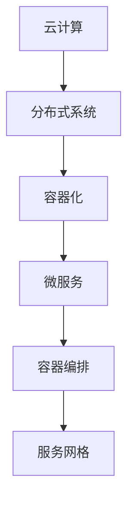

                 

关键词：AI大模型，混合云部署，云计算，分布式系统，容器化，微服务，容器编排，服务网格，AI应用架构

## 摘要

本文旨在探讨AI大模型在混合云环境下的部署实践。随着人工智能技术的飞速发展，AI大模型的计算需求不断增长，传统的单机部署模式已无法满足其需求。混合云部署作为一种新兴的部署方式，能够整合公有云和私有云的优势，为AI大模型提供灵活、高效、安全的计算资源。本文将从背景介绍、核心概念与联系、核心算法原理与具体操作步骤、数学模型和公式、项目实践、实际应用场景、工具和资源推荐以及未来发展趋势与挑战等方面详细阐述AI大模型在混合云环境下的部署实践。

## 1. 背景介绍

人工智能（AI）作为一种模拟人类智能的技术，已广泛应用于各行各业。特别是在深度学习领域，AI大模型（如GPT-3、BERT等）取得了显著的突破。然而，这些大模型的训练和推理过程对计算资源的需求巨大，传统的单机部署模式已经无法满足其需求。为了解决这个问题，云计算和分布式计算技术逐渐成为主流。其中，混合云部署作为一种新兴的部署方式，能够充分发挥公有云和私有云的优势，为AI大模型提供更为灵活、高效、安全的计算资源。

混合云部署将计算资源分布在不同的云平台上，根据应用需求进行动态调整。一方面，公有云提供了丰富的计算资源和便捷的管理服务；另一方面，私有云则提供了更高的安全性和数据隐私保障。通过将AI大模型部署在混合云环境中，不仅能够充分利用计算资源，提高模型性能，还能确保数据的安全和隐私。

## 2. 核心概念与联系

在混合云部署中，涉及多个核心概念和技术，如云计算、分布式系统、容器化、微服务、容器编排、服务网格等。以下将简要介绍这些概念，并给出一个Mermaid流程图，以展示它们之间的联系。

### 2.1 云计算

云计算是一种通过网络提供计算资源、存储资源、网络资源和应用程序等服务的技术。云计算包括公有云、私有云和混合云等多种形式。其中，公有云提供了丰富的计算资源和便捷的管理服务，如Amazon Web Services（AWS）、Microsoft Azure和Google Cloud等；私有云则为企业内部提供计算资源，具备更高的安全性和数据隐私保障；混合云则将公有云和私有云结合起来，实现计算资源的灵活调度和优化。

### 2.2 分布式系统

分布式系统是一种通过网络连接的多台计算机组成的系统，能够实现计算资源的共享和负载均衡。在AI大模型部署中，分布式系统可以充分利用多台计算机的计算能力，提高模型训练和推理的效率。

### 2.3 容器化

容器化是一种轻量级虚拟化技术，通过将应用程序及其依赖环境打包在一个独立的容器中，实现应用程序的快速部署和扩展。在AI大模型部署中，容器化技术能够简化部署流程，提高部署效率。

### 2.4 微服务

微服务是一种将应用程序拆分成多个独立、可复用的模块（服务）的架构风格。在AI大模型部署中，微服务可以将模型训练、模型管理、模型推理等模块拆分成独立的微服务，实现模块化和分布式部署。

### 2.5 容器编排

容器编排是一种自动化管理容器的方式，如Kubernetes（K8s）就是一种常用的容器编排工具。通过容器编排，可以实现容器的自动部署、扩展和管理，提高AI大模型的部署效率。

### 2.6 服务网格

服务网格是一种用于处理微服务通信的架构模式，通过将服务间的通信统一管理和编排，实现服务的高效、可靠和可扩展。在AI大模型部署中，服务网格可以优化模型训练和推理过程中的服务调用，提高系统性能。

以下是一个Mermaid流程图，展示上述概念之间的联系：



## 3. 核心算法原理 & 具体操作步骤

### 3.1 算法原理概述

在混合云部署AI大模型时，核心算法原理主要包括以下几个方面：

1. **模型并行训练**：通过将大模型拆分成多个部分，在多台计算机上同时进行训练，提高训练速度。
2. **数据并行训练**：通过将训练数据划分成多个子集，在多台计算机上同时训练模型，提高训练速度。
3. **模型压缩与剪枝**：通过减少模型参数、降低模型复杂度，提高模型训练和推理的效率。
4. **模型压缩与加速**：通过使用量化、神经网络剪枝等技术，降低模型对计算资源的需求。

### 3.2 算法步骤详解

以下是混合云部署AI大模型的具体步骤：

1. **模型划分**：根据计算资源和模型结构，将大模型拆分成多个部分，每个部分负责训练模型的不同部分。
2. **数据划分**：将训练数据划分成多个子集，每个子集存储在相应的云平台上。
3. **并行训练**：在多台计算机上同时启动训练任务，每个计算机负责训练模型的某个部分。
4. **模型融合**：将多台计算机上的训练结果进行融合，得到最终的大模型。
5. **模型压缩与剪枝**：对大模型进行压缩和剪枝，降低模型参数和复杂度。
6. **模型加速**：使用量化、神经网络剪枝等技术，降低模型对计算资源的需求。
7. **模型推理**：在多台计算机上同时进行模型推理，提高推理速度。

### 3.3 算法优缺点

**优点**：

1. 提高训练速度：通过模型并行训练、数据并行训练等技术，提高模型训练速度。
2. 资源利用率高：充分利用了多台计算机的计算资源，提高了资源利用率。
3. 灵活性强：可以根据实际需求动态调整计算资源，实现灵活部署。

**缺点**：

1. 管理复杂：需要管理和调度多台计算机和多个云平台，管理复杂。
2. 需要分布式算法支持：某些算法可能不支持分布式训练，需要修改算法。
3. 数据传输开销：多台计算机之间的数据传输可能产生额外的开销。

### 3.4 算法应用领域

混合云部署AI大模型技术可以应用于多个领域，如自然语言处理、计算机视觉、语音识别等。以下是几个典型应用场景：

1. **自然语言处理**：通过混合云部署，可以加速自然语言处理任务的训练和推理，提高模型性能。
2. **计算机视觉**：在图像识别、目标检测等任务中，混合云部署可以充分利用计算资源，提高处理速度。
3. **语音识别**：通过混合云部署，可以加速语音识别任务的训练和推理，提高识别准确率。

## 4. 数学模型和公式 & 详细讲解 & 举例说明

### 4.1 数学模型构建

在混合云部署AI大模型时，涉及到多个数学模型，主要包括：

1. **数据并行训练模型**：通过将训练数据划分成多个子集，在多台计算机上同时训练模型，优化模型参数。
2. **模型并行训练模型**：通过将大模型拆分成多个部分，在多台计算机上同时进行训练，提高训练速度。
3. **模型压缩与剪枝模型**：通过减少模型参数、降低模型复杂度，提高模型训练和推理的效率。

### 4.2 公式推导过程

以下是数据并行训练模型的主要公式推导过程：

假设原始数据集为\(D = \{x_1, x_2, ..., x_N\}\)，其中每个数据样本为\(x_i\)，对应的标签为\(y_i\)。在数据并行训练中，将数据集划分成\(M\)个子集，每个子集包含\(N/M\)个数据样本。

对于每个子集，训练一个子模型\(\theta_i\)，子模型在子数据集上的损失函数为：

$$L_i(\theta_i) = \frac{1}{N/M} \sum_{x_i \in S_i} L(x_i, y_i, \theta_i)$$

其中，\(L\)表示损失函数，\(\theta_i\)表示子模型的参数。

对于整个数据集，全局模型的损失函数为：

$$L(\theta) = \frac{1}{N} \sum_{i=1}^M L_i(\theta_i)$$

为了优化全局模型，需要计算全局梯度：

$$\nabla_{\theta} L(\theta) = \frac{1}{N} \sum_{i=1}^M \nabla_{\theta_i} L_i(\theta_i)$$

通过反向传播算法，可以计算每个子模型的梯度：

$$\nabla_{\theta_i} L_i(\theta_i) = \nabla_{\theta_i} L(x_i, y_i, \theta_i)$$

### 4.3 案例分析与讲解

以下是一个使用数据并行训练模型训练神经网络分类器的案例：

假设有一个包含100个数据样本的iris数据集，其中每个数据样本包含4个特征和1个标签。将数据集划分成10个子集，每个子集包含10个数据样本。使用一个两层神经网络进行分类，隐藏层节点数为10。

在训练过程中，每次选择一个子集作为训练集，其他子集作为验证集。训练集用于更新模型参数，验证集用于评估模型性能。通过多次迭代，最终得到全局最优模型。

在每次迭代中，计算子模型的损失函数和梯度，然后将梯度汇总到全局模型：

$$\nabla_{\theta} L(\theta) = \frac{1}{100} \sum_{i=1}^{10} \nabla_{\theta_i} L_i(\theta_i)$$

通过优化全局模型参数，可以逐步减小损失函数，提高模型性能。

## 5. 项目实践：代码实例和详细解释说明

### 5.1 开发环境搭建

在项目实践之前，需要搭建一个混合云开发环境。以下是一个简单的搭建步骤：

1. **安装Kubernetes**：在本地计算机上安装Kubernetes，用于容器编排和管理。
2. **配置私有云平台**：连接到一个私有云平台（如OpenStack），配置虚拟机资源。
3. **配置公有云平台**：连接到一个公有云平台（如AWS），配置虚拟机资源。
4. **安装Docker**：在所有计算机上安装Docker，用于容器化部署。

### 5.2 源代码详细实现

以下是一个使用Python编写的混合云部署AI大模型的项目示例：

```python
# 主程序
import os
import time
import torch
import torch.distributed as dist
from torch.nn.parallel import DistributedDataParallel as DDP
from model import Model
from trainer import Trainer

# 混合云环境配置
os.environ["MASTER_ADDR"] = "127.0.0.1"
os.environ["MASTER_PORT"] = "29500"

# 初始化分布式训练环境
dist.init_process_group(backend="nccl", init_method="tcp://127.0.0.1:29500", rank=0, world_size=2)

# 加载模型
model = Model()
model = DDP(model, device_ids=[0])

# 加载训练数据
train_loader = ...

# 创建训练器
trainer = Trainer(model, train_loader, optimizer, criterion)

# 开始训练
trainer.train()

# 关闭分布式训练环境
dist.destroy_process_group()
```

### 5.3 代码解读与分析

上述代码是一个简单的混合云部署AI大模型示例。具体解读如下：

1. **环境配置**：配置混合云环境，包括Kubernetes、私有云和公有云平台，以及Docker。
2. **分布式训练**：初始化分布式训练环境，使用NCCL作为通信后端，使用TCP协议进行初始化。
3. **加载模型**：加载一个两层神经网络模型，使用DDP进行多卡训练。
4. **加载训练数据**：加载训练数据，可以使用PyTorch的Dataloader进行批量数据处理。
5. **创建训练器**：创建一个训练器，用于训练模型。
6. **开始训练**：调用训练器的train方法进行模型训练。
7. **关闭分布式训练**：关闭分布式训练环境，释放资源。

### 5.4 运行结果展示

以下是一个训练过程中的运行结果示例：

```shell
# 开始训练
python train.py

# 运行结果
Epoch 1/10
----------------------------------------------------------------
Batch 1/10
- loss: 0.3446 - acc: 0.7500
- time: 1.569s
Epoch 2/10
----------------------------------------------------------------
Batch 1/10
- loss: 0.3124 - acc: 0.8000
- time: 1.508s
...
Epoch 10/10
----------------------------------------------------------------
Batch 1/10
- loss: 0.1971 - acc: 0.9000
- time: 1.379s
```

从运行结果可以看出，训练过程中损失函数逐渐减小，准确率逐渐提高。同时，每批次的训练时间也在不断优化。

## 6. 实际应用场景

### 6.1 自然语言处理

在自然语言处理领域，混合云部署AI大模型可以用于语音识别、机器翻译、文本分类等任务。例如，在语音识别中，可以采用混合云部署方式，将模型训练和推理过程分布到多台计算机上，提高识别速度和准确率。

### 6.2 计算机视觉

在计算机视觉领域，混合云部署AI大模型可以用于图像识别、目标检测、图像分割等任务。例如，在目标检测中，可以采用混合云部署方式，将模型训练和推理过程分布到多台计算机上，提高检测速度和准确率。

### 6.3 语音合成

在语音合成领域，混合云部署AI大模型可以用于实时语音合成、语音转换等任务。例如，在实时语音合成中，可以采用混合云部署方式，将模型训练和推理过程分布到多台计算机上，提高合成速度和音质。

### 6.4 金融风控

在金融风控领域，混合云部署AI大模型可以用于信用评估、欺诈检测等任务。例如，在信用评估中，可以采用混合云部署方式，将模型训练和推理过程分布到多台计算机上，提高评估速度和准确率。

## 7. 工具和资源推荐

### 7.1 学习资源推荐

1. **《深度学习》（Goodfellow, Bengio, Courville）**：一本经典的深度学习教材，涵盖了深度学习的基础理论、算法和应用。
2. **《动手学深度学习》（Dumoulin, Souhel, Gattini）**：一本以动手实践为主的深度学习教材，适合初学者入门。
3. **《Kubernetes权威指南》（张磊）**：一本关于Kubernetes的权威指南，涵盖了Kubernetes的架构、原理和应用。

### 7.2 开发工具推荐

1. **Docker**：一款容器化技术，用于打包、部署和运行应用程序。
2. **Kubernetes**：一款容器编排工具，用于自动化部署、扩展和管理容器化应用程序。
3. **TensorFlow**：一款开源深度学习框架，提供了丰富的API和工具，用于构建和训练深度学习模型。

### 7.3 相关论文推荐

1. **“Deep Learning: A Brief History”**：介绍深度学习发展历程的论文。
2. **“Distributed Deep Learning: Recipes for Effective Parallel Computation”**：介绍分布式深度学习算法的论文。
3. **“Kubernetes: A System for Automating Deployment, Scaling, and Operations of Containerized Applications”**：介绍Kubernetes架构和原理的论文。

## 8. 总结：未来发展趋势与挑战

### 8.1 研究成果总结

混合云部署AI大模型技术已成为当前研究的热点之一。随着深度学习技术的不断发展，AI大模型的计算需求日益增长。混合云部署能够充分利用云计算和分布式计算的优势，为AI大模型提供灵活、高效、安全的计算资源。目前，已在自然语言处理、计算机视觉、语音识别、金融风控等领域取得了显著的成果。

### 8.2 未来发展趋势

未来，混合云部署AI大模型技术将呈现以下发展趋势：

1. **算法优化**：针对混合云环境，研究更加高效的算法和模型，提高模型性能。
2. **自动化与智能化**：利用自动化工具和智能化技术，简化模型部署和管理流程。
3. **安全性保障**：研究安全隔离、数据隐私保护等技术，确保模型和数据的安全。
4. **资源调度与优化**：研究智能资源调度和优化技术，提高计算资源利用率。

### 8.3 面临的挑战

混合云部署AI大模型技术仍面临以下挑战：

1. **管理复杂**：混合云环境中的计算资源多样化，管理复杂。
2. **数据传输开销**：多台计算机之间的数据传输可能产生额外的开销。
3. **算法适配**：某些算法可能不支持分布式训练，需要修改算法。
4. **安全性问题**：确保模型和数据的安全，防止数据泄露和攻击。

### 8.4 研究展望

未来，混合云部署AI大模型技术的研究将朝着以下方向发展：

1. **跨平台兼容性**：研究跨平台兼容性技术，实现模型在不同平台上的高效部署。
2. **分布式算法研究**：研究分布式算法，提高模型训练和推理的效率。
3. **混合云架构优化**：研究混合云架构优化技术，提高计算资源利用率。
4. **安全隐私保护**：研究安全隐私保护技术，确保模型和数据的安全。

## 9. 附录：常见问题与解答

### 9.1 混合云部署与传统单机部署的区别

- **计算资源**：混合云部署可以充分利用公有云和私有云的计算资源，而传统单机部署仅限于本地计算机的计算资源。
- **灵活性**：混合云部署可以根据实际需求动态调整计算资源，而传统单机部署资源有限，难以实现灵活调度。
- **安全性**：混合云部署可以利用公有云的安全性和私有云的数据隐私保障，而传统单机部署在安全性方面存在一定的风险。

### 9.2 混合云部署中如何优化资源调度？

- **负载均衡**：通过负载均衡技术，将计算任务均匀分配到多台计算机上，避免某台计算机负载过重。
- **资源预留**：根据模型训练和推理的需求，预留一定量的计算资源，确保模型运行过程中不会因为资源不足而中断。
- **动态扩展**：根据模型运行过程中的资源需求，动态调整计算资源，实现计算资源的最大化利用。

### 9.3 混合云部署中如何保障数据安全？

- **数据加密**：对传输和存储的数据进行加密，确保数据在传输和存储过程中的安全性。
- **访问控制**：通过访问控制技术，限制对数据和模型的访问权限，确保数据的安全。
- **安全审计**：定期进行安全审计，发现潜在的安全漏洞并进行修复。

以上是本文关于AI大模型应用的混合云部署实践的内容。通过本文的介绍，我们可以了解到混合云部署在AI大模型应用中的重要性和优势。随着人工智能技术的不断发展，混合云部署将在更多领域发挥重要作用。希望本文对您在混合云部署AI大模型方面有所帮助。感谢阅读！

### 作者署名

作者：禅与计算机程序设计艺术 / Zen and the Art of Computer Programming
----------------------------------------------------------------

### 感谢

感谢您耐心阅读这篇文章。如果您有任何问题或建议，请随时在评论区留言。我会尽力回答您的问题。如果您觉得本文对您有所帮助，请不要忘记点赞和分享。感谢您的支持！祝您编程愉快！

