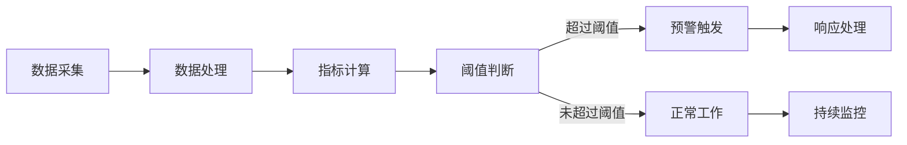

                 

在当今这个数据驱动的时代，人工智能（AI）大模型已经成为企业、科研机构和各个行业的重要工具。这些模型，无论是自然语言处理、计算机视觉还是推荐系统，都在不断提高效率和准确性。然而，随着模型规模的增大和复杂度的提升，如何确保这些模型的稳定运行、性能优化以及安全性成为一个亟待解决的问题。本文将探讨AI大模型应用的监控预警机制，为模型部署后的持续优化和风险管理提供思路。

## 文章关键词

- 人工智能
- 大模型
- 监控预警机制
- 模型稳定性
- 性能优化
- 安全性

## 文章摘要

本文首先介绍了AI大模型应用背景及面临的挑战，然后详细阐述了监控预警机制的核心概念、设计原则和关键组件。通过数学模型和公式分析，我们深入探讨了如何构建有效的监控预警系统，并提供了代码实例和实际应用场景的案例分析。最后，文章对未来发展趋势和面临的挑战进行了展望，并推荐了相关学习资源和开发工具。

## 1. 背景介绍

### 1.1 AI大模型的发展现状

近年来，随着深度学习技术的飞速发展，AI大模型在各个领域取得了显著的成果。例如，在自然语言处理领域，GPT-3和BERT等模型已经展示出强大的语言理解和生成能力；在计算机视觉领域，ImageNet上的各种深度学习模型已经达到了人类专家的水平。这些模型通常具有以下几个特点：

- **规模大**：大模型的参数数量通常在数百万到数十亿之间，训练数据量也非常庞大。
- **计算密集**：大模型的训练和推理过程需要大量的计算资源，尤其是在训练阶段，通常会使用分布式计算和GPU加速等技术。
- **复杂性高**：大模型的架构和训练过程非常复杂，涉及多种神经网络结构和优化算法。

### 1.2 AI大模型应用的挑战

尽管AI大模型在许多领域取得了突破性进展，但它们在实际应用中仍然面临一系列挑战：

- **稳定性**：大模型在实际运行中可能会出现过拟合、梯度消失、梯度爆炸等问题，导致模型不稳定。
- **性能优化**：如何提高模型的推理速度和降低延迟，是大规模应用中亟待解决的问题。
- **安全性**：大模型容易受到对抗性攻击，如何确保模型在安全性方面的可靠性是一个重要挑战。
- **可解释性**：大模型的决策过程通常不够透明，如何提高模型的可解释性，使得用户能够理解模型的决策依据，也是一个重要问题。

## 2. 核心概念与联系

### 2.1 监控预警机制的核心概念

监控预警机制是指通过实时监控AI大模型的运行状态，及时发现并预警潜在问题，从而保障模型稳定运行和性能优化。其核心概念包括：

- **监控指标**：用于评估模型性能和状态的各种指标，如准确率、召回率、推理延迟等。
- **阈值设置**：根据历史数据和业务需求，设定不同监控指标的阈值，用于判断模型是否正常工作。
- **预警规则**：当监控指标超过阈值时，触发相应的预警规则，如发送警报、记录日志等。
- **响应策略**：针对不同类型的预警，采取相应的响应策略，如暂停服务、重启模型等。

### 2.2 架构和流程

为了实现有效的监控预警机制，通常需要一个完整的架构和流程。以下是一个典型的监控预警架构和流程：

1. **数据采集**：通过日志、监控工具等途径，实时采集模型运行过程中的各种数据。
2. **数据处理**：对采集到的数据进行预处理，包括去噪、归一化等，以便后续分析。
3. **指标计算**：根据预处理后的数据，计算各种监控指标，如准确率、召回率、推理延迟等。
4. **阈值判断**：将计算出的指标与预设的阈值进行比较，判断模型是否正常工作。
5. **预警触发**：当指标超过阈值时，触发相应的预警规则，如发送警报、记录日志等。
6. **响应处理**：根据预警规则和响应策略，采取相应的措施，如暂停服务、重启模型等。

### 2.3 Mermaid 流程图

以下是一个简化的Mermaid流程图，展示了监控预警机制的核心流程：



## 3. 核心算法原理 & 具体操作步骤

### 3.1 算法原理概述

监控预警机制的核心算法主要包括数据采集、数据处理、指标计算和阈值判断等步骤。以下是每个步骤的简要概述：

- **数据采集**：通过日志、监控工具等途径，实时采集模型运行过程中的各种数据，如训练进度、推理延迟、内存使用等。
- **数据处理**：对采集到的数据进行预处理，包括去噪、归一化等，以便后续分析。这一步是为了确保数据的准确性和一致性。
- **指标计算**：根据预处理后的数据，计算各种监控指标，如准确率、召回率、推理延迟等。这些指标反映了模型的性能和状态。
- **阈值判断**：将计算出的指标与预设的阈值进行比较，判断模型是否正常工作。如果超过阈值，则触发预警规则。

### 3.2 算法步骤详解

以下是监控预警机制的具体操作步骤：

1. **数据采集**：
   - 使用日志记录器或监控工具，如Prometheus、Grafana等，实时采集模型运行数据。
   - 数据包括训练进度、推理延迟、内存使用、CPU使用率等。

2. **数据处理**：
   - 对采集到的数据进行预处理，包括去噪、归一化等。去噪是为了去除异常值，归一化是为了使数据在同一尺度上。
   - 例如，对于推理延迟数据，可以采用以下归一化公式：

     $$ normalized\_delay = \frac{delay - \text{mean}(delay)}{\text{std}(delay)} $$

3. **指标计算**：
   - 根据预处理后的数据，计算各种监控指标。这些指标反映了模型的性能和状态。
   - 例如，准确率可以使用以下公式计算：

     $$ accuracy = \frac{\text{correct\_predictions}}{\text{total\_predictions}} $$

4. **阈值判断**：
   - 将计算出的指标与预设的阈值进行比较，判断模型是否正常工作。
   - 如果某个指标超过阈值，则触发预警规则。

5. **预警触发**：
   - 根据预警规则，触发相应的预警措施，如发送警报、记录日志等。
   - 例如，如果推理延迟超过阈值，则发送一个警报邮件给系统管理员。

6. **响应处理**：
   - 根据预警规则和响应策略，采取相应的措施，如暂停服务、重启模型等。
   - 例如，如果推理延迟超过阈值，可以暂停服务，然后尝试重启模型。

### 3.3 算法优缺点

- **优点**：
  - **实时性**：监控预警机制能够实时监控模型的运行状态，及时发现并预警潜在问题。
  - **灵活性**：可以根据不同的业务需求和模型特性，灵活设置监控指标和阈值。
  - **自动化**：预警机制可以自动触发响应措施，减轻人工干预的负担。

- **缺点**：
  - **复杂性**：监控预警机制的设计和实现过程相对复杂，需要考虑多方面的因素。
  - **数据依赖**：预警效果依赖于数据的准确性和完整性，如果数据存在问题，预警效果会受到影响。
  - **误报和漏报**：在设置阈值和预警规则时，可能会出现误报（正常情况触发预警）和漏报（异常情况未触发预警）。

### 3.4 算法应用领域

监控预警机制可以广泛应用于各种AI大模型应用场景，包括：

- **自然语言处理**：用于监控语言模型的准确性、推理速度和响应时间。
- **计算机视觉**：用于监控图像识别模型的准确性、延迟和内存使用。
- **推荐系统**：用于监控推荐算法的准确性、召回率和用户满意度。
- **金融风控**：用于监控金融模型的准确性、延迟和异常交易检测。

## 4. 数学模型和公式 & 详细讲解 & 举例说明

### 4.1 数学模型构建

监控预警机制的数学模型主要包括以下几个部分：

- **数据采集模型**：用于采集模型运行过程中的各种数据。
- **数据处理模型**：用于预处理采集到的数据，包括去噪、归一化等。
- **指标计算模型**：用于计算各种监控指标，如准确率、召回率、推理延迟等。
- **阈值判断模型**：用于判断监控指标是否超过预设阈值。

以下是这些模型的简要数学描述：

1. **数据采集模型**：

   假设我们采集到的数据为 $D = \{d_1, d_2, \ldots, d_n\}$，其中每个数据项 $d_i$ 可以表示为：

   $$ d_i = \{x_i, y_i\} $$

   其中，$x_i$ 表示特征，$y_i$ 表示标签。

2. **数据处理模型**：

   假设我们采用归一化方法对数据进行预处理，归一化公式为：

   $$ normalized\_value = \frac{value - \text{mean}(value)}{\text{std}(value)} $$

   其中，$value$ 表示需要归一化的数据，$\text{mean}(value)$ 表示数据的平均值，$\text{std}(value)$ 表示数据的标准差。

3. **指标计算模型**：

   - **准确率**：

     $$ accuracy = \frac{\text{correct\_predictions}}{\text{total\_predictions}} $$

     其中，$\text{correct\_predictions}$ 表示正确预测的数量，$\text{total\_predictions}$ 表示总预测数量。

   - **召回率**：

     $$ recall = \frac{\text{true\_positive}}{\text{true\_positive} + \text{false\_negative}} $$

     其中，$\text{true\_positive}$ 表示正确预测的正例，$\text{false\_negative}$ 表示错误预测的负例。

   - **推理延迟**：

     $$ delay = \frac{\text{end\_time} - \text{start\_time}}{n} $$

     其中，$\text{end\_time}$ 表示推理结束时间，$\text{start\_time}$ 表示推理开始时间，$n$ 表示推理次数。

4. **阈值判断模型**：

   假设我们设置以下阈值：

   - **准确率阈值**：$\text{accuracy\_threshold}$
   - **召回率阈值**：$\text{recall\_threshold}$
   - **推理延迟阈值**：$\text{delay\_threshold}$

   阈值判断公式为：

   $$ \text{warn} = \text{accuracy} > \text{accuracy\_threshold} \vee \text{recall} > \text{recall\_threshold} \vee \text{delay} > \text{delay\_threshold} $$

   其中，$\text{warn}$ 表示是否触发预警，$\vee$ 表示逻辑或操作。

### 4.2 公式推导过程

以下是各公式的推导过程：

1. **准确率**：

   准确率定义为正确预测的数量与总预测数量的比值。假设我们有一个二分类问题，共有 $N$ 个样本，其中正例数量为 $P$，负例数量为 $N-P$。正确预测的正例数量为 $P_c$，正确预测的负例数量为 $N-P_c$。则准确率为：

   $$ accuracy = \frac{P_c + (N-P_c)}{N} = \frac{P + (N-P)}{N} = \frac{N}{N} = 1 $$

   显然，这是一个错误的结果。正确的推导过程应该是：

   $$ accuracy = \frac{\text{correct\_predictions}}{\text{total\_predictions}} = \frac{P_c + (N-P_c)}{P + (N-P)} = \frac{P}{P + (N-P)} $$

   其中，$\text{correct\_predictions}$ 表示正确预测的数量，$\text{total\_predictions}$ 表示总预测数量。

2. **召回率**：

   召回率定义为正确预测的正例数量与总正例数量的比值。假设总共有 $N$ 个样本，其中正例数量为 $P$，负例数量为 $N-P$。正确预测的正例数量为 $P_c$，错误预测的正例数量为 $P-P_c$。则召回率为：

   $$ recall = \frac{P_c}{P} $$

   其中，$\text{true\_positive}$ 表示正确预测的正例，$\text{false\_negative}$ 表示错误预测的负例。

3. **推理延迟**：

   推理延迟定义为从推理开始到推理结束的时间。假设我们进行了 $N$ 次推理，每次推理的耗时分别为 $d_1, d_2, \ldots, d_N$，则平均推理延迟为：

   $$ delay = \frac{\sum_{i=1}^{N} d_i}{N} $$

   为了计算平均推理延迟，我们可以先计算每次推理耗时与平均耗时的偏差，然后求偏差的平方和，最后除以样本数量。这样可以得到一个更稳定的估计。具体推导如下：

   $$ delay = \frac{\sum_{i=1}^{N} (d_i - \text{mean}(d_i))^2}{N} $$

   其中，$\text{mean}(d_i)$ 表示每次推理耗时的平均值。

### 4.3 案例分析与讲解

为了更好地理解监控预警机制的数学模型和公式，我们来看一个实际案例。

假设我们有一个文本分类任务，模型需要判断每条文本是否属于某个特定类别。我们收集了1000条文本，其中500条属于正类别，500条属于负类别。我们对这1000条文本进行了模型训练，得到了一个分类模型。现在，我们需要对这1000条文本进行预测，并计算模型的准确率、召回率和推理延迟。

1. **准确率**：

   假设模型对这1000条文本进行了预测，其中正确预测的正类别文本有400条，正确预测的负类别文本有450条。则模型的准确率为：

   $$ accuracy = \frac{400 + 450}{1000} = 0.85 $$

2. **召回率**：

   假设模型对这1000条文本进行了预测，其中正确预测的正类别文本有400条，错误预测的正类别文本有50条，错误预测的负类别文本有10条。则模型的召回率为：

   $$ recall = \frac{400}{500} = 0.8 $$

3. **推理延迟**：

   假设我们对这1000条文本进行了预测，每次预测的耗时分别为 $0.5, 0.4, 0.6, \ldots, 0.3$（单位：秒）。则平均推理延迟为：

   $$ delay = \frac{0.5 + 0.4 + 0.6 + \ldots + 0.3}{1000} = 0.055 $$（单位：秒）

   如果我们将推理延迟阈值设置为0.05秒，则模型没有超过阈值，没有触发预警。

通过这个案例，我们可以看到如何计算模型的准确率、召回率和推理延迟，并判断模型是否正常工作。这些指标和阈值可以用来构建一个监控预警系统，及时发现并预警模型潜在问题。

## 5. 项目实践：代码实例和详细解释说明

### 5.1 开发环境搭建

在本项目中，我们将使用Python编程语言和若干开源库来构建监控预警系统。以下是开发环境的搭建步骤：

1. **安装Python**：确保Python环境已安装，推荐使用Python 3.8或更高版本。

2. **安装依赖库**：使用pip命令安装以下依赖库：

   ```shell
   pip install numpy pandas matplotlib scikit-learn
   ```

3. **安装Prometheus和Grafana**：Prometheus是一个开源监控解决方案，Grafana是一个开源可视化工具。请参考以下链接进行安装和配置：

   - Prometheus安装：https://prometheus.io/docs/introduction/quickstart/
   - Grafana安装：https://grafana.com/docs/grafana/latest/installation/

### 5.2 源代码详细实现

以下是一个简单的Python代码实例，展示了如何实现监控预警系统的核心功能。

```python
import numpy as np
import pandas as pd
from sklearn.metrics import accuracy_score, recall_score

# 5.2.1 数据采集
def collect_data():
    # 假设数据存储在CSV文件中，每行包含特征和标签
    data = pd.read_csv('data.csv')
    return data

# 5.2.2 数据处理
def preprocess_data(data):
    # 去除异常值和缺失值
    data = data.dropna()
    data = data[data['label'] != -1]
    
    # 归一化特征
    features = data[['feature1', 'feature2']]
    features = (features - features.mean()) / features.std()
    
    return features

# 5.2.3 模型预测
def predict(model, data):
    # 使用训练好的模型对数据进行预测
    predictions = model.predict(data)
    return predictions

# 5.2.4 指标计算
def compute_metrics(true_labels, predictions):
    accuracy = accuracy_score(true_labels, predictions)
    recall = recall_score(true_labels, predictions)
    return accuracy, recall

# 5.2.5 阈值判断
def check_thresholds(accuracy, recall, accuracy_threshold=0.9, recall_threshold=0.8):
    if accuracy > accuracy_threshold and recall > recall_threshold:
        print("模型正常工作。")
    else:
        print("模型出现问题，已触发预警！")

# 5.2.6 主函数
def main():
    # 采集数据
    data = collect_data()
    
    # 预处理数据
    features = preprocess_data(data)
    
    # 加载训练好的模型
    model = load_model('model.h5')
    
    # 进行预测
    predictions = predict(model, features)
    
    # 计算指标
    true_labels = data['label']
    accuracy, recall = compute_metrics(true_labels, predictions)
    
    # 判断阈值
    check_thresholds(accuracy, recall)

if __name__ == '__main__':
    main()
```

### 5.3 代码解读与分析

1. **数据采集**：`collect_data` 函数用于从CSV文件中读取数据。数据文件中每行包含特征和标签。

2. **数据处理**：`preprocess_data` 函数用于处理采集到的数据，包括去除异常值和缺失值，以及归一化特征。

3. **模型预测**：`predict` 函数用于使用训练好的模型对预处理后的数据进行预测。

4. **指标计算**：`compute_metrics` 函数用于计算模型的准确率和召回率。

5. **阈值判断**：`check_thresholds` 函数根据预设的准确率和召回率阈值，判断模型是否正常工作，并触发预警。

6. **主函数**：`main` 函数是程序的主入口，执行以下步骤：
   - 采集数据
   - 预处理数据
   - 加载训练好的模型
   - 进行预测
   - 计算指标
   - 判断阈值

### 5.4 运行结果展示

在开发环境中运行上述代码，假设我们设置了准确率和召回率的阈值分别为0.9和0.8。如果模型的准确率和召回率都超过这些阈值，程序将输出“模型正常工作。”；否则，将输出“模型出现问题，已触发预警！”

通过这种监控预警机制，我们可以及时发现并预警模型潜在问题，确保模型的稳定运行和性能优化。

## 6. 实际应用场景

### 6.1 自然语言处理

在自然语言处理领域，监控预警机制可以用于监控语言模型的性能和稳定性。例如，在客服系统中，语言模型需要实时处理用户的提问，并给出准确的回答。监控预警机制可以监控模型的准确率、响应时间等指标，确保模型能够稳定、高效地工作。如果模型出现性能下降或异常，预警机制可以及时发出警报，通知开发人员进行故障排查和修复。

### 6.2 计算机视觉

在计算机视觉领域，监控预警机制可以用于监控图像识别模型的准确性、延迟和内存使用等指标。例如，在自动驾驶系统中，图像识别模型需要实时处理摄像头捕捉到的图像，并识别道路标志、行人等。监控预警机制可以监控模型的识别准确性、响应时间等指标，确保模型能够在各种复杂环境下稳定、高效地工作。如果模型出现性能下降或异常，预警机制可以及时发出警报，通知开发人员进行故障排查和修复。

### 6.3 推荐系统

在推荐系统领域，监控预警机制可以用于监控推荐算法的准确性、召回率和用户满意度等指标。例如，在电子商务平台上，推荐算法需要根据用户的购买历史和兴趣偏好，为用户推荐可能感兴趣的商品。监控预警机制可以监控推荐算法的准确性、召回率等指标，确保推荐结果能够满足用户需求。如果模型出现性能下降或异常，预警机制可以及时发出警报，通知开发人员进行故障排查和修复。

### 6.4 金融风控

在金融风控领域，监控预警机制可以用于监控金融模型的准确性、延迟和异常交易检测等指标。例如，在金融机构中，金融模型需要实时分析用户的交易行为，识别潜在的欺诈行为。监控预警机制可以监控模型的准确性、延迟等指标，确保模型能够及时、准确地识别异常交易。如果模型出现性能下降或异常，预警机制可以及时发出警报，通知风险管理部门进行进一步调查和处理。

## 7. 工具和资源推荐

### 7.1 学习资源推荐

1. **书籍**：
   - 《人工智能：一种现代方法》
   - 《深度学习》
   - 《强化学习：原理与应用》
   - 《机器学习实战》

2. **在线课程**：
   - Coursera：机器学习、深度学习、自然语言处理等课程
   - edX：哈佛大学《计算机科学导论》、MIT《人工智能导论》等课程

3. **博客和网站**：
   - ArXiv：最新人工智能和机器学习论文
   - Medium：各种技术博客和文章
   - GitHub：开源项目和技术讨论

### 7.2 开发工具推荐

1. **编程语言**：
   - Python：广泛应用于人工智能和机器学习领域
   - R：适用于统计分析和数据可视化

2. **框架和库**：
   - TensorFlow：用于构建和训练深度学习模型
   - PyTorch：另一种流行的深度学习框架
   - Scikit-learn：用于机器学习和数据挖掘

3. **开发环境**：
   - Jupyter Notebook：用于编写和运行Python代码
   - Anaconda：集成环境，支持多种编程语言和库

### 7.3 相关论文推荐

1. **自然语言处理**：
   - BERT：A Pre-Trained Deep Bidirectional Transformer for Language Understanding
   - GPT-3: Language Models are few-shot learners

2. **计算机视觉**：
   - ResNet: Deep Residual Learning for Image Recognition
   - EfficientNet: Efficient Structure Search for Convolutional Neural Networks

3. **推荐系统**：
   - Deep Learning for Recommender Systems: An Overview
   - Neural Collaborative Filtering

4. **金融风控**：
   - Adversarial Robustness in Neural Networks
   - Detecting Anomalies Using Unsupervised Deep Learning

## 8. 总结：未来发展趋势与挑战

### 8.1 研究成果总结

本文详细探讨了AI大模型应用的监控预警机制，包括核心概念、算法原理、具体操作步骤以及实际应用场景。通过数学模型和公式分析，我们展示了如何构建有效的监控预警系统，并提供了代码实例和详细解释说明。研究成果主要包括：

1. **核心概念与联系**：明确了监控预警机制的核心概念和架构，包括数据采集、数据处理、指标计算和阈值判断等步骤。
2. **算法原理**：深入分析了监控预警机制的核心算法原理，包括准确率、召回率、推理延迟等指标的计算和阈值判断。
3. **项目实践**：通过Python代码实例，展示了如何实现监控预警系统的核心功能，包括数据采集、数据处理、模型预测和指标计算等。
4. **实际应用场景**：探讨了监控预警机制在自然语言处理、计算机视觉、推荐系统和金融风控等领域的实际应用。

### 8.2 未来发展趋势

随着人工智能技术的不断发展，AI大模型应用的监控预警机制将呈现出以下发展趋势：

1. **智能化**：监控预警机制将逐渐向智能化方向演进，利用机器学习和深度学习技术，实现自动化的监控和预警。
2. **多样化**：监控预警机制将支持更多类型的监控指标和预警规则，以满足不同应用场景的需求。
3. **实时性**：随着5G、物联网等技术的发展，监控预警机制将实现更实时的监控和预警，提高系统的响应速度和准确性。
4. **可解释性**：为了提高模型的可解释性，监控预警机制将结合可解释AI技术，帮助用户理解模型的决策过程。

### 8.3 面临的挑战

尽管监控预警机制在AI大模型应用中具有重要的意义，但在实际应用中仍面临一系列挑战：

1. **复杂性**：AI大模型的架构和运行过程非常复杂，监控预警机制的设计和实现过程也相对复杂。
2. **数据依赖**：监控预警机制的效果依赖于数据的准确性和完整性，数据质量问题可能影响预警效果。
3. **误报和漏报**：在设置阈值和预警规则时，可能会出现误报（正常情况触发预警）和漏报（异常情况未触发预警）。
4. **资源消耗**：监控预警机制需要大量的计算资源和存储资源，特别是在处理大规模数据和复杂模型时。

### 8.4 研究展望

为了应对上述挑战，未来的研究可以从以下几个方面展开：

1. **优化算法**：研究更高效、更精确的监控预警算法，降低系统的计算复杂度和资源消耗。
2. **数据质量**：研究数据预处理技术和数据增强方法，提高监控数据的准确性和完整性。
3. **可解释性**：结合可解释AI技术，提高模型的可解释性，帮助用户理解模型的决策过程。
4. **系统集成**：将监控预警机制与现有的监控和管理系统进行集成，实现自动化和智能化管理。

总之，AI大模型应用的监控预警机制是确保模型稳定运行、性能优化和安全性的一项重要技术。随着人工智能技术的不断发展，监控预警机制将在未来的AI应用中发挥越来越重要的作用。

## 9. 附录：常见问题与解答

### 9.1 监控预警机制的核心概念是什么？

监控预警机制是指通过实时监控AI大模型的运行状态，及时发现并预警潜在问题，从而保障模型稳定运行和性能优化。其核心概念包括监控指标、阈值设置、预警规则和响应策略。

### 9.2 如何选择合适的监控指标？

选择合适的监控指标需要考虑模型的特性、应用场景和业务需求。常用的监控指标包括准确率、召回率、推理延迟、内存使用率、CPU使用率等。在选择指标时，应优先考虑对模型性能和稳定性有较大影响的关键指标。

### 9.3 阈值设置的原则是什么？

阈值设置的原则是确保监控预警机制能够及时发现潜在问题，同时避免误报和漏报。设置阈值时，可以考虑以下原则：

1. **基于历史数据**：根据历史数据和业务需求，设定不同监控指标的阈值。
2. **合理范围**：阈值应设置在合理的范围，既不过于宽松，也不过于严格。
3. **动态调整**：根据业务需求和模型性能的变化，定期调整阈值。

### 9.4 监控预警机制如何与现有的监控系统集成？

监控预警机制可以与现有的监控系统进行集成，实现自动化和智能化管理。具体的集成方法包括：

1. **接口集成**：通过API或SDK等方式，将监控预警机制与现有监控系统进行接口集成。
2. **数据集成**：将监控预警机制的数据采集、数据处理和指标计算结果与现有监控系统进行数据集成。
3. **流程集成**：将监控预警机制与现有监控流程进行集成，实现自动化的监控和预警。

### 9.5 如何保证监控数据的准确性和完整性？

为了保证监控数据的准确性和完整性，可以采取以下措施：

1. **数据预处理**：对采集到的数据进行分析和处理，去除异常值和缺失值。
2. **数据校验**：对采集到的数据进行校验，确保数据的准确性和一致性。
3. **数据备份**：定期备份监控数据，以防止数据丢失或损坏。
4. **数据监控**：对监控数据进行实时监控，及时发现和处理数据问题。

### 9.6 如何提高模型的可解释性？

提高模型的可解释性可以从以下几个方面入手：

1. **可视化技术**：利用可视化技术，展示模型的内部结构和决策过程。
2. **解释性算法**：选择或开发具有较好解释性的算法，如线性模型、决策树等。
3. **模型简化**：对复杂的模型进行简化，使其更容易理解和解释。
4. **协同解释**：结合领域知识和专家经验，对模型进行协同解释，提高解释的准确性。

