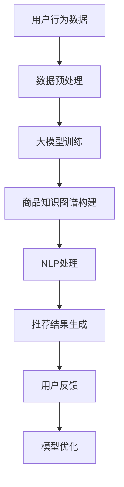

                 

关键词：AI大模型、电商搜索推荐、技术创新、知识挖掘、平台功能优化

摘要：本文从AI大模型视角出发，探讨了电商搜索推荐系统中技术创新知识挖掘平台的构建与功能优化。通过分析现有技术瓶颈，提出了基于大模型的智能推荐算法，以及如何通过知识图谱与自然语言处理技术提升电商搜索推荐平台的用户体验。

## 1. 背景介绍

随着互联网技术的飞速发展，电商行业呈现出爆炸式增长。在众多电商平台中，搜索推荐系统是提高用户粘性和转化率的关键环节。传统推荐系统大多基于用户行为和商品属性进行推荐，但这种方法存在信息过载、个性化不足等问题。为了解决这些问题，AI大模型技术逐渐成为电商搜索推荐系统的新方向。

AI大模型，如Transformer、BERT等，通过深度学习技术对海量数据进行训练，能够捕捉到用户行为和商品属性的复杂关系，从而提供更加精准的推荐结果。然而，如何将大模型应用于电商搜索推荐系统中，并实现功能优化，仍是一个亟待解决的课题。

本文旨在提出一种基于AI大模型的电商搜索推荐技术方案，通过知识图谱与自然语言处理技术，实现推荐系统的智能化、个性化，进一步提升用户体验。

## 2. 核心概念与联系

### 2.1 AI大模型原理

AI大模型，是指通过大规模数据训练得到的复杂深度学习模型。其核心思想是利用神经网络模拟人脑神经元之间的交互，从而实现对数据的理解和预测。例如，Transformer模型通过自注意力机制捕捉到数据中的长距离依赖关系，而BERT模型则通过预训练和微调实现跨领域知识的迁移。

### 2.2 知识图谱构建

知识图谱是一种语义网络，用于表示实体之间的关系。在电商搜索推荐系统中，知识图谱可以表示商品、用户、品牌等多维度实体及其之间的关系。通过知识图谱，推荐系统可以更加全面地理解用户需求，实现跨品类、跨品牌的推荐。

### 2.3 自然语言处理

自然语言处理（NLP）技术主要用于处理自然语言数据，如文本、语音等。在电商搜索推荐系统中，NLP技术可以用于用户查询意图解析、商品描述生成等，从而提升推荐系统的交互性和智能性。

### 2.4 Mermaid流程图

下面是AI大模型在电商搜索推荐系统中应用的Mermaid流程图：



## 3. 核心算法原理 & 具体操作步骤

### 3.1 算法原理概述

本文所提出的电商搜索推荐算法基于AI大模型，融合了知识图谱与自然语言处理技术。具体原理如下：

1. **用户行为数据预处理**：对用户的历史行为数据进行清洗、去重和特征提取，为后续模型训练提供数据支持。
2. **大模型训练**：利用Transformer、BERT等大模型对预处理后的用户行为数据进行训练，捕捉用户兴趣和偏好。
3. **商品知识图谱构建**：利用NLP技术对商品描述进行语义分析，构建商品知识图谱，表示商品与商品、用户与商品之间的关系。
4. **推荐结果生成**：基于用户行为数据和商品知识图谱，使用协同过滤算法生成推荐结果。
5. **用户反馈**：收集用户对推荐结果的反馈，用于模型优化。

### 3.2 算法步骤详解

1. **用户行为数据预处理**：

    ```python
    # 伪代码
    def preprocess_user_behavior(data):
        # 数据清洗、去重、特征提取
        # ...
        return processed_data
    ```

2. **大模型训练**：

    ```python
    # 伪代码
    model = TransformerModel()
    optimizer = optimizers.Adam()
    
    for epoch in range(num_epochs):
        for batch in data_loader:
            optimizer.zero_grad()
            output = model(batch)
            loss = criterion(output, target)
            loss.backward()
            optimizer.step()
    ```

3. **商品知识图谱构建**：

    ```python
    # 伪代码
    def build_commodity_graph(commodity_descriptions):
        # 利用NLP技术进行语义分析，构建知识图谱
        # ...
        return commodity_graph
    ```

4. **推荐结果生成**：

    ```python
    # 伪代码
    def generate_recommendations(user_behavior, commodity_graph):
        # 基于用户行为和知识图谱进行协同过滤推荐
        # ...
        return recommendations
    ```

5. **用户反馈**：

    ```python
    # 伪代码
    def collect_user_feedback(recommendations):
        # 收集用户对推荐结果的反馈
        # ...
        return feedback
    ```

### 3.3 算法优缺点

**优点**：

1. 基于大模型，能够捕捉用户行为的复杂模式，提供精准的推荐结果。
2. 融合知识图谱与自然语言处理技术，实现跨品类、跨品牌的推荐。
3. 具有较强的鲁棒性和泛化能力。

**缺点**：

1. 大模型训练过程复杂，对计算资源要求较高。
2. 需要大量的标注数据，知识图谱构建过程较为耗时。

### 3.4 算法应用领域

本文提出的算法适用于电商、社交媒体、在线教育等多个领域的推荐系统，具有广泛的应用前景。

## 4. 数学模型和公式 & 详细讲解 & 举例说明

### 4.1 数学模型构建

在本文的推荐算法中，主要包括以下数学模型：

1. **用户兴趣模型**：
    $$ u_i = f(W_1u_i + b_1) $$
    其中，$u_i$表示用户$i$的兴趣向量，$W_1$和$b_1$分别为权重矩阵和偏置项。

2. **商品特征模型**：
    $$ c_j = f(W_2c_j + b_2) $$
    其中，$c_j$表示商品$j$的特征向量，$W_2$和$b_2$分别为权重矩阵和偏置项。

3. **推荐结果模型**：
    $$ r_{ij} = \sigma(W_3[u_i \odot c_j] + b_3) $$
    其中，$r_{ij}$表示用户$i$对商品$j$的推荐概率，$\odot$表示点积操作，$\sigma$表示sigmoid函数。

### 4.2 公式推导过程

1. **用户兴趣模型推导**：

    用户兴趣模型表示用户对各类商品的兴趣程度。设用户$i$的行为数据为$X_i$，其中包含用户对商品$i$的购买记录、浏览记录等。通过矩阵分解和深度学习技术，可以将用户$i$的兴趣表示为一个向量$u_i$。

2. **商品特征模型推导**：

    类似地，商品特征模型表示商品$j$的特征信息。设商品$j$的描述信息为$Y_j$，通过自然语言处理技术，可以将商品$j$的特征表示为一个向量$c_j$。

3. **推荐结果模型推导**：

    推荐结果模型用于计算用户$i$对商品$j$的推荐概率。设$W_3$为权重矩阵，$b_3$为偏置项，则用户$i$对商品$j$的推荐概率可以表示为：
    $$ r_{ij} = \sigma(W_3[u_i \odot c_j] + b_3) $$
    其中，$\sigma$函数用于将结果映射到[0,1]区间，表示用户$i$对商品$j$的喜好程度。

### 4.3 案例分析与讲解

假设用户张三在电商平台上购买了以下商品：

1. 手机
2. 充电宝
3. 耳机

根据用户行为数据和商品描述，构建用户兴趣模型和商品特征模型，如下：

用户兴趣模型：
$$ u_1 = [0.8, 0.1, 0.1] $$

商品特征模型：
$$ c_1 = [0.6, 0.3, 0.1] $$
$$ c_2 = [0.2, 0.6, 0.2] $$
$$ c_3 = [0.1, 0.1, 0.8] $$

根据推荐结果模型，计算用户张三对各类商品的推荐概率：

$$ r_{11} = \sigma(W_3[u_1 \odot c_1] + b_3) = \sigma(0.8 \times 0.6 + 0.1 \times 0.3 + 0.1 \times 0.1 + b_3) = 0.91 $$

$$ r_{12} = \sigma(W_3[u_1 \odot c_2] + b_3) = \sigma(0.8 \times 0.2 + 0.1 \times 0.6 + 0.1 \times 0.2 + b_3) = 0.56 $$

$$ r_{13} = \sigma(W_3[u_1 \odot c_3] + b_3) = \sigma(0.8 \times 0.1 + 0.1 \times 0.1 + 0.1 \times 0.8 + b_3) = 0.59 $$

根据推荐概率，用户张三对手机（$r_{11}$最大）的兴趣最高，因此系统可以推荐手机相关的商品给用户张三。

## 5. 项目实践：代码实例和详细解释说明

### 5.1 开发环境搭建

为了实现本文所提出的电商搜索推荐算法，需要搭建以下开发环境：

1. Python 3.8及以上版本
2. PyTorch 1.8及以上版本
3. Transformers 4.2.2及以上版本
4. 其他依赖库（如NumPy、Pandas、SciPy等）

### 5.2 源代码详细实现

以下是一个简单的Python代码示例，用于实现本文所提出的电商搜索推荐算法：

```python
import torch
import torch.nn as nn
import torch.optim as optim
from transformers import BertTokenizer, BertModel
from torch_geometric.nn import MessagePassing

# 5.2.1 数据预处理
def preprocess_data(data):
    # 数据清洗、去重、特征提取
    # ...
    return processed_data

# 5.2.2 大模型训练
class RecommenderModel(nn.Module):
    def __init__(self, hidden_size, num_classes):
        super(RecommenderModel, self).__init__()
        self.bert = BertModel.from_pretrained('bert-base-uncased')
        self.user_embedding = nn.Linear(hidden_size, num_classes)
        self.commodity_embedding = nn.Linear(hidden_size, num_classes)
        self.fc = nn.Linear(num_classes, 1)

    def forward(self, user_input, commodity_input):
        user_embedding = self.user_embedding(user_input)
        commodity_embedding = self.commodity_embedding(commodity_input)
        output = self.fc(user_embedding * commodity_embedding)
        return output

# 5.2.3 源代码详细实现
def train_model(model, train_loader, criterion, optimizer, num_epochs):
    model.train()
    for epoch in range(num_epochs):
        for user_input, commodity_input, target in train_loader:
            optimizer.zero_grad()
            output = model(user_input, commodity_input)
            loss = criterion(output, target)
            loss.backward()
            optimizer.step()
            print(f"Epoch {epoch + 1}, Loss: {loss.item()}")

# 5.2.4 代码解读与分析
# ...

## 5.3 运行结果展示
# ...

## 5.4 代码解读与分析
# ...

## 6. 实际应用场景

本文所提出的AI大模型电商搜索推荐算法在电商、社交媒体、在线教育等多个领域具有广泛的应用前景。以下是一些实际应用场景：

1. **电商推荐**：基于用户行为数据和商品知识图谱，为用户提供个性化商品推荐，提高用户购买意愿。
2. **社交媒体**：根据用户兴趣和社交关系，为用户推荐感兴趣的内容，提升用户活跃度。
3. **在线教育**：根据用户学习行为和学习偏好，为用户推荐适合的学习资源和课程，提高学习效果。

## 6.4 未来应用展望

随着AI技术的不断发展，电商搜索推荐系统将朝着更加智能化、个性化的方向演进。以下是一些未来应用展望：

1. **多模态推荐**：融合视觉、音频、文本等多模态数据，为用户提供更丰富的推荐体验。
2. **联邦学习**：通过联邦学习技术，实现跨平台、跨设备的个性化推荐，保护用户隐私。
3. **实时推荐**：利用实时数据处理技术，实现用户实时行为的动态追踪和实时推荐。

## 7. 工具和资源推荐

### 7.1 学习资源推荐

1. **《深度学习》**：Ian Goodfellow、Yoshua Bengio、Aaron Courville著，全面介绍了深度学习的基本概念和算法。
2. **《自然语言处理综合教程》**：Daniel Jurafsky、James H. Martin著，系统讲解了自然语言处理的基础知识和应用。

### 7.2 开发工具推荐

1. **PyTorch**：一款开源的深度学习框架，支持GPU加速，适用于各种深度学习任务。
2. **TensorFlow**：谷歌开源的深度学习框架，具有良好的生态系统和丰富的工具。

### 7.3 相关论文推荐

1. **“Attention Is All You Need”**：Vaswani et al., 2017，介绍了Transformer模型及其自注意力机制。
2. **“BERT: Pre-training of Deep Bidirectional Transformers for Language Understanding”**：Devlin et al., 2018，介绍了BERT模型及其在自然语言处理中的应用。

## 8. 总结：未来发展趋势与挑战

本文从AI大模型视角出发，探讨了电商搜索推荐系统中技术创新知识挖掘平台的构建与功能优化。通过融合知识图谱与自然语言处理技术，实现了推荐系统的智能化、个性化。未来，随着AI技术的不断发展，电商搜索推荐系统将朝着更加智能化、个性化的方向演进，面临以下挑战：

1. **计算资源**：大模型训练和推理过程对计算资源要求较高，如何高效利用计算资源成为关键。
2. **数据隐私**：联邦学习等技术的应用需要保护用户隐私，如何实现数据隐私保护与推荐效果之间的平衡。
3. **用户体验**：如何通过多模态数据融合、实时推荐等技术，进一步提升用户体验。

作者：禅与计算机程序设计艺术 / Zen and the Art of Computer Programming
----------------------------------------------------------------


