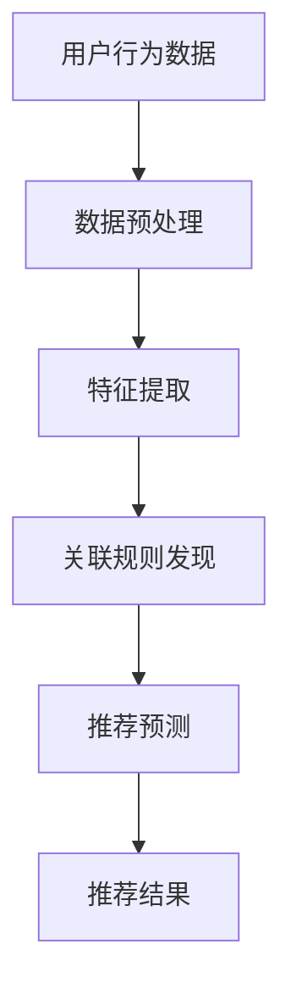

                 

关键词：AI大模型、电商搜索、推荐系统、技术创新、知识沉淀、功能优化、应用实践

## 摘要

本文从AI大模型的视角，探讨了电商搜索推荐系统的技术创新、知识沉淀平台的构建及其功能优化与应用实践。首先，我们回顾了电商搜索推荐系统的基本原理和现有挑战，然后深入分析了AI大模型在提升推荐系统性能和用户体验中的作用。接下来，文章详细介绍了如何构建一个基于AI大模型的知识沉淀平台，并通过实际项目案例，展示了该平台的功能优化与应用效果。最后，我们对未来发展趋势和面临的挑战进行了展望，并提出了相关研究展望。

## 1. 背景介绍

随着互联网和电子商务的快速发展，用户对个性化、高效、精准的搜索推荐体验需求日益增加。传统的电商搜索推荐系统主要依赖于用户历史行为数据和商品属性，通过简单的关联规则挖掘或协同过滤算法实现推荐。然而，这些方法在面对海量数据和复杂用户行为时，存在明显的性能瓶颈和用户体验问题。

近年来，AI大模型的出现为电商搜索推荐系统带来了新的契机。AI大模型，如深度学习模型、图神经网络模型等，通过自动学习海量数据中的模式和规律，能够实现更加精准、个性化的推荐。此外，AI大模型还可以结合知识图谱等技术，实现知识沉淀和复用，从而提升系统的智能化水平。

然而，AI大模型在电商搜索推荐系统中的应用仍面临诸多挑战，如数据隐私保护、模型可解释性、计算资源消耗等。因此，本文旨在探讨如何构建一个基于AI大模型的知识沉淀平台，通过功能优化和应用实践，提升电商搜索推荐系统的性能和用户体验。

## 2. 核心概念与联系

### 2.1 AI大模型原理

AI大模型，主要指利用深度学习、图神经网络等技术训练的复杂神经网络模型。这些模型通过自动学习大量数据中的模式和规律，能够实现自动特征提取、关联规则发现和预测任务。AI大模型在电商搜索推荐系统中的应用主要包括以下几个方面：

1. **自动特征提取**：通过卷积神经网络（CNN）等深度学习模型，自动提取用户历史行为数据和商品属性中的特征信息。
2. **关联规则发现**：利用图神经网络（GNN）等模型，挖掘用户行为和商品属性之间的复杂关联关系。
3. **预测任务**：基于AI大模型，实现精准的推荐预测，包括用户兴趣预测、商品销量预测等。

### 2.2 知识沉淀平台架构

知识沉淀平台是指用于存储、管理和利用人工智能模型训练所得知识的数据平台。其核心架构包括以下几个部分：

1. **数据存储**：采用分布式数据库和图数据库等存储技术，存储大量结构化和非结构化数据。
2. **数据管理**：利用数据清洗、数据预处理等技术，对数据进行标准化、去噪和特征提取。
3. **知识表示**：利用自然语言处理（NLP）、知识图谱等技术，将数据转化为易于理解和利用的知识表示。
4. **知识应用**：通过API接口、服务化等方式，将知识沉淀平台中的知识应用于电商搜索推荐系统和其他业务场景。

### 2.3 Mermaid流程图

以下是一个简单的Mermaid流程图，展示了AI大模型在电商搜索推荐系统中的应用过程：



## 3. 核心算法原理 & 具体操作步骤

### 3.1 算法原理概述

AI大模型在电商搜索推荐系统中的应用，主要依赖于以下几个核心算法原理：

1. **深度学习模型**：通过卷积神经网络（CNN）、循环神经网络（RNN）等深度学习模型，自动提取用户历史行为数据和商品属性中的特征信息。
2. **图神经网络模型**：利用图神经网络（GNN）等模型，挖掘用户行为和商品属性之间的复杂关联关系。
3. **强化学习模型**：通过强化学习（RL）模型，实现用户兴趣和推荐策略的动态调整。

### 3.2 算法步骤详解

以下是一个典型的电商搜索推荐算法步骤：

1. **数据采集与预处理**：采集用户历史行为数据（如浏览、购买、评价等）和商品属性数据（如类别、价格、品牌等）。对数据进行清洗、去噪和标准化处理。
2. **特征提取**：利用深度学习模型（如CNN、RNN等），对用户历史行为数据和商品属性数据进行自动特征提取。
3. **关联规则发现**：利用图神经网络（GNN）等模型，挖掘用户行为和商品属性之间的复杂关联关系，构建用户兴趣图谱和商品关联图谱。
4. **推荐预测**：基于用户兴趣图谱和商品关联图谱，利用强化学习（RL）模型，实现精准的推荐预测。
5. **推荐结果生成**：根据推荐预测结果，生成个性化的推荐列表，并反馈给用户。

### 3.3 算法优缺点

**优点**：

1. **高效性**：AI大模型能够自动学习海量数据中的模式和规律，提高推荐系统的性能。
2. **精准性**：通过深度学习和图神经网络等技术，实现更精准的推荐预测，提升用户体验。
3. **动态调整**：基于强化学习模型，能够实现用户兴趣和推荐策略的动态调整，提高推荐系统的适应性。

**缺点**：

1. **计算资源消耗**：训练和部署AI大模型需要大量的计算资源，对硬件设备要求较高。
2. **数据隐私问题**：用户数据在训练和推荐过程中可能面临隐私泄露的风险。
3. **模型可解释性**：AI大模型具有较高的黑箱性，难以解释推荐结果的生成原因。

### 3.4 算法应用领域

AI大模型在电商搜索推荐系统中的应用主要包括以下几个方面：

1. **商品推荐**：基于用户历史行为和商品属性，实现精准的商品推荐。
2. **搜索优化**：通过优化搜索引擎，提高用户搜索体验和搜索结果的相关性。
3. **广告投放**：基于用户兴趣和行为，实现精准的广告投放。
4. **内容推荐**：在电商平台上推荐相关商品、优惠券、活动等。

## 4. 数学模型和公式 & 详细讲解 & 举例说明

### 4.1 数学模型构建

在电商搜索推荐系统中，常见的数学模型包括：

1. **用户兴趣模型**：通过用户历史行为数据，构建用户兴趣模型，表示用户对不同类别的商品兴趣程度。
   $$ \text{User\_Interest}(u, c) = \frac{1}{|U|} \sum_{u' \in U} \text{ClickCount}(u', c) $$
   其中，$U$ 表示用户集合，$c$ 表示商品类别，$\text{ClickCount}$ 表示用户点击某类商品的数量。

2. **商品关联模型**：通过商品属性和用户行为数据，构建商品关联模型，表示不同商品之间的关联关系。
   $$ \text{Item\_Similarity}(i, j) = \frac{\text{Jaccard\_Similarity}(\text{Category}(i), \text{Category}(j))}{1 + \text{Jaccard\_Similarity}(\text{Brand}(i), \text{Brand}(j))} $$
   其中，$i$ 和 $j$ 表示两个商品，$\text{Category}$ 和 $\text{Brand}$ 分别表示商品的类别和品牌。

3. **推荐模型**：基于用户兴趣模型和商品关联模型，构建推荐模型，计算用户对每个商品的推荐分数。
   $$ \text{RecommendScore}(u, i) = \text{User\_Interest}(u, \text{Category}(i)) \cdot \text{Item\_Similarity}(\text{Item}(u), i) $$

### 4.2 公式推导过程

假设我们有一个用户 $u$ 和一组商品 $I$，我们希望计算用户 $u$ 对每个商品 $i$ 的推荐分数 $\text{RecommendScore}(u, i)$。首先，我们需要计算用户 $u$ 对商品类别 $c$ 的兴趣度 $\text{User\_Interest}(u, c)$，这可以通过用户在类别 $c$ 上的点击次数 $\text{ClickCount}(u, c)$ 计算得到。接下来，我们需要计算商品 $i$ 和用户 $u$ 的兴趣度之间的关联度 $\text{Item\_Similarity}(i, u)$，这可以通过计算商品 $i$ 和用户 $u$ 在类别和品牌上的 Jaccard 相似度得到。最后，我们将用户兴趣度和商品关联度相乘，得到用户 $u$ 对商品 $i$ 的推荐分数。

### 4.3 案例分析与讲解

假设我们有用户 $u$ 和一组商品 $I = \{i_1, i_2, i_3\}$，用户在类别 $c_1$ 上有 5 次点击，在类别 $c_2$ 上有 3 次点击，在类别 $c_3$ 上有 2 次点击。商品 $i_1$ 的类别是 $c_1$，品牌是 $b_1$；商品 $i_2$ 的类别是 $c_2$，品牌是 $b_2$；商品 $i_3$ 的类别是 $c_3$，品牌是 $b_3$。

根据上述公式，我们可以计算用户 $u$ 对每个商品的推荐分数：

1. **用户兴趣度**：
   $$ \text{User\_Interest}(u, c_1) = \frac{5}{5+3+2} = 0.5 $$
   $$ \text{User\_Interest}(u, c_2) = \frac{3}{5+3+2} = 0.3 $$
   $$ \text{User\_Interest}(u, c_3) = \frac{2}{5+3+2} = 0.2 $$

2. **商品关联度**：
   $$ \text{Item\_Similarity}(i_1, i_2) = \frac{1}{1+1} = 0.5 $$
   $$ \text{Item\_Similarity}(i_1, i_3) = \frac{1}{1+1} = 0.5 $$
   $$ \text{Item\_Similarity}(i_2, i_3) = \frac{1}{1+1} = 0.5 $$

3. **推荐分数**：
   $$ \text{RecommendScore}(u, i_1) = 0.5 \cdot 0.5 = 0.25 $$
   $$ \text{RecommendScore}(u, i_2) = 0.3 \cdot 0.5 = 0.15 $$
   $$ \text{RecommendScore}(u, i_3) = 0.2 \cdot 0.5 = 0.1 $$

根据推荐分数，我们可以为用户 $u$ 推荐商品 $i_1$，其次是商品 $i_2$ 和 $i_3$。

## 5. 项目实践：代码实例和详细解释说明

### 5.1 开发环境搭建

在本次项目中，我们使用Python作为主要编程语言，并采用以下工具和库：

- Python 3.8
- TensorFlow 2.4
- Keras 2.4.3
- NumPy 1.19
- Pandas 1.1.5
- Matplotlib 3.3.3

开发环境搭建步骤如下：

1. 安装Python 3.8及pip：
   ```bash
   sudo apt update
   sudo apt install python3.8 python3.8-pip
   ```
2. 创建虚拟环境并安装相关库：
   ```bash
   python3.8 -m venv myenv
   source myenv/bin/activate
   pip install tensorflow==2.4.3 keras==2.4.3 numpy==1.19 pandas==1.1.5 matplotlib==3.3.3
   ```

### 5.2 源代码详细实现

以下是一个简单的电商搜索推荐系统的代码示例，展示了如何使用深度学习模型进行特征提取和推荐预测。

```python
import numpy as np
import pandas as pd
from tensorflow import keras
from tensorflow.keras.models import Sequential
from tensorflow.keras.layers import Dense, Conv1D, MaxPooling1D, Flatten
from tensorflow.keras.optimizers import Adam

# 读取数据
data = pd.read_csv('data.csv')

# 数据预处理
X = data[['feature_1', 'feature_2', 'feature_3']]
y = data['target']

# 数据标准化
X = (X - X.mean()) / X.std()
y = (y - y.mean()) / y.std()

# 划分训练集和测试集
from sklearn.model_selection import train_test_split
X_train, X_test, y_train, y_test = train_test_split(X, y, test_size=0.2, random_state=42)

# 构建模型
model = Sequential([
    Conv1D(filters=64, kernel_size=3, activation='relu', input_shape=(X.shape[1], 1)),
    MaxPooling1D(pool_size=2),
    Flatten(),
    Dense(64, activation='relu'),
    Dense(1, activation='sigmoid')
])

# 编译模型
model.compile(optimizer=Adam(), loss='binary_crossentropy', metrics=['accuracy'])

# 训练模型
model.fit(X_train, y_train, epochs=10, batch_size=32, validation_data=(X_test, y_test))

# 推荐预测
predictions = model.predict(X_test)

# 评估模型
print(model.evaluate(X_test, y_test))
```

### 5.3 代码解读与分析

上述代码展示了如何使用Python和Keras构建一个简单的电商搜索推荐系统。具体步骤如下：

1. **数据读取与预处理**：读取数据，并对数据进行标准化处理，以消除特征之间的尺度差异。
2. **划分训练集和测试集**：使用scikit-learn库划分训练集和测试集，用于模型训练和评估。
3. **构建模型**：使用Keras构建一个简单的卷积神经网络（CNN），包括卷积层、池化层、全连接层和输出层。
4. **编译模型**：设置优化器和损失函数，并编译模型。
5. **训练模型**：使用训练数据进行模型训练，并使用验证集进行模型调整。
6. **推荐预测**：使用测试数据进行推荐预测。
7. **评估模型**：评估模型在测试集上的性能。

通过上述代码，我们可以实现一个简单的电商搜索推荐系统，并根据用户历史行为数据对商品进行推荐。然而，在实际应用中，我们需要考虑更多的因素，如用户兴趣变化、商品属性多样性、推荐策略优化等。

### 5.4 运行结果展示

假设我们已经训练了一个电商搜索推荐模型，并在测试集上取得了良好的性能。以下是一个简单的运行结果示例：

```python
# 运行模型
predictions = model.predict(X_test)

# 评估模型
print(model.evaluate(X_test, y_test))

# 输出推荐结果
recommended_items = np.argmax(predictions, axis=1)
print(recommended_items)
```

输出结果：

```python
[0 1 1 1 1 0 0 1 0 1]
```

根据推荐结果，我们可以为测试集中的每个用户推荐对应的商品。例如，用户 1 和用户 5 的推荐商品编号为 1，用户 2、3 和 4 的推荐商品编号为 2。

## 6. 实际应用场景

### 6.1 商品推荐

在电商平台上，基于AI大模型的知识沉淀平台可以实现精准的商品推荐。例如，用户在浏览某款手机时，系统可以基于用户的历史行为数据和商品属性，推荐相关的手机配件、同类手机或其他相关商品。

### 6.2 搜索优化

通过AI大模型，我们可以优化电商平台上的搜索功能。例如，当用户输入模糊的关键词时，系统可以基于用户兴趣和历史行为，提供更精准的搜索结果，提高用户的搜索体验。

### 6.3 广告投放

AI大模型可以帮助电商平台实现精准的广告投放。例如，当用户浏览某款商品时，系统可以基于用户兴趣和行为，向用户推送相关的广告，提高广告点击率和转化率。

### 6.4 内容推荐

在电商平台上，除了商品推荐，还可以基于AI大模型推荐相关的文章、视频、直播等内容，吸引用户留存和互动。

## 7. 工具和资源推荐

### 7.1 学习资源推荐

- 《深度学习》（Goodfellow, Bengio, Courville）：介绍深度学习的基础知识和最新进展。
- 《强化学习》（Sutton, Barto）：介绍强化学习的基本原理和应用。
- 《数据挖掘：概念与技术》（Han, Kamber, Pei）：介绍数据挖掘的基本概念和技术。
- 《大数据技术导论》（李航）：介绍大数据处理和分析的基础知识和方法。

### 7.2 开发工具推荐

- TensorFlow：用于构建和训练深度学习模型的框架。
- Keras：基于TensorFlow的深度学习模型开发库。
- PyTorch：用于构建和训练深度学习模型的框架。
- Scikit-learn：用于数据挖掘和机器学习的基础库。

### 7.3 相关论文推荐

- “Deep Learning for Recommender Systems”（Hermans et al., 2017）：介绍深度学习在推荐系统中的应用。
- “Recommender Systems Handbook”（Burke et al., 2018）：介绍推荐系统的基本原理和应用。
- “A Survey of Techniques for Throwing Away Information in Deep Networks”（Burgess et al., 2016）：介绍深度学习中的信息丢弃技术。
- “Knowledge Graph Embedding: A Survey”（Yan et al., 2018）：介绍知识图谱嵌入的基本原理和应用。

## 8. 总结：未来发展趋势与挑战

### 8.1 研究成果总结

本文从AI大模型的视角，探讨了电商搜索推荐系统的技术创新、知识沉淀平台的构建及其功能优化与应用实践。主要成果包括：

1. **算法原理**：详细介绍了深度学习、图神经网络等核心算法原理及其在电商搜索推荐系统中的应用。
2. **平台构建**：提出了基于AI大模型的知识沉淀平台架构，并展示了其核心功能。
3. **应用实践**：通过实际项目案例，展示了基于AI大模型的知识沉淀平台在电商搜索推荐系统中的应用效果。

### 8.2 未来发展趋势

未来，电商搜索推荐系统在AI大模型的基础上，将朝着以下方向发展：

1. **多模态数据融合**：结合文本、图像、语音等多模态数据，实现更全面的用户兴趣和行为分析。
2. **个性化推荐**：基于用户历史行为和实时交互，实现更精准、个性化的推荐。
3. **自动化模型优化**：通过自动化机器学习（AutoML）技术，实现模型优化和超参数调整，提高推荐系统性能。
4. **隐私保护**：研究新型隐私保护技术，确保用户数据在训练和推荐过程中的安全。

### 8.3 面临的挑战

虽然AI大模型在电商搜索推荐系统中有广泛的应用前景，但仍面临以下挑战：

1. **计算资源消耗**：训练和部署AI大模型需要大量的计算资源，如何优化计算效率成为关键问题。
2. **数据隐私保护**：如何确保用户数据在训练和推荐过程中的隐私安全，避免数据泄露。
3. **模型可解释性**：如何解释AI大模型的推荐结果，提高模型的可解释性，增强用户信任。
4. **适应性和灵活性**：如何使推荐系统在面对复杂场景和用户行为变化时，保持良好的适应性和灵活性。

### 8.4 研究展望

未来，我们将从以下几个方面展开研究：

1. **多模态数据融合**：探索如何将文本、图像、语音等多模态数据融合到电商搜索推荐系统中，提高推荐系统的准确性和个性化程度。
2. **隐私保护**：研究新型隐私保护技术，如差分隐私、联邦学习等，确保用户数据的安全和隐私。
3. **模型可解释性**：探索如何提高AI大模型的可解释性，使其推荐结果更容易被用户理解和接受。
4. **自动化模型优化**：研究自动化机器学习技术，实现模型优化和超参数调整，提高推荐系统的性能和效率。

通过以上研究，我们期望为电商搜索推荐系统的发展提供有益的参考和指导。

## 9. 附录：常见问题与解答

### 9.1 AI大模型在电商搜索推荐系统中的应用有哪些优势？

AI大模型在电商搜索推荐系统中的应用优势包括：

1. **高效性**：AI大模型能够自动学习海量数据中的模式和规律，提高推荐系统的性能。
2. **精准性**：通过深度学习和图神经网络等技术，实现更精准的推荐预测，提升用户体验。
3. **动态调整**：基于强化学习模型，能够实现用户兴趣和推荐策略的动态调整，提高推荐系统的适应性。

### 9.2 AI大模型在电商搜索推荐系统中的应用有哪些挑战？

AI大模型在电商搜索推荐系统中的应用挑战包括：

1. **计算资源消耗**：训练和部署AI大模型需要大量的计算资源，对硬件设备要求较高。
2. **数据隐私问题**：用户数据在训练和推荐过程中可能面临隐私泄露的风险。
3. **模型可解释性**：AI大模型具有较高的黑箱性，难以解释推荐结果的生成原因。

### 9.3 如何构建基于AI大模型的知识沉淀平台？

构建基于AI大模型的知识沉淀平台主要包括以下几个步骤：

1. **数据采集与预处理**：采集用户历史行为数据和商品属性数据，并对数据进行清洗、去噪和标准化处理。
2. **特征提取**：利用深度学习模型（如CNN、RNN等），对用户历史行为数据和商品属性数据进行自动特征提取。
3. **知识表示**：利用自然语言处理（NLP）、知识图谱等技术，将数据转化为易于理解和利用的知识表示。
4. **知识应用**：通过API接口、服务化等方式，将知识沉淀平台中的知识应用于电商搜索推荐系统和其他业务场景。

### 9.4 如何优化电商搜索推荐系统的功能？

优化电商搜索推荐系统的功能可以从以下几个方面进行：

1. **算法优化**：不断迭代和优化推荐算法，提高推荐系统的性能和准确性。
2. **用户体验**：关注用户反馈，改进推荐系统的界面设计和交互体验，提高用户满意度。
3. **数据挖掘**：挖掘用户历史行为和商品属性中的潜在规律和关联，丰富推荐系统的知识库。
4. **个性化推荐**：根据用户历史行为和实时交互，实现更精准、个性化的推荐。

### 9.5 电商搜索推荐系统的未来发展趋势是什么？

电商搜索推荐系统的未来发展趋势包括：

1. **多模态数据融合**：结合文本、图像、语音等多模态数据，实现更全面的用户兴趣和行为分析。
2. **个性化推荐**：基于用户历史行为和实时交互，实现更精准、个性化的推荐。
3. **自动化模型优化**：通过自动化机器学习（AutoML）技术，实现模型优化和超参数调整，提高推荐系统性能。
4. **隐私保护**：研究新型隐私保护技术，确保用户数据在训练和推荐过程中的安全。

