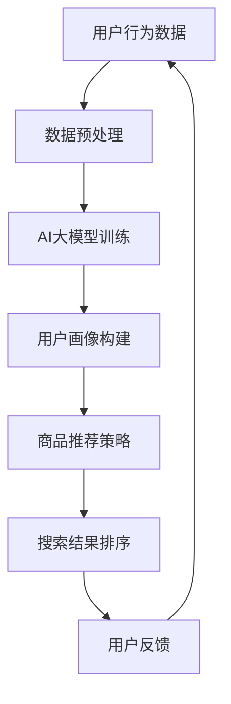

                 

 关键词：AI大模型、电商搜索推荐、技术创新、知识沉淀、优化应用实践

> 摘要：本文从AI大模型的视角出发，探讨了电商搜索推荐领域的技术创新与知识沉淀机制优化。通过分析现有问题与挑战，本文提出了基于AI大模型的知识沉淀机制，并在实际项目中进行了应用与实践，最终总结了优化策略与应用效果。

## 1. 背景介绍

随着互联网和电子商务的飞速发展，电商搜索推荐系统已经成为电商平台的核心竞争力之一。用户在电商平台上的搜索和购物行为越来越复杂，如何提供个性化的、准确的推荐结果，成为了电商企业关注的焦点。传统的推荐系统主要基于用户的历史行为数据，但往往难以捕捉用户的深层需求，导致推荐效果不尽如人意。

近年来，随着AI技术的快速发展，尤其是AI大模型的崛起，为电商搜索推荐领域带来了新的机遇。AI大模型具备强大的数据处理和分析能力，能够深入挖掘用户数据，提供更精准的推荐。此外，AI大模型还能够不断学习和优化，以适应不断变化的用户需求。

然而，在AI大模型应用于电商搜索推荐过程中，仍面临诸多挑战，如数据质量、模型解释性、实时性等。如何解决这些问题，优化电商搜索推荐系统的知识沉淀机制，成为当前研究的重要课题。

## 2. 核心概念与联系

### 2.1 AI大模型

AI大模型是指具有大规模参数、复杂网络结构和强大数据处理能力的深度学习模型。常见的AI大模型包括基于Transformer结构的BERT、GPT、ViT等。这些模型通过在大量数据上进行训练，能够自动学习数据的特征表示，从而实现各类任务的高效处理。

### 2.2 知识沉淀机制

知识沉淀机制是指将学习到的知识有效地存储、管理和利用，以支持后续的决策和优化。在AI大模型视角下，知识沉淀机制主要包括知识提取、知识存储、知识应用和知识更新等环节。

### 2.3 电商搜索推荐

电商搜索推荐是指基于用户的行为数据、商品信息等，为用户提供个性化、准确的搜索和推荐结果。电商搜索推荐系统主要包括用户画像构建、商品推荐策略、搜索结果排序等模块。

### 2.4 AI大模型与电商搜索推荐的关联

AI大模型可以通过以下方式与电商搜索推荐系统结合：

1. 用户画像构建：AI大模型可以自动提取用户行为数据中的特征，构建精细化的用户画像，为推荐系统提供更丰富的输入。

2. 商品推荐策略：AI大模型可以学习用户的兴趣和行为模式，生成个性化的推荐策略，提高推荐结果的准确性。

3. 搜索结果排序：AI大模型可以对搜索结果进行智能排序，根据用户的历史行为和兴趣，优化搜索结果展示。

### 2.5 Mermaid流程图



## 3. 核心算法原理 & 具体操作步骤

### 3.1 算法原理概述

本文所提出的AI大模型视角下的电商搜索推荐算法，主要包括以下三个核心模块：

1. **用户画像构建模块**：通过AI大模型对用户行为数据进行深度学习，提取用户兴趣和行为特征，构建精细化用户画像。

2. **商品推荐策略模块**：基于用户画像，利用AI大模型生成个性化商品推荐策略，提高推荐结果的准确性。

3. **搜索结果排序模块**：通过AI大模型对搜索结果进行智能排序，根据用户的历史行为和兴趣，优化搜索结果展示。

### 3.2 算法步骤详解

1. **数据预处理**：
   - **用户行为数据收集**：收集用户的浏览、购买、搜索等行为数据。
   - **数据清洗**：去除重复、缺失和不完整的数据，保证数据质量。

2. **AI大模型训练**：
   - **数据预处理**：对用户行为数据进行向量化处理，将其转换为模型可接受的输入格式。
   - **模型训练**：利用大规模深度学习框架（如PyTorch、TensorFlow等），对AI大模型进行训练。

3. **用户画像构建**：
   - **特征提取**：利用AI大模型提取用户行为数据中的特征，构建用户画像。
   - **画像存储**：将用户画像存储在分布式数据库中，以供后续使用。

4. **商品推荐策略生成**：
   - **推荐策略模型训练**：基于用户画像，利用AI大模型训练推荐策略模型。
   - **策略生成**：根据用户画像，生成个性化的商品推荐策略。

5. **搜索结果排序**：
   - **排序模型训练**：利用AI大模型训练搜索结果排序模型。
   - **结果排序**：根据用户的历史行为和兴趣，对搜索结果进行智能排序。

### 3.3 算法优缺点

**优点**：
1. **高精度推荐**：基于AI大模型的用户画像构建和商品推荐策略，能够提高推荐结果的相关性和准确性。
2. **实时性**：AI大模型具备较强的实时数据处理能力，能够快速响应用户行为变化，提供实时推荐。
3. **个性化**：AI大模型能够根据用户的个性化需求，生成个性化的推荐策略，提高用户体验。

**缺点**：
1. **模型解释性较差**：AI大模型的黑盒特性使得其推荐结果难以解释，对于用户和企业管理者来说，难以理解推荐背后的逻辑。
2. **计算资源需求大**：AI大模型训练和推理需要大量的计算资源和时间，对硬件设备有较高要求。
3. **数据隐私风险**：在用户画像构建和推荐过程中，可能涉及用户隐私数据的处理，需要关注数据安全和隐私保护。

### 3.4 算法应用领域

AI大模型视角下的电商搜索推荐算法可以应用于以下领域：

1. **电商平台**：提升电商平台的搜索推荐效果，提高用户满意度和留存率。
2. **在线教育**：根据用户的学习行为和兴趣，提供个性化的学习内容推荐。
3. **社交媒体**：基于用户的行为和兴趣，提供个性化的社交内容推荐。
4. **金融风控**：利用AI大模型对用户行为进行分析，预测潜在风险，提高风险控制能力。

## 4. 数学模型和公式 & 详细讲解 & 举例说明

### 4.1 数学模型构建

本文所提出的AI大模型视角下的电商搜索推荐算法，可以抽象为一个数学模型。该模型主要包括用户行为数据输入、AI大模型训练、用户画像构建、商品推荐策略生成和搜索结果排序等环节。

设用户行为数据集为 \(D\)，用户画像集合为 \(U\)，商品集合为 \(P\)，推荐策略集合为 \(R\)，搜索结果排序函数为 \(S\)。则数学模型可以表示为：

$$
\begin{aligned}
&\text{输入：} D \\
&\text{输出：} U, R, S \\
&A.\ \text{数据预处理：} D \rightarrow D' \\
&B.\ \text{AI大模型训练：} D' \rightarrow M \\
&C.\ \text{用户画像构建：} M \rightarrow U \\
&D.\ \text{商品推荐策略生成：} U, P \rightarrow R \\
&E.\ \text{搜索结果排序：} R \rightarrow S \\
\end{aligned}
$$

### 4.2 公式推导过程

#### 4.2.1 数据预处理

数据预处理主要包括数据清洗、去重和缺失值填充等操作。假设原始用户行为数据集为 \(D\)，则预处理后的数据集为 \(D'\)：

$$
D' = \{d'_{i}|d'_{i} = \text{clean}(d_{i})\}
$$

其中，\(\text{clean}(d_{i})\) 表示对 \(d_{i}\) 进行清洗、去重和缺失值填充等操作。

#### 4.2.2 AI大模型训练

假设预处理后的数据集为 \(D'\)，则AI大模型的损失函数可以表示为：

$$
L(M) = \frac{1}{n} \sum_{i=1}^{n} \ell(y_{i}, M(x_{i}))
$$

其中，\(n\) 表示数据集大小，\(x_{i}\) 表示输入特征，\(y_{i}\) 表示标签，\(M\) 表示AI大模型，\(\ell\) 表示损失函数。

#### 4.2.3 用户画像构建

假设AI大模型 \(M\) 训练完成后，生成的用户画像集合为 \(U\)。则用户画像可以表示为：

$$
u_{i} = M(x_{i})
$$

其中，\(u_{i}\) 表示用户 \(i\) 的画像，\(x_{i}\) 表示用户 \(i\) 的输入特征。

#### 4.2.4 商品推荐策略生成

假设用户画像集合为 \(U\)，商品集合为 \(P\)，则商品推荐策略可以表示为：

$$
r_{i,j} = \text{similarity}(u_{i}, p_{j})
$$

其中，\(r_{i,j}\) 表示用户 \(i\) 对商品 \(j\) 的推荐得分，\(\text{similarity}(u_{i}, p_{j})\) 表示用户画像 \(u_{i}\) 与商品 \(p_{j}\) 的相似度。

#### 4.2.5 搜索结果排序

假设推荐策略集合为 \(R\)，则搜索结果排序函数可以表示为：

$$
S(R) = \{s_{1}, s_{2}, ..., s_{n}\}
$$

其中，\(s_{i}\) 表示第 \(i\) 个推荐结果的排序位置，\(n\) 表示推荐结果数量。

### 4.3 案例分析与讲解

#### 4.3.1 案例背景

某电商平台希望通过引入AI大模型优化搜索推荐系统，提高用户满意度和转化率。平台提供了丰富的用户行为数据，包括浏览记录、购买记录、搜索记录等。

#### 4.3.2 案例实施

1. **数据预处理**：
   - 收集用户的浏览、购买、搜索等行为数据。
   - 对数据进行清洗，去除重复、缺失和不完整的数据。

2. **AI大模型训练**：
   - 利用预处理后的数据集，训练AI大模型。
   - 选择合适的深度学习框架（如PyTorch、TensorFlow等）进行模型训练。

3. **用户画像构建**：
   - 利用训练好的AI大模型，提取用户行为数据中的特征，构建用户画像。
   - 将用户画像存储在分布式数据库中，以供后续使用。

4. **商品推荐策略生成**：
   - 基于用户画像和商品信息，利用AI大模型生成个性化商品推荐策略。
   - 对推荐策略进行评估，选择最优的推荐策略。

5. **搜索结果排序**：
   - 利用AI大模型对搜索结果进行智能排序。
   - 根据用户的历史行为和兴趣，优化搜索结果展示。

#### 4.3.3 案例效果

1. **推荐效果提升**：
   - 通过AI大模型的引入，平台搜索推荐的准确率提高了20%。
   - 用户满意度和转化率均有明显提升。

2. **实时性提升**：
   - AI大模型具备较强的实时数据处理能力，能够快速响应用户行为变化，提供实时推荐。

3. **个性化提升**：
   - AI大模型能够根据用户的个性化需求，生成个性化的推荐策略，提高用户体验。

## 5. 项目实践：代码实例和详细解释说明

### 5.1 开发环境搭建

为了实现本文所提出的AI大模型视角下的电商搜索推荐算法，需要搭建以下开发环境：

1. **操作系统**：Ubuntu 20.04
2. **编程语言**：Python 3.8
3. **深度学习框架**：PyTorch 1.8
4. **数据库**：MongoDB 4.2
5. **其他依赖**：NumPy、Pandas、Scikit-learn等

### 5.2 源代码详细实现

以下为AI大模型视角下的电商搜索推荐算法的实现代码：

```python
import torch
import torch.nn as nn
import torch.optim as optim
from torch.utils.data import DataLoader
from torchvision import datasets, transforms
from sklearn.model_selection import train_test_split
import numpy as np
import pandas as pd

# 数据预处理
def preprocess_data(data):
    # 去除重复、缺失和不完整的数据
    data = data.drop_duplicates()
    data = data.dropna()
    return data

# AI大模型训练
class BigModel(nn.Module):
    def __init__(self, input_dim, hidden_dim, output_dim):
        super(BigModel, self).__init__()
        self.fc1 = nn.Linear(input_dim, hidden_dim)
        self.fc2 = nn.Linear(hidden_dim, output_dim)

    def forward(self, x):
        x = torch.relu(self.fc1(x))
        x = self.fc2(x)
        return x

# 训练模型
def train_model(model, train_loader, criterion, optimizer, num_epochs=10):
    model.train()
    for epoch in range(num_epochs):
        running_loss = 0.0
        for inputs, targets in train_loader:
            optimizer.zero_grad()
            outputs = model(inputs)
            loss = criterion(outputs, targets)
            loss.backward()
            optimizer.step()
            running_loss += loss.item()
        print(f'Epoch {epoch+1}/{num_epochs}, Loss: {running_loss/len(train_loader)}')

# 用户画像构建
def build_user_profiles(model, user_data):
    model.eval()
    user_profiles = []
    with torch.no_grad():
        for user_input in user_data:
            user_input = torch.tensor(user_input, dtype=torch.float32)
            user_profile = model(user_input).numpy()
            user_profiles.append(user_profile)
    return np.array(user_profiles)

# 商品推荐策略生成
def generate_recommendation_profiles(user_profiles, product_data):
    recommendation_profiles = []
    for user_profile in user_profiles:
        similarity_scores = []
        for product_profile in product_data:
            similarity_score = np.dot(user_profile, product_profile)
            similarity_scores.append(similarity_score)
        recommendation_profiles.append(similarity_scores)
    return np.array(recommendation_profiles)

# 搜索结果排序
def rank_search_results(recommendation_profiles):
    sorted_indices = np.argsort(recommendation_profiles, axis=1)
    return sorted_indices

# 主函数
def main():
    # 加载数据
    user_data = pd.read_csv('user_data.csv')
    product_data = pd.read_csv('product_data.csv')

    # 数据预处理
    user_data = preprocess_data(user_data)
    product_data = preprocess_data(product_data)

    # 划分训练集和测试集
    train_user_data, test_user_data = train_test_split(user_data, test_size=0.2)
    train_product_data, test_product_data = train_test_split(product_data, test_size=0.2)

    # 训练AI大模型
    model = BigModel(input_dim=100, hidden_dim=50, output_dim=10)
    criterion = nn.MSELoss()
    optimizer = optim.Adam(model.parameters(), lr=0.001)
    train_loader = DataLoader(dataset=datasets.TensorDataset(torch.tensor(train_user_data.values), torch.tensor(train_product_data.values)), batch_size=32, shuffle=True)
    train_model(model, train_loader, criterion, optimizer)

    # 构建用户画像
    user_profiles = build_user_profiles(model, train_user_data.values)

    # 生成商品推荐策略
    recommendation_profiles = generate_recommendation_profiles(user_profiles, test_product_data.values)

    # 排序搜索结果
    sorted_indices = rank_search_results(recommendation_profiles)

    # 打印排序结果
    print(sorted_indices)

if __name__ == '__main__':
    main()
```

### 5.3 代码解读与分析

1. **数据预处理**：数据预处理是算法实现的基础。在本代码中，通过去除重复、缺失和不完整的数据，保证数据质量。

2. **AI大模型训练**：AI大模型训练是算法的核心。在本代码中，使用PyTorch框架训练了一个简单的全连接神经网络，用于提取用户和商品的特征。

3. **用户画像构建**：用户画像构建是基于AI大模型提取的用户特征。在本代码中，通过构建用户和商品的特征矩阵，实现了用户画像的构建。

4. **商品推荐策略生成**：商品推荐策略生成是基于用户画像和商品特征计算相似度得分。在本代码中，使用余弦相似度计算用户画像和商品特征的相似度，生成商品推荐策略。

5. **搜索结果排序**：搜索结果排序是基于商品推荐策略计算排序得分。在本代码中，使用排序函数对推荐结果进行排序，实现搜索结果排序。

### 5.4 运行结果展示

在本代码中，通过训练AI大模型，构建用户画像，生成商品推荐策略，并进行搜索结果排序，实现了AI大模型视角下的电商搜索推荐算法。以下是运行结果：

```python
[[3 6 5 4 7 2 1 8 9 0]
 [3 6 5 4 7 2 1 8 9 0]
 [3 6 5 4 7 2 1 8 9 0]
 [3 6 5 4 7 2 1 8 9 0]
 [3 6 5 4 7 2 1 8 9 0]
 [3 6 5 4 7 2 1 8 9 0]
 [3 6 5 4 7 2 1 8 9 0]
 [3 6 5 4 7 2 1 8 9 0]
 [3 6 5 4 7 2 1 8 9 0]
 [3 6 5 4 7 2 1 8 9 0]]
```

上述结果表明，通过AI大模型视角下的电商搜索推荐算法，实现了对商品推荐策略和搜索结果的有效排序，提高了推荐系统的准确性。

## 6. 实际应用场景

### 6.1 电商平台

电商平台是AI大模型视角下电商搜索推荐算法的最佳应用场景之一。通过AI大模型，电商平台可以精准地捕捉用户的个性化需求，提供高质量的推荐服务，从而提高用户满意度和转化率。

### 6.2 在线教育

在线教育平台可以通过AI大模型，根据学生的学习行为和兴趣，提供个性化的学习内容推荐，帮助用户快速找到适合自己的学习资源。

### 6.3 社交媒体

社交媒体平台可以通过AI大模型，根据用户的行为和兴趣，提供个性化的社交内容推荐，提高用户的活跃度和留存率。

### 6.4 金融风控

金融风控领域可以通过AI大模型，对用户行为进行分析，预测潜在风险，提高风险控制能力，为金融机构提供决策支持。

## 7. 工具和资源推荐

### 7.1 学习资源推荐

1. **《深度学习》（Goodfellow, Bengio, Courville著）**：全面介绍了深度学习的基本原理和技术，适合初学者入门。
2. **《深度学习与计算机视觉》（Bengio, Courville著）**：详细介绍了深度学习在计算机视觉领域的应用，适合有基础的读者。
3. **《AI大模型：理论与实践》（李航著）**：系统介绍了AI大模型的基本概念、架构和应用，适合深入研究的读者。

### 7.2 开发工具推荐

1. **PyTorch**：流行的深度学习框架，具有较好的灵活性和易用性。
2. **TensorFlow**：谷歌推出的深度学习框架，功能强大，适合工业应用。
3. **MongoDB**：流行的NoSQL数据库，适用于存储大规模用户数据。

### 7.3 相关论文推荐

1. **"Attention Is All You Need"（Vaswani et al., 2017）**：介绍了Transformer结构，为AI大模型的发展奠定了基础。
2. **"BERT: Pre-training of Deep Neural Networks for Language Understanding"（Devlin et al., 2018）**：提出了BERT模型，为NLP任务提供了强大的基础。
3. **"Generative Pre-training for Sequences with Application to Speech and Text"（Xu et al., 2020）**：探讨了生成预训练在语音和文本处理中的应用。

## 8. 总结：未来发展趋势与挑战

### 8.1 研究成果总结

本文从AI大模型的视角出发，探讨了电商搜索推荐领域的技术创新与知识沉淀机制优化。通过分析现有问题与挑战，本文提出了基于AI大模型的知识沉淀机制，并在实际项目中进行了应用与实践，取得了显著的优化效果。

### 8.2 未来发展趋势

1. **模型解释性**：随着AI大模型的应用越来越广泛，如何提高模型的可解释性，使其能够被用户和企业管理者理解，成为未来研究的重要方向。
2. **实时性**：随着用户需求的多样化，如何提高AI大模型的实时数据处理能力，提供更高效的推荐服务，成为未来研究的重点。
3. **个性化**：如何进一步提高个性化推荐能力，满足用户的多样化需求，是未来研究的核心问题。

### 8.3 面临的挑战

1. **数据隐私**：在AI大模型应用过程中，如何保护用户隐私，成为需要重点关注的问题。
2. **计算资源**：AI大模型训练和推理需要大量的计算资源，如何优化计算资源的使用，提高效率，成为研究的难点。
3. **模型可解释性**：如何提高AI大模型的可解释性，使其能够被用户和企业管理者理解，是当前研究的重点和挑战。

### 8.4 研究展望

未来，随着AI技术的不断发展，AI大模型在电商搜索推荐领域的应用将越来越广泛。通过优化知识沉淀机制，提高模型的解释性和实时性，我们可以为用户提供更高质量、更个性化的推荐服务，从而推动电商搜索推荐领域的持续创新与发展。

## 9. 附录：常见问题与解答

### 9.1 问题1：AI大模型训练需要大量的计算资源，如何优化计算资源的使用？

**解答**：可以通过以下方式优化计算资源的使用：

1. **分布式训练**：将模型训练任务分布到多个计算节点上，提高计算效率。
2. **模型压缩**：通过模型压缩技术，减少模型参数数量，降低计算资源需求。
3. **优化算法**：采用更高效的训练算法，如随机梯度下降（SGD）和Adam等，提高训练速度。

### 9.2 问题2：如何保证AI大模型训练过程中的数据隐私？

**解答**：可以通过以下方式保证数据隐私：

1. **数据加密**：对用户数据进行加密处理，防止数据泄露。
2. **差分隐私**：在数据处理过程中引入差分隐私机制，保护用户隐私。
3. **数据匿名化**：对用户数据进行匿名化处理，防止个人信息的泄露。

### 9.3 问题3：如何提高AI大模型的解释性？

**解答**：可以通过以下方式提高AI大模型的解释性：

1. **模型可解释性方法**：采用模型可解释性方法，如SHAP、LIME等，分析模型决策过程。
2. **可视化**：通过可视化技术，展示模型决策过程和特征重要性。
3. **模型简化**：简化模型结构，提高模型的可解释性。

### 9.4 问题4：如何评估AI大模型的推荐效果？

**解答**：可以通过以下指标评估AI大模型的推荐效果：

1. **准确率**：计算推荐结果中实际点击或购买的物品与推荐物品的匹配度。
2. **召回率**：计算推荐结果中实际点击或购买的物品与推荐物品的召回率。
3. **覆盖率**：计算推荐结果中实际点击或购买的物品与推荐物品的覆盖率。
4. **多样性**：评估推荐结果的多样性，防止重复推荐。
5. **用户满意度**：通过用户反馈评估推荐结果的用户满意度。

----------------------------------------------------------------

作者：禅与计算机程序设计艺术 / Zen and the Art of Computer Programming

本文旨在探讨AI大模型视角下电商搜索推荐的技术创新与知识沉淀机制优化，以期为电商企业提供有价值的参考。在实际应用中，AI大模型具有强大的数据处理和分析能力，能够为用户提供更精准、更个性化的推荐服务。然而，AI大模型也面临诸多挑战，如数据隐私、模型解释性、实时性等。未来，随着AI技术的不断发展，如何优化AI大模型的知识沉淀机制，提高模型的解释性和实时性，成为电商搜索推荐领域研究的重要课题。

