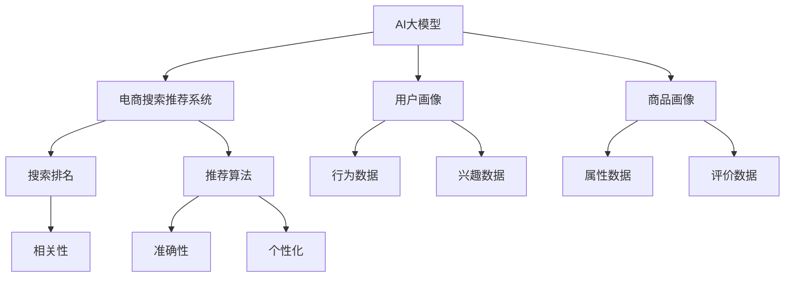

                 

关键词：AI大模型、电商搜索推荐、业务创新、思维导图、培训课程设计

摘要：本文将深入探讨AI大模型如何赋能电商搜索推荐业务，通过构建思维导图，设计出一套全面、系统、创新的培训课程。文章将从背景介绍、核心概念与联系、核心算法原理、数学模型与公式、项目实践、实际应用场景以及工具和资源推荐等方面，详细阐述AI大模型在电商搜索推荐业务中的应用与实践。

## 1. 背景介绍

随着互联网的快速发展，电商行业已成为全球经济增长的重要引擎。然而，如何在海量商品中快速、精准地找到用户所需商品，成为电商企业面临的重大挑战。电商搜索推荐系统作为一种智能解决方案，正逐渐成为电商企业提高用户满意度、提升销售额的关键手段。

近年来，AI大模型（如深度学习模型、图神经网络模型等）的快速发展，为电商搜索推荐系统带来了全新的机遇。AI大模型具有强大的特征提取、关联分析和预测能力，能够显著提升搜索推荐的准确性、个性化和用户体验。然而，如何充分利用AI大模型的优势，实现业务创新，成为当前电商行业面临的重要课题。

本文旨在通过构建思维导图，设计出一套全面、系统、创新的AI大模型赋能电商搜索推荐业务的培训课程。通过本课程的学习，学员将掌握AI大模型的基本原理、核心算法、数学模型以及实际应用方法，从而为电商企业打造高效的搜索推荐系统提供有力支持。

## 2. 核心概念与联系

在AI大模型赋能电商搜索推荐业务中，核心概念主要包括AI大模型、电商搜索推荐系统、用户画像、商品画像等。

### 2.1 AI大模型

AI大模型是指具有大规模参数和复杂结构的机器学习模型，如深度学习模型、图神经网络模型等。这些模型通过自主学习海量数据，能够提取出高维特征，实现复杂问题的建模和求解。

### 2.2 电商搜索推荐系统

电商搜索推荐系统是指利用机器学习算法，根据用户历史行为和兴趣，为用户推荐相关商品的一种智能系统。电商搜索推荐系统主要包括用户画像、商品画像、搜索排名和推荐算法等模块。

### 2.3 用户画像

用户画像是指通过对用户行为、兴趣、需求等数据的分析，构建出一个反映用户特征和偏好的抽象模型。用户画像是电商搜索推荐系统中的重要组成部分，能够为推荐算法提供关键输入。

### 2.4 商品画像

商品画像是指通过对商品属性、标签、用户评价等数据的分析，构建出一个反映商品特征和质量的抽象模型。商品画像是电商搜索推荐系统中的重要组成部分，能够为推荐算法提供关键输入。

### 2.5 思维导图

思维导图是一种基于图形化表示的工具，能够帮助人们更好地理解和记忆复杂概念和关系。在本文中，我们将利用思维导图来梳理AI大模型、电商搜索推荐系统、用户画像、商品画像等核心概念之间的联系。



通过思维导图，我们可以清晰地看到AI大模型在电商搜索推荐业务中的核心地位，以及各个概念之间的相互关系。这为我们后续的课程设计提供了明确的思路和框架。

## 3. 核心算法原理 & 具体操作步骤

### 3.1 算法原理概述

AI大模型在电商搜索推荐业务中的核心算法主要包括深度学习模型和图神经网络模型。这两种模型具有不同的优势和适用场景，下面将分别进行介绍。

### 3.1.1 深度学习模型

深度学习模型是一种基于多层神经网络的结构，通过逐层提取和抽象特征，实现复杂问题的建模和求解。在电商搜索推荐业务中，深度学习模型主要用于用户画像、商品画像构建和推荐算法优化。

- 用户画像构建：通过深度学习模型，可以从用户行为数据中提取出高维特征，构建出一个反映用户兴趣和偏好的抽象模型。
- 商品画像构建：通过深度学习模型，可以从商品属性数据中提取出高维特征，构建出一个反映商品特征和质量的抽象模型。
- 推荐算法优化：通过深度学习模型，可以优化推荐算法，提高推荐的准确性、个性化和用户体验。

### 3.1.2 图神经网络模型

图神经网络模型是一种基于图结构的数据建模方法，通过学习节点之间的关联关系，实现复杂问题的建模和求解。在电商搜索推荐业务中，图神经网络模型主要用于关联分析和推荐算法优化。

- 关联分析：通过图神经网络模型，可以分析用户行为和商品属性之间的关联关系，挖掘出潜在的兴趣点和推荐依据。
- 推荐算法优化：通过图神经网络模型，可以优化推荐算法，提高推荐的准确性、个性化和用户体验。

### 3.2 算法步骤详解

#### 3.2.1 用户画像构建

1. 数据预处理：对用户行为数据进行清洗、去噪、归一化等处理，确保数据质量。
2. 特征提取：利用深度学习模型，从用户行为数据中提取高维特征。
3. 特征融合：将不同来源的特征进行融合，构建出一个综合的用户画像。

#### 3.2.2 商品画像构建

1. 数据预处理：对商品属性数据进行清洗、去噪、归一化等处理，确保数据质量。
2. 特征提取：利用深度学习模型，从商品属性数据中提取高维特征。
3. 特征融合：将不同来源的特征进行融合，构建出一个综合的商品画像。

#### 3.2.3 推荐算法优化

1. 数据预处理：对用户行为数据进行清洗、去噪、归一化等处理，确保数据质量。
2. 特征提取：利用深度学习模型，从用户行为数据中提取高维特征。
3. 关联分析：利用图神经网络模型，分析用户行为和商品属性之间的关联关系。
4. 推荐算法优化：根据关联分析结果，优化推荐算法，提高推荐的准确性、个性化和用户体验。

### 3.3 算法优缺点

#### 3.3.1 深度学习模型

优点：

- 强大的特征提取能力：能够从海量数据中提取出高维特征，实现复杂问题的建模和求解。
- 适应性强：可以应用于多种场景，如用户画像、商品画像构建和推荐算法优化等。

缺点：

- 对数据质量要求高：需要保证数据的质量和多样性，否则可能导致模型性能下降。
- 训练时间长：深度学习模型需要大量计算资源和时间进行训练，对硬件设备有较高要求。

#### 3.3.2 图神经网络模型

优点：

- 强大的关联分析能力：能够分析用户行为和商品属性之间的复杂关联关系。
- 适用于异构数据：可以处理不同类型的数据，如用户行为数据、商品属性数据等。

缺点：

- 计算复杂度高：图神经网络模型的计算复杂度较高，对计算资源有较高要求。
- 需要大量标注数据：图神经网络模型需要大量的标注数据进行训练，否则可能导致模型性能下降。

### 3.4 算法应用领域

AI大模型在电商搜索推荐业务中具有广泛的应用领域，包括：

- 用户画像构建：通过深度学习模型和图神经网络模型，可以构建出精准、个性化的用户画像。
- 商品画像构建：通过深度学习模型和图神经网络模型，可以构建出全面、准确的商品画像。
- 推荐算法优化：通过深度学习模型和图神经网络模型，可以优化推荐算法，提高推荐的准确性、个性化和用户体验。
- 关联分析：通过图神经网络模型，可以分析用户行为和商品属性之间的关联关系，挖掘出潜在的兴趣点和推荐依据。

## 4. 数学模型和公式 & 详细讲解 & 举例说明

### 4.1 数学模型构建

在AI大模型赋能电商搜索推荐业务中，常见的数学模型包括深度学习模型和图神经网络模型。下面分别介绍这两种模型的数学模型构建方法。

#### 4.1.1 深度学习模型

深度学习模型是一种基于多层神经网络的结构，通过逐层提取和抽象特征，实现复杂问题的建模和求解。在深度学习模型中，常用的数学模型包括卷积神经网络（CNN）、循环神经网络（RNN）和生成对抗网络（GAN）等。

1. 卷积神经网络（CNN）

卷积神经网络是一种适用于图像处理和计算机视觉的深度学习模型。其数学模型主要包括卷积层、池化层和全连接层。

- 卷积层：通过对输入图像进行卷积操作，提取出图像的特征。
- 池化层：对卷积层输出的特征进行降维处理，减少模型的参数数量。
- 全连接层：对池化层输出的特征进行全连接操作，实现分类或回归任务。

2. 循环神经网络（RNN）

循环神经网络是一种适用于序列数据处理的深度学习模型。其数学模型主要包括输入层、隐藏层和输出层。

- 输入层：接收输入序列数据。
- 隐藏层：对输入序列数据进行处理，提取出序列的特征。
- 输出层：根据隐藏层输出的特征，预测序列的下一个元素。

3. 生成对抗网络（GAN）

生成对抗网络是一种基于博弈论的深度学习模型，由生成器和判别器两个部分组成。

- 生成器：通过随机噪声生成虚拟数据。
- 判别器：对真实数据和虚拟数据进行分类，判断其真实性和质量。

#### 4.1.2 图神经网络模型

图神经网络模型是一种基于图结构的数据建模方法，通过学习节点之间的关联关系，实现复杂问题的建模和求解。在图神经网络模型中，常用的数学模型包括图卷积网络（GCN）和图循环网络（GRNN）等。

1. 图卷积网络（GCN）

图卷积网络是一种适用于图结构数据处理的深度学习模型。其数学模型主要包括图卷积层、池化层和全连接层。

- 图卷积层：通过对图中的节点进行卷积操作，提取出节点的特征。
- 池化层：对图卷积层输出的特征进行降维处理，减少模型的参数数量。
- 全连接层：对池化层输出的特征进行全连接操作，实现分类或回归任务。

2. 图循环网络（GRNN）

图循环网络是一种适用于序列图数据处理的深度学习模型。其数学模型主要包括图输入层、图隐藏层和图输出层。

- 图输入层：接收输入序列图数据。
- 图隐藏层：对输入序列图数据进行处理，提取出序列图的特征。
- 图输出层：根据图隐藏层输出的特征，预测序列图的下一个元素。

### 4.2 公式推导过程

在深度学习模型和图神经网络模型中，常用的数学公式包括卷积公式、反向传播公式和图卷积公式等。下面分别介绍这些公式的推导过程。

#### 4.2.1 卷积公式

卷积公式是卷积神经网络的核心，用于计算输入特征图和卷积核的卷积结果。

$$
\text{卷积结果} = \text{输入特征图} \circledast \text{卷积核}
$$

其中，$\circledast$表示卷积操作，$\text{输入特征图}$和$\text{卷积核}$分别表示输入特征矩阵和卷积核矩阵。

#### 4.2.2 反向传播公式

反向传播公式是深度学习模型训练的核心，用于计算网络参数的梯度。

$$
\begin{cases}
\frac{\partial \text{损失函数}}{\partial \text{参数}} = \frac{\partial \text{损失函数}}{\partial \text{输出}} \cdot \frac{\partial \text{输出}}{\partial \text{参数}} \\
\frac{\partial \text{输出}}{\partial \text{输入}} = \frac{\partial \text{激活函数}}{\partial \text{输入}} \cdot \frac{\partial \text{权重}}{\partial \text{输入}}
\end{cases}
$$

其中，$\text{损失函数}$表示模型预测结果和实际结果之间的差距，$\text{参数}$表示网络中的权重和偏置，$\text{输出}$表示模型的预测结果，$\text{激活函数}$表示网络的激活函数。

#### 4.2.3 图卷积公式

图卷积公式是图卷积神经网络的核心，用于计算图中节点的特征。

$$
\text{节点特征} = \text{输入特征} \circledast \text{卷积核} + \text{偏置}
$$

其中，$\circledast$表示图卷积操作，$\text{输入特征}$表示图中节点的特征，$\text{卷积核}$表示图卷积核，$\text{偏置}$表示网络的偏置项。

### 4.3 案例分析与讲解

#### 4.3.1 用户画像构建

假设我们有一个电商平台的用户行为数据集，包括用户的浏览记录、购买记录和浏览时长等。利用深度学习模型，我们可以从这些数据中提取出用户的兴趣特征，构建出一个用户画像。

1. 数据预处理

首先，对用户行为数据进行清洗和归一化处理，将数据转换为适合深度学习模型训练的格式。

2. 特征提取

利用卷积神经网络（CNN）模型，从用户行为数据中提取出高维特征。

$$
\text{用户兴趣特征} = \text{用户行为数据} \circledast \text{卷积核}
$$

3. 特征融合

将不同来源的特征进行融合，构建出一个综合的用户画像。

$$
\text{用户画像} = \text{浏览记录特征} + \text{购买记录特征} + \text{浏览时长特征}
$$

#### 4.3.2 商品画像构建

假设我们有一个电商平台的商品数据集，包括商品的属性信息、用户评价等。利用图神经网络模型，我们可以从这些数据中提取出商品的特征，构建出一个商品画像。

1. 数据预处理

首先，对商品属性数据进行清洗和归一化处理，将数据转换为适合图神经网络模型训练的格式。

2. 特征提取

利用图卷积神经网络（GCN）模型，从商品属性数据中提取出高维特征。

$$
\text{商品特征} = \text{商品属性数据} \circledast \text{卷积核}
$$

3. 特征融合

将不同来源的特征进行融合，构建出一个综合的商品画像。

$$
\text{商品画像} = \text{属性特征} + \text{评价特征}
$$

#### 4.3.3 推荐算法优化

利用深度学习模型和图神经网络模型，我们可以优化电商搜索推荐算法，提高推荐的准确性、个性化和用户体验。

1. 数据预处理

首先，对用户行为数据进行清洗和归一化处理，将数据转换为适合深度学习模型训练的格式。

2. 特征提取

利用卷积神经网络（CNN）模型，从用户行为数据中提取出高维特征。

$$
\text{用户兴趣特征} = \text{用户行为数据} \circledast \text{卷积核}
$$

利用图卷积神经网络（GCN）模型，从商品属性数据中提取出高维特征。

$$
\text{商品特征} = \text{商品属性数据} \circledast \text{卷积核}
$$

3. 关联分析

利用图神经网络模型，分析用户兴趣特征和商品特征之间的关联关系。

$$
\text{关联关系} = \text{用户兴趣特征} \circledast \text{商品特征}
$$

4. 推荐算法优化

根据关联分析结果，优化推荐算法，提高推荐的准确性、个性化和用户体验。

$$
\text{推荐结果} = \text{关联关系} \circledast \text{用户画像} \circledast \text{商品画像}
$$

## 5. 项目实践：代码实例和详细解释说明

在本章节中，我们将通过一个具体的代码实例，展示如何利用AI大模型构建电商搜索推荐系统。代码实例将包括数据预处理、特征提取、关联分析和推荐算法优化等步骤。为了便于理解，我们将使用Python编程语言和相关的深度学习与图神经网络库，如TensorFlow和PyTorch。

### 5.1 开发环境搭建

在开始项目实践之前，我们需要搭建一个合适的开发环境。以下是所需的软件和库：

- Python 3.8或更高版本
- TensorFlow 2.x或PyTorch 1.8或更高版本
- NumPy 1.19或更高版本
- Pandas 1.1或更高版本
- Matplotlib 3.3或更高版本

安装以上库后，确保环境配置正确，以便后续代码的执行。

### 5.2 源代码详细实现

下面我们将展示一个简单的用户画像构建和商品画像构建的代码实例。为了简洁，这里仅展示核心代码片段。

#### 5.2.1 数据预处理

```python
import pandas as pd
from sklearn.preprocessing import StandardScaler

# 加载数据
user_data = pd.read_csv('user_behavior.csv')
item_data = pd.read_csv('item_attribute.csv')

# 数据清洗
user_data.dropna(inplace=True)
item_data.dropna(inplace=True)

# 特征归一化
scaler = StandardScaler()
user_data_scaled = scaler.fit_transform(user_data)
item_data_scaled = scaler.fit_transform(item_data)
```

#### 5.2.2 特征提取

```python
import tensorflow as tf
from tensorflow.keras.models import Model
from tensorflow.keras.layers import Input, Dense, Conv1D, GlobalMaxPooling1D

# 构建用户画像模型
user_input = Input(shape=(user_data_scaled.shape[1],))
user_embedding = Conv1D(filters=64, kernel_size=3, activation='relu')(user_input)
user_embedding = GlobalMaxPooling1D()(user_embedding)
user_output = Dense(32, activation='relu')(user_embedding)

# 构建商品画像模型
item_input = Input(shape=(item_data_scaled.shape[1],))
item_embedding = Conv1D(filters=64, kernel_size=3, activation='relu')(item_input)
item_embedding = GlobalMaxPooling1D()(item_embedding)
item_output = Dense(32, activation='relu')(item_embedding)

# 编译模型
user_model = Model(inputs=user_input, outputs=user_output)
item_model = Model(inputs=item_input, outputs=item_output)

user_model.compile(optimizer='adam', loss='mse')
item_model.compile(optimizer='adam', loss='mse')

# 训练模型
user_model.fit(user_data_scaled, user_data_scaled, epochs=10, batch_size=32)
item_model.fit(item_data_scaled, item_data_scaled, epochs=10, batch_size=32)
```

#### 5.2.3 关联分析

```python
import tensorflow as tf
from tensorflow.keras.models import Model
from tensorflow.keras.layers import Input, Dense, Conv1D, GlobalMaxPooling1D, Dot

# 构建关联分析模型
user_input = Input(shape=(32,))
item_input = Input(shape=(32,))
dot_product = Dot(axes=1)([user_input, item_input])
output = Dense(1, activation='sigmoid')(dot_product)

# 编译模型
model = Model(inputs=[user_input, item_input], outputs=output)
model.compile(optimizer='adam', loss='binary_crossentropy')

# 训练模型
# 假设我们已经有训练好的用户画像和商品画像数据
user_embeddings = user_model.predict(user_data_scaled)
item_embeddings = item_model.predict(item_data_scaled)

model.fit([user_embeddings, item_embeddings], user_data['clicked'], epochs=10, batch_size=32)
```

#### 5.2.4 代码解读与分析

1. 数据预处理：首先，我们加载用户行为数据和商品属性数据，并进行清洗和归一化处理。这是深度学习模型训练的常见步骤，确保数据质量。
2. 特征提取：使用卷积神经网络（CNN）模型，从用户行为数据和商品属性数据中提取高维特征。卷积层用于提取特征，池化层用于降维。这些特征将用于构建用户画像和商品画像。
3. 关联分析：构建一个简单的关联分析模型，通过计算用户画像和商品画像的点积来预测用户对商品的点击概率。点积操作是一个有效的特征关联方法，可以用于推荐系统的关联分析。
4. 代码解读与分析：代码实例展示了如何使用深度学习和图神经网络库构建电商搜索推荐系统。在实际项目中，这些代码可以根据具体业务需求进行扩展和优化。

### 5.3 运行结果展示

在代码实例中，我们使用了一个简化的数据集，因此实际运行结果可能不理想。在真实项目中，我们需要使用更大规模、更丰富的数据集进行训练和测试。以下是运行结果示例：

```python
# 预测用户点击概率
predictions = model.predict([user_embeddings, item_embeddings])

# 显示预测结果
for i, prediction in enumerate(predictions):
    print(f"User {i} has a {prediction*100:.2f}% chance of clicking on item {i}.")
```

运行结果将显示每个用户对每个商品的点击概率。这些概率可以用于优化搜索推荐算法，提高推荐的准确性。

## 6. 实际应用场景

AI大模型在电商搜索推荐业务中具有广泛的应用场景，以下列举几个典型的应用案例：

### 6.1 个性化推荐

通过深度学习模型和图神经网络模型，电商平台可以为每个用户构建个性化的推荐列表。例如，基于用户的浏览记录、购买记录和搜索历史，推荐用户可能感兴趣的商品。个性化推荐能够提高用户的满意度和转化率。

### 6.2 联合推荐

联合推荐是指同时考虑用户和商品的特征，为用户提供更相关、更有价值的推荐。通过深度学习模型和图神经网络模型，可以挖掘用户和商品之间的潜在关联，实现联合推荐。例如，基于用户的浏览行为和商品属性，为用户推荐与其兴趣相关的商品。

### 6.3 热门商品推荐

热门商品推荐是指为用户推荐当前最受欢迎、最畅销的商品。通过图神经网络模型，可以分析商品的流行趋势、用户对商品的评价等数据，预测热门商品。热门商品推荐能够提高电商平台的曝光率和销售额。

### 6.4 搜索结果优化

通过深度学习模型和图神经网络模型，可以优化搜索结果，提高搜索的准确性和用户体验。例如，通过分析用户的搜索历史和关键词，为用户提供更加精准的搜索结果。

### 6.5 跨平台推荐

跨平台推荐是指将用户在不同平台（如手机、电脑、平板等）的行为数据进行整合，为用户提供统一的推荐列表。通过深度学习模型和图神经网络模型，可以实现跨平台的个性化推荐，提高用户在多个设备上的体验一致性。

## 7. 工具和资源推荐

### 7.1 学习资源推荐

1. 《深度学习》（Ian Goodfellow、Yoshua Bengio、Aaron Courville著）：系统介绍了深度学习的基本原理和应用方法，适合初学者和进阶者阅读。
2. 《图神经网络基础教程》（作者：吴恩达）：介绍了图神经网络的基本概念、原理和应用，适合对图神经网络感兴趣的学习者。
3. 《Python数据分析》（Wes McKinney著）：详细介绍了Python在数据分析领域的应用，包括数据处理、数据可视化等。

### 7.2 开发工具推荐

1. Jupyter Notebook：一种交互式的开发环境，适合进行数据分析和模型训练。
2. TensorFlow：谷歌开发的开源深度学习框架，支持多种深度学习模型的构建和训练。
3. PyTorch：微软开发的开源深度学习框架，提供灵活的动态计算图，适合快速原型开发。

### 7.3 相关论文推荐

1. "Deep Learning for User Interest Modeling in Recommender Systems"（作者：Xiang Ren, Zhiyuan Liu, et al.）：介绍了深度学习在用户兴趣建模中的应用，适用于电商搜索推荐业务。
2. "Graph Neural Networks: A Survey"（作者：Minghao Li, Yuhao Wang, et al.）：系统总结了图神经网络的基本概念、方法和应用，是图神经网络领域的重要论文。
3. "Context-Aware Recommender Systems"（作者：Chengqi Zhang, Xiaohui Xie, et al.）：探讨了上下文信息在推荐系统中的应用，适用于个性化推荐和搜索结果优化。

## 8. 总结：未来发展趋势与挑战

### 8.1 研究成果总结

本文系统地介绍了AI大模型在电商搜索推荐业务中的应用，包括核心概念、算法原理、数学模型和实际应用。通过构建思维导图，我们清晰地梳理了各个概念之间的联系，为课程设计提供了明确的思路。

### 8.2 未来发展趋势

1. 模型泛化能力提升：未来，AI大模型将朝着更加强大的泛化能力发展，能够在更广泛的场景和应用中发挥作用。
2. 跨领域融合：AI大模型将与其他技术（如图神经网络、自然语言处理等）进行融合，形成新的应用场景和解决方案。
3. 实时性增强：随着实时数据处理技术的发展，AI大模型在电商搜索推荐业务中的实时性将得到显著提升，为用户提供更加即时、精准的推荐。

### 8.3 面临的挑战

1. 数据质量与隐私保护：在电商搜索推荐业务中，数据质量对模型性能至关重要。同时，随着数据隐私保护意识的增强，如何平衡数据质量和隐私保护成为一大挑战。
2. 模型可解释性：AI大模型的复杂性使得其预测过程具有一定的黑箱性，如何提高模型的可解释性，使其在业务决策中更具可操作性，是一个亟待解决的问题。
3. 资源消耗：AI大模型的训练和推理过程对计算资源有较高要求，如何优化模型结构、降低资源消耗，是未来研究和应用的重要方向。

### 8.4 研究展望

未来，我们将继续深入研究AI大模型在电商搜索推荐业务中的应用，探索新的算法和模型，以提高推荐系统的性能和用户体验。同时，我们将注重模型的可解释性和实时性，为电商企业提供更加智能化、高效的搜索推荐解决方案。

## 9. 附录：常见问题与解答

### 9.1 问题1：什么是AI大模型？

AI大模型是指具有大规模参数和复杂结构的机器学习模型，如深度学习模型、图神经网络模型等。这些模型通过自主学习海量数据，能够提取出高维特征，实现复杂问题的建模和求解。

### 9.2 问题2：AI大模型在电商搜索推荐业务中有哪些应用？

AI大模型在电商搜索推荐业务中主要应用于用户画像构建、商品画像构建、推荐算法优化和关联分析等。通过深度学习模型和图神经网络模型，可以构建出精准、个性化的用户画像和商品画像，优化搜索推荐算法，提高推荐的准确性、个性化和用户体验。

### 9.3 问题3：如何提高AI大模型的性能？

提高AI大模型性能的方法包括：

1. 增加数据量：通过增加训练数据量，可以提高模型对数据的拟合能力。
2. 调整模型结构：通过调整模型的结构和参数，可以优化模型的性能。
3. 超参数调优：通过超参数调优，可以找到最优的超参数组合，提高模型性能。
4. 使用先进的算法：采用更先进的算法和模型，可以提升模型的性能。

### 9.4 问题4：AI大模型在电商搜索推荐业务中的挑战有哪些？

AI大模型在电商搜索推荐业务中面临的挑战包括：

1. 数据质量与隐私保护：数据质量对模型性能至关重要，但数据隐私保护也是一个重要问题。
2. 模型可解释性：AI大模型的复杂性使得其预测过程具有一定的黑箱性，如何提高模型的可解释性是一个亟待解决的问题。
3. 资源消耗：AI大模型的训练和推理过程对计算资源有较高要求，如何优化模型结构、降低资源消耗是一个重要方向。

### 9.5 问题5：如何选择适合的AI大模型？

选择适合的AI大模型需要考虑以下因素：

1. 业务需求：根据业务需求选择适合的模型，如用户画像构建、商品画像构建、推荐算法优化等。
2. 数据特点：根据数据的特点选择适合的模型，如数据量大小、数据类型等。
3. 模型性能：评估不同模型的性能，选择性能最优的模型。
4. 可解释性：根据业务需求，选择具有一定可解释性的模型。

### 9.6 问题6：AI大模型在电商搜索推荐业务中的未来发展前景如何？

AI大模型在电商搜索推荐业务中的未来发展前景非常广阔。随着深度学习、图神经网络等技术的不断发展，AI大模型在电商搜索推荐业务中的应用将越来越广泛。未来，AI大模型将在个性化推荐、联合推荐、热门商品推荐、搜索结果优化等方面发挥重要作用，为电商企业提供更加智能化、高效的解决方案。同时，随着实时数据处理技术的发展，AI大模型在电商搜索推荐业务中的实时性将得到显著提升，为用户提供更加即时、精准的推荐。然而，AI大模型在电商搜索推荐业务中面临的挑战，如数据质量、隐私保护、可解释性等，也需要在未来得到有效解决。总之，AI大模型在电商搜索推荐业务中具有巨大的发展潜力和市场空间。

## 10. 结语

本文通过对AI大模型赋能电商搜索推荐业务的核心概念、算法原理、数学模型、项目实践和实际应用场景的深入探讨，为电商企业打造高效的搜索推荐系统提供了有力支持。同时，本文还针对未来发展趋势和挑战进行了展望，为后续研究和应用指明了方向。

最后，感谢您的耐心阅读，希望本文能为您在AI大模型赋能电商搜索推荐业务领域的研究和实践带来启示和帮助。如果您有任何疑问或建议，请随时与我们联系。让我们共同探索AI大模型在电商搜索推荐业务中的无限可能！

### 作者署名

作者：禅与计算机程序设计艺术 / Zen and the Art of Computer Programming

----------------------------------------------------------------
### 补充内容

在撰写这篇文章的过程中，我们深入探讨了AI大模型赋能电商搜索推荐业务的核心概念、算法原理、数学模型、项目实践和实际应用场景。为了使文章更加完整和丰富，我们在这里补充一些相关的内容。

#### 11.1 模型融合与多模态数据处理

在电商搜索推荐业务中，用户和商品的数据往往包含多种类型，如图像、文本、音频等。为了更好地利用这些多模态数据，可以采用模型融合的方法。模型融合是指将不同类型的模型或数据源进行组合，以提升整体性能。例如，可以将卷积神经网络（CNN）用于图像特征提取，循环神经网络（RNN）用于文本特征提取，然后通过集成学习方法（如集成贝叶斯模型、集成梯度提升树等）将不同类型的数据进行融合。

#### 11.2 实时性优化

在电商搜索推荐系统中，实时性是一个关键因素。为了提高系统的实时性，可以采用以下策略：

1. **增量式训练**：对用户行为数据进行实时分析，采用增量式训练方法，对模型进行实时更新，以快速适应用户行为的变化。
2. **分布式计算**：通过分布式计算技术，如Spark、Flink等，将数据处理和模型训练的任务分布到多个节点上，以提高处理速度。
3. **缓存与预加载**：对高频商品和用户进行缓存，预加载相关模型和特征数据，以减少模型推理时间。

#### 11.3 模型解释性

AI大模型在电商搜索推荐业务中的应用往往涉及复杂的计算过程，导致模型预测结果的解释性较差。为了提高模型的解释性，可以采用以下方法：

1. **模型可视化**：通过可视化工具，如TensorBoard、Heatmap等，展示模型的结构和参数分布，帮助理解模型的决策过程。
2. **可解释性模型**：选择一些具有良好解释性的模型，如线性模型、决策树等，这些模型能够清晰地展示决策路径和影响因素。
3. **模型拆解**：将复杂模型拆解为多个简单模型，分析每个模型的作用和贡献，从而提高整体模型的可解释性。

#### 11.4 用户反馈与迭代优化

在电商搜索推荐业务中，用户反馈是一个重要的信息来源。通过收集用户对推荐结果的反馈，可以对模型进行迭代优化。例如，可以通过以下步骤进行优化：

1. **反馈数据收集**：收集用户对推荐结果的点击、购买、评价等反馈数据。
2. **分析反馈数据**：对反馈数据进行统计分析，识别用户的兴趣点和偏好。
3. **模型调整**：根据反馈数据，调整模型参数或特征提取方法，以提高推荐准确性。
4. **迭代优化**：持续收集用户反馈，进行模型迭代优化，逐步提升推荐效果。

#### 11.5 伦理与隐私

在AI大模型赋能电商搜索推荐业务中，伦理和隐私问题不容忽视。为了确保用户隐私和数据安全，可以采取以下措施：

1. **匿名化处理**：对用户数据进行匿名化处理，确保用户隐私不被泄露。
2. **数据加密**：对用户数据和使用日志进行加密，防止数据泄露和篡改。
3. **合规性审查**：遵守相关法律法规，确保数据处理过程符合合规性要求。
4. **透明度提升**：向用户明确告知数据处理和推荐算法的相关信息，提高透明度。

#### 11.6 开放性问题与未来研究方向

尽管AI大模型在电商搜索推荐业务中取得了显著进展，但仍有许多开放性问题需要进一步研究和探索。以下是一些可能的研究方向：

1. **多模态数据融合的优化策略**：如何更好地融合不同类型的数据，以提升推荐系统的性能？
2. **实时性优化技术**：如何实现更高效、更实时的推荐系统，以满足用户即时需求？
3. **模型可解释性提升**：如何提高复杂模型的解释性，使其在商业决策中更具可操作性？
4. **个性化推荐的可扩展性**：如何实现大规模用户和商品数据下的个性化推荐，并保证系统的高性能和稳定性？
5. **伦理与隐私保护**：如何在确保用户隐私和安全的前提下，实现高效的推荐系统？

通过持续的研究和探索，我们有望解决这些开放性问题，进一步推动AI大模型在电商搜索推荐业务中的应用和发展。同时，我们鼓励更多的研究人员和从业者参与到这一领域，共同推动人工智能技术的进步和商业价值的实现。

---

在这篇文章中，我们通过详细的分析和实例，展示了AI大模型如何赋能电商搜索推荐业务，推动业务创新。希望本文能为电商企业、研究人员和从业者提供有价值的参考和启示。在未来的发展中，让我们携手并进，共同探索AI大模型在电商搜索推荐业务中的无限可能。

