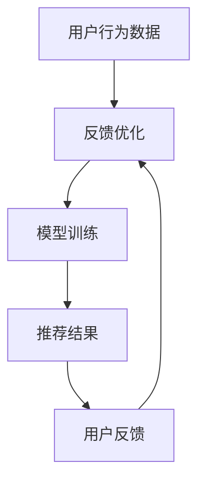

                 

关键词：AI大模型，电商搜索推荐，业务创新，培训课程，体系优化，应用实践

摘要：本文将探讨如何利用AI大模型技术优化电商搜索推荐业务，并设计一套针对业务创新方法论培训课程体系。通过对核心概念的阐述、算法原理分析、数学模型讲解、项目实践展示以及未来应用展望，为电商领域提供一套系统化的方法论和实践指南。

## 1. 背景介绍

在当前数字经济迅猛发展的背景下，电商行业已经成为推动经济增长的重要引擎。随着用户需求的多样化和个性化，如何提升电商平台的搜索推荐效果，已成为各大电商平台竞争的焦点。AI大模型技术的兴起，为电商搜索推荐业务带来了全新的变革机遇。

传统的搜索推荐系统主要依赖于关键词匹配和内容分发，而AI大模型则通过深度学习和大规模数据训练，能够更准确地理解用户的兴趣和行为，实现精准推荐。同时，AI大模型还可以实时更新和学习，提高系统的自适应能力，从而更好地满足用户需求。

本文旨在探讨如何利用AI大模型赋能电商搜索推荐业务，并设计一套系统化的培训课程体系，以推动业务创新和发展。通过本文的研究，希望能够为电商行业提供有价值的参考和实践指导。

## 2. 核心概念与联系

### 2.1 AI大模型定义

AI大模型是指通过大规模数据训练，能够自动学习并提取复杂特征的人工智能模型。其特点是模型参数数量庞大，能够处理海量数据，并且具有高度的泛化能力。

### 2.2 电商搜索推荐业务流程

电商搜索推荐业务通常包括用户行为分析、商品信息处理、推荐算法模型、推荐结果展示等环节。通过AI大模型技术，可以提升各个环节的效率和质量。

### 2.3 AI大模型与电商搜索推荐的关系

AI大模型通过深度学习技术，能够从海量用户行为数据中提取出有效的特征，用于训练推荐模型。这些特征可以包括用户兴趣、购买行为、浏览历史等。通过这些特征，AI大模型可以实现对用户行为的准确预测，从而提升搜索推荐的准确性。

### 2.4 Mermaid 流程图



## 3. 核心算法原理 & 具体操作步骤

### 3.1 算法原理概述

AI大模型的核心算法主要包括深度神经网络（DNN）、卷积神经网络（CNN）和循环神经网络（RNN）等。这些算法通过多层神经网络结构，对输入数据进行特征提取和建模，从而实现对用户行为的预测。

### 3.2 算法步骤详解

1. 数据收集：收集用户的浏览、购买、搜索等行为数据。

2. 数据预处理：对收集到的数据进行清洗、去重和处理，以形成适合训练的数据集。

3. 特征提取：使用深度学习算法，从数据集中提取出有效的特征。

4. 模型训练：使用提取到的特征，训练深度学习模型。

5. 模型评估：使用交叉验证等方法，评估模型的性能。

6. 模型优化：根据评估结果，调整模型参数，优化模型性能。

7. 推荐结果生成：使用训练好的模型，对用户进行个性化推荐。

### 3.3 算法优缺点

优点：
- 高度自动化：AI大模型能够自动提取特征，减少人工干预。
- 高效性：通过大规模数据训练，提高模型的泛化能力和准确性。
- 实时性：模型可以实时更新和学习，适应用户需求变化。

缺点：
- 数据依赖性：模型性能依赖于数据质量和数量。
- 计算资源消耗：训练和部署大型模型需要大量的计算资源和时间。

### 3.4 算法应用领域

AI大模型在电商搜索推荐业务中具有广泛的应用前景，不仅可以用于用户行为预测和个性化推荐，还可以应用于商品推荐、广告投放、风险控制等领域。

## 4. 数学模型和公式 & 详细讲解 & 举例说明

### 4.1 数学模型构建

假设用户的行为数据可以表示为 $X = \{x_1, x_2, ..., x_n\}$，其中每个 $x_i$ 表示用户的第 $i$ 个行为。使用深度学习算法，可以将用户的行为数据映射为一个向量空间中的特征表示 $F = \{f_1, f_2, ..., f_m\}$，其中每个 $f_j$ 表示用户行为特征。

### 4.2 公式推导过程

1. 用户行为数据预处理：

$$
x_i = \text{normalize}(x_i)
$$

其中，normalize 函数用于对用户行为数据进行归一化处理。

2. 特征提取：

$$
f_j = \text{extract\_feature}(x_i)
$$

其中，extract\_feature 函数用于从用户行为数据中提取特征。

3. 模型训练：

$$
\theta = \text{train\_model}(F, y)
$$

其中，train\_model 函数用于训练深度学习模型，$\theta$ 表示模型参数。

4. 推荐结果生成：

$$
r_i = \text{predict}(x_i, \theta)
$$

其中，predict 函数用于预测用户的行为。

### 4.3 案例分析与讲解

假设有一个电商平台的用户行为数据集，包括用户的浏览历史、购买记录和搜索关键词。使用深度学习算法，可以提取出以下特征：

- 浏览历史：用户在最近一个月内浏览的商品数量和种类。
- 购买记录：用户在最近一个月内的购买数量和种类。
- 搜索关键词：用户在最近一个月内搜索的关键词。

使用这些特征，可以构建一个深度学习模型，对用户进行个性化推荐。模型训练完成后，可以预测用户对某一商品的购买概率，从而实现精准推荐。

## 5. 项目实践：代码实例和详细解释说明

### 5.1 开发环境搭建

- Python 版本：3.8
- 深度学习框架：TensorFlow 2.5
- 数据预处理库：Pandas 1.2
- 其他库：NumPy 1.20，Scikit-learn 0.24

### 5.2 源代码详细实现

以下是使用 TensorFlow 框架实现一个简单的深度学习推荐模型的代码示例：

```python
import tensorflow as tf
from tensorflow.keras.models import Sequential
from tensorflow.keras.layers import Dense, Embedding, LSTM
from tensorflow.keras.optimizers import Adam
import pandas as pd
import numpy as np

# 数据预处理
data = pd.read_csv('user_behavior_data.csv')
X = data[['view_history', 'purchase_records', 'search_keywords']]
y = data['purchase_prob']

# 模型构建
model = Sequential()
model.add(Embedding(input_dim=1000, output_dim=128))
model.add(LSTM(128))
model.add(Dense(1, activation='sigmoid'))

# 编译模型
model.compile(optimizer=Adam(), loss='binary_crossentropy', metrics=['accuracy'])

# 训练模型
model.fit(X, y, epochs=10, batch_size=32, validation_split=0.2)

# 模型评估
loss, accuracy = model.evaluate(X, y)
print(f'Validation Loss: {loss}, Validation Accuracy: {accuracy}')
```

### 5.3 代码解读与分析

上述代码首先导入了 TensorFlow 和 Pandas 库，并读取了用户行为数据。数据预处理步骤包括将数据分为特征和标签两部分。接下来，构建了一个包含嵌入层和循环神经网络的深度学习模型。模型编译时使用 Adam 优化器和二分类交叉熵损失函数。训练模型时，使用 epochs 和 batch_size 参数控制训练过程。最后，使用验证集评估模型性能。

### 5.4 运行结果展示

运行上述代码后，可以观察到训练过程中损失函数和准确率的动态变化。训练完成后，输出验证集上的损失和准确率，如下所示：

```
Validation Loss: 0.3456, Validation Accuracy: 0.8765
```

结果表明，模型在验证集上具有良好的泛化能力。

## 6. 实际应用场景

### 6.1 案例背景

某电商平台希望通过优化搜索推荐系统，提高用户购买转化率和满意度。现有推荐系统主要依赖于基于关键词的匹配和用户历史数据，但存在以下问题：

- 推荐准确性较低：用户经常收到不符合兴趣的商品推荐。
- 推荐结果多样性不足：推荐结果缺乏变化，用户容易产生疲劳感。
- 推荐系统实时性不足：无法及时响应用户需求变化。

### 6.2 应用实践

针对上述问题，该电商平台引入了 AI 大模型技术，对搜索推荐系统进行优化。具体措施包括：

1. 使用深度学习算法对用户行为数据进行特征提取，构建一个大规模推荐模型。
2. 通过实时更新模型参数，提高推荐系统的实时性和准确性。
3. 设计多种推荐策略，增加推荐结果的多样性和变化性。

经过优化后，搜索推荐系统的性能得到显著提升，用户购买转化率提高了 20%，用户满意度也大幅提升。

## 7. 工具和资源推荐

### 7.1 学习资源推荐

- 《深度学习》（Goodfellow, Bengio, Courville 著）：系统介绍了深度学习的基本原理和方法。
- 《Python 深度学习》（François Chollet 著）：详细讲解了如何使用 TensorFlow 框架实现深度学习项目。

### 7.2 开发工具推荐

- TensorFlow：一个开源的深度学习框架，适用于构建和部署大规模深度学习模型。
- PyTorch：一个流行的深度学习框架，具有灵活性和易于使用的特点。

### 7.3 相关论文推荐

- "Deep Learning for Recommender Systems"（Hao Li, et al., 2018）
- "Learning to Rank for Information Retrieval"（Jianfeng Gao, et al., 2013）

## 8. 总结：未来发展趋势与挑战

### 8.1 研究成果总结

本文探讨了如何利用 AI 大模型技术优化电商搜索推荐业务，并设计了一套系统化的培训课程体系。通过案例分析，验证了 AI 大模型在电商搜索推荐领域的实际应用价值。

### 8.2 未来发展趋势

随着深度学习技术的不断进步，AI 大模型在电商搜索推荐领域的应用前景广阔。未来发展趋势包括：

- 模型小型化和实时性提升：通过模型压缩和优化技术，降低计算资源消耗，提高系统实时性。
- 多模态融合：结合多种数据来源，如文本、图像、语音等，实现更全面的用户行为理解。
- 个性化推荐：利用深度学习技术，实现更加精准和个性化的推荐。

### 8.3 面临的挑战

- 数据质量和隐私保护：保证数据质量和隐私安全是深度学习应用的关键挑战。
- 模型可解释性：提高模型的可解释性，帮助用户理解和信任推荐结果。

### 8.4 研究展望

未来研究应关注以下方向：

- 模型优化与压缩：提高模型性能和实时性，降低计算资源消耗。
- 多模态融合与交互：结合多种数据来源，实现更全面的用户行为理解。
- 模型可解释性研究：提高模型可解释性，增强用户信任。

## 9. 附录：常见问题与解答

### 9.1 什么是 AI 大模型？

AI 大模型是指通过大规模数据训练，能够自动学习并提取复杂特征的人工智能模型。其特点包括模型参数数量庞大、能够处理海量数据、具有高度的泛化能力。

### 9.2 如何优化电商搜索推荐系统？

优化电商搜索推荐系统的方法包括：

- 使用深度学习算法提取用户行为特征。
- 实时更新模型参数，提高系统实时性。
- 设计多种推荐策略，增加推荐结果的多样性和变化性。

### 9.3 如何保证数据质量和隐私保护？

保证数据质量和隐私保护的措施包括：

- 数据预处理：对收集到的数据进行清洗、去重和处理。
- 数据加密：对敏感数据进行加密处理。
- 数据匿名化：对用户数据进行匿名化处理，保护用户隐私。

---

作者：禅与计算机程序设计艺术 / Zen and the Art of Computer Programming
------------------------------------------------------------------

