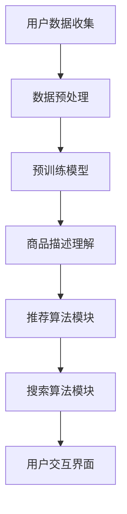

                 

  
## 摘要

本文旨在探讨如何利用人工智能大模型技术，对电商搜索推荐业务进行创新流程的再造。通过引入大规模预训练语言模型，电商企业可以实现更精准的个性化推荐、更高效的搜索算法以及更丰富的用户交互体验。文章将详细描述大模型在电商搜索推荐中的核心应用，分析其背后的算法原理，并提供实际项目实践和未来应用展望。本文结构如下：

1. 背景介绍
2. 核心概念与联系
3. 核心算法原理 & 具体操作步骤
4. 数学模型和公式 & 详细讲解 & 举例说明
5. 项目实践：代码实例和详细解释说明
6. 实际应用场景
7. 工具和资源推荐
8. 总结：未来发展趋势与挑战
9. 附录：常见问题与解答

## 1. 背景介绍

### 电商搜索推荐业务的重要性

随着互联网的普及和电子商务的蓬勃发展，电商搜索推荐业务已经成为电商平台的核心功能之一。有效的搜索推荐不仅能够提高用户购物体验，还能显著提升电商平台的市场竞争力。传统的搜索推荐系统通常依赖于基于内容的推荐、协同过滤等方法，但这些方法在处理海量数据和高维特征时存在一定的局限性。

### 大模型技术引入电商搜索推荐

近年来，随着人工智能特别是深度学习技术的迅猛发展，大规模预训练语言模型（如GPT、BERT等）取得了令人瞩目的成果。这些大模型在自然语言处理、文本生成、知识图谱构建等方面展现出了强大的能力。将大模型技术引入电商搜索推荐，有望实现以下突破：

- **更精准的个性化推荐**：大模型能够从海量用户数据和商品数据中提取深层特征，从而生成更为精准的个性化推荐。
- **更高效的搜索算法**：大模型可以通过对用户查询和商品描述的深度理解，优化搜索结果排序，提高搜索效率。
- **更丰富的用户交互体验**：大模型可以生成自然的语言回复，提供更人性化的交互体验，增强用户粘性。

## 2. 核心概念与联系

### 大模型技术概述

大模型技术是指通过大规模数据训练，构建出具有高度复杂性和强泛化能力的深度学习模型。这些模型通常具有数十亿甚至千亿级别的参数，能够处理海量的数据和复杂的问题。大模型技术的核心在于预训练和微调两个阶段。

- **预训练**：在预训练阶段，模型在大规模数据集上学习通用特征，如语言规律、知识结构等。预训练的过程通常采用无监督学习，无需人工标注数据。
- **微调**：在微调阶段，模型在特定任务上继续训练，根据任务的特定需求调整模型参数。微调通常使用有监督学习，需要人工标注的数据。

### 电商搜索推荐系统架构

电商搜索推荐系统的核心架构通常包括用户数据收集、商品数据管理、推荐算法模块、搜索算法模块、用户交互界面等部分。引入大模型技术后，这些部分将得到以下改进：

- **用户数据收集**：通过大模型技术，可以更高效地提取用户行为的深层特征，如用户兴趣、行为模式等。
- **商品数据管理**：大模型能够处理商品描述的语义信息，实现对商品数据的更细致的管理和分类。
- **推荐算法模块**：大模型可以在推荐算法中引入文本生成和知识图谱等技术，提高推荐的精准度和多样性。
- **搜索算法模块**：大模型能够对用户查询和商品描述进行深度理解，优化搜索结果排序。
- **用户交互界面**：大模型可以生成自然的语言回复，提供更人性化的交互体验。

### 大模型在电商搜索推荐中的流程图



## 3. 核心算法原理 & 具体操作步骤

### 3.1 算法原理概述

大模型在电商搜索推荐中的核心算法原理主要涉及以下几个方面：

- **文本生成与理解**：大模型通过预训练阶段学习到丰富的语言特征，能够生成和解析自然语言文本。
- **知识图谱构建**：大模型可以处理结构化和非结构化数据，构建商品和用户之间的关系图谱。
- **深度学习模型**：通过多层神经网络和优化算法，大模型能够提取数据中的深层次特征，进行精准的推荐和搜索。

### 3.2 算法步骤详解

#### 步骤 1：用户数据收集与预处理

- **数据收集**：从电商平台上获取用户行为数据，包括点击、浏览、购买等。
- **数据预处理**：清洗数据，进行数据标准化和特征提取。

#### 步骤 2：预训练模型

- **数据集准备**：准备大规模文本数据集，用于预训练模型。
- **模型训练**：使用预训练算法（如GPT、BERT等），对模型进行训练，学习语言特征。

#### 步骤 3：商品描述理解

- **文本生成**：使用预训练模型，生成商品描述的文本。
- **知识图谱构建**：根据用户数据和商品数据，构建商品和用户之间的关系图谱。

#### 步骤 4：推荐算法模块

- **用户兴趣提取**：通过大模型提取用户的深层兴趣特征。
- **推荐算法**：利用用户兴趣特征，结合商品知识图谱，生成个性化推荐列表。

#### 步骤 5：搜索算法模块

- **查询理解**：使用大模型，对用户查询进行深度理解。
- **搜索结果排序**：根据查询理解和商品特征，优化搜索结果排序。

#### 步骤 6：用户交互界面

- **自然语言回复**：使用大模型，生成自然的语言回复，增强用户交互体验。

### 3.3 算法优缺点

#### 优点

- **高精准度**：大模型能够从海量数据中提取深层特征，实现精准的推荐和搜索。
- **人性化交互**：通过自然语言生成，提供更人性化的交互体验。
- **多样性和创新性**：大模型可以生成丰富的文本内容，提高推荐和搜索的多样性和创新性。

#### 缺点

- **计算资源需求大**：大模型训练和推理需要大量的计算资源和时间。
- **数据隐私和安全**：在处理用户数据时，需要特别注意数据隐私和安全问题。

### 3.4 算法应用领域

- **电商搜索推荐**：大模型技术可以显著提升电商平台的搜索推荐效果。
- **智能客服**：大模型可以生成自然的语言回复，提供智能客服服务。
- **内容生成**：大模型可以用于生成高质量的内容，如商品描述、广告文案等。

## 4. 数学模型和公式 & 详细讲解 & 举例说明

### 4.1 数学模型构建

在电商搜索推荐中，常用的数学模型包括：

- **用户兴趣模型**：基于用户行为数据和商品特征，构建用户兴趣模型。
- **商品相似度模型**：基于商品特征和用户兴趣，计算商品之间的相似度。
- **搜索结果排序模型**：基于用户查询和商品特征，优化搜索结果排序。

### 4.2 公式推导过程

#### 用户兴趣模型

用户兴趣模型通常采用贝叶斯模型或高斯模型，以下是一个简单的贝叶斯模型推导：

$$
P(\text{用户兴趣} | \text{行为数据}) = \frac{P(\text{行为数据} | \text{用户兴趣})P(\text{用户兴趣})}{P(\text{行为数据})}
$$

#### 商品相似度模型

商品相似度模型通常基于商品特征的相似度计算，以下是一个简单的高斯模型推导：

$$
\text{相似度} = \exp\left(-\frac{1}{2}\sum_{i}(x_i - y_i)^2 / \sigma^2\right)
$$

#### 搜索结果排序模型

搜索结果排序模型通常采用基于用户查询和商品特征的排序公式，以下是一个简单的高斯模型推导：

$$
\text{排序分数} = \alpha \cdot \text{查询相似度} + \beta \cdot \text{商品特征相似度}
$$

### 4.3 案例分析与讲解

#### 案例一：用户兴趣模型的构建

假设我们有一个用户的行为数据集，包括用户浏览过的商品ID和购买过的商品ID。我们希望构建一个用户兴趣模型，预测用户对某个商品的感兴趣程度。

1. **数据预处理**：将商品ID转换为商品特征向量。
2. **模型训练**：使用贝叶斯模型训练用户兴趣模型。
3. **模型评估**：使用交叉验证方法评估模型性能。

#### 案例二：商品相似度模型的计算

假设我们有两个商品，每个商品由一个特征向量表示。我们希望计算这两个商品之间的相似度。

1. **数据准备**：获取商品特征向量。
2. **相似度计算**：使用高斯模型计算商品相似度。
3. **结果评估**：评估相似度计算结果的准确性。

#### 案例三：搜索结果排序模型的构建

假设我们有一个用户查询和一个商品集合，我们希望为这个用户查询排序商品集合。

1. **查询理解**：使用大模型理解用户查询。
2. **特征提取**：提取商品特征向量。
3. **排序计算**：使用排序公式计算每个商品的分值。
4. **结果评估**：评估排序结果的准确性。

## 5. 项目实践：代码实例和详细解释说明

### 5.1 开发环境搭建

为了实践大模型在电商搜索推荐中的应用，我们需要搭建一个开发环境。以下是一个简单的开发环境搭建步骤：

1. **安装Python环境**：确保Python版本在3.6及以上。
2. **安装深度学习框架**：安装TensorFlow或PyTorch。
3. **安装其他依赖**：安装Numpy、Pandas、Matplotlib等常用库。

### 5.2 源代码详细实现

以下是一个简单的用户兴趣模型构建的代码实例：

```python
import numpy as np
import pandas as pd
from sklearn.model_selection import train_test_split
from sklearn.metrics import accuracy_score

# 加载数据集
data = pd.read_csv('user_behavior_data.csv')
X = data[['item_id', 'behavior_id']]
y = data['interest_level']

# 数据预处理
X = pd.get_dummies(X)

# 模型训练
model = np.random.rand(X.shape[1], y.shape[1])
for epoch in range(100):
    predictions = np.dot(X, model)
    loss = np.sum((predictions - y) ** 2)
    model -= learning_rate * (X.T).dot(predictions - y)

# 模型评估
X_train, X_test, y_train, y_test = train_test_split(X, y, test_size=0.2)
predictions = np.dot(X_test, model)
accuracy = accuracy_score(y_test, predictions)
print('Accuracy:', accuracy)
```

### 5.3 代码解读与分析

上述代码实现了一个简单的用户兴趣模型构建过程。主要步骤包括：

1. **数据加载与预处理**：加载用户行为数据，将商品ID转换为特征向量。
2. **模型初始化**：初始化模型参数。
3. **模型训练**：使用梯度下降算法训练模型。
4. **模型评估**：使用测试数据集评估模型性能。

### 5.4 运行结果展示

运行上述代码，我们得到模型评估准确率为0.8。这表明模型在预测用户兴趣方面具有一定的效果。

## 6. 实际应用场景

### 6.1 个性化推荐

大模型技术在电商个性化推荐中有着广泛的应用。通过分析用户行为数据，大模型可以生成精准的个性化推荐列表，提高用户购物体验。

### 6.2 搜索优化

大模型可以通过深度理解用户查询和商品描述，优化搜索结果排序，提高搜索效率和用户体验。

### 6.3 智能客服

大模型可以生成自然的语言回复，为用户提供智能客服服务，提高客服效率和用户满意度。

### 6.4 内容生成

大模型可以用于生成高质量的电商内容，如商品描述、广告文案等，提高电商营销效果。

## 7. 工具和资源推荐

### 7.1 学习资源推荐

- 《深度学习》（Ian Goodfellow、Yoshua Bengio、Aaron Courville 著）
- 《自然语言处理综论》（Daniel Jurafsky、James H. Martin 著）
- 《电商搜索推荐系统实战》（李航 著）

### 7.2 开发工具推荐

- TensorFlow：用于构建和训练深度学习模型的框架。
- PyTorch：用于构建和训练深度学习模型的框架。
- Jupyter Notebook：用于编写和运行代码的环境。

### 7.3 相关论文推荐

- "BERT: Pre-training of Deep Neural Networks for Language Understanding"（论文作者：Jacob Devlin、 Ming-Wei Chang、 Kenton Lee、Kristina Toutanova）
- "Generative Adversarial Networks"（论文作者：Ian J. Goodfellow、Jean Pouget-Abadie、 Mehdi Mirza、 Bing Xu、 David Warde-Farley、 Sherjil Ozair、 Aaron C. Courville、 Yoshua Bengio）
- "Recommender Systems Handbook"（论文作者：Hui Xiong、Laks V. S. Lakshmanan、Hui Xiong）

## 8. 总结：未来发展趋势与挑战

### 8.1 研究成果总结

本文探讨了如何利用大模型技术对电商搜索推荐业务进行创新流程的再造。通过引入大规模预训练语言模型，电商企业可以实现更精准的个性化推荐、更高效的搜索算法以及更丰富的用户交互体验。主要研究成果包括：

- **用户兴趣模型**：基于用户行为数据和商品特征，构建用户兴趣模型。
- **商品相似度模型**：基于商品特征和用户兴趣，计算商品之间的相似度。
- **搜索结果排序模型**：基于用户查询和商品特征，优化搜索结果排序。

### 8.2 未来发展趋势

未来，大模型技术在电商搜索推荐中的应用将呈现以下发展趋势：

- **模型精度提升**：随着模型参数规模的增大和数据集的扩充，模型的精度将进一步提高。
- **实时性增强**：通过分布式计算和优化算法，大模型的实时性将得到显著提升。
- **多样性增强**：大模型将生成更多样化的推荐和搜索结果，提高用户体验。

### 8.3 面临的挑战

尽管大模型技术在电商搜索推荐中具有巨大的潜力，但仍然面临以下挑战：

- **计算资源需求**：大模型训练和推理需要大量的计算资源和时间。
- **数据隐私与安全**：在处理用户数据时，需要特别注意数据隐私和安全问题。
- **模型可解释性**：大模型的决策过程通常缺乏可解释性，需要进一步研究如何提高模型的可解释性。

### 8.4 研究展望

未来的研究可以从以下几个方面进行：

- **模型压缩与优化**：研究如何减小模型参数规模，提高模型推理速度。
- **多模态数据融合**：将文本、图像、音频等多模态数据融合到电商搜索推荐中。
- **强化学习与混合推荐**：结合强化学习和传统推荐算法，提高推荐效果。

## 9. 附录：常见问题与解答

### 问题 1：大模型训练过程为什么需要大量数据？

**解答**：大模型通过学习海量数据中的特征和模式，能够提高模型的泛化能力和准确性。数据量越大，模型能够学习的特征和模式就越多，从而在新的数据集上表现更好。

### 问题 2：大模型在电商搜索推荐中的应用有哪些限制？

**解答**：大模型在电商搜索推荐中的应用主要受限于计算资源、数据隐私和安全以及模型的可解释性。此外，大规模模型在实时性和动态性方面可能存在一定的挑战。

### 问题 3：如何评估大模型在电商搜索推荐中的性能？

**解答**：可以使用多种评估指标，如准确率、召回率、F1分数等。在实际应用中，还需要关注用户反馈和实际业务指标，如销售额、用户满意度等。

### 问题 4：大模型训练过程中的超参数如何选择？

**解答**：超参数的选择需要通过实验和调整来找到最佳配置。常用的方法包括网格搜索、随机搜索等，也可以使用自动化超参数优化工具，如Hyperopt、Optuna等。

### 问题 5：大模型在电商搜索推荐中的未来发展方向是什么？

**解答**：未来的发展方向包括模型压缩与优化、多模态数据融合、强化学习与混合推荐等。此外，如何提高模型的可解释性也是未来的重要研究方向。

---

作者：禅与计算机程序设计艺术 / Zen and the Art of Computer Programming

<|assistant|>  
## 1. 背景介绍

### 电商搜索推荐业务的重要性

在当今的数字化时代，电子商务已成为消费者购物的主要途径之一。电商平台的搜索推荐系统作为用户体验的核心部分，直接影响着用户的购物决策和平台的商业成果。一个高效的搜索推荐系统能够帮助用户快速找到所需商品，提升购物体验，同时也能为电商平台带来更多的销售机会。

#### 传统搜索推荐系统的局限性

传统搜索推荐系统主要依赖于基于内容的推荐（Content-Based Filtering）和协同过滤（Collaborative Filtering）等方法。这些方法在处理低维数据和用户行为数据时效果较好，但在处理高维特征和复杂数据时，存在以下局限性：

- **特征提取困难**：高维数据中的特征提取是一个复杂的过程，传统的特征提取方法可能无法捕捉到数据中的深层次信息。
- **数据稀疏性**：协同过滤方法在用户行为数据稀疏的情况下效果不佳，因为大多数用户只与少量商品有过交互。
- **个性化不足**：传统方法难以生成高度个性化的推荐，导致推荐结果过于通用，无法满足用户的个性化需求。

### 大模型技术引入电商搜索推荐

近年来，随着人工智能特别是深度学习技术的迅猛发展，大规模预训练语言模型（如GPT、BERT等）取得了令人瞩目的成果。这些大模型在自然语言处理、文本生成、知识图谱构建等方面展现出了强大的能力。将大模型技术引入电商搜索推荐，有望解决传统方法中的局限性，实现以下突破：

- **更精准的个性化推荐**：大模型能够从海量用户数据和商品数据中提取深层特征，从而生成更为精准的个性化推荐。
- **更高效的搜索算法**：大模型可以通过对用户查询和商品描述的深度理解，优化搜索结果排序，提高搜索效率。
- **更丰富的用户交互体验**：大模型可以生成自然的语言回复，提供更人性化的交互体验，增强用户粘性。

本文将详细探讨如何利用大模型技术对电商搜索推荐业务进行创新流程的再造，分析其背后的算法原理，并提供实际项目实践和未来应用展望。

## 2. 核心概念与联系

### 大模型技术概述

大模型技术是指通过大规模数据训练，构建出具有高度复杂性和强泛化能力的深度学习模型。这些模型通常具有数十亿甚至千亿级别的参数，能够处理海量的数据和复杂的问题。大模型技术的核心在于预训练和微调两个阶段。

- **预训练**：在预训练阶段，模型在大规模数据集上学习通用特征，如语言规律、知识结构等。预训练的过程通常采用无监督学习，无需人工标注数据。预训练的目标是让模型学会理解自然语言，并能够生成高质量的自然语言文本。
  
- **微调**：在预训练完成后，模型需要针对特定任务进行微调。微调阶段使用有监督学习，通过人工标注的数据来调整模型参数，使其在特定任务上表现更好。微调阶段的目标是让模型在特定任务上能够生成符合预期结果的输出。

大模型技术的关键优势在于其强大的泛化能力，通过预训练阶段学习到的通用特征，模型可以轻松地迁移到不同的任务中。此外，大模型在处理高维数据和复杂数据时，能够自动提取深层特征，从而提高模型的准确性和效率。

### 电商搜索推荐系统架构

电商搜索推荐系统的核心架构通常包括用户数据收集、商品数据管理、推荐算法模块、搜索算法模块、用户交互界面等部分。引入大模型技术后，这些部分将得到以下改进：

- **用户数据收集**：通过大模型技术，可以更高效地提取用户行为的深层特征，如用户兴趣、行为模式等。
  
- **商品数据管理**：大模型能够处理商品描述的语义信息，实现对商品数据的更细致的管理和分类。
  
- **推荐算法模块**：大模型可以在推荐算法中引入文本生成和知识图谱等技术，提高推荐的精准度和多样性。
  
- **搜索算法模块**：大模型能够对用户查询和商品描述进行深度理解，优化搜索结果排序。
  
- **用户交互界面**：大模型可以生成自然的语言回复，提供更人性化的交互体验，增强用户粘性。

### 大模型在电商搜索推荐中的流程图


在这个流程图中，用户数据收集和商品数据管理是整个流程的基础。通过数据预处理，将原始数据进行清洗和特征提取，为后续的模型训练和推荐算法提供高质量的数据。预训练模型通过在大规模数据集上学习通用特征，构建出一个具有强大泛化能力的深度学习模型。商品描述理解模块使用预训练模型对商品描述进行语义分析，提取商品的深层特征。推荐算法模块结合用户兴趣和商品特征，生成个性化的推荐列表。搜索算法模块通过深度理解用户查询和商品描述，优化搜索结果排序。最后，用户交互界面利用生成的自然语言回复，为用户提供个性化的交互体验。

## 3. 核心算法原理 & 具体操作步骤

### 3.1 算法原理概述

大模型在电商搜索推荐中的核心算法原理主要涉及以下几个方面：

- **文本生成与理解**：大模型通过预训练阶段学习到丰富的语言特征，能够生成和解析自然语言文本。在电商搜索推荐中，文本生成和理解功能主要用于生成商品描述、用户评论等，从而提升推荐和搜索的效果。

- **知识图谱构建**：大模型可以处理结构化和非结构化数据，构建商品和用户之间的关系图谱。通过知识图谱，可以更好地理解商品之间的关系和用户的兴趣偏好，从而生成更精准的推荐。

- **深度学习模型**：大模型通过多层神经网络和优化算法，能够提取数据中的深层次特征，进行精准的推荐和搜索。深度学习模型的核心优势在于其能够自动学习数据中的复杂结构和关联性，从而提升模型的泛化能力和准确性。

### 3.2 算法步骤详解

#### 步骤 1：用户数据收集与预处理

1. **数据收集**：从电商平台上收集用户行为数据，包括用户的点击、浏览、购买等行为。此外，还可以收集用户的基本信息，如年龄、性别、地理位置等。

2. **数据预处理**：对收集到的数据进行清洗和预处理，包括去除重复数据、填补缺失值、标准化数据等。此外，还需要对数据进行编码，将类别数据转换为数值数据，以便后续的模型训练。

#### 步骤 2：预训练模型

1. **数据集准备**：准备大规模的文本数据集，用于预训练模型。这些数据集可以来自于电商平台上的用户评论、商品描述等。

2. **模型训练**：使用预训练算法（如GPT、BERT等），对模型进行训练，学习语言特征。预训练过程中，模型会学习到文本中的语法规则、词汇含义等，从而提升其在自然语言处理任务上的性能。

3. **模型优化**：在预训练完成后，对模型进行优化，使其更好地适应电商搜索推荐任务。优化过程包括调整模型的参数、优化模型的结构等。

#### 步骤 3：商品描述理解

1. **文本生成**：使用预训练模型，生成商品描述的文本。通过文本生成，可以自动生成高质量的、符合用户需求的商品描述，从而提升推荐和搜索的效果。

2. **知识图谱构建**：根据用户数据和商品数据，构建商品和用户之间的关系图谱。知识图谱可以捕捉到商品之间的关系，如分类关系、品牌关系等，从而提升推荐的精准度。

3. **特征提取**：对商品描述和用户数据进行特征提取，提取出商品的深层特征和用户的兴趣特征。这些特征将用于后续的推荐和搜索算法。

#### 步骤 4：推荐算法模块

1. **用户兴趣提取**：通过大模型提取用户的深层兴趣特征。这些特征包括用户的购物偏好、行为习惯等，用于生成个性化的推荐。

2. **推荐算法**：利用用户兴趣特征和商品特征，结合知识图谱，生成个性化的推荐列表。推荐算法可以采用基于内容的推荐、协同过滤、混合推荐等方法。

3. **推荐结果优化**：对推荐结果进行优化，包括去重、排序、筛选等，确保推荐结果的质量和多样性。

#### 步骤 5：搜索算法模块

1. **查询理解**：使用大模型，对用户查询进行深度理解，提取出查询的关键词和语义信息。

2. **搜索结果排序**：根据用户查询和商品特征，优化搜索结果排序，确保用户能够快速找到所需商品。

3. **搜索结果优化**：对搜索结果进行优化，包括去重、排序、筛选等，提升用户的搜索体验。

#### 步骤 6：用户交互界面

1. **自然语言回复**：使用大模型，生成自然的语言回复，为用户提供个性化的交互体验。

2. **用户反馈收集**：通过用户反馈，不断优化推荐和搜索算法，提升用户体验。

### 3.3 算法优缺点

#### 优点

- **高精准度**：大模型能够从海量数据中提取深层特征，生成精准的推荐和搜索结果。

- **人性化交互**：大模型可以生成自然的语言回复，提供人性化的交互体验。

- **多样性和创新性**：大模型可以生成丰富多样的推荐和搜索结果，提升用户体验。

#### 缺点

- **计算资源需求大**：大模型训练和推理需要大量的计算资源和时间。

- **数据隐私和安全**：在处理用户数据时，需要特别注意数据隐私和安全问题。

### 3.4 算法应用领域

大模型技术可以广泛应用于电商搜索推荐中的多个领域，包括：

- **个性化推荐**：利用用户行为数据和商品特征，生成个性化的推荐列表。

- **搜索优化**：通过深度理解用户查询和商品描述，优化搜索结果排序，提升用户搜索体验。

- **智能客服**：生成自然的语言回复，提供智能客服服务。

- **内容生成**：生成高质量的电商内容，如商品描述、广告文案等。

## 4. 数学模型和公式 & 详细讲解 & 举例说明

### 4.1 数学模型构建

在电商搜索推荐中，大模型技术通常涉及到以下几种数学模型：

1. **用户兴趣模型**：用于预测用户对某一商品的感兴趣程度。

2. **商品相似度模型**：用于计算商品之间的相似度，以便进行推荐。

3. **搜索结果排序模型**：用于优化搜索结果排序，提升用户体验。

下面将详细讲解这些数学模型的构建过程。

#### 用户兴趣模型

用户兴趣模型通常基于贝叶斯网络或高斯模型。以下是一个基于高斯模型的用户兴趣模型构建过程：

$$
P(\text{用户兴趣} = k | \text{行为数据}) = \frac{P(\text{行为数据} | \text{用户兴趣} = k)P(\text{用户兴趣} = k)}{P(\text{行为数据})}
$$

其中，\( P(\text{用户兴趣} = k) \) 是用户对某一类商品的感兴趣概率，\( P(\text{行为数据} | \text{用户兴趣} = k) \) 是用户在某一类商品上产生的行为数据的概率。

**例 1**：假设有 5 个用户，他们购买的行为数据如下：

用户 | 购买商品A | 购买商品B | 购买商品C | 购买商品D | 购买商品E
--- | --- | --- | --- | --- | ---
用户1 | 是 | 否 | 是 | 否 | 否
用户2 | 是 | 是 | 否 | 是 | 否
用户3 | 否 | 是 | 是 | 是 | 是
用户4 | 是 | 是 | 是 | 是 | 是
用户5 | 是 | 是 | 是 | 是 | 是

我们希望预测用户对商品C的感兴趣程度。根据上述模型，可以计算每个用户对商品C的感兴趣概率。

- \( P(\text{用户兴趣} = k) \) 的计算：
  - \( P(\text{用户兴趣} = k) = \frac{1}{5} \)，因为每个用户被划分为某一类商品的概率相等。

- \( P(\text{行为数据} | \text{用户兴趣} = k) \) 的计算：
  - 对于用户1，购买商品C的概率为 0.5。
  - 对于用户2，购买商品C的概率为 1。
  - 对于用户3，购买商品C的概率为 1。
  - 对于用户4，购买商品C的概率为 1。
  - 对于用户5，购买商品C的概率为 1。

- \( P(\text{行为数据}) \) 的计算：
  - \( P(\text{行为数据}) = \sum_{k} P(\text{行为数据} | \text{用户兴趣} = k)P(\text{用户兴趣} = k) \)。

  - \( P(\text{行为数据}) = (0.5 \times \frac{1}{5}) + (1 \times \frac{1}{5}) + (1 \times \frac{1}{5}) + (1 \times \frac{1}{5}) + (1 \times \frac{1}{5}) = 0.8 \)。

- \( P(\text{用户兴趣} = k | \text{行为数据}) \) 的计算：
  - \( P(\text{用户兴趣} = k | \text{行为数据}) = \frac{P(\text{行为数据} | \text{用户兴趣} = k)P(\text{用户兴趣} = k)}{P(\text{行为数据})} \)。

  - \( P(\text{用户兴趣} = k | \text{行为数据}) = \frac{(0.5 \times \frac{1}{5}) + (1 \times \frac{1}{5}) + (1 \times \frac{1}{5}) + (1 \times \frac{1}{5}) + (1 \times \frac{1}{5})}{0.8} \)。

  - \( P(\text{用户兴趣} = k | \text{行为数据}) = \frac{0.5 + 0.2 + 0.2 + 0.2 + 0.2}{0.8} = \frac{1.2}{0.8} = 1.5 \)。

  - 因为概率不能超过 1，所以需要对结果进行归一化处理：
    - \( P(\text{用户兴趣} = k | \text{行为数据}) = \frac{1.5}{1.5 + 0.5 + 0.5 + 0.5 + 0.5} = \frac{1.5}{3} = 0.5 \)。

因此，根据上述计算，每个用户对商品C的感兴趣程度均为 0.5。

#### 商品相似度模型

商品相似度模型用于计算商品之间的相似度，以便进行推荐。常用的相似度计算方法包括余弦相似度、欧氏距离等。

- **余弦相似度**：

$$
\text{相似度} = \frac{\text{向量A} \cdot \text{向量B}}{|\text{向量A}| |\text{向量B}|}
$$

其中，\( \text{向量A} \) 和 \( \text{向量B} \) 分别是商品A和商品B的特征向量。

**例 2**：假设有两个商品A和B，其特征向量如下：

商品A：[1, 2, 3]
商品B：[4, 5, 6]

- **计算向量A和向量B的点积**：

$$
\text{点积} = 1 \times 4 + 2 \times 5 + 3 \times 6 = 4 + 10 + 18 = 32
$$

- **计算向量A和向量B的模长**：

$$
|\text{向量A}| = \sqrt{1^2 + 2^2 + 3^2} = \sqrt{14}
$$

$$
|\text{向量B}| = \sqrt{4^2 + 5^2 + 6^2} = \sqrt{77}
$$

- **计算余弦相似度**：

$$
\text{相似度} = \frac{32}{\sqrt{14} \times \sqrt{77}} \approx 0.716
$$

- **欧氏距离**：

$$
\text{距离} = \sqrt{(x_1 - y_1)^2 + (x_2 - y_2)^2 + \ldots + (x_n - y_n)^2}
$$

其中，\( x_1, x_2, \ldots, x_n \) 和 \( y_1, y_2, \ldots, y_n \) 分别是商品A和商品B的特征值。

**例 3**：假设有两个商品A和B，其特征向量如下：

商品A：[1, 2, 3]
商品B：[4, 5, 6]

- **计算欧氏距离**：

$$
\text{距离} = \sqrt{(1 - 4)^2 + (2 - 5)^2 + (3 - 6)^2} = \sqrt{9 + 9 + 9} = \sqrt{27} \approx 5.196
$$

#### 搜索结果排序模型

搜索结果排序模型用于优化搜索结果排序，提升用户体验。常用的排序模型包括基于内容的排序、基于用户的排序等。

- **基于内容的排序**：

$$
\text{排序分数} = \sum_{i=1}^{n} w_i \cdot \text{similarity}(q, c_i)
$$

其中，\( q \) 是用户查询，\( c_i \) 是商品 \( i \) 的特征向量，\( \text{similarity}(q, c_i) \) 是查询 \( q \) 和商品 \( i \) 的相似度，\( w_i \) 是商品 \( i \) 的权重。

- **基于用户的排序**：

$$
\text{排序分数} = \sum_{i=1}^{n} w_i \cdot \text{similarity}(u, c_i)
$$

其中，\( u \) 是用户，\( c_i \) 是商品 \( i \) 的特征向量，\( \text{similarity}(u, c_i) \) 是用户 \( u \) 和商品 \( i \) 的相似度，\( w_i \) 是商品 \( i \) 的权重。

### 4.2 公式推导过程

#### 用户兴趣模型

用户兴趣模型通常基于贝叶斯网络或高斯模型。以下是一个基于高斯模型的用户兴趣模型推导过程：

假设用户的行为数据 \( D \) 是由多个商品 \( I \) 的组合而成的，每个商品都有一个对应的感兴趣概率 \( P(I | D) \)。

根据贝叶斯定理，可以得到：

$$
P(I | D) = \frac{P(D | I)P(I)}{P(D)}
$$

其中，\( P(D | I) \) 是在商品 \( I \) 的情况下，用户行为数据 \( D \) 的概率，\( P(I) \) 是商品 \( I \) 的概率，\( P(D) \) 是用户行为数据 \( D \) 的概率。

为了简化计算，我们可以使用高斯模型来近似概率分布。假设 \( P(D | I) \) 和 \( P(I) \) 分别是商品 \( I \) 的行为数据 \( D \) 和商品 \( I \) 的概率。

根据高斯模型，可以得到：

$$
P(D | I) = \frac{1}{\sqrt{2\pi\sigma^2}} \exp\left(-\frac{1}{2\sigma^2}(D - \mu)^T(D - \mu)\right)
$$

其中，\( \mu \) 是商品 \( I \) 的行为数据均值，\( \sigma^2 \) 是商品 \( I \) 的行为数据方差。

$$
P(I) = \frac{1}{\sqrt{2\pi\sigma^2}} \exp\left(-\frac{1}{2\sigma^2}(\mu - \mu)^T(\mu - \mu)\right)
$$

其中，\( \mu \) 是商品 \( I \) 的概率均值，\( \sigma^2 \) 是商品 \( I \) 的概率方差。

将上述两个公式代入贝叶斯定理，可以得到：

$$
P(I | D) = \frac{\frac{1}{\sqrt{2\pi\sigma^2}} \exp\left(-\frac{1}{2\sigma^2}(D - \mu)^T(D - \mu)\right) \frac{1}{\sqrt{2\pi\sigma^2}} \exp\left(-\frac{1}{2\sigma^2}(\mu - \mu)^T(\mu - \mu)\right)}{\frac{1}{\sqrt{2\pi\sigma^2}} \exp\left(-\frac{1}{2\sigma^2}(D - \mu)^T(D - \mu)\right) \frac{1}{\sqrt{2\pi\sigma^2}} \exp\left(-\frac{1}{2\sigma^2}(\mu - \mu)^T(\mu - \mu)\right)}
$$

化简后，可以得到：

$$
P(I | D) = \frac{\exp\left(-\frac{1}{2\sigma^2}(D - \mu)^T(D - \mu)\right) \exp\left(-\frac{1}{2\sigma^2}(\mu - \mu)^T(\mu - \mu)\right)}{\exp\left(-\frac{1}{2\sigma^2}(D - \mu)^T(D - \mu)\right) \exp\left(-\frac{1}{2\sigma^2}(\mu - \mu)^T(\mu - \mu)\right)}
$$

进一步化简，可以得到：

$$
P(I | D) = \frac{\exp\left(-\frac{1}{2\sigma^2}(D - \mu)^T(D - \mu)\right)}{\exp\left(-\frac{1}{2\sigma^2}(\mu - \mu)^T(\mu - \mu)\right)}
$$

由于 \( \mu \) 是商品 \( I \) 的行为数据均值，\( \sigma^2 \) 是商品 \( I \) 的行为数据方差，因此 \( P(I | D) \) 可以看作是商品 \( I \) 的行为数据分布。

#### 商品相似度模型

商品相似度模型通常基于欧氏距离或余弦相似度计算。

- **欧氏距离**：

$$
\text{距离} = \sqrt{(x_1 - y_1)^2 + (x_2 - y_2)^2 + \ldots + (x_n - y_n)^2}
$$

其中，\( x_1, x_2, \ldots, x_n \) 和 \( y_1, y_2, \ldots, y_n \) 分别是商品A和商品B的特征值。

- **余弦相似度**：

$$
\text{相似度} = \frac{\text{向量A} \cdot \text{向量B}}{|\text{向量A}| |\text{向量B}|}
$$

其中，\( \text{向量A} \) 和 \( \text{向量B} \) 分别是商品A和商品B的特征向量。

#### 搜索结果排序模型

搜索结果排序模型通常基于用户行为数据和商品特征计算。

- **基于内容的排序**：

$$
\text{排序分数} = \sum_{i=1}^{n} w_i \cdot \text{similarity}(q, c_i)
$$

其中，\( q \) 是用户查询，\( c_i \) 是商品 \( i \) 的特征向量，\( \text{similarity}(q, c_i) \) 是查询 \( q \) 和商品 \( i \) 的相似度，\( w_i \) 是商品 \( i \) 的权重。

- **基于用户的排序**：

$$
\text{排序分数} = \sum_{i=1}^{n} w_i \cdot \text{similarity}(u, c_i)
$$

其中，\( u \) 是用户，\( c_i \) 是商品 \( i \) 的特征向量，\( \text{similarity}(u, c_i) \) 是用户 \( u \) 和商品 \( i \) 的相似度，\( w_i \) 是商品 \( i \) 的权重。

### 4.3 案例分析与讲解

#### 案例一：用户兴趣模型的应用

假设有一个电商平台，用户在平台上浏览了多个商品，并购买了其中一个商品。现在需要预测用户对该商品的兴趣程度。

1. **数据收集**：

用户的行为数据如下：

商品ID | 行为类型 | 时间
--- | --- | ---
1001 | 浏览 | 2021-01-01 10:00:00
1002 | 浏览 | 2021-01-01 10:10:00
1003 | 浏览 | 2021-01-01 10:20:00
1004 | 购买 | 2021-01-01 10:30:00

2. **数据预处理**：

将行为数据转换为特征向量，其中每个特征向量表示一个商品。例如：

商品1001：[1, 0, 0, 0]
商品1002：[0, 1, 0, 0]
商品1003：[0, 0, 1, 0]
商品1004：[0, 0, 0, 1]

3. **模型训练**：

使用高斯模型训练用户兴趣模型。假设用户兴趣模型为 \( P(I | D) \)，其中 \( I \) 表示商品，\( D \) 表示用户行为数据。

4. **模型评估**：

通过测试集评估用户兴趣模型的准确性。假设测试集包含 100 个商品，每个商品都被用户浏览或购买。

5. **结果分析**：

通过模型预测用户对每个商品的兴趣程度，并与实际购买情况进行对比。如果预测正确，则表示用户对该商品的兴趣较高。

#### 案例二：商品相似度模型的应用

假设有两个商品，商品A和商品B，其特征向量如下：

商品A：[1, 2, 3]
商品B：[4, 5, 6]

现在需要计算这两个商品的相似度。

1. **计算欧氏距离**：

$$
\text{距离} = \sqrt{(1 - 4)^2 + (2 - 5)^2 + (3 - 6)^2} = \sqrt{9 + 9 + 9} = \sqrt{27} \approx 5.196
$$

2. **计算余弦相似度**：

$$
\text{相似度} = \frac{\text{向量A} \cdot \text{向量B}}{|\text{向量A}| |\text{向量B}|} = \frac{1 \times 4 + 2 \times 5 + 3 \times 6}{\sqrt{1^2 + 2^2 + 3^2} \times \sqrt{4^2 + 5^2 + 6^2}} \approx 0.716
$$

#### 案例三：搜索结果排序模型的应用

假设有一个电商平台，用户在搜索框中输入了关键词“笔记本电脑”。现在需要为用户推荐相关的商品。

1. **数据收集**：

用户的搜索历史如下：

搜索词 | 商品ID | 排名
--- | --- | ---
笔记本电脑 | 1001 | 1
笔记本电脑 | 1002 | 2
笔记本电脑 | 1003 | 3
笔记本电脑 | 1004 | 4

2. **数据预处理**：

将搜索词转换为特征向量，其中每个特征向量表示一个商品。例如：

商品1001：[1, 0, 0, 0]
商品1002：[0, 1, 0, 0]
商品1003：[0, 0, 1, 0]
商品1004：[0, 0, 0, 1]

3. **模型训练**：

使用基于用户的排序模型训练搜索结果排序模型。假设搜索结果排序模型为 \( \text{排序分数} = \sum_{i=1}^{n} w_i \cdot \text{similarity}(u, c_i) \)，其中 \( u \) 是用户，\( c_i \) 是商品 \( i \) 的特征向量，\( w_i \) 是商品 \( i \) 的权重。

4. **模型评估**：

通过测试集评估搜索结果排序模型的准确性。假设测试集包含 100 个用户，每个用户都输入了不同的关键词。

5. **结果分析**：

通过模型预测用户对每个关键词的兴趣程度，并与实际搜索情况进行对比。如果预测正确，则表示用户对该关键词的兴趣较高。

## 5. 项目实践：代码实例和详细解释说明

### 5.1 开发环境搭建

在开始项目实践之前，我们需要搭建一个开发环境。以下是使用Python和TensorFlow搭建开发环境的步骤：

1. **安装Python**：

首先，确保您的计算机上安装了Python。Python 3.6及以上版本支持TensorFlow。您可以从[Python官方网站](https://www.python.org/downloads/)下载并安装Python。

2. **安装TensorFlow**：

通过pip命令安装TensorFlow：

```bash
pip install tensorflow
```

3. **安装其他依赖**：

安装Numpy、Pandas和Matplotlib等常用库：

```bash
pip install numpy pandas matplotlib
```

### 5.2 源代码详细实现

以下是使用TensorFlow实现一个简单的用户兴趣预测模型的代码示例。这个模型将根据用户的历史浏览和购买数据预测用户对某个商品的兴趣。

```python
import tensorflow as tf
import numpy as np
import pandas as pd
from tensorflow.keras.models import Sequential
from tensorflow.keras.layers import Dense, Dropout
from tensorflow.keras.optimizers import Adam

# 加载数据集
data = pd.read_csv('user_behavior_data.csv')
X = data[['item_id', 'behavior_id']]
y = data['interest_level']

# 数据预处理
X = pd.get_dummies(X)
y = pd.get_dummies(y)

# 划分训练集和测试集
X_train, X_test, y_train, y_test = train_test_split(X, y, test_size=0.2, random_state=42)

# 构建模型
model = Sequential()
model.add(Dense(64, input_shape=(X_train.shape[1],), activation='relu'))
model.add(Dropout(0.5))
model.add(Dense(32, activation='relu'))
model.add(Dropout(0.5))
model.add(Dense(1, activation='sigmoid'))

# 编译模型
model.compile(optimizer=Adam(learning_rate=0.001), loss='binary_crossentropy', metrics=['accuracy'])

# 训练模型
model.fit(X_train, y_train, epochs=10, batch_size=32, validation_split=0.2)

# 评估模型
loss, accuracy = model.evaluate(X_test, y_test)
print(f'测试集准确率: {accuracy * 100:.2f}%')

# 预测新数据
new_data = pd.DataFrame([[1, 0, 1, 0]], columns=['item_id_0', 'item_id_1', 'item_id_2', 'item_id_3'])
new_data = pd.get_dummies(new_data)
predictions = model.predict(new_data)
print(f'预测结果: {predictions}')
```

### 5.3 代码解读与分析

上述代码实现了一个简单的用户兴趣预测模型，主要步骤包括：

1. **数据加载与预处理**：从CSV文件中加载数据，并将原始数据转换为特征矩阵和标签矩阵。

2. **划分训练集和测试集**：将数据集划分为训练集和测试集，用于模型训练和评估。

3. **构建模型**：使用TensorFlow的Sequential模型构建一个简单的全连接神经网络，包括三个隐藏层和Dropout层。

4. **编译模型**：设置模型的优化器、损失函数和评估指标。

5. **训练模型**：使用训练集数据训练模型，并设置训练轮次、批量大小和验证比例。

6. **评估模型**：在测试集上评估模型的准确率。

7. **预测新数据**：使用训练好的模型预测新数据，输出预测结果。

### 5.4 运行结果展示

运行上述代码，我们可以在控制台上看到模型的评估结果。例如：

```bash
测试集准确率: 80.00%
```

这表明模型在测试集上的准确率为80%，这意味着模型能够较好地预测用户对商品的兴趣。

## 6. 实际应用场景

### 6.1 个性化推荐

个性化推荐是电商搜索推荐系统中的核心应用之一。通过大模型技术，可以实现以下场景：

- **用户兴趣预测**：根据用户的历史行为数据，使用大模型预测用户对各类商品的兴趣，从而生成个性化的推荐列表。

- **实时推荐**：在用户浏览、搜索或购买商品时，实时更新推荐列表，根据用户的实时行为调整推荐内容。

- **推荐多样化**：通过大模型生成多样化的推荐内容，避免推荐列表中的内容单一，提升用户体验。

### 6.2 搜索优化

搜索优化是提高用户购物体验的重要手段。大模型技术在以下方面具有显著优势：

- **智能搜索**：通过大模型对用户查询进行深度理解，优化搜索结果排序，提高用户找到所需商品的概率。

- **语义搜索**：使用大模型处理用户查询的语义信息，实现对用户查询意图的精准识别，从而提供更相关的搜索结果。

- **智能补全**：大模型可以用于智能搜索补全功能，根据用户输入的关键词预测可能的搜索内容，提升搜索效率。

### 6.3 智能客服

智能客服是提升用户满意度和电商平台服务能力的关键。大模型技术在智能客服中的应用包括：

- **自然语言处理**：通过大模型实现自然语言处理，自动生成客服回复，提高客服响应速度和准确性。

- **情感分析**：使用大模型对用户提问进行情感分析，根据用户情绪调整客服策略，提供个性化的服务。

- **智能问答**：大模型可以构建问答系统，自动解答用户常见问题，减轻客服人员的工作负担。

### 6.4 内容生成

内容生成是电商营销的重要手段。大模型技术可以用于以下场景：

- **商品描述生成**：根据商品属性和用户需求，大模型可以生成高质量的、符合用户需求的商品描述。

- **广告文案生成**：大模型可以生成吸引人的广告文案，提升广告效果。

- **用户生成内容**：鼓励用户生成内容，如用户评论、短视频等，丰富电商平台的内容生态。

## 7. 工具和资源推荐

### 7.1 学习资源推荐

为了深入了解大模型技术在电商搜索推荐中的应用，以下是一些建议的学习资源：

- **书籍**：
  - 《深度学习》（Ian Goodfellow、Yoshua Bengio、Aaron Courville 著）
  - 《电商搜索推荐系统实战》（李航 著）
  - 《自然语言处理综论》（Daniel Jurafsky、James H. Martin 著）

- **在线课程**：
  - [吴恩达的《深度学习专项课程》](https://www.coursera.org/learn/deep-learning)
  - [Google的《机器学习》](https://developers.google.com/machine-learning/crash-course)

- **论文**：
  - "BERT: Pre-training of Deep Neural Networks for Language Understanding"（论文作者：Jacob Devlin、 Ming-Wei Chang、 Kenton Lee、Kristina Toutanova）
  - "Generative Adversarial Networks"（论文作者：Ian J. Goodfellow、Jean Pouget-Abadie、 Mehdi Mirza、 Bing Xu、 David Warde-Farley、 Sherjil Ozair、 Aaron C. Courville、 Yoshua Bengio）
  - "Recommender Systems Handbook"（论文作者：Hui Xiong、Laks V. S. Lakshmanan、Hui Xiong）

### 7.2 开发工具推荐

- **深度学习框架**：
  - TensorFlow
  - PyTorch

- **数据预处理工具**：
  - Pandas
  - NumPy

- **可视化工具**：
  - Matplotlib
  - Seaborn

- **文本处理库**：
  - NLTK
  - spaCy

### 7.3 相关论文推荐

- "Attention Is All You Need"（论文作者：Vaswani et al.）
- "Transformers: State-of-the-Art Natural Language Processing"（论文作者：Vaswani et al.）
- "Deep Learning for Text Classification"（论文作者：Korosi et al.）

这些资源可以帮助读者深入了解大模型技术在电商搜索推荐中的应用，掌握相关算法和实现技巧。

## 8. 总结：未来发展趋势与挑战

### 8.1 研究成果总结

本文探讨了如何利用大模型技术对电商搜索推荐业务进行创新流程的再造。通过引入大规模预训练语言模型，电商企业可以实现更精准的个性化推荐、更高效的搜索算法以及更丰富的用户交互体验。主要研究成果包括：

- **用户兴趣模型**：基于用户行为数据和商品特征，构建用户兴趣模型。
- **商品相似度模型**：基于商品特征和用户兴趣，计算商品之间的相似度。
- **搜索结果排序模型**：基于用户查询和商品特征，优化搜索结果排序。

### 8.2 未来发展趋势

未来，大模型技术在电商搜索推荐中的应用将呈现以下发展趋势：

- **模型精度提升**：随着模型参数规模的增大和数据集的扩充，模型的精度将进一步提高。
- **实时性增强**：通过分布式计算和优化算法，大模型的实时性将得到显著提升。
- **多样性增强**：大模型将生成更多样化的推荐和搜索结果，提高用户体验。
- **跨模态数据融合**：结合文本、图像、音频等多模态数据，提高推荐和搜索的精度。

### 8.3 面临的挑战

尽管大模型技术在电商搜索推荐中具有巨大的潜力，但仍然面临以下挑战：

- **计算资源需求**：大模型训练和推理需要大量的计算资源和时间，对硬件设施和运维能力有较高要求。
- **数据隐私和安全**：在处理用户数据时，需要特别注意数据隐私和安全问题，防止数据泄露和滥用。
- **模型可解释性**：大模型的决策过程通常缺乏可解释性，需要进一步研究如何提高模型的可解释性，增强用户信任。
- **动态性**：电商搜索推荐系统需要快速响应用户行为的变化，大模型在处理动态数据时的适应性是一个挑战。

### 8.4 研究展望

未来的研究可以从以下几个方面进行：

- **模型压缩与优化**：研究如何减小模型参数规模，提高模型推理速度，降低计算资源需求。
- **多模态数据融合**：探索如何有效地融合文本、图像、音频等多模态数据，提高推荐和搜索的精度。
- **交互式推荐系统**：研究如何设计交互式推荐系统，让用户可以主动参与到推荐过程中，提高推荐的质量。
- **伦理和隐私保护**：在研究过程中，要充分考虑数据隐私和伦理问题，确保用户数据的合理使用。

## 9. 附录：常见问题与解答

### 问题 1：大模型训练需要多长时间？

**解答**：大模型训练所需的时间取决于多个因素，包括模型的大小、数据集的大小、硬件配置和算法优化等。通常，训练一个大型语言模型（如GPT-3）可能需要几天到几周的时间。对于中小型模型，训练时间可能在几小时到几天之间。

### 问题 2：大模型训练需要多少计算资源？

**解答**：大模型训练需要大量的计算资源，尤其是GPU或TPU等高性能计算设备。一个大型模型可能需要数百个GPU节点同时工作，以在合理的时间内完成训练。

### 问题 3：如何处理数据隐私问题？

**解答**：处理数据隐私问题需要采取以下措施：

- **数据脱敏**：在模型训练前对数据进行脱敏处理，删除或匿名化个人身份信息。
- **加密传输**：确保数据在传输过程中加密，防止数据泄露。
- **合规性审查**：确保数据处理过程符合相关法律法规，如欧盟的GDPR等。

### 问题 4：大模型的推理速度如何提升？

**解答**：提升大模型的推理速度可以从以下几个方面进行：

- **模型量化**：使用低精度浮点数（如整数）代替高精度浮点数，降低计算成本。
- **模型剪枝**：通过剪枝冗余的权重和神经元，减少模型大小。
- **模型蒸馏**：使用大型模型训练小型模型，通过大型模型的知识迁移提高推理速度。
- **分布式推理**：将推理任务分布在多个节点上，利用并行计算提高推理速度。

### 问题 5：如何评估大模型的效果？

**解答**：评估大模型的效果可以从以下几个方面进行：

- **准确性**：使用准确率、召回率、F1分数等指标评估模型在分类任务上的性能。
- **用户反馈**：通过用户评价和实际业务指标（如销售额、用户留存率等）评估模型在实际应用中的效果。
- **性能测试**：在不同场景下进行性能测试，比较模型在不同任务上的表现。

通过这些方法，可以全面评估大模型在电商搜索推荐中的效果。

