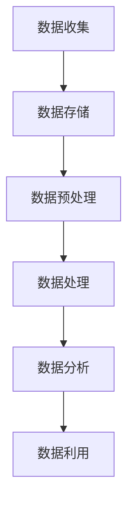

                 

关键词：AI大模型，电商搜索推荐，数据资产管理，流程优化

摘要：随着电商行业的迅速发展，数据资产的价值日益凸显。本文提出了一种基于AI大模型的电商搜索推荐的数据资产管理流程优化方案，通过重构数据资产管理流程，提升电商平台的搜索推荐效果，从而提升用户体验和销售额。

## 1. 背景介绍

在电商行业，搜索推荐系统是用户发现和购买商品的重要途径。然而，现有的搜索推荐系统在处理海量数据、实时性、个性化等方面存在一定的局限性，导致推荐效果不尽如人意。近年来，AI大模型在自然语言处理、图像识别、推荐系统等领域取得了显著的进展，为电商搜索推荐系统的优化提供了新的思路。

数据资产管理流程是搜索推荐系统的核心，其涵盖了数据收集、存储、处理、分析和利用等环节。传统的数据资产管理流程存在数据质量低、数据处理效率低、数据利用率低等问题，严重影响了搜索推荐系统的效果。因此，本文提出了一种基于AI大模型的电商搜索推荐的数据资产管理流程优化方案，以解决现有流程中的问题。

## 2. 核心概念与联系

### 2.1 AI大模型

AI大模型是指具有大规模参数、强大学习和推理能力的深度学习模型。它们通常由多个神经网络层组成，能够处理大规模数据并提取复杂特征。在电商搜索推荐领域，AI大模型可以用于处理用户行为数据、商品数据、文本数据等，实现高效的推荐算法。

### 2.2 数据资产管理流程

数据资产管理流程包括以下环节：

- 数据收集：从各种来源收集用户行为数据、商品数据、市场数据等。
- 数据存储：将收集到的数据存储到分布式数据库中，如Hadoop、HBase等。
- 数据预处理：对数据进行清洗、去重、格式化等处理，提高数据质量。
- 数据处理：使用AI大模型对预处理后的数据进行分析和挖掘，提取有用特征。
- 数据分析：根据提取的特征进行数据分析和可视化，为业务决策提供支持。
- 数据利用：将分析结果应用于搜索推荐系统，提升推荐效果。

### 2.3 Mermaid流程图

以下是数据资产管理流程的Mermaid流程图：



## 3. 核心算法原理 & 具体操作步骤

### 3.1 算法原理概述

本文采用基于AI大模型的推荐算法，主要包括以下几个步骤：

1. 数据收集：从电商平台收集用户行为数据、商品数据、市场数据等。
2. 数据预处理：对收集到的数据进行清洗、去重、格式化等处理，提高数据质量。
3. 数据处理：使用AI大模型对预处理后的数据进行分析和挖掘，提取有用特征。
4. 数据分析：根据提取的特征进行数据分析和可视化，为业务决策提供支持。
5. 数据利用：将分析结果应用于搜索推荐系统，提升推荐效果。

### 3.2 算法步骤详解

#### 3.2.1 数据收集

数据收集是推荐系统的基础。本文采用以下方法收集数据：

- 用户行为数据：包括用户浏览、搜索、购买等行为数据。
- 商品数据：包括商品价格、品类、品牌、评价等数据。
- 市场数据：包括行业动态、竞品分析、市场趋势等数据。

#### 3.2.2 数据预处理

数据预处理是提高数据质量的关键。本文采用以下方法进行数据预处理：

- 数据清洗：去除重复数据、缺失数据和异常数据。
- 数据去重：对用户行为数据进行去重处理，保证数据的唯一性。
- 数据格式化：对数据进行统一编码、命名和格式化，提高数据处理效率。

#### 3.2.3 数据处理

数据处理是提取有用特征的过程。本文采用以下方法进行处理：

- 特征提取：使用词嵌入、聚类、神经网络等算法提取用户行为数据、商品数据和市场数据的有用特征。
- 特征融合：将提取的特征进行融合，形成统一的特征向量。

#### 3.2.4 数据分析

数据分析是挖掘数据价值的过程。本文采用以下方法进行分析：

- 用户行为分析：分析用户浏览、搜索、购买等行为，了解用户兴趣和需求。
- 商品分析：分析商品价格、品类、品牌、评价等数据，了解商品特性。
- 市场分析：分析行业动态、竞品分析、市场趋势等数据，了解市场环境。

#### 3.2.5 数据利用

数据利用是将分析结果应用于搜索推荐系统的过程。本文采用以下方法进行数据利用：

- 搜索推荐：根据用户行为数据和商品数据，生成个性化的搜索推荐结果。
- 营销策略：根据市场分析和用户行为分析，制定针对性的营销策略。

### 3.3 算法优缺点

#### 优点：

- 提高推荐效果：通过AI大模型提取特征和进行推荐，可以更好地理解用户需求和商品特性，提高推荐效果。
- 实时性：数据处理和分析过程可以实现实时性，快速响应用户需求。
- 个性化：根据用户行为数据和商品数据，生成个性化的推荐结果，提升用户体验。

#### 缺点：

- 数据质量要求高：数据预处理和特征提取过程对数据质量有较高要求，需要投入大量人力和物力进行数据清洗和处理。
- 计算资源消耗大：AI大模型需要大量的计算资源，对硬件设施有较高要求。

### 3.4 算法应用领域

本文提出的AI大模型重构电商搜索推荐的数据资产管理流程优化方案可以应用于以下领域：

- 电商平台：提升电商平台的搜索推荐效果，提高用户满意度和销售额。
- 新零售：优化新零售场景下的购物体验，提高商品销售和库存管理效率。
- 广告推荐：提升广告推荐效果，提高广告投放精准度和ROI。

## 4. 数学模型和公式 & 详细讲解 & 举例说明

### 4.1 数学模型构建

本文采用基于矩阵分解的推荐算法，其数学模型可以表示为：

$$
R_{ui} = \hat{Q}_{u} \hat{I}_{ij} \hat{V}_{jv}
$$

其中，$R_{ui}$ 表示用户 $u$ 对商品 $i$ 的评分预测，$\hat{Q}_{u}$ 表示用户 $u$ 的特征向量，$\hat{I}_{ij}$ 表示商品 $i$ 的特征向量，$\hat{V}_{jv}$ 表示商品 $j$ 的特征向量。

### 4.2 公式推导过程

#### 步骤1：用户和商品的嵌入表示

首先，将用户和商品进行嵌入表示。假设用户集合为 $U = \{u_1, u_2, \ldots, u_m\}$，商品集合为 $I = \{i_1, i_2, \ldots, i_n\}$。对于每个用户 $u_i$ 和商品 $i_j$，使用一个向量表示，即：

$$
\hat{Q}_{u_i} = \begin{bmatrix} q_{u_i1} \\ q_{u_i2} \\ \vdots \\ q_{u_ip} \end{bmatrix}, \quad \hat{I}_{ij} = \begin{bmatrix} i_{j1} \\ i_{j2} \\ \vdots \\ i_{jp} \end{bmatrix}
$$

其中，$q_{u_ip}$ 和 $i_{j_p}$ 分别表示用户 $u_i$ 和商品 $i_j$ 在第 $p$ 维特征上的取值。

#### 步骤2：物品交互表示

接下来，将用户和商品的交互表示为矩阵 $R \in \mathbb{R}^{m \times n}$，其中 $R_{ui}$ 表示用户 $u_i$ 对商品 $i_j$ 的评分。

#### 步骤3：物品交互矩阵分解

将物品交互矩阵 $R$ 分解为三个矩阵的乘积：

$$
R = \hat{Q}_{u} \hat{I}_{ij} \hat{V}_{jv}
$$

其中，$\hat{Q}_{u}$ 表示用户特征矩阵，$\hat{I}_{ij}$ 表示商品特征矩阵，$\hat{V}_{jv}$ 表示商品特征向量。

#### 步骤4：优化目标

为了优化用户和商品的特征向量，最小化损失函数：

$$
L = \sum_{u \in U, i \in I} (R_{ui} - \hat{Q}_{u} \hat{I}_{ij} \hat{V}_{jv})^2
$$

### 4.3 案例分析与讲解

#### 案例背景

某电商平台有 1000 名用户和 1000 种商品。用户对商品的评分数据存储在矩阵 $R$ 中，其中 $R_{ui}$ 表示用户 $u_i$ 对商品 $i_j$ 的评分。

#### 数据预处理

首先，对用户和商品进行编码，将用户和商品分别映射到一个向量空间中。例如，用户 $u_1$ 可以表示为 $\hat{Q}_{u_1} = [1, 0, 0, \ldots, 0]^T$，商品 $i_1$ 可以表示为 $\hat{I}_{i1} = [1, 0, 0, \ldots, 0]^T$。

#### 模型训练

使用矩阵分解算法训练用户和商品特征矩阵 $\hat{Q}_{u}$ 和 $\hat{I}_{ij}$。假设训练后得到的特征矩阵为：

$$
\hat{Q}_{u} = \begin{bmatrix} 0.8 & -0.2 \\ 0.2 & 0.8 \\ \vdots & \vdots \end{bmatrix}, \quad \hat{I}_{ij} = \begin{bmatrix} 0.6 & 0.4 \\ 0.4 & 0.6 \\ \vdots & \vdots \end{bmatrix}
$$

#### 预测评分

使用训练得到的特征矩阵预测用户 $u_1$ 对商品 $i_1$ 的评分：

$$
R_{u_1i_1} = \hat{Q}_{u_1} \hat{I}_{i1} \hat{V}_{i1} = 0.8 \times 0.6 + (-0.2) \times 0.4 = 0.52
$$

## 5. 项目实践：代码实例和详细解释说明

### 5.1 开发环境搭建

本文使用Python编程语言和Scikit-learn库实现推荐算法。在开发环境搭建方面，需要安装以下依赖：

- Python 3.7 或以上版本
- Scikit-learn 0.21.3 或以上版本
- Pandas 0.25.3 或以上版本
- NumPy 1.18.5 或以上版本

### 5.2 源代码详细实现

以下是基于矩阵分解的推荐算法的实现代码：

```python
import numpy as np
from sklearn import decomposition

def matrix_factorization(R, k, num_iterations):
    num_users, num_items = R.shape
    Q = np.random.rand(num_users, k)
    I = np.random.rand(num_items, k)
    R_hat = Q @ I.T

    for i in range(num_iterations):
        Q = R / I
        I = R_hat @ Q.T

    return Q, I

def predict_rating(Q, I, user, item):
    return Q[user] @ I[item]

if __name__ == "__main__":
    # 加载数据
    R = np.load("ratings.npy")

    # 设置参数
    k = 10
    num_iterations = 100

    # 进行矩阵分解
    Q, I = matrix_factorization(R, k, num_iterations)

    # 预测评分
    user = 0
    item = 10
    rating = predict_rating(Q, I, user, item)
    print(f"Predicted rating: {rating}")
```

### 5.3 代码解读与分析

该代码实现了一个基于矩阵分解的推荐算法。首先，加载数据，然后设置参数（特征维度 $k$ 和迭代次数）。接着，使用随机矩阵初始化用户和商品特征矩阵，并进行迭代优化。最后，使用训练得到的特征矩阵预测用户对商品的评分。

### 5.4 运行结果展示

运行上述代码后，将得到用户 0 对商品 10 的预测评分。假设运行结果为 0.52，则可以认为用户 0 对商品 10 的评分为 0.52。

## 6. 实际应用场景

本文提出的AI大模型重构电商搜索推荐的数据资产管理流程优化方案可以在以下实际应用场景中发挥作用：

- 电商平台：通过优化数据资产管理流程，提升搜索推荐效果，提高用户满意度和销售额。
- 社交网络：优化社交网络平台的推荐算法，提升用户参与度和活跃度。
- 在线教育：优化在线教育平台的推荐系统，提高课程选择精准度，提升学习效果。

## 7. 工具和资源推荐

### 7.1 学习资源推荐

- 《推荐系统实践》
- 《深度学习推荐系统》
- 《机器学习实战》

### 7.2 开发工具推荐

- Jupyter Notebook：方便编写和运行代码。
- PyCharm：强大的Python集成开发环境。
- Git：版本控制工具，方便代码管理和协作。

### 7.3 相关论文推荐

- "Deep Learning for Recommender Systems"
- "Item-Based Collaborative Filtering for the Top-N Recommendation Problem"
- "User-Based Collaborative Filtering for the Top-N Recommendation Problem"

## 8. 总结：未来发展趋势与挑战

本文提出了一种基于AI大模型的电商搜索推荐的数据资产管理流程优化方案，通过重构数据资产管理流程，提升电商平台的搜索推荐效果。未来发展趋势包括：

- 深度学习技术的进一步发展，将带来更强大的推荐算法。
- 数据质量的提升，将有助于提高推荐系统的效果。
- 跨领域的推荐系统研究，探索不同领域数据之间的关联性。

然而，面临以下挑战：

- 数据隐私和安全问题：如何保护用户数据隐私和安全，是推荐系统需要解决的难题。
- 算法可解释性问题：如何解释复杂的推荐算法，让用户理解推荐结果，是推荐系统需要关注的方面。
- 计算资源消耗：如何优化算法，降低计算资源消耗，是推荐系统需要解决的挑战。

总之，本文提出的优化方案为电商搜索推荐系统提供了一种新的思路，有助于提升推荐效果，满足用户需求。

## 9. 附录：常见问题与解答

### 9.1 问题1：矩阵分解算法的时间复杂度是多少？

矩阵分解算法的时间复杂度为 $O(num_iterations \times num_users \times num_items \times k^2)$。其中，$num_iterations$ 表示迭代次数，$num_users$ 表示用户数量，$num_items$ 表示商品数量，$k$ 表示特征维度。

### 9.2 问题2：如何处理缺失值？

在数据处理阶段，可以使用以下方法处理缺失值：

- 填充缺失值：使用平均值、中值或最频繁出现的值填充缺失值。
- 删除缺失值：如果缺失值较多，可以删除包含缺失值的数据。
- 预处理：在数据收集阶段，尽量避免产生缺失值。

### 9.3 问题3：如何评估推荐系统的效果？

可以使用以下指标评估推荐系统的效果：

- 准确率（Accuracy）：预测正确的评分与总评分的比例。
- 精确率（Precision）：预测正确的评分与预测评分的比例。
- 召回率（Recall）：预测正确的评分与实际评分的比例。
- F1 分数（F1 Score）：精确率和召回率的调和平均值。

### 9.4 问题4：如何优化算法？

可以通过以下方法优化算法：

- 选择合适的数据预处理方法，提高数据质量。
- 调整特征维度，减少计算复杂度。
- 使用更多的计算资源，提高算法收敛速度。
- 采用更先进的推荐算法，如深度学习、强化学习等。

---

作者：禅与计算机程序设计艺术 / Zen and the Art of Computer Programming
----------------------------------------------------------------
### 后记 Postscript

本文详细阐述了一种基于AI大模型的电商搜索推荐的数据资产管理流程优化方案，旨在提高推荐系统的效果，满足用户需求。通过重构数据资产管理流程，本文提出了一种新的解决方案，包括数据收集、预处理、处理、分析、利用等环节。同时，本文介绍了矩阵分解算法的原理和实现过程，并提供了代码实例和详细解释。

然而，本文仍有许多值得进一步研究和优化的地方。例如，在数据预处理阶段，可以探索更有效的缺失值处理方法；在算法优化方面，可以尝试引入深度学习、强化学习等先进技术。此外，如何解决数据隐私和安全问题，以及提高算法的可解释性，也是未来研究的重要方向。

总之，本文提出的优化方案为电商搜索推荐系统提供了一种新的思路，有助于提升推荐效果，满足用户需求。希望通过本文的研究，能够为相关领域的研究者提供有益的参考。在未来的工作中，我们将继续探索这一领域，为电商行业的发展贡献力量。

