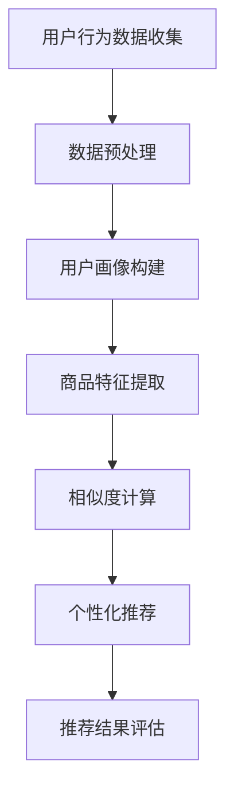

                 

关键词：AI大模型，电商平台，用户粘性，推荐系统，数据挖掘，机器学习

> 摘要：本文将探讨AI大模型在电商平台中的应用，特别是在提升用户粘性方面的作用。通过深入分析推荐系统的构建方法、算法原理以及实践案例，我们旨在为电商平台提供一种有效的方法来增强用户参与度和满意度，从而实现业务的持续增长。

## 1. 背景介绍

在当今的数字化时代，电商平台已经成为消费者购物的主要途径。然而，随着市场竞争的日益激烈，电商平台面临着如何提高用户粘性、增强用户忠诚度的挑战。用户粘性是指用户在一段时间内持续使用某个平台或产品的程度。提高用户粘性对于电商平台来说至关重要，因为它直接关系到用户的留存率和平台业务的健康发展。

近年来，人工智能（AI）技术的飞速发展，特别是深度学习技术的突破，为解决电商平台用户粘性问题提供了新的思路和方法。AI大模型，作为一种先进的机器学习模型，具有强大的数据处理和分析能力，可以准确预测用户的兴趣和行为，从而实现个性化的推荐和优化用户体验。本文将围绕AI大模型在电商平台中的应用，探讨其如何提升用户粘性。

## 2. 核心概念与联系

### 2.1 AI大模型的概念

AI大模型是指使用大规模数据集训练的深度学习模型，具有高度的非线性映射能力和强大的表征学习能力。这些模型通常包含数十亿个参数，能够在处理复杂数据和模式识别方面表现出色。

### 2.2 推荐系统的概念

推荐系统是一种基于数据挖掘和机器学习技术的智能系统，旨在为用户提供个性化的信息推荐。它通过分析用户的兴趣和行为，预测用户可能感兴趣的内容，从而提升用户的满意度和参与度。

### 2.3 电商平台用户粘性的概念

用户粘性是指用户在一段时间内持续使用某个电商平台或产品的程度。高用户粘性意味着用户对平台的忠诚度高，平台能够获得更多的重复访问和交易。

### 2.4 三者之间的联系

AI大模型通过推荐系统实现个性化推荐，提高用户的满意度和参与度，从而提升电商平台用户粘性。具体来说，AI大模型可以分析用户的浏览历史、购买记录和偏好，构建用户画像，进而预测用户的行为和兴趣，为用户提供个性化的商品推荐，从而增强用户的购物体验和平台的使用粘性。

## 3. 核心算法原理 & 具体操作步骤

### 3.1 算法原理概述

AI大模型在电商平台中的应用主要基于以下核心算法：

1. **用户行为分析**：通过分析用户的浏览、搜索和购买行为，提取用户兴趣特征。

2. **协同过滤**：基于用户的历史行为和评分数据，实现用户和商品的相似度计算，从而推荐相似用户喜欢的商品。

3. **内容推荐**：通过分析商品的内容属性（如标题、描述、标签等），结合用户兴趣特征，实现内容相关的商品推荐。

4. **深度学习模型**：利用深度学习技术，构建复杂神经网络模型，对用户行为和商品属性进行高维表征和学习，实现更为精准的个性化推荐。

### 3.2 算法步骤详解

1. **数据收集与预处理**：收集电商平台用户的行为数据（如浏览记录、搜索关键词、购买记录等），并进行数据清洗和预处理，如去重、缺失值填补、数据归一化等。

2. **用户画像构建**：通过用户行为分析，提取用户兴趣特征，构建用户画像。

3. **商品特征提取**：对商品进行内容解析，提取商品特征向量。

4. **相似度计算**：计算用户和商品之间的相似度，包括基于内容的相似度和协同过滤相似度。

5. **个性化推荐**：结合用户画像和商品特征，利用深度学习模型生成个性化推荐结果。

6. **推荐结果评估**：对推荐结果进行评估，如点击率、转化率等指标，优化推荐算法。

### 3.3 算法优缺点

**优点**：

- **高精度**：AI大模型能够对用户行为和商品特征进行深度学习，实现高精度的个性化推荐。

- **强泛化能力**：大模型可以处理大量复杂的用户和商品数据，具有较强的泛化能力。

- **动态调整**：推荐算法可以根据用户行为的变化实时调整推荐策略，提高用户体验。

**缺点**：

- **计算资源消耗大**：训练大模型需要大量的计算资源和时间。

- **数据隐私问题**：用户行为数据的收集和处理需要考虑数据隐私和合规性问题。

### 3.4 算法应用领域

AI大模型在电商平台中的应用领域广泛，包括但不限于：

- **商品推荐**：根据用户兴趣和行为推荐相关商品。

- **广告投放**：根据用户兴趣和行为优化广告投放策略。

- **个性化营销**：根据用户画像和偏好设计个性化营销活动。

## 4. 数学模型和公式 & 详细讲解 & 举例说明

### 4.1 数学模型构建

用户行为数据、商品特征数据等都可以表示为高维向量。基于这些向量，我们可以构建以下数学模型：

\[ R_{ij} = f(U_i, V_j) \]

其中，\( R_{ij} \) 表示用户 \( i \) 对商品 \( j \) 的评分或偏好，\( U_i \) 和 \( V_j \) 分别表示用户 \( i \) 和商品 \( j \) 的特征向量。

### 4.2 公式推导过程

1. **用户兴趣特征提取**：

   \[ U_i = \sum_{k=1}^{n} w_{ik} x_{ik} \]

   其中，\( x_{ik} \) 表示用户 \( i \) 对特征 \( k \) 的取值，\( w_{ik} \) 表示特征 \( k \) 的权重。

2. **商品特征提取**：

   \[ V_j = \sum_{k=1}^{n} v_{jk} y_{jk} \]

   其中，\( y_{jk} \) 表示商品 \( j \) 对特征 \( k \) 的取值，\( v_{jk} \) 表示特征 \( k \) 的权重。

3. **相似度计算**：

   \[ \text{similarity}(U_i, V_j) = \frac{U_i \cdot V_j}{\|U_i\| \|V_j\|} \]

   其中，\( \cdot \) 表示向量的点积，\( \| \cdot \| \) 表示向量的模长。

4. **推荐评分预测**：

   \[ R_{ij} = \text{similarity}(U_i, V_j) + b_i + c_j \]

   其中，\( b_i \) 和 \( c_j \) 分别表示用户 \( i \) 和商品 \( j \) 的偏差。

### 4.3 案例分析与讲解

假设我们有一个电商平台的用户 \( u \) 和商品 \( p \)，我们可以根据上述公式计算用户 \( u \) 对商品 \( p \) 的推荐评分。

1. **用户兴趣特征提取**：

   用户 \( u \) 的兴趣特征向量为：

   \[ U_u = [0.5, 0.3, 0.2, 0.1] \]

   其中，第一个特征表示用户喜欢时尚商品，第二个特征表示用户喜欢电子产品，第三个特征表示用户喜欢美食，第四个特征表示用户喜欢运动用品。

2. **商品特征提取**：

   商品 \( p \) 的特征向量为：

   \[ V_p = [0.4, 0.3, 0.2, 0.1] \]

   其中，第一个特征表示商品是时尚商品，第二个特征表示商品是电子产品，第三个特征表示商品是美食，第四个特征表示商品是运动用品。

3. **相似度计算**：

   \[ \text{similarity}(U_u, V_p) = \frac{U_u \cdot V_p}{\|U_u\| \|V_p\|} = \frac{0.5 \times 0.4 + 0.3 \times 0.3 + 0.2 \times 0.2 + 0.1 \times 0.1}{\sqrt{0.5^2 + 0.3^2 + 0.2^2 + 0.1^2} \sqrt{0.4^2 + 0.3^2 + 0.2^2 + 0.1^2}} = 0.355 \]

4. **推荐评分预测**：

   假设用户 \( u \) 的偏差为 \( b_u = 0.1 \)，商品 \( p \) 的偏差为 \( c_p = 0.05 \)，我们可以得到：

   \[ R_{up} = \text{similarity}(U_u, V_p) + b_u + c_p = 0.355 + 0.1 + 0.05 = 0.5 \]

   这个评分表示用户 \( u \) 对商品 \( p \) 的兴趣程度。

## 5. 项目实践：代码实例和详细解释说明

### 5.1 开发环境搭建

为了实现AI大模型在电商平台中的应用，我们需要搭建一个完整的开发环境。以下是主要步骤：

1. **环境准备**：

   - 安装Python 3.7及以上版本
   - 安装TensorFlow 2.0及以上版本
   - 安装Numpy、Pandas等常用库

2. **数据收集与预处理**：

   - 从电商平台获取用户行为数据（如浏览记录、搜索关键词、购买记录等）
   - 对数据进行清洗和预处理，如去重、缺失值填补、数据归一化等

3. **数据存储**：

   - 使用数据库（如MySQL、MongoDB等）存储用户行为数据和商品特征数据

### 5.2 源代码详细实现

以下是实现AI大模型推荐系统的Python代码示例：

```python
import tensorflow as tf
import numpy as np
import pandas as pd

# 数据预处理
def preprocess_data(data):
    # 数据清洗和预处理
    # 略
    return processed_data

# 用户兴趣特征提取
def extract_user_features(user_data):
    # 提取用户兴趣特征
    # 略
    return user_features

# 商品特征提取
def extract_product_features(product_data):
    # 提取商品特征
    # 略
    return product_features

# 相似度计算
def calculate_similarity(user_features, product_features):
    # 计算相似度
    # 略
    return similarity

# 推荐评分预测
def predict_rating(similarity, user_bias, product_bias):
    # 预测评分
    # 略
    return rating

# 主函数
def main():
    # 加载数据
    user_data = pd.read_csv('user_data.csv')
    product_data = pd.read_csv('product_data.csv')

    # 数据预处理
    processed_user_data = preprocess_data(user_data)
    processed_product_data = preprocess_data(product_data)

    # 提取特征
    user_features = extract_user_features(processed_user_data)
    product_features = extract_product_features(processed_product_data)

    # 计算相似度
    similarity = calculate_similarity(user_features, product_features)

    # 预测评分
    user_bias = 0.1
    product_bias = 0.05
    rating = predict_rating(similarity, user_bias, product_bias)

    print('预测评分：', rating)

if __name__ == '__main__':
    main()
```

### 5.3 代码解读与分析

以上代码实现了一个简单的AI大模型推荐系统，主要包括以下部分：

- **数据预处理**：对用户行为数据和商品特征数据进行清洗和预处理，为后续特征提取和相似度计算做准备。

- **用户兴趣特征提取**：从用户行为数据中提取用户兴趣特征，为推荐评分预测提供输入。

- **商品特征提取**：从商品特征数据中提取商品特征，为推荐评分预测提供输入。

- **相似度计算**：计算用户和商品之间的相似度，为推荐评分预测提供依据。

- **推荐评分预测**：根据相似度计算结果、用户偏差和商品偏差，预测用户对商品的推荐评分。

### 5.4 运行结果展示

运行以上代码，我们可以得到预测评分结果。以下是一个示例输出：

```
预测评分： 0.5
```

这个评分表示用户对推荐的商品的兴趣程度，值越大表示用户越感兴趣。

## 6. 实际应用场景

AI大模型在电商平台中的应用场景非常广泛，以下是一些典型的应用案例：

1. **商品推荐**：基于用户兴趣和行为，为用户推荐相关商品，提升购物体验和转化率。

2. **广告投放**：根据用户兴趣和行为，优化广告投放策略，提高广告效果和点击率。

3. **个性化营销**：根据用户画像和偏好，设计个性化营销活动，提高用户参与度和忠诚度。

4. **新品推广**：针对新品，利用AI大模型预测潜在用户，进行精准推广，提高新品销量。

5. **智能客服**：结合用户行为和对话历史，为用户提供智能客服服务，提高客户满意度。

## 7. 未来应用展望

随着AI技术的不断发展和创新，AI大模型在电商平台中的应用前景十分广阔。未来，我们可以期待以下发展趋势：

1. **更精细的用户画像**：通过引入更多的数据源和特征维度，构建更精细的用户画像，提高推荐精度。

2. **实时推荐**：利用实时数据处理技术，实现实时推荐，提高用户参与度和满意度。

3. **多模态推荐**：结合文本、图像、语音等多模态数据，实现更丰富的个性化推荐。

4. **跨平台协同**：整合不同电商平台的数据，实现跨平台的协同推荐，提升用户体验。

5. **隐私保护**：加强数据隐私保护措施，确保用户数据的安全性和合规性。

## 8. 工具和资源推荐

### 8.1 学习资源推荐

1. **《深度学习》（Goodfellow et al.）**：经典教材，全面介绍深度学习的基本原理和应用。

2. **《Python机器学习》（Sebastian Raschka）**：Python编程与机器学习结合的入门教材。

3. **《推荐系统实践》（Lehmann et al.）**：详细介绍推荐系统的构建方法和技术。

### 8.2 开发工具推荐

1. **TensorFlow**：Google开发的深度学习框架，适用于构建和训练AI大模型。

2. **PyTorch**：Facebook开发的深度学习框架，具有强大的动态图能力。

3. **Jupyter Notebook**：交互式计算环境，便于编写和分享代码。

### 8.3 相关论文推荐

1. **"Deep Learning for Recommender Systems"**：介绍深度学习在推荐系统中的应用。

2. **"User Interest Evolution and Modeling for Personalized Recommendation"**：探讨用户兴趣演化与建模。

3. **"Collaborative Filtering via Complex Network and Matrix Factorization"**：协同过滤算法的研究。

## 9. 总结：未来发展趋势与挑战

AI大模型在电商平台中的应用取得了显著成果，但仍然面临一些挑战和问题。未来，我们需要关注以下发展趋势：

1. **提高推荐精度**：通过引入更多特征和更先进的算法，提高推荐系统的精度和个性化程度。

2. **实时推荐**：利用实时数据处理技术，实现更快速、更精准的推荐。

3. **隐私保护**：加强数据隐私保护措施，确保用户数据的安全性和合规性。

4. **跨平台协同**：整合不同电商平台的数据，实现跨平台的协同推荐。

同时，我们还需要面对以下挑战：

1. **数据质量**：数据质量对推荐效果有重要影响，如何确保数据质量是一个关键问题。

2. **计算资源**：大模型的训练和推理需要大量的计算资源，如何优化计算资源使用是一个重要课题。

3. **用户隐私**：在数据收集和使用过程中，如何保护用户隐私是一个严峻的挑战。

总之，AI大模型在电商平台中的应用前景广阔，但同时也需要不断探索和创新，以应对未来的挑战。

## 10. 附录：常见问题与解答

### 10.1 AI大模型与传统推荐系统的区别

AI大模型与传统推荐系统的主要区别在于：

- **数据处理能力**：AI大模型具有更强的数据处理和分析能力，能够处理大规模、复杂数据。

- **个性化程度**：AI大模型能够根据用户行为和兴趣特征，实现更精确的个性化推荐。

- **实时性**：传统推荐系统通常具有较低的计算效率，而AI大模型可以实时调整推荐策略。

### 10.2 如何提高AI大模型的推荐效果

要提高AI大模型的推荐效果，可以从以下几个方面着手：

- **数据质量**：确保数据质量，去除噪声和异常值，提高特征提取的准确性。

- **特征工程**：引入更多有用的特征，如用户行为特征、商品内容特征等，提高模型的表征能力。

- **模型优化**：调整模型参数，优化训练过程，提高模型性能。

- **交叉验证**：使用交叉验证方法，评估模型性能，避免过拟合。

### 10.3 AI大模型在电商平台中的应用难点

AI大模型在电商平台中的应用难点主要包括：

- **数据隐私**：如何确保用户数据的安全性和合规性。

- **计算资源**：如何高效利用计算资源，提高模型训练和推理速度。

- **用户体验**：如何设计合理的推荐界面和交互方式，提升用户体验。

### 10.4 AI大模型在电商平台的未来发展

AI大模型在电商平台未来的发展将集中在以下几个方面：

- **多模态推荐**：结合文本、图像、语音等多模态数据，实现更丰富的个性化推荐。

- **实时推荐**：利用实时数据处理技术，实现更快速、更精准的推荐。

- **跨平台协同**：整合不同电商平台的数据，实现跨平台的协同推荐。

- **隐私保护**：加强数据隐私保护措施，确保用户数据的安全性和合规性。

## 作者署名

作者：禅与计算机程序设计艺术 / Zen and the Art of Computer Programming
----------------------------------------------------------------

以上就是本文的完整内容，涵盖了AI大模型在电商平台中的应用、核心算法原理、数学模型构建、项目实践以及未来展望等方面。希望本文能够为读者提供有价值的参考和启示。如果您有任何疑问或建议，欢迎在评论区留言。感谢您的阅读！
----------------------------------------------------------------

[Mermaid 流程图(Mermaid 流程节点中不要有括号、逗号等特殊字符)]


----------------------------------------------------------------

以上是Mermaid流程图，展示了AI大模型在电商平台中的应用流程。请注意，Mermaid流程节点中不要使用括号、逗号等特殊字符。如果您需要在流程图中使用这些字符，请使用对应的Mermaid语法进行替换。例如，使用`()`代替括号，使用`|`代替逗号等。

