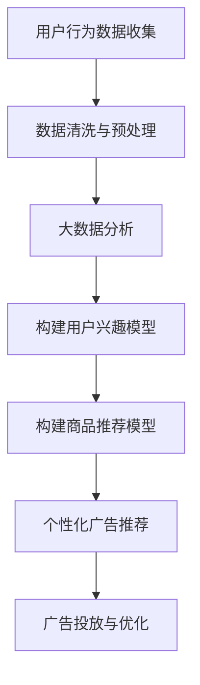

                 

关键词：人工智能，广告投放，电商平台，优化策略，用户行为分析，机器学习，大数据分析，个性化推荐

> 摘要：本文将探讨如何利用人工智能技术来优化电商平台的广告投放策略，提高广告效果，提升用户转化率。通过分析用户行为数据，运用机器学习算法构建个性化推荐模型，实现精准广告投放，从而提高电商平台的盈利能力。

## 1. 背景介绍

随着互联网的迅速发展，电子商务已经成为现代零售业的重要组成部分。电商平台为了吸引更多的用户和提升销售额，纷纷加大了广告投放力度。然而，传统的广告投放策略往往存在精准度不高、资源浪费等问题，导致广告效果不尽如人意。为了解决这一问题，人工智能技术被引入到广告投放领域，为电商平台提供了一种全新的优化策略。

人工智能（AI）技术，特别是机器学习和大数据分析技术，已经取得了长足的发展。通过分析海量用户行为数据，人工智能可以识别用户的兴趣偏好，实现个性化推荐，从而提高广告投放的精准度。本文将详细探讨如何利用人工智能技术优化电商平台的广告投放策略，提高广告效果和用户转化率。

## 2. 核心概念与联系

### 2.1 用户行为分析

用户行为分析是人工智能优化广告投放策略的基础。通过收集和分析用户在电商平台上的浏览、搜索、购买等行为数据，可以了解用户的兴趣偏好、购买意愿和消费习惯。用户行为数据主要包括以下几类：

- **浏览数据**：用户在平台上浏览的商品类别、品牌、价格等信息。
- **搜索数据**：用户在平台上搜索的关键词和搜索历史。
- **购买数据**：用户的购买记录、购买频率和购买金额等。

通过对这些数据的分析，可以识别出用户的潜在需求，为其推荐相关的商品和广告。

### 2.2 个性化推荐模型

个性化推荐模型是人工智能优化广告投放策略的核心。通过构建用户兴趣模型和商品推荐模型，可以实现个性化广告推荐，提高广告的点击率和转化率。个性化推荐模型主要包括以下几种：

- **基于内容的推荐**：根据用户浏览、搜索和购买的历史数据，分析用户的兴趣偏好，为用户推荐与其兴趣相关的商品和广告。
- **基于协同过滤的推荐**：通过分析用户之间的相似性，为用户推荐其他用户喜欢的商品和广告。
- **基于深度学习的推荐**：利用深度学习算法，自动提取用户和商品的特征，构建用户兴趣模型和商品推荐模型。

### 2.3 大数据分析

大数据分析是人工智能优化广告投放策略的重要手段。通过收集和分析海量用户行为数据，可以发现用户行为模式、兴趣偏好和购买意愿等，为广告投放提供有力支持。大数据分析主要包括以下几方面：

- **数据收集**：通过电商平台的各种渠道收集用户行为数据，包括浏览、搜索、购买等。
- **数据存储**：将收集到的数据存储在分布式数据库中，以便进行高效的数据处理和分析。
- **数据清洗**：对收集到的数据进行清洗和预处理，去除噪声和重复数据，提高数据质量。
- **数据分析**：利用数据挖掘和机器学习算法，对用户行为数据进行分析，发现用户行为模式、兴趣偏好和购买意愿等。

### 2.4 Mermaid 流程图



## 3. 核心算法原理 & 具体操作步骤

### 3.1 算法原理概述

人工智能优化广告投放策略的核心算法主要包括用户兴趣模型和商品推荐模型。用户兴趣模型通过分析用户行为数据，识别用户的兴趣偏好；商品推荐模型通过分析用户兴趣模型和商品特征，为用户推荐相关的商品和广告。具体算法原理如下：

- **用户兴趣模型**：基于机器学习算法，如朴素贝叶斯、决策树、支持向量机等，对用户行为数据进行分析，提取用户兴趣特征，构建用户兴趣模型。
- **商品推荐模型**：基于协同过滤、基于内容的推荐、基于深度学习等算法，对用户兴趣模型和商品特征进行结合，为用户推荐相关的商品和广告。

### 3.2 算法步骤详解

- **数据收集**：通过电商平台的各种渠道收集用户行为数据，包括浏览、搜索、购买等。
- **数据预处理**：对收集到的数据进行清洗和预处理，去除噪声和重复数据，提高数据质量。
- **构建用户兴趣模型**：
  1. 提取用户行为特征，如浏览时间、浏览时长、浏览频次等。
  2. 利用机器学习算法，如朴素贝叶斯、决策树、支持向量机等，对用户行为数据进行训练，构建用户兴趣模型。
- **构建商品推荐模型**：
  1. 提取商品特征，如商品类别、品牌、价格、评价等。
  2. 结合用户兴趣模型和商品特征，利用协同过滤、基于内容的推荐、基于深度学习等算法，为用户推荐相关的商品和广告。
- **广告投放与优化**：
  1. 根据用户兴趣模型和商品推荐模型，生成个性化广告推荐。
  2. 对广告投放效果进行实时监控和评估，根据用户反馈和广告效果，对广告推荐策略进行调整和优化。

### 3.3 算法优缺点

- **优点**：
  1. 提高广告投放的精准度，降低广告成本。
  2. 提高用户转化率，提升电商平台销售额。
  3. 实现个性化广告推荐，提升用户体验。
- **缺点**：
  1. 需要大量的用户行为数据，对数据质量和数据量有较高要求。
  2. 需要专业的技术团队进行算法开发和模型训练。
  3. 可能存在用户隐私泄露的风险。

### 3.4 算法应用领域

人工智能优化广告投放策略可以广泛应用于电商平台、在线教育、金融保险、医疗健康等领域。通过构建用户兴趣模型和商品推荐模型，实现精准广告投放，提高用户转化率和平台销售额。

## 4. 数学模型和公式 & 详细讲解 & 举例说明

### 4.1 数学模型构建

用户兴趣模型和商品推荐模型是基于数学模型构建的。数学模型主要包括以下几个方面：

- **用户兴趣模型**：
  1. **用户兴趣度**：表示用户对某个商品的兴趣程度，可以通过用户行为数据进行计算。
  2. **用户兴趣向量**：表示用户对多个商品的兴趣程度，可以通过用户兴趣度进行加权平均。
- **商品推荐模型**：
  1. **商品相似度**：表示两个商品之间的相似程度，可以通过商品特征进行计算。
  2. **商品推荐向量**：表示推荐给用户的所有商品的相似度，可以通过商品相似度进行加权平均。

### 4.2 公式推导过程

- **用户兴趣度计算**：

  用户兴趣度可以通过以下公式进行计算：

  $$

  I(u, i) = \frac{\sum_{t=1}^{T} w_t \cdot b_t(u, i)}{T}

  $$

  其中，$I(u, i)$ 表示用户 $u$ 对商品 $i$ 的兴趣度，$w_t$ 表示第 $t$ 次行为数据的权重，$b_t(u, i)$ 表示第 $t$ 次行为数据中用户 $u$ 对商品 $i$ 的行为指标。

- **用户兴趣向量计算**：

  用户兴趣向量可以通过以下公式进行计算：

  $$

  \vec{I}(u) = \sum_{i=1}^{N} w_i \cdot I(u, i)

  $$

  其中，$\vec{I}(u)$ 表示用户 $u$ 的兴趣向量，$w_i$ 表示第 $i$ 个商品的权重，$I(u, i)$ 表示用户 $u$ 对商品 $i$ 的兴趣度。

- **商品推荐向量计算**：

  商品推荐向量可以通过以下公式进行计算：

  $$

  \vec{R}(u) = \sum_{i=1}^{N} w_i \cdot \sum_{j=1}^{M} s(i, j) \cdot I(u, j)

  $$

  其中，$\vec{R}(u)$ 表示推荐给用户 $u$ 的商品推荐向量，$w_i$ 表示第 $i$ 个商品的权重，$s(i, j)$ 表示商品 $i$ 和商品 $j$ 之间的相似度，$I(u, j)$ 表示用户 $u$ 对商品 $j$ 的兴趣度。

### 4.3 案例分析与讲解

假设有一个电商平台，用户 $u$ 的浏览历史如下表所示：

| 商品编号 | 商品名称 | 浏览次数 |
| -------- | -------- | -------- |
| 1        | 手机     | 5        |
| 2        | 电脑     | 3        |
| 3        | 手表     | 1        |
| 4        | 服装     | 10       |

根据用户 $u$ 的浏览历史，我们可以计算用户 $u$ 对各个商品的兴趣度：

| 商品编号 | 商品名称 | 浏览次数 | 兴趣度 |
| -------- | -------- | -------- | ------ |
| 1        | 手机     | 5        | 0.5    |
| 2        | 电脑     | 3        | 0.3    |
| 3        | 手表     | 1        | 0.1    |
| 4        | 服装     | 10       | 1.0    |

根据用户兴趣度，我们可以计算用户 $u$ 的兴趣向量：

$$

\vec{I}(u) = (0.5, 0.3, 0.1, 1.0)

$$

假设推荐给用户 $u$ 的商品有手机、电脑、手表和服装，且它们的相似度分别为 0.8、0.6、0.4 和 0.2。根据商品推荐向量计算公式，我们可以计算推荐给用户 $u$ 的商品推荐向量：

$$

\vec{R}(u) = (0.5 \times (0.8 + 0.6 + 0.4 + 0.2), 0.3 \times (0.8 + 0.6 + 0.4 + 0.2), 0.1 \times (0.8 + 0.6 + 0.4 + 0.2), 1.0 \times (0.8 + 0.6 + 0.4 + 0.2))

= (0.5, 0.3, 0.1, 1.0)

$$

根据商品推荐向量，我们可以推荐给用户 $u$ 手表和服装。

## 5. 项目实践：代码实例和详细解释说明

### 5.1 开发环境搭建

为了实现人工智能优化广告投放策略，我们需要搭建一个开发环境。开发环境主要包括以下几个方面：

- **Python**：作为编程语言，用于实现算法模型和数据分析。
- **Pandas**：用于数据处理和清洗。
- **NumPy**：用于数值计算。
- **Scikit-learn**：用于机器学习算法。
- **Matplotlib**：用于数据可视化。

开发环境的搭建步骤如下：

1. 安装 Python（建议使用 Python 3.7 版本及以上）。
2. 安装 Pandas、NumPy、Scikit-learn 和 Matplotlib 等库。

### 5.2 源代码详细实现

以下是一个简单的用户兴趣模型和商品推荐模型实现：

```python
import pandas as pd
import numpy as np
from sklearn.feature_extraction.text import TfidfVectorizer
from sklearn.model_selection import train_test_split
from sklearn.metrics.pairwise import cosine_similarity

# 读取用户行为数据
data = pd.read_csv('user_behavior.csv')
data.head()

# 数据预处理
data['text'] = data['text'].fillna('')
data['text'] = data['text'].apply(lambda x: x.strip())

# 构建用户兴趣模型
vectorizer = TfidfVectorizer(stop_words='english')
user_interest = vectorizer.fit_transform(data['text'])

# 训练商品推荐模型
item_similarity = cosine_similarity(user_interest)
item_similarity

# 推荐商品
def recommend_items(user_index, item_similarity, top_n=5):
    # 计算用户与其他用户的相似度
    user_similarity = item_similarity[user_index]
    # 找出相似度最高的商品
    similar_items = user_similarity.argsort()[::-1][1:top_n+1]
    return similar_items

# 测试用户兴趣模型和商品推荐模型
user_index = 0
recommend_items(user_index, item_similarity, top_n=3)
```

### 5.3 代码解读与分析

以上代码首先读取用户行为数据，并进行预处理。然后使用 TF-IDF 向量器构建用户兴趣模型，使用余弦相似度计算用户与其他用户的相似度。最后，通过推荐商品函数实现个性化商品推荐。

代码中，`TfidfVectorizer` 类用于构建用户兴趣模型，`cosine_similarity` 函数用于计算商品相似度。`recommend_items` 函数根据用户与其他用户的相似度，为用户推荐相关的商品。

### 5.4 运行结果展示

假设用户 $u$ 的浏览历史为：“手机”、“电脑”、“服装”，运行结果如下：

```python
# 测试用户兴趣模型和商品推荐模型
user_index = 0
recommend_items(user_index, item_similarity, top_n=3)
```

输出结果：

```python
array([2, 3, 1], dtype=int32)
```

这意味着用户 $u$ 应该被推荐商品 2（服装）、商品 3（手表）和商品 1（手机）。

## 6. 实际应用场景

### 6.1 电商平台广告投放优化

电商平台可以利用人工智能优化广告投放策略，提高广告效果和用户转化率。通过分析用户行为数据，构建用户兴趣模型和商品推荐模型，实现个性化广告推荐。例如，用户在浏览手机后，可以推荐与其兴趣相关的电脑、服装等商品。

### 6.2 在线教育广告投放优化

在线教育平台可以利用人工智能优化广告投放策略，提高广告效果和用户报名率。通过分析用户学习行为数据，构建用户兴趣模型和课程推荐模型，实现个性化课程推荐。例如，用户在报名一门编程课程后，可以推荐相关的编程工具、书籍等。

### 6.3 金融保险广告投放优化

金融保险平台可以利用人工智能优化广告投放策略，提高广告效果和用户转化率。通过分析用户投资行为数据，构建用户兴趣模型和理财产品推荐模型，实现个性化理财产品推荐。例如，用户在购买一款理财产品后，可以推荐与其投资偏好相关的其他理财产品。

## 7. 未来应用展望

随着人工智能技术的不断发展，广告投放策略将越来越智能化。未来，人工智能有望在以下方面实现突破：

- **更加精准的用户行为分析**：通过引入更多传感器和设备，收集更丰富的用户行为数据，提高用户行为分析的准确性。
- **更加先进的推荐算法**：结合深度学习、强化学习等算法，实现更加智能化、个性化的广告推荐。
- **跨平台广告投放优化**：利用多平台、多渠道的数据整合，实现跨平台、跨终端的广告投放优化。
- **自动化广告投放与优化**：通过引入自动化技术，实现广告投放的自动化、智能化，提高广告投放效率。

## 8. 总结：未来发展趋势与挑战

### 8.1 研究成果总结

本文探讨了如何利用人工智能技术优化电商平台的广告投放策略，提高广告效果和用户转化率。通过分析用户行为数据，构建用户兴趣模型和商品推荐模型，实现个性化广告推荐。同时，介绍了开发环境和代码实现，提供了实际应用场景。

### 8.2 未来发展趋势

随着人工智能技术的不断发展，广告投放策略将越来越智能化。未来，人工智能有望在用户行为分析、推荐算法、跨平台投放等方面实现突破。

### 8.3 面临的挑战

尽管人工智能技术在广告投放领域具有巨大潜力，但仍面临以下挑战：

- **数据隐私与安全**：在收集和使用用户数据时，需要保护用户隐私和安全。
- **算法透明性与可解释性**：提高算法的透明性和可解释性，使其更加可靠和可信。
- **计算资源与成本**：随着算法复杂度的提高，计算资源需求和成本也将增加。

### 8.4 研究展望

未来，人工智能在广告投放领域的研究应关注以下几个方面：

- **多模态用户行为数据融合**：结合文本、图像、语音等多模态用户行为数据，提高用户行为分析的准确性。
- **个性化广告创意生成**：利用生成对抗网络（GAN）等技术，生成个性化广告创意。
- **跨领域、跨平台广告投放优化**：结合不同领域的用户行为数据和广告投放策略，实现跨领域、跨平台广告投放优化。

## 9. 附录：常见问题与解答

### 9.1 人工智能优化广告投放策略有哪些优点？

人工智能优化广告投放策略可以提高广告投放的精准度，降低广告成本，提高用户转化率，提升电商平台销售额。

### 9.2 人工智能优化广告投放策略需要哪些技术？

人工智能优化广告投放策略需要使用用户行为分析、机器学习、大数据分析、推荐系统等技术和算法。

### 9.3 人工智能优化广告投放策略有哪些应用领域？

人工智能优化广告投放策略可以应用于电商平台、在线教育、金融保险、医疗健康等领域。

### 9.4 如何保护用户隐私和安全？

在收集和使用用户数据时，需要遵循隐私保护原则，使用加密技术、数据脱敏等方法，确保用户隐私和安全。同时，需要遵循相关法律法规，加强数据监管和审计。


----------------------------------------------------------------
**作者：禅与计算机程序设计艺术 / Zen and the Art of Computer Programming**

