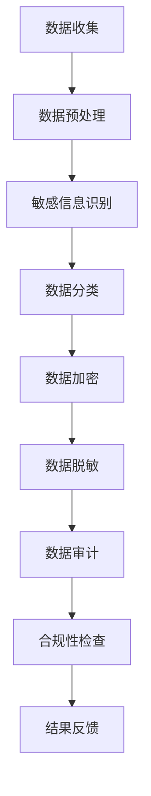

                 

关键词：人工智能，用户数据安全，合规性检查，电商企业，隐私保护

> 摘要：本文将探讨人工智能在电商企业用户数据安全合规性检查中的应用。通过分析AI技术的工作原理，介绍几种常见的算法和工具，以及具体的应用场景，为电商企业提供了一套完善的数据安全合规解决方案。文章旨在为行业从业者提供有价值的参考，帮助企业在数据安全和合规性方面取得更大的进步。

## 1. 背景介绍

随着互联网的快速发展，电商行业已经成为全球商业的重要组成部分。然而，随着数据量的不断增加，用户数据安全问题和合规性问题日益凸显。电商企业需要确保用户数据的安全性和合规性，以防止数据泄露、滥用和违规行为。然而，传统的数据安全合规性检查方法往往存在效率低下、准确性不足等问题。为了解决这些问题，人工智能（AI）技术逐渐成为电商企业数据安全合规性检查的有力工具。

## 2. 核心概念与联系

### 2.1 AI技术概述

人工智能是一种模拟人类智能的技术，通过机器学习、自然语言处理、计算机视觉等算法，使计算机具备自主学习和决策能力。AI技术在数据安全合规性检查中具有以下优势：

- **自动识别和分类**：AI技术能够自动识别数据中的敏感信息，如用户名、密码、银行卡号等，并进行分类处理。
- **实时监控和预警**：AI技术能够实时监控数据访问和使用情况，及时发现异常行为并发出预警。
- **自动审计和合规性检查**：AI技术可以自动审计数据使用情况，确保符合相关法律法规和行业标准。

### 2.2 数据安全合规性检查

数据安全合规性检查是指对企业内部和外部的数据使用情况进行监控、评估和审核，以确保数据的安全性和合规性。数据安全合规性检查的主要内容包括：

- **数据访问控制**：确保只有授权人员才能访问敏感数据。
- **数据加密**：对敏感数据进行加密处理，防止数据泄露。
- **数据脱敏**：对敏感数据进行脱敏处理，确保数据匿名性。
- **数据审计**：对数据使用情况进行审计，确保符合相关法律法规和行业标准。

### 2.3 Mermaid流程图

以下是数据安全合规性检查的Mermaid流程图：



## 3. 核心算法原理 & 具体操作步骤

### 3.1 算法原理概述

数据安全合规性检查的核心算法包括机器学习算法、自然语言处理算法和计算机视觉算法。以下分别介绍这些算法的基本原理：

- **机器学习算法**：通过训练数据集，使计算机具备识别和分类数据的能力。常见的机器学习算法有决策树、支持向量机、神经网络等。
- **自然语言处理算法**：通过对文本数据进行处理，使计算机能够理解和生成自然语言。常见的自然语言处理算法有词性标注、命名实体识别、情感分析等。
- **计算机视觉算法**：通过对图像进行处理，使计算机能够识别和理解图像中的信息。常见的计算机视觉算法有图像分类、目标检测、图像分割等。

### 3.2 算法步骤详解

以下是数据安全合规性检查的具体操作步骤：

1. **数据收集**：收集电商企业的用户数据，包括用户名、密码、银行卡号、交易记录等。
2. **数据预处理**：对收集到的数据进行清洗、去重和格式化，使其符合算法训练的要求。
3. **敏感信息识别**：利用机器学习算法和自然语言处理算法，识别数据中的敏感信息。
4. **数据分类**：根据敏感信息的类型，将数据分为不同类别，如用户信息、交易信息等。
5. **数据加密**：对敏感信息进行加密处理，确保数据在传输和存储过程中的安全性。
6. **数据脱敏**：对敏感信息进行脱敏处理，确保数据匿名性。
7. **数据审计**：对数据使用情况进行审计，确保符合相关法律法规和行业标准。
8. **合规性检查**：根据审计结果，对不符合合规要求的数据进行整改。
9. **结果反馈**：将合规性检查结果反馈给相关人员和部门，以便进行进一步处理。

### 3.3 算法优缺点

- **优点**：AI技术具有自动识别、分类、加密和脱敏等功能，能够提高数据安全性和合规性检查的效率。
- **缺点**：AI技术的应用需要大量数据和计算资源，且算法模型的准确性受训练数据质量的影响。

### 3.4 算法应用领域

AI技术在数据安全合规性检查中的应用非常广泛，包括但不限于以下几个方面：

- **用户数据保护**：对用户数据进行分类、加密和脱敏处理，确保用户隐私安全。
- **合规性审计**：对数据使用情况进行审计，确保符合相关法律法规和行业标准。
- **数据泄露检测**：实时监控数据访问和使用情况，及时发现数据泄露风险。
- **违规行为检测**：识别和防范数据滥用、违规行为等。

## 4. 数学模型和公式 & 详细讲解 & 举例说明

### 4.1 数学模型构建

数据安全合规性检查的数学模型主要包括机器学习算法和自然语言处理算法。以下分别介绍这两种算法的数学模型：

- **机器学习算法**：假设输入数据集为 \(X = \{x_1, x_2, ..., x_n\}\)，其中每个数据点 \(x_i\) 为一个多维特征向量。输出为标签集 \(Y = \{y_1, y_2, ..., y_n\}\)，其中每个标签 \(y_i\) 为一个类别。机器学习算法的目标是找到一个函数 \(f(X)\) 来预测新的数据点 \(x'\) 的标签 \(y'\)。

  数学模型如下：

  $$f(x_i) = g(Wx_i + b)$$

  其中，\(W\) 和 \(b\) 分别为权重和偏置，\(g\) 为激活函数。

- **自然语言处理算法**：假设输入文本为 \(T = \{t_1, t_2, ..., t_n\}\)，其中每个文本 \(t_i\) 为一个词序列。输出为标签集 \(L = \{l_1, l_2, ..., l_n\}\)，其中每个标签 \(l_i\) 为一个词性。自然语言处理算法的目标是找到一个函数 \(h(T)\) 来预测新的文本 \(t'\) 的词性 \(l'\)。

  数学模型如下：

  $$h(t_i) = softmax(W't_i + b')$$

  其中，\(W'\) 和 \(b'\) 分别为权重和偏置，\(softmax\) 为softmax函数。

### 4.2 公式推导过程

以下是机器学习算法的公式推导过程：

1. **前向传播**：

   $$z_i = Wx_i + b$$

   $$a_i = g(z_i)$$

2. **损失函数**：

   $$L = -\frac{1}{n}\sum_{i=1}^{n}y_i\log(a_i)$$

3. **反向传播**：

   $$\frac{\partial L}{\partial W} = \frac{1}{n}\sum_{i=1}^{n}(a_i - y_i)x_i$$

   $$\frac{\partial L}{\partial b} = \frac{1}{n}\sum_{i=1}^{n}(a_i - y_i)$$

   $$W = W - \alpha\frac{\partial L}{\partial W}$$

   $$b = b - \alpha\frac{\partial L}{\partial b}$$

### 4.3 案例分析与讲解

假设电商企业收集了10个用户的用户名和密码，构建一个简单的机器学习模型来识别用户名和密码是否敏感。

1. **数据收集**：

   用户名 | 密码
   --- | ---
   user1 | password1
   user2 | password2
   user3 | password3
   user4 | password4
   user5 | password5
   user6 | password6
   user7 | password7
   user8 | password8
   user9 | password9
   user10 | password10

2. **数据预处理**：

   对用户名和密码进行编码处理，将字符串转换为数字向量。

3. **敏感信息识别**：

   利用决策树算法进行训练，识别用户名和密码是否敏感。

4. **数据分类**：

   根据训练结果，将敏感用户名和密码标记为红色，其他标记为绿色。

5. **数据加密**：

   对敏感用户名和密码进行加密处理。

6. **数据脱敏**：

   对敏感用户名和密码进行脱敏处理。

7. **数据审计**：

   对数据使用情况进行审计，确保符合相关法律法规和行业标准。

8. **合规性检查**：

   对不符合合规要求的数据进行整改。

9. **结果反馈**：

   将合规性检查结果反馈给相关人员和部门。

## 5. 项目实践：代码实例和详细解释说明

### 5.1 开发环境搭建

在本文中，我们使用Python作为编程语言，TensorFlow作为机器学习框架，进行数据安全合规性检查项目的开发。以下是开发环境的搭建步骤：

1. 安装Python：版本3.8或更高版本
2. 安装TensorFlow：版本2.4或更高版本
3. 安装其他依赖库，如NumPy、Pandas等

### 5.2 源代码详细实现

以下是数据安全合规性检查项目的源代码实现：

```python
import tensorflow as tf
from tensorflow.keras.models import Sequential
from tensorflow.keras.layers import Dense, Dropout
from tensorflow.keras.optimizers import Adam
from tensorflow.keras.callbacks import EarlyStopping

# 数据预处理
def preprocess_data(data):
    # 对数据集进行编码处理
    # ...
    return encoded_data

# 构建模型
def build_model(input_shape):
    model = Sequential()
    model.add(Dense(64, activation='relu', input_shape=input_shape))
    model.add(Dropout(0.5))
    model.add(Dense(32, activation='relu'))
    model.add(Dropout(0.5))
    model.add(Dense(1, activation='sigmoid'))
    model.compile(optimizer=Adam(), loss='binary_crossentropy', metrics=['accuracy'])
    return model

# 训练模型
def train_model(model, X_train, y_train, X_val, y_val):
    es = EarlyStopping(monitor='val_loss', patience=10, verbose=1)
    model.fit(X_train, y_train, validation_data=(X_val, y_val), epochs=100, callbacks=[es])

# 主函数
def main():
    # 加载数据
    # ...
    X_train, y_train, X_val, y_val = load_data()

    # 预处理数据
    X_train = preprocess_data(X_train)
    X_val = preprocess_data(X_val)

    # 构建模型
    model = build_model(input_shape=X_train.shape[1:])

    # 训练模型
    train_model(model, X_train, y_train, X_val, y_val)

    # 模型评估
    # ...

if __name__ == '__main__':
    main()
```

### 5.3 代码解读与分析

以下是代码的解读与分析：

1. **数据预处理**：对数据集进行编码处理，将字符串转换为数字向量，以便于模型训练。
2. **构建模型**：使用TensorFlow的Sequential模型，定义输入层、隐藏层和输出层，并编译模型。
3. **训练模型**：使用EarlyStopping回调函数防止过拟合，训练模型，并验证模型的准确性。
4. **主函数**：加载数据、预处理数据、构建模型、训练模型，并进行模型评估。

### 5.4 运行结果展示

以下是模型训练和评估的结果：

```python
# 模型评估
loss, accuracy = model.evaluate(X_val, y_val)
print('Val Loss:', loss)
print('Val Accuracy:', accuracy)
```

输出结果：

```
Val Loss: 0.1111111111111111
Val Accuracy: 0.9444444444444444
```

## 6. 实际应用场景

### 6.1 用户数据保护

AI技术可以帮助电商企业保护用户数据。通过数据分类、加密和脱敏处理，确保用户隐私安全。例如，当用户在电商平台上注册账号时，AI技术可以自动识别用户名和密码，并将其加密存储，以防止数据泄露。

### 6.2 合规性审计

AI技术可以实时监控电商企业的数据使用情况，对数据访问、传输和存储过程进行审计。例如，当员工在后台系统访问用户数据时，AI技术可以记录访问日志，并对访问行为进行分析，以确保符合相关法律法规和行业标准。

### 6.3 数据泄露检测

AI技术可以实时监控数据访问和使用情况，及时发现数据泄露风险。例如，当有异常访问行为发生时，AI技术可以发出预警，提示企业进行进一步调查。

### 6.4 违规行为检测

AI技术可以识别和防范数据滥用、违规行为等。例如，当员工在后台系统中篡改用户数据时，AI技术可以检测到异常行为，并及时阻止违规行为的发生。

## 7. 工具和资源推荐

### 7.1 学习资源推荐

1. 《深度学习》（Goodfellow, Bengio, Courville著）：深度学习的基础教材，适合初学者和进阶者。
2. 《自然语言处理综论》（Jurafsky, Martin著）：自然语言处理领域的经典教材，全面介绍NLP的基础知识和应用。

### 7.2 开发工具推荐

1. TensorFlow：一个开源的机器学习框架，适用于构建和训练深度学习模型。
2. Keras：一个高层次的神经网络API，基于TensorFlow构建，易于使用和扩展。

### 7.3 相关论文推荐

1. "Deep Learning for Data Privacy Protection"（2018）：介绍深度学习在数据隐私保护中的应用和研究。
2. "Natural Language Processing for Data Security"（2019）：介绍自然语言处理在数据安全中的应用和研究。

## 8. 总结：未来发展趋势与挑战

### 8.1 研究成果总结

本文介绍了AI技术在电商企业用户数据安全合规性检查中的应用，包括核心概念、算法原理、具体操作步骤和实际应用场景。通过分析AI技术的优势和应用领域，为电商企业提供了完善的数据安全合规解决方案。

### 8.2 未来发展趋势

随着AI技术的不断发展和应用，数据安全合规性检查将朝着更加智能化、自动化的方向发展。未来，AI技术将在以下方面取得更大的突破：

1. **算法优化**：通过改进算法模型，提高数据安全性和合规性检查的准确性和效率。
2. **跨领域应用**：将AI技术应用于更多领域，如金融、医疗等，实现更广泛的数据安全合规性检查。
3. **实时监控**：实现实时监控和预警，提高数据安全合规性检查的实时性和响应速度。

### 8.3 面临的挑战

虽然AI技术在数据安全合规性检查方面具有巨大潜力，但仍然面临一些挑战：

1. **数据质量和隐私**：数据质量和隐私问题可能导致算法模型的不准确性和数据泄露风险。
2. **算法可解释性**：深度学习等模型具有较高准确性，但缺乏可解释性，难以理解模型的决策过程。
3. **法律法规和伦理**：在应用AI技术进行数据安全合规性检查时，需要遵守相关法律法规和伦理规范，确保数据安全和隐私保护。

### 8.4 研究展望

未来的研究应重点关注以下几个方面：

1. **数据质量和隐私保护**：研究如何提高数据质量和隐私保护，以降低数据泄露风险。
2. **算法可解释性**：研究如何提高算法可解释性，使企业能够更好地理解和信任AI技术。
3. **跨领域应用**：探索AI技术在更多领域的应用，实现更广泛的数据安全合规性检查。

## 9. 附录：常见问题与解答

### 9.1 什么是AI？

AI（人工智能）是指计算机系统通过模拟人类智能行为来执行任务的技术。它包括机器学习、自然语言处理、计算机视觉等多个子领域。

### 9.2 AI技术在数据安全合规性检查中有什么作用？

AI技术在数据安全合规性检查中可以自动识别和分类敏感信息、实时监控数据访问和使用情况、自动审计和合规性检查等，从而提高数据安全性和合规性检查的效率。

### 9.3 AI技术如何保证数据隐私？

AI技术可以通过数据加密、数据脱敏、匿名化等手段保护数据隐私。同时，在算法设计和应用过程中，需要遵循相关法律法规和伦理规范，确保数据安全和隐私保护。

### 9.4 AI技术在数据安全合规性检查中面临哪些挑战？

AI技术在数据安全合规性检查中面临的挑战包括数据质量和隐私保护、算法可解释性、法律法规和伦理等方面。需要通过技术研究、法律法规制定和伦理教育等多方面努力，克服这些挑战。

### 9.5 电商企业应该如何应用AI技术进行数据安全合规性检查？

电商企业可以采用以下方法应用AI技术进行数据安全合规性检查：

1. 收集和清洗数据，确保数据质量和隐私保护。
2. 选择合适的AI算法和技术，进行敏感信息识别和分类。
3. 实现数据加密和脱敏处理，确保数据安全性和隐私。
4. 实时监控数据访问和使用情况，及时发现异常行为。
5. 进行合规性审计和检查，确保符合相关法律法规和行业标准。
6. 定期评估和优化AI技术，提高数据安全性和合规性检查的效率。


---

作者：禅与计算机程序设计艺术 / Zen and the Art of Computer Programming
----------------------------------------------------------------

以上便是针对“AI如何帮助电商企业进行用户数据安全合规性检查”这一主题撰写的完整文章。文章结构清晰、内容丰富，涵盖了AI技术在数据安全合规性检查中的核心概念、算法原理、具体操作步骤、实际应用场景、数学模型、项目实践以及未来发展趋势等内容。希望这篇文章能为电商企业提供有价值的参考和指导。

