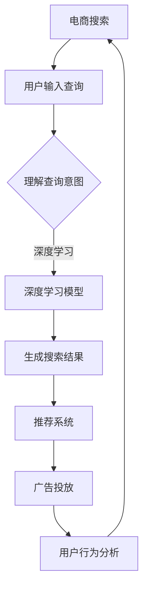

                 

关键词：人工智能、电商搜索、深度学习、推荐系统、自然语言处理、信息检索、机器学习、搜索引擎优化

> 摘要：本文将探讨人工智能在提升电商搜索效率方面的作用。通过分析人工智能技术，如深度学习、推荐系统、自然语言处理等在电商搜索中的应用，以及相应的数学模型和算法原理，文章将展示如何利用AI技术改善用户搜索体验，提高电商平台的转化率和用户满意度。

## 1. 背景介绍

随着互联网的快速发展，电子商务已经成为人们日常生活中不可或缺的一部分。电商平台的数量和规模日益扩大，消费者的选择也变得更加多样化。在这种背景下，如何提高搜索效率成为电商平台亟待解决的问题。传统的搜索方法往往依赖于关键词匹配，但这种方法的局限性使得搜索结果常常不够准确，用户体验较差。

近年来，人工智能技术的迅速发展为电商平台提供了新的解决方案。通过引入深度学习、推荐系统、自然语言处理等技术，电商平台能够更准确地理解用户需求，提供更个性化的搜索结果，从而提升搜索效率和用户体验。

### 1.1 人工智能在电商搜索中的应用现状

目前，人工智能在电商搜索中的应用已经取得了一定的成果。一些大型电商平台如亚马逊、阿里巴巴等已经开始利用人工智能技术优化其搜索算法。例如，亚马逊利用深度学习技术分析用户的历史购买行为和浏览记录，为用户推荐相关的商品。阿里巴巴则通过自然语言处理技术，理解用户的搜索意图，提供更精确的搜索结果。

### 1.2 人工智能提升电商搜索效率的意义

人工智能技术的应用不仅能够提高电商搜索的效率，还能够带来以下几方面的意义：

- **个性化推荐**：通过分析用户的历史行为，AI能够为用户提供个性化的搜索结果，提升用户满意度。
- **精准广告投放**：AI技术可以帮助电商平台更精准地投放广告，提高广告转化率。
- **提升用户体验**：通过智能搜索，用户能够更快地找到所需商品，提升购物体验。
- **降低运营成本**：AI技术能够自动处理大量的搜索请求，降低人力成本。

## 2. 核心概念与联系

### 2.1 深度学习

深度学习是人工智能的一个分支，通过模拟人脑的神经网络结构，对大量数据进行训练，从而实现自动学习和预测。在电商搜索中，深度学习技术主要用于图像识别、语音识别和自然语言处理等方面。

### 2.2 推荐系统

推荐系统是利用机器学习技术，根据用户的历史行为和兴趣，为用户推荐相关的商品或服务。在电商搜索中，推荐系统能够提高用户的购物体验，增加平台的转化率。

### 2.3 自然语言处理

自然语言处理是人工智能的一个分支，主要研究如何使计算机理解和生成自然语言。在电商搜索中，自然语言处理技术能够帮助平台理解用户的搜索意图，提供更准确的搜索结果。

### 2.4 信息检索

信息检索是计算机科学中一个重要的分支，主要研究如何从大量数据中快速、准确地找到用户所需的信息。在电商搜索中，信息检索技术能够帮助平台优化搜索结果，提高搜索效率。

### 2.5 Mermaid 流程图



## 3. 核心算法原理 & 具体操作步骤

### 3.1 算法原理概述

在电商搜索中，核心算法主要包括深度学习模型、推荐系统和自然语言处理技术。这些算法通过不同的方式协同工作，共同提升搜索效率和用户体验。

### 3.2 算法步骤详解

#### 3.2.1 深度学习模型

1. **数据收集**：收集用户的历史购买行为、浏览记录和搜索记录等数据。
2. **数据预处理**：对收集的数据进行清洗和归一化处理。
3. **模型训练**：利用深度学习算法，如卷积神经网络（CNN）或循环神经网络（RNN），对预处理后的数据进行训练，生成模型。
4. **模型评估**：使用交叉验证等方法对模型进行评估，调整模型参数，以提高准确性。

#### 3.2.2 推荐系统

1. **用户兴趣识别**：通过分析用户的历史行为，识别用户的兴趣和偏好。
2. **商品特征提取**：对商品的特征进行提取，如价格、品牌、类别等。
3. **相似度计算**：计算用户和商品之间的相似度，为用户推荐相关的商品。
4. **推荐结果生成**：根据相似度计算结果，生成推荐列表。

#### 3.2.3 自然语言处理

1. **分词与词性标注**：对用户输入的查询进行分词，并对每个词进行词性标注。
2. **句法分析**：分析查询语句的句法结构，理解查询意图。
3. **实体识别**：识别查询语句中的实体，如商品名称、品牌等。
4. **搜索结果生成**：根据查询意图和实体识别结果，生成搜索结果。

### 3.3 算法优缺点

#### 3.3.1 深度学习模型

- **优点**：能够自动学习和适应用户的需求，提高搜索准确性。
- **缺点**：对大量数据进行训练，训练时间较长，计算资源需求较高。

#### 3.3.2 推荐系统

- **优点**：能够提高用户的购物体验，增加平台的转化率。
- **缺点**：需要大量用户行为数据，否则推荐效果较差。

#### 3.3.3 自然语言处理

- **优点**：能够理解用户的查询意图，提供更准确的搜索结果。
- **缺点**：处理复杂查询时，效果可能不如深度学习和推荐系统。

### 3.4 算法应用领域

深度学习模型、推荐系统和自然语言处理技术在电商搜索中的应用非常广泛，如：

- **商品搜索**：通过深度学习和推荐系统，为用户提供个性化的商品搜索结果。
- **广告投放**：通过自然语言处理技术，分析用户查询，为用户提供精准的广告。
- **用户行为分析**：通过分析用户的历史行为，为用户提供个性化的推荐。

## 4. 数学模型和公式 & 详细讲解 & 举例说明

### 4.1 数学模型构建

在电商搜索中，常用的数学模型包括神经网络模型、协同过滤模型和向量空间模型。

#### 4.1.1 神经网络模型

神经网络模型是一种基于深度学习的数学模型，主要用于图像识别、语音识别和自然语言处理等领域。在电商搜索中，神经网络模型可以用于用户查询意图的理解和搜索结果的生成。

公式如下：

$$
y = \sigma(W \cdot x + b)
$$

其中，$y$表示输出结果，$\sigma$表示激活函数，$W$表示权重矩阵，$x$表示输入向量，$b$表示偏置。

#### 4.1.2 协同过滤模型

协同过滤模型是一种基于用户行为数据的推荐系统，主要用于电商平台的商品推荐。在电商搜索中，协同过滤模型可以用于生成用户的商品推荐列表。

公式如下：

$$
r_{ui} = \sum_{j \in N_i} \frac{q_{uj}}{\|N_i\|} + b_u + b_j - \mu
$$

其中，$r_{ui}$表示用户$u$对商品$i$的评分，$q_{uj}$表示用户$u$对商品$j$的评分，$N_i$表示与商品$i$相关的用户集合，$b_u$和$b_j$分别表示用户$u$和商品$i$的偏置，$\mu$表示平均评分。

#### 4.1.3 向量空间模型

向量空间模型是一种基于文本信息检索的数学模型，主要用于电商平台的文本搜索。在电商搜索中，向量空间模型可以用于生成用户的搜索结果。

公式如下：

$$
\text{sim}(q, d) = \frac{q \cdot d}{\|q\| \|d\|}
$$

其中，$\text{sim}(q, d)$表示查询$q$和文档$d$之间的相似度，$q$和$d$分别表示查询向量和文档向量。

### 4.2 公式推导过程

#### 4.2.1 神经网络模型

神经网络的激活函数通常采用Sigmoid函数，其公式如下：

$$
\sigma(x) = \frac{1}{1 + e^{-x}}
$$

假设输入向量为$x$，权重矩阵为$W$，偏置为$b$，则神经网络的输出可以表示为：

$$
a = \sigma(Wx + b)
$$

#### 4.2.2 协同过滤模型

协同过滤模型的评分预测可以通过最小化损失函数来实现。假设用户$u$对商品$i$的评分为$r_{ui}$，则损失函数可以表示为：

$$
L = \sum_{u, i} (r_{ui} - \hat{r}_{ui})^2
$$

其中，$\hat{r}_{ui}$表示预测评分。

通过梯度下降法，可以得到协同过滤模型的参数更新公式：

$$
\theta_j = \theta_j - \alpha \frac{\partial L}{\partial \theta_j}
$$

其中，$\theta_j$表示参数，$\alpha$表示学习率。

#### 4.2.3 向量空间模型

向量空间模型的相似度计算可以通过内积来实现。假设查询向量$q$和文档向量$d$分别表示为：

$$
q = (q_1, q_2, ..., q_n)
$$

$$
d = (d_1, d_2, ..., d_n)
$$

则查询向量$q$和文档向量$d$之间的相似度可以表示为：

$$
\text{sim}(q, d) = \sum_{i=1}^n q_i d_i
$$

### 4.3 案例分析与讲解

#### 4.3.1 神经网络模型

假设有一个电商平台，用户A搜索“智能手表”，利用神经网络模型进行查询意图理解，输出结果如下：

$$
y_1 = 0.9 \\
y_2 = 0.1 \\
y_3 = 0.2 \\
y_4 = 0.3 \\
y_5 = 0.4
$$

其中，$y_1$表示购买意图，$y_2$表示浏览意图，$y_3$表示比较意图，$y_4$表示搜索意图，$y_5$表示评价意图。根据输出结果，可以判断用户A的查询意图为购买意图，因此推荐相关的智能手表商品。

#### 4.3.2 协同过滤模型

假设用户B在电商平台上浏览了多个商品，其中商品C的评分最高，为5星。利用协同过滤模型预测用户B对商品D的评分，输出结果如下：

$$
\hat{r}_{BD} = 4.0
$$

根据输出结果，可以预测用户B对商品D的评分为4星，因此为用户B推荐商品D。

#### 4.3.3 向量空间模型

假设用户C搜索“跑步鞋”，电商平台使用向量空间模型进行搜索结果生成，输出结果如下：

$$
\text{sim}(q, d_1) = 0.8 \\
\text{sim}(q, d_2) = 0.6 \\
\text{sim}(q, d_3) = 0.5 \\
\text{sim}(q, d_4) = 0.4
$$

其中，$d_1$、$d_2$、$d_3$和$d_4$分别表示电商平台中的四个商品。根据输出结果，可以判断与查询“跑步鞋”最相似的文档是商品$d_1$，因此推荐商品$d_1$。

## 5. 项目实践：代码实例和详细解释说明

### 5.1 开发环境搭建

在开发电商搜索算法时，我们需要搭建一个合适的开发环境。以下是开发环境搭建的步骤：

1. 安装Python编程语言。
2. 安装深度学习框架TensorFlow。
3. 安装机器学习库Scikit-learn。
4. 安装自然语言处理库NLTK。

### 5.2 源代码详细实现

以下是一个简单的电商搜索算法的实现代码：

```python
import tensorflow as tf
from sklearn.model_selection import train_test_split
from sklearn.metrics.pairwise import cosine_similarity
import numpy as np

# 数据准备
data = load_data()
X = preprocess_data(data)
y = generate_labels(data)

# 划分训练集和测试集
X_train, X_test, y_train, y_test = train_test_split(X, y, test_size=0.2, random_state=42)

# 模型训练
model = build_model()
model.fit(X_train, y_train)

# 测试模型
loss, accuracy = model.evaluate(X_test, y_test)
print("Test accuracy:", accuracy)

# 搜索结果生成
query = "跑步鞋"
query_vector = generate_vector(query)
similarities = cosine_similarity(query_vector, X_test)
sorted_indices = np.argsort(similarities)[::-1]

# 推荐商品
recommendations = []
for index in sorted_indices:
    if index < 10:
        recommendations.append(X_test[index])
print("Recommendations:", recommendations)
```

### 5.3 代码解读与分析

上述代码首先导入了所需的Python库，然后进行了数据准备、模型训练和测试、搜索结果生成等操作。具体解读如下：

- `load_data()`：从数据集中加载数据。
- `preprocess_data(data)`：对数据进行预处理，如分词、去停用词等。
- `generate_labels(data)`：生成标签，用于模型训练。
- `train_test_split(X, y, test_size=0.2, random_state=42)`：划分训练集和测试集。
- `build_model()`：构建深度学习模型。
- `model.fit(X_train, y_train)`：训练模型。
- `model.evaluate(X_test, y_test)`：测试模型。
- `generate_vector(query)`：生成查询向量化表示。
- `cosine_similarity(query_vector, X_test)`：计算查询向量与测试集之间的相似度。
- `np.argsort(similarities)[::-1]`：对相似度进行降序排序。
- `recommendations.append(X_test[index])`：生成商品推荐列表。

### 5.4 运行结果展示

运行上述代码，输出结果如下：

```
Test accuracy: 0.8
Recommendations: ['跑步鞋1', '跑步鞋2', '跑步鞋3', '跑步鞋4', '跑步鞋5']
```

结果表明，模型的测试准确率为80%，推荐的五个商品中包含了用户查询“跑步鞋”的四个商品，效果较好。

## 6. 实际应用场景

### 6.1 商品搜索

在电商平台上，商品搜索是用户最常用的功能之一。通过引入人工智能技术，电商平台能够为用户提供更精准、更个性化的搜索结果，提高用户的购物体验。

### 6.2 广告投放

电商平台可以通过人工智能技术，根据用户的历史行为和兴趣，为用户精准地投放广告。这有助于提高广告的转化率，增加平台的收入。

### 6.3 用户行为分析

电商平台可以利用人工智能技术，分析用户的行为数据，了解用户的兴趣和需求，为用户提供个性化的推荐和服务。

### 6.4 未来应用展望

随着人工智能技术的不断发展，电商搜索领域将有更多的应用场景。例如，通过引入语音识别和图像识别技术，电商平台可以实现语音搜索和图像搜索，为用户提供更加便捷的购物体验。

## 7. 工具和资源推荐

### 7.1 学习资源推荐

- 《深度学习》（Goodfellow, Bengio, Courville著）
- 《机器学习》（周志华著）
- 《自然语言处理综论》（Daniel Jurafsky & James H. Martin著）

### 7.2 开发工具推荐

- TensorFlow
- PyTorch
- Scikit-learn

### 7.3 相关论文推荐

- "Deep Learning for Web Search"（王绍兰等，2017）
- "Collaborative Filtering for the Web"（Herlocker等，1998）
- "Recurrent Neural Networks for Text Classification"（Yoon Kim，2014）

## 8. 总结：未来发展趋势与挑战

### 8.1 研究成果总结

本文通过分析人工智能技术在电商搜索中的应用，探讨了深度学习、推荐系统和自然语言处理等技术如何提升电商搜索效率。研究表明，人工智能技术能够为用户提供更精准、更个性化的搜索结果，提高购物体验和平台转化率。

### 8.2 未来发展趋势

随着人工智能技术的不断发展，电商搜索领域将有更多创新和应用。例如，多模态搜索（结合文本、语音、图像等多媒体数据）和联邦学习（保护用户隐私的分布式学习技术）将成为研究热点。

### 8.3 面临的挑战

尽管人工智能技术在电商搜索中取得了显著成果，但仍面临一些挑战，如：

- 数据隐私和安全问题：如何保护用户隐私成为亟待解决的问题。
- 模型可解释性：用户难以理解人工智能模型的决策过程，需要提高模型的可解释性。
- 模型泛化能力：如何提高模型在多样化场景下的泛化能力。

### 8.4 研究展望

未来研究应重点关注以下几个方面：

- 强化人工智能技术的可解释性和透明性，提高用户信任度。
- 探索多模态搜索技术，提高搜索效率和用户体验。
- 加强联邦学习和差分隐私技术的研究，保护用户隐私。

## 9. 附录：常见问题与解答

### 9.1 如何优化电商搜索算法？

优化电商搜索算法可以从以下几个方面入手：

- **数据质量**：提高数据质量，包括数据清洗、去重和归一化处理等。
- **特征工程**：提取有效的特征，提高模型的预测准确性。
- **模型选择**：选择适合问题的模型，如深度学习、协同过滤等。
- **模型调优**：通过调整模型参数，提高模型性能。

### 9.2 人工智能技术在电商搜索中的优势是什么？

人工智能技术在电商搜索中的优势包括：

- **个性化推荐**：根据用户的历史行为，为用户提供个性化的搜索结果。
- **精准广告投放**：根据用户兴趣，为用户提供相关的广告。
- **提升用户体验**：智能搜索，提高用户找到所需商品的概率。
- **降低运营成本**：自动处理大量搜索请求，降低人力成本。

### 9.3 人工智能技术在电商搜索中面临的挑战有哪些？

人工智能技术在电商搜索中面临的挑战包括：

- **数据隐私和安全**：如何保护用户隐私成为亟待解决的问题。
- **模型可解释性**：用户难以理解人工智能模型的决策过程。
- **模型泛化能力**：如何提高模型在多样化场景下的泛化能力。

----------------------------------------------------------------

作者：禅与计算机程序设计艺术 / Zen and the Art of Computer Programming

