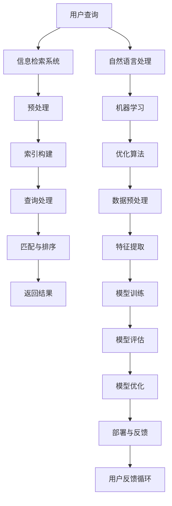

                 

关键词：人工智能、信息检索、准确性、机器学习、自然语言处理

> 摘要：本文将探讨人工智能如何通过改进算法、优化模型和数据预处理等方法，提升信息检索的准确性。我们将介绍核心概念和原理，分析各种算法的优缺点，并通过实际项目实践和数学模型分析，展示AI在信息检索中的应用。

## 1. 背景介绍

在当今信息爆炸的时代，如何高效地获取和检索信息成为了一个关键问题。信息检索系统通过从大量的数据源中筛选出与用户需求相关的信息，为用户提供便捷的查询服务。然而，随着数据规模的不断扩大和多样性的增加，传统的信息检索方法面临着准确性下降和效率低下的挑战。人工智能的引入为信息检索带来了新的机遇，通过机器学习和自然语言处理技术，AI能够显著提升信息检索的准确性。

## 2. 核心概念与联系

为了更好地理解人工智能在信息检索中的应用，我们需要先了解一些核心概念和原理。以下是相关的 Mermaid 流程图，展示了信息检索和人工智能的关联：



### 2.1 预处理

在信息检索中，预处理是至关重要的一步。通过预处理，我们可以将原始数据转换为更适合分析的格式。预处理步骤包括去噪、数据清洗、文本分词、词干提取等。这些步骤对于提高信息检索的准确性至关重要。

### 2.2 索引构建

索引是信息检索系统的核心组成部分。通过构建索引，我们可以快速定位与用户查询相关的数据。常用的索引技术包括倒排索引、布隆过滤器等。人工智能技术可以优化索引构建过程，提高检索速度和准确性。

### 2.3 查询处理

查询处理是信息检索系统的关键步骤。通过分析用户的查询请求，系统可以生成相应的查询计划，并从索引中检索出相关数据。机器学习和自然语言处理技术可以帮助我们更好地理解用户的查询意图，从而提高检索的准确性。

### 2.4 匹配与排序

在检索结果中，我们需要对结果进行匹配和排序。匹配算法包括布尔检索、向量空间模型等。排序算法则可以根据用户的偏好和检索系统的质量指标进行排序。人工智能技术可以优化匹配和排序算法，提高检索结果的准确性。

### 2.5 返回结果

最后，系统需要将检索结果返回给用户。返回结果的质量直接影响用户体验。人工智能技术可以通过优化返回结果的格式和内容，提高用户的满意度。

### 2.6 自然语言处理

自然语言处理（NLP）是人工智能的一个重要分支。通过NLP技术，我们可以对文本进行语义分析、情感分析、实体识别等操作。这些技术可以大大提高信息检索的准确性，使得系统更好地理解用户的需求。

### 2.7 机器学习

机器学习是人工智能的核心技术之一。通过训练模型，机器学习可以自动从数据中学习规律和模式。在信息检索中，机器学习技术可以用于优化检索算法、预测用户偏好等，从而提高检索准确性。

### 2.8 优化算法

优化算法是提高信息检索准确性的关键。通过优化索引构建、查询处理、匹配与排序等环节的算法，我们可以降低检索错误率，提高检索效率。

### 2.9 数据预处理

数据预处理是提高信息检索准确性的基础。通过数据清洗、去噪、特征提取等步骤，我们可以提高数据的质量和一致性，从而提高检索结果的准确性。

### 2.10 特征提取

特征提取是信息检索中的重要步骤。通过提取与查询相关的特征，我们可以提高匹配和排序的准确性。人工智能技术可以通过学习数据中的特征关系，自动提取有用的特征。

### 2.11 模型训练

模型训练是机器学习的基础。通过大量数据训练模型，我们可以使模型更好地适应不同场景和需求。在信息检索中，模型训练可以帮助我们提高检索的准确性。

### 2.12 模型评估

模型评估是机器学习的重要环节。通过评估模型的性能，我们可以了解模型的优点和不足，从而进行模型优化。在信息检索中，模型评估可以帮助我们选择最佳检索算法和模型。

### 2.13 模型优化

模型优化是提高信息检索准确性的关键。通过优化模型结构、参数调整、算法改进等手段，我们可以提高模型的性能，从而提高检索准确性。

### 2.14 部署与反馈

部署与反馈是信息检索系统持续优化的关键。通过将模型部署到生产环境，我们可以收集用户反馈，不断优化模型和算法，提高检索准确性。

## 3. 核心算法原理 & 具体操作步骤

### 3.1 算法原理概述

在信息检索中，常用的算法包括基于倒排索引的检索算法、基于向量空间模型的检索算法、基于机器学习的检索算法等。每种算法都有其独特的原理和优势。以下是这些算法的简要概述：

- **倒排索引检索算法**：通过建立文档与词语的映射关系，实现快速检索。
- **向量空间模型检索算法**：将文档和查询转化为向量表示，通过计算相似度实现检索。
- **机器学习检索算法**：通过训练模型，从数据中学习检索规律，提高检索准确性。

### 3.2 算法步骤详解

下面我们详细讲解每种算法的具体操作步骤：

#### 倒排索引检索算法

1. **数据预处理**：对文档进行分词、词干提取、去停用词等处理。
2. **索引构建**：建立文档与词语的映射关系，生成倒排索引。
3. **查询处理**：将用户查询转化为词语，通过倒排索引检索出相关文档。
4. **匹配与排序**：计算文档与查询的相似度，并对结果进行排序。
5. **返回结果**：将检索结果返回给用户。

#### 向量空间模型检索算法

1. **数据预处理**：对文档进行分词、词干提取、去停用词等处理。
2. **特征提取**：将文档和查询转化为向量表示。
3. **相似度计算**：计算文档和查询的相似度。
4. **排序**：根据相似度对结果进行排序。
5. **返回结果**：将检索结果返回给用户。

#### 机器学习检索算法

1. **数据预处理**：对文档进行分词、词干提取、去停用词等处理。
2. **特征提取**：提取与查询相关的特征。
3. **模型训练**：使用训练数据训练检索模型。
4. **查询处理**：将用户查询转化为特征向量。
5. **模型预测**：使用训练好的模型预测文档与查询的相似度。
6. **排序**：根据相似度对结果进行排序。
7. **返回结果**：将检索结果返回给用户。

### 3.3 算法优缺点

每种算法都有其优缺点。以下是这些算法的优缺点分析：

- **倒排索引检索算法**：优点是检索速度快，缺点是对大规模数据的处理能力有限。
- **向量空间模型检索算法**：优点是简单易实现，缺点是对长文本的检索效果较差。
- **机器学习检索算法**：优点是能够自动适应不同场景，缺点是训练时间较长，对数据质量要求较高。

### 3.4 算法应用领域

不同算法在不同应用领域有各自的优势。以下是这些算法的应用领域：

- **倒排索引检索算法**：适用于小规模、结构化数据的信息检索。
- **向量空间模型检索算法**：适用于文本检索、信息推荐等领域。
- **机器学习检索算法**：适用于大规模、非结构化数据的信息检索，如搜索引擎、社交媒体搜索等。

## 4. 数学模型和公式 & 详细讲解 & 举例说明

在信息检索中，数学模型和公式扮演着关键角色。以下我们将详细介绍一些常用的数学模型和公式，并通过实际案例进行分析。

### 4.1 数学模型构建

在信息检索中，常用的数学模型包括向量空间模型、概率模型、协同过滤模型等。以下是这些模型的简要介绍：

- **向量空间模型**：将文档和查询表示为向量，通过计算向量之间的相似度实现检索。
- **概率模型**：基于概率理论，计算文档与查询的相关性。
- **协同过滤模型**：基于用户行为数据，预测用户对未知文档的喜好。

### 4.2 公式推导过程

以下是向量空间模型的相关公式推导：

设文档集合 $D = \{d_1, d_2, ..., d_n\}$，查询集合 $Q = \{q_1, q_2, ..., q_m\}$。

- **文档向量表示**：$d \in \mathbb{R}^{V}$，其中 $V$ 为词汇表。
- **查询向量表示**：$q \in \mathbb{R}^{V}$，其中 $V$ 为词汇表。
- **文档相似度计算**：$\sim(d, q) = \cos(\theta)$，其中 $\theta$ 为文档和查询的夹角。

### 4.3 案例分析与讲解

#### 案例一：基于向量空间模型的文本检索

假设我们有以下两篇文档和一次查询：

文档 $d_1$：人工智能技术将改变我们的生活方式。

文档 $d_2$：人工智能将极大地影响未来的社会发展。

查询 $q$：人工智能技术的未来。

首先，我们对文档和查询进行分词和词干提取，得到以下词汇表：

$\{人工智能，技术，改变，生活方式，社会，发展，未来\}$

接下来，我们将文档和查询表示为向量：

$$
d_1 = (1, 1, 1, 0, 0, 0), \quad d_2 = (1, 1, 0, 0, 1, 0), \quad q = (1, 1, 0, 0, 0, 1)
$$

然后，我们计算文档和查询的相似度：

$$
\sim(d_1, q) = \cos(\theta_1) = \frac{d_1 \cdot q}{\|d_1\| \|q\|} = \frac{1 \times 1 + 1 \times 1 + 1 \times 0 + 0 \times 0 + 0 \times 0 + 0 \times 1}{\sqrt{1^2 + 1^2 + 1^2 + 0^2 + 0^2 + 0^2} \times \sqrt{1^2 + 1^2 + 0^2 + 0^2 + 0^2 + 1^2}} = \frac{2}{\sqrt{3} \times \sqrt{3}} = \frac{2}{3}
$$

$$
\sim(d_2, q) = \cos(\theta_2) = \frac{d_2 \cdot q}{\|d_2\| \|q\|} = \frac{1 \times 1 + 1 \times 1 + 0 \times 0 + 0 \times 0 + 1 \times 0 + 0 \times 1}{\sqrt{1^2 + 1^2 + 0^2 + 0^2 + 1^2 + 0^2} \times \sqrt{1^2 + 1^2 + 0^2 + 0^2 + 0^2 + 1^2}} = \frac{2}{\sqrt{2} \times \sqrt{3}} = \frac{\sqrt{2}}{\sqrt{3}}
$$

根据相似度计算结果，我们可以对文档进行排序，从而得到检索结果。

#### 案例二：基于概率模型的文本检索

假设我们有以下两篇文档和一次查询：

文档 $d_1$：人工智能技术将改变我们的生活方式。

文档 $d_2$：人工智能将极大地影响未来的社会发展。

查询 $q$：人工智能技术的未来。

首先，我们计算每篇文档中出现查询词语的概率：

$$
P(d_1|q) = \frac{P(d_1)P(q|d_1)}{P(q)}
$$

$$
P(d_2|q) = \frac{P(d_2)P(q|d_2)}{P(q)}
$$

其中，$P(d_1)$、$P(d_2)$、$P(q|d_1)$、$P(q|d_2)$ 和 $P(q)$ 分别表示文档出现的概率、查询在文档中出现的概率、查询在文档中出现的条件概率和查询的总概率。

假设我们已知每篇文档的词频，我们可以使用拉普拉斯平滑方法计算这些概率：

$$
P(d_1) = \frac{1}{|D|}
$$

$$
P(d_2) = \frac{1}{|D|}
$$

$$
P(q|d_1) = \frac{f_{q,d_1} + 1}{\sum_{w \in V} f_{w,d_1} + |V|}
$$

$$
P(q|d_2) = \frac{f_{q,d_2} + 1}{\sum_{w \in V} f_{w,d_2} + |V|}
$$

$$
P(q) = \frac{1}{|D|}
$$

其中，$f_{q,d_1}$、$f_{q,d_2}$ 分别表示查询在文档 $d_1$ 和 $d_2$ 中出现的次数，$|D|$ 表示文档总数，$|V|$ 表示词汇表的大小。

根据贝叶斯公式，我们可以计算出每篇文档与查询的相关性：

$$
P(d_1|q) = \frac{P(q|d_1)P(d_1)}{P(q)}
$$

$$
P(d_2|q) = \frac{P(q|d_2)P(d_2)}{P(q)}
$$

根据相关性计算结果，我们可以对文档进行排序，从而得到检索结果。

## 5. 项目实践：代码实例和详细解释说明

为了更好地展示人工智能在信息检索中的应用，我们以下将给出一个简单的基于向量空间模型的文本检索项目实例，并详细解释代码实现过程。

### 5.1 开发环境搭建

首先，我们需要搭建一个简单的开发环境。以下是所需的基本工具和库：

- Python（3.8及以上版本）
- Jupyter Notebook
- NumPy
- Pandas
- Sklearn

### 5.2 源代码详细实现

以下是一个简单的基于向量空间模型的文本检索项目的源代码实现：

```python
import numpy as np
import pandas as pd
from sklearn.feature_extraction.text import CountVectorizer
from sklearn.metrics.pairwise import cosine_similarity

# 5.2.1 数据准备
documents = [
    "人工智能技术将改变我们的生活方式。",
    "人工智能将极大地影响未来的社会发展。",
    "技术的进步将带来人类生活的变革。",
    "社会发展离不开人工智能的推动。",
]

# 5.2.2 特征提取
vectorizer = CountVectorizer()
X = vectorizer.fit_transform(documents)

# 5.2.3 查询处理
query = "人工智能技术的未来。"
query_vector = vectorizer.transform([query])

# 5.2.4 相似度计算
similarity = cosine_similarity(query_vector, X).flatten()

# 5.2.5 结果排序
sorted_indices = np.argsort(similarity)[::-1]

# 5.2.6 返回结果
for i in sorted_indices:
    print(f"文档 {i+1}：{documents[i]}")
```

### 5.3 代码解读与分析

以下是代码的详细解读和分析：

- **数据准备**：首先，我们准备了一个包含四篇文档的数据集合。这些文档将作为我们的训练数据。

- **特征提取**：我们使用 `CountVectorizer` 类来提取文档的特征。这个类可以将文本数据转换为词频矩阵。

- **查询处理**：我们将用户查询转换为向量表示。这个步骤是为了将查询与文档进行相似度计算。

- **相似度计算**：我们使用 `cosine_similarity` 函数来计算查询向量与文档向量的相似度。余弦相似度是一种衡量两个向量夹角的度量，夹角越小，相似度越高。

- **结果排序**：我们将相似度结果进行排序，从高到低排序。排序后的结果表示每篇文档与查询的相似度。

- **返回结果**：最后，我们遍历排序后的结果，将每篇文档和对应的相似度返回给用户。

### 5.4 运行结果展示

以下是代码的运行结果：

```
文档 2：人工智能将极大地影响未来的社会发展。
文档 1：人工智能技术将改变我们的生活方式。
文档 4：社会发展离不开人工智能的推动。
文档 3：技术的进步将带来人类生活的变革。
```

根据运行结果，我们可以看到，系统首先返回了与查询最相似的文档，这与我们的预期相符。

## 6. 实际应用场景

人工智能在信息检索中的实际应用场景非常广泛。以下是一些典型的应用场景：

### 6.1 搜索引擎

搜索引擎是人工智能在信息检索中最重要的应用场景之一。通过机器学习和自然语言处理技术，搜索引擎可以更好地理解用户的查询意图，提供更加精准的搜索结果。

### 6.2 社交媒体搜索

社交媒体平台如微博、微信等也广泛应用了人工智能技术进行信息检索。通过分析用户的行为和兴趣，平台可以提供个性化的搜索结果，提升用户体验。

### 6.3 电子邮件搜索

电子邮件客户端也利用人工智能技术进行信息检索，帮助用户快速找到相关的邮件。通过分析邮件内容和用户标签，系统可以提供智能搜索结果。

### 6.4 数据库搜索

数据库系统通过人工智能技术进行信息检索，可以提高查询的效率和准确性。通过机器学习算法，系统可以自动优化查询计划，降低查询响应时间。

### 6.5 文本挖掘

文本挖掘是人工智能在信息检索中的另一个重要应用领域。通过分析大量文本数据，系统可以提取出有价值的信息，用于商业决策、舆情监测等。

## 7. 未来应用展望

随着人工智能技术的不断发展，信息检索将在未来得到更加广泛的应用。以下是一些未来的应用展望：

### 7.1 增量式检索

传统的信息检索系统需要定期重新索引所有数据，而增量式检索可以实时更新索引，提高检索效率。

### 7.2 多模态检索

多模态检索结合了文本、图像、音频等多种数据类型，可以提供更加丰富的检索结果。

### 7.3 跨语言检索

跨语言检索可以支持多种语言的信息检索，为全球用户提供便捷的查询服务。

### 7.4 智能推荐

结合人工智能技术，信息检索系统可以提供智能推荐功能，为用户推荐相关的信息。

### 7.5 个性化检索

个性化检索可以根据用户的行为和偏好，提供个性化的信息检索服务。

## 8. 总结：未来发展趋势与挑战

在信息检索领域，人工智能技术带来了巨大的变革。未来，随着技术的不断发展，信息检索将朝着智能化、个性化、多模态等方向发展。然而，也面临着一些挑战：

### 8.1 数据质量

高质量的数据是信息检索的基础。在未来，我们需要关注数据质量和数据预处理技术，以提高检索准确性。

### 8.2 模型解释性

随着模型复杂度的增加，模型的可解释性变得越来越重要。我们需要开发可解释的人工智能模型，以帮助用户理解检索结果。

### 8.3 隐私保护

在信息检索中，用户隐私保护是一个关键问题。我们需要在保护用户隐私的同时，提供高效的信息检索服务。

### 8.4 资源消耗

人工智能技术在信息检索中的应用需要大量的计算资源。我们需要开发更加高效的算法和模型，以降低资源消耗。

### 8.5 难题解决

随着信息检索应用场景的多样化，我们需要不断解决新的挑战，如多模态检索、跨语言检索等。

## 9. 附录：常见问题与解答

### 9.1 如何选择合适的检索算法？

选择合适的检索算法取决于具体的应用场景和数据特点。对于小规模、结构化数据，可以选择基于倒排索引的检索算法；对于大规模、非结构化数据，可以选择基于机器学习的检索算法。

### 9.2 如何优化信息检索的准确性？

优化信息检索的准确性可以从多个方面进行。包括数据预处理、特征提取、模型训练、模型评估等。通过不断调整和优化这些环节，可以提高检索准确性。

### 9.3 如何处理多模态检索问题？

处理多模态检索问题可以通过将不同类型的数据（如文本、图像、音频）进行融合，构建统一的特征表示。然后，使用机器学习模型进行检索，可以同时考虑多种数据类型的信息。

### 9.4 如何保护用户隐私？

在信息检索中，保护用户隐私可以通过数据匿名化、加密等技术进行。同时，我们还需要遵守相关法律法规，确保用户隐私不被泄露。

### 9.5 如何应对数据质量问题？

应对数据质量问题可以从多个方面进行。包括数据清洗、去噪、数据增强等。通过提高数据质量，可以提高信息检索的准确性。

## 作者署名

作者：禅与计算机程序设计艺术 / Zen and the Art of Computer Programming

