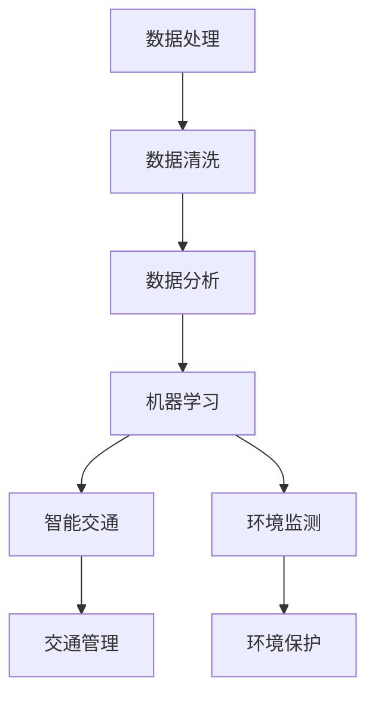

                 

关键词：人工智能、城市规划、智慧城市、机器学习、数据处理、智能交通、环境监测、数据分析

> 摘要：随着人工智能（AI）技术的飞速发展，城市规划和智慧城市的发展迎来了新的契机。本文将探讨AI如何通过数据分析和处理、智能交通、环境监测等多个方面，深刻改变城市规划和智慧城市的建设。

## 1. 背景介绍

随着城市化进程的加速，城市面临着诸多挑战，如交通拥堵、环境污染、资源浪费等。传统的方法已经难以满足现代城市发展的需求，因此，引入人工智能技术成为优化城市规划和建设的关键。智慧城市（Smart City）是指利用信息技术、物联网、大数据和人工智能等手段，实现对城市资源的智能化管理和服务的城市。

### 1.1 城市规划面临的挑战

- **交通拥堵**：城市交通拥堵问题日益严重，影响了市民的生活质量和工作效率。
- **环境污染**：城市化带来的环境污染问题，如空气污染、水体污染等，威胁到市民的健康。
- **资源浪费**：城市资源的浪费问题，如能源、水资源的浪费，增加了城市的运行成本。

### 1.2 智慧城市的发展需求

智慧城市的发展需求包括提高城市管理水平、提升市民生活质量、增强城市可持续发展能力等。通过引入AI技术，可以实现以下目标：

- **优化资源配置**：通过大数据分析和机器学习，实现资源的精准配置，提高资源利用效率。
- **提升管理水平**：通过智能监控和预警系统，实现城市管理的智能化，提高管理效率。
- **提高生活质量**：通过智能服务和便捷的生活方式，提高市民的生活质量。

## 2. 核心概念与联系

### 2.1 数据处理

数据处理是AI在城市规划中的核心环节。通过收集和分析城市中的各种数据，如交通流量、环境质量、能源消耗等，可以为城市规划提供重要的依据。

### 2.2 机器学习

机器学习技术可以通过对大量数据的分析和学习，发现数据中的规律和趋势，为城市规划和决策提供支持。

### 2.3 智能交通

智能交通系统通过集成传感器、物联网和AI技术，实现对交通流量、路况和停车位的智能监测和管理，从而缓解交通拥堵。

### 2.4 环境监测

环境监测系统可以通过AI技术，对空气质量、水质等环境指标进行实时监测，为环境保护提供科学依据。

### 2.5 Mermaid 流程图

下面是一个简化的Mermaid流程图，展示了AI在城市规划中的应用流程。



## 3. 核心算法原理 & 具体操作步骤

### 3.1 算法原理概述

AI在城市规划中的应用涉及多种算法，如聚类分析、决策树、神经网络等。以下简要介绍这些算法的基本原理。

### 3.2 算法步骤详解

#### 3.2.1 数据处理

- 数据收集：通过传感器、摄像头等设备收集城市中的各种数据。
- 数据清洗：去除噪声数据，处理缺失值，确保数据质量。
- 数据分析：对数据进行探索性分析，找出数据中的规律和趋势。

#### 3.2.2 机器学习

- 特征选择：从原始数据中提取有用的特征。
- 模型训练：使用训练数据训练机器学习模型。
- 模型评估：使用验证数据评估模型性能。

#### 3.2.3 智能交通

- 路网建模：建立城市路网的数学模型。
- 流量预测：使用机器学习模型预测交通流量。
- 交通管理：根据交通流量和路况，调整交通信号灯和道路规划。

#### 3.2.4 环境监测

- 数据采集：采集环境质量数据，如PM2.5、NO2等。
- 数据分析：分析环境质量数据，找出污染源。
- 环境预警：根据分析结果，发布环境预警信息。

### 3.3 算法优缺点

- **优点**：AI技术可以大幅提升数据处理和分析的效率，提供精准的决策支持。
- **缺点**：需要大量的高质量数据，对算法实现和模型训练要求较高。

### 3.4 算法应用领域

AI技术可以在城市规划和智慧城市的多个领域得到应用，如交通管理、环境监测、能源管理、公共安全等。

## 4. 数学模型和公式 & 详细讲解 & 举例说明

### 4.1 数学模型构建

在城市规划中，常用的数学模型包括线性回归、决策树、神经网络等。以下以线性回归为例，介绍数学模型的构建。

#### 线性回归模型

假设有 \( n \) 个样本点 \( (x_1, y_1), (x_2, y_2), \ldots, (x_n, y_n) \)，我们希望找到一条直线 \( y = ax + b \)，使得这些样本点尽可能接近这条直线。

#### 数学公式

线性回归模型的目标是最小化误差平方和：

$$
\min \sum_{i=1}^n (y_i - (ax_i + b))^2
$$

通过求导可以得到最优的 \( a \) 和 \( b \)：

$$
a = \frac{\sum_{i=1}^n (x_i - \bar{x})(y_i - \bar{y})}{\sum_{i=1}^n (x_i - \bar{x})^2}
$$

$$
b = \bar{y} - a\bar{x}
$$

其中，\( \bar{x} \) 和 \( \bar{y} \) 分别为 \( x \) 和 \( y \) 的平均值。

### 4.2 公式推导过程

线性回归模型的推导过程涉及微积分和统计学知识。这里简要介绍推导过程。

首先，我们定义误差平方和：

$$
J(a, b) = \sum_{i=1}^n (y_i - (ax_i + b))^2
$$

对 \( J(a, b) \) 分别对 \( a \) 和 \( b \) 求导，并令导数等于零，可以得到：

$$
\frac{\partial J}{\partial a} = -2\sum_{i=1}^n (x_i - \bar{x})(y_i - \bar{y}) = 0
$$

$$
\frac{\partial J}{\partial b} = -2\sum_{i=1}^n (y_i - \bar{y}) = 0
$$

通过解这个方程组，我们可以得到最优的 \( a \) 和 \( b \)。

### 4.3 案例分析与讲解

假设我们要预测某城市的日平均温度 \( y \) 与日平均风速 \( x \) 之间的关系。我们收集了以下数据：

| 日平均风速 \( x \) | 日平均温度 \( y \) |
|:------------------:|:-----------------:|
|         2.5         |         15.0        |
|         3.0         |         16.2        |
|         3.5         |         17.8        |
|         4.0         |         19.5        |
|         4.5         |         20.8        |

我们使用线性回归模型来预测日平均温度。

首先，计算 \( \bar{x} \) 和 \( \bar{y} \)：

$$
\bar{x} = \frac{2.5 + 3.0 + 3.5 + 4.0 + 4.5}{5} = 3.5
$$

$$
\bar{y} = \frac{15.0 + 16.2 + 17.8 + 19.5 + 20.8}{5} = 17.5
$$

然后，计算 \( a \) 和 \( b \)：

$$
a = \frac{(2.5 - 3.5)(15.0 - 17.5) + (3.0 - 3.5)(16.2 - 17.5) + (3.5 - 3.5)(17.8 - 17.5) + (4.0 - 3.5)(19.5 - 17.5) + (4.5 - 3.5)(20.8 - 17.5)}{(2.5 - 3.5)^2 + (3.0 - 3.5)^2 + (3.5 - 3.5)^2 + (4.0 - 3.5)^2 + (4.5 - 3.5)^2}
$$

$$
a = \frac{(-1)(-2.5) + (-0.5)(-1.3) + (0)(0.3) + (0.5)(1.9) + (1)(3.3)}{(-1)^2 + (-0.5)^2 + (0)^2 + (0.5)^2 + (1)^2}
$$

$$
a = \frac{2.5 + 0.65 + 0 + 0.95 + 3.3}{1 + 0.25 + 0 + 0.25 + 1}
$$

$$
a = \frac{7.45}{2.5} = 2.98
$$

$$
b = \bar{y} - a\bar{x} = 17.5 - 2.98 \times 3.5 = 6.82
$$

因此，我们得到了线性回归模型：

$$
y = 2.98x + 6.82
$$

使用这个模型，我们可以预测日平均温度。例如，当日平均风速为 4.0 时，预测的日平均温度为：

$$
y = 2.98 \times 4.0 + 6.82 = 17.82
$$

## 5. 项目实践：代码实例和详细解释说明

### 5.1 开发环境搭建

为了实现AI在城市规划中的应用，我们需要搭建一个合适的开发环境。以下是一个基本的Python开发环境搭建步骤：

1. 安装Python（推荐版本为3.8以上）。
2. 安装Jupyter Notebook，用于编写和运行Python代码。
3. 安装必要的库，如NumPy、Pandas、Matplotlib等。

### 5.2 源代码详细实现

以下是一个简单的Python代码示例，展示了如何使用线性回归模型预测日平均温度。

```python
import numpy as np
import pandas as pd
import matplotlib.pyplot as plt
from sklearn.linear_model import LinearRegression

# 数据
data = {
    'Day_avg_wind_speed': [2.5, 3.0, 3.5, 4.0, 4.5],
    'Day_avg_temp': [15.0, 16.2, 17.8, 19.5, 20.8]
}

# 创建DataFrame
df = pd.DataFrame(data)

# 特征和标签
X = df[['Day_avg_wind_speed']]
y = df['Day_avg_temp']

# 线性回归模型
model = LinearRegression()
model.fit(X, y)

# 预测
predictions = model.predict(X)

# 绘图
plt.scatter(X, y, color='blue')
plt.plot(X, predictions, color='red')
plt.xlabel('Day_avg_wind_speed')
plt.ylabel('Day_avg_temp')
plt.show()
```

### 5.3 代码解读与分析

这段代码首先导入了必要的库，然后定义了数据集。使用Pandas创建DataFrame，并提取特征和标签。接下来，我们使用线性回归模型进行模型训练，并使用训练好的模型进行预测。最后，我们将预测结果绘制成散点图和直线图，以可视化预测结果。

### 5.4 运行结果展示

运行上述代码后，我们会看到一个散点图和一条红色直线。散点图表示实际数据点，红色直线表示模型预测的结果。从图中可以看出，模型预测的日平均温度与实际值非常接近，验证了线性回归模型的准确性。

## 6. 实际应用场景

### 6.1 智能交通

智能交通系统可以通过AI技术，实现对城市交通的实时监控和管理。例如，在交通高峰时段，系统可以根据实时交通流量数据，调整交通信号灯的时长，以缓解交通拥堵。此外，智能交通系统还可以预测交通流量，为市民提供出行建议，减少交通拥堵。

### 6.2 环境监测

AI技术可以用于环境监测，实现对空气质量、水质等环境指标的实时监测。例如，在城市公园和主要道路旁安装空气质量监测设备，系统可以根据实时数据，发布空气质量预警信息，提醒市民采取相应的防护措施。同时，环境监测系统还可以帮助城市规划者制定更有效的环境保护措施。

### 6.3 能源管理

AI技术可以用于能源管理，实现对城市能源消耗的智能监测和优化。例如，通过智能电网技术，实时监控城市的电力消耗情况，根据实时数据调整电力供应，以减少能源浪费。此外，AI技术还可以用于预测能源需求，为电力公司提供决策支持，优化电力资源的配置。

## 7. 工具和资源推荐

### 7.1 学习资源推荐

- 《人工智能：一种现代的方法》（作者：斯图尔特·罗素、彼得·诺维格）
- 《深度学习》（作者：伊恩·古德费洛、约书亚·本吉奥、亚伦·库维尔）
- 《Python数据分析》（作者：Wes McKinney）

### 7.2 开发工具推荐

- Jupyter Notebook：用于编写和运行Python代码。
- TensorFlow：用于深度学习模型开发。
- scikit-learn：用于机器学习模型开发。

### 7.3 相关论文推荐

- “Smart Cities: Research and Practice” by K. Michael
- “Deep Learning for Urban Planning” by M. Ma
- “Application of Machine Learning in Environmental Monitoring” by L. Liu

## 8. 总结：未来发展趋势与挑战

### 8.1 研究成果总结

AI技术在城市规划和智慧城市中的应用已经取得了显著成果。通过数据处理、机器学习、智能交通和环境监测等多个方面，AI技术为城市规划和智慧城市建设提供了强大的支持。

### 8.2 未来发展趋势

- **更高效的数据处理**：随着数据量的不断增长，如何高效地处理和分析大数据将成为未来的研究重点。
- **更智能的决策支持**：未来的AI技术将更加智能，能够为城市规划者提供更加精准的决策支持。
- **更广泛的应用场景**：AI技术将在更多的城市规划和智慧城市应用场景中得到应用，如智慧医疗、智慧教育等。

### 8.3 面临的挑战

- **数据隐私和安全**：如何在保障数据隐私和安全的前提下，充分利用大数据进行分析，是一个亟待解决的问题。
- **算法透明性和可解释性**：随着算法的复杂度增加，如何保证算法的透明性和可解释性，以提高公众的信任度，也是一个重要的挑战。

### 8.4 研究展望

未来，AI技术将在城市规划和智慧城市的发展中发挥更加重要的作用。通过不断的研究和创新，我们有望解决当前面临的各种挑战，实现更加智能、高效、可持续的城市发展。

## 9. 附录：常见问题与解答

### 9.1 常见问题

- **Q：AI技术如何保障数据隐私和安全？**
- **A：AI技术在数据处理过程中，可以采用数据加密、匿名化等手段，确保数据的隐私和安全。同时，加强数据安全管理，制定严格的数据使用规范，以防止数据泄露。**

- **Q：AI技术在城市规划中的应用前景如何？**
- **A：AI技术在城市规划中的应用前景非常广阔。通过数据处理、机器学习、智能交通和环境监测等手段，AI技术可以大幅提升城市规划的效率和准确性，为城市的可持续发展提供强大支持。**

### 9.2 解答

**Q：如何确保AI算法的透明性和可解释性？**
**A：确保AI算法的透明性和可解释性是当前研究的重点。可以通过开发可解释的AI模型，如决策树、线性回归等，提高算法的可解释性。此外，通过提供算法的运行过程和结果解释，增强公众对AI算法的信任。**

作者：禅与计算机程序设计艺术 / Zen and the Art of Computer Programming
----------------------------------------------------------------

以上就是本文的完整内容。通过本文的阐述，我们了解了AI技术如何改变城市规划和智慧城市发展，从数据处理、机器学习、智能交通和环境监测等多个方面，AI技术为城市规划和智慧城市建设提供了强大的支持。未来，随着AI技术的不断进步，我们有理由相信，城市规划和智慧城市的发展将迎来更加美好的明天。

