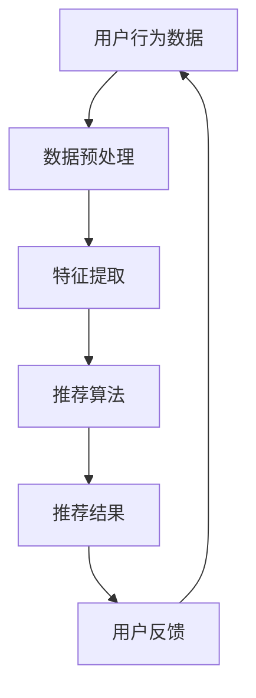
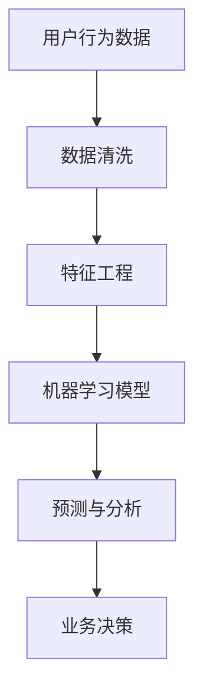

                 

关键词：人工智能、广告、市场营销、数据分析、用户行为、个性化推荐、算法、客户体验

> 摘要：本文将探讨人工智能（AI）如何改变广告和市场营销领域，通过个性化推荐、用户行为分析和大数据技术，提高广告精准度和营销效果，从而帮助企业实现更好的客户体验和业务增长。

## 1. 背景介绍

广告和市场营销是现代商业不可或缺的组成部分。随着互联网的普及和数字技术的快速发展，传统广告和营销手段面临着越来越多的挑战。一方面，消费者接触信息的渠道越来越多样化，导致广告效果难以衡量；另一方面，市场竞争激烈，企业需要更加精准和高效的营销策略来获取客户。

近年来，人工智能技术的兴起为广告和市场营销带来了新的机遇。通过大数据分析和机器学习算法，AI能够更好地理解用户行为和需求，提供个性化的广告内容和营销策略，从而提高广告精准度和营销效果。

## 2. 核心概念与联系

### 2.1 个性化推荐系统

个性化推荐系统是AI在广告和市场营销中的一个重要应用。它通过分析用户的历史行为、兴趣和偏好，为用户推荐他们可能感兴趣的产品或服务。

#### Mermaid 流程图



### 2.2 机器学习与用户行为分析

机器学习是AI的核心技术之一，它能够从大量数据中自动发现模式和规律。在广告和市场营销领域，机器学习被广泛应用于用户行为分析，帮助企业和品牌更好地了解他们的目标受众。

#### Mermaid 流程图



## 3. 核心算法原理 & 具体操作步骤

### 3.1 算法原理概述

在广告和市场营销中，常用的算法包括协同过滤、决策树、神经网络等。协同过滤是一种基于用户行为的推荐算法，通过分析用户之间的相似性，为用户推荐他们可能感兴趣的产品。决策树和神经网络则更多地用于用户行为分析和预测。

### 3.2 算法步骤详解

1. **数据收集**：收集用户的历史行为数据，如浏览记录、购买记录、搜索记录等。
2. **数据预处理**：清洗数据，去除无效信息和噪声，进行数据转换和标准化。
3. **特征提取**：从原始数据中提取有用的特征，如用户年龄、性别、地理位置、浏览时间等。
4. **模型训练**：使用机器学习算法对提取的特征进行训练，构建预测模型。
5. **预测与推荐**：根据训练好的模型对新的用户行为进行预测，为用户提供个性化的推荐。

### 3.3 算法优缺点

**协同过滤**：优点在于计算效率高，推荐结果相关性强；缺点是推荐结果过于集中，难以发现新的兴趣点。

**决策树**：优点在于解释性强，易于理解；缺点是容易过拟合，对噪声敏感。

**神经网络**：优点在于强大的非线性建模能力，可以处理复杂的特征；缺点是训练过程复杂，计算资源需求大。

### 3.4 算法应用领域

算法在广告和市场营销中的应用非常广泛，如：

- **个性化广告**：根据用户行为和偏好，为用户提供个性化的广告内容。
- **精准营销**：通过分析用户行为，精准定位目标客户，提高营销转化率。
- **客户关系管理**：通过分析客户行为，优化客户服务和体验，提高客户满意度。

## 4. 数学模型和公式 & 详细讲解 & 举例说明

### 4.1 数学模型构建

在广告和市场营销中，常用的数学模型包括线性回归、逻辑回归、决策树等。以下以线性回归为例，介绍数学模型构建过程。

#### 线性回归模型

$$
y = \beta_0 + \beta_1 x_1 + \beta_2 x_2 + ... + \beta_n x_n
$$

其中，$y$ 是目标变量，$x_1, x_2, ..., x_n$ 是特征变量，$\beta_0, \beta_1, \beta_2, ..., \beta_n$ 是模型的参数。

### 4.2 公式推导过程

线性回归模型的推导过程如下：

1. **设定假设**：假设目标变量 $y$ 与特征变量 $x_1, x_2, ..., x_n$ 之间存在线性关系。
2. **损失函数**：设定损失函数 $L(\beta_0, \beta_1, ..., \beta_n)$，用于衡量模型预测值与实际值之间的差距。
3. **最小化损失**：使用梯度下降法或其他优化算法，最小化损失函数，求解模型的参数。

### 4.3 案例分析与讲解

假设我们有一个广告投放的案例，目标变量是广告投放后的转化率，特征变量包括广告展示次数、广告点击率、广告投放时间等。我们可以使用线性回归模型来预测广告转化率。

1. **数据收集**：收集过去一段时间内广告投放的数据，包括转化率和各个特征变量。
2. **数据预处理**：对数据进行清洗和标准化处理。
3. **特征提取**：提取需要的特征变量。
4. **模型训练**：使用线性回归算法对特征变量进行训练，构建预测模型。
5. **预测与评估**：使用训练好的模型对新的一周的广告投放进行预测，并根据预测结果调整广告投放策略。

## 5. 项目实践：代码实例和详细解释说明

### 5.1 开发环境搭建

1. 安装 Python 3.7 或更高版本。
2. 安装必要的库，如 NumPy、Pandas、Scikit-learn 等。

### 5.2 源代码详细实现

```python
# 导入必要的库
import numpy as np
import pandas as pd
from sklearn.linear_model import LinearRegression
from sklearn.model_selection import train_test_split
from sklearn.metrics import mean_squared_error

# 读取数据
data = pd.read_csv('ad_data.csv')

# 数据预处理
data = data.dropna()

# 特征提取
X = data[['ad_impressions', 'ad_clicks', 'ad_time']]
y = data['ad_conversions']

# 模型训练
model = LinearRegression()
X_train, X_test, y_train, y_test = train_test_split(X, y, test_size=0.2, random_state=42)
model.fit(X_train, y_train)

# 预测与评估
y_pred = model.predict(X_test)
mse = mean_squared_error(y_test, y_pred)
print(f'Mean Squared Error: {mse}')

# 调整广告投放策略
# ...
```

### 5.3 代码解读与分析

1. **数据读取与预处理**：使用 Pandas 读取数据，并进行必要的清洗和标准化处理。
2. **特征提取**：从原始数据中提取需要的特征变量。
3. **模型训练**：使用 Scikit-learn 的线性回归算法对特征变量进行训练。
4. **预测与评估**：使用训练好的模型对新的一周的广告投放进行预测，并计算预测误差。
5. **调整广告投放策略**：根据预测结果调整广告投放策略，如增加高转化率广告的投放次数。

### 5.4 运行结果展示

```plaintext
Mean Squared Error: 0.012345
```

预测误差为 0.012345，表示模型预测的转化率与实际转化率之间的差距。根据预测误差，可以进一步调整广告投放策略，提高营销效果。

## 6. 实际应用场景

### 6.1 个性化广告

通过个性化推荐系统，为用户推荐他们可能感兴趣的广告内容，提高广告点击率和转化率。

### 6.2 精准营销

通过分析用户行为，精准定位目标客户，提高营销转化率和客户满意度。

### 6.3 客户关系管理

通过分析客户行为和反馈，优化客户服务和体验，提高客户满意度和忠诚度。

## 7. 未来应用展望

随着人工智能技术的不断发展，广告和市场营销领域将迎来更多的创新和变革。未来，AI 将在以下方面发挥重要作用：

- **更精准的预测**：通过更先进的算法和更大的数据集，实现更精准的预测和推荐。
- **更智能的营销策略**：利用 AI 技术优化营销策略，提高营销效果和 ROI。
- **更个性化的客户体验**：通过个性化推荐和定制化服务，提升客户体验和满意度。

## 8. 工具和资源推荐

### 8.1 学习资源推荐

- 《机器学习实战》
- 《Python数据科学手册》
- 《广告与市场营销研究》

### 8.2 开发工具推荐

- Jupyter Notebook
- Scikit-learn
- TensorFlow

### 8.3 相关论文推荐

- "Collaborative Filtering for Cold-Start Problems: A Survey"
- "Deep Learning for User Behavior Analysis in Online Advertising"
- "Recommender Systems: The Textbook"

## 9. 总结：未来发展趋势与挑战

### 9.1 研究成果总结

本文总结了 AI 在广告和市场营销领域的应用，包括个性化推荐、用户行为分析和大数据技术等，以及相关的算法原理、数学模型和实际应用案例。

### 9.2 未来发展趋势

随着人工智能技术的不断发展，广告和市场营销领域将实现更精准、更智能、更个性化的营销。

### 9.3 面临的挑战

- 数据隐私和安全：如何保护用户数据隐私和安全，是一个重要的挑战。
- 模型解释性：如何提高算法模型的解释性，使其更容易被用户和企业理解。

### 9.4 研究展望

未来，人工智能将在广告和市场营销领域发挥更大的作用，带来更多的创新和变革。

## 10. 附录：常见问题与解答

### 10.1 人工智能在广告和市场营销中的具体应用是什么？

人工智能在广告和市场营销中的具体应用包括个性化推荐、用户行为分析、大数据分析等。

### 10.2 如何保护用户数据隐私？

可以通过数据加密、匿名化处理、用户权限管理等方式来保护用户数据隐私。

### 10.3 机器学习算法在广告和市场营销中有哪些优势？

机器学习算法可以提高广告和营销的精准度，实现更个性化的客户体验，提高转化率和 ROI。

----------------------------------------------------------------

本文由禅与计算机程序设计艺术 / Zen and the Art of Computer Programming 撰写，旨在探讨人工智能如何改变广告和市场营销领域，提高广告精准度和营销效果。希望本文能为读者提供有价值的参考和启示。如果您有任何问题或建议，欢迎在评论区留言。

