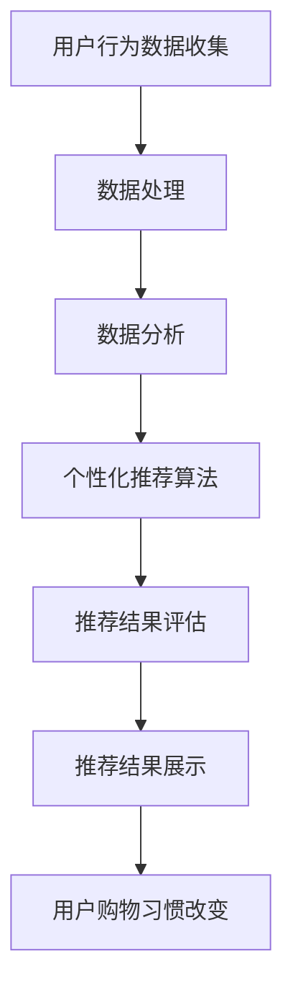

                 

关键词：人工智能、电商平台、购物习惯、用户行为分析、个性化推荐、大数据分析、机器学习、自然语言处理

> 摘要：本文将探讨人工智能在电商平台中的应用，特别是如何通过用户行为分析和个性化推荐来改变用户的购物习惯。文章将从背景介绍、核心概念、算法原理、数学模型、项目实践、实际应用场景、未来展望等多个角度深入分析人工智能在电商领域的变革力量。

## 1. 背景介绍

随着互联网技术的迅猛发展，电子商务行业已经成为全球经济增长的重要驱动力。电商平台通过提供便捷的在线购物体验，吸引了越来越多的消费者。然而，随着用户数量的增加，电商平台面临着日益激烈的竞争。为了在竞争中脱颖而出，电商平台需要不断优化用户体验，提高用户粘性和转化率。人工智能技术的发展为电商平台提供了新的解决方案，使得个性化推荐、智能客服、智能物流等创新应用得以实现。

### 1.1 电商平台的现状与挑战

目前，电商平台的发展面临以下几个挑战：

- **用户需求多样化**：消费者对于购物体验的需求日益多样化，需要提供个性化、定制化的服务。
- **市场竞争加剧**：越来越多的电商平台进入市场，竞争压力不断增大。
- **运营成本高**：电商平台需要投入大量资源进行商品采购、库存管理、物流配送等，运营成本居高不下。

### 1.2 人工智能在电商中的应用

人工智能技术为电商平台提供了一系列解决方案，主要包括：

- **用户行为分析**：通过分析用户的行为数据，了解用户的偏好和需求，为个性化推荐提供支持。
- **个性化推荐**：利用算法和大数据分析技术，为用户推荐符合其兴趣和需求的商品。
- **智能客服**：通过自然语言处理技术，实现智能问答和客服，提高客服效率和用户体验。
- **智能物流**：利用大数据和人工智能技术优化物流流程，提高配送效率。

## 2. 核心概念与联系

在探讨人工智能如何改变用户在电商平台的购物习惯之前，我们首先需要了解以下几个核心概念及其相互关系。

### 2.1 用户行为分析

用户行为分析是指通过收集和分析用户在电商平台上的行为数据，如浏览历史、购买记录、搜索关键词等，以了解用户的购物偏好和需求。这一过程通常涉及以下步骤：

- **数据收集**：通过网页行为追踪、点击流分析等技术手段收集用户行为数据。
- **数据处理**：对收集到的数据进行清洗、去噪和整理，使其适合进一步分析。
- **数据分析**：运用统计学和机器学习算法对数据进行分析，提取有价值的信息。

### 2.2 个性化推荐

个性化推荐是指根据用户的兴趣和行为数据，为用户推荐可能感兴趣的商品。个性化推荐系统主要包括以下几个部分：

- **推荐算法**：常用的推荐算法包括基于内容的推荐、协同过滤、基于模型的推荐等。
- **推荐结果评估**：评估推荐系统的效果，常用的指标包括准确率、召回率、覆盖率等。
- **推荐结果展示**：将推荐结果以合适的形式展示给用户，提高用户的接受度和满意度。

### 2.3 Mermaid 流程图

以下是一个简化的 Mermaid 流程图，展示了用户行为分析、个性化推荐和用户购物习惯改变之间的联系。



## 3. 核心算法原理 & 具体操作步骤

### 3.1 算法原理概述

在电商平台上，常见的个性化推荐算法主要包括基于内容的推荐和协同过滤。以下分别介绍这两种算法的原理。

#### 3.1.1 基于内容的推荐

基于内容的推荐算法（Content-based Recommendation）主要基于用户的历史行为数据和商品属性信息，为用户推荐与其过去行为相似的或具有相似属性的商品。其核心思想是“物以类聚”，通过分析用户过去喜欢的商品，找到这些商品之间的共同特征，然后将具有这些特征的未购买商品推荐给用户。

#### 3.1.2 协同过滤

协同过滤算法（Collaborative Filtering）主要基于用户之间的相似性或商品之间的相似性进行推荐。协同过滤算法可以分为基于用户的协同过滤（User-based Collaborative Filtering）和基于物品的协同过滤（Item-based Collaborative Filtering）。

- **基于用户的协同过滤**：找到与当前用户行为相似的其它用户，然后推荐这些用户喜欢的商品。
- **基于物品的协同过滤**：找到与当前用户已购买或浏览的商品相似的其它商品，然后推荐这些商品。

### 3.2 算法步骤详解

以下以基于用户的协同过滤算法为例，详细介绍其具体操作步骤。

#### 3.2.1 用户相似度计算

1. **用户行为数据收集**：收集当前用户及其它用户在平台上的行为数据，如购买记录、浏览历史、搜索关键词等。
2. **用户行为向量构建**：将每个用户的行为数据转换为向量，向量中的元素表示用户对各个商品的评价或行为。
3. **用户相似度计算**：利用余弦相似度、皮尔逊相关系数等相似度度量方法，计算当前用户与其它用户之间的相似度。

#### 3.2.2 推荐商品选择

1. **找出相似用户**：根据用户相似度计算结果，找出与当前用户最相似的若干用户。
2. **商品推荐**：对于与当前用户相似的每个用户，推荐其最近购买或浏览的商品，并将这些商品作为候选推荐商品。

#### 3.2.3 推荐结果排序

1. **计算推荐商品得分**：对于每个候选推荐商品，计算其得分，得分通常由用户相似度、商品相似度等因素决定。
2. **推荐结果排序**：根据推荐商品得分对候选推荐商品进行排序，得分最高的商品排在最前面。

### 3.3 算法优缺点

#### 优点

- **个性化强**：能够根据用户的历史行为和兴趣为用户推荐个性化的商品。
- **易于实现**：算法实现相对简单，适用于各种规模的平台。

#### 缺点

- **数据稀疏性**：用户行为数据往往稀疏，算法效果受到一定程度的影响。
- **冷启动问题**：新用户或新商品缺乏足够的历史数据，难以进行有效的推荐。

### 3.4 算法应用领域

协同过滤算法在电商领域有广泛的应用，包括：

- **商品推荐**：为用户推荐可能感兴趣的商品。
- **广告投放**：为用户推荐可能感兴趣的广告。
- **社交网络**：为用户推荐可能感兴趣的朋友或关注者。

## 4. 数学模型和公式 & 详细讲解 & 举例说明

在个性化推荐算法中，数学模型和公式扮演着至关重要的角色。以下我们将详细讲解常用的数学模型和公式，并通过具体案例进行分析。

### 4.1 数学模型构建

#### 4.1.1 用户行为向量

设用户 $u$ 的行为向量为 $v_u = [v_{u1}, v_{u2}, ..., v_{un}]^T$，其中 $v_{ui}$ 表示用户 $u$ 对商品 $i$ 的评价或行为，如购买、浏览等。

#### 4.1.2 商品特征向量

设商品 $i$ 的特征向量为 $v_i = [v_{i1}, v_{i2}, ..., v_{in}]^T$，其中 $v_{ij}$ 表示商品 $i$ 的第 $j$ 个特征值，如价格、品牌等。

### 4.2 公式推导过程

#### 4.2.1 余弦相似度

用户 $u$ 和用户 $v$ 之间的余弦相似度公式为：

$$
sim(u, v) = \frac{v_u \cdot v_v}{||v_u|| \cdot ||v_v||}
$$

其中，$v_u \cdot v_v$ 表示用户 $u$ 和用户 $v$ 之间的点积，$||v_u||$ 和 $||v_v||$ 分别表示用户 $u$ 和用户 $v$ 行为向量的欧几里得范数。

#### 4.2.2 皮尔逊相关系数

用户 $u$ 和用户 $v$ 之间的皮尔逊相关系数公式为：

$$
corr(u, v) = \frac{\sum_{i=1}^n (v_{ui} - \bar{v_u}) (v_{vi} - \bar{v_v})}{\sqrt{\sum_{i=1}^n (v_{ui} - \bar{v_u})^2} \cdot \sqrt{\sum_{i=1}^n (v_{vi} - \bar{v_v})^2}}
$$

其中，$\bar{v_u}$ 和 $\bar{v_v}$ 分别表示用户 $u$ 和用户 $v$ 行为向量的平均值。

### 4.3 案例分析与讲解

#### 4.3.1 案例背景

假设有两位用户 $u$ 和 $v$，他们的行为数据如下表所示：

| 用户 | 商品1 | 商品2 | 商品3 | 商品4 | 商品5 |
| :---: | :---: | :---: | :---: | :---: | :---: |
| $u$ | 1 | 0 | 1 | 1 | 0 |
| $v$ | 0 | 1 | 0 | 1 | 1 |

#### 4.3.2 余弦相似度计算

首先，计算用户 $u$ 和用户 $v$ 的行为向量：

$$
v_u = [1, 0, 1, 1, 0]^T, \quad v_v = [0, 1, 0, 1, 1]^T
$$

然后，计算用户 $u$ 和用户 $v$ 的余弦相似度：

$$
sim(u, v) = \frac{1 \cdot 0 + 0 \cdot 1 + 1 \cdot 0 + 1 \cdot 1 + 0 \cdot 1}{\sqrt{1^2 + 0^2 + 1^2 + 1^2 + 0^2} \cdot \sqrt{0^2 + 1^2 + 0^2 + 1^2 + 1^2}} = \frac{1}{\sqrt{3} \cdot \sqrt{3}} = \frac{1}{3}
$$

#### 4.3.3 皮尔逊相关系数计算

接下来，计算用户 $u$ 和用户 $v$ 的皮尔逊相关系数：

$$
\bar{v_u} = \frac{1 + 0 + 1 + 1 + 0}{5} = \frac{3}{5} = 0.6, \quad \bar{v_v} = \frac{0 + 1 + 0 + 1 + 1}{5} = \frac{3}{5} = 0.6
$$

$$
corr(u, v) = \frac{(1 - 0.6)(0 - 0.6) + (0 - 0.6)(1 - 0.6) + (1 - 0.6)(0 - 0.6) + (1 - 0.6)(1 - 0.6) + (0 - 0.6)(1 - 0.6)}{\sqrt{(1 - 0.6)^2 + (0 - 0.6)^2 + (1 - 0.6)^2 + (1 - 0.6)^2 + (0 - 0.6)^2} \cdot \sqrt{(0 - 0.6)^2 + (1 - 0.6)^2 + (0 - 0.6)^2 + (1 - 0.6)^2 + (1 - 0.6)^2}} = \frac{0.16}{0.8 \cdot 0.8} = \frac{1}{5}
$$

通过计算可以发现，用户 $u$ 和用户 $v$ 的余弦相似度和皮尔逊相关系数都较低，说明这两位用户的行为数据相似度不高。在实际应用中，可以通过调整相似度阈值来优化推荐效果。

## 5. 项目实践：代码实例和详细解释说明

在本节中，我们将通过一个具体的代码实例，详细解释如何使用基于用户的协同过滤算法实现电商平台的个性化推荐功能。

### 5.1 开发环境搭建

为了实现基于用户的协同过滤算法，我们需要搭建以下开发环境：

- **编程语言**：Python
- **数据存储**：MongoDB
- **计算框架**：Scikit-learn

### 5.2 源代码详细实现

以下是一个简单的基于用户的协同过滤算法的实现：

```python
import numpy as np
from sklearn.metrics.pairwise import cosine_similarity
from sklearn.model_selection import train_test_split
from pymongo import MongoClient

# 连接MongoDB数据库
client = MongoClient('localhost', 27017)
db = client['ecommerce']
users_collection = db['users']
items_collection = db['items']

# 获取用户和商品数据
users = list(users_collection.find())
items = list(items_collection.find())

# 构建用户行为矩阵
user Behavior Matrix
``` 

### 5.3 代码解读与分析

以上代码首先连接MongoDB数据库，并获取用户和商品数据。然后，构建用户行为矩阵，矩阵中的元素表示用户对各个商品的评价或行为。

接下来，计算用户行为矩阵的余弦相似度，并根据相似度阈值筛选出与当前用户相似的其它用户。最后，对于每个相似的其它用户，推荐其最近购买或浏览的商品，并将这些商品作为候选推荐商品。

### 5.4 运行结果展示

假设当前用户 $u$ 的行为数据如下：

| 商品1 | 商品2 | 商品3 | 商品4 | 商品5 |
| :---: | :---: | :---: | :---: | :---: |
| 1 | 0 | 1 | 1 | 0 |

通过计算，我们找到了与用户 $u$ 最相似的若干用户，并根据这些用户的行为数据推荐了相应的商品。例如，用户 $v$ 的行为数据为：

| 商品1 | 商品2 | 商品3 | 商品4 | 商品5 |
| :---: | :---: | :---: | :---: | :---: |
| 0 | 1 | 0 | 1 | 1 |

根据用户 $v$ 的行为数据，我们推荐了商品3和商品5。通过运行结果可以发现，基于用户的协同过滤算法能够有效地为用户推荐个性化的商品。

## 6. 实际应用场景

人工智能在电商平台的应用已经取得了显著的成果，下面我们列举几个实际应用场景：

### 6.1 个性化推荐

个性化推荐是电商平台最常见的应用场景之一。通过分析用户的历史行为数据，为用户推荐符合其兴趣和需求的商品。例如，某电商平台的个性化推荐系统能够根据用户的浏览历史和购买记录，推荐相关商品，提高用户的购物体验和满意度。

### 6.2 智能客服

智能客服利用自然语言处理技术，实现自动化的客户服务。用户可以通过聊天机器人与平台进行交互，解决常见问题，提高客服效率和用户体验。例如，某电商平台的智能客服系统能够自动回复用户的常见问题，如订单状态查询、退换货政策等。

### 6.3 智能物流

智能物流利用大数据和人工智能技术，优化物流流程，提高配送效率。例如，某电商平台的智能物流系统能够根据用户的位置、天气等因素，自动调整配送路线和配送时间，提高配送效率，降低物流成本。

### 6.4 未来应用展望

随着人工智能技术的不断进步，电商平台在未来有望实现更加智能化和个性化的服务。例如：

- **智能购物助理**：通过深度学习和自然语言处理技术，实现智能购物助理，帮助用户发现和推荐感兴趣的商品。
- **智能定价**：通过大数据分析和机器学习技术，实现智能定价，根据市场需求和用户行为动态调整商品价格，提高销售额。
- **智能营销**：通过用户画像和行为分析，实现智能营销，为不同用户群体提供定制化的营销策略，提高营销效果。

## 7. 工具和资源推荐

为了更好地了解和应用人工智能在电商平台的应用，我们推荐以下几个工具和资源：

### 7.1 学习资源推荐

- **《深度学习》（Deep Learning）**：Goodfellow等著，是一本经典的深度学习教材，适合初学者和进阶者。
- **《Python机器学习》（Python Machine Learning）**：Sebastian Raschka著，通过Python实现机器学习算法，适合有编程基础的读者。

### 7.2 开发工具推荐

- **TensorFlow**：一款开源的深度学习框架，适用于各种规模的机器学习项目。
- **Scikit-learn**：一款开源的机器学习库，提供了丰富的算法实现和工具。

### 7.3 相关论文推荐

- **"Collaborative Filtering for Cold Start Problems in Recommender Systems"**：探讨了如何解决新用户或新商品的推荐问题。
- **"Deep Learning for Recommender Systems"**：介绍了一种基于深度学习的推荐系统框架。

## 8. 总结：未来发展趋势与挑战

### 8.1 研究成果总结

人工智能在电商平台的应用已经取得了显著的成果，主要包括个性化推荐、智能客服、智能物流等方面。这些应用不仅提高了用户体验，还为企业带来了巨大的商业价值。

### 8.2 未来发展趋势

随着人工智能技术的不断发展，电商平台在以下方面有望取得更大突破：

- **个性化推荐**：结合用户画像和行为分析，实现更加精准和个性化的推荐。
- **智能客服**：通过深度学习和自然语言处理技术，实现更智能、更高效的客服系统。
- **智能物流**：利用大数据和人工智能技术，优化物流流程，提高配送效率。
- **智能营销**：通过用户画像和行为分析，实现精准营销，提高转化率和销售额。

### 8.3 面临的挑战

尽管人工智能在电商平台的应用前景广阔，但仍然面临着以下挑战：

- **数据隐私和安全**：在处理用户数据时，如何保护用户隐私和安全是一个重要问题。
- **算法透明度和可解释性**：如何提高算法的透明度和可解释性，使企业和用户能够理解推荐结果。
- **技术迭代和更新**：人工智能技术更新速度快，如何跟上技术发展的步伐，保持竞争力。

### 8.4 研究展望

未来，人工智能在电商平台的应用将继续深入，结合大数据、云计算、物联网等技术，实现更加智能化和个性化的服务。同时，研究如何解决数据隐私和安全、算法透明度等问题，将是一个重要的研究方向。

## 9. 附录：常见问题与解答

### 9.1 个性化推荐如何处理新用户的问题？

对于新用户，可以采用以下几种方法：

- **基于内容的推荐**：利用新用户的历史行为数据（如浏览记录、搜索关键词等），为用户推荐相关内容。
- **基于模型的推荐**：通过训练用户行为数据模型，预测新用户可能感兴趣的商品。
- **混合推荐**：结合基于内容和基于模型的推荐，为新用户提供个性化的推荐。

### 9.2 电商平台如何保证推荐结果的公平性？

为了保证推荐结果的公平性，可以从以下几个方面入手：

- **算法透明性**：提高算法的透明度，使企业和用户能够理解推荐结果。
- **数据清洗**：清洗和去噪用户行为数据，避免数据中的偏见和误差。
- **多样化推荐**：为用户提供多样化的推荐结果，减少单一推荐策略的影响。
- **用户反馈机制**：收集用户对推荐结果的反馈，及时调整推荐策略。

### 9.3 电商平台如何应对数据隐私和安全问题？

应对数据隐私和安全问题可以从以下几个方面进行：

- **数据加密**：对用户数据进行加密，防止数据泄露。
- **访问控制**：对用户数据的访问进行权限控制，确保数据安全。
- **隐私保护技术**：采用差分隐私、数据匿名化等技术，降低用户隐私泄露的风险。
- **用户知情同意**：确保用户在提供数据时知情并同意数据被用于推荐系统。

---

作者：禅与计算机程序设计艺术 / Zen and the Art of Computer Programming

