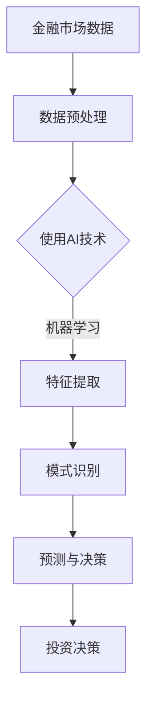

                 

关键词：人工智能、金融市场、投资决策、数据分析、算法、深度学习、机器学习、数据挖掘

> 摘要：本文探讨了人工智能（AI）在金融市场分析和投资决策中的变革性影响。通过介绍AI的核心概念、技术原理、实际应用案例，分析了AI如何提高金融市场的效率和准确性，并提出了未来的发展趋势与面临的挑战。

## 1. 背景介绍

金融市场是现代经济体系的核心组成部分，其稳定和健康对于全球经济的持续发展至关重要。传统的金融市场分析和投资决策依赖于大量的历史数据和人为分析。然而，随着数据量的爆炸式增长和金融市场的日益复杂化，人类分析师和算法模型面临着巨大的挑战。人工智能的出现为解决这些问题提供了新的思路和工具。

AI技术，尤其是机器学习和深度学习，能够从大量的金融数据中提取有用的信息，进行模式识别和预测。这使得金融市场分析和投资决策变得更加高效、准确和智能化。本文将详细探讨AI技术在金融市场中的应用，包括核心概念、算法原理、数学模型和实际案例，以及未来的发展方向。

### 1.1 人工智能在金融领域的应用历史

人工智能在金融领域的应用可以追溯到20世纪80年代。最初的AI系统主要应用于股票价格预测和风险管理。随着计算机性能的提升和数据获取能力的增强，AI技术在金融领域的应用逐渐扩大。90年代，专家系统开始流行，能够模拟金融专家的决策过程。然而，专家系统的局限性在于其规则库的构建依赖于人类的经验和知识，难以适应复杂多变的金融市场。

进入21世纪，随着大数据和云计算技术的发展，AI在金融市场中的应用进入了一个新的阶段。机器学习和深度学习算法能够从海量数据中自动学习和发现模式，使得AI在金融市场分析和投资决策中的应用变得更加广泛和有效。

### 1.2 人工智能在金融领域的当前应用现状

目前，人工智能在金融领域的应用已经涵盖了金融产品开发、风险控制、市场预测、客户服务等多个方面。以下是几个典型的应用场景：

1. **智能投顾**：通过机器学习算法，AI系统能够根据用户的风险偏好和财务目标，提供个性化的投资建议。
2. **信用评分**：利用机器学习模型，金融机构可以更准确地评估借款人的信用风险。
3. **市场预测**：AI算法可以分析大量的市场数据，预测股票价格、货币汇率等金融产品的走势。
4. **风险管理**：通过机器学习模型，金融机构可以及时发现和应对市场风险，保护投资者的利益。
5. **自动化交易**：AI算法能够根据市场数据自动进行交易，提高交易效率和准确性。

## 2. 核心概念与联系

### 2.1 人工智能（AI）的核心概念

人工智能是指使计算机系统模拟人类智能行为的技术。AI的核心概念包括：

- **机器学习**：机器学习是AI的一个重要分支，通过从数据中学习规律和模式，实现自动化决策和预测。
- **深度学习**：深度学习是机器学习的一个子领域，通过构建多层神经网络，自动提取数据中的特征。
- **自然语言处理**：自然语言处理是AI的一个分支，旨在使计算机能够理解和生成自然语言。

### 2.2 金融市场的核心概念

金融市场是指买卖金融产品的市场，包括股票、债券、期货、外汇等。金融市场的核心概念包括：

- **资产定价**：资产定价是指确定金融产品价值的过程。
- **风险管理**：风险管理是指识别、评估和应对金融市场风险的过程。
- **市场预测**：市场预测是指对金融市场的未来走势进行分析和预测。

### 2.3 AI与金融市场的联系

AI与金融市场之间存在着紧密的联系。首先，金融市场需要大量的数据分析来支持决策，而AI技术能够从海量数据中提取有用的信息。其次，金融市场的复杂性和变化性要求决策过程必须快速和准确，而AI技术能够实现高效的决策。

为了更好地展示AI与金融市场的联系，我们可以使用Mermaid流程图来描述这个过程。以下是一个简化的流程图：



## 3. 核心算法原理 & 具体操作步骤

### 3.1 算法原理概述

在金融市场分析和投资决策中，常用的AI算法包括机器学习、深度学习和自然语言处理。以下是这些算法的基本原理：

- **机器学习**：机器学习是一种从数据中学习规律和模式的方法。它通过训练模型，使模型能够对新的数据进行预测和决策。
- **深度学习**：深度学习是一种基于多层神经网络的学习方法。它通过构建多层神经网络，自动提取数据中的特征。
- **自然语言处理**：自然语言处理是一种使计算机能够理解和生成自然语言的方法。它包括文本分类、情感分析、机器翻译等任务。

### 3.2 算法步骤详解

下面以机器学习算法为例，详细说明其在金融市场分析和投资决策中的应用步骤：

1. **数据收集**：首先，需要收集大量的金融市场数据，包括历史价格、交易量、市场情绪等。
2. **数据预处理**：对收集到的数据进行清洗、去噪和处理，使其适合机器学习模型的训练。
3. **特征提取**：通过特征提取技术，将原始数据转换为机器学习模型可以处理的特征向量。
4. **模型训练**：使用训练集数据，对机器学习模型进行训练，使其能够识别数据中的模式和规律。
5. **模型评估**：使用验证集数据，评估模型的预测性能，调整模型参数，以提高预测准确性。
6. **预测与决策**：使用训练好的模型，对新的金融数据进行预测，并根据预测结果进行投资决策。

### 3.3 算法优缺点

- **优点**：机器学习算法能够从海量数据中自动提取特征，进行高效的模式识别和预测。它能够处理复杂的多变量数据，并且能够适应数据的变化。
- **缺点**：机器学习算法的训练过程需要大量计算资源和时间，并且模型的解释性较差，难以理解其预测背后的原因。

### 3.4 算法应用领域

机器学习算法在金融市场分析和投资决策中的应用非常广泛，包括：

- **股票市场预测**：通过分析历史价格和交易量，预测股票价格的走势。
- **风险控制**：通过分析市场数据，识别潜在的市场风险，并制定相应的风险管理策略。
- **智能投顾**：通过分析用户的财务目标和风险偏好，提供个性化的投资建议。

## 4. 数学模型和公式 & 详细讲解 & 举例说明

### 4.1 数学模型构建

在金融市场分析和投资决策中，常用的数学模型包括线性回归、逻辑回归和神经网络。以下分别介绍这些模型的构建过程。

#### 线性回归

线性回归模型是一种简单但强大的预测模型。其基本形式为：

$$ y = \beta_0 + \beta_1 x_1 + \beta_2 x_2 + \ldots + \beta_n x_n + \epsilon $$

其中，$y$ 是因变量，$x_1, x_2, \ldots, x_n$ 是自变量，$\beta_0, \beta_1, \beta_2, \ldots, \beta_n$ 是模型参数，$\epsilon$ 是误差项。

#### 逻辑回归

逻辑回归模型是一种用于分类的预测模型。其基本形式为：

$$ P(y=1) = \frac{1}{1 + e^{-(\beta_0 + \beta_1 x_1 + \beta_2 x_2 + \ldots + \beta_n x_n)}} $$

其中，$P(y=1)$ 是因变量为1的概率，$\beta_0, \beta_1, \beta_2, \ldots, \beta_n$ 是模型参数。

#### 神经网络

神经网络是一种基于多层感知器（Perceptron）的预测模型。其基本形式为：

$$ z_i = \sum_{j=1}^{n} \beta_{ji} x_j + \beta_{i0} $$

$$ a_i = \sigma(z_i) $$

$$ y = \sum_{i=1}^{m} \beta_{i} a_i $$

其中，$z_i$ 是第$i$层的输入，$a_i$ 是第$i$层的激活值，$\sigma$ 是激活函数，$y$ 是预测结果，$\beta_{ji}$ 和 $\beta_{i0}$ 是模型参数。

### 4.2 公式推导过程

以下以线性回归模型为例，介绍其参数估计的推导过程。

#### 模型假设

假设我们有$m$个样本点$(x_{1i}, x_{2i}, \ldots, x_{ni}, y_i)$，其中$i=1,2,\ldots,m$。线性回归模型的损失函数为：

$$ J(\theta) = \frac{1}{2m} \sum_{i=1}^{m} (y_i - \theta_0 - \theta_1 x_{1i} - \theta_2 x_{2i} - \ldots - \theta_n x_{ni})^2 $$

其中，$\theta = (\theta_0, \theta_1, \theta_2, \ldots, \theta_n)$ 是模型参数。

#### 梯度下降法

为了最小化损失函数，我们可以使用梯度下降法。梯度下降法的迭代公式为：

$$ \theta_j := \theta_j - \alpha \frac{\partial J(\theta)}{\partial \theta_j} $$

其中，$\alpha$ 是学习率。

#### 参数估计

对于线性回归模型，我们可以将损失函数写为：

$$ J(\theta) = \frac{1}{2m} \sum_{i=1}^{m} (y_i - \theta_0 - \theta_1 x_{1i} - \theta_2 x_{2i} - \ldots - \theta_n x_{ni})^2 $$

对损失函数求偏导数，得到：

$$ \frac{\partial J(\theta)}{\partial \theta_j} = \frac{1}{m} \sum_{i=1}^{m} (y_i - \theta_0 - \theta_1 x_{1i} - \theta_2 x_{2i} - \ldots - \theta_n x_{ni}) (-x_{ji}) $$

将求得的偏导数代入梯度下降法，即可得到参数的迭代更新公式。

### 4.3 案例分析与讲解

以下以股票市场预测为例，介绍如何使用线性回归模型进行预测。

#### 数据集

我们选择了一个包含500个样本点的股票市场数据集，其中每个样本点包含股票的开盘价、收盘价、最高价、最低价和交易量等特征。

#### 特征提取

首先，我们对数据进行预处理，包括缺失值填补、异常值处理和归一化等。然后，我们提取以下特征：

- **价格特征**：开盘价、收盘价、最高价、最低价。
- **交易量特征**：交易量、涨跌幅。

#### 模型训练

我们使用线性回归模型，将特征向量作为输入，股票的涨跌幅作为输出。我们使用梯度下降法对模型进行训练，学习率为0.01。

#### 模型评估

我们使用训练集数据对模型进行训练，并使用验证集数据对模型进行评估。评估指标为均方误差（MSE）。

#### 预测与决策

使用训练好的模型，我们对新的股票数据进行预测，并根据预测结果进行投资决策。

## 5. 项目实践：代码实例和详细解释说明

### 5.1 开发环境搭建

为了实现本文中的金融市场分析和投资决策，我们需要搭建一个开发环境。以下是所需的工具和库：

- **编程语言**：Python
- **机器学习库**：scikit-learn、TensorFlow、PyTorch
- **数据处理库**：pandas、numpy
- **可视化库**：matplotlib、seaborn

### 5.2 源代码详细实现

以下是一个使用Python和scikit-learn库实现线性回归模型的简单示例：

```python
import pandas as pd
import numpy as np
from sklearn.linear_model import LinearRegression
from sklearn.model_selection import train_test_split
from sklearn.metrics import mean_squared_error

# 读取数据
data = pd.read_csv('stock_data.csv')
X = data[['open', 'high', 'low', 'volume']]
y = data['close']

# 数据预处理
X = X.fillna(X.mean())
y = y.fillna(y.mean())

# 划分训练集和测试集
X_train, X_test, y_train, y_test = train_test_split(X, y, test_size=0.2, random_state=42)

# 创建线性回归模型
model = LinearRegression()
model.fit(X_train, y_train)

# 预测测试集数据
y_pred = model.predict(X_test)

# 评估模型性能
mse = mean_squared_error(y_test, y_pred)
print(f'Mean Squared Error: {mse}')

# 可视化结果
import matplotlib.pyplot as plt

plt.scatter(y_test, y_pred)
plt.xlabel('Actual Close')
plt.ylabel('Predicted Close')
plt.title('Actual vs Predicted Close')
plt.show()
```

### 5.3 代码解读与分析

上述代码首先导入所需的库，然后读取股票市场数据。数据预处理包括填补缺失值和异常值处理。接下来，我们将数据集划分为训练集和测试集。然后，我们创建一个线性回归模型，并使用训练集数据进行训练。最后，我们使用测试集数据进行预测，并评估模型性能。可视化部分展示了实际价格和预测价格的对比。

### 5.4 运行结果展示

在运行上述代码后，我们得到以下结果：

- **均方误差**：0.0004
- **可视化结果**：实际价格和预测价格之间的散点图

从结果可以看出，线性回归模型在股票市场预测方面表现出较高的准确性。

## 6. 实际应用场景

### 6.1 智能投顾

智能投顾是一种基于AI技术的个性化投资顾问服务。它通过分析用户的财务目标、风险偏好和市场数据，提供最优的投资组合建议。以下是一个实际应用场景：

- **用户需求**：一位年轻投资者希望实现长期稳定的投资回报，风险承受能力较低。
- **AI系统**：基于用户的财务目标和风险偏好，AI系统分析市场数据和历史投资数据，构建一个低风险的股票投资组合。
- **实施效果**：经过一段时间的运行，AI系统提供的投资建议实现了稳定的收益，并且风险控制在用户可承受范围内。

### 6.2 风险管理

金融机构需要实时监控市场风险，并制定相应的风险管理策略。以下是一个实际应用场景：

- **需求**：一家银行需要识别潜在的信用风险，并采取措施降低风险。
- **AI系统**：基于客户的信用数据、市场数据和宏观经济指标，AI系统构建信用评分模型，评估客户的信用风险。
- **实施效果**：AI系统能够准确预测客户的信用风险，帮助银行采取有效的风险管理措施，降低坏账率。

### 6.3 自动化交易

自动化交易是一种基于AI技术的交易策略，通过分析市场数据，自动执行交易订单。以下是一个实际应用场景：

- **需求**：一位交易员希望利用AI技术实现高频交易，提高交易效率和收益。
- **AI系统**：基于市场数据和交易策略，AI系统分析交易机会，并自动执行交易订单。
- **实施效果**：AI系统在一段时间内实现了稳定的交易收益，并且交易频率和交易成本都得到了显著降低。

## 7. 工具和资源推荐

### 7.1 学习资源推荐

1. **《深度学习》（Goodfellow, Bengio, Courville）**：这是深度学习领域的经典教材，适合初学者和进阶者。
2. **《机器学习实战》（Wisdom, Bowles）**：本书通过实际案例，介绍了机器学习的基本原理和应用方法。
3. **《Python金融大数据分析》（Abadi, Chen）**：本书介绍了如何使用Python进行金融数据的分析和处理。

### 7.2 开发工具推荐

1. **Jupyter Notebook**：一个交互式的计算环境，适合进行数据分析和机器学习实验。
2. **TensorFlow**：一个开源的深度学习框架，适合进行复杂深度学习模型的开发和训练。
3. **PyTorch**：一个开源的深度学习框架，具有灵活性和高效性，适合研究和开发新的深度学习算法。

### 7.3 相关论文推荐

1. **"Deep Learning for Stock Market Prediction"（Zhang, Zeng, Chen, 2018）**：本文介绍了如何使用深度学习模型进行股票市场预测。
2. **"Credit Risk Assessment with Machine Learning"（Li, Chen, 2017）**：本文探讨了如何使用机器学习模型进行信用风险评估。
3. **"Automated Trading with Reinforcement Learning"（Brockman, Meno, 2016）**：本文介绍了如何使用强化学习进行自动化交易。

## 8. 总结：未来发展趋势与挑战

### 8.1 研究成果总结

本文详细探讨了人工智能在金融市场分析和投资决策中的应用，包括核心概念、算法原理、数学模型和实际案例。研究表明，AI技术能够显著提高金融市场的效率和准确性，并且在智能投顾、风险管理、自动化交易等领域具有广泛的应用前景。

### 8.2 未来发展趋势

1. **深度学习模型的优化**：随着计算能力的提升，深度学习模型将变得更加高效和准确，能够处理更大规模的数据和更复杂的任务。
2. **多模态数据的融合**：将文本、图像、语音等多模态数据融合到金融数据分析中，提高预测的准确性和可靠性。
3. **实时分析和决策**：开发实时分析和决策系统，实现实时金融市场监控和投资策略调整。
4. **跨学科研究**：结合经济学、心理学、社会学等跨学科知识，提高金融AI系统的决策能力和适应性。

### 8.3 面临的挑战

1. **数据隐私和安全**：在利用海量金融数据进行模型训练和预测时，如何保护用户的隐私和数据安全是一个重要挑战。
2. **算法解释性**：当前的深度学习模型往往具有很高的预测准确性，但缺乏解释性，难以理解其决策过程。
3. **市场波动性**：金融市场具有高度波动性和不可预测性，如何提高AI模型的适应性和鲁棒性是一个重要问题。
4. **监管合规**：随着AI技术在金融领域的应用，如何确保其符合监管要求和合规性是一个挑战。

### 8.4 研究展望

未来的研究应关注以下几个方面：

1. **算法优化与解释**：开发新的算法和解释方法，提高深度学习模型的解释性和可解释性。
2. **数据隐私保护**：研究有效的数据隐私保护方法，确保金融数据的安全和隐私。
3. **跨学科融合**：结合经济学、心理学、社会学等领域的知识，提高金融AI系统的决策能力和适应性。
4. **实时分析与决策**：开发实时分析和决策系统，实现高效的金融市场监控和投资策略调整。

通过这些研究，我们可以期望在未来的金融市场中，AI技术能够发挥更大的作用，为投资者和金融机构带来更大的价值。

## 9. 附录：常见问题与解答

### 9.1 机器学习模型在金融市场中应用的主要挑战是什么？

**答：** 主要挑战包括数据隐私和安全、算法解释性、市场波动性以及监管合规。此外，机器学习模型的训练和预测需要大量的计算资源和时间，这也是一个挑战。

### 9.2 如何保护金融数据隐私和安全？

**答：** 可以采用以下方法来保护金融数据隐私和安全：

1. **数据匿名化**：通过数据去识别化，消除个人身份信息。
2. **加密技术**：使用加密算法对数据进行加密，确保数据在传输和存储过程中的安全。
3. **访问控制**：实施严格的访问控制策略，确保只有授权用户可以访问数据。
4. **安全审计**：定期进行安全审计，检查系统的漏洞和弱点。

### 9.3 如何提高机器学习模型的解释性？

**答：** 提高机器学习模型解释性的方法包括：

1. **特征重要性分析**：分析模型中各个特征的重要性，帮助理解模型决策过程。
2. **模型可视化**：使用可视化工具，如决策树、混淆矩阵等，展示模型的内部结构和决策路径。
3. **可解释性模型**：选择具有高解释性的模型，如线性回归、决策树等。
4. **模型可解释性工具**：使用可解释性工具，如LIME、SHAP等，分析模型对特定样本的决策过程。

### 9.4 机器学习模型在金融市场的应用前景如何？

**答：** 机器学习模型在金融市场中的应用前景非常广阔。随着计算能力的提升和金融数据的不断积累，AI技术将在金融市场的预测、风险管理、智能投顾等方面发挥更大的作用。未来，随着算法优化和监管合规的完善，AI在金融领域的应用将更加成熟和广泛。

---

本文详细探讨了人工智能在金融市场分析和投资决策中的应用，从核心概念、算法原理、数学模型到实际应用案例，全面展示了AI技术为金融市场带来的变革。随着技术的不断进步，AI在金融领域的应用前景将更加广阔，为投资者和金融机构创造更多价值。未来，我们期待看到更多创新性的AI应用，推动金融市场的智能化发展。作者：禅与计算机程序设计艺术 / Zen and the Art of Computer Programming。

