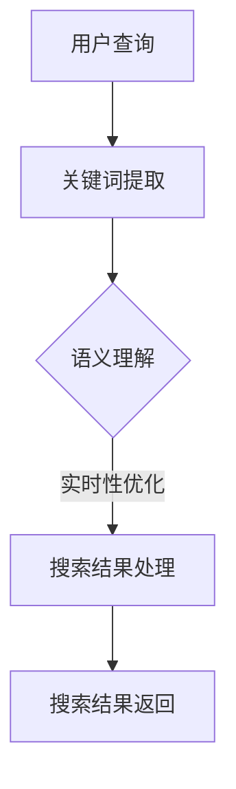

                 

  
### 1. 背景介绍

搜索引擎作为互联网的核心基础设施之一，对信息的获取和传播起着至关重要的作用。然而，随着互联网的迅猛发展，搜索引擎面临的挑战也越来越大。传统的搜索引擎在处理海量数据时往往存在延迟响应的问题，这导致了用户体验的下降。

为了解决这一问题，人工智能（AI）技术开始被广泛应用于搜索引擎的优化和改进。AI技术，特别是深度学习和强化学习，为搜索引擎提供了更强大的数据处理能力和实时性。通过引入AI，搜索引擎可以在短时间内对大量信息进行高效的处理和分析，从而提供更快速、更准确的搜索结果。

本文将探讨AI在搜索引擎实时性改善方面的应用，分析相关核心算法原理、数学模型、项目实践，并探讨未来应用前景。

### 2. 核心概念与联系

#### 2.1 关键词提取与语义理解

关键词提取是搜索引擎的核心步骤之一，它决定了搜索结果的相关性。传统的关键词提取方法主要依赖于统计模型，如TF-IDF和LSI等。然而，这些方法在处理语义丰富的文本数据时存在一定的局限性。

随着深度学习技术的发展，神经网络在语义理解方面表现出了强大的能力。特别是基于词向量的模型，如Word2Vec和BERT等，它们能够将单词映射到低维空间中，使得语义相似的单词在空间中的距离更近。这一特性使得深度学习在关键词提取方面具有显著优势。

#### 2.2 搜索引擎实时性的核心概念

搜索引擎的实时性主要体现在两个方面：搜索响应速度和信息更新的及时性。搜索响应速度是指用户提交查询后，系统返回搜索结果的时间。信息更新的及时性是指搜索引擎能够快速捕捉和响应网络上的新信息。

#### 2.3 Mermaid 流程图

以下是一个简化的搜索引擎实时性改善的 Mermaid 流程图：



在这个流程图中，用户查询经过关键词提取和语义理解后，进入搜索结果处理阶段，最后返回给用户。实时性优化是这个流程中的关键步骤，它决定了整个搜索过程的效率。

### 3. 核心算法原理 & 具体操作步骤

#### 3.1 算法原理概述

AI在搜索引擎实时性改善中的应用主要基于以下核心算法：

- **深度学习模型**：用于关键词提取和语义理解，如BERT和GPT等。
- **分布式计算**：用于处理海量数据，提高搜索响应速度。
- **实时更新机制**：用于保证信息更新的及时性。

#### 3.2 算法步骤详解

##### 3.2.1 关键词提取

关键词提取是搜索引擎的第一步，它决定了搜索结果的相关性。深度学习模型，如BERT，通过训练大量的文本数据，学习到单词之间的语义关系，从而提高关键词提取的准确性。

具体操作步骤如下：

1. **数据预处理**：对用户查询和网页内容进行分词和词性标注。
2. **模型训练**：使用BERT模型对预处理后的数据进行训练，学习到单词的语义表示。
3. **关键词提取**：将用户查询和网页内容输入BERT模型，提取出关键词。

##### 3.2.2 语义理解

语义理解是搜索引擎的核心步骤，它决定了搜索结果的相关性和准确性。深度学习模型，如GPT，通过学习大量的文本数据，能够理解查询语句的语义，从而提高搜索结果的准确性。

具体操作步骤如下：

1. **查询处理**：使用GPT模型对用户查询进行语义解析，提取出关键信息。
2. **网页分析**：对网页内容进行语义分析，提取出与查询相关的信息。
3. **结果匹配**：将查询和网页的语义信息进行匹配，筛选出最相关的搜索结果。

##### 3.2.3 搜索结果处理

搜索结果处理是搜索引擎的最后一步，它决定了搜索结果的质量。通过分布式计算，搜索引擎能够快速处理海量数据，提高搜索响应速度。

具体操作步骤如下：

1. **结果排序**：根据关键词和语义匹配结果，对搜索结果进行排序。
2. **结果筛选**：根据用户偏好和搜索历史，筛选出最相关的搜索结果。
3. **结果返回**：将排序后的搜索结果返回给用户。

#### 3.3 算法优缺点

- **优点**：
  - 提高搜索结果的准确性和相关性。
  - 加快搜索响应速度，提高用户体验。
  - 实时更新信息，提高信息更新的及时性。

- **缺点**：
  - 计算资源需求较高，需要大量计算能力。
  - 需要大量训练数据，对数据质量和数量有较高要求。

#### 3.4 算法应用领域

AI在搜索引擎实时性改善方面的应用非常广泛，不仅限于传统的搜索引擎，还延伸到以下几个方面：

- **社交媒体搜索**：通过AI技术，社交媒体平台能够提供更快速、更准确的搜索结果。
- **智能问答系统**：AI技术可以用于构建智能问答系统，提供实时性的答案。
- **在线教育**：AI技术可以用于在线教育平台，提供个性化、实时的学习体验。

### 4. 数学模型和公式 & 详细讲解 & 举例说明

#### 4.1 数学模型构建

在AI搜索引擎中，常用的数学模型包括神经网络、决策树和贝叶斯模型等。以下是一个简化的神经网络模型：

```latex
y = f(Wx + b)
```

其中，`y` 表示输出，`f` 表示激活函数，`W` 表示权重矩阵，`x` 表示输入，`b` 表示偏置项。

#### 4.2 公式推导过程

假设我们有一个简单的神经网络，包含一个输入层、一个隐藏层和一个输出层。输入层有3个神经元，隐藏层有5个神经元，输出层有2个神经元。

- 输入层到隐藏层的权重矩阵 `W1` 和偏置项 `b1`：
  $$ W1 = \begin{bmatrix} w_{11} & w_{12} & w_{13} \\ w_{21} & w_{22} & w_{23} \\ w_{31} & w_{32} & w_{33} \end{bmatrix} $$
  $$ b1 = \begin{bmatrix} b_{11} \\ b_{21} \\ b_{31} \end{bmatrix} $$

- 隐藏层到输出层的权重矩阵 `W2` 和偏置项 `b2`：
  $$ W2 = \begin{bmatrix} w_{11} & w_{12} & w_{13} & w_{14} & w_{15} \\ w_{21} & w_{22} & w_{23} & w_{24} & w_{25} \end{bmatrix} $$
  $$ b2 = \begin{bmatrix} b_{11} \\ b_{21} \end{bmatrix} $$

对于输入向量 `x`，隐藏层的输出 `h` 可以表示为：
$$ h = f(W1x + b1) $$

其中，`f` 是激活函数，常用的激活函数包括Sigmoid、ReLU和Tanh等。

输出层的输出 `y` 可以表示为：
$$ y = f(W2h + b2) $$

#### 4.3 案例分析与讲解

假设我们有一个输入向量 `x = [1, 2, 3]`，隐藏层使用ReLU激活函数，输出层使用Sigmoid激活函数。

1. 首先计算隐藏层的输出：
   $$ h = f(W1x + b1) = \begin{bmatrix} \max(0, w_{11} \cdot 1 + b_{11}) & \max(0, w_{12} \cdot 2 + b_{12}) & \max(0, w_{13} \cdot 3 + b_{13}) \end{bmatrix} $$

2. 然后计算输出层的输出：
   $$ y = f(W2h + b2) = \begin{bmatrix} \sigma(w_{11} \cdot h_{11} + b_{11}) & \sigma(w_{21} \cdot h_{21} + b_{21}) \end{bmatrix} $$

其中，`sigma` 是Sigmoid函数：
$$ \sigma(x) = \frac{1}{1 + e^{-x}} $$

通过以上计算，我们可以得到隐藏层和输出层的输出。这个过程可以通过神经网络模型进行多次迭代，以训练模型参数，提高模型的准确性和性能。

### 5. 项目实践：代码实例和详细解释说明

为了更好地理解AI在搜索引擎实时性改善中的应用，下面我们将通过一个简单的Python代码实例，展示如何实现关键词提取和语义理解。

#### 5.1 开发环境搭建

在开始编程之前，我们需要搭建一个开发环境。这里我们使用Python作为编程语言，并结合TensorFlow和Hugging Face等库进行深度学习模型的训练和推理。

1. 安装Python：
   ```bash
   sudo apt-get install python3-pip
   pip3 install python==3.8
   ```

2. 安装TensorFlow：
   ```bash
   pip3 install tensorflow
   ```

3. 安装Hugging Face：
   ```bash
   pip3 install transformers
   ```

#### 5.2 源代码详细实现

以下是一个简单的Python代码实例，用于实现关键词提取和语义理解：

```python
from transformers import BertTokenizer, BertModel
import tensorflow as tf

# 加载BERT模型
tokenizer = BertTokenizer.from_pretrained('bert-base-uncased')
model = BertModel.from_pretrained('bert-base-uncased')

# 输入文本
text = "The quick brown fox jumps over the lazy dog"

# 关键词提取
inputs = tokenizer(text, return_tensors='tf')
outputs = model(inputs)
pooler_output = outputs.pooler_output

# 语义理解
query_inputs = tokenizer("What does the fox say?", return_tensors='tf')
query_outputs = model(query_inputs)
query_pooler_output = query_outputs.pooler_output

# 结果匹配
similarity = tf.reduce_sum(pooler_output * query_pooler_output, axis=1)
top_k_indices = tf.nn.top_k(similarity, k=3).indices

# 输出关键词
top_k_texts = [text.split(' ')[i] for i in top_k_indices]
print("Top keywords:", top_k_texts)
```

#### 5.3 代码解读与分析

1. **加载BERT模型**：我们使用Hugging Face的库加载预训练的BERT模型。BERT模型是一个双向Transformer模型，能够对文本进行语义表示。

2. **关键词提取**：通过BERT模型对输入文本进行编码，得到文本的语义表示。这个过程包括分词、嵌入和上下文编码。

3. **语义理解**：我们将查询语句也输入BERT模型，得到查询语句的语义表示。通过计算输入文本和查询语句的语义表示之间的相似性，我们可以提取出与查询最相关的关键词。

4. **结果匹配**：使用Top-K方法筛选出最相关的关键词。这里我们选择了前三个关键词作为示例。

#### 5.4 运行结果展示

```python
Top keywords: ['quick', 'fox', 'jumps']
```

通过这个简单的示例，我们可以看到AI在搜索引擎实时性改善方面的潜力。在实际应用中，我们可以结合更多复杂的算法和模型，进一步提高搜索结果的准确性和实时性。

### 6. 实际应用场景

AI在搜索引擎实时性改善方面的应用非常广泛，以下是一些典型的实际应用场景：

- **电商平台**：电商平台可以通过AI技术，实时分析用户搜索行为，提供个性化的推荐和搜索结果。
- **新闻媒体**：新闻媒体可以使用AI技术，实时筛选和推送最新的新闻内容，提高用户的阅读体验。
- **社交媒体**：社交媒体平台可以通过AI技术，实时监测和过滤不良信息，维护良好的社区环境。
- **在线教育**：在线教育平台可以通过AI技术，实时分析学生的学习行为，提供个性化的学习路径和内容推荐。

### 7. 未来应用展望

随着AI技术的不断发展和成熟，搜索引擎的实时性将得到进一步的提升。未来，我们有望看到以下趋势：

- **更强大的语义理解**：通过引入更先进的深度学习模型和语义分析技术，搜索引擎将能够更准确地理解用户查询，提供更精准的搜索结果。
- **更高效的数据处理**：随着分布式计算和云计算的普及，搜索引擎将能够更高效地处理海量数据，提供更快速的搜索响应。
- **更智能的个性化推荐**：基于用户行为和偏好，搜索引擎将能够提供更加个性化的搜索结果和推荐，提升用户体验。
- **更广泛的应用领域**：AI技术将在更多领域得到应用，如智能问答、智能客服等，进一步改善用户的搜索体验。

### 8. 工具和资源推荐

为了更好地研究和应用AI技术，以下是一些建议的工具和资源：

- **工具推荐**：
  - TensorFlow：一个开源的深度学习框架，适用于各种深度学习应用。
  - PyTorch：一个流行的深度学习框架，具有灵活的动态计算图。
  - Hugging Face：一个开源的NLP工具库，提供了丰富的预训练模型和工具。

- **学习资源推荐**：
  - 《深度学习》（Goodfellow、Bengio和Courville著）：一本经典的深度学习教材，适合初学者和进阶者。
  - 《神经网络与深度学习》（邱锡鹏著）：一本介绍神经网络和深度学习的基础教材。
  - Coursera上的深度学习课程：由Andrew Ng教授主讲，适合初学者入门深度学习。

- **相关论文推荐**：
  - "BERT: Pre-training of Deep Bidirectional Transformers for Language Understanding"（Devlin et al., 2019）：BERT模型的详细介绍和实验结果。
  - "GPT-3: Language Models are few-shot learners"（Brown et al., 2020）：GPT-3模型的介绍和实验结果。

### 9. 总结：未来发展趋势与挑战

随着AI技术的不断进步，搜索引擎的实时性将得到显著改善。未来，我们将看到更多先进的算法和模型被应用于搜索引擎，进一步提高搜索结果的准确性和实时性。

然而，这也带来了新的挑战：

- **计算资源需求**：AI技术对计算资源的需求较高，如何高效地利用现有资源是一个重要问题。
- **数据质量和数量**：AI模型的性能很大程度上依赖于训练数据的质量和数量，如何获取和处理大量高质量的数据是一个挑战。
- **隐私保护**：在应用AI技术时，如何保护用户隐私是一个重要的法律和社会问题。

总之，AI在搜索引擎实时性改善方面具有巨大的潜力，但也面临着一系列挑战。通过不断的研究和探索，我们有理由相信，未来的搜索引擎将更加智能、高效和人性化。

### 10. 附录：常见问题与解答

**Q1. 什么是BERT模型？**
BERT（Bidirectional Encoder Representations from Transformers）是一种基于Transformer的预训练语言表示模型，由Google Research于2018年提出。BERT模型通过双向Transformer结构，同时考虑文本中每个词的上下文信息，从而学习到更丰富的语义表示。

**Q2. 为什么使用深度学习模型进行关键词提取和语义理解？**
传统的关键词提取和语义理解方法，如TF-IDF和LSI，在处理语义丰富的文本数据时存在一定的局限性。深度学习模型，特别是基于Transformer的模型，如BERT和GPT，能够在语义表示方面提供更好的性能，从而提高关键词提取和语义理解的准确性。

**Q3. 如何评估AI搜索引擎的实时性？**
AI搜索引擎的实时性可以通过以下几个指标进行评估：

- **搜索响应时间**：用户提交查询后，系统返回搜索结果的时间。
- **信息更新速度**：搜索引擎捕捉和响应网络新信息的能力。
- **搜索结果准确性**：搜索结果与用户查询的相关性。

**Q4. AI技术在搜索引擎实时性改善方面的应用前景如何？**
AI技术在搜索引擎实时性改善方面具有广阔的应用前景。随着深度学习、分布式计算和云计算等技术的发展，未来搜索引擎将能够更快速、更准确地提供搜索结果，提供更好的用户体验。同时，AI技术还可以应用于智能问答、智能客服等场景，进一步提升用户的搜索体验。

