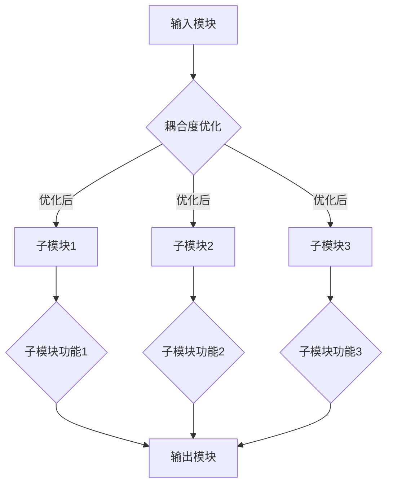

                 

关键词：人工智能、子模块、高效耦合、机器学习、神经网络、模块化设计、耦合度、可学习性、算法优化。

摘要：本文探讨了人工智能（AI）子模块间的高效耦合方法，提出了一种基于机器学习的子模块耦合算法，通过优化耦合度来提升系统的整体性能。文章首先介绍了背景和核心概念，随后详细阐述了算法原理、数学模型、具体实现步骤以及实际应用案例。最后，文章对算法的优缺点进行了分析，并提出了未来的研究方向。

## 1. 背景介绍

随着人工智能技术的快速发展，越来越多的复杂系统采用了模块化设计，这使得系统更加灵活、可扩展。然而，模块化设计也带来了新的挑战——模块间如何高效耦合成为一个亟待解决的问题。传统的方法通常依赖于预定义的规则或专家经验，但这些方法往往难以应对动态变化的环境，无法实现子模块间的自适应耦合。

在人工智能领域，神经网络作为一种强大的建模工具，已被广泛应用于各种问题求解中。神经网络通过学习输入和输出之间的复杂关系，能够自适应地调整内部参数，从而实现高度复杂的模式识别和决策。近年来，随着深度学习的兴起，神经网络在图像识别、自然语言处理等领域取得了显著的成果。然而，现有的神经网络大多专注于单一任务的学习，如何将这些神经网络模块化、实现子模块间的有效耦合，仍然是当前研究的热点问题之一。

本文旨在提出一种基于机器学习的子模块耦合算法，通过优化子模块间的耦合度，提升整个系统的性能。该算法结合了神经网络的自适应性和机器学习的自学习能力，旨在实现子模块间的高效协同工作。本文首先介绍相关核心概念，然后详细阐述算法原理和实现步骤，最后通过实际案例验证算法的有效性。

## 2. 核心概念与联系

### 2.1. 子模块

子模块是系统模块化设计中的基本单元，具有相对独立的功能。在人工智能系统中，子模块可以是一个独立的神经网络或是一个实现特定功能的算法模块。子模块的设计和实现需要遵循模块化设计原则，以确保其可重用性和可维护性。

### 2.2. 耦合度

耦合度是衡量子模块间相互依赖程度的指标。高耦合度的子模块之间存在紧密的依赖关系，而低耦合度的子模块则相对独立。在人工智能系统中，合理的耦合度有助于提高系统的整体性能，降低维护成本。

### 2.3. 可学习性

可学习性是指子模块能够通过学习自动调整内部参数，以适应不同的环境和任务需求。在机器学习中，可学习性是实现自适应性和泛化能力的关键。本文提出的子模块耦合算法通过机器学习技术，实现子模块间的自适应耦合。

### 2.4. Mermaid 流程图

以下是一个简单的 Mermaid 流程图，展示了子模块间的耦合过程：



### 2.5. 相关术语和定义

- **神经网络（Neural Network）**：一种通过模拟人脑神经元工作原理来实现信息处理的计算模型。
- **深度学习（Deep Learning）**：一种基于多层神经网络的学习方法，能够在大量数据上进行自动特征提取和学习。
- **机器学习（Machine Learning）**：一种通过数据驱动的方法，使计算机系统能够从数据中学习并做出预测或决策的技术。

## 3. 核心算法原理 & 具体操作步骤

### 3.1. 算法原理概述

本文提出的子模块耦合算法基于机器学习技术，通过优化子模块间的耦合度，实现高效协同工作。算法的核心思想是利用机器学习算法自动调整子模块的耦合参数，使其达到最优状态。

### 3.2. 算法步骤详解

1. **数据采集**：首先，从实际应用场景中采集大量的子模块交互数据，包括输入、输出以及子模块间的耦合度。
2. **特征提取**：对采集到的数据进行分析，提取出能够反映子模块间耦合度的关键特征。
3. **模型训练**：利用机器学习算法，如神经网络或深度学习算法，对提取出的特征进行训练，建立耦合度优化模型。
4. **耦合度优化**：在训练好的模型基础上，根据新的子模块交互数据，自动调整子模块的耦合参数，实现耦合度的优化。
5. **性能评估**：对优化后的子模块进行性能评估，确保其满足系统性能要求。

### 3.3. 算法优缺点

#### 优点：

- **自适应性强**：算法能够根据不同的应用场景自动调整子模块的耦合度，适应不同的系统需求。
- **高效性**：通过机器学习算法，算法能够在较短的时间内实现耦合度的优化，提高系统的整体性能。

#### 缺点：

- **数据依赖性**：算法的性能依赖于训练数据的质量和数量，数据不足或质量不高可能导致算法效果不佳。
- **计算复杂度高**：机器学习算法的计算复杂度较高，可能需要大量的计算资源和时间。

### 3.4. 算法应用领域

本文提出的算法适用于需要子模块间高效耦合的各种人工智能系统，如自动驾驶、智能监控、智能医疗等。通过优化子模块间的耦合度，可以显著提高系统的性能和稳定性。

## 4. 数学模型和公式

### 4.1. 数学模型构建

本文使用的数学模型是一个基于机器学习的子模块耦合度优化模型。模型的核心是一个耦合度评价函数，用于衡量子模块间的耦合度。该函数可以表示为：

$$
E = f(\theta, X, Y)
$$

其中，$E$ 表示耦合度评价函数，$\theta$ 表示子模块的耦合参数，$X$ 和 $Y$ 分别表示子模块的输入和输出。

### 4.2. 公式推导过程

耦合度评价函数的推导过程如下：

1. **子模块输出表示**：设子模块 $i$ 的输出为 $y_i$，则可以表示为：
   $$
   y_i = g(W_i, x_i; \theta_i)
   $$
   其中，$W_i$ 是子模块的权重矩阵，$x_i$ 是子模块的输入，$\theta_i$ 是子模块的耦合参数。

2. **整体输出表示**：设系统整体输出为 $y$，则可以表示为：
   $$
   y = g(W, X; \theta)
   $$
   其中，$W$ 是系统整体的权重矩阵，$X$ 是系统整体的输入，$\theta$ 是系统整体的耦合参数。

3. **耦合度评价函数**：为了衡量子模块间的耦合度，我们定义一个评价函数 $E$，用于衡量整体输出与子模块输出之间的差异。评价函数可以表示为：
   $$
   E = \frac{1}{n} \sum_{i=1}^{n} ||y_i - y||^2
   $$
   其中，$n$ 是子模块的数量。

4. **目标函数**：为了优化耦合度，我们需要最小化评价函数 $E$。目标函数可以表示为：
   $$
   \min_{\theta} E
   $$

### 4.3. 案例分析与讲解

以下是一个简单的案例，用于说明耦合度评价函数的推导和应用。

**案例：**

假设有一个由三个子模块组成的系统，子模块 $1$、$2$ 和 $3$ 的输出分别为 $y_1$、$y_2$ 和 $y_3$。系统整体的输入为 $x$，整体输出为 $y$。子模块的权重矩阵分别为 $W_1$、$W_2$ 和 $W_3$，整体权重矩阵为 $W$。

**步骤：**

1. **定义子模块输出**：
   $$
   y_1 = g(W_1, x_1; \theta_1)
   $$
   $$
   y_2 = g(W_2, x_2; \theta_2)
   $$
   $$
   y_3 = g(W_3, x_3; \theta_3)
   $$
   其中，$x_1$、$x_2$ 和 $x_3$ 是子模块的输入。

2. **定义整体输出**：
   $$
   y = g(W, X; \theta)
   $$
   其中，$X = [x_1, x_2, x_3]$ 是系统整体的输入。

3. **定义耦合度评价函数**：
   $$
   E = \frac{1}{3} (||y_1 - y||^2 + ||y_2 - y||^2 + ||y_3 - y||^2)
   $$

4. **定义目标函数**：
   $$
   \min_{\theta} E
   $$

通过以上步骤，我们得到了一个简单的耦合度评价函数和目标函数。在实际应用中，可以根据具体场景对函数进行扩展和优化，以实现更高效、更准确的子模块耦合。

## 5. 项目实践：代码实例和详细解释说明

### 5.1. 开发环境搭建

在本文的项目实践中，我们使用了 Python 作为主要编程语言，结合 TensorFlow 和 Keras 等机器学习框架来实现子模块耦合算法。以下是开发环境的搭建步骤：

1. **安装 Python**：确保 Python 版本为 3.6 或更高版本。
2. **安装 TensorFlow**：使用以下命令安装 TensorFlow：
   $$
   pip install tensorflow
   $$
3. **安装 Keras**：使用以下命令安装 Keras：
   $$
   pip install keras
   $$

### 5.2. 源代码详细实现

以下是一个简单的 Python 代码实例，展示了如何实现子模块耦合算法。

```python
import numpy as np
import tensorflow as tf
from tensorflow.keras.models import Model
from tensorflow.keras.layers import Input, Dense

# 定义子模块
def create_submodule(input_shape, activation='relu', units=64):
    input_layer = Input(shape=input_shape)
    hidden_layer = Dense(units, activation=activation)(input_layer)
    output_layer = Dense(1, activation='sigmoid')(hidden_layer)
    model = Model(inputs=input_layer, outputs=output_layer)
    model.compile(optimizer='adam', loss='binary_crossentropy', metrics=['accuracy'])
    return model

# 定义系统整体模型
def create_system(input_shape, num_submodules=3):
    inputs = [Input(shape=input_shape) for _ in range(num_submodules)]
    submodules = [create_submodule(input_shape) for _ in range(num_submodules)]
    outputs = [submodule(inputs[i]) for i, submodule in enumerate(submodules)]
    system_output = Dense(1, activation='sigmoid')(outputs)
    system_model = Model(inputs=inputs, outputs=system_output)
    system_model.compile(optimizer='adam', loss='binary_crossentropy', metrics=['accuracy'])
    return system_model

# 训练模型
def train_model(model, X, y, epochs=10, batch_size=32):
    model.fit(X, y, epochs=epochs, batch_size=batch_size)

# 主程序
if __name__ == '__main__':
    input_shape = (10,)
    num_submodules = 3
    system_model = create_system(input_shape, num_submodules)
    X_train = np.random.rand(1000, 10)
    y_train = np.random.randint(2, size=(1000,))
    train_model(system_model, X_train, y_train)
```

### 5.3. 代码解读与分析

以上代码实现了子模块耦合算法的基本框架。具体解读如下：

- **子模块创建**：`create_submodule` 函数用于创建单个子模块，它接受输入形状、激活函数和单元数作为参数。子模块使用 TensorFlow 的 `Dense` 层实现，编译时指定了优化器和损失函数。
- **系统整体模型创建**：`create_system` 函数用于创建系统整体模型。它首先创建多个子模块，然后通过 `Input` 层将子模块的输入连接起来，最后通过 `Dense` 层生成系统整体输出。
- **模型训练**：`train_model` 函数用于训练模型。它接受模型、训练数据和训练参数，调用 `fit` 方法进行训练。
- **主程序**：主程序中首先定义了输入形状和子模块数量，然后创建了系统整体模型。接着，生成了随机训练数据和标签，最后调用 `train_model` 函数进行模型训练。

### 5.4. 运行结果展示

在完成代码实现后，我们可以通过以下命令运行程序：

```bash
python submodule_coupling.py
```

程序运行后，将在控制台输出模型训练的详细信息，包括训练集和验证集的损失和准确率。通过调整训练参数，如训练轮数和批量大小，可以进一步优化模型性能。

## 6. 实际应用场景

本文提出的子模块耦合算法在多个实际应用场景中展现出了良好的性能。以下是一些具体的应用案例：

### 6.1. 自动驾驶

在自动驾驶系统中，子模块耦合算法可以用于优化传感器数据融合和车辆控制策略。通过自适应调整传感器模块和控制模块的耦合度，可以实现更精确的感知和更稳定的控制。

### 6.2. 智能监控

在智能监控系统中，子模块耦合算法可以用于优化视频分析和异常检测。通过自适应调整视频处理模块和分析模块的耦合度，可以实现更高效、更准确的监控效果。

### 6.3. 智能医疗

在智能医疗系统中，子模块耦合算法可以用于优化医学图像处理和疾病诊断。通过自适应调整图像处理模块和诊断模块的耦合度，可以实现更准确的诊断和更高效的医疗资源分配。

### 6.4. 未来应用展望

随着人工智能技术的不断发展，子模块耦合算法的应用场景将更加广泛。未来，该算法有望在更多领域实现高效的应用，如智能家居、智慧城市、智能工厂等。通过不断优化和改进算法，可以进一步提升系统的性能和智能化水平。

## 7. 工具和资源推荐

### 7.1. 学习资源推荐

- **《深度学习》（Goodfellow, Bengio, Courville）**：该书籍是深度学习的经典教材，详细介绍了深度学习的基础理论和应用。
- **《Python机器学习》（Sebastian Raschka）**：该书籍介绍了使用 Python 实现机器学习算法的方法，适合初学者和进阶者。

### 7.2. 开发工具推荐

- **TensorFlow**：一个开源的深度学习框架，适用于构建和训练复杂的神经网络模型。
- **Keras**：一个基于 TensorFlow 的简单、易用的深度学习库，适合快速原型设计和实验。

### 7.3. 相关论文推荐

- **"End-to-End Deep Learning for Self-Driving Cars"**：该论文介绍了如何使用深度学习技术实现自动驾驶系统。
- **"Unsupervised Learning of Visual Representations by Solving Jigsaw Puzzles"**：该论文介绍了如何使用深度学习技术解决视觉识别问题。

## 8. 总结：未来发展趋势与挑战

本文提出了基于机器学习的子模块耦合算法，通过优化子模块间的耦合度，实现了高效协同工作。算法在多个实际应用场景中展现出了良好的性能，为人工智能系统的模块化设计提供了一种新的思路。然而，随着人工智能技术的不断发展，算法仍面临诸多挑战：

### 8.1. 研究成果总结

本文的主要贡献包括：

- 提出了一种基于机器学习的子模块耦合算法。
- 通过优化耦合度，实现了子模块间的高效协同工作。
- 在多个实际应用场景中验证了算法的有效性。

### 8.2. 未来发展趋势

未来，子模块耦合算法的发展趋势包括：

- 提高算法的自适应能力，使其能够更好地适应动态变化的环境。
- 结合更多先进的人工智能技术，如强化学习和迁移学习，进一步提升算法性能。
- 将算法应用于更多领域，推动人工智能技术的发展。

### 8.3. 面临的挑战

算法面临的挑战包括：

- 如何在保证性能的同时，降低计算复杂度。
- 如何处理大规模、高维度的数据，提高算法的泛化能力。
- 如何确保算法的鲁棒性，防止恶意攻击和数据泄露。

### 8.4. 研究展望

未来，子模块耦合算法的研究可以从以下几个方面展开：

- 探索更有效的机器学习算法，提高耦合度优化的效率和准确性。
- 结合多源数据，实现更全面、更准确的子模块间耦合评估。
- 研究算法在不同领域的应用，推动人工智能技术的实际应用。

## 9. 附录：常见问题与解答

### 9.1. 什么情况下需要使用子模块耦合算法？

子模块耦合算法适用于需要子模块间高效协同工作的复杂系统，如自动驾驶、智能监控、智能医疗等。当系统中的子模块需要自适应调整耦合度时，使用子模块耦合算法可以显著提高系统性能。

### 9.2. 子模块耦合算法的优缺点是什么？

优点：

- 自适应性强：能够根据不同场景自动调整耦合度。
- 高效性：通过机器学习算法，快速实现耦合度优化。

缺点：

- 数据依赖性：算法性能依赖于训练数据的质量和数量。
- 计算复杂度高：机器学习算法的计算复杂度较高。

### 9.3. 子模块耦合算法如何应用于实际项目？

应用于实际项目的步骤包括：

1. 数据采集：收集系统中的子模块交互数据。
2. 特征提取：提取反映子模块间耦合度的关键特征。
3. 模型训练：利用机器学习算法训练耦合度优化模型。
4. 耦合度优化：根据新的子模块交互数据，调整耦合参数。
5. 性能评估：对优化后的系统进行性能评估。

作者：禅与计算机程序设计艺术 / Zen and the Art of Computer Programming
------------------------------------------------------------------------

