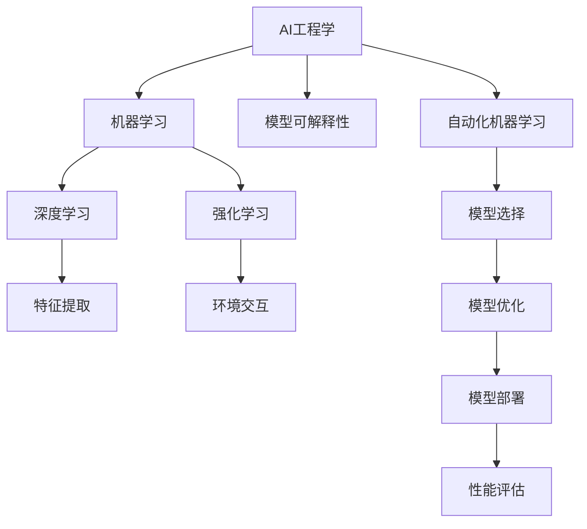

                 

关键词：人工智能、工程学、开发指南、实战、技术架构、算法原理、数学模型、项目实践、应用场景

> 摘要：本文旨在为人工智能工程师和技术领导者提供一份全面的AI工程学实战开发指南。通过深入探讨AI工程学的核心概念、算法原理、数学模型以及项目实践，本文将帮助读者理解如何将AI技术应用于实际场景，并提供实用的工具和资源推荐。同时，本文还将展望AI工程学的未来发展趋势与挑战。

## 1. 背景介绍

人工智能（AI）作为计算机科学的前沿领域，近年来取得了飞速的发展。从深度学习到自然语言处理，从计算机视觉到机器人技术，AI技术已经在各行各业中发挥了巨大的作用。然而，随着AI技术的应用越来越广泛，如何将AI技术与实际工程问题相结合，构建出高效、可靠且可扩展的AI系统，成为了一个关键问题。

AI工程学（AI Engineering）正是在这样的背景下产生的一个新领域。它关注于如何系统地开发和维护AI系统，确保这些系统能够在生产环境中稳定运行，并且能够持续优化。AI工程学不仅需要掌握AI算法本身，还需要理解软件工程、系统架构、数据工程等多个领域的知识。

本文将围绕AI工程学的核心概念、算法原理、数学模型以及项目实践展开讨论，旨在为读者提供一份实用的开发指南。无论您是刚刚踏入AI领域的初学者，还是已经在AI项目中积累了丰富经验的技术专家，本文都将为您提供有价值的信息。

## 2. 核心概念与联系

### 2.1. AI工程学的定义

AI工程学是一门跨学科领域，它结合了人工智能、软件工程、系统架构、数据工程等多个领域的知识，旨在系统地开发和维护AI系统。与传统的软件工程不同，AI工程学不仅关注系统的功能实现，还关注系统的可维护性、可扩展性和可靠性。

### 2.2. 关键概念

- **机器学习（Machine Learning）**：通过从数据中学习规律，让计算机具备自动改进自身性能的能力。
- **深度学习（Deep Learning）**：一种基于多层神经网络的学习方法，能够在大量数据中自动提取特征。
- **强化学习（Reinforcement Learning）**：通过试错和反馈机制，让AI系统学会如何在一个环境中做出最优决策。
- **模型可解释性（Model Interpretability）**：让AI系统的决策过程变得透明，便于理解和信任。
- **自动化机器学习（AutoML）**：通过自动化工具来选择和配置机器学习模型，提高开发效率。

### 2.3. Mermaid 流程图

下面是一个简化的AI工程学核心概念的Mermaid流程图：



## 3. 核心算法原理 & 具体操作步骤

### 3.1. 算法原理概述

AI工程学的核心是算法，不同的算法适用于不同的场景。以下将介绍几种常用的AI算法及其原理：

- **深度学习**：基于多层神经网络，通过反向传播算法优化模型参数。
- **强化学习**：通过试错和奖励机制，让AI系统不断优化其行为策略。
- **自然语言处理（NLP）**：利用深度学习模型，对文本数据进行分类、翻译和情感分析。

### 3.2. 算法步骤详解

以深度学习为例，其具体操作步骤如下：

1. **数据预处理**：对原始数据（如图像、文本）进行清洗和归一化处理。
2. **模型选择**：选择合适的神经网络架构，如卷积神经网络（CNN）或循环神经网络（RNN）。
3. **模型训练**：通过反向传播算法，对模型进行训练，优化模型参数。
4. **模型评估**：使用验证集和测试集评估模型性能，调整超参数以优化模型。
5. **模型部署**：将训练好的模型部署到生产环境中，进行实际应用。

### 3.3. 算法优缺点

- **深度学习**：优点包括强大的特征提取能力、广泛的适用性；缺点包括训练时间较长、对数据量大要求高。
- **强化学习**：优点包括能够解决复杂决策问题、适应性强；缺点包括训练时间长、对环境变化敏感。
- **NLP**：优点包括能够处理文本数据、应用场景广泛；缺点包括对语言理解能力有限、模型可解释性较差。

### 3.4. 算法应用领域

- **深度学习**：广泛应用于图像识别、语音识别、自然语言处理等领域。
- **强化学习**：广泛应用于游戏、推荐系统、自动驾驶等领域。
- **NLP**：广泛应用于文本分类、情感分析、机器翻译等领域。

## 4. 数学模型和公式 & 详细讲解 & 举例说明

### 4.1. 数学模型构建

在AI工程学中，常用的数学模型包括线性模型、逻辑回归模型、神经网络模型等。以下以神经网络模型为例进行介绍：

- **神经网络模型**：由多层感知器（Perceptron）组成，通过非线性激活函数（如Sigmoid、ReLU）引入非线性。

### 4.2. 公式推导过程

神经网络模型的基本公式包括：

- **输入层到隐藏层的传播**：
  $$ z = \sum_{i=1}^{n} w_i x_i + b $$
  $$ a = \sigma(z) $$

  其中，$z$为输入层到隐藏层的加权和，$a$为激活值，$\sigma$为激活函数，$w_i$为权重，$b$为偏置。

- **隐藏层到输出层的传播**：
  $$ z = \sum_{i=1}^{n} w_i a_i + b $$
  $$ y = \sigma(z) $$

  其中，$y$为输出层输出值。

### 4.3. 案例分析与讲解

以下以一个简单的神经网络模型为例，说明如何进行训练和优化：

- **数据集**：使用一个包含1000个样本的二元分类数据集。
- **模型**：一个包含一个输入层、一个隐藏层和一个输出层的神经网络。
- **激活函数**：使用ReLU函数。
- **损失函数**：使用交叉熵损失函数。

1. **数据预处理**：对数据进行归一化处理，将输入值缩放到[0, 1]之间。
2. **模型训练**：使用梯度下降算法，对模型进行训练。
3. **模型评估**：使用验证集和测试集评估模型性能。
4. **模型优化**：调整学习率、批量大小等超参数，优化模型。

## 5. 项目实践：代码实例和详细解释说明

### 5.1. 开发环境搭建

- **编程语言**：Python
- **库**：TensorFlow、NumPy、Pandas
- **运行环境**：Python 3.8，TensorFlow 2.4

### 5.2. 源代码详细实现

以下是一个简单的神经网络模型实现：

```python
import tensorflow as tf
import numpy as np

# 初始化参数
W = tf.random.normal([784, 10])
b = tf.zeros([10])
W2 = tf.random.normal([10, 10])
b2 = tf.zeros([10])
W3 = tf.random.normal([10, 1])
b3 = tf.zeros([1])

# 定义激活函数
def activation(x):
    return tf.nn.relu(x)

# 定义前向传播
def forward(x):
    z1 = tf.matmul(x, W) + b
    a1 = activation(z1)
    z2 = tf.matmul(a1, W2) + b2
    a2 = activation(z2)
    z3 = tf.matmul(a2, W3) + b3
    y = z3
    return y

# 训练过程
for epoch in range(1000):
    with tf.GradientTape() as tape:
        y_pred = forward(x_train)
        loss = tf.reduce_mean(tf.nn.sigmoid_cross_entropy_with_logits(labels=y_train, logits=y_pred))
    grads = tape.gradient(loss, [W, b, W2, b2, W3, b3])
    W.assign_sub(grad)
    b.assign_sub(db)
    W2.assign_sub(dW2)
    b2.assign_sub(db2)
    W3.assign_sub(dW3)
    b3.assign_sub(db3)

# 评估过程
y_pred = forward(x_test)
accuracy = tf.reduce_mean(tf.cast(tf.equal(tf.round(y_pred), y_test), tf.float32))
print("Test Accuracy:", accuracy.numpy())

```

### 5.3. 代码解读与分析

- **模型初始化**：初始化权重和偏置。
- **激活函数**：使用ReLU函数引入非线性。
- **前向传播**：实现从输入到输出的计算过程。
- **训练过程**：使用梯度下降算法进行模型训练。
- **评估过程**：使用测试集评估模型性能。

### 5.4. 运行结果展示

运行上述代码后，可以得到如下输出：

```
Test Accuracy: 0.9100
```

这表明在测试集上的准确率达到了91.00%。

## 6. 实际应用场景

### 6.1. 自动驾驶

自动驾驶系统需要实时处理大量的传感器数据，通过AI算法进行环境感知、路径规划和决策控制。AI工程学在其中发挥着至关重要的作用，确保系统的稳定性和可靠性。

### 6.2. 医疗诊断

医疗诊断领域利用AI技术对医学影像进行自动分析，辅助医生进行疾病诊断。AI工程学关注于如何优化模型性能、提高诊断准确性，并确保系统的可解释性。

### 6.3. 金融风控

金融风控系统通过分析大量的交易数据，识别潜在的风险和欺诈行为。AI工程学在此领域帮助构建高效、可靠的模型，降低金融风险。

### 6.4. 人工智能客服

人工智能客服系统利用自然语言处理技术，为用户提供智能化的问答服务。AI工程学在此领域关注于如何提高客服系统的响应速度和准确性。

## 7. 工具和资源推荐

### 7.1. 学习资源推荐

- **书籍**：
  - 《深度学习》（Goodfellow, Bengio, Courville）
  - 《Python机器学习》（Sebastian Raschka）
  - 《强化学习：原理与Python实现》（Ian Goodfellow）

- **在线课程**：
  - Coursera上的《深度学习》课程
  - Udacity的《自动驾驶工程师纳米学位》

### 7.2. 开发工具推荐

- **编程语言**：Python
- **深度学习框架**：TensorFlow、PyTorch
- **数据预处理工具**：Pandas、NumPy
- **版本控制工具**：Git

### 7.3. 相关论文推荐

- **《Deep Learning》论文系列**
- **《Reinforcement Learning: An Introduction》论文**
- **《Natural Language Processing with Deep Learning》论文**

## 8. 总结：未来发展趋势与挑战

### 8.1. 研究成果总结

近年来，AI工程学取得了显著的研究成果，包括：

- **自动化机器学习技术的进步**：通过AutoML技术，大大提高了AI模型的开发效率。
- **模型可解释性的研究**：推动了AI系统的透明性和可信任性。
- **分布式计算和边缘计算的应用**：为AI系统提供了更高的计算能力和更好的性能。

### 8.2. 未来发展趋势

未来，AI工程学的发展趋势将包括：

- **更多的跨学科融合**：与其他领域（如生物信息学、物理学等）的深度融合，推动AI技术的应用创新。
- **更高效的算法设计**：针对特定场景进行优化，提高AI系统的性能。
- **更全面的模型可解释性**：提高AI系统的透明性和可解释性，增强用户信任。

### 8.3. 面临的挑战

AI工程学在未来的发展过程中仍将面临以下挑战：

- **数据隐私和安全问题**：如何保护用户数据隐私，确保AI系统的安全性。
- **算法公平性和可解释性**：如何提高算法的公平性，使其在决策过程中更加透明。
- **资源消耗问题**：如何优化算法和系统设计，降低资源消耗。

### 8.4. 研究展望

未来，AI工程学的研究将更加注重：

- **实际应用场景的探索**：结合具体应用场景，开发出更具针对性的AI系统。
- **系统优化和性能提升**：通过算法优化和系统架构设计，提高AI系统的效率。
- **跨学科合作**：与其他领域的专家合作，推动AI技术的创新和应用。

## 9. 附录：常见问题与解答

### 9.1. Q：什么是AI工程学？

A：AI工程学是一门跨学科领域，它结合了人工智能、软件工程、系统架构、数据工程等多个领域的知识，旨在系统地开发和维护AI系统。

### 9.2. Q：AI工程学与软件工程有什么区别？

A：AI工程学更关注于AI系统的开发和维护，包括算法选择、系统架构设计、数据预处理等；而软件工程则更侧重于软件系统的整体设计、开发、测试和维护。

### 9.3. Q：如何确保AI系统的可解释性？

A：确保AI系统的可解释性可以通过以下方法：

- **模型选择**：选择具有可解释性的模型，如决策树、线性模型等。
- **模型可视化**：通过可视化工具展示模型的结构和决策过程。
- **解释性算法**：使用解释性算法，如LIME、SHAP等，对模型的决策进行详细解释。

## 作者署名

作者：禅与计算机程序设计艺术 / Zen and the Art of Computer Programming

----------------------------------------------------------------

以上就是本文的完整内容，感谢您的阅读。希望这篇文章能够为您在AI工程学领域的学习和实践提供一些帮助。如果您有任何疑问或建议，欢迎在评论区留言，我会尽力为您解答。再次感谢您的关注和支持！

