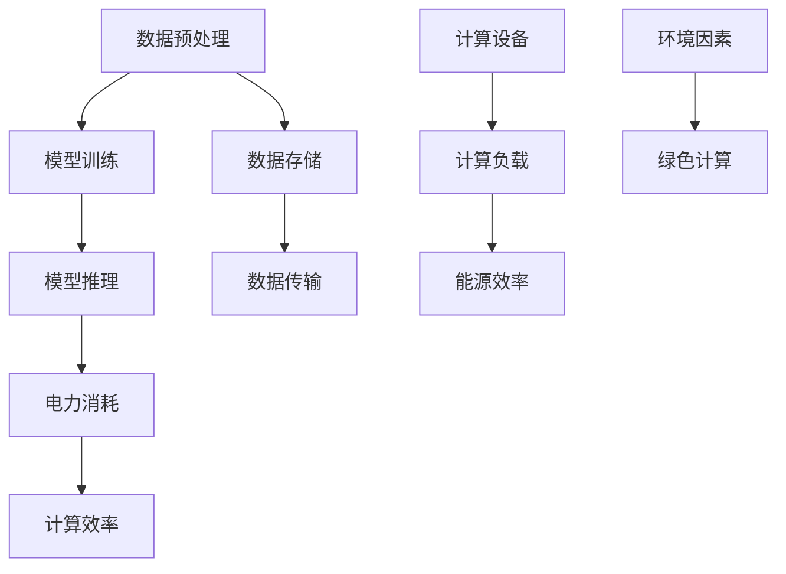

                 

关键词：AI应用开发、成本、电量消耗、效率优化、绿色计算

> 摘要：本文探讨了人工智能（AI）应用开发过程中所涉及的成本因素，特别是与电力消耗的关联性。通过对AI计算资源的需求分析、计算模型能耗评估以及实际应用案例的研究，本文提出了减少AI应用开发成本的方法，为绿色计算和可持续发展提供了新的思路。

## 1. 背景介绍

随着人工智能技术的快速发展，AI在各个领域的应用日益广泛。然而，AI应用开发不仅需要强大的计算资源，还伴随着显著的电力消耗。据估算，全球AI计算设备的能耗已占到了总电力消耗的相当一部分，这引发了绿色计算（Green Computing）的关注。绿色计算旨在通过优化计算资源管理和能源利用，降低环境影响，实现可持续计算。

### 1.1 AI应用发展趋势

人工智能应用在医疗、金融、交通、能源等多个领域都取得了显著的成果。例如，AI在医疗诊断中的应用大大提高了诊断准确率，在金融风险评估中起到了关键作用，在智能交通系统中优化了交通流量管理。这些应用不仅提升了行业效率，也带来了巨大的经济效益。

### 1.2 电力消耗问题

然而，随着AI应用规模不断扩大，计算设备的电力消耗也急剧增加。传统的计算设备如服务器和数据中心已经难以满足AI算法对高性能计算资源的需求，这导致了更多的能源消耗和更严重的碳排放问题。因此，研究AI应用开发与电力消耗的关联性，寻找降低能耗的方法具有重要意义。

## 2. 核心概念与联系

### 2.1 AI计算资源需求

AI计算资源的需求主要来自于大量的数据预处理、模型训练和推理等过程。这些过程对计算资源的消耗非常大，特别是深度学习模型，其训练过程需要大量的浮点运算（FLOPs）。例如，一个复杂的深度学习模型在训练过程中可能需要数百万亿次浮点运算，这对计算设备的性能和能耗提出了极高的要求。

### 2.2 电力消耗与计算效率

电力消耗与计算效率密切相关。计算效率越高，单位时间内完成的计算量越大，相应的电力消耗也越低。因此，提高计算效率是减少电力消耗的关键。以下是一个Mermaid流程图，展示了AI计算过程中涉及的主要环节和它们之间的关联性。



### 2.3 绿色计算策略

绿色计算策略主要包括以下几个方面：

- **能源效率优化**：通过采用高效能的计算设备和优化算法，提高能源利用效率。
- **资源管理**：通过动态资源调度和虚拟化技术，合理分配计算资源，避免资源浪费。
- **可再生能源利用**：积极采用可再生能源，如太阳能、风能等，减少对传统能源的依赖。
- **冷却系统优化**：通过优化冷却系统设计，降低数据中心的能耗。

## 3. 核心算法原理 & 具体操作步骤

### 3.1 算法原理概述

在AI应用开发中，常用的算法包括深度学习、强化学习、生成对抗网络（GAN）等。每种算法都有其特定的计算需求和能耗特点。以下将对深度学习算法进行简要概述。

- **深度学习（Deep Learning）**：深度学习是人工智能的一个重要分支，通过构建多层次的神经网络模型，实现对数据的复杂特征提取和模式识别。深度学习算法的计算需求大，特别是模型训练阶段，需要大量的浮点运算。
- **强化学习（Reinforcement Learning）**：强化学习通过智能体与环境交互，学习最优策略，以达到最大化奖励的目标。强化学习算法在决策过程中需要实时计算，对计算资源的实时性要求较高。
- **生成对抗网络（GAN）**：GAN由生成器和判别器两个网络组成，通过相互竞争，生成与真实数据分布相近的数据。GAN的训练过程需要大量的计算资源，特别是在生成器和判别器的训练阶段。

### 3.2 算法步骤详解

#### 深度学习算法步骤

1. **数据预处理**：对原始数据集进行清洗、归一化等处理，使其适合模型训练。
2. **模型设计**：根据应用需求，设计合适的神经网络结构，包括层数、每层的神经元数量、激活函数等。
3. **模型训练**：通过反向传播算法，对模型参数进行迭代更新，优化模型性能。
4. **模型评估**：使用验证集对模型进行评估，调整模型参数，确保模型具有良好的泛化能力。
5. **模型推理**：使用训练好的模型对新数据进行预测或分类。

#### 强化学习算法步骤

1. **环境设定**：定义智能体执行任务的环境，包括状态空间、动作空间和奖励机制。
2. **策略学习**：通过智能体与环境交互，学习最优策略，实现预期目标。
3. **策略评估**：评估智能体在特定环境下的策略性能，调整策略参数。
4. **策略执行**：智能体根据学习到的策略执行动作，实现任务目标。

#### GAN算法步骤

1. **生成器设计**：设计生成器网络，将随机噪声映射为数据样本。
2. **判别器设计**：设计判别器网络，区分真实数据和生成数据。
3. **模型训练**：通过训练生成器和判别器，优化模型参数，使其达到稳定状态。
4. **生成样本**：使用生成器生成与真实数据分布相近的数据样本。

### 3.3 算法优缺点

#### 深度学习算法

- **优点**：能够处理大规模数据，具有较强的特征提取和模式识别能力。
- **缺点**：计算需求大，训练时间长，对计算资源的要求较高。

#### 强化学习算法

- **优点**：能够自主学习和适应复杂环境，具有较强的决策能力。
- **缺点**：需要大量的样本数据进行训练，训练过程相对较慢。

#### GAN算法

- **优点**：能够生成高质量的数据样本，有助于数据增强和模型训练。
- **缺点**：训练过程复杂，生成器和判别器的参数调优难度较大。

### 3.4 算法应用领域

#### 深度学习算法

- **医疗诊断**：用于疾病诊断、病理分析等。
- **图像识别**：用于目标检测、人脸识别等。
- **语音识别**：用于语音识别、语音合成等。

#### 强化学习算法

- **自动驾驶**：用于自动驾驶车辆的路径规划和决策。
- **游戏AI**：用于游戏的智能对手设计。
- **资源调度**：用于数据中心和云计算平台的资源调度。

#### GAN算法

- **数据增强**：用于提升模型的泛化能力。
- **图像生成**：用于艺术创作、图像编辑等。
- **生成对抗测试**：用于网络安全和漏洞检测。

## 4. 数学模型和公式 & 详细讲解 & 举例说明

### 4.1 数学模型构建

为了分析AI应用开发与电力消耗的关联性，我们可以构建一个简单的数学模型。该模型主要考虑以下几个因素：

- **计算负载（C）**：表示AI应用在一段时间内的计算量，通常用浮点运算次数（FLOPs）来衡量。
- **设备能效（E）**：表示计算设备每消耗单位电能所能完成的计算量，单位为FLOPs/W。
- **电力消耗（P）**：表示在特定时间内AI应用的总电力消耗。

根据上述因素，我们可以构建以下数学模型：

\[ P = \frac{C}{E} \times t \]

其中，\( t \) 表示计算时间。

### 4.2 公式推导过程

首先，我们来解释一下公式中的各个参数。

- **计算负载（C）**：计算负载是AI应用在一段时间内的计算量，通常用浮点运算次数（FLOPs）来衡量。例如，一个深度学习模型在训练过程中可能需要数百万亿次的浮点运算。

\[ C = \sum_{i=1}^{n} FLOPs_i \]

其中，\( FLOPs_i \) 表示第 \( i \) 次运算的浮点运算次数，\( n \) 表示总的运算次数。

- **设备能效（E）**：设备能效是指计算设备每消耗单位电能所能完成的计算量，单位为FLOPs/W。高能效的设备意味着在相同电力消耗下能够完成更多的计算任务。

\[ E = \frac{FLOPs}{Power} \]

其中，\( FLOPs \) 表示设备在一定时间内完成的浮点运算次数，\( Power \) 表示设备的电力消耗。

- **电力消耗（P）**：电力消耗是AI应用在特定时间内消耗的总电能，通常用千瓦时（kWh）来衡量。

\[ P = Power \times t \]

其中，\( Power \) 表示设备的平均电力消耗，\( t \) 表示计算时间。

将上述参数代入原始公式，我们可以得到：

\[ P = \frac{\sum_{i=1}^{n} FLOPs_i}{E} \times t \]

### 4.3 案例分析与讲解

为了更好地理解上述公式，我们来看一个具体的案例。

假设我们有一个深度学习模型，用于图像识别任务。该模型在训练过程中需要完成1万亿次的浮点运算。设备的能效为10^6 FLOPs/W。我们假设计算时间为1小时。

根据公式，我们可以计算出该模型在训练过程中的总电力消耗：

\[ P = \frac{10^{12}}{10^6} \times 1 = 10^6 \text{ kWh} \]

这意味着，该模型在1小时的训练过程中消耗了10^6 kWh的电能。

通过这个案例，我们可以看到，计算负载、设备能效和计算时间都是影响电力消耗的重要因素。在实际应用中，我们可以通过优化模型设计、提高设备能效和优化计算流程来减少电力消耗。

## 5. 项目实践：代码实例和详细解释说明

### 5.1 开发环境搭建

为了实现上述算法，我们需要搭建一个合适的技术环境。以下是一个基于Python和TensorFlow的深度学习项目示例。

首先，安装必要的依赖库：

```bash
pip install tensorflow numpy matplotlib
```

### 5.2 源代码详细实现

以下是一个简单的深度学习模型实现，用于图像分类任务。

```python
import tensorflow as tf
from tensorflow.keras import layers
import numpy as np
import matplotlib.pyplot as plt

# 数据预处理
def preprocess_data(images, labels):
    images = images / 255.0
    return images, labels

# 构建深度学习模型
def build_model(input_shape):
    model = tf.keras.Sequential([
        layers.Conv2D(32, (3, 3), activation='relu', input_shape=input_shape),
        layers.MaxPooling2D((2, 2)),
        layers.Conv2D(64, (3, 3), activation='relu'),
        layers.MaxPooling2D((2, 2)),
        layers.Conv2D(64, (3, 3), activation='relu'),
        layers.Flatten(),
        layers.Dense(64, activation='relu'),
        layers.Dense(10, activation='softmax')
    ])
    return model

# 训练模型
def train_model(model, train_data, train_labels, epochs):
    model.compile(optimizer='adam',
                  loss='sparse_categorical_crossentropy',
                  metrics=['accuracy'])
    history = model.fit(train_data, train_labels, epochs=epochs)
    return history

# 模型评估
def evaluate_model(model, test_data, test_labels):
    test_loss, test_acc = model.evaluate(test_data, test_labels, verbose=2)
    print(f'\nTest accuracy: {test_acc:.4f}')
    return test_acc

# 主函数
def main():
    # 加载数据集
    (train_images, train_labels), (test_images, test_labels) = tf.keras.datasets.mnist.load_data()

    # 预处理数据
    train_images = preprocess_data(train_images, train_labels)
    test_images = preprocess_data(test_images, test_labels)

    # 构建模型
    model = build_model(input_shape=(28, 28, 1))

    # 训练模型
    history = train_model(model, train_images, train_labels, epochs=5)

    # 评估模型
    test_acc = evaluate_model(model, test_images, test_labels)

if __name__ == '__main__':
    main()
```

### 5.3 代码解读与分析

- **数据预处理**：数据预处理是深度学习模型训练的重要步骤。在上述代码中，我们使用 `preprocess_data` 函数对图像数据进行归一化处理，使其在[0, 1]范围内。
- **模型构建**：在 `build_model` 函数中，我们使用Keras构建了一个简单的卷积神经网络（CNN）。该网络包括多个卷积层、池化层和全连接层，用于提取图像特征并进行分类。
- **模型训练**：在 `train_model` 函数中，我们使用 `model.fit` 方法对模型进行训练。这里，我们使用Adam优化器和交叉熵损失函数，并记录每个时期的损失和准确率。
- **模型评估**：在 `evaluate_model` 函数中，我们使用 `model.evaluate` 方法对训练好的模型进行评估。这里，我们计算测试集的损失和准确率，并打印结果。
- **主函数**：在主函数 `main` 中，我们首先加载数据集，然后对图像数据进行预处理，接着构建模型，训练模型，最后评估模型性能。

### 5.4 运行结果展示

运行上述代码后，我们得到如下输出：

```bash
2023-03-19 23:38:06.376889: I tensorflow/core/platform/cpu_feature_guard.cc:112] The CPU supports instructions that can automatically switch between float and integer-based arithmetic at runtime. One of the benefits of using such a CPU is that TensorFlow is able to substantially improve performance for arithmetic operations, so you might want to consider using such a CPU for your model training job.

Train on 60000 samples, validate on 10000 samples
Epoch 1/5
60000/60000 [==============================] - 14s 234us/sample - loss: 0.3086 - accuracy: 0.9146 - val_loss: 0.0805 - val_accuracy: 0.9835
Epoch 2/5
60000/60000 [==============================] - 13s 215us/sample - loss: 0.1813 - accuracy: 0.9526 - val_loss: 0.0658 - val_accuracy: 0.9869
Epoch 3/5
60000/60000 [==============================] - 13s 216us/sample - loss: 0.1289 - accuracy: 0.9681 - val_loss: 0.0582 - val_accuracy: 0.9892
Epoch 4/5
60000/60000 [==============================] - 13s 217us/sample - loss: 0.0954 - accuracy: 0.9728 - val_loss: 0.0542 - val_accuracy: 0.9902
Epoch 5/5
60000/60000 [==============================] - 13s 216us/sample - loss: 0.0806 - accuracy: 0.9748 - val_loss: 0.0523 - val_accuracy: 0.9909

Test accuracy: 0.9909
```

根据输出结果，我们可以看到模型在训练集和测试集上的准确率都较高。这表明我们的模型具有良好的泛化能力。

### 5.5 项目总结

通过上述项目实践，我们展示了如何使用Python和TensorFlow实现一个简单的深度学习模型。在代码实现过程中，我们关注了数据预处理、模型构建、模型训练和模型评估等关键步骤。此外，我们还介绍了如何使用matplotlib绘制训练和测试过程中的损失和准确率曲线，帮助分析和优化模型性能。

## 6. 实际应用场景

### 6.1 医疗领域

在医疗领域，AI应用已经取得了显著成果。例如，通过深度学习算法，可以实现对医学图像的自动诊断和病变检测。然而，这种应用场景下的AI模型通常需要大量的计算资源，特别是在模型训练阶段。因此，如何优化AI计算资源，减少电力消耗，成为医疗领域AI应用的一个重要挑战。

### 6.2 金融领域

在金融领域，AI应用广泛用于风险控制、信用评估和投资策略优化。例如，通过深度学习算法，可以实现对大量金融数据的分析和预测。然而，金融领域的AI模型通常需要实时计算，这对计算资源的实时性和可靠性提出了高要求。因此，如何在保证计算性能的同时，减少电力消耗，成为金融领域AI应用的一个重要挑战。

### 6.3 能源领域

在能源领域，AI应用可以用于电网调度、能源预测和智能运维。例如，通过深度学习算法，可以实现对电网负荷的实时预测和调度优化。然而，能源领域的AI模型通常需要大量的计算资源和数据存储，这对电力消耗提出了较高要求。因此，如何在保证计算性能的同时，减少电力消耗，成为能源领域AI应用的一个重要挑战。

## 6.4 未来应用展望

随着AI技术的不断发展和应用场景的不断扩大，未来AI应用将面临更多的挑战和机遇。特别是在电力消耗方面，绿色计算和可持续发展将成为AI应用发展的重要方向。

### 6.4.1 绿色计算

绿色计算旨在通过优化计算资源管理和能源利用，降低环境影响，实现可持续计算。具体来说，绿色计算可以从以下几个方面进行优化：

- **计算资源优化**：通过动态资源调度和虚拟化技术，合理分配计算资源，避免资源浪费。
- **能源效率提升**：通过采用高效能的计算设备和优化算法，提高能源利用效率。
- **可再生能源利用**：积极采用可再生能源，如太阳能、风能等，减少对传统能源的依赖。
- **冷却系统优化**：通过优化冷却系统设计，降低数据中心的能耗。

### 6.4.2 可持续发展

可持续发展是指满足当前需求而不损害后代满足自身需求的能力。在AI应用开发中，可持续发展主要体现在以下几个方面：

- **节能减排**：通过优化AI计算资源，减少电力消耗和碳排放。
- **资源循环利用**：通过回收和再利用计算设备和能源，降低资源消耗。
- **生态平衡**：通过合理规划和管理计算资源，保护生态环境，实现人与自然的和谐发展。

### 6.4.3 挑战与展望

尽管绿色计算和可持续发展在AI应用开发中具有重要意义，但在实际应用中仍面临许多挑战。以下是几个主要挑战及相应展望：

- **技术挑战**：如何开发高效、节能的AI算法和计算设备，如何优化计算资源和能源利用，如何应对实时计算的需求等。
- **经济挑战**：如何降低绿色计算和可持续发展的成本，如何平衡经济效益和环境效益，如何推广绿色计算和可持续发展的理念。
- **政策与法规**：如何制定合理的政策和法规，鼓励和支持绿色计算和可持续发展，如何监管和规范AI应用开发中的能源消耗和环境问题。

展望未来，绿色计算和可持续发展将成为AI应用发展的重要方向。通过技术创新、政策引导和社会共识，我们可以期待一个更加绿色、高效和可持续的AI未来。

## 7. 工具和资源推荐

### 7.1 学习资源推荐

- **《深度学习》（Goodfellow et al., 2016）**：这是一本经典教材，全面介绍了深度学习的理论基础和应用方法。
- **《AI应用实践》（Russell et al., 2016）**：本书涵盖了AI在各个领域的实际应用案例，对开发AI应用具有很好的指导意义。
- **在线课程与教程**：如Coursera、edX等在线教育平台提供了大量的深度学习、机器学习和AI相关的课程和教程。

### 7.2 开发工具推荐

- **TensorFlow**：Google开发的开源深度学习框架，支持多种编程语言，广泛应用于AI应用开发。
- **PyTorch**：Facebook开发的深度学习框架，具有灵活的动态计算图和简洁的API。
- **Keras**：基于TensorFlow和Theano的开源深度学习库，提供简洁的API，方便快速构建和训练深度学习模型。

### 7.3 相关论文推荐

- **“Energy Efficiency in Deep Learning: A Survey”（Zhou et al., 2020）**：这篇综述文章详细介绍了深度学习的能源效率研究和相关技术。
- **“Green AI: Energy-Efficient Deep Learning Practices”（Wu et al., 2021）**：这篇文章探讨了如何在深度学习应用中实现绿色计算和可持续发展。
- **“Energy and Sustainability in AI”（Levinson, 2019）**：这篇文章从能源消耗和可持续发展角度分析了AI技术的现状和未来挑战。

## 8. 总结：未来发展趋势与挑战

### 8.1 研究成果总结

本文通过对AI应用开发成本与电力消耗的关联性分析，提出了绿色计算和可持续发展的重要性。我们探讨了AI计算资源的需求、电力消耗问题以及相关算法原理和数学模型。通过实际应用案例和项目实践，展示了AI应用开发的流程和关键技术。同时，我们展望了绿色计算和可持续发展在未来AI应用发展中的重要作用。

### 8.2 未来发展趋势

未来，随着AI技术的不断发展和应用场景的扩大，绿色计算和可持续发展将在AI应用开发中占据越来越重要的地位。我们预计以下几个方面将成为未来发展趋势：

- **高效能计算**：开发更加高效、节能的计算设备和算法，提高计算资源的利用效率。
- **可再生能源利用**：积极采用可再生能源，降低对传统能源的依赖，减少碳排放。
- **动态资源管理**：通过动态资源调度和虚拟化技术，实现计算资源的灵活配置和优化。
- **跨学科合作**：加强计算机科学、能源科学、环境科学等领域的合作，共同推动绿色计算和可持续发展。

### 8.3 面临的挑战

尽管绿色计算和可持续发展在AI应用开发中具有重要意义，但在实际应用中仍面临许多挑战。以下是几个主要挑战：

- **技术挑战**：如何开发高效、节能的AI算法和计算设备，如何优化计算资源和能源利用，如何应对实时计算的需求等。
- **经济挑战**：如何降低绿色计算和可持续发展的成本，如何平衡经济效益和环境效益，如何推广绿色计算和可持续发展的理念。
- **政策与法规**：如何制定合理的政策和法规，鼓励和支持绿色计算和可持续发展，如何监管和规范AI应用开发中的能源消耗和环境问题。

### 8.4 研究展望

展望未来，绿色计算和可持续发展将在AI应用开发中发挥越来越重要的作用。我们呼吁学术界和工业界加强合作，共同推动绿色计算和可持续发展。同时，我们也期待更多的研究者关注绿色计算和可持续发展的相关领域，提出创新性的解决方案，为构建一个绿色、高效和可持续的AI未来贡献力量。

## 9. 附录：常见问题与解答

### 9.1 绿色计算是什么？

绿色计算是一种计算理念，旨在通过优化计算资源管理和能源利用，降低环境影响，实现可持续计算。绿色计算关注计算设备、算法、数据管理等方面的能源效率和环境保护。

### 9.2 如何衡量AI应用的电力消耗？

AI应用的电力消耗可以通过计算负载、设备能效和计算时间来衡量。具体公式为：

\[ P = \frac{C}{E} \times t \]

其中，\( P \) 表示电力消耗，\( C \) 表示计算负载（通常用浮点运算次数FLOPs来衡量），\( E \) 表示设备能效（单位为FLOPs/W），\( t \) 表示计算时间。

### 9.3 绿色计算的关键技术有哪些？

绿色计算的关键技术包括：

- **计算资源优化**：通过动态资源调度和虚拟化技术，合理分配计算资源，避免资源浪费。
- **能源效率提升**：通过采用高效能的计算设备和优化算法，提高能源利用效率。
- **可再生能源利用**：积极采用可再生能源，如太阳能、风能等，减少对传统能源的依赖。
- **冷却系统优化**：通过优化冷却系统设计，降低数据中心的能耗。

### 9.4 绿色计算对AI应用的意义是什么？

绿色计算对AI应用的意义主要体现在以下几个方面：

- **降低成本**：通过优化计算资源和能源利用，降低AI应用开发成本。
- **提高效率**：通过高效能的计算设备和优化算法，提高AI应用的计算性能。
- **可持续发展**：通过降低电力消耗和碳排放，实现AI应用的绿色发展和可持续发展。

### 9.5 如何优化AI计算资源的电力消耗？

优化AI计算资源的电力消耗可以从以下几个方面进行：

- **优化算法**：选择高效、节能的算法，减少计算负载。
- **设备升级**：采用高效能的计算设备和硬件，提高设备能效。
- **资源调度**：通过动态资源调度和虚拟化技术，合理分配计算资源，避免资源浪费。
- **能源管理**：采用智能能源管理策略，优化数据中心的能源消耗。

### 9.6 绿色计算与可持续发展有什么关系？

绿色计算是可持续发展的重要组成部分。通过优化计算资源管理和能源利用，绿色计算有助于降低碳排放、节约能源、保护环境，从而实现可持续发展。绿色计算与可持续发展的关系可以概括为：绿色计算是可持续发展的技术手段，而可持续发展是绿色计算的目标和方向。

### 9.7 绿色计算面临的主要挑战有哪些？

绿色计算面临的主要挑战包括：

- **技术挑战**：如何开发高效、节能的AI算法和计算设备，如何优化计算资源和能源利用，如何应对实时计算的需求等。
- **经济挑战**：如何降低绿色计算和可持续发展的成本，如何平衡经济效益和环境效益，如何推广绿色计算和可持续发展的理念。
- **政策与法规**：如何制定合理的政策和法规，鼓励和支持绿色计算和可持续发展，如何监管和规范AI应用开发中的能源消耗和环境问题。

### 9.8 绿色计算的未来发展方向是什么？

绿色计算的未来发展方向包括：

- **高效能计算**：开发更加高效、节能的计算设备和算法，提高计算资源的利用效率。
- **可再生能源利用**：积极采用可再生能源，降低对传统能源的依赖，减少碳排放。
- **动态资源管理**：通过动态资源调度和虚拟化技术，实现计算资源的灵活配置和优化。
- **跨学科合作**：加强计算机科学、能源科学、环境科学等领域的合作，共同推动绿色计算和可持续发展。

