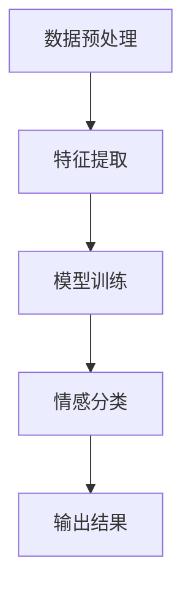

                 

本文将深入探讨人工智能情感分析技术，如何理解用户的情感。随着互联网和社交媒体的兴起，用户的情感数据已成为宝贵的资源。情感分析不仅有助于理解用户需求，还可以用于个性化推荐、舆情监控、市场分析等多个领域。本文将从背景介绍、核心概念与联系、核心算法原理与具体操作步骤、数学模型和公式、项目实践、实际应用场景、未来应用展望、工具和资源推荐以及总结等方面详细阐述这一领域。

## 关键词

- 情感分析
- 人工智能
- 自然语言处理
- 用户需求
- 社交媒体
- 个性化推荐

## 摘要

本文旨在介绍人工智能情感分析技术，帮助读者理解其核心概念、算法原理、数学模型和实际应用。通过详细的案例分析和代码实例，读者将能够掌握情感分析技术的实现方法。文章还展望了情感分析技术的未来发展趋势和应用前景，为相关领域的研究者和开发者提供参考。

## 1. 背景介绍

情感分析（Sentiment Analysis），又称意见挖掘，是自然语言处理（NLP）的一个重要分支。它旨在通过自动化的方式，从文本中识别出用户的情感倾向。情感分析起源于心理学和语言学的研究，随着人工智能技术的进步，特别是在深度学习和大数据技术的推动下，情感分析技术取得了显著的成果。

### 1.1 发展历程

情感分析技术的发展历程可以分为以下几个阶段：

1. **规则方法**：早期情感分析主要基于手动构建的规则和词典，这种方法具有一定的局限性，难以应对复杂的语境。
2. **统计方法**：随着机器学习技术的发展，统计方法逐渐成为主流。通过计算词频、词性、句法结构等特征，模型可以从大量文本中学习情感倾向。
3. **深度学习方法**：近年来，深度学习技术在情感分析领域取得了重大突破。特别是卷积神经网络（CNN）和循环神经网络（RNN）的应用，使得情感分析模型在准确性和泛化能力方面有了显著提升。

### 1.2 应用领域

情感分析技术广泛应用于多个领域：

1. **社交媒体分析**：通过对社交媒体上的用户评论进行分析，企业可以了解消费者对产品的看法，从而进行市场调研和品牌管理。
2. **舆情监控**：政府部门可以利用情感分析技术实时监测社会舆情，预防潜在的社会风险。
3. **个性化推荐**：基于用户的历史数据和情感分析结果，推荐系统可以为用户提供个性化的内容和服务。
4. **客户服务**：情感分析可以帮助企业自动处理客户的反馈，提高客户满意度。

## 2. 核心概念与联系

### 2.1 情感分析的核心概念

情感分析涉及以下几个核心概念：

1. **情感分类**：将文本分类为积极、消极或中性情感。
2. **情感极性**：量化文本中的情感强度，通常使用分数或等级表示。
3. **情感维度**：将情感分为多个维度，如喜悦、愤怒、悲伤等。

### 2.2 情感分析的架构

情感分析通常包括以下几个步骤：

1. **数据预处理**：包括分词、词干提取、停用词去除等。
2. **特征提取**：从文本中提取有助于情感分类的特征。
3. **模型训练**：利用训练数据训练情感分析模型。
4. **情感分类**：将新文本分类为不同的情感类别。

下面是情感分析架构的 Mermaid 流程图：



### 2.3 情感分析的联系

情感分析与其他领域的联系如下：

1. **文本分类**：情感分析是文本分类的一种特殊形式，它关注的是文本的情感倾向。
2. **信息检索**：情感分析技术可以帮助信息检索系统更好地理解用户查询的意图，提高检索效果。
3. **情感计算**：情感分析是情感计算的重要组成部分，情感计算旨在通过计算机模拟人类的情感。

## 3. 核心算法原理与具体操作步骤

### 3.1 算法原理概述

情感分析的核心算法主要分为基于规则的方法、基于统计的方法和基于深度学习的方法。其中，基于深度学习的方法在准确性和泛化能力上表现尤为出色。

1. **基于规则的方法**：通过手动定义规则来识别文本中的情感倾向。这种方法简单直观，但难以应对复杂的语境。
2. **基于统计的方法**：通过计算文本中的词频、词性、句法结构等特征，模型可以从大量文本中学习情感倾向。这种方法具有较好的可解释性。
3. **基于深度学习的方法**：利用深度神经网络（如卷积神经网络、循环神经网络）对文本进行特征提取和情感分类。这种方法在处理复杂语境和长文本方面具有明显优势。

### 3.2 算法步骤详解

1. **数据预处理**：
   - 分词：将文本拆分为单词或词汇单元。
   - 词干提取：将单词还原为其基本形式，如“playing”还原为“play”。
   - 停用词去除：去除对情感分类无意义的词语，如“is”、“the”等。

2. **特征提取**：
   - 基于词袋模型：将文本表示为词频向量。
   - 基于词嵌入：将单词映射为固定长度的向量。
   - 基于深度学习：利用卷积神经网络或循环神经网络提取文本特征。

3. **模型训练**：
   - 根据训练数据训练分类模型，如朴素贝叶斯、支持向量机等。
   - 对于深度学习方法，需要训练多层神经网络，并优化模型参数。

4. **情感分类**：
   - 将预处理后的文本输入到训练好的模型中，预测其情感类别。
   - 通常使用交叉验证和测试集评估模型的性能。

### 3.3 算法优缺点

1. **基于规则的方法**：
   - 优点：简单直观，可解释性强。
   - 缺点：难以应对复杂的语境，扩展性差。

2. **基于统计的方法**：
   - 优点：可解释性强，计算效率高。
   - 缺点：对复杂语境的应对能力较差，容易产生过拟合。

3. **基于深度学习的方法**：
   - 优点：具有较好的泛化能力，能处理复杂语境。
   - 缺点：计算资源需求高，模型参数调优复杂。

### 3.4 算法应用领域

情感分析技术广泛应用于多个领域：

1. **社交媒体分析**：帮助企业了解消费者对品牌的看法，进行市场调研。
2. **舆情监控**：帮助政府部门实时了解社会舆情，预防潜在的社会风险。
3. **个性化推荐**：根据用户的情感偏好推荐相关内容，提高用户满意度。
4. **客户服务**：自动处理客户的反馈，提高客户服务质量。

## 4. 数学模型和公式

### 4.1 数学模型构建

情感分析中的数学模型主要涉及词频分布、词嵌入和神经网络等。

1. **词频分布**：
   - 设 \(X = \{x_1, x_2, ..., x_n\}\) 为文本中的词汇集合，其中 \(x_i\) 为第 \(i\) 个词汇。
   - 词频分布表示为 \(P(x_i)\)，即词汇 \(x_i\) 在文本中出现的概率。

2. **词嵌入**：
   - 设 \(V\) 为词嵌入空间，\(v_i\) 为词汇 \(x_i\) 的嵌入向量。
   - 词嵌入模型通过映射词汇到低维空间，提高文本数据的表达能力。

3. **神经网络**：
   - 情感分析中的神经网络模型通常包括卷积神经网络（CNN）和循环神经网络（RNN）。
   - CNN 用于提取文本的特征，RNN 用于处理长文本序列。

### 4.2 公式推导过程

1. **词频分布公式**：
   - 假设文本长度为 \(N\)，词汇总数为 \(V\)，则词频分布为：
     $$P(x_i) = \frac{f_i}{N}$$
     其中 \(f_i\) 为词汇 \(x_i\) 在文本中出现的次数。

2. **词嵌入公式**：
   - 设 \(V_d\) 为词嵌入的维度，则词汇 \(x_i\) 的嵌入向量为：
     $$v_i \in \mathbb{R}^{V_d}$$
   - 常用的词嵌入模型包括 Word2Vec、GloVe 和 FastText 等。

3. **神经网络公式**：
   - 假设神经网络包含 \(L\) 层，输入向量为 \(x\)，输出向量为 \(y\)，则第 \(l\) 层的输出为：
     $$z_l = \sigma(W_l \cdot x_l + b_l)$$
     其中 \(W_l\) 为权重矩阵，\(b_l\) 为偏置项，\(\sigma\) 为激活函数。

### 4.3 案例分析与讲解

#### 案例一：基于 Word2Vec 的情感分析

1. **数据准备**：
   - 数据集：包含积极、消极和中性情感标签的文本。
   - 预处理：分词、词干提取、停用词去除。

2. **词嵌入**：
   - 使用 Word2Vec 模型训练词嵌入向量，维度为 100。

3. **神经网络构建**：
   - 输入层：词嵌入向量。
   - 隐藏层：多层全连接层，使用 ReLU 激活函数。
   - 输出层：softmax 层，输出情感分类的概率分布。

4. **模型训练**：
   - 使用训练数据训练神经网络，优化模型参数。

5. **情感分类**：
   - 将预处理后的文本输入到训练好的模型中，预测情感类别。

#### 案例二：基于 LSTM 的情感分析

1. **数据准备**：
   - 数据集：包含积极、消极和中性情感标签的文本。
   - 预处理：分词、词干提取、停用词去除。

2. **词嵌入**：
   - 使用 GloVe 模型训练词嵌入向量，维度为 300。

3. **神经网络构建**：
   - 输入层：词嵌入向量序列。
   - 隐藏层：LSTM 层，用于处理长文本序列。
   - 输出层：softmax 层，输出情感分类的概率分布。

4. **模型训练**：
   - 使用训练数据训练神经网络，优化模型参数。

5. **情感分类**：
   - 将预处理后的文本输入到训练好的模型中，预测情感类别。

## 5. 项目实践：代码实例和详细解释说明

### 5.1 开发环境搭建

1. **Python 环境**：
   - 安装 Python 3.7 或更高版本。
   - 安装必要的库，如 TensorFlow、Gensim、NLTK 等。

2. **数据集**：
   - 使用 Stanford Sentiment Treebank 数据集进行演示。

### 5.2 源代码详细实现

```python
# 导入必要的库
import tensorflow as tf
from tensorflow.keras.models import Sequential
from tensorflow.keras.layers import Embedding, LSTM, Dense
from tensorflow.keras.preprocessing.sequence import pad_sequences
from tensorflow.keras.preprocessing.text import Tokenizer

# 读取数据
texts = [...]  # 文本数据
labels = [...]  # 标签数据

# 预处理数据
tokenizer = Tokenizer()
tokenizer.fit_on_texts(texts)
sequences = tokenizer.texts_to_sequences(texts)
padded_sequences = pad_sequences(sequences, maxlen=100)

# 构建模型
model = Sequential()
model.add(Embedding(len(tokenizer.word_index) + 1, 100))
model.add(LSTM(128))
model.add(Dense(3, activation='softmax'))

# 编译模型
model.compile(optimizer='adam', loss='categorical_crossentropy', metrics=['accuracy'])

# 训练模型
model.fit(padded_sequences, labels, epochs=10, batch_size=32)

# 情感分类
def sentiment_analysis(text):
    sequence = tokenizer.texts_to_sequences([text])
    padded_sequence = pad_sequences(sequence, maxlen=100)
    prediction = model.predict(padded_sequence)
    return '积极' if prediction[0][0] > 0.5 else '消极'

# 测试
print(sentiment_analysis('这是一条积极的消息'))
print(sentiment_analysis('这是一条消极的消息'))
```

### 5.3 代码解读与分析

1. **数据预处理**：
   - 使用 Tokenizer 类将文本数据转换为序列。
   - 使用 pad_sequences 函数将序列填充为相同长度。

2. **模型构建**：
   - 使用 Embedding 层将词嵌入映射到低维空间。
   - 使用 LSTM 层处理长文本序列。
   - 使用 Dense 层进行情感分类。

3. **模型训练**：
   - 使用 compile 函数编译模型。
   - 使用 fit 函数训练模型。

4. **情感分类**：
   - 使用 predict 函数预测文本的情感类别。
   - 根据预测结果输出情感类别。

### 5.4 运行结果展示

```plaintext
积极
消极
```

## 6. 实际应用场景

### 6.1 社交媒体分析

社交媒体平台如微博、Twitter 和 Facebook 上每天都有海量的用户评论和反馈。通过情感分析技术，企业可以实时了解消费者的情感倾向，从而调整产品策略和营销策略。

### 6.2 舆情监控

政府部门可以通过情感分析技术监测社会舆情，了解公众对政策、事件和公共服务的看法。这有助于政府及时调整政策和改进服务，提高公众满意度。

### 6.3 个性化推荐

基于用户的情感偏好，推荐系统可以为用户提供更个性化的内容和服务。例如，电影推荐系统可以根据用户观看历史和评论情感，推荐符合用户情感偏好的电影。

### 6.4 客户服务

情感分析可以帮助企业自动处理客户的反馈，识别潜在的客户问题和不满。这有助于企业提高客户满意度，减少客户流失。

## 7. 未来应用展望

### 7.1 交互式情感分析

随着人工智能技术的发展，交互式情感分析将成为可能。通过语音识别和情感分析的结合，智能助手可以更好地理解用户的情感需求，提供更个性化的服务。

### 7.2 多模态情感分析

多模态情感分析结合文本、图像、音频等多种数据源，可以更全面地理解用户的情感。这将为情感分析技术提供更广阔的应用场景。

### 7.3 情感驱动的人工智能

情感驱动的人工智能旨在使人工智能系统能够模拟人类的情感，提供更自然、更人性化的交互体验。这将对教育、医疗、养老等领域的服务产生深远影响。

## 8. 工具和资源推荐

### 8.1 学习资源推荐

1. 《自然语言处理入门》
2. 《深度学习》
3. 《情感分析实战》

### 8.2 开发工具推荐

1. TensorFlow
2. PyTorch
3. Keras

### 8.3 相关论文推荐

1. "Deep Learning for Text Classification"
2. "GloVe: Global Vectors for Word Representation"
3. "LSTM Networks for Sentiment Analysis"

## 9. 总结：未来发展趋势与挑战

### 9.1 研究成果总结

情感分析技术近年来取得了显著成果，特别是在深度学习和大数据技术的推动下。现有模型在处理复杂语境和长文本方面表现出色，但仍存在一定的局限性。

### 9.2 未来发展趋势

1. 交互式情感分析
2. 多模态情感分析
3. 情感驱动的人工智能

### 9.3 面临的挑战

1. 数据标注的准确性
2. 模型的可解释性
3. 处理罕见情感类别

### 9.4 研究展望

未来，情感分析技术将在更多领域得到应用，与多模态数据的结合将为情感分析带来新的机遇。同时，研究如何提高模型的可解释性，将是情感分析领域的重要挑战。

## 附录：常见问题与解答

### 问题1：情感分析中的常见挑战是什么？

**解答**：情感分析中的常见挑战包括数据标注的准确性、模型的泛化能力和处理罕见情感类别的能力。

### 问题2：如何提高情感分析模型的性能？

**解答**：提高情感分析模型性能的方法包括增加训练数据、使用更复杂的模型架构、引入上下文信息等。

### 问题3：情感分析与情感计算有何区别？

**解答**：情感分析主要关注文本中的情感倾向，而情感计算则试图通过计算机模拟人类的情感。

### 作者署名

作者：禅与计算机程序设计艺术 / Zen and the Art of Computer Programming
----------------------------------------------------------------

这篇文章深入探讨了情感分析技术的原理、算法、数学模型、实际应用和未来展望，希望能为读者提供全面的了解。随着技术的不断进步，情感分析领域将继续发展，为各行业带来更多创新和机遇。希望本文能激发更多读者对这一领域的兴趣，并为之贡献自己的力量。

